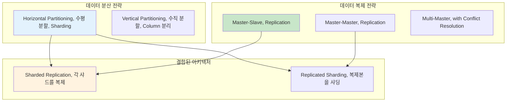

---
tags:
  - Consistent_Hashing
  - Data_Distribution
  - Hash_Sharding
  - Range_Sharding
  - Sharding
  - advanced
  - deep-study
  - hands-on
  - 시스템프로그래밍
difficulty: ADVANCED
learning_time: "8-12시간"
main_topic: "시스템 프로그래밍"
priority_score: 5
---

# 14.2.3: 샤딩 전략

## 서론: 2021년 7월, 데이터베이스가 터진 날

우리 소셜미디어 플랫폼이 갑자기 인기를 끌면서 사용자 수가 10만 명에서 1000만 명으로 폭증했던 때입니다. 단일 MySQL 서버로는 더 이상 감당할 수 없는 상황이 되었습니다.

### 🔥 7월 15일 새벽 3시: 데이터베이스의 한계

```bash
# 기존 시스템 (단일 MySQL)
┌─────────────────────────────────┐
│        MySQL Server             │
│  ┌─────────────────────────────┐│
│  │     Users Table             ││
│  │  - 10,000,000 rows         ││  
│  │  - 500GB data              ││
│  │  - 2GB RAM buffer          ││
│  └─────────────────────────────┘│
└─────────────────────────────────┘

# 성능 지표 (참사 상황)
Query Average Time: 15.3초  # 평소 0.1초
Active Connections: 2000/2000  # 풀 고갈
Lock Wait Time: 45초
Disk I/O: 98% 사용률
CPU: 99% 지속적 사용

# 실제 쿼리 성능
mysql> SELECT * FROM users WHERE id = 5000000;
# 15초 후에 결과 반환... 😱

mysql> INSERT INTO posts (user_id, content) VALUES (1234567, 'Hello');
# 30초 후에 완료... 😭
```

**새벽 3:30 - CTO의 긴급 결정**

"단일 서버로는 한계다. 데이터를 나누자!"

하지만 어떻게 나눌 것인가? 어떻게 복제할 것인가? 데이터 일관성은 어떻게 보장할 것인가?

이때부터**분산 데이터 관리**의 여정이 시작되었습니다.

## 🔄 데이터 분산의 두 가지 축



## 🔪 Sharding: 데이터를 나누는 기술

### 📊 Sharding 전략 비교

#### 1. Range-based Sharding (범위 기반 샤딩)

```python
class RangeBasedSharding:
    def __init__(self):
        self.shards = {
            'shard1': {'range': (0, 3333333), 'server': 'db1.company.com'},
            'shard2': {'range': (3333334, 6666666), 'server': 'db2.company.com'},
            'shard3': {'range': (6666667, 9999999), 'server': 'db3.company.com'}
        }
    
    def get_shard(self, user_id):
        """사용자 ID 범위에 따른 샤드 결정"""
        for shard_name, config in self.shards.items():
            start, end = config['range']
            if start <= user_id <= end:
                return config['server']
        
        raise ValueError(f"No shard found for user_id: {user_id}")
    
    def query_user(self, user_id):
        """사용자 정보 조회"""
        shard_server = self.get_shard(user_id)
        
        # 해당 샤드에서 쿼리 실행
        db = connect_to_database(shard_server)
        result = db.execute("""
            SELECT * FROM users WHERE id = %s
        """, user_id)
        
        return result

# 실제 사용
sharding = RangeBasedSharding()

# 다른 샤드들에 분산 저장
print(sharding.get_shard(1000000))    # db1.company.com
print(sharding.get_shard(5000000))    # db2.company.com  
print(sharding.get_shard(8000000))    # db3.company.com

# 장점: 범위 쿼리 효율적
# SELECT * FROM users WHERE id BETWEEN 1000000 AND 2000000
# → 하나의 샤드에서만 실행

# 단점: Hot Spot 문제
# 새 사용자들이 계속 높은 ID를 가짐 → shard3에 부하 집중
```

**Range Sharding의 Hot Spot 문제 해결**:

```python
class ImprovedRangeSharding:
    def __init__(self):
        # 동적 범위 조정을 위한 메타데이터
        self.shard_metadata = {
            'shard1': {'range': (0, 2000000), 'load': 0.3},
            'shard2': {'range': (2000001, 5000000), 'load': 0.5}, 
            'shard3': {'range': (5000001, 10000000), 'load': 0.9}  # 핫스팟!
        }
    
    def rebalance_shards(self):
        """부하가 높은 샤드 분할"""
        for shard_id, metadata in self.shard_metadata.items():
            if metadata['load'] > 0.8:  # 80% 이상 부하
                print(f"Rebalancing {shard_id} (load: {metadata['load']})")
                
                # 새 샤드 생성
                self.split_shard(shard_id)
    
    def split_shard(self, shard_id):
        """샤드 분할"""
        old_metadata = self.shard_metadata[shard_id]
        start, end = old_metadata['range']
        mid = (start + end) // 2
        
        # 기존 샤드 범위 축소
        self.shard_metadata[shard_id]['range'] = (start, mid)
        
        # 새 샤드 생성  
        new_shard_id = f"{shard_id}_split"
        self.shard_metadata[new_shard_id] = {
            'range': (mid + 1, end),
            'load': 0.0
        }
        
        print(f"Created {new_shard_id} for range ({mid+1}, {end})")
```

#### 2. Hash-based Sharding (해시 기반 샤딩)

```python
import hashlib

class HashBasedSharding:
    def __init__(self, num_shards=8):
        self.num_shards = num_shards
        self.shards = {
            i: f"db{i}.company.com" for i in range(num_shards)
        }
    
    def get_shard(self, key):
        """키의 해시값을 기반으로 샤드 결정"""
        hash_value = int(hashlib.md5(str(key).encode()).hexdigest(), 16)
        shard_id = hash_value % self.num_shards
        return self.shards[shard_id]
    
    def query_user(self, user_id):
        """사용자 정보 조회"""
        shard_server = self.get_shard(user_id)
        
        db = connect_to_database(shard_server)
        result = db.execute("""
            SELECT * FROM users WHERE id = %s
        """, user_id)
        
        return result
    
    def query_by_email(self, email):
        """이메일로 사용자 검색 (모든 샤드 조회 필요)"""
        results = []
        
        # 🚨 문제: 모든 샤드를 조회해야 함
        for shard_id, server in self.shards.items():
            db = connect_to_database(server)
            result = db.execute("""
                SELECT * FROM users WHERE email = %s
            """, email)
            if result:
                results.extend(result)
        
        return results

# 실제 사용
hash_sharding = HashBasedSharding(num_shards=8)

# 동일한 키는 항상 같은 샤드
print(hash_sharding.get_shard("user123"))  # db3.company.com
print(hash_sharding.get_shard("user123"))  # db3.company.com (동일)

# 다른 키는 고르게 분산
print(hash_sharding.get_shard("user456"))  # db7.company.com
print(hash_sharding.get_shard("user789"))  # db1.company.com

# 장점: 균등한 분산, Hot Spot 방지
# 단점: 범위 쿼리 불가, 샤드 추가 시 대규모 재배치 필요
```

**Hash Sharding의 확장성 문제**:

```python
# 문제 상황: 샤드 추가 시 대부분 데이터 이동 필요
class NaiveHashSharding:
    def __init__(self, num_shards):
        self.num_shards = num_shards
    
    def get_shard(self, key):
        return hash(key) % self.num_shards

# 기존: 8개 샤드
old_sharding = NaiveHashSharding(8)
user_123_shard = old_sharding.get_shard("user123")  # shard 3

# 확장: 16개 샤드
new_sharding = NaiveHashSharding(16) 
user_123_new_shard = new_sharding.get_shard("user123")  # shard 11

# 😱 결과: 대부분의 데이터가 다른 샤드로 이동해야 함!
# 확장 시 전체 시스템 다운타임 발생
```

#### 3. Consistent Hashing (일관된 해싱)

이 문제를 해결하는 것이**Consistent Hashing**입니다:

```python
import hashlib
import bisect

class ConsistentHashing:
    def __init__(self, nodes=None, replicas=3):
        self.replicas = replicas  # 가상 노드 개수
        self.ring = {}           # 해시링
        self.sorted_keys = []    # 정렬된 키 목록
        
        if nodes:
            for node in nodes:
                self.add_node(node)
    
    def _hash(self, key):
        """SHA-1 해시 함수"""
        return int(hashlib.sha1(str(key).encode()).hexdigest(), 16)
    
    def add_node(self, node):
        """노드 추가 (가상 노드들 생성)"""
        for i in range(self.replicas):
            virtual_key = self._hash(f"{node}:{i}")
            self.ring[virtual_key] = node
            bisect.insort(self.sorted_keys, virtual_key)
        
        print(f"Added node {node} with {self.replicas} virtual nodes")
    
    def remove_node(self, node):
        """노드 제거"""
        for i in range(self.replicas):
            virtual_key = self._hash(f"{node}:{i}")
            del self.ring[virtual_key]
            self.sorted_keys.remove(virtual_key)
        
        print(f"Removed node {node}")
    
    def get_node(self, key):
        """키에 해당하는 노드 찾기"""
        if not self.ring:
            return None
        
        hash_key = self._hash(key)
        
        # 시계방향으로 첫 번째 노드 찾기
        idx = bisect.bisect_right(self.sorted_keys, hash_key)
        
        # 링의 끝에 도달하면 처음으로 돌아감
        if idx == len(self.sorted_keys):
            idx = 0
        
        return self.ring[self.sorted_keys[idx]]
    
    def get_nodes(self, key, count=3):
        """키에 해당하는 여러 노드 찾기 (복제용)"""
        if not self.ring:
            return []
        
        hash_key = self._hash(key)
        idx = bisect.bisect_right(self.sorted_keys, hash_key)
        
        nodes = []
        seen = set()
        
        for _ in range(count):
            if idx >= len(self.sorted_keys):
                idx = 0
            
            node = self.ring[self.sorted_keys[idx]]
            if node not in seen:
                nodes.append(node)
                seen.add(node)
            
            idx += 1
            
            if len(nodes) == count or len(seen) == len(set(self.ring.values())):
                break
        
        return nodes

# Consistent Hashing 시뮬레이션
def simulate_consistent_hashing():
    print("=== Consistent Hashing 시뮬레이션 ===")
    
    # 초기 4개 노드
    ch = ConsistentHashing(['server1', 'server2', 'server3', 'server4'])
    
    # 테스트 키들의 초기 배치
    test_keys = ['user123', 'user456', 'user789', 'user111', 'user222']
    
    print("\n--- 초기 배치 ---")
    initial_placement = {}
    for key in test_keys:
        node = ch.get_node(key)
        initial_placement[key] = node
        print(f"{key} → {node}")
    
    # 새 노드 추가
    print("\n--- server5 추가 후 ---")
    ch.add_node('server5')
    
    moved_keys = 0
    for key in test_keys:
        old_node = initial_placement[key]
        new_node = ch.get_node(key) 
        
        if old_node != new_node:
            moved_keys += 1
            print(f"{key}: {old_node} → {new_node} ✨ 이동")
        else:
            print(f"{key}: {old_node} (그대로)")
    
    print(f"\n이동된 키: {moved_keys}/{len(test_keys)} ({moved_keys/len(test_keys)*100:.1f}%)")
    print("👍 일반 해싱이라면 80% 이상 이동했을 것!")

# 실행
simulate_consistent_hashing()

# 예상 출력:
# === Consistent Hashing 시뮬레이션 ===
# Added node server1 with 3 virtual nodes
# Added node server2 with 3 virtual nodes  
# Added node server3 with 3 virtual nodes
# Added node server4 with 3 virtual nodes
#
# --- 초기 배치 ---
# user123 → server2
# user456 → server4
# user789 → server1
# user111 → server3
# user222 → server2
#
# --- server5 추가 후 ---
# Added node server5 with 3 virtual nodes
# user123: server2 (그대로)
# user456: server4 (그대로)  
# user789: server5 ✨ 이동
# user111: server3 (그대로)
# user222: server2 (그대로)
#
# 이동된 키: 1/5 (20.0%)
# 👍 일반 해싱이라면 80% 이상 이동했을 것!
```

### 🎯 실전 샤딩 아키텍처 설계

```python
class ProductionShardingSystem:
    """실제 운영 환경을 고려한 샤딩 시스템"""
    
    def __init__(self):
        self.consistent_hash = ConsistentHashing()
        self.shard_metadata = {}  # 샤드별 메타데이터
        self.connection_pools = {}  # 커넥션 풀
        
        # 초기 샤드 설정
        self.initialize_shards()
    
    def initialize_shards(self):
        """초기 샤드 구성"""
        initial_shards = [
            'shard1-primary.db.company.com',
            'shard2-primary.db.company.com', 
            'shard3-primary.db.company.com',
            'shard4-primary.db.company.com'
        ]
        
        for shard in initial_shards:
            self.add_shard(shard)
    
    def add_shard(self, shard_address):
        """새 샤드 추가"""
        # Consistent Hash에 추가
        self.consistent_hash.add_node(shard_address)
        
        # 메타데이터 설정
        self.shard_metadata[shard_address] = {
            'status': 'active',
            'created_at': time.time(),
            'replica_addresses': [
                shard_address.replace('primary', 'replica1'),
                shard_address.replace('primary', 'replica2')
            ]
        }
        
        # 커넥션 풀 생성
        self.connection_pools[shard_address] = create_connection_pool(
            shard_address, 
            pool_size=20
        )
        
        print(f"Shard added: {shard_address}")
    
    def write_data(self, key, data):
        """데이터 쓰기 (복제 포함)"""
        # Primary 샤드 결정
        primary_shard = self.consistent_hash.get_node(key)
        
        # 복제본 샤드들 결정
        replica_shards = self.shard_metadata[primary_shard]['replica_addresses']
        
        try:
            # 1. Primary에 쓰기
            primary_conn = self.connection_pools[primary_shard]
            primary_conn.execute("""
                INSERT INTO data_table (key, value, created_at) 
                VALUES (%s, %s, %s)
            """, key, data, time.time())
            
            # 2. 복제본들에 비동기 쓰기
            for replica in replica_shards:
                self.async_write_to_replica(replica, key, data)
            
            return {'status': 'success', 'shard': primary_shard}
            
        except DatabaseException as e:
            # Primary 장애 시 복제본을 Primary로 승격
            return self.handle_primary_failure(primary_shard, key, data)
    
    def read_data(self, key, consistency_level='eventual'):
        """데이터 읽기 (일관성 레벨 선택)"""
        primary_shard = self.consistent_hash.get_node(key)
        
        if consistency_level == 'strong':
            # 강한 일관성: Primary에서만 읽기
            conn = self.connection_pools[primary_shard]
            result = conn.execute("""
                SELECT value FROM data_table WHERE key = %s
            """, key)
            return result
            
        elif consistency_level == 'eventual':
            # 최종 일관성: 아무 복제본에서 읽기 (성능 우선)
            all_shards = [primary_shard] + \
                        self.shard_metadata[primary_shard]['replica_addresses']
            
            # 가장 빠른 응답을 주는 샤드에서 읽기
            return self.read_from_fastest_replica(all_shards, key)
    
    def read_from_fastest_replica(self, shards, key):
        """여러 복제본 중 가장 빠른 응답 사용"""
        import asyncio
        import concurrent.futures
        
        async def read_from_shard(shard):
            conn = self.connection_pools[shard]
            return conn.execute("""
                SELECT value FROM data_table WHERE key = %s
            """, key)
        
        # 모든 복제본에서 동시에 읽기 시도
        with concurrent.futures.ThreadPoolExecutor() as executor:
            futures = [
                executor.submit(self.read_from_single_shard, shard, key) 
                for shard in shards
            ]
            
            # 첫 번째로 완료된 결과 반환
            for future in concurrent.futures.as_completed(futures):
                try:
                    result = future.result(timeout=1.0)  # 1초 타임아웃
                    return result
                except Exception:
                    continue
        
        raise Exception("All replicas failed")
    
    def rebalance_data(self):
        """데이터 리밸런싱"""
        print("Starting data rebalancing...")
        
        # 각 샤드의 부하 확인
        shard_loads = self.analyze_shard_loads()
        
        for shard, load in shard_loads.items():
            if load > 0.8:  # 80% 이상 부하
                print(f"High load detected on {shard}: {load:.2f}")
                self.scale_out_shard(shard)
    
    def scale_out_shard(self, overloaded_shard):
        """과부하 샤드 확장"""
        # 새 샤드 생성
        new_shard = self.create_new_shard()
        
        # 데이터 이동 (백그라운드)
        self.migrate_data_async(overloaded_shard, new_shard)
        
        print(f"Scaling out {overloaded_shard} → {new_shard}")

# 사용 예시
sharding_system = ProductionShardingSystem()

# 데이터 쓰기 (자동 샤딩)
result = sharding_system.write_data("user:123456", {
    "name": "John Doe",
    "email": "john@example.com",  
    "created_at": "2023-07-15T10:30:00Z"
})
print(f"Write result: {result}")

# 데이터 읽기 (강한 일관성)
user_data = sharding_system.read_data("user:123456", consistency_level='strong')
print(f"User data: {user_data}")

# 데이터 읽기 (최종 일관성 - 빠른 성능)
user_data_fast = sharding_system.read_data("user:123456", consistency_level='eventual')
print(f"User data (fast): {user_data_fast}")
```

## 핵심 요점

### 1. 샤딩 전략별 특성 이해

-**Range Sharding**: 범위 쿼리 효율적이지만 Hot Spot 위험
-**Hash Sharding**: 균등 분산이지만 확장 시 대규모 이동
-**Consistent Hashing**: 확장성이 좋지만 구현 복잡도 증가

### 2. 확장성과 성능의 트레이드오프

- 샤드 수 증가 → 분산 효과 증가, 복잡성 증가
- 가상 노드 수 증가 → 분산 균등성 향상, 오버헤드 증가

### 3. 실전 고려사항

- 커넥션 풀 관리와 비동기 처리 필수
- 샤드 장애 시 자동 Failover 메커니즘
- 부하 모니터링과 동적 리밸런싱

---

**이전**: [분산 데이터 관리 개요](14-02-02-distributed-data.md)  
**다음**: [Replication 패턴](14-05-01-replication-patterns.md)에서 데이터 복제를 통한 가용성 확보 방법을 학습합니다.

## 📚 관련 문서

### 📖 현재 문서 정보

-**난이도**: ADVANCED
-**주제**: 시스템 프로그래밍
-**예상 시간**: 8-12시간

### 🎯 학습 경로

- [📚 ADVANCED 레벨 전체 보기](../learning-paths/advanced/)
- [🏠 메인 학습 경로](../learning-paths/)
- [📋 전체 가이드 목록](../README.md)

### 📂 같은 챕터 (chapter-14-distributed-systems)

- [14.1 분산 시스템 기초 이론 - CAP 정리와 일관성의 과학](./14-01-01-distributed-fundamentals.md)
- [14.2 합의 알고리즘 - 분산된 노드들이 하나가 되는 방법](./14-02-01-consensus-algorithms.md)
- [14.3 분산 데이터 관리 개요](./14-02-02-distributed-data.md)
- [14.3B Replication 패턴과 구현](./14-05-01-replication-patterns.md)
- [14.3C Vector Clock과 충돌 해결](./14-02-04-vector-clocks.md)

### 🏷️ 관련 키워드

`Sharding`, `Consistent_Hashing`, `Range_Sharding`, `Hash_Sharding`, `Data_Distribution`

### ⏭️ 다음 단계 가이드

- 시스템 전체의 관점에서 이해하려 노력하세요
- 다른 고급 주제들과의 연관성을 파악해보세요
