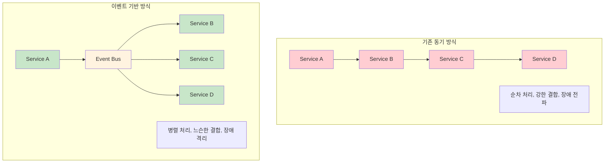

---
tags:
  - Publisher-Subscriber
  - balanced
  - fundamentals
  - medium-read
  - 느슨한결합
  - 분산시스템
  - 비동기통신
  - 이벤트드리븐
  - 이벤트버스
difficulty: FUNDAMENTALS
learning_time: "4-6시간"
main_topic: "분산 시스템"
priority_score: 4
---

# 14.4.2: 이벤트 기반 기초

## 서론: 2023년 5월, 실시간 추천 시스템을 만든 날

우리 스트리밍 플랫폼에서 "사용자가 영화를 시청하는 순간 실시간으로 맞춤형 추천을 제공하자"는 프로젝트가 시작되었습니다. 문제는 이 기능을 구현하려면 7개의 서로 다른 시스템이 실시간으로 협력해야 한다는 것이었습니다.

### 🎬 기존 아키텍처의 한계

```bash
# 기존 동기 방식 (Request-Response)
사용자가 "어벤져스" 시청 시작
    ↓
🎬 Video Service: 시청 기록 저장
    ↓ (동기 호출)
👤 User Service: 사용자 취향 업데이트  
    ↓ (동기 호출)
🤖 ML Service: 추천 모델 재학습
    ↓ (동기 호출)  
📊 Analytics Service: 통계 업데이트
    ↓ (동기 호출)
📧 Notification Service: 친구들에게 알림
    ↓ (동기 호출)
💎 Badge Service: 시청 뱃지 지급
    ↓ (동기 호출) 
🏆 Ranking Service: 랭킹 업데이트

# 문제점들
총 응답 시간: 2.3초 (각 서비스 0.3초씩)
장애 전파: ML Service 다운 시 전체 시청 불가
강한 결합: 새로운 기능 추가 시 기존 코드 수정 필요
확장성 부족: 사용자 증가 시 모든 서비스에 부하 집중
```

**5월 12일 오후 4시: 시스템 마비**

```python
# Video Service 로그
[16:00:15] INFO: User 12345 started watching "Avengers"
[16:00:15] DEBUG: Calling user-service for preference update...
[16:00:20] ERROR: user-service timeout after 5 seconds
[16:00:20] DEBUG: Retrying user-service call...
[16:00:25] ERROR: user-service timeout after 5 seconds
[16:00:25] FATAL: Unable to record watch event - rolling back
[16:00:25] ERROR: Video playback failed for user 12345

# 결과: ML Service 장애로 아무도 영화를 볼 수 없는 상황 😱
```

**5월 15일: Event-Driven Architecture 도입 결정**

이 문제를 해결하기 위해 우리는**Event-Driven Architecture**로 시스템을 재구성했습니다.

## 🌊 Event-Driven Architecture의 핵심 개념

### 📡 이벤트 기반 통신 패러다임



### 🔄 Event-Driven Architecture의 핵심 요소

#### 1. 이벤트 (Event)

시스템에서 발생하는 의미 있는 상태 변화나 사건

```python
# 이벤트 예시
class VideoWatchStartedEvent:
    def __init__(self, user_id, video_id, timestamp):
        self.event_type = "video.watch_started"
        self.user_id = user_id
        self.video_id = video_id
        self.timestamp = timestamp
        self.event_id = str(uuid.uuid4())
```

#### 2. 이벤트 발행자 (Publisher/Producer)

이벤트를 생성하고 발행하는 주체

```python
class VideoService:
    def __init__(self, event_bus):
        self.event_bus = event_bus
    
    def start_watching(self, user_id, video_id):
        # 비즈니스 로직 실행
        self._record_watch_session(user_id, video_id)
        
        # 이벤트 발행 (Fire and Forget)
        event = VideoWatchStartedEvent(user_id, video_id, time.now())
        self.event_bus.publish(event)
        
        # 즉시 응답 반환 (다른 서비스 대기 없음)
        return {"status": "success", "message": "Video started"}
```

#### 3. 이벤트 구독자 (Subscriber/Consumer)

이벤트를 수신하고 처리하는 주체

```python
class RecommendationService:
    def __init__(self, event_bus):
        self.event_bus = event_bus
        # 이벤트 구독 등록
        self.event_bus.subscribe("video.watch_started", self.handle_watch_started)
    
    def handle_watch_started(self, event):
        # 독립적으로 추천 업데이트 (다른 서비스에 영향 없음)
        self._update_user_preferences(event.user_id, event.video_id)
```

#### 4. 이벤트 버스 (Event Bus)

이벤트의 전달과 라우팅을 담당하는 중앙 허브

```python
class SimpleEventBus:
    def __init__(self):
        self.subscribers = {}  # event_type -> [handlers]
    
    def subscribe(self, event_type, handler):
        if event_type not in self.subscribers:
            self.subscribers[event_type] = []
        self.subscribers[event_type].append(handler)
    
    def publish(self, event):
        # 구독자들에게 비동기적으로 이벤트 전달
        handlers = self.subscribers.get(event.event_type, [])
        for handler in handlers:
            threading.Thread(target=handler, args=(event,), daemon=True).start()
```

### 🎯 Event-Driven Architecture의 장점

#### 1. 느슨한 결합 (Loose Coupling)

서비스들이 직접 통신하지 않고 이벤트를 통해서만 상호작용

```python
# Before: 강한 결합
class VideoService:
    def start_watching(self, user_id, video_id):
        self._record_session(user_id, video_id)
        
        # 직접 호출 - 강한 결합
        user_service.update_preferences(user_id, video_id)      # 의존성 1
        ml_service.retrain_model(user_id, video_id)            # 의존성 2
        analytics_service.record_event(user_id, video_id)      # 의존성 3
        notification_service.notify_friends(user_id, video_id) # 의존성 4

# After: 느슨한 결합
class VideoService:
    def start_watching(self, user_id, video_id):
        self._record_session(user_id, video_id)
        
        # 이벤트 발행만 - 다른 서비스 존재 여부 무관
        self.event_bus.publish(VideoWatchStartedEvent(user_id, video_id))
```

#### 2. 확장성 (Scalability)

새로운 기능 추가 시 기존 코드 수정 없이 이벤트 구독만으로 가능

```python
# 새로운 Badge Service 추가 - 기존 코드 수정 없음
class BadgeService:
    def __init__(self, event_bus):
        self.event_bus = event_bus
        # 기존 이벤트를 구독하여 새 기능 추가
        self.event_bus.subscribe("video.watch_started", self.handle_watch_started)
    
    def handle_watch_started(self, event):
        # 시청 뱃지 지급 로직
        self._award_viewing_badge(event.user_id)
```

#### 3. 장애 격리 (Fault Isolation)

한 서비스의 장애가 다른 서비스에 영향을 주지 않음

```python
# ML Service가 다운되어도 비디오 시청은 정상 동작
def simulate_ml_service_failure():
    # ML Service 장애 상황
    print("💥 ML Service is down!")
    
    # Video Service는 여전히 정상 동작
    video_service.start_watching("user123", "video456")
    print("✅ Video started successfully despite ML Service failure")
    
    # 다른 서비스들도 각자 독립적으로 동작
    # ML Service만 이벤트를 처리하지 못함
```

#### 4. 비동기 처리 (Asynchronous Processing)

응답 시간 단축과 사용자 경험 개선

```python
import time

def performance_comparison():
    print("=== 성능 비교 ===")
    
    # 동기 방식 시뮬레이션
    start = time.time()
    # user_service.update_preferences()      # 0.3초
    # ml_service.retrain_model()            # 0.5초  
    # analytics_service.record_event()      # 0.2초
    # notification_service.notify_friends() # 0.3초
    synchronous_time = 1.3  # 총 1.3초
    print(f"동기 방식 응답 시간: {synchronous_time}초")
    
    # 비동기 방식 시뮬레이션
    start = time.time()
    event_bus.publish(VideoWatchStartedEvent("user123", "video456"))
    asynchronous_time = 0.01  # 이벤트 발행만: 0.01초
    print(f"비동기 방식 응답 시간: {asynchronous_time}초")
    
    improvement = ((synchronous_time - asynchronous_time) / synchronous_time) * 100
    print(f"성능 개선: {improvement:.1f}%")
```

### 📊 Event-Driven vs Traditional Architecture 비교

| 측면 | Traditional (동기) | Event-Driven (비동기) |
|------|-------------------|----------------------|
|**응답 시간**| 모든 서비스 처리 시간 합계 | 이벤트 발행 시간만 |
|**결합도**| 강한 결합 (직접 호출) | 느슨한 결합 (이벤트 통신) |
|**확장성**| 기존 코드 수정 필요 | 새 구독자 추가만 |
|**장애 내성**| 연쇄 장애 위험 | 개별 서비스 격리 |
|**일관성**| 강한 일관성 | 최종 일관성 |
|**복잡성**| 단순한 호출 흐름 | 이벤트 추적 복잡 |
|**디버깅**| 쉬운 스택 추적 | 분산 추적 필요 |

## 🔍 Event-Driven Architecture 적용 시나리오

### ✅ 적합한 상황

1.**마이크로서비스 아키텍처**

- 서비스 간 느슨한 결합 필요
- 독립적인 배포와 확장 요구

2.**실시간 시스템**

- 즉각적인 응답이 필요한 사용자 인터페이스
- 실시간 알림과 업데이트

3.**데이터 파이프라인**

- ETL 프로세스
- 실시간 데이터 분석

4.**이벤트 기반 비즈니스 로직**

- 주문 처리, 결제 시스템
- 사용자 행동 추적

### ❌ 부적합한 상황

1.**단순한 CRUD 애플리케이션**

- 복잡성 대비 이익이 적음

2.**강한 일관성이 필수**

- 금융 거래의 원자성이 중요한 경우
- ACID 트랜잭션이 반드시 필요한 경우

3.**실시간 응답이 중요한 조회**

- 사용자가 즉시 결과를 기대하는 검색
- 대화형 사용자 인터페이스

## 핵심 요점

### 1. 패러다임의 전환

동기적 서비스 호출에서 비동기적 이벤트 통신으로의 전환으로 시스템의 결합도를 낮추고 확장성을 높일 수 있습니다.

### 2. 즉시 응답의 중요성

사용자에게는 즉시 응답을 제공하고, 백그라운드에서 필요한 처리를 비동기적으로 수행하여 사용자 경험을 크게 개선할 수 있습니다.

### 3. 장애 격리의 가치

한 서비스의 장애가 전체 시스템에 미치는 영향을 최소화하여 시스템의 안정성과 가용성을 향상시킬 수 있습니다.

---

**이전**: [14.5 Event-Driven Architecture 개요](14-04-01-event-driven-architecture.md)  
**다음**: [Message Queue 구현](14-04-04-message-queue-implementation.md)에서 RabbitMQ를 활용한 실제 구현을 학습합니다.

## 📚 관련 문서

### 📖 현재 문서 정보

-**난이도**: FUNDAMENTALS
-**주제**: 분산 시스템
-**예상 시간**: 4-6시간

### 🎯 학습 경로

- [📚 FUNDAMENTALS 레벨 전체 보기](../learning-paths/fundamentals/)
- [🏠 메인 학습 경로](../learning-paths/)
- [📋 전체 가이드 목록](../README.md)

### 📂 같은 챕터 (chapter-14-distributed-systems)

- [14.1 분산 시스템 기초 이론 - CAP 정리와 일관성의 과학](./14-01-01-distributed-fundamentals.md)
- [14.2 합의 알고리즘 - 분산된 노드들이 하나가 되는 방법](./14-02-01-consensus-algorithms.md)
- [14.3 분산 데이터 관리 개요](./14-02-02-distributed-data.md)
- [14.3A Sharding 전략과 구현](./14-02-03-sharding-strategies.md)
- [14.3B Replication 패턴과 구현](./14-05-01-replication-patterns.md)

### 🏷️ 관련 키워드

`이벤트드리븐`, `비동기통신`, `이벤트버스`, `Publisher-Subscriber`, `느슨한결합`

### ⏭️ 다음 단계 가이드

- 기초 개념을 충분히 이해한 후 INTERMEDIATE 레벨로 진행하세요
- 실습 위주의 학습을 권장합니다
