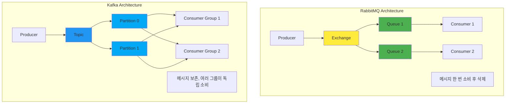

---
tags:
  - advanced
  - cqrs
  - deep-study
  - distributed-systems
  - event-sourcing
  - event-streaming
  - hands-on
  - kafka
  - 인프라스트럭처
difficulty: ADVANCED
learning_time: "12-16시간"
main_topic: "인프라스트럭처"
priority_score: 4
---

# 14.4.5: 이벤트 스트리밍과 소싱

## 🌊 Event Streaming 방식 (Apache Kafka)

**특징**: 이벤트 스트림을 여러 소비자가 독립적으로 소비

```python
from kafka import KafkaProducer, KafkaConsumer
import json
import threading
import time
from typing import Dict, List

class KafkaEventStream:
    """Kafka 기반 이벤트 스트리밍"""
    
    def __init__(self, bootstrap_servers=['localhost:9092']):
        self.bootstrap_servers = bootstrap_servers
        self.producer = None
        self.consumers = {}
        self.connect()
    
    def connect(self):
        """Kafka 프로듀서 연결"""
        try:
            self.producer = KafkaProducer(
                bootstrap_servers=self.bootstrap_servers,
                value_serializer=lambda v: json.dumps(v).encode('utf-8'),
                key_serializer=lambda k: k.encode('utf-8') if k else None,
                acks='all',  # 모든 복제본에 쓰기 확인
                retries=3,
                batch_size=16384,
                linger_ms=10
            )
            print("🚀 Connected to Kafka")
        except Exception as e:
            print(f"⚠️  Kafka not available: {e}")
            self.producer = None
    
    def publish(self, topic: str, event_data: Dict, key: str = None):
        """이벤트 스트림에 발행"""
        if not self.producer:
            print(f"📢 [MOCK] Publishing to {topic}: {event_data['event_type']}")
            return
        
        message = {
            'event_type': event_data.get('event_type', 'unknown'),
            'payload': event_data.get('payload', {}),
            'timestamp': time.time()
        }
        
        try:
            # 비동기 전송
            future = self.producer.send(
                topic=topic,
                value=message,
                key=key
            )
            
            # 전송 확인 (선택적)
            record_metadata = future.get(timeout=10)
            print(f"📢 Event published to {topic} (partition: {record_metadata.partition}, offset: {record_metadata.offset})")
            
        except Exception as e:
            print(f"❌ Failed to publish event: {e}")
    
    def subscribe(self, topics: List[str], group_id: str, handler):
        """이벤트 스트림 구독"""
        if not self.producer:  # Kafka 사용 불가시 Mock
            print(f"🔍 [MOCK] Subscribed to topics {topics} with group {group_id}")
            return
        
        try:
            consumer = KafkaConsumer(
                *topics,
                bootstrap_servers=self.bootstrap_servers,
                group_id=group_id,
                value_deserializer=lambda m: json.loads(m.decode('utf-8')),
                key_deserializer=lambda k: k.decode('utf-8') if k else None,
                auto_offset_reset='latest',  # 최신 메시지부터
                enable_auto_commit=True
            )
            
            self.consumers[group_id] = consumer
            
            def consume_messages():
                print(f"🔍 Starting consumer {group_id} for topics {topics}")
                
                for message in consumer:
                    try:
                        print(f"📨 [{group_id}] Received from {message.topic}: {message.value['event_type']}")
                        
                        # 핸들러 실행
                        handler(message.value, message.topic, message.partition, message.offset)
                        
                    except Exception as e:
                        print(f"❌ [{group_id}] Handler error: {e}")
            
            # 별도 스레드에서 메시지 소비
            consumer_thread = threading.Thread(target=consume_messages, daemon=True)
            consumer_thread.start()
            
        except Exception as e:
            print(f"❌ Failed to create consumer {group_id}: {e}")

# Kafka를 사용한 실시간 스트리밍 플랫폼
class StreamingVideoService:
    """스트리밍 비디오 서비스"""
    
    def __init__(self, event_stream: KafkaEventStream):
        self.event_stream = event_stream
        self.viewing_sessions = {}
    
    def start_streaming(self, user_id: str, video_id: str, quality: str = "1080p"):
        """스트리밍 시작"""
        session_id = f"stream_{user_id}_{int(time.time())}"
        
        session_data = {
            'user_id': user_id,
            'video_id': video_id,
            'quality': quality,
            'start_time': time.time(),
            'session_id': session_id
        }
        
        self.viewing_sessions[session_id] = session_data
        
        print(f"🎥 Streaming started: {video_id} for user {user_id} in {quality}")
        
        # 스트리밍 시작 이벤트 발행 (파티셔닝 키: user_id)
        self.event_stream.publish(
            topic='video-events',
            event_data={
                'event_type': 'streaming.started',
                'payload': session_data
            },
            key=user_id  # 같은 사용자의 이벤트는 같은 파티션으로
        )
        
        return {'status': 'success', 'session_id': session_id}
    
    def update_quality(self, session_id: str, new_quality: str):
        """스트리밍 품질 변경"""
        if session_id not in self.viewing_sessions:
            raise ValueError(f"Session {session_id} not found")
        
        session = self.viewing_sessions[session_id]
        old_quality = session['quality']
        session['quality'] = new_quality
        
        print(f"📊 Quality changed: {old_quality} → {new_quality} for session {session_id}")
        
        # 품질 변경 이벤트 발행
        self.event_stream.publish(
            topic='video-events',
            event_data={
                'event_type': 'streaming.quality_changed',
                'payload': {
                    'session_id': session_id,
                    'user_id': session['user_id'],
                    'old_quality': old_quality,
                    'new_quality': new_quality
                }
            },
            key=session['user_id']
        )
    
    def send_heartbeat(self, session_id: str):
        """하트비트 전송 (시청 진행 상황)"""
        if session_id not in self.viewing_sessions:
            return
        
        session = self.viewing_sessions[session_id]
        
        # 하트비트 이벤트 발행 (고빈도)
        self.event_stream.publish(
            topic='video-heartbeat',  # 별도 토픽 (고빈도 이벤트)
            event_data={
                'event_type': 'streaming.heartbeat',
                'payload': {
                    'session_id': session_id,
                    'user_id': session['user_id'],
                    'current_time': time.time() - session['start_time']
                }
            },
            key=session['user_id']
        )

class RealTimeAnalyticsService:
    """실시간 분석 서비스"""
    
    def __init__(self, event_stream: KafkaEventStream):
        self.event_stream = event_stream
        self.metrics = {
            'concurrent_viewers': 0,
            'quality_distribution': {},
            'user_sessions': {}
        }
        
        # 여러 토픽 구독
        self.event_stream.subscribe(
            topics=['video-events', 'video-heartbeat'],
            group_id='realtime_analytics',
            handler=self.process_event
        )
    
    def process_event(self, message, topic, partition, offset):
        """실시간 이벤트 처리"""
        event_type = message['event_type']
        payload = message['payload']
        
        if event_type == 'streaming.started':
            self._handle_streaming_started(payload)
        elif event_type == 'streaming.quality_changed':
            self._handle_quality_changed(payload)
        elif event_type == 'streaming.heartbeat':
            self._handle_heartbeat(payload)
    
    def _handle_streaming_started(self, payload):
        """스트리밍 시작 처리"""
        self.metrics['concurrent_viewers'] += 1
        
        quality = payload['quality']
        if quality not in self.metrics['quality_distribution']:
            self.metrics['quality_distribution'][quality] = 0
        self.metrics['quality_distribution'][quality] += 1
        
        self.metrics['user_sessions'][payload['session_id']] = payload
        
        print(f"📊 Analytics: Concurrent viewers = {self.metrics['concurrent_viewers']}")
    
    def _handle_quality_changed(self, payload):
        """품질 변경 처리"""
        old_quality = payload['old_quality']
        new_quality = payload['new_quality']
        
        # 품질 분포 업데이트
        self.metrics['quality_distribution'][old_quality] -= 1
        if new_quality not in self.metrics['quality_distribution']:
            self.metrics['quality_distribution'][new_quality] = 0
        self.metrics['quality_distribution'][new_quality] += 1
        
        print(f"📊 Quality distribution updated: {self.metrics['quality_distribution']}")
    
    def _handle_heartbeat(self, payload):
        """하트비트 처리 (세션 활성도 추적)"""
        session_id = payload['session_id']
        if session_id in self.metrics['user_sessions']:
            self.metrics['user_sessions'][session_id]['last_heartbeat'] = time.time()
    
    def get_real_time_metrics(self):
        """실시간 메트릭 조회"""
        # 비활성 세션 정리 (마지막 하트비트 후 30초 경과)
        current_time = time.time()
        inactive_sessions = []
        
        for session_id, session_data in self.metrics['user_sessions'].items():
            if current_time - session_data.get('last_heartbeat', 0) > 30:
                inactive_sessions.append(session_id)
        
        for session_id in inactive_sessions:
            del self.metrics['user_sessions'][session_id]
            self.metrics['concurrent_viewers'] -= 1
        
        return self.metrics.copy()

class PersonalizationService:
    """개인화 서비스 (ML 기반)"""
    
    def __init__(self, event_stream: KafkaEventStream):
        self.event_stream = event_stream
        self.user_profiles = {}
        
        # 이벤트 구독 (별도 컨슈머 그룹)
        self.event_stream.subscribe(
            topics=['video-events'],
            group_id='personalization_ml',
            handler=self.update_user_profile
        )
    
    def update_user_profile(self, message, topic, partition, offset):
        """사용자 프로필 업데이트"""
        event_type = message['event_type']
        
        if event_type == 'streaming.started':
            payload = message['payload']
            user_id = payload['user_id']
            video_id = payload['video_id']
            quality = payload['quality']
            
            # 사용자 프로필 업데이트
            if user_id not in self.user_profiles:
                self.user_profiles[user_id] = {
                    'watched_videos': [],
                    'preferred_quality': '1080p',
                    'viewing_hours': 0
                }
            
            profile = self.user_profiles[user_id]
            profile['watched_videos'].append(video_id)
            profile['preferred_quality'] = quality  # 최근 선택한 품질로 업데이트
            
            # ML 모델 업데이트 (시뮬레이션)
            print(f"🤖 Updating ML model for user {user_id} (watched: {len(profile['watched_videos'])} videos)")
            
            # 개인화된 추천 생성 후 이벤트 발행
            recommendations = self.generate_recommendations(user_id)
            
            self.event_stream.publish(
                topic='recommendation-events',
                event_data={
                    'event_type': 'recommendation.updated',
                    'payload': {
                        'user_id': user_id,
                        'recommendations': recommendations,
                        'model_version': 'v2.1'
                    }
                },
                key=user_id
            )
    
    def generate_recommendations(self, user_id: str) -> List[str]:
        """개인화된 추천 생성"""
        profile = self.user_profiles.get(user_id, {})
        watched_count = len(profile.get('watched_videos', []))
        
        # 간단한 추천 로직
        if watched_count > 5:
            return ['Premium Content A', 'Premium Content B', 'Premium Content C']
        else:
            return ['Popular Content 1', 'Popular Content 2', 'Popular Content 3']

# Event Streaming 시뮬레이션
def simulate_event_streaming():
    print("=== Event Streaming (Kafka) 시뮬레이션 ===")
    
    # Kafka 연결
    event_stream = KafkaEventStream()
    
    # 서비스들 생성
    video_service = StreamingVideoService(event_stream)
    analytics_service = RealTimeAnalyticsService(event_stream)
    personalization_service = PersonalizationService(event_stream)
    
    print("\n--- 스트리밍 시작 ---")
    
    # 여러 사용자가 동시 스트리밍 시작
    users = [
        ('alice', 'video_marvel_endgame', '4K'),
        ('bob', 'video_dark_knight', '1080p'),
        ('carol', 'video_inception', '720p'),
        ('david', 'video_matrix', '1080p')
    ]
    
    sessions = []
    for user_id, video_id, quality in users:
        result = video_service.start_streaming(user_id, video_id, quality)
        sessions.append(result['session_id'])
        time.sleep(0.1)  # 약간의 시간차
    
    print("\n--- 스트리밍 중 이벤트들 ---")
    
    # 품질 변경
    video_service.update_quality(sessions[0], '1080p')  # Alice: 4K → 1080p
    video_service.update_quality(sessions[2], '1080p')  # Carol: 720p → 1080p
    
    # 하트비트 전송 (시뮬레이션)
    for _ in range(3):
        for session_id in sessions:
            video_service.send_heartbeat(session_id)
        time.sleep(1)
    
    print("\n--- 이벤트 처리 대기 ---")
    time.sleep(2)
    
    print("\n--- 실시간 메트릭 확인 ---")
    metrics = analytics_service.get_real_time_metrics()
    print(f"동시 시청자: {metrics['concurrent_viewers']}명")
    print(f"품질 분포: {metrics['quality_distribution']}")
    print(f"개인화 프로필: {len(personalization_service.user_profiles)}명")

# 실행
simulate_event_streaming()
```

## 📊 Event Sourcing: 모든 변경을 이벤트로 저장

### 🗃️ Event Store 구현

모든 데이터 변경을 이벤트로 저장하여 완전한 감사 추적과 시점별 상태 복원을 제공:

```python
from dataclasses import dataclass
from datetime import datetime
from typing import List, Dict, Any, Optional
import json
import threading

@dataclass
class DomainEvent:
    """도메인 이벤트 기본 클래스"""
    aggregate_id: str
    event_type: str
    event_data: Dict[str, Any]
    event_version: int
    timestamp: datetime
    correlation_id: str = None
    causation_id: str = None

class EventStore:
    """이벤트 저장소"""
    
    def __init__(self):
        self.events: Dict[str, List[DomainEvent]] = {}  # aggregate_id -> events
        self.global_sequence = 0
        self.snapshots: Dict[str, Dict] = {}  # aggregate_id -> snapshot
        self.lock = threading.RLock()
        self.subscribers = []
    
    def append_events(self, aggregate_id: str, expected_version: int, events: List[DomainEvent]):
        """이벤트 추가 (낙관적 동시성 제어)"""
        with self.lock:
            current_events = self.events.get(aggregate_id, [])
            current_version = len(current_events)
            
            # 버전 충돌 검사
            if expected_version != current_version:
                raise ConcurrencyException(
                    f"Expected version {expected_version}, but current version is {current_version}"
                )
            
            # 이벤트 추가
            if aggregate_id not in self.events:
                self.events[aggregate_id] = []
            
            for i, event in enumerate(events):
                event.event_version = current_version + i + 1
                self.events[aggregate_id].append(event)
                self.global_sequence += 1
                
                print(f"📝 Event stored: {event.event_type} v{event.event_version} for {aggregate_id}")
            
            # 구독자들에게 알림
            for event in events:
                self._notify_subscribers(event)
    
    def get_events(self, aggregate_id: str, from_version: int = 0) -> List[DomainEvent]:
        """특정 Aggregate의 이벤트 조회"""
        events = self.events.get(aggregate_id, [])
        return [e for e in events if e.event_version > from_version]
    
    def save_snapshot(self, aggregate_id: str, snapshot: Dict[str, Any], version: int):
        """스냅샷 저장 (성능 최적화)"""
        self.snapshots[aggregate_id] = {
            'data': snapshot,
            'version': version,
            'timestamp': datetime.now()
        }
        print(f"📸 Snapshot saved for {aggregate_id} at version {version}")
    
    def get_snapshot(self, aggregate_id: str) -> Optional[Dict]:
        """스냅샷 조회"""
        return self.snapshots.get(aggregate_id)
    
    def subscribe(self, handler):
        """이벤트 구독"""
        self.subscribers.append(handler)
    
    def _notify_subscribers(self, event: DomainEvent):
        """구독자들에게 이벤트 알림"""
        for subscriber in self.subscribers:
            try:
                threading.Thread(
                    target=subscriber,
                    args=(event,),
                    daemon=True
                ).start()
            except Exception as e:
                print(f"❌ Subscriber notification failed: {e}")

class ConcurrencyException(Exception):
    """동시성 충돌 예외"""
    pass

# Event Sourcing을 사용한 은행 계좌 도메인
class BankAccount:
    """은행 계좌 Aggregate"""
    
    def __init__(self, account_id: str):
        self.account_id = account_id
        self.balance = 0.0
        self.is_active = True
        self.overdraft_limit = 0.0
        self.version = 0
        self.uncommitted_events: List[DomainEvent] = []
    
    @classmethod
    def create_account(cls, account_id: str, initial_deposit: float, overdraft_limit: float = 0.0):
        """새 계좌 생성"""
        account = cls(account_id)
        
        # 계좌 생성 이벤트 추가
        event = DomainEvent(
            aggregate_id=account_id,
            event_type="AccountCreated",
            event_data={
                'initial_deposit': initial_deposit,
                'overdraft_limit': overdraft_limit
            },
            event_version=0,
            timestamp=datetime.now()
        )
        
        account._apply_event(event)
        return account
    
    def deposit(self, amount: float, description: str = ""):
        """입금"""
        if amount <= 0:
            raise ValueError("Deposit amount must be positive")
        
        event = DomainEvent(
            aggregate_id=self.account_id,
            event_type="MoneyDeposited",
            event_data={
                'amount': amount,
                'description': description,
                'balance_before': self.balance
            },
            event_version=0,  # 저장시 설정됨
            timestamp=datetime.now()
        )
        
        self._apply_event(event)
    
    def withdraw(self, amount: float, description: str = ""):
        """출금"""
        if amount <= 0:
            raise ValueError("Withdrawal amount must be positive")
        
        # 비즈니스 로직: 잔고 + 마이너스 한도 확인
        available_balance = self.balance + self.overdraft_limit
        if amount > available_balance:
            raise InsufficientFundsException(
                f"Insufficient funds. Available: {available_balance}, Requested: {amount}"
            )
        
        event = DomainEvent(
            aggregate_id=self.account_id,
            event_type="MoneyWithdrawn",
            event_data={
                'amount': amount,
                'description': description,
                'balance_before': self.balance
            },
            event_version=0,
            timestamp=datetime.now()
        )
        
        self._apply_event(event)
    
    def close_account(self):
        """계좌 해지"""
        if not self.is_active:
            raise ValueError("Account is already closed")
        
        if self.balance < 0:
            raise ValueError("Cannot close account with negative balance")
        
        event = DomainEvent(
            aggregate_id=self.account_id,
            event_type="AccountClosed",
            event_data={
                'final_balance': self.balance
            },
            event_version=0,
            timestamp=datetime.now()
        )
        
        self._apply_event(event)
    
    def _apply_event(self, event: DomainEvent):
        """이벤트 적용 (상태 변경)"""
        if event.event_type == "AccountCreated":
            self.balance = event.event_data['initial_deposit']
            self.overdraft_limit = event.event_data['overdraft_limit']
            self.is_active = True
            
        elif event.event_type == "MoneyDeposited":
            self.balance += event.event_data['amount']
            
        elif event.event_type == "MoneyWithdrawn":
            self.balance -= event.event_data['amount']
            
        elif event.event_type == "AccountClosed":
            self.is_active = False
        
        self.uncommitted_events.append(event)
    
    def mark_events_as_committed(self):
        """이벤트 커밋 표시"""
        self.version += len(self.uncommitted_events)
        self.uncommitted_events.clear()
    
    def get_uncommitted_events(self) -> List[DomainEvent]:
        """미커밋 이벤트 조회"""
        return self.uncommitted_events.copy()
    
    @classmethod
    def from_history(cls, account_id: str, events: List[DomainEvent]):
        """이벤트 히스토리로부터 Aggregate 재구성"""
        account = cls(account_id)
        
        for event in events:
            account._apply_event_without_recording(event)
        
        account.version = len(events)
        account.uncommitted_events.clear()
        return account
    
    def _apply_event_without_recording(self, event: DomainEvent):
        """이벤트 적용 (기록 없이 - 히스토리 재구성용)"""
        if event.event_type == "AccountCreated":
            self.balance = event.event_data['initial_deposit']
            self.overdraft_limit = event.event_data['overdraft_limit']
            self.is_active = True
            
        elif event.event_type == "MoneyDeposited":
            self.balance += event.event_data['amount']
            
        elif event.event_type == "MoneyWithdrawn":
            self.balance -= event.event_data['amount']
            
        elif event.event_type == "AccountClosed":
            self.is_active = False

class InsufficientFundsException(Exception):
    pass

# Repository 패턴 with Event Sourcing
class EventSourcedAccountRepository:
    """Event Sourcing 기반 계좌 리포지토리"""
    
    def __init__(self, event_store: EventStore):
        self.event_store = event_store
    
    def save(self, account: BankAccount):
        """계좌 저장 (이벤트 저장)"""
        uncommitted_events = account.get_uncommitted_events()
        
        if uncommitted_events:
            self.event_store.append_events(
                account.account_id,
                account.version,
                uncommitted_events
            )
            account.mark_events_as_committed()
    
    def get_by_id(self, account_id: str) -> Optional[BankAccount]:
        """ID로 계좌 조회 (이벤트 재구성)"""
        # 스냅샷 확인
        snapshot = self.event_store.get_snapshot(account_id)
        
        if snapshot:
            # 스냅샷이 있으면 스냅샷 이후 이벤트만 조회
            account = BankAccount(account_id)
            account.balance = snapshot['data']['balance']
            account.is_active = snapshot['data']['is_active']
            account.overdraft_limit = snapshot['data']['overdraft_limit']
            account.version = snapshot['version']
            
            # 스냅샷 이후 이벤트들 적용
            events_after_snapshot = self.event_store.get_events(account_id, snapshot['version'])
            for event in events_after_snapshot:
                account._apply_event_without_recording(event)
            
            account.version = snapshot['version'] + len(events_after_snapshot)
        else:
            # 스냅샷이 없으면 모든 이벤트로 재구성
            events = self.event_store.get_events(account_id)
            
            if not events:
                return None
                
            account = BankAccount.from_history(account_id, events)
        
        account.uncommitted_events.clear()
        return account
    
    def create_snapshot(self, account_id: str):
        """스냅샷 생성 (성능 최적화)"""
        account = self.get_by_id(account_id)
        if account:
            snapshot_data = {
                'balance': account.balance,
                'is_active': account.is_active,
                'overdraft_limit': account.overdraft_limit
            }
            
            self.event_store.save_snapshot(account_id, snapshot_data, account.version)

# Event Sourcing 시뮬레이션
def simulate_event_sourcing():
    print("=== Event Sourcing 시뮬레이션 ===")
    
    # Event Store와 Repository 생성
    event_store = EventStore()
    account_repo = EventSourcedAccountRepository(event_store)
    
    print("\n--- 계좌 생성 및 거래 ---")
    
    # 새 계좌 생성
    account = BankAccount.create_account("ACC001", initial_deposit=1000.0, overdraft_limit=500.0)
    account_repo.save(account)
    
    print(f"✅ 계좌 생성: ACC001, 초기 잔고: $1000")
    
    # 거래 실행
    transactions = [
        ('deposit', 500.0, '급여 입금'),
        ('withdraw', 200.0, 'ATM 출금'),
        ('withdraw', 800.0, '임대료 지불'),  
        ('deposit', 300.0, '환급'),
        ('withdraw', 1200.0, '대출 상환')  # 마이너스 한도 사용
    ]
    
    for transaction_type, amount, description in transactions:
        try:
            if transaction_type == 'deposit':
                account.deposit(amount, description)
            else:
                account.withdraw(amount, description)
            
            account_repo.save(account)
            print(f"✅ {transaction_type.title()}: ${amount} - {description} (잔고: ${account.balance})")
            
        except Exception as e:
            print(f"❌ {transaction_type.title()} 실패: {e}")
    
    print(f"\n현재 잔고: ${account.balance}")
    
    print("\n--- 이벤트 히스토리 조회 ---")
    events = event_store.get_events("ACC001")
    for event in events:
        print(f"📝 {event.timestamp.strftime('%H:%M:%S')} - {event.event_type}: {event.event_data}")
    
    print("\n--- 특정 시점 상태 복원 ---")
    # 처음 3개 이벤트만으로 상태 복원
    partial_events = events[:3]
    past_account = BankAccount.from_history("ACC001", partial_events)
    print(f"📅 3번째 이벤트 시점 잔고: ${past_account.balance}")
    
    print("\n--- 스냅샷 생성 및 활용 ---")
    account_repo.create_snapshot("ACC001")
    
    # 스냅샷 기반으로 계좌 재구성
    recovered_account = account_repo.get_by_id("ACC001")
    print(f"📸 스냅샷 기반 복구 잔고: ${recovered_account.balance}")
    
    print("\n--- 동시성 테스트 ---")
    try:
        # 동시에 두 개의 거래 시도 (버전 충돌)
        account1 = account_repo.get_by_id("ACC001")
        account2 = account_repo.get_by_id("ACC001")
        
        account1.deposit(100.0, "Transaction 1")
        account2.deposit(200.0, "Transaction 2")
        
        account_repo.save(account1)  # 성공
        account_repo.save(account2)  # 버전 충돌로 실패해야 함
        
    except ConcurrencyException as e:
        print(f"✅ 동시성 충돌 감지: {e}")

# 실행
simulate_event_sourcing()
```

## 🔍 Kafka vs RabbitMQ 심화 비교

### 📊 아키텍처 차이점



### 🎯 사용 사례별 선택 기준

| 요구사항 | RabbitMQ | Kafka |
|----------|----------|-------|
|**작업 큐**| ✅ 완벽 | ❌ 부적합 |
|**실시간 스트리밍**| ⚠️ 제한적 | ✅ 최적 |
|**이벤트 소싱**| ❌ 어려움 | ✅ 완벽 |
|**메시지 보장**| ✅ 강함 | ⚠️ 설정 필요 |
|**순서 보장**| ⚠️ 큐별 | ✅ 파티션별 |
|**처리량**| 중간 | 매우 높음 |
|**운영 복잡성**| 낮음 | 높음 |

## 핵심 요점

### 1. Event Streaming의 강력함

Kafka는 이벤트를 영구적으로 보존하고 여러 소비자가 독립적으로 처리할 수 있어 복잡한 데이터 파이프라인 구축에 적합합니다.

### 2. Event Sourcing의 감사 추적

모든 상태 변경을 이벤트로 저장하면 완전한 감사 추적과 시점별 상태 복원이 가능하지만, 시스템 복잡도가 크게 증가합니다.

### 3. 동시성 제어의 중요성

Event Sourcing에서는 낙관적 동시성 제어와 버전 관리를 통해 데이터 일관성을 보장해야 합니다.

---

**이전**: [Message Queue 구현](14-04-04-message-queue-implementation.md)  
**다음**: [실무 적용과 성숙도 모델](14-04-03-practical-implementation-guide.md)에서 실전 도입 전략을 학습합니다.

## 📚 관련 문서

### 📖 현재 문서 정보

-**난이도**: ADVANCED
-**주제**: 인프라스트럭처
-**예상 시간**: 12-16시간

### 🎯 학습 경로

- [📚 ADVANCED 레벨 전체 보기](../learning-paths/advanced/)
- [🏠 메인 학습 경로](../learning-paths/)
- [📋 전체 가이드 목록](../README.md)

### 📂 같은 챕터 (chapter-14-distributed-systems)

- [14.1 분산 시스템 기초 이론 - CAP 정리와 일관성의 과학](./14-01-01-distributed-fundamentals.md)
- [14.2 합의 알고리즘 - 분산된 노드들이 하나가 되는 방법](./14-02-01-consensus-algorithms.md)
- [14.3 분산 데이터 관리 개요](./14-02-02-distributed-data.md)
- [14.3A Sharding 전략과 구현](./14-02-03-sharding-strategies.md)
- [14.3B Replication 패턴과 구현](./14-05-01-replication-patterns.md)

### 🏷️ 관련 키워드

`kafka`, `event-sourcing`, `cqrs`, `event-streaming`, `distributed-systems`

### ⏭️ 다음 단계 가이드

- 시스템 전체의 관점에서 이해하려 노력하세요
- 다른 고급 주제들과의 연관성을 파악해보세요
