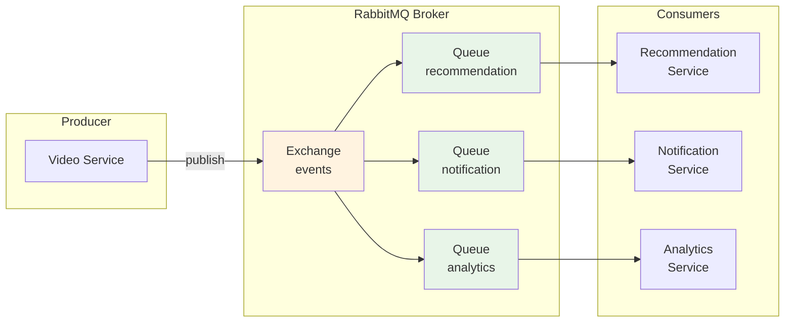

---
tags:
  - AMQP
  - RabbitMQ
  - advanced
  - deep-study
  - distributed-systems
  - event-driven-architecture
  - hands-on
  - message-queue
  - 인프라스트럭처
difficulty: ADVANCED
learning_time: "12-16시간"
main_topic: "인프라스트럭처"
priority_score: 4
---

# 14.5B Message Queue 구현 - RabbitMQ 기반 점대점 통신

## 🚌 Message Queue vs Event Streaming

### 📮 Message Queue 방식 (Apache RabbitMQ)

**특징**: 메시지를 한 번만 소비하는 점대점 통신

```python
import pika
import json
import threading
import time
from typing import Dict, List, Callable

class RabbitMQEventBus:
    """RabbitMQ 기반 이벤트 버스"""
    
    def __init__(self, connection_url="amqp://localhost"):
        self.connection_url = connection_url
        self.connection = None
        self.channel = None
        self.subscribers = {}
        self.connect()
    
    def connect(self):
        """RabbitMQ 연결"""
        self.connection = pika.BlockingConnection(
            pika.URLParameters(self.connection_url)
        )
        self.channel = self.connection.channel()
        print("🐰 Connected to RabbitMQ")
    
    def publish(self, event_type: str, payload: Dict, routing_key: str = ""):
        """이벤트 발행"""
        # Exchange 선언 (Topic 타입 - 라우팅 키 기반)
        self.channel.exchange_declare(
            exchange='events',
            exchange_type='topic',
            durable=True
        )
        
        message = {
            'event_type': event_type,
            'payload': payload,
            'timestamp': time.time()
        }
        
        # 메시지 발행
        self.channel.basic_publish(
            exchange='events',
            routing_key=routing_key or event_type,
            body=json.dumps(message),
            properties=pika.BasicProperties(
                delivery_mode=2  # 메시지 영속화
            )
        )
        
        print(f"📢 Event published: {event_type} (routing_key: {routing_key})")
    
    def subscribe(self, event_pattern: str, handler: Callable, queue_name: str = None):
        """이벤트 구독"""
        if not queue_name:
            queue_name = f"queue_{event_pattern}_{int(time.time())}"
        
        # 큐 선언
        self.channel.queue_declare(queue=queue_name, durable=True)
        
        # 큐를 exchange에 바인딩
        self.channel.queue_bind(
            exchange='events',
            queue=queue_name,
            routing_key=event_pattern
        )
        
        # 메시지 처리 함수
        def callback(ch, method, properties, body):
            try:
                message = json.loads(body)
                print(f"📨 Received: {message['event_type']}")
                
                # 핸들러 실행
                handler(message)
                
                # 메시지 ACK
                ch.basic_ack(delivery_tag=method.delivery_tag)
                
            except Exception as e:
                print(f"❌ Handler error: {e}")
                # NACK - 메시지를 다시 큐에 넣거나 Dead Letter Queue로 전송
                ch.basic_nack(delivery_tag=method.delivery_tag, requeue=False)
        
        # 소비자 설정
        self.channel.basic_qos(prefetch_count=1)  # 한 번에 하나씩 처리
        self.channel.basic_consume(
            queue=queue_name,
            on_message_callback=callback
        )
        
        print(f"🔍 Subscribed to pattern '{event_pattern}' with queue '{queue_name}'")
        
        # 별도 스레드에서 메시지 소비
        def consume():
            self.channel.start_consuming()
        
        consumer_thread = threading.Thread(target=consume, daemon=True)
        consumer_thread.start()

# RabbitMQ를 사용한 영화 스트리밍 서비스
class VideoService:
    """비디오 서비스 (이벤트 발행자)"""
    
    def __init__(self, event_bus: RabbitMQEventBus):
        self.event_bus = event_bus
        self.active_sessions = {}
    
    def start_watching(self, user_id: str, video_id: str, video_title: str):
        """시청 시작 (이벤트 발행)"""
        session_id = f"session_{user_id}_{int(time.time())}"
        
        # 세션 저장 (로컬 상태)
        self.active_sessions[session_id] = {
            'user_id': user_id,
            'video_id': video_id,
            'video_title': video_title,
            'start_time': time.time()
        }
        
        print(f"🎬 User {user_id} started watching '{video_title}'")
        
        # 시청 시작 이벤트 발행
        self.event_bus.publish(
            event_type='video.watch_started',
            payload={
                'user_id': user_id,
                'video_id': video_id,
                'video_title': video_title,
                'session_id': session_id
            },
            routing_key='video.watch_started'
        )
        
        # 즉시 응답 반환 (다른 서비스들은 비동기로 처리)
        return {
            'status': 'success',
            'session_id': session_id,
            'message': 'Video started successfully'
        }

class RecommendationService:
    """추천 서비스 (이벤트 소비자)"""
    
    def __init__(self, event_bus: RabbitMQEventBus):
        self.event_bus = event_bus
        self.user_preferences = {}
        
        # 이벤트 구독
        self.event_bus.subscribe(
            event_pattern='video.watch_started',
            handler=self.handle_watch_started,
            queue_name='recommendation_service_queue'
        )
    
    def handle_watch_started(self, message):
        """시청 시작 이벤트 처리"""
        payload = message['payload']
        user_id = payload['user_id']
        video_title = payload['video_title']
        
        print(f"🤖 Updating recommendations for user {user_id} based on '{video_title}'")
        
        # 사용자 취향 업데이트 (시뮬레이션)
        if user_id not in self.user_preferences:
            self.user_preferences[user_id] = {'genres': [], 'actors': []}
        
        # ML 로직 시뮬레이션 (실제로는 복잡한 추천 알고리즘)
        time.sleep(0.5)  # ML 처리 시간 시뮬레이션
        
        if 'Marvel' in video_title:
            self.user_preferences[user_id]['genres'].append('superhero')
        
        # 추천 업데이트 완료 이벤트 발행
        self.event_bus.publish(
            event_type='recommendation.updated',
            payload={
                'user_id': user_id,
                'recommendations': self.get_recommendations(user_id)
            },
            routing_key='recommendation.updated'
        )
    
    def get_recommendations(self, user_id: str) -> List[str]:
        """사용자 추천 목록 생성"""
        preferences = self.user_preferences.get(user_id, {})
        
        if 'superhero' in preferences.get('genres', []):
            return ['Iron Man', 'Thor', 'Captain America', 'Spider-Man']
        else:
            return ['The Matrix', 'Inception', 'Interstellar', 'The Dark Knight']

class NotificationService:
    """알림 서비스 (이벤트 소비자)"""
    
    def __init__(self, event_bus: RabbitMQEventBus):
        self.event_bus = event_bus
        self.sent_notifications = []
        
        # 여러 이벤트 타입 구독
        self.event_bus.subscribe(
            event_pattern='video.watch_started',
            handler=self.handle_watch_started,
            queue_name='notification_service_queue'
        )
        
        self.event_bus.subscribe(
            event_pattern='recommendation.updated', 
            handler=self.handle_recommendation_updated,
            queue_name='notification_recommendation_queue'
        )
    
    def handle_watch_started(self, message):
        """시청 시작 알림"""
        payload = message['payload']
        user_id = payload['user_id']
        video_title = payload['video_title']
        
        print(f"📧 Sending notification: User {user_id} is watching '{video_title}'")
        
        # 친구들에게 알림 전송 (시뮬레이션)
        notification = {
            'type': 'watch_started',
            'user_id': user_id,
            'message': f"Your friend started watching {video_title}!",
            'timestamp': time.time()
        }
        
        self.sent_notifications.append(notification)
    
    def handle_recommendation_updated(self, message):
        """추천 업데이트 알림"""
        payload = message['payload']
        user_id = payload['user_id']
        recommendations = payload['recommendations']
        
        print(f"📱 Sending push notification: New recommendations for user {user_id}")
        
        notification = {
            'type': 'recommendation_updated',
            'user_id': user_id,
            'message': f"We have new recommendations for you: {', '.join(recommendations[:2])}...",
            'timestamp': time.time()
        }
        
        self.sent_notifications.append(notification)

# 장애 내성을 가진 서비스 (일부 실패해도 시스템 동작)
class AnalyticsService:
    """분석 서비스 (장애 시뮬레이션)"""
    
    def __init__(self, event_bus: RabbitMQEventBus):
        self.event_bus = event_bus
        self.failure_rate = 0.3  # 30% 확률로 실패
        
        self.event_bus.subscribe(
            event_pattern='video.*',  # 모든 비디오 관련 이벤트
            handler=self.handle_video_event,
            queue_name='analytics_service_queue'
        )
    
    def handle_video_event(self, message):
        """비디오 이벤트 분석 (일부러 실패 시뮬레이션)"""
        import random
        
        if random.random() < self.failure_rate:
            print(f"💥 Analytics service failed to process {message['event_type']}")
            raise Exception("Analytics processing failed")
        
        print(f"📊 Analytics processed: {message['event_type']}")

# Message Queue 시뮬레이션  
def simulate_message_queue():
    print("=== Message Queue (RabbitMQ) 시뮬레이션 ===")
    
    # RabbitMQ 연결이 없으면 Mock 사용
    try:
        event_bus = RabbitMQEventBus()
    except Exception:
        print("⚠️  RabbitMQ not available, using mock implementation")
        event_bus = MockEventBus()
    
    # 서비스들 생성
    video_service = VideoService(event_bus)
    recommendation_service = RecommendationService(event_bus)
    notification_service = NotificationService(event_bus)
    analytics_service = AnalyticsService(event_bus)
    
    print("\n--- 영화 시청 시작 ---")
    
    # 사용자들이 영화 시청 시작
    users = [
        ('user123', 'video456', 'Avengers: Endgame'),
        ('user789', 'video123', 'The Dark Knight'),
        ('user456', 'video789', 'Iron Man')
    ]
    
    for user_id, video_id, video_title in users:
        result = video_service.start_watching(user_id, video_id, video_title)
        print(f"✅ {result['message']} (session: {result['session_id']})")
    
    print("\n--- 이벤트 처리 대기 ---")
    time.sleep(3)  # 비동기 이벤트 처리 대기
    
    print(f"\n--- 결과 확인 ---")
    print(f"추천 서비스: {len(recommendation_service.user_preferences)}명의 취향 업데이트")
    print(f"알림 서비스: {len(notification_service.sent_notifications)}개 알림 전송")
    print("📈 Analytics Service: 일부 실패했지만 전체 시스템은 정상 동작")

# Mock Event Bus (RabbitMQ 없을 때 사용)
class MockEventBus:
    def __init__(self):
        self.subscribers = {}
        
    def publish(self, event_type, payload, routing_key=""):
        print(f"📢 [MOCK] Event published: {event_type}")
        # 구독자들에게 전달
        for pattern, handlers in self.subscribers.items():
            if self.matches_pattern(routing_key or event_type, pattern):
                for handler in handlers:
                    try:
                        message = {'event_type': event_type, 'payload': payload}
                        threading.Thread(target=handler, args=(message,), daemon=True).start()
                    except Exception as e:
                        print(f"❌ Handler error: {e}")
    
    def subscribe(self, event_pattern, handler, queue_name=None):
        if event_pattern not in self.subscribers:
            self.subscribers[event_pattern] = []
        self.subscribers[event_pattern].append(handler)
        print(f"🔍 [MOCK] Subscribed to pattern '{event_pattern}'")
    
    def matches_pattern(self, event, pattern):
        # 간단한 패턴 매칭 (실제로는 더 복잡)
        if pattern.endswith('*'):
            return event.startswith(pattern[:-1])
        return event == pattern

# 실행
simulate_message_queue()
```

## 🔧 RabbitMQ 핵심 구조와 개념

### 📊 RabbitMQ 메시지 플로우



### 🎯 Exchange 타입별 라우팅 전략

```python
class ExchangeTypes:
    """RabbitMQ Exchange 타입별 설명"""
    
    def direct_exchange_demo(self):
        """Direct Exchange: 정확한 라우팅 키 매칭"""
        print("=== Direct Exchange ===")
        
        # Exchange 선언
        channel.exchange_declare(exchange='direct_logs', exchange_type='direct')
        
        # 라우팅 키별 메시지 발행
        channel.basic_publish(
            exchange='direct_logs',
            routing_key='error',  # 정확히 'error' 큐로만 전달
            body='Error occurred!'
        )
        
        channel.basic_publish(
            exchange='direct_logs', 
            routing_key='warning',  # 정확히 'warning' 큐로만 전달
            body='Warning message'
        )
    
    def topic_exchange_demo(self):
        """Topic Exchange: 패턴 매칭 라우팅"""
        print("=== Topic Exchange ===")
        
        # Exchange 선언
        channel.exchange_declare(exchange='topic_logs', exchange_type='topic')
        
        # 패턴을 사용한 메시지 발행
        routing_keys = [
            'video.watch_started',    # video.* 패턴에 매칭
            'user.profile_updated',   # user.* 패턴에 매칭
            'payment.transaction.completed',  # payment.*.* 패턴에 매칭
        ]
        
        for key in routing_keys:
            channel.basic_publish(
                exchange='topic_logs',
                routing_key=key,
                body=f'Message for {key}'
            )
    
    def fanout_exchange_demo(self):
        """Fanout Exchange: 모든 큐에 브로드캐스트"""
        print("=== Fanout Exchange ===")
        
        # Exchange 선언
        channel.exchange_declare(exchange='notifications', exchange_type='fanout')
        
        # 라우팅 키 무시하고 모든 바인딩된 큐에 전달
        channel.basic_publish(
            exchange='notifications',
            routing_key='',  # 무시됨
            body='Broadcast message to all services'
        )
```

### 🛡️ 메시지 보장과 내구성

```python
class MessageDurabilityDemo:
    """메시지 내구성과 확인 메커니즘"""
    
    def publisher_confirms(self):
        """Publisher Confirms: 메시지 전달 확인"""
        
        # Confirms 모드 활성화
        channel.confirm_delivery()
        
        try:
            # 메시지 발행
            if channel.basic_publish(
                exchange='events',
                routing_key='user.created',
                body=json.dumps({'user_id': 'user123', 'email': 'user@example.com'}),
                properties=pika.BasicProperties(
                    delivery_mode=2,  # 메시지 영속화
                    mandatory=True    # 라우팅 실패 시 예외
                )
            ):
                print("✅ Message confirmed by broker")
            else:
                print("❌ Message was rejected by broker")
                
        except pika.exceptions.UnroutableError:
            print("❌ Message could not be routed to any queue")
    
    def consumer_acknowledgments(self):
        """Consumer Acknowledgments: 안전한 메시지 소비"""
        
        def safe_message_handler(ch, method, properties, body):
            try:
                # 메시지 처리
                message_data = json.loads(body)
                self._process_user_creation(message_data)
                
                # 성공적으로 처리 완료 - ACK
                ch.basic_ack(delivery_tag=method.delivery_tag)
                print("✅ Message processed and acknowledged")
                
            except json.JSONDecodeError:
                # JSON 파싱 에러 - NACK (재처리하지 않음)
                ch.basic_nack(
                    delivery_tag=method.delivery_tag, 
                    requeue=False  # Dead Letter Queue로 전송
                )
                print("❌ Invalid JSON - sent to DLQ")
                
            except DatabaseConnectionError:
                # 일시적 에러 - NACK (재처리)
                ch.basic_nack(
                    delivery_tag=method.delivery_tag,
                    requeue=True  # 큐에 다시 넣어 재처리
                )
                print("⏳ Database error - message requeued")
                
            except Exception as e:
                # 예상치 못한 에러 - NACK (Dead Letter Queue로)
                ch.basic_nack(
                    delivery_tag=method.delivery_tag,
                    requeue=False
                )
                print(f"💥 Unexpected error - sent to DLQ: {e}")
        
        # 메시지 소비 설정
        channel.basic_consume(
            queue='user_creation_queue',
            on_message_callback=safe_message_handler,
            auto_ack=False  # 수동 ACK 모드
        )
    
    def dead_letter_queue_setup(self):
        """Dead Letter Queue: 실패한 메시지 처리"""
        
        # 메인 큐 선언 (DLQ 설정 포함)
        channel.queue_declare(
            queue='user_creation_queue',
            durable=True,
            arguments={
                'x-dead-letter-exchange': 'dlx',  # Dead Letter Exchange
                'x-dead-letter-routing-key': 'failed',
                'x-message-ttl': 300000,  # 5분 TTL
                'x-max-retries': 3  # 최대 재시도 횟수
            }
        )
        
        # Dead Letter Exchange와 Queue
        channel.exchange_declare(exchange='dlx', exchange_type='direct')
        channel.queue_declare(queue='failed_messages', durable=True)
        channel.queue_bind(
            exchange='dlx',
            queue='failed_messages',
            routing_key='failed'
        )
        
        print("🗂️  Dead Letter Queue configured")
```

### 📊 메시지 큐 모니터링과 운영

```python
class QueueMonitoring:
    """큐 모니터링과 관리"""
    
    def __init__(self, management_api_url):
        self.api_url = management_api_url
    
    def check_queue_health(self, queue_name):
        """큐 상태 확인"""
        # RabbitMQ Management API를 통한 큐 상태 조회
        queue_info = self._get_queue_info(queue_name)
        
        metrics = {
            'message_count': queue_info['messages'],
            'consumer_count': queue_info['consumers'],
            'publish_rate': queue_info.get('message_stats', {}).get('publish_details', {}).get('rate', 0),
            'consume_rate': queue_info.get('message_stats', {}).get('deliver_get_details', {}).get('rate', 0)
        }
        
        # 알람 조건 확인
        if metrics['message_count'] > 1000:
            print(f"⚠️  Queue {queue_name} has {metrics['message_count']} pending messages")
        
        if metrics['consumer_count'] == 0:
            print(f"🚨 Queue {queue_name} has no active consumers!")
        
        if metrics['publish_rate'] > metrics['consume_rate'] * 2:
            print(f"📈 Queue {queue_name} is backing up (publish: {metrics['publish_rate']}, consume: {metrics['consume_rate']})")
        
        return metrics
    
    def setup_monitoring(self):
        """모니터링 설정"""
        import schedule
        
        def monitor_all_queues():
            critical_queues = [
                'user_creation_queue',
                'recommendation_service_queue', 
                'notification_service_queue',
                'analytics_service_queue'
            ]
            
            for queue_name in critical_queues:
                try:
                    metrics = self.check_queue_health(queue_name)
                    print(f"📊 {queue_name}: {metrics}")
                except Exception as e:
                    print(f"❌ Failed to check {queue_name}: {e}")
        
        # 매분마다 큐 상태 확인
        schedule.every().minute.do(monitor_all_queues)
        
        print("🔍 Queue monitoring started")
```

## 💡 Message Queue의 장점과 단점

### ✅ 장점

1. **메시지 보장**: 메시지가 확실히 전달되고 처리됨을 보장
2. **로드 밸런싱**: 여러 소비자가 큐의 메시지를 분산 처리
3. **백프레셔 처리**: 소비자 처리 속도에 맞춰 자동 조절
4. **복잡한 라우팅**: Exchange를 통한 유연한 메시지 라우팅

### ❌ 단점

1. **메시지 소모**: 한 번 소비된 메시지는 사라져 재처리 어려움
2. **순서 보장 한계**: 여러 소비자 사용 시 순서 보장 복잡
3. **복잡한 설정**: Exchange, Queue, Binding 설정 복잡
4. **단일 소비자**: 하나의 메시지는 하나의 소비자만 처리

## 핵심 요점

### 1. 안정적인 메시지 전달

RabbitMQ는 Publisher Confirms, Consumer Acknowledgments, Dead Letter Queue 등을 통해 메시지의 안정적인 전달을 보장합니다.

### 2. 유연한 라우팅

Exchange 타입(Direct, Topic, Fanout)을 활용하여 복잡한 메시지 라우팅 패턴을 구현할 수 있습니다.

### 3. 장애 복구 메커니즘

메시지 영속화, 큐 내구성, Dead Letter Queue를 통해 장애 상황에서도 메시지 손실을 방지할 수 있습니다.

---

**이전**: [기초 개념과 패러다임](14-03-event-driven-fundamentals.md)  
**다음**: [Event Streaming과 Event Sourcing](14-19-event-streaming-sourcing.md)에서 Kafka와 Event Sourcing 패턴을 학습합니다.

## 📚 관련 문서

### 📖 현재 문서 정보

- **난이도**: ADVANCED
- **주제**: 인프라스트럭처
- **예상 시간**: 12-16시간

### 🎯 학습 경로

- [📚 ADVANCED 레벨 전체 보기](../learning-paths/advanced/)
- [🏠 메인 학습 경로](../learning-paths/)
- [📋 전체 가이드 목록](../README.md)

### 📂 같은 챕터 (chapter-14-distributed-systems)

- [14.1 분산 시스템 기초 이론 - CAP 정리와 일관성의 과학](./14-01-distributed-fundamentals.md)
- [14.2 합의 알고리즘 - 분산된 노드들이 하나가 되는 방법](./14-10-consensus-algorithms.md)
- [14.3 분산 데이터 관리 개요](./14-11-distributed-data.md)
- [14.3A Sharding 전략과 구현](./14-12-sharding-strategies.md)
- [14.3B Replication 패턴과 구현](./14-50-replication-patterns.md)

### 🏷️ 관련 키워드

`RabbitMQ`, `message-queue`, `event-driven-architecture`, `AMQP`, `distributed-systems`

### ⏭️ 다음 단계 가이드

- 시스템 전체의 관점에서 이해하려 노력하세요
- 다른 고급 주제들과의 연관성을 파악해보세요
