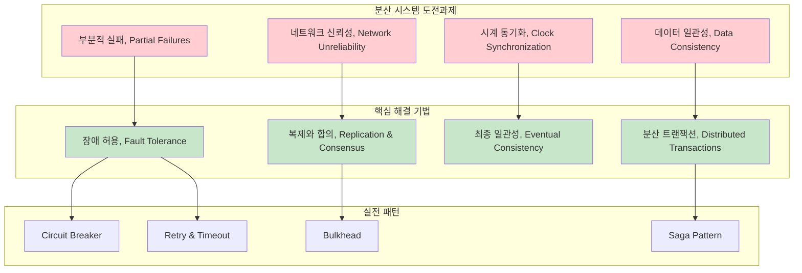

---
tags:
  - DistributedSystems
  - CAP
  - Consistency
  - Microservices
  - Guide
  - Architecture
---

# Chapter 14: Distributed Systems - 분산의 복잡성을 다루는 기술

## 이 장에서 다루는 내용

"단일 서버로는 더 이상 처리할 수 없어요" - 성장하는 서비스가 맞닥뜨리는 현실입니다.

분산 시스템은 현대 소프트웨어의 필수 요소가 되었습니다. 하지만 분산 환경에서는 네트워크 장애, 부분적 실패, 데이터 일관성 등 단일 서버에서는 경험하지 못했던 새로운 문제들이 등장합니다.

이 장에서는 **분산 시스템의 핵심 원리**부터 **실전 아키텍처 패턴**까지, 안정적이고 확장 가능한 분산 시스템을 설계하고 운영하는 방법을 배웁니다.

## 왜 이것을 알아야 하는가?

### 📈 2020년 스타트업의 성장통 - CAP 정리를 몸으로 깨달은 날

제가 스타트업 CTO로 일할 때 겪었던 실제 상황입니다:

**1월: 행복했던 단일 서버 시절**

```bash
# 단순했던 아키텍처
┌─────────────────┐
│   Web Server    │ ← 사용자 1,000명
│   (Node.js)     │
│                 │
│   Database      │
│   (PostgreSQL)  │
└─────────────────┘

# 모든 게 완벽했음
- 트랜잭션 완벽 지원 ✅
- 데이터 일관성 보장 ✅
- 간단한 배포와 디버깅 ✅
```

**6월: 성장의 기쁨과 고통**

```bash
# 갑작스러운 폭발적 성장
사용자: 1,000명 → 100,000명 (100배 증가)
요청: 100 RPS → 10,000 RPS (100배 증가)

# 서버 상황
$ htop
CPU: 100% (지속적)
Memory: 95% 사용
Load Average: 25.3 (코어 4개 서버에서!)

# 데이터베이스 상황
$ pg_stat_activity
active_connections: 950 / 1000 (거의 한계)
longest_query: 45초 (평소 0.1초)
lock_waiting_queries: 234개
```

**7월: 첫 번째 분산화 시도 - naive한 접근**

```bash
# "간단하게 서버만 늘리면 되겠지?"
┌─────────┐  ┌─────────┐  ┌─────────┐
│ Web #1  │  │ Web #2  │  │ Web #3  │
└─────┬───┘  └─────┬───┘  └─────┬───┘
      │            │            │
      └────────────┼────────────┘
                   │
            ┌──────┴──────┐
            │ Database    │
            │ (Single)    │
            └─────────────┘

# 결과: 여전히 병목
# DB가 단일점 장애(SPOF)로 남아있음
```

**8월: Database 분산화 - CAP의 함정에 빠지다**

```bash
# Master-Slave Replication 도입
         ┌─────────┐
    ┌────│ Master  │◄─── 쓰기 요청
    │    │  DB     │
    │    └─────────┘
    │         │
    │    ┌────▼────┐
    │    │ Slave   │◄─── 읽기 요청
    │    │  DB     │
    │    └─────────┘
    │
    │ Replication Lag: 2-5초 😱
    │
    └─ 사용자: "방금 주문했는데 내 주문이 안 보여요!"
```

**9월: CAP 정리의 현실적 충격**

```text
🎯 우리가 원했던 것:
Consistency + Availability + Partition tolerance (모든 것!)

💥 현실:
네트워크 분할 발생 (Partition tolerance는 피할 수 없음)
→ Consistency vs Availability 중 선택해야 함

선택 1: Consistency 우선
→ Master DB 다운 시 읽기/쓰기 모두 중단
→ 사용자: "사이트가 안 돼요!"

선택 2: Availability 우선
→ 분할된 DB들이 서로 다른 데이터 제공
→ 사용자: "데이터가 이상해요!"

🤯 깨달음: "분산 시스템에서 완벽한 것은 없다"
```

### 🎓 분산 시스템의 근본적 도전 과제들

#### 1. 부분적 실패 (Partial Failure)

```bash
# 단일 시스템에서는:
try {
    processOrder(order);
    return success;
} catch (Exception e) {
    return failure;  # 명확한 실패
}

# 분산 시스템에서는:
try {
    result = remoteService.processOrder(order);
    // 타임아웃 발생... 이게 뭘 의미하는가?
    // 1. 네트워크가 느려서 응답이 늦은 것?
    // 2. 서비스가 다운된 것?
    // 3. 주문은 처리됐는데 응답만 못 받은 것?
} catch (TimeoutException e) {
    // 어떻게 처리해야 할까? 🤔
}
```

#### 2. 시계 동기화 문제

```bash
# 분산된 서버들의 시각이 다름
Server A: 2023-10-21 14:30:45.123
Server B: 2023-10-21 14:30:45.890  # 767ms 차이
Server C: 2023-10-21 14:30:44.456  # 1.3초 차이

# "동시에" 발생한 이벤트의 순서를 어떻게 결정할까?
Event 1 (Server A): user_login at 14:30:45.123
Event 2 (Server B): purchase_item at 14:30:45.890
# 로그인 후 구매? 구매 후 로그인? 🤷‍♂️
```

#### 3. 네트워크는 신뢰할 수 없다

```bash
# 네트워크 장애의 다양한 형태
1. 패킷 손실 (Packet Loss)
2. 네트워크 분할 (Network Partition)
3. 높은 지연시간 (High Latency)
4. 패킷 중복 (Packet Duplication)
5. 패킷 순서 바뀜 (Out-of-order Delivery)

# Fallacies of Distributed Computing
1. 네트워크는 안정적이다 ❌
2. 지연시간은 0이다 ❌
3. 대역폭은 무한하다 ❌
4. 네트워크는 안전하다 ❌
5. 토폴로지는 바뀌지 않는다 ❌
6. 관리자는 한 명이다 ❌
7. 전송비용은 0이다 ❌
8. 네트워크는 균질적이다 ❌
```

## 분산 시스템의 핵심 개념과 해결책



## 이 장의 구성

### [14.1 분산 시스템 기초 이론](01-distributed-fundamentals.md)

**"분산 시스템의 본질을 이해하기"**

- 🎯 **CAP 정리**: Consistency, Availability, Partition tolerance의 트레이드오프
- ⏰ **시간과 순서**: Logical Clock, Vector Clock, Hybrid Logical Clock
- 🔄 **일관성 모델**: Strong, Weak, Eventual Consistency의 차이점
- 📊 **PACELC 정리**: CAP를 확장한 현실적 분석 프레임워크

```text
CAP 정리의 실제 적용:
┌─────────────────┬─────────────────┬─────────────────┐
│   CP 시스템     │   AP 시스템     │   CA 시스템     │
├─────────────────┼─────────────────┼─────────────────┤
│ 전통적 RDBMS   │ Cassandra       │ 단일 서버       │
│ MongoDB         │ DynamoDB        │ (이론적으로만)  │
│ Redis Cluster   │ CouchDB         │                 │
└─────────────────┴─────────────────┴─────────────────┘
```

### [14.2 합의 알고리즘 (Consensus)](02-consensus-algorithms.md)

**"분산된 노드들이 어떻게 합의에 도달하는가?"**

- 🗳️ **Raft Algorithm**: 이해하기 쉬운 합의 알고리즘
- 👑 **Leader Election**: 리더 선출 과정과 장애 처리
- 📝 **Log Replication**: 명령어 순서 보장과 상태 동기화
- 🏛️ **Byzantine Fault Tolerance**: 악의적 노드까지 고려한 합의

**실제 Raft 구현 시뮬레이션**:

```go
// Raft 리더 선출 과정
type RaftNode struct {
    id          int
    state       NodeState  // Follower, Candidate, Leader
    currentTerm int
    votedFor    int
    log         []LogEntry
}

func (n *RaftNode) StartElection() {
    n.state = Candidate
    n.currentTerm++
    n.votedFor = n.id

    votes := 1  // 자기 자신에게 투표

    // 다른 노드들에게 투표 요청
    for _, peer := range n.peers {
        if peer.RequestVote(n.currentTerm, n.id) {
            votes++
        }
    }

    // 과반수 득표 시 리더가 됨
    if votes > len(n.peers)/2 {
        n.state = Leader
        n.sendHeartbeats()  // 리더십 유지
    }
}
```

### [14.3 분산 데이터 관리](03-distributed-data.md)

**"데이터를 어떻게 분산 저장하고 관리하나?"**

- 🔄 **Sharding 전략**: Range, Hash, Directory-based 샤딩
- 📋 **Replication 패턴**: Master-Slave, Master-Master, Multi-Master
- 🔧 **Consistent Hashing**: 동적 확장이 가능한 분산 해싱
- 🔄 **Vector Clocks**: 분산 환경에서의 인과관계 추적

**Consistent Hashing 실제 구현**:

```python
import hashlib
import bisect

class ConsistentHash:
    def __init__(self, nodes=None, replicas=3):
        self.replicas = replicas  # 가상 노드 개수
        self.ring = {}
        self.sorted_keys = []

        if nodes:
            for node in nodes:
                self.add_node(node)

    def add_node(self, node):
        """새 노드 추가 (리밸런싱 최소화)"""
        for i in range(self.replicas):
            virtual_key = self.hash(f"{node}:{i}")
            self.ring[virtual_key] = node
            bisect.insort(self.sorted_keys, virtual_key)

    def remove_node(self, node):
        """노드 제거"""
        for i in range(self.replicas):
            virtual_key = self.hash(f"{node}:{i}")
            del self.ring[virtual_key]
            self.sorted_keys.remove(virtual_key)

    def get_node(self, key):
        """키에 해당하는 노드 찾기"""
        if not self.ring:
            return None

        hash_key = self.hash(key)
        idx = bisect.bisect_right(self.sorted_keys, hash_key)

        # 링의 끝에 도달하면 처음으로 돌아감
        if idx == len(self.sorted_keys):
            idx = 0

        return self.ring[self.sorted_keys[idx]]

    def hash(self, key):
        return int(hashlib.md5(key.encode()).hexdigest(), 16)

# 사용 예시
ch = ConsistentHash(['server1', 'server2', 'server3'])
print(ch.get_node('user123'))  # server2
print(ch.get_node('user456'))  # server1

# 새 서버 추가 시에도 대부분의 키는 기존 서버에 그대로 유지
ch.add_node('server4')
```

### [14.4 분산 시스템 패턴](04-distributed-patterns.md)

**"실전에서 사용하는 분산 아키텍처 패턴들"**

- ⚡ **Circuit Breaker**: 연쇄 장애 방지 패턴
- 🔄 **Saga Pattern**: 분산 트랜잭션을 위한 보상 패턴
- 🏗️ **CQRS**: Command와 Query 분리 아키텍처
- 📨 **Event Sourcing**: 이벤트 기반 상태 관리

**Circuit Breaker 실제 구현**:

```java
public class CircuitBreaker {
    private enum State { CLOSED, OPEN, HALF_OPEN }

    private State state = State.CLOSED;
    private int failureCount = 0;
    private long lastFailureTime = 0;
    private final int failureThreshold = 5;
    private final long timeout = 60000; // 60초

    public <T> T call(Supplier<T> supplier) throws Exception {
        if (state == State.OPEN) {
            if (System.currentTimeMillis() - lastFailureTime > timeout) {
                state = State.HALF_OPEN;
                failureCount = 0;
            } else {
                throw new RuntimeException("Circuit breaker is OPEN");
            }
        }

        try {
            T result = supplier.get();
            onSuccess();
            return result;
        } catch (Exception e) {
            onFailure();
            throw e;
        }
    }

    private void onSuccess() {
        failureCount = 0;
        state = State.CLOSED;
    }

    private void onFailure() {
        failureCount++;
        lastFailureTime = System.currentTimeMillis();

        if (failureCount >= failureThreshold) {
            state = State.OPEN;
        }
    }
}

// 사용 예시
CircuitBreaker breaker = new CircuitBreaker();

try {
    String result = breaker.call(() -> {
        return externalService.getData(); // 외부 서비스 호출
    });
} catch (Exception e) {
    return fallbackData(); // 장애 시 대체 데이터
}
```

### [14.5 Event-Driven Architecture](05-event-driven-architecture.md)

**"이벤트로 연결되는 느슨한 결합 시스템"**

- 📮 **Message Queue vs Event Stream**: RabbitMQ vs Kafka 선택 가이드
- 🔄 **Event Sourcing**: 모든 변경을 이벤트로 저장하는 패턴
- 📊 **CQRS with Event Store**: 읽기/쓰기 분리와 이벤트 저장소
- 🌊 **Event Streaming**: 실시간 이벤트 처리 아키텍처

## 🚀 실습 프로젝트: 분산 시스템 구축

### Week 1: Raft 합의 알고리즘 구현

```bash
# Raft 시뮬레이터 구축
$ git clone distributed-lab/raft-implementation
$ cd raft-implementation

# 5노드 Raft 클러스터 실행
$ docker-compose up -d
$ ./raft-simulator --nodes=5

# 리더 선출 과정 관찰
$ curl localhost:8080/status
{
  "node_id": 1,
  "state": "leader",
  "term": 3,
  "cluster_size": 5
}

# 네트워크 분할 시뮬레이션
$ ./network-partition --split="1,2|3,4,5"
# 결과: 과반수(3,4,5)가 새 리더 선출, 소수(1,2)는 follower로 강등
```

### Week 2: 분산 Key-Value Store 구현

```go
// 분산 KV Store 구현
type DistributedKV struct {
    nodes map[string]*Node
    hash  *ConsistentHash
}

func (dkv *DistributedKV) Put(key, value string) error {
    // 복제본 3개 저장
    nodes := dkv.hash.GetNodes(key, 3)

    var errors []error
    for _, node := range nodes {
        if err := node.Put(key, value); err != nil {
            errors = append(errors, err)
        }
    }

    // Quorum Write: 과반수 성공하면 성공
    if len(errors) <= len(nodes)/2 {
        return nil
    }
    return fmt.Errorf("write failed: %v", errors)
}

func (dkv *DistributedKV) Get(key string) (string, error) {
    nodes := dkv.hash.GetNodes(key, 3)

    // Read Repair: 모든 복제본에서 읽어서 일관성 확인
    values := make(map[string]int)
    for _, node := range nodes {
        if value, err := node.Get(key); err == nil {
            values[value]++
        }
    }

    // 가장 많이 나타나는 값 반환 (과반수)
    var mostCommon string
    var maxCount int
    for value, count := range values {
        if count > maxCount {
            mostCommon = value
            maxCount = count
        }
    }

    return mostCommon, nil
}
```

### Week 3: Event-Driven Microservices

```yaml
# Kafka 기반 이벤트 스트리밍 구축
version: '3'
services:
  zookeeper:
    image: confluentinc/cp-zookeeper:7.4.0
    environment:
      ZOOKEEPER_CLIENT_PORT: 2181

  kafka:
    image: confluentinc/cp-kafka:7.4.0
    environment:
      KAFKA_ZOOKEEPER_CONNECT: zookeeper:2181
      KAFKA_ADVERTISED_LISTENERS: PLAINTEXT://localhost:9092

  # 마이크로서비스들
  user-service:
    build: ./services/user
    environment:
      KAFKA_BOOTSTRAP_SERVERS: kafka:9092

  order-service:
    build: ./services/order
    environment:
      KAFKA_BOOTSTRAP_SERVERS: kafka:9092

  payment-service:
    build: ./services/payment
    environment:
      KAFKA_BOOTSTRAP_SERVERS: kafka:9092
```

### Week 4: Chaos Engineering

```bash
# Chaos Monkey를 활용한 장애 테스트
$ chaos-monkey \
  --interval=10m \
  --kill-probability=0.1 \
  --target-services="user-service,order-service"

# 결과 관찰:
# - Circuit Breaker 동작 확인
# - 데이터 일관성 검증
# - 성능 지표 모니터링
# - 복구 시간 측정

# Jepsen을 활용한 정확성 테스트
$ lein run test --workload bank \
  --nodes n1,n2,n3,n4,n5 \
  --time-limit 300
# 분산 트랜잭션의 정확성을 엄밀하게 검증
```

## 💡 분산 시스템 설계 원칙들

### 1. 장애는 정상이다 (Failures are Normal)

```bash
# 단일 서버: MTBF (Mean Time Between Failures) = 3년
# 1000대 서버: 매일 1대씩 고장

설계 원칙:
✅ 장애를 가정하고 설계
✅ 우아한 성능 저하 (Graceful Degradation)
✅ 자동 복구 메커니즘
✅ 장애 격리 (Fault Isolation)
```

### 2. 비동기로 생각하라 (Think Asynchronously)

```javascript
// ❌ 동기적 사고 (분산 시스템에서 위험)
const user = await userService.getUser(userId);
const orders = await orderService.getOrders(user.id);
const payments = await paymentService.getPayments(orders);

// ✅ 비동기적 사고
Promise.all([
    userService.getUser(userId),
    orderService.getOrders(userId),
    paymentService.getPayments(userId)
]).then(([user, orders, payments]) => {
    // 병렬 처리로 지연시간 최소화
});
```

### 3. 일관성보다 가용성 (Availability over Consistency)

```bash
# 강한 일관성 (Strong Consistency)
사용자 경험: "사이트가 너무 자주 안 돼요" 😡
비즈니스 영향: 매출 손실

# 최종 일관성 (Eventual Consistency)
사용자 경험: "가끔 데이터가 약간 이상해요" 🤔
비즈니스 영향: 매출 유지

결론: 대부분의 경우 가용성이 더 중요
```

### 4. 멱등성 보장 (Idempotency)

```http
# 멱등하지 않은 API (위험)
POST /api/orders
{
  "user_id": 123,
  "amount": 100
}
# 재시도 시 중복 주문 발생 가능

# 멱등한 API (안전)
PUT /api/orders/550e8400-e29b-41d4-a716-446655440000
{
  "user_id": 123,
  "amount": 100
}
# idempotency_key로 중복 방지
```

## 🎯 분산 시스템 성숙도 모델

### Level 1: Distributed Monolith

```text
🔴 현재 상황: "분산된 것처럼 보이지만 실제로는 모놀리스"

특징:
- 서비스 간 강결합 (Tight Coupling)
- 동기 호출 위주
- 공유 데이터베이스 사용
- 부분적 장애 시 전체 시스템 영향
```

### Level 2: True Microservices

```text
🟡 현재 상황: "진정한 독립적 서비스"

특징:
- 서비스별 독립적 데이터베이스
- 비동기 통신 (Event-driven)
- Circuit Breaker 패턴 적용
- 개별 서비스 배포 가능
```

### Level 3: Self-Healing Systems

```text
🟢 목표 상황: "자가 치유하는 시스템"

특징:
- 자동 장애 감지 및 복구
- 적응형 리소스 할당
- AI 기반 이상 탐지
- Zero-downtime 운영
```

## 🎯 이 장을 마스터하면

✅ **CAP 정리 이해**: 분산 시스템의 근본적 제약을 이해하고 적절한 트레이드오프를 선택할 수 있습니다
✅ **합의 알고리즘 활용**: Raft, PBFT 등을 이해하고 실제 시스템에 적용할 수 있습니다
✅ **분산 데이터 관리**: 샤딩, 복제, 일관성 모델을 적절히 설계할 수 있습니다
✅ **장애 허용 설계**: Circuit Breaker, Bulkhead 등 패턴으로 안정적 시스템을 구축할 수 있습니다

## 다음 단계

준비되셨나요? [14.1 분산 시스템 기초 이론](01-distributed-fundamentals.md)에서 CAP 정리부터 시작해 분산 시스템의 이론적 기반을 탄탄히 다져보겠습니다.

"분산 시스템은 어렵지만 피할 수 없는 현실입니다." 복잡성을 받아들이고 우아하게 다루는 방법을 함께 배워봅시다! 🌐⚡
