---
tags:
  - Circuit Breaker
  - REST API
  - deep-study
  - hands-on
  - intermediate
  - 마이크로서비스
  - 메시지 큐
  - 이벤트 기반 아키텍처
  - 인프라스트럭처
difficulty: INTERMEDIATE
learning_time: "8-12시간"
main_topic: "인프라스트럭처"
priority_score: 4
---

# 15.3.1: 서비스 간 통신 패턴

## 🎯 마이크로서비스 통신의 핵심 원리

마이크로서비스 아키텍처에서 서비스 간 통신은 전체 시스템의 안정성과 성능을 결정하는 가장 중요한 요소입니다. 단순히 API를 호출하는 것을 넘어서, 장애 격리, 성능 최적화, 확장성을 고려한 통신 전략이 필요합니다.

이 섹션에서는 실제 전자상거래 플랫폼에서 검증된 통신 패턴들을 통해 견고한 마이크로서비스 간 통신을 구현하는 방법을 학습합니다.

## 📚 학습 로드맵

이 통신 패턴 가이드는 3개의 핵심 문서로 구성되어 있습니다:

### 1️⃣ 동기식 통신 - REST API와 Circuit Breaker

-**TypeScript 기반 견고한 REST 클라이언트 구현**

- Circuit Breaker 패턴 적용
- 지능형 재시도 로직 (지수 백오프 + 지터)
- 포괄적인 에러 핸들링 및 메트릭 수집
-**실전 적용 사례**
- JWT 토큰 자동 갱신
- 분산 트레이싱 헤더 관리
- 배치 요청 최적화
- Fallback 메커니즘

### 2️⃣ 비동기식 통신 - 메시지 큐와 이벤트 기반

-**Go 언어 기반 이벤트 시스템 구현**

- RabbitMQ를 활용한 견고한 Publisher/Subscriber
- Publisher Confirm을 통한 메시지 전달 보장
- 자동 재연결 및 Dead Letter Queue 처리
-**실전 운영 고려사항**
- 이벤트 역직렬화 및 타입 안전성
- 미들웨어 패턴을 통한 확장성
- 분산 트레이싱 및 메트릭 통합

### 3️⃣ 통신 패턴 선택과 실전 최적화 가이드

-**통신 방식 선택 기준과 하이브리드 패턴**

- 동기식 vs 비동기식 통신 선택 가이드
- Command-Query 분리 패턴
- 상황별 최적 통신 조합 전략
-**성능 최적화와 장애 대응**
- Connection Pooling, 배치 처리, 캐싱 전략
- Circuit Breaker, Bulkhead, Rate Limiting 조합
- 캐스케이딩 장애 방지 시스템

## 🎯 핵심 개념 비교표

| 측면 | 동기식 통신 | 비동기식 통신 | 하이브리드 패턴 |
|------|-------------|---------------|-----------------|
|**응답성**| 즉시 응답 | 결과적 일관성 | Command-Query 분리 |
|**장애 격리**| Circuit Breaker | Message Queue | 다층 방어 시스템 |
|**확장성**| 제한적 | 높음 | 상황에 따른 조합 |
|**복잡성**| 낮음 | 높음 | 중간 (점진적 도입) |
|**사용처**| 실시간 조회/결제 | 이벤트 처리/분석 | 엔터프라이즈 시스템 |

## 🚀 실전 활용 시나리오

### 전자상거래 주문 처리 시나리오

**동기식 통신 사용 케이스:**

- 사용자 정보 조회 (주문 생성 시 즉시 필요)
- 재고 확인 (실시간 검증 필요)
- 결제 처리 (즉시 성공/실패 확인 필요)

**비동기식 통신 사용 케이스:**

- 주문 생성 이벤트 → 재고 차감, 배송 준비, 알림 전송
- 결제 완료 이벤트 → 영수증 발송, 포인트 적립, 분석 데이터 수집
- 배송 상태 변경 → 고객 알림, 배송 추적 업데이트

```mermaid
graph TD
    A["주문 서비스"] --> B["사용자 서비스 (동기)"] 
    A --> C["재고 서비스 (동기)"]
    A --> D["결제 서비스 (동기)"]
    A --> E["이벤트 큐 (비동기)"]
    
    E --> F["알림 서비스"]
    E --> G["분석 서비스"]
    E --> H["배송 서비스"]
    E --> I["포인트 서비스"]
    
    style A fill:#e1f5fe
    style E fill:#f3e5f5
    style B,C,D fill:#e8f5e8
    style F,G,H,I fill:#fff3e0
```

## 🔗 연관 학습

### 선행 학습

- [분산 시스템 패턴](../chapter-16-distributed-system-patterns/index.md) - 서비스 분할과 경계 설정
- [분산 시스템 기초](../chapter-14-distributed-systems/index.md) - CAP 정리, 일관성 모델

### 후속 학습

- [컨테이너화와 오케스트레이션](./15-03-02-containerization-orchestration.md) - 배포 및 운영 전략
- [관찰가능성과 디버깅](../chapter-12-observability-debugging/index.md) - 운영 관점의 통신 최적화

## 📊 주요 성능 지표

### 동기식 통신 KPI

-**응답 시간**: P95 < 200ms, P99 < 500ms
-**가용성**: 99.9% 이상 (Circuit Breaker 효과)
-**에러율**: < 0.1% (재시도 후 최종 실패율)
-**처리량**: 초당 요청 수 (TPS)

### 비동기식 통신 KPI

-**메시지 처리 지연**: 평균 < 1초
-**메시지 전달률**: 99.99% (DLQ 포함)
-**큐 백로그**: 정상 상태 < 100개
-**처리 순서**: 순서 보장 필요 시 파티션 단위 측정

---

**다음**: [컨테이너화와 오케스트레이션](./15-03-02-containerization-orchestration.md)에서 배포 및 운영 전략을 학습합니다.

## 📚 관련 문서

### 📖 현재 문서 정보

-**난이도**: INTERMEDIATE
-**주제**: 인프라스트럭처
-**예상 시간**: 8-12시간

### 🎯 학습 경로

- [📚 INTERMEDIATE 레벨 전체 보기](../learning-paths/intermediate/)
- [🏠 메인 학습 경로](../learning-paths/)
- [📋 전체 가이드 목록](../README.md)

### 📂 같은 챕터 (chapter-16-distributed-system-patterns)

- [15.1 마이크로서비스 아키텍처 개요](./15-01-01-microservices-architecture-overview.md)
- [15.1A 모놀리스 문제점과 전환 전략](./15-04-01-monolith-to-microservices.md)
- [15.2.1 Docker 컨테이너화 전략](./15-02-01-docker-containerization.md)
- [15.3.2 컨테이너 오케스트레이션](./15-03-02-containerization-orchestration.md)
- [15.4.1 모놀리스에서 마이크로서비스로 전환](./15-04-01-monolith-to-microservices.md)

### 🏷️ 관련 키워드

`마이크로서비스`, `REST API`, `Circuit Breaker`, `메시지 큐`, `이벤트 기반 아키텍처`

### ⏭️ 다음 단계 가이드

- 실무 적용을 염두에 두고 프로젝트에 적용해보세요
- 관련 도구들을 직접 사용해보는 것이 중요합니다
