---
tags:
  - Architecture Transformation
  - Domain Driven Design
  - Microservices
  - Monolith Migration
  - System Decomposition
  - balanced
  - deep-study
  - intermediate
  - 인프라스트럭처
difficulty: INTERMEDIATE
learning_time: "6-8시간"
main_topic: "인프라스트럭처"
priority_score: 5
---

# 15.1A 모놀리스 문제점과 전환 전략

## 🚀 2018년 10월 - Monolith Hell에서 Microservices Heaven으로

제가 전자상거래 플랫폼의 리드 개발자로 일할 때 겪었던 아키텍처 전환의 생생한 기록입니다. 6개월 만에 거대한 모놀리스를 12개의 마이크로서비스로 분해하며 얻은 값진 경험을 공유합니다.

## 💥 모놀리스의 한계점 - 현실적인 고민들

**2018년 10월 15일 - 블랙프라이데이 준비 중**

```bash
🔥 우리가 직면한 현실적 문제들:

📊 시스템 현황:
- 코드베이스: 50만 라인 (Java Spring)
- 개발팀: 25명 (5개 팀)
- 배포 주기: 2주에 1회 (너무 느림!)
- 단일 데이터베이스: PostgreSQL (12TB)
- 서버: 20대 (수직 확장만 가능)

😰 일상적인 고통들:
- 한 팀이 코드를 수정하면 다른 팀 기능이 깨짐
- 결제 모듈 버그로 전체 서비스 다운
- 상품 검색 성능 문제로 주문도 느려짐
- 새 개발자 온보딩: 3주 (코드 이해만으로)
- 테스트 실행 시간: 4시간 (CI/CD 병목)
```

### 팀별 고충 분석

**Frontend 팀의 절망적 상황**

```typescript
// 실제 겪었던 문제상황들
interface FrontendTeamPain {
  codebaseUnderstanding: {
    timeRequired: "3주";
    description: "백엔드 API 하나 수정하려면 전체 시스템을 이해해야 함";
  };
  
  deploymentFear: {
    frequency: "매번";
    description: "프론트엔드 변경사항도 전체 시스템 재배포 필요";
  };
  
  developmentVelocity: {
    beforeMicroservices: "새 기능 3개월";
    afterMicroservices: "새 기능 1-2주";
  };
}

// 실제 경험한 API 호출 문제
const getUserOrders = async (userId: number) => {
  try {
    // 모놀리스에서는 이 하나의 호출이 20개 테이블을 조인
    const response = await api.get(`/api/users/${userId}/orders-with-all-details`);
    
    // 🚨 문제점들:
    // 1. 불필요한 데이터까지 모두 로딩 (상품 상세, 배송 정보, 결제 내역 등)
    // 2. 하나의 서비스 장애가 전체 API 응답 실패로 이어짐
    // 3. 캐싱 전략 적용 어려움 (너무 복잡한 데이터 구조)
    
    return response.data;
  } catch (error) {
    // 어떤 부분에서 실패했는지 알 수 없음
    throw new Error('주문 정보를 가져올 수 없습니다');
  }
};
```

**Backend 팀의 코드 결합도 지옥**

```java
// 실제 모놀리스에서 겪었던 결합도 문제
@Service
public class OrderService {
    
    @Autowired
    private UserService userService;           // 사용자 관리
    @Autowired  
    private ProductService productService;     // 상품 관리
    @Autowired
    private InventoryService inventoryService; // 재고 관리
    @Autowired
    private PaymentService paymentService;     // 결제 처리
    @Autowired
    private ShippingService shippingService;   // 배송 관리
    @Autowired
    private NotificationService notificationService; // 알림 발송
    @Autowired
    private AnalyticsService analyticsService; // 분석 데이터
    
    @Transactional
    public Order createOrder(CreateOrderRequest request) {
        // 🚨 모든 서비스가 강하게 결합됨
        
        // 1. 사용자 검증 - UserService의 DB 스키마 변경이 영향
        User user = userService.validateUser(request.getUserId());
        
        // 2. 상품 정보 조회 - ProductService의 로직 변경이 영향
        List<Product> products = productService.getProductsByIds(request.getProductIds());
        
        // 3. 재고 확인 - InventoryService의 알고리즘 변경이 영향
        boolean available = inventoryService.checkAvailability(request.getItems());
        if (!available) {
            throw new InsufficientStockException("재고가 부족합니다");
        }
        
        // 4. 결제 처리 - PaymentService의 외부 API 변경이 영향
        PaymentResult payment = paymentService.processPayment(
            new PaymentRequest(user.getId(), calculateTotal(products))
        );
        
        // 5. 주문 생성 - 위의 모든 서비스 변경이 영향
        Order order = new Order(user, products, payment);
        order = orderRepository.save(order);
        
        // 6. 후속 처리 - 이것들도 모두 동기적으로 실행
        shippingService.createShippingRequest(order);
        notificationService.sendOrderConfirmation(user, order);
        analyticsService.trackOrderCreated(order);
        
        return order;
    }
}
```

**DevOps 팀의 배포 공포증**

```yaml
# 실제 겪었던 배포 프로세스의 악몽
deployment_process:
  preparation_time: "2일"
  steps:
    - name: "전체 시스템 백업"
      duration: "4시간"
      description: "12TB 데이터베이스 백업"
      
    - name: "통합 테스트 실행"
      duration: "4시간" 
      description: "모든 기능 테스트 (병렬화 불가)"
      failure_rate: "30%"
      
    - name: "스테이징 배포"
      duration: "2시간"
      description: "전체 시스템 재시작 필요"
      
    - name: "사용자 인수 테스트"
      duration: "8시간"
      description: "모든 팀이 자신의 기능 확인"
      
    - name: "프로덕션 배포"
      duration: "3시간"
      description: "다운타임 30분 불가피"
      rollback_time: "1시간"

  problems:
    - "한 팀의 작은 변경도 전체 시스템 배포"
    - "배포 실패 시 모든 팀의 작업이 블로킹"
    - "롤백 시에도 전체 시스템 영향"
    - "핫픽스 배포에도 2일 소요"
```

**QA 팀의 테스트 환경 구성 지옥**

```bash
# 실제 QA 팀이 겪었던 문제들
🧪 테스트 환경 구성의 현실:

환경 구성 시간: 반나절
필요한 리소스: 
- 데이터베이스 서버 (12TB 덤프)
- 웹 애플리케이션 서버 4대
- Redis 클러스터
- Elasticsearch 클러스터
- 외부 API 목킹 서버들

문제점들:
- 결제 모듈 테스트하려면 사용자, 상품, 재고 데이터 필요
- 상품 검색 테스트하려면 전체 Elasticsearch 인덱스 필요  
- 하나의 API 변경 테스트에도 전체 환경 셋업
- 테스트 데이터 관리의 복잡성 (서로 연관된 데이터들)
- 병렬 테스트 불가능 (공유 데이터베이스 때문에)
```

## 🎯 마이크로서비스 전환 결정 - 전략적 접근

### 전환 전 심층 분석

**현재 모놀리스 아키텍처 분석**

```mermaid
graph TD
    subgraph "기존 Monolithic Architecture"
        M1["Web Controller Layer<br/>- User Management<br/>- Product Catalog<br/>- Order Processing<br/>- Payment Gateway<br/>- Inventory Management<br/>- Notification System<br/>- Analytics<br/>- Admin Panel"]
        
        M2["Business Logic Layer<br/>- 모든 비즈니스 로직이 섞여있음<br/>- 서로 강하게 결합됨<br/>- 공유 데이터 모델"]
        
        M3["Data Access Layer<br/>- 단일 대형 데이터베이스<br/>- 복잡한 JOIN 쿼리<br/>- 트랜잭션 복잡성"]
        
        DB["Monolithic Database<br/>- users, products, orders<br/>- payments, inventory<br/>- notifications, analytics"]
    end
    
    M1 --> M2
    M2 --> M3
    M3 --> DB
    
    style M1 fill:#ffcdd2
    style M2 fill:#ffcdd2
    style M3 fill:#ffcdd2
    style DB fill:#ffcdd2
```



### Domain-Driven Design을 통한 서비스 경계 정의

**비즈니스 도메인 식별 과정**

```bash
# 실제 진행했던 도메인 분석 워크숍 결과

📊 E-commerce Platform의 핵심 도메인들:

1. 👤 User Management (사용자 관리)
   비즈니스 가치: 고객 라이프사이클 관리
   핵심 책임:
   - 회원가입, 로그인, 프로필 관리
   - 권한 및 역할 관리
   - 사용자 행동 추적
   
   데이터 소유권:
   - users, user_profiles, user_sessions
   - user_permissions, user_roles
   
2. 🏪 Product Catalog (상품 카탈로그)
   비즈니스 가치: 상품 정보 관리 및 검색
   핵심 책임:
   - 상품 등록, 수정, 삭제
   - 카테고리 관리, 속성 관리
   - 상품 검색 및 추천
   
   데이터 소유권:
   - products, categories, product_attributes
   - product_images, product_reviews
   
3. 📦 Inventory Management (재고 관리)
   비즈니스 가치: 실시간 재고 추적 및 최적화
   핵심 책임:
   - 재고 추적, 예약, 해제
   - 창고 관리, 입출고 관리
   - 재고 부족 알림
   
   데이터 소유권:
   - inventory, inventory_movements
   - warehouses, stock_reservations
   
4. 🛒 Order Processing (주문 처리)
   비즈니스 가치: 주문 생명주기 관리
   핵심 책임:
   - 주문 생성, 수정, 취소
   - 주문 상태 관리
   - 주문 내역 조회
   
   데이터 소유권:
   - orders, order_items, order_history
   - order_status_changes
   
5. 💳 Payment Gateway (결제 게이트웨이)
   비즈니스 가치: 안전한 결제 처리
   핵심 책임:
   - 결제 처리, 환불
   - 다중 결제 수단 지원
   - PCI DSS 컴플라이언스
   
   데이터 소유권:
   - payments, payment_methods
   - payment_transactions, refunds
   
6. 🚛 Shipping (배송)
   비즈니스 가치: 효율적인 배송 관리
   핵심 책임:
   - 배송 추적, 배송업체 연동
   - 배송 정책 관리
   - 배송비 계산
   
   데이터 소유권:
   - shipments, tracking_info
   - shipping_carriers, shipping_rates
   
7. 📢 Notification (알림)
   비즈니스 가치: 고객 소통 및 참여
   핵심 책임:
   - 이메일, SMS, 푸시 알림
   - 알림 템플릿 관리
   - 알림 전송 로그
   
   데이터 소유권:
   - notifications, notification_templates
   - notification_logs, user_preferences
   
8. 📈 Analytics (분석)
   비즈니스 가치: 데이터 기반 의사결정
   핵심 책임:
   - 사용자 행동 분석
   - 비즈니스 메트릭 수집
   - 리포팅 및 대시보드
   
   데이터 소유권:
   - events, user_analytics
   - business_metrics, reports
   
9. ⭐ Review & Rating (리뷰)
   비즈니스 가치: 사회적 증명과 품질 관리
   핵심 책임:
   - 상품 리뷰, 평점
   - 리뷰 검증 및 조회
   - 리뷰 기반 추천
   
   데이터 소유권:
   - reviews, ratings
   - review_votes, review_reports
```

### 서비스 간 관계 및 의존성 분석

**실제 분석했던 서비스 의존성 매트릭스**

```bash
# 서비스 간 의존성 분석 (실제 워크숍 결과)

📊 의존성 매트릭스:
                  User  Product  Order  Payment  Inventory  Shipping  Notify  Analytics  Review
User              -     Read     Read   -        -          -         Write   Write      -
Product           -     -        Read   -        -          -         -       Write      Read
Order             Read  Read     -      Write    Write      Write     Write   Write      -
Payment           Read  -        Read   -        -          -         Write   Write      -
Inventory         -     Read     Read   -        -          -         Write   Write      -
Shipping          Read  Read     Read   -        -          -         Write   Write      -
Notification      Read  Read     Read   Read     Read       Read      -       Write      Read
Analytics         Read  Read     Read   Read     Read       Read      Read    -          Read
Review            Read  Read     -      -        -          -         Write   Write      -

범례:
- Read: 데이터 조회 (동기 호출)
- Write: 이벤트 발생 (비동기 메시징)
- 강한 의존성: Order → Payment, Order → Inventory
- 약한 의존성: 대부분의 Notification 관계
```

### 실제 전환 전략과 우선순위 결정

```bash
# 6개월 전환 계획 (실제 실행했던 단계별 전략)

🗓️ Phase 1: 기반 구축 (1개월)
목표: 인프라와 개발 프로세스 준비
- Docker/Kubernetes 환경 구성
- CI/CD 파이프라인 마이크로서비스 대응
- API Gateway 및 Service Discovery 구축
- 모니터링 및 로깅 시스템 구축

🗓️ Phase 2: 독립성이 높은 서비스 분리 (2개월)
우선 분리 대상:
1. Analytics Service - 읽기 전용, 의존성 낮음
2. Notification Service - 이벤트 기반, 독립적
3. Review Service - 비즈니스 크리티컬하지 않음

전략적 이유:
- 실패해도 핵심 비즈니스에 영향 최소
- 팀의 마이크로서비스 경험 축적
- 기술적 문제점 조기 발견 및 해결

🗓️ Phase 3: 비즈니스 크리티컬 서비스 분리 (2개월)
분리 대상:
1. User Service - 다른 서비스들이 참조
2. Product Service - 상품 정보 중앙화
3. Inventory Service - 실시간 처리 필요

주의사항:
- 데이터 일관성 보장 메커니즘 필요
- Circuit Breaker 패턴 적용 필수
- 롤백 계획 수립

🗓️ Phase 4: 복잡한 트랜잭션 서비스 분리 (1개월)
최종 분리 대상:
1. Order Service - 여러 서비스 조합
2. Payment Service - 높은 일관성 요구
3. Shipping Service - 외부 시스템 연동

핵심 과제:
- 분산 트랜잭션 패턴 적용 (Saga Pattern)
- 데이터 동기화 전략 구현
- 장애 복구 메커니즘 완비
```

## 핵심 요점

### 1. 모놀리스 한계의 실체적 이해

현실적인 문제들: 배포 공포, 팀 간 의존성, 기술 부채 누적, 확장성 한계

### 2. 도메인 주도 설계의 중요성

비즈니스 도메인에 따른 서비스 경계 설정이 기술적 분해보다 우선

### 3. 점진적 전환 전략

Big Bang 방식보다는 단계적 분해를 통한 리스크 최소화

---

**이전**: [마이크로서비스 아키텍처 개요](chapter-15-microservices-architecture/15-01-microservices-architecture.md)  
**다음**: [마이크로서비스 설계 원칙과 패턴](chapter-16-distributed-system-patterns/15-11-design-principles.md)에서 구체적인 설계 방법론을 학습합니다.

## 📚 관련 문서

### 📖 현재 문서 정보

- **난이도**: INTERMEDIATE
- **주제**: 인프라스트럭처
- **예상 시간**: 6-8시간

### 🎯 학습 경로

- [📚 INTERMEDIATE 레벨 전체 보기](../learning-paths/intermediate/)
- [🏠 메인 학습 경로](../learning-paths/)
- [📋 전체 가이드 목록](../README.md)

### 📂 같은 챕터 (chapter-16-system-design-patterns)

- [15.1 마이크로서비스 아키텍처 개요](./15-01-microservices-architecture.md)
- [16.1B 마이크로서비스 설계 원칙과 패턴 개요](../chapter-16-distributed-system-patterns/15-11-design-principles.md)
- [16.1B1 단일 책임 원칙 (Single Responsibility Principle)](../chapter-16-distributed-system-patterns/15-12-1-single-responsibility-principle.md)
- [16.1B1 단일 책임 원칙 (Single Responsibility Principle)](../chapter-16-distributed-system-patterns/15-13-1-single-responsibility.md)
- [16.1B2 Database per Service 패턴](../chapter-16-distributed-system-patterns/15-14-2-database-per-service.md)

### 🏷️ 관련 키워드

`Microservices`, `Monolith Migration`, `Domain Driven Design`, `Architecture Transformation`, `System Decomposition`

### ⏭️ 다음 단계 가이드

- 실무 적용을 염두에 두고 프로젝트에 적용해보세요
- 관련 도구들을 직접 사용해보는 것이 중요합니다
