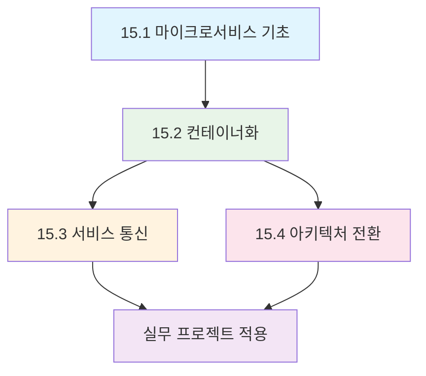

---
tags:
  - Microservices
  - Docker
  - Architecture
  - Containerization
  - System-Design
difficulty: INTERMEDIATE
learning_time: "20-30시간"
main_topic: "마이크로서비스 아키텍처"
priority_score: 5
---

# Chapter 15: 마이크로서비스 아키텍처 - 모듈러 시스템 설계와 컨테이너화

## 📚 이 챕터의 구성

### 15.1 마이크로서비스 기초

- [15-01-01: 마이크로서비스 아키텍처 개요](./15-01-01-microservices-architecture-overview.md)

### 15.2 Docker 컨테이너화 및 개발환경

- [15-02-01: Docker 컨테이너화 전략](./15-02-01-docker-containerization.md)
- [15-02-02: Dockerfile 최적화 전략](./15-02-02-dockerfile-strategies.md)
- [15-02-03: Docker Compose 개발 환경](./15-02-03-docker-compose-environment.md)
- [15-02-04: Docker 기초와 실무 활용](./15-02-04-docker-fundamentals.md)
- [15-02-05: 로컬 개발 환경 구성](./15-02-05-local-development.md)

### 15.3 서비스 간 통신 및 오케스트레이션

- [15-03-01: 서비스 간 통신 패턴](./15-03-01-service-communication.md)
- [15-03-02: 컨테이너 오케스트레이션](./15-03-02-containerization-orchestration.md)

### 15.4 아키텍처 전환 전략

- [15-04-01: 모놀리스에서 마이크로서비스로 전환](./15-04-01-monolith-to-microservices.md)

## 🎯 학습 목표

이 챕터를 통해 다음을 습득할 수 있습니다:

-**마이크로서비스 아키텍처의 핵심 원리와 설계 패턴**
-**Docker를 활용한 마이크로서비스 컨테이너화 전략**
-**서비스 간 통신 방식과 메시징 패턴**
-**모놀리스 애플리케이션의 점진적 분해 방법**
-**Kubernetes를 통한 컨테이너 오케스트레이션**

## 💡 왜 마이크로서비스인가?

현대 소프트웨어 개발에서 마이크로서비스는 다음과 같은 혜택을 제공합니다:

### 확장성과 독립성

- 🚀**독립적 배포**: 서비스별 개별 배포로 배포 리스크 최소화
- 📈**수평 확장**: 필요한 서비스만 선택적으로 확장 가능
- 🔧**기술 다양성**: 서비스별 최적화된 기술 스택 선택

### 개발 생산성

- 👥**팀 자율성**: 팀별 독립적인 개발과 운영
- 🔄**빠른 반복**: 작은 단위의 빠른 개발 주기
- 🛡️**장애 격리**: 하나의 서비스 문제가 전체에 영향을 주지 않음

## 📊 학습 로드맵

### 초보자를 위한 학습 순서

1.**[마이크로서비스 아키텍처 개요](./15-01-01-microservices-architecture-overview.md)**- 기본 개념 이해
2.**[Docker 컨테이너화 전략](./15-02-01-docker-containerization.md)**- 컨테이너 기초
3.**[로컬 개발 환경 구성](./15-02-05-local-development.md)**- 실습 환경 준비
4.**[서비스 간 통신 패턴](./15-03-01-service-communication.md)**- 통신 방식 학습

### 중급자를 위한 학습 순서

1.**[Dockerfile 최적화 전략](./15-02-02-dockerfile-strategies.md)**- 고급 컨테이너 기법
2.**[모놀리스에서 마이크로서비스로 전환](./15-04-01-monolith-to-microservices.md)**- 전환 전략
3.**[컨테이너 오케스트레이션](./15-03-02-containerization-orchestration.md)**- Kubernetes 활용
4.**실무 프로젝트 적용**- 학습한 패턴들의 종합적 활용

## 🔗 관련 챕터

### 📚 선행 학습 권장

- [Chapter 13: 컨테이너와 Kubernetes](../chapter-13-container-kubernetes/index.md) - 컨테이너 기초
- [Chapter 14: 분산 시스템 패턴](../chapter-14-distributed-systems/index.md) - 분산 시스템 기초

### 🚀 후속 학습 권장

- [Chapter 16: 분산 시스템 패턴](../chapter-16-distributed-system-patterns/index.md) - 고급 분산 패턴
- [Chapter 12: 관찰가능성과 디버깅](../chapter-12-observability-debugging/index.md) - 모니터링과 운영

### 🔧 실무 연계

- [Chapter 11: 성능 최적화](../chapter-11-performance-optimization/index.md) - 마이크로서비스 성능 튜닝
- [Chapter 17: 보안 엔지니어링](../chapter-17-security-engineering/index.md) - 분산 시스템 보안

---

**시작하기**: [마이크로서비스 아키텍처 개요](./15-01-01-microservices-architecture-overview.md)에서 마이크로서비스의 기본 개념과 모놀리스와의 차이점을 학습해보세요.
