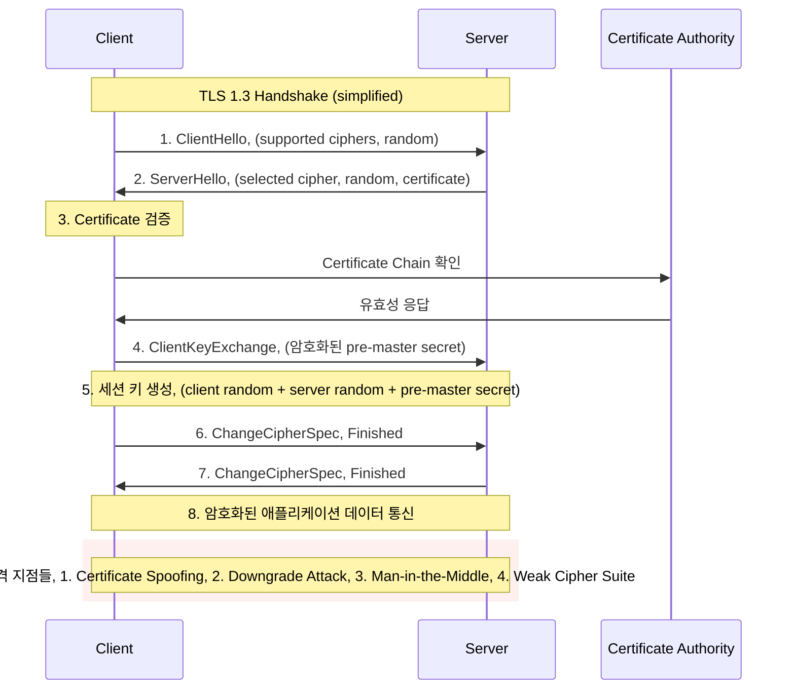
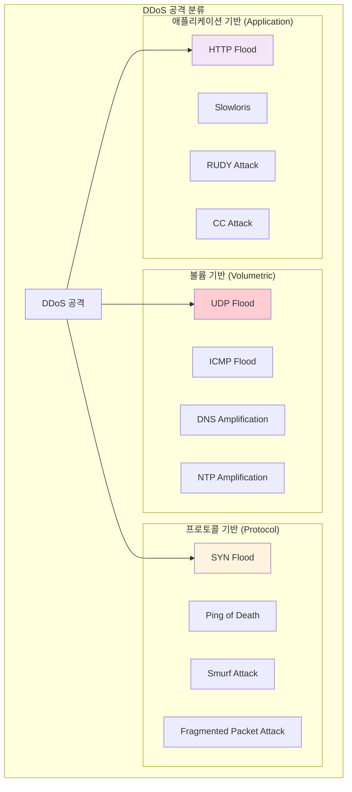

---
tags:
  - Network Security
  - TLS
  - DDoS
  - Firewall
  - Zero Trust
---

# Chapter 15-2: 네트워크 보안 - 적대적 환경에서의 통신 보호

## 이 문서를 읽고 나면 답할 수 있는 질문들

- TLS handshake 과정에서 어떤 공격이 가능한가요?
- DDoS 공격을 어떻게 탐지하고 방어하나요?
- Zero Trust 네트워킹은 어떻게 구현하나요?
- 네트워크 트래픽에서 이상 징후를 어떻게 찾나요?
- mTLS와 Service Mesh 보안은 어떻게 작동하나요?

## 들어가며: 네트워크는 적대적 환경이다

### 🌊 2016년 10월 21일: Mirai 봇넷이 인터넷을 마비시킨 날

2016년 10월 21일, 사상 최대 규모의 DDoS 공격이 발생했습니다. 하지만 이번엔 좀비 PC가 아닌 **IoT 기기들**이 무기가 되었습니다.

**Mirai 봇넷의 공격 메커니즘**:

```bash
# Mirai가 감염시킨 기기들
감염된 기기들:
- IP 카메라: 2,100만 대
- 홈 라우터: 1,800만 대  
- DVR 시스템: 900만 대
- 프린터: 200만 대
- 기타 IoT 기기들

총 감염 기기: 약 6,000만 대! 😱
```

**공격당일 상황**:

```text
06:00 UTC - Dyn DNS 첫 번째 공격 시작
트래픽 규모: 1.2 Tbps (테라비트 per second)

영향받은 서비스들:
- Twitter: 전 세계 접속 불가
- Netflix: 스트리밍 서비스 마비
- Spotify: 음악 재생 불가
- GitHub: 코드 저장소 접근 불가
- Reddit: 커뮤니티 서비스 다운
- PayPal: 결제 시스템 장애

# 동해안 전체가 인터넷에서 단절됨
```

**공격의 혁신적 특징**:

```c
// Mirai 소스코드의 핵심 (단순하지만 효과적)
void attack_tcp_syn(struct attack_target *targ) {
    for (int i = 0; i < targ->netmask; i++) {
        // SYN Flood 공격: 연결 요청만 보내고 응답하지 않음
        send_syn_packet(targ->addr + i, rand_port());
        // 매초 수십만 개의 가짜 연결 요청 전송
    }
}

// 감염된 각 IoT 기기가 동시에 실행
// 6,000만 대 × 초당 1,000 패킷 = 초당 600억 패킷!
```

### 🎯 IoT 기기가 좀비가 된 이유

```bash
# Mirai가 IoT 기기를 감염시키는 방법
1. 기본 로그인 정보 무차별 대입:
   admin/admin
   admin/password
   root/12345
   admin/123456

2. Telnet 서비스 기본 활성화
   - 대부분 IoT 기기가 Telnet 23번 포트 열려있음
   - 암호화되지 않은 평문 통신
   - 기본 패스워드 그대로 사용

3. 펌웨어 업데이트 없음
   - 사용자들이 보안 패치를 모름
   - 자동 업데이트 기능 없음
   - 제조사도 보안에 무관심

결과: 수천만 대의 무방비 기기들이 24시간 대기 중인 공격 무기가 됨
```

이 사건은 네트워크 보안의 중요한 교훈을 남겼습니다:

1. **네트워크는 적대적 환경이다** - 언제든 공격받을 수 있다
2. **기본 보안이 가장 중요하다** - 기본 패스워드, 불필요한 포트
3. **모든 기기가 잠재적 공격 도구다** - IoT, 서버, 네트워크 장비
4. **규모가 곧 위력이다** - 분산된 소규모 공격도 합치면 치명적

## TLS/SSL: 안전한 통신의 기반

### TLS Handshake 과정과 보안 고려사항



### 실제 TLS 구현과 보안 설정

**nginx에서의 최신 TLS 보안 설정**:

```nginx
# nginx.conf - 프로덕션 등급 TLS 설정
server {
    listen 443 ssl http2;
    server_name your-domain.com;
    
    # 인증서 설정
    ssl_certificate /path/to/fullchain.pem;
    ssl_certificate_key /path/to/privkey.pem;
    ssl_trusted_certificate /path/to/chain.pem;
    
    # TLS 버전 제한 (오직 1.2, 1.3만 허용)
    ssl_protocols TLSv1.2 TLSv1.3;
    
    # 강력한 cipher suite만 허용
    ssl_ciphers ECDHE-ECDSA-AES256-GCM-SHA384:ECDHE-RSA-AES256-GCM-SHA384:ECDHE-ECDSA-CHACHA20-POLY1305:ECDHE-RSA-CHACHA20-POLY1305:ECDHE-ECDSA-AES128-GCM-SHA256:ECDHE-RSA-AES128-GCM-SHA256;
    ssl_prefer_server_ciphers off;  # TLS 1.3에서는 클라이언트 선택 우선
    
    # Perfect Forward Secrecy를 위한 DH 파라미터
    ssl_dhparam /path/to/dhparam.pem;
    
    # OCSP Stapling (인증서 상태 확인 최적화)
    ssl_stapling on;
    ssl_stapling_verify on;
    resolver 8.8.8.8 8.8.4.4 valid=300s;
    resolver_timeout 5s;
    
    # 세션 설정
    ssl_session_cache shared:SSL:50m;
    ssl_session_timeout 1d;
    ssl_session_tickets off;  # 보안을 위해 비활성화
    
    # 보안 헤더들
    add_header Strict-Transport-Security "max-age=63072000; includeSubDomains; preload" always;
    add_header X-Frame-Options DENY always;
    add_header X-Content-Type-Options nosniff always;
    add_header X-XSS-Protection "1; mode=block" always;
    add_header Referrer-Policy "strict-origin-when-cross-origin" always;
    
    # CSP (Content Security Policy)
    add_header Content-Security-Policy "default-src 'self'; script-src 'self' 'unsafe-inline'; style-src 'self' 'unsafe-inline'; img-src 'self' data: https:; font-src 'self';" always;
}
```

### TLS 취약점과 공격 기법들

#### 1. SSL Strip 공격 (프로토콜 다운그레이드)

```python
#!/usr/bin/env python3
# sslstrip_demo.py - SSL Strip 공격 시연 (교육 목적)

from scapy.all import *
import re

def process_packet(packet):
    if packet.haslayer(Raw):
        payload = packet[Raw].load.decode('utf-8', errors='ignore')
        
        # HTTPS 링크를 HTTP로 변경
        if 'https://' in payload:
            print(f"[ATTACK] Stripping HTTPS from: {payload[:100]}...")
            modified_payload = payload.replace('https://', 'http://')
            
            # 패킷 수정 (실제로는 더 복잡한 과정 필요)
            packet[Raw].load = modified_payload.encode()
            
    return packet

# 네트워크 인터페이스에서 HTTP 트래픽 감시
# 주의: 교육 목적으로만 사용, 실제 공격은 불법
sniff(filter="tcp port 80", prn=process_packet, iface="wlan0")
```

#### 2. Certificate Pinning으로 중간자 공격 방어

```javascript
// 웹 애플리케이션에서의 Certificate Pinning
class SecureHTTPSClient {
    constructor() {
        this.expectedFingerprints = [
            'sha256/YLh1dUR9y6Kja30RrAn7JKnbQG/uEtLMkBgFF2Fuihg=',  // 현재 인증서
            'sha256/Vjs8r4z+80wjNcr1YKepWQboSIRi63WsWXhIMN+eWys='   // 백업 인증서
        ];
    }
    
    async makeSecureRequest(url) {
        try {
            const response = await fetch(url, {
                method: 'GET',
                headers: {
                    'Accept': 'application/json',
                }
            });
            
            // 실제 구현에서는 브라우저 API로 인증서 fingerprint 확인
            await this.validateCertificatePin(response);
            
            return response;
        } catch (error) {
            console.error('Secure request failed:', error);
            throw new Error('Certificate pinning validation failed');
        }
    }
    
    async validateCertificatePin(response) {
        // Simplified certificate validation
        const serverCert = await this.getCertificateFingerprint(response);
        
        if (!this.expectedFingerprints.includes(serverCert)) {
            throw new Error('Certificate pinning failed - potential MITM attack');
        }
        
        console.log('Certificate pinning validation passed');
    }
    
    async getCertificateFingerprint(response) {
        // 실제 구현에서는 Web Crypto API 또는 서버에서 헤더로 전달
        // 여기서는 시뮬레이션
        return 'sha256/YLh1dUR9y6Kja30RrAn7JKnbQG/uEtLMkBgFF2Fuihg=';
    }
}

// 사용 예시
const client = new SecureHTTPSClient();
client.makeSecureRequest('https://api.example.com/sensitive-data');
```

## DDoS 공격과 방어 전략

### DDoS 공격의 종류별 특징



### 실시간 DDoS 탐지 시스템

```python
#!/usr/bin/env python3
# ddos_detector.py - 실시간 DDoS 탐지 시스템

import time
import threading
from collections import defaultdict, deque
from datetime import datetime, timedelta
import psutil
import logging

class DDoSDetector:
    def __init__(self, thresholds=None):
        self.thresholds = thresholds or {
            'requests_per_minute': 1000,    # 분당 요청 수
            'unique_ips_threshold': 100,    # 고유 IP 수 임계값
            'syn_flood_threshold': 500,     # SYN 패킷 임계값
            'bandwidth_threshold': 100,     # Mbps
        }
        
        # 통계 데이터 저장
        self.request_counts = defaultdict(deque)
        self.ip_requests = defaultdict(int)
        self.syn_packets = deque()
        self.bandwidth_history = deque()
        
        # 탐지 결과
        self.attack_detected = False
        self.attack_type = None
        self.attack_start_time = None
        
        self.setup_logging()
        
    def setup_logging(self):
        logging.basicConfig(
            level=logging.INFO,
            format='%(asctime)s - %(levelname)s - %(message)s',
            handlers=[
                logging.FileHandler('ddos_detection.log'),
                logging.StreamHandler()
            ]
        )
        self.logger = logging.getLogger(__name__)
    
    def monitor_network_stats(self):
        """네트워크 통계 모니터링"""
        while True:
            try:
                # 네트워크 I/O 통계
                net_io = psutil.net_io_counters()
                current_bandwidth = (net_io.bytes_recv + net_io.bytes_sent) * 8 / 1024 / 1024  # Mbps
                
                # 최근 1분간의 대역폭 데이터 유지
                current_time = datetime.now()
                self.bandwidth_history.append((current_time, current_bandwidth))
                
                # 1분 이전 데이터 제거
                while (self.bandwidth_history and 
                       current_time - self.bandwidth_history[0][0] > timedelta(minutes=1)):
                    self.bandwidth_history.popleft()
                
                # 대역폭 기반 탐지
                if self.detect_bandwidth_anomaly():
                    self.trigger_alert("Bandwidth Anomaly", 
                                     f"Unusual bandwidth spike: {current_bandwidth:.2f} Mbps")
                
                time.sleep(1)  # 1초마다 체크
                
            except Exception as e:
                self.logger.error(f"Network monitoring error: {e}")
                time.sleep(5)
    
    def log_request(self, ip_address, request_type="HTTP"):
        """요청 로깅 및 패턴 분석"""
        current_time = datetime.now()
        
        # IP별 요청 수 카운트
        self.ip_requests[ip_address] += 1
        
        # 시간별 요청 수 기록
        minute_key = current_time.strftime("%Y%m%d%H%M")
        self.request_counts[minute_key].append((current_time, ip_address, request_type))
        
        # 1분 이전 데이터 정리
        cutoff_time = current_time - timedelta(minutes=1)
        for key in list(self.request_counts.keys()):
            if key < cutoff_time.strftime("%Y%m%d%H%M"):
                del self.request_counts[key]
        
        # 실시간 탐지
        self.detect_http_flood()
        self.detect_distributed_attack()
    
    def detect_http_flood(self):
        """HTTP Flood 공격 탐지"""
        current_minute = datetime.now().strftime("%Y%m%d%H%M")
        requests_this_minute = len(self.request_counts[current_minute])
        
        if requests_this_minute > self.thresholds['requests_per_minute']:
            if not self.attack_detected:
                self.trigger_alert("HTTP Flood", 
                                 f"Detected {requests_this_minute} requests in current minute")
    
    def detect_distributed_attack(self):
        """분산 공격 탐지 (여러 IP에서 오는 공격)"""
        unique_ips = len(self.ip_requests)
        total_requests = sum(self.ip_requests.values())
        
        if (unique_ips > self.thresholds['unique_ips_threshold'] and 
            total_requests > self.thresholds['requests_per_minute']):
            
            # IP당 평균 요청 수가 적으면서 총량이 많으면 분산 공격 의심
            avg_requests_per_ip = total_requests / unique_ips
            if avg_requests_per_ip < 50:  # IP당 50개 미만의 요청
                self.trigger_alert("Distributed Attack", 
                                 f"Detected distributed attack from {unique_ips} IPs")
    
    def detect_bandwidth_anomaly(self):
        """대역폭 이상 탐지"""
        if len(self.bandwidth_history) < 10:
            return False
        
        recent_bandwidth = [bw for _, bw in self.bandwidth_history[-10:]]
        avg_bandwidth = sum(recent_bandwidth) / len(recent_bandwidth)
        
        return avg_bandwidth > self.thresholds['bandwidth_threshold']
    
    def detect_syn_flood(self, syn_packet_count):
        """SYN Flood 공격 탐지"""
        current_time = datetime.now()
        self.syn_packets.append(current_time)
        
        # 1분 이전 데이터 제거
        cutoff_time = current_time - timedelta(minutes=1)
        while self.syn_packets and self.syn_packets[0] < cutoff_time:
            self.syn_packets.popleft()
        
        if len(self.syn_packets) > self.thresholds['syn_flood_threshold']:
            self.trigger_alert("SYN Flood", 
                             f"Detected {len(self.syn_packets)} SYN packets in last minute")
    
    def trigger_alert(self, attack_type, details):
        """공격 탐지 시 알림 발송"""
        if not self.attack_detected:
            self.attack_detected = True
            self.attack_type = attack_type
            self.attack_start_time = datetime.now()
            
            alert_message = f"🚨 DDoS ATTACK DETECTED: {attack_type}, "
            alert_message += f"Details: {details}, "
            alert_message += f"Time: {self.attack_start_time}, "
            
            self.logger.critical(alert_message)
            
            # 실제 환경에서는 SMS, Slack, PagerDuty 등으로 알림
            self.send_emergency_notification(alert_message)
            
            # 자동 방어 조치 시작
            self.activate_defense_measures()
    
    def activate_defense_measures(self):
        """자동 방어 조치 활성화"""
        self.logger.info("Activating defense measures...")
        
        # 1. Rate Limiting 강화
        self.enable_aggressive_rate_limiting()
        
        # 2. 의심스러운 IP 차단
        self.block_suspicious_ips()
        
        # 3. 트래픽 필터링 강화
        self.enable_traffic_filtering()
    
    def enable_aggressive_rate_limiting(self):
        """강화된 Rate Limiting 활성화"""
        # iptables를 사용한 연결 제한
        import subprocess
        
        commands = [
            # 분당 연결 수 제한
            "iptables -A INPUT -p tcp --dport 80 -m limit --limit 25/minute --limit-burst 100 -j ACCEPT",
            "iptables -A INPUT -p tcp --dport 443 -m limit --limit 25/minute --limit-burst 100 -j ACCEPT",
            
            # SYN 패킷 제한
            "iptables -A INPUT -p tcp --syn -m limit --limit 1/s --limit-burst 3 -j ACCEPT",
            
            # ICMP 제한  
            "iptables -A INPUT -p icmp --icmp-type echo-request -m limit --limit 1/s -j ACCEPT"
        ]
        
        for cmd in commands:
            try:
                subprocess.run(cmd.split(), check=True, capture_output=True)
                self.logger.info(f"Applied: {cmd}")
            except subprocess.CalledProcessError as e:
                self.logger.error(f"Failed to apply: {cmd}, Error: {e}")
    
    def block_suspicious_ips(self):
        """의심스러운 IP 차단"""
        suspicious_threshold = 100  # IP당 100회 이상 요청 시 의심
        
        for ip, count in self.ip_requests.items():
            if count > suspicious_threshold:
                self.block_ip(ip)
                self.logger.warning(f"Blocked suspicious IP: {ip} (requests: {count})")
    
    def block_ip(self, ip_address):
        """특정 IP 차단"""
        import subprocess
        
        try:
            cmd = f"iptables -A INPUT -s {ip_address} -j DROP"
            subprocess.run(cmd.split(), check=True, capture_output=True)
            self.logger.info(f"Blocked IP: {ip_address}")
        except subprocess.CalledProcessError as e:
            self.logger.error(f"Failed to block IP {ip_address}: {e}")
    
    def send_emergency_notification(self, message):
        """응급 알림 발송"""
        # 실제 환경에서는 다양한 알림 채널 사용
        # 예: Slack, SMS, PagerDuty, Email 등
        
        # Slack 웹훅 예시 (실제로는 설정된 웹훅 URL 사용)
        import requests
        import json
        
        slack_webhook_url = "https://hooks.slack.com/services/YOUR/WEBHOOK/URL"
        
        payload = {
            "text": f"🚨 CRITICAL SECURITY ALERT 🚨",
            "attachments": [
                {
                    "color": "danger",
                    "fields": [
                        {
                            "title": "DDoS Attack Detected",
                            "value": message,
                            "short": False
                        }
                    ]
                }
            ]
        }
        
        try:
            response = requests.post(slack_webhook_url, 
                                   data=json.dumps(payload),
                                   headers={'Content-Type': 'application/json'})
            if response.status_code == 200:
                self.logger.info("Emergency notification sent successfully")
            else:
                self.logger.error(f"Failed to send notification: {response.status_code}")
        except Exception as e:
            self.logger.error(f"Notification error: {e}")

# 사용 예시
if __name__ == "__main__":
    detector = DDoSDetector()
    
    # 네트워크 모니터링 스레드 시작
    monitor_thread = threading.Thread(target=detector.monitor_network_stats, daemon=True)
    monitor_thread.start()
    
    # 웹 서버에서 사용하는 경우의 시뮬레이션
    import random
    import time
    
    # 정상 트래픽 시뮬레이션
    for i in range(100):
        ip = f"192.168.1.{random.randint(1, 50)}"
        detector.log_request(ip, "HTTP")
        time.sleep(0.1)
    
    print("정상 트래픽 처리 완료")
    
    # 공격 트래픽 시뮬레이션
    print("DDoS 공격 시뮬레이션 시작...")
    for i in range(2000):  # 대량 요청
        ip = f"10.0.0.{random.randint(1, 200)}"  # 다양한 IP에서
        detector.log_request(ip, "HTTP")
        if i % 100 == 0:
            time.sleep(0.01)  # 짧은 간격
    
    # 결과 대기
    time.sleep(2)
    print("시뮬레이션 완료")
```

### 계층별 DDoS 방어 전략

```yaml
# CloudFlare/AWS Shield 스타일 다층 DDoS 방어
defense_layers:
  
  # Layer 1: 네트워크 엣지 (ISP/CDN 레벨)
  edge_defense:
    - name: "Anycast 네트워크"
      description: "트래픽을 전 세계로 분산"
      capacity: "10+ Tbps"
    
    - name: "Rate Limiting"  
      description: "IP별, 지역별 트래픽 제한"
      rules:
        - "IP당 초당 100 요청"
        - "국가별 트래픽 비율 제한"
    
    - name: "GeoBlocking"
      description: "의심스러운 지역 차단"
      countries: ["known_attack_sources"]

  # Layer 2: 클라우드 WAF (Web Application Firewall)  
  waf_defense:
    - name: "HTTP Flood 방어"
      techniques:
        - "JavaScript Challenge"
        - "CAPTCHA 인증"
        - "Browser Fingerprinting"
    
    - name: "Bot 탐지"
      methods:
        - "User-Agent 분석"
        - "행동 패턴 분석"  
        - "TLS fingerprinting"
    
    - name: "IP reputation"
      sources:
        - "Known botnet IPs"
        - "Tor exit nodes"
        - "Open proxies"

  # Layer 3: 애플리케이션 서버
  server_defense:
    - name: "Connection Limiting"
      config: |
        # nginx 설정
        limit_conn_zone $binary_remote_addr zone=conn_limit_per_ip:10m;
        limit_req_zone $binary_remote_addr zone=req_limit_per_ip:10m rate=5r/s;
        
        server {
            limit_conn conn_limit_per_ip 10;
            limit_req zone=req_limit_per_ip burst=10 nodelay;
        }
    
    - name: "Resource Monitoring"
      metrics:
        - "CPU usage"
        - "Memory usage"  
        - "Network bandwidth"
        - "Active connections"

  # Layer 4: 데이터베이스
  database_defense:
    - name: "Connection Pooling"
      description: "데이터베이스 연결 수 제한"
      max_connections: 100
    
    - name: "Query Rate Limiting"
      description: "복잡한 쿼리 제한"
      slow_query_limit: "1 per second"
```

## Zero Trust 네트워킹

### Zero Trust 모델의 핵심 원칙


### mTLS (Mutual TLS) 구현

```go
// mtls_server.go - mTLS 서버 구현
package main

import (
    "crypto/tls"
    "crypto/x509"
    "fmt"
    "io/ioutil"
    "log"
    "net/http"
)

func setupMTLSServer() *http.Server {
    // 클라이언트 인증서를 검증할 CA 인증서 로드
    caCert, err := ioutil.ReadFile("ca-cert.pem")
    if err != nil {
        log.Fatal("Failed to read CA certificate:", err)
    }
    
    caCertPool := x509.NewCertPool()
    if !caCertPool.AppendCertsFromPEM(caCert) {
        log.Fatal("Failed to parse CA certificate")
    }
    
    // mTLS 설정
    tlsConfig := &tls.Config{
        // 클라이언트 인증서 요구
        ClientAuth: tls.RequireAndVerifyClientCert,
        ClientCAs:  caCertPool,
        
        // 서버 인증서 설정
        Certificates: []tls.Certificate{loadServerCertificate()},
        
        // 보안 강화 설정
        MinVersion: tls.VersionTLS12,
        CipherSuites: []uint16{
            tls.TLS_ECDHE_RSA_WITH_AES_256_GCM_SHA384,
            tls.TLS_ECDHE_ECDSA_WITH_AES_256_GCM_SHA384,
            tls.TLS_ECDHE_RSA_WITH_CHACHA20_POLY1305,
            tls.TLS_ECDHE_ECDSA_WITH_CHACHA20_POLY1305,
        },
    }
    
    server := &http.Server{
        Addr:      ":8443",
        TLSConfig: tlsConfig,
        Handler:   setupMTLSHandlers(),
    }
    
    return server
}

func setupMTLSHandlers() http.Handler {
    mux := http.NewServeMux()
    
    // 인증된 클라이언트만 접근 가능한 엔드포인트
    mux.HandleFunc("/api/sensitive", func(w http.ResponseWriter, r *http.Request) {
        // 클라이언트 인증서 정보 추출
        if r.TLS == nil || len(r.TLS.PeerCertificates) == 0 {
            http.Error(w, "No client certificate provided", http.StatusUnauthorized)
            return
        }
        
        clientCert := r.TLS.PeerCertificates[0]
        clientCN := clientCert.Subject.CommonName
        
        // 클라이언트 인증서 유효성 추가 검증
        if !isAuthorizedClient(clientCert) {
            log.Printf("Unauthorized client attempt: %s", clientCN)
            http.Error(w, "Client not authorized", http.StatusForbidden)
            return
        }
        
        log.Printf("Authorized client connected: %s", clientCN)
        
        // 비즈니스 로직 처리
        response := fmt.Sprintf(`{
            "message": "Welcome, %s!",
            "timestamp": "%v",
            "sensitive_data": "This data requires mTLS authentication"
        }`, clientCN, r.Header.Get("X-Request-Time"))
        
        w.Header().Set("Content-Type", "application/json")
        w.WriteHeader(http.StatusOK)
        w.Write([]byte(response))
    })
    
    return mux
}

func isAuthorizedClient(cert *x509.Certificate) bool {
    // 허용된 클라이언트 목록 (실제로는 데이터베이스나 설정 파일에서)
    authorizedClients := map[string]bool{
        "client-service-1": true,
        "client-service-2": true,
        "admin-client":     true,
    }
    
    clientCN := cert.Subject.CommonName
    
    // 1. Common Name 확인
    if !authorizedClients[clientCN] {
        return false
    }
    
    // 2. 인증서 유효기간 확인 (추가 검증)
    if cert.NotAfter.Before(time.Now()) {
        log.Printf("Client certificate expired: %s", clientCN)
        return false
    }
    
    // 3. 인증서 해지 목록(CRL) 확인 (실제 환경에서는 필수)
    if isRevokedCertificate(cert) {
        log.Printf("Client certificate revoked: %s", clientCN)
        return false
    }
    
    return true
}

func loadServerCertificate() tls.Certificate {
    cert, err := tls.LoadX509KeyPair("server-cert.pem", "server-key.pem")
    if err != nil {
        log.Fatal("Failed to load server certificate:", err)
    }
    return cert
}

// 클라이언트 예시
func createMTLSClient() *http.Client {
    // 클라이언트 인증서 로드
    clientCert, err := tls.LoadX509KeyPair("client-cert.pem", "client-key.pem")
    if err != nil {
        log.Fatal("Failed to load client certificate:", err)
    }
    
    // 서버 CA 인증서 로드
    caCert, err := ioutil.ReadFile("ca-cert.pem")
    if err != nil {
        log.Fatal("Failed to read CA certificate:", err)
    }
    
    caCertPool := x509.NewCertPool()
    caCertPool.AppendCertsFromPEM(caCert)
    
    // mTLS 클라이언트 설정
    tlsConfig := &tls.Config{
        Certificates: []tls.Certificate{clientCert},
        RootCAs:      caCertPool,
        ServerName:   "server.example.com", // 서버 인증서의 CN과 일치해야 함
    }
    
    transport := &http.Transport{
        TLSClientConfig: tlsConfig,
    }
    
    return &http.Client{
        Transport: transport,
        Timeout:   30 * time.Second,
    }
}
```

### Service Mesh 보안 (Istio 예시)

```yaml
# istio-security-policies.yaml - Service Mesh 보안 정책
apiVersion: security.istio.io/v1beta1
kind: AuthorizationPolicy
metadata:
  name: frontend-authz
  namespace: production
spec:
  selector:
    matchLabels:
      app: frontend
  rules:
  # 인증된 사용자만 허용
  - from:
    - source:
        principals: ["cluster.local/ns/production/sa/frontend-service"]
    to:
    - operation:
        methods: ["GET", "POST"]
    when:
    - key: request.headers[authorization]
      values: ["Bearer *"]

---
apiVersion: security.istio.io/v1beta1
kind: AuthorizationPolicy  
metadata:
  name: database-authz
  namespace: production
spec:
  selector:
    matchLabels:
      app: database
  rules:
  # 오직 백엔드 서비스만 데이터베이스 접근 허용
  - from:
    - source:
        principals: ["cluster.local/ns/production/sa/backend-service"]
    to:
    - operation:
        ports: ["5432"]  # PostgreSQL 포트
    when:
    - key: source.ip
      values: ["10.0.0.0/16"]  # 내부 네트워크에서만

---
apiVersion: security.istio.io/v1beta1
kind: PeerAuthentication
metadata:
  name: default
  namespace: production
spec:
  # 모든 서비스 간 통신에 mTLS 강제
  mtls:
    mode: STRICT

---
apiVersion: networking.istio.io/v1beta1
kind: DestinationRule
metadata:
  name: default
  namespace: production
spec:
  host: "*.local"
  trafficPolicy:
    tls:
      mode: ISTIO_MUTUAL  # Istio mTLS 사용

---
# 네트워크 정책으로 추가 보안 계층
apiVersion: networking.k8s.io/v1
kind: NetworkPolicy
metadata:
  name: deny-all-default
  namespace: production
spec:
  podSelector: {}
  policyTypes:
  - Ingress
  - Egress
  # 기본적으로 모든 트래픽 차단

---
apiVersion: networking.k8s.io/v1
kind: NetworkPolicy
metadata:
  name: allow-frontend-to-backend
  namespace: production
spec:
  podSelector:
    matchLabels:
      app: backend
  policyTypes:
  - Ingress
  ingress:
  - from:
    - podSelector:
        matchLabels:
          app: frontend
    ports:
    - protocol: TCP
      port: 8080
```

## 네트워크 보안 모니터링

### 실시간 위협 탐지 시스템

```python
#!/usr/bin/env python3
# network_threat_detector.py - 고급 네트워크 위협 탐지

import asyncio
import json
import time
from collections import defaultdict, deque
from datetime import datetime, timedelta
import numpy as np
from sklearn.ensemble import IsolationForest
import logging

class NetworkThreatDetector:
    def __init__(self):
        self.connection_patterns = defaultdict(deque)
        self.traffic_baseline = {}
        self.anomaly_detector = IsolationForest(contamination=0.1, random_state=42)
        self.threat_signatures = self.load_threat_signatures()
        
        # 위협 카테고리별 임계값
        self.thresholds = {
            'port_scan': {'unique_ports': 10, 'time_window': 60},
            'brute_force': {'failed_attempts': 5, 'time_window': 300},
            'data_exfiltration': {'data_size': 100*1024*1024, 'time_window': 3600},
            'lateral_movement': {'unique_targets': 5, 'time_window': 1800}
        }
        
        self.setup_logging()
    
    def setup_logging(self):
        logging.basicConfig(
            level=logging.INFO,
            format='%(asctime)s - %(name)s - %(levelname)s - %(message)s',
            handlers=[
                logging.FileHandler('network_threats.log'),
                logging.StreamHandler()
            ]
        )
        self.logger = logging.getLogger(__name__)
    
    def load_threat_signatures(self):
        """알려진 위협 시그니처 로드"""
        return {
            'malware_c2': [
                r'.*\.onion\.',  # Tor 도메인
                r'[0-9]{1,3}\.[0-9]{1,3}\.[0-9]{1,3}\.[0-9]{1,3}:[0-9]+',  # 직접 IP 연결
                r'.*\.tk\.',     # 의심스러운 TLD
            ],
            'suspicious_user_agents': [
                r'sqlmap',
                r'nikto',  
                r'masscan',
                r'nmap',
                r'bot',
            ],
            'attack_patterns': [
                r'union.*select',    # SQL Injection
                r'<script.*>',       # XSS
                r'\.\./',           # Directory Traversal
                r'cmd\.exe',        # Command Injection
            ]
        }
    
    async def analyze_connection(self, src_ip, dst_ip, dst_port, protocol, payload=None):
        """단일 연결 분석"""
        current_time = datetime.now()
        connection_key = f"{src_ip}->{dst_ip}:{dst_port}"
        
        # 연결 패턴 기록
        self.connection_patterns[src_ip].append({
            'timestamp': current_time,
            'dst_ip': dst_ip,
            'dst_port': dst_port,
            'protocol': protocol,
            'payload_size': len(payload) if payload else 0
        })
        
        # 탐지 알고리즘 실행
        threats = []
        
        # 1. 포트 스캔 탐지
        port_scan_threat = await self.detect_port_scan(src_ip)
        if port_scan_threat:
            threats.append(port_scan_threat)
        
        # 2. 브루트 포스 공격 탐지
        brute_force_threat = await self.detect_brute_force(src_ip, dst_ip, dst_port)
        if brute_force_threat:
            threats.append(brute_force_threat)
        
        # 3. 데이터 탈취 탐지
        if payload:
            exfiltration_threat = await self.detect_data_exfiltration(src_ip, payload)
            if exfiltration_threat:
                threats.append(exfiltration_threat)
        
        # 4. 측면 이동 탐지
        lateral_threat = await self.detect_lateral_movement(src_ip)
        if lateral_threat:
            threats.append(lateral_threat)
        
        # 위협 발견 시 알림
        for threat in threats:
            await self.handle_threat(threat, connection_key)
        
        return threats
    
    async def detect_port_scan(self, src_ip):
        """포트 스캔 공격 탐지"""
        recent_connections = self.get_recent_connections(src_ip, 60)  # 최근 1분
        
        if not recent_connections:
            return None
        
        # 고유한 포트 수 계산
        unique_ports = set(conn['dst_port'] for conn in recent_connections)
        unique_hosts = set(conn['dst_ip'] for conn in recent_connections)
        
        if len(unique_ports) > self.thresholds['port_scan']['unique_ports']:
            return {
                'type': 'port_scan',
                'severity': 'high',
                'src_ip': src_ip,
                'details': {
                    'unique_ports': len(unique_ports),
                    'unique_hosts': len(unique_hosts),
                    'ports': list(unique_ports)[:20]  # 처음 20개만 로그
                }
            }
        
        return None
    
    async def detect_brute_force(self, src_ip, dst_ip, dst_port):
        """브루트 포스 공격 탐지 (로그인 서비스)"""
        if dst_port not in [22, 21, 23, 3389, 443, 80]:  # 일반적인 로그인 포트
            return None
        
        recent_connections = self.get_recent_connections(src_ip, 300)  # 최근 5분
        same_target_connections = [
            conn for conn in recent_connections 
            if conn['dst_ip'] == dst_ip and conn['dst_port'] == dst_port
        ]
        
        if len(same_target_connections) > self.thresholds['brute_force']['failed_attempts']:
            return {
                'type': 'brute_force',
                'severity': 'high',
                'src_ip': src_ip,
                'dst_ip': dst_ip,
                'dst_port': dst_port,
                'details': {
                    'attempts': len(same_target_connections),
                    'service': self.get_service_name(dst_port)
                }
            }
        
        return None
    
    async def detect_data_exfiltration(self, src_ip, payload):
        """데이터 탈취 탐지"""
        recent_connections = self.get_recent_connections(src_ip, 3600)  # 최근 1시간
        
        # 총 데이터 전송량 계산
        total_data = sum(conn['payload_size'] for conn in recent_connections)
        
        if total_data > self.thresholds['data_exfiltration']['data_size']:
            return {
                'type': 'data_exfiltration',
                'severity': 'critical',
                'src_ip': src_ip,
                'details': {
                    'total_data_mb': total_data / (1024 * 1024),
                    'connections': len(recent_connections)
                }
            }
        
        return None
    
    async def detect_lateral_movement(self, src_ip):
        """측면 이동 탐지 (내부 네트워크에서 여러 호스트로 연결)"""
        if not self.is_internal_ip(src_ip):
            return None
        
        recent_connections = self.get_recent_connections(src_ip, 1800)  # 최근 30분
        unique_internal_targets = set(
            conn['dst_ip'] for conn in recent_connections 
            if self.is_internal_ip(conn['dst_ip'])
        )
        
        if len(unique_internal_targets) > self.thresholds['lateral_movement']['unique_targets']:
            return {
                'type': 'lateral_movement',
                'severity': 'high',
                'src_ip': src_ip,
                'details': {
                    'unique_targets': len(unique_internal_targets),
                    'targets': list(unique_internal_targets)[:10]  # 처음 10개만
                }
            }
        
        return None
    
    def get_recent_connections(self, src_ip, seconds):
        """최근 N초간의 연결 기록 반환"""
        cutoff_time = datetime.now() - timedelta(seconds=seconds)
        connections = self.connection_patterns.get(src_ip, [])
        
        return [conn for conn in connections if conn['timestamp'] > cutoff_time]
    
    def is_internal_ip(self, ip):
        """내부 네트워크 IP 확인"""
        private_ranges = [
            '10.0.0.0/8',
            '172.16.0.0/12', 
            '192.168.0.0/16'
        ]
        # 실제로는 ipaddress 모듈 사용
        return ip.startswith('10.') or ip.startswith('192.168.') or ip.startswith('172.')
    
    def get_service_name(self, port):
        """포트 번호로 서비스 이름 반환"""
        services = {
            22: 'SSH',
            21: 'FTP',
            23: 'Telnet',
            25: 'SMTP',
            53: 'DNS',
            80: 'HTTP',
            443: 'HTTPS',
            3389: 'RDP'
        }
        return services.get(port, f'Port-{port}')
    
    async def handle_threat(self, threat, connection_key):
        """위협 탐지 시 처리"""
        self.logger.critical(f"🚨 THREAT DETECTED: {threat['type']}")
        self.logger.critical(f"   Severity: {threat['severity']}")
        self.logger.critical(f"   Source IP: {threat['src_ip']}")
        self.logger.critical(f"   Details: {json.dumps(threat['details'], indent=2)}")
        
        # 자동 대응 조치
        if threat['severity'] == 'critical':
            await self.execute_emergency_response(threat)
        elif threat['severity'] == 'high':
            await self.execute_high_priority_response(threat)
    
    async def execute_emergency_response(self, threat):
        """긴급 대응 조치"""
        src_ip = threat['src_ip']
        
        # 1. 즉시 IP 차단
        await self.block_ip_immediately(src_ip)
        
        # 2. 관련 세션 모두 종료
        await self.terminate_all_sessions(src_ip)
        
        # 3. 긴급 알림 발송
        await self.send_critical_alert(threat)
        
        self.logger.critical(f"Emergency response executed for {src_ip}")
    
    async def execute_high_priority_response(self, threat):
        """높은 우선순위 대응"""
        src_ip = threat['src_ip']
        
        # 1. Rate limiting 강화
        await self.apply_aggressive_rate_limiting(src_ip)
        
        # 2. 추가 모니터링 시작
        await self.start_enhanced_monitoring(src_ip)
        
        # 3. 보안팀 알림
        await self.notify_security_team(threat)
    
    async def block_ip_immediately(self, ip):
        """즉시 IP 차단"""
        import subprocess
        
        try:
            # iptables를 사용한 즉시 차단
            cmd = f"iptables -I INPUT 1 -s {ip} -j DROP"
            result = subprocess.run(cmd.split(), capture_output=True, text=True)
            
            if result.returncode == 0:
                self.logger.info(f"Successfully blocked IP: {ip}")
            else:
                self.logger.error(f"Failed to block IP {ip}: {result.stderr}")
        
        except Exception as e:
            self.logger.error(f"Error blocking IP {ip}: {e}")

# 사용 예시와 테스트
async def simulate_network_traffic():
    """네트워크 트래픽 시뮬레이션"""
    detector = NetworkThreatDetector()
    
    # 정상 트래픽
    await detector.analyze_connection("192.168.1.100", "192.168.1.200", 80, "TCP")
    await detector.analyze_connection("192.168.1.100", "192.168.1.201", 443, "TCP")
    
    # 포트 스캔 시뮬레이션
    print("시뮬레이션: 포트 스캔 공격")
    for port in range(20, 35):  # 15개 포트 스캔
        await detector.analyze_connection("10.0.0.1", "192.168.1.200", port, "TCP")
        await asyncio.sleep(0.1)
    
    # 브루트 포스 시뮬레이션  
    print("시뮬레이션: SSH 브루트 포스")
    for i in range(10):  # 10번 연속 시도
        await detector.analyze_connection("203.0.113.50", "192.168.1.200", 22, "TCP")
        await asyncio.sleep(0.5)
    
    # 측면 이동 시뮬레이션
    print("시뮬레이션: 내부 네트워크 측면 이동")
    for i in range(10):  # 10개 내부 호스트에 연결
        target_ip = f"192.168.1.{200 + i}"
        await detector.analyze_connection("192.168.1.150", target_ip, 445, "TCP")  # SMB
        await asyncio.sleep(0.2)

if __name__ == "__main__":
    asyncio.run(simulate_network_traffic())
```

## 핵심 요점 정리

### 🎯 네트워크 보안의 원칙들

1. **Zero Trust**: 어떤 네트워크 트래픽도 기본적으로 신뢰하지 않음
2. **심층 방어**: 여러 계층의 보안 장치로 다중 보호
3. **지속적 모니터링**: 실시간 위협 탐지와 대응
4. **최소 권한**: 필요한 최소한의 네트워크 접근만 허용
5. **암호화 우선**: 모든 통신은 암호화를 전제로 설계

### ⚠️ 흔한 실수들

```bash
# ❌ 위험한 네트워크 보안 실수들
1. 기본 인증서 사용 (self-signed, 만료된 인증서)
2. 약한 TLS 설정 (SSLv3, TLS 1.0 허용)  
3. 내부 네트워크 과신 (동일 네트워크 내 무제한 접근)
4. 로그 미수집 (네트워크 트래픽 분석 불가)
5. 패치 미적용 (알려진 취약점 방치)

# ✅ 올바른 접근들
1. 공식 CA에서 발급받은 유효한 인증서 사용
2. TLS 1.2+ 강제, 강력한 cipher suite 선택
3. 내부 네트워크도 Zero Trust 원칙 적용
4. 모든 네트워크 트래픽 로그 수집 및 분석  
5. 정기적인 보안 패치와 취약점 스캔
```

### 🛡️ 실무 보안 체크리스트

```bash
# 네트워크 보안 점검 항목
✅ TLS 1.2+ 강제 설정
✅ 강력한 cipher suite만 허용
✅ HSTS, CSP 등 보안 헤더 적용
✅ Certificate Pinning 구현
✅ DDoS 방어 시스템 구축
✅ WAF/IPS 적용
✅ 네트워크 세분화 (Network Segmentation)
✅ mTLS 구현 (서비스 간 통신)
✅ 실시간 위협 탐지 시스템
✅ 정기적인 침투 테스팅
```

---

## 다음 단계

네트워크 보안의 기초를 마스터했다면, 이제 애플리케이션 레벨에서의 인증과 인가 시스템을 배워보겠습니다:

**Next**: [15.3 인증과 인가](03-authentication-authorization.md)에서 OAuth 2.0, JWT, 그리고 현대적인 인증 시스템 구축 방법을 다룹니다.

**Key Takeaway**: "네트워크는 적대적 환경입니다. 모든 통신을 암호화하고, 모든 연결을 의심하며, 지속적으로 모니터링하세요." 🌐🔒
