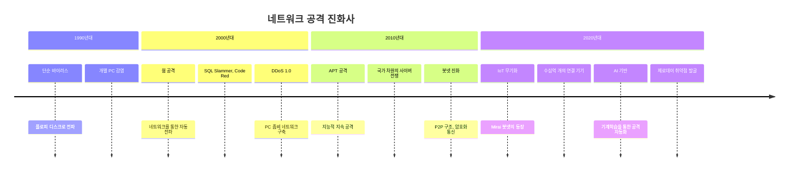
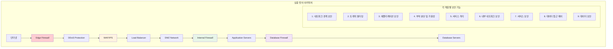

---
tags:
  - Network Security
  - IoT Security
  - Network Threats
  - Mirai Botnet
---

# Chapter 15-2a: 네트워크 보안 기초와 위협 환경

## 들어가며: 네트워크는 적대적 환경이다

### 🌊 2016년 10월 21일: Mirai 봇넷이 인터넷을 마비시킨 날

2016년 10월 21일, 사상 최대 규모의 DDoS 공격이 발생했습니다. 하지만 이번엔 좀비 PC가 아닌 **IoT 기기들**이 무기가 되었습니다.

**Mirai 봇넷의 공격 메커니즘**:

```bash
# Mirai가 감염시킨 기기들
감염된 기기들:
- IP 카메라: 2,100만 대
- 홈 라우터: 1,800만 대
- DVR 시스템: 900만 대
- 프린터: 200만 대
- 기타 IoT 기기들

총 감염 기기: 약 6,000만 대! 😱
```

**공격당일 상황**:

```text
06:00 UTC - Dyn DNS 첫 번째 공격 시작
트래픽 규모: 1.2 Tbps (테라비트 per second)

영향받은 서비스들:
- Twitter: 전 세계 접속 불가
- Netflix: 스트리밍 서비스 마비
- Spotify: 음악 재생 불가
- GitHub: 코드 저장소 접근 불가
- Reddit: 커뮤니티 서비스 다운
- PayPal: 결제 시스템 장애

# 동해안 전체가 인터넷에서 단절됨
```

**공격의 혁신적 특징**:

```c
// Mirai 소스코드의 핵심 (단순하지만 효과적)
void attack_tcp_syn(struct attack_target *targ) {
    for (int i = 0; i < targ->netmask; i++) {
        // SYN Flood 공격: 연결 요청만 보내고 응답하지 않음
        send_syn_packet(targ->addr + i, rand_port());
        // 매초 수십만 개의 가짜 연결 요청 전송
    }
}

// 감염된 각 IoT 기기가 동시에 실행
// 6,000만 대 × 초당 1,000 패킷 = 초당 600억 패킷!
```

### 🎯 IoT 기기가 좀비가 된 이유

```bash
# Mirai가 IoT 기기를 감염시키는 방법
1. 기본 로그인 정보 무차별 대입:
   admin/admin
   admin/password
   root/12345
   admin/123456

2. Telnet 서비스 기본 활성화
   - 대부분 IoT 기기가 Telnet 23번 포트 열려있음
   - 암호화되지 않은 평문 통신
   - 기본 패스워드 그대로 사용

3. 펌웨어 업데이트 없음
   - 사용자들이 보안 패치를 모름
   - 자동 업데이트 기능 없음
   - 제조사도 보안에 무관심

결과: 수천만 대의 무방비 기기들이 24시간 대기 중인 공격 무기가 됨
```

## 현대 네트워크 위협의 진화

### 📊 위협 벡터의 변화 추이



### 🎪 현대 네트워크 위협 지형도

```python
#!/usr/bin/env python3
# network_threat_landscape.py - 현대 네트워크 위협 분석

class NetworkThreatAnalyzer:
    def __init__(self):
        self.threat_vectors = {
            'volumetric_attacks': {
                'description': '대역폭 소모 공격',
                'examples': ['UDP Flood', 'ICMP Flood', 'DNS Amplification'],
                'scale': 'Tbps급 트래픽',
                'mitigation': 'CDN/DDoS 방어 서비스'
            },
            'protocol_attacks': {
                'description': '프로토콜 취약점 악용',
                'examples': ['SYN Flood', 'TCP Reset', 'SSL/TLS 공격'],
                'scale': '연결 테이블 고갈',
                'mitigation': 'Rate Limiting + 방화벽'
            },
            'application_attacks': {
                'description': '애플리케이션 레이어 공격',
                'examples': ['HTTP Flood', 'Slowloris', 'SQL Injection'],
                'scale': '서버 리소스 고갈',
                'mitigation': 'WAF + 애플리케이션 보안'
            },
            'supply_chain_attacks': {
                'description': '공급망 공격',
                'examples': ['라이브러리 백도어', '하드웨어 임플란트'],
                'scale': '전 생태계 감염',
                'mitigation': 'Zero Trust + 코드 검증'
            }
        }

    def analyze_attack_surface(self):
        """공격 표면 분석"""
        attack_surface = {
            'exposed_services': self.scan_exposed_services(),
            'vulnerable_protocols': self.check_protocol_vulnerabilities(),
            'weak_configurations': self.audit_security_configurations(),
            'outdated_components': self.scan_outdated_software()
        }
        
        return attack_surface

    def scan_exposed_services(self):
        """노출된 서비스 스캔"""
        # 실제 환경에서는 nmap, masscan 등 사용
        common_vulnerable_services = {
            21: 'FTP - 평문 인증',
            23: 'Telnet - 암호화 없음', 
            25: 'SMTP - 릴레이 악용 가능',
            53: 'DNS - 증폭 공격 가능',
            80: 'HTTP - 데이터 노출',
            135: 'RPC - 원격 코드 실행',
            445: 'SMB - 랜섬웨어 경로',
            3389: 'RDP - 브루트포스 대상'
        }
        
        # 포트 스캔 시뮬레이션
        open_ports = [21, 80, 443, 22]  # 예시 데이터
        vulnerabilities = []
        
        for port in open_ports:
            if port in common_vulnerable_services:
                vulnerabilities.append({
                    'port': port,
                    'service': common_vulnerable_services[port],
                    'risk_level': self.assess_port_risk(port)
                })
        
        return vulnerabilities

    def assess_port_risk(self, port):
        """포트별 위험도 평가"""
        high_risk_ports = [21, 23, 135, 445, 3389]
        medium_risk_ports = [25, 53, 80]
        
        if port in high_risk_ports:
            return 'HIGH'
        elif port in medium_risk_ports:
            return 'MEDIUM'
        else:
            return 'LOW'

    def check_protocol_vulnerabilities(self):
        """프로토콜 취약점 검사"""
        protocol_checks = {
            'TLS': {
                'weak_ciphers': ['RC4', 'DES', '3DES'],
                'deprecated_versions': ['SSLv2', 'SSLv3', 'TLS1.0'],
                'certificate_issues': ['self_signed', 'expired', 'weak_key']
            },
            'SSH': {
                'weak_algorithms': ['diffie-hellman-group1-sha1'],
                'authentication_issues': ['password_only', 'weak_passwords'],
                'configuration_problems': ['root_login_allowed']
            },
            'HTTP': {
                'security_headers_missing': ['HSTS', 'CSP', 'X-Frame-Options'],
                'information_disclosure': ['server_banner', 'error_messages'],
                'authentication_flaws': ['basic_auth_over_http']
            }
        }
        
        return protocol_checks

# 실제 사용 예시
if __name__ == "__main__":
    analyzer = NetworkThreatAnalyzer()
    
    print("🔍 네트워크 위협 분석 시작...")
    
    # 공격 표면 분석
    attack_surface = analyzer.analyze_attack_surface()
    
    print("\n📊 노출된 서비스:")
    for vuln in attack_surface['exposed_services']:
        print(f"  🚨 포트 {vuln['port']}: {vuln['service']} (위험도: {vuln['risk_level']})")
    
    print("\n🛡️ 프로토콜 보안 상태:")
    for protocol, issues in attack_surface['vulnerable_protocols'].items():
        print(f"  📋 {protocol}:")
        for category, problems in issues.items():
            print(f"    - {category}: {len(problems)}개 문제점 발견")
```

## 네트워크 보안 기본 원칙

### 🛡️ 심층 방어 (Defense in Depth) 전략



### ⚙️ 네트워크 보안 설정 실습

**1. 기본 방화벽 설정 (iptables)**:

```bash
#!/bin/bash
# secure_firewall_setup.sh - 기본적이지만 강력한 방화벽 설정

# 모든 기존 규칙 초기화
iptables -F
iptables -X
iptables -t nat -F
iptables -t nat -X

# 기본 정책: 모든 것을 차단
iptables -P INPUT DROP
iptables -P FORWARD DROP
iptables -P OUTPUT ACCEPT

# 로컬 인터페이스 허용 (중요!)
iptables -A INPUT -i lo -j ACCEPT
iptables -A OUTPUT -o lo -j ACCEPT

# 이미 설정된 연결 허용
iptables -A INPUT -m state --state ESTABLISHED,RELATED -j ACCEPT

# SSH 접근 허용 (제한적)
iptables -A INPUT -p tcp --dport 22 -m state --state NEW -m recent --set --name SSH
iptables -A INPUT -p tcp --dport 22 -m state --state NEW -m recent --update --seconds 60 --hitcount 4 --name SSH -j DROP
iptables -A INPUT -p tcp --dport 22 -j ACCEPT

# HTTP/HTTPS 웹 서버 (필요시)
iptables -A INPUT -p tcp --dport 80 -j ACCEPT
iptables -A INPUT -p tcp --dport 443 -j ACCEPT

# ICMP 제한적 허용 (핑 응답)
iptables -A INPUT -p icmp --icmp-type echo-request -m limit --limit 1/second -j ACCEPT

# DDoS 방어: SYN Flood 보호
iptables -A INPUT -p tcp --syn -m limit --limit 1/s --limit-burst 3 -j ACCEPT
iptables -A INPUT -p tcp --syn -j DROP

# 포트 스캔 방어
iptables -A INPUT -m state --state NEW -p tcp --tcp-flags ALL ALL -j DROP
iptables -A INPUT -m state --state NEW -p tcp --tcp-flags ALL NONE -j DROP

# 로깅 (의심스러운 패킷)
iptables -A INPUT -m limit --limit 3/min --limit-burst 3 -j LOG --log-prefix "IPTables-Dropped: " --log-level 4

echo "🛡️ 방화벽 설정 완료!"
echo "📋 현재 규칙:"
iptables -L -n --line-numbers
```

**2. SSH 보안 강화**:

```bash
# /etc/ssh/sshd_config - 프로덕션급 SSH 보안 설정

# 기본 설정
Port 22                    # 기본 포트 (필요시 변경)
Protocol 2                 # SSH v2만 사용
HostKey /etc/ssh/ssh_host_rsa_key
HostKey /etc/ssh/ssh_host_ecdsa_key  
HostKey /etc/ssh/ssh_host_ed25519_key

# 인증 설정
PermitRootLogin no         # root 직접 로그인 금지
PasswordAuthentication no  # 패스워드 인증 비활성화
PubkeyAuthentication yes   # 공개키 인증만 허용
AuthorizedKeysFile .ssh/authorized_keys

# 보안 강화
MaxAuthTries 3            # 인증 시도 제한
LoginGraceTime 30         # 로그인 대기시간 제한
MaxSessions 2             # 세션 수 제한
ClientAliveInterval 300   # 클라이언트 응답 확인 간격
ClientAliveCountMax 0     # 응답 없으면 즉시 연결 종료

# 접속 제한
AllowUsers admin developer  # 특정 사용자만 허용
DenyUsers root guest       # 위험한 사용자 차단

# 네트워크 보안
X11Forwarding no          # X11 포워딩 비활성화
AllowTcpForwarding no     # TCP 포워딩 비활성화
GatewayPorts no           # 게이트웨이 포트 비활성화

# 로깅
SyslogFacility AUTH
LogLevel INFO

# Banner (optional)
Banner /etc/ssh/banner.txt
```

## 네트워크 보안 모니터링 기초

### 📊 기본 네트워크 트래픽 분석

```python
#!/usr/bin/env python3
# basic_traffic_monitor.py - 기본 네트워크 트래픽 모니터링

import psutil
import time
import json
from collections import defaultdict, deque
from datetime import datetime

class BasicNetworkMonitor:
    def __init__(self):
        self.baseline_traffic = {}
        self.anomaly_threshold = 2.0  # 평균의 2배 이상이면 이상
        self.traffic_history = deque(maxlen=60)  # 최근 60초간 기록
        
    def collect_network_stats(self):
        """기본 네트워크 통계 수집"""
        stats = psutil.net_io_counters(pernic=True)
        connections = psutil.net_connections()
        
        current_time = datetime.now()
        
        network_snapshot = {
            'timestamp': current_time.isoformat(),
            'interfaces': {},
            'connections': {
                'total': len(connections),
                'established': len([c for c in connections if c.status == 'ESTABLISHED']),
                'listening': len([c for c in connections if c.status == 'LISTEN']),
                'time_wait': len([c for c in connections if c.status == 'TIME_WAIT'])
            }
        }
        
        # 인터페이스별 통계
        for interface, stat in stats.items():
            if interface != 'lo':  # loopback 제외
                network_snapshot['interfaces'][interface] = {
                    'bytes_sent': stat.bytes_sent,
                    'bytes_recv': stat.bytes_recv,
                    'packets_sent': stat.packets_sent,
                    'packets_recv': stat.packets_recv,
                    'errin': stat.errin,
                    'errout': stat.errout,
                    'dropin': stat.dropin,
                    'dropout': stat.dropout
                }
        
        return network_snapshot

    def detect_anomalies(self, current_stats):
        """간단한 이상 징후 탐지"""
        anomalies = []
        
        if not self.traffic_history:
            return anomalies
            
        # 최근 통계 기반 평균 계산
        recent_stats = list(self.traffic_history)
        
        for interface, current_data in current_stats['interfaces'].items():
            if len(recent_stats) < 5:  # 충분한 데이터가 없으면 스킵
                continue
                
            # 바이트 전송량 기반 이상 탐지
            recent_bytes_sent = [s['interfaces'].get(interface, {}).get('bytes_sent', 0) 
                               for s in recent_stats[-10:]]  # 최근 10개
            recent_bytes_recv = [s['interfaces'].get(interface, {}).get('bytes_recv', 0) 
                               for s in recent_stats[-10:]]
            
            if recent_bytes_sent and recent_bytes_recv:
                avg_sent = sum(recent_bytes_sent) / len(recent_bytes_sent)
                avg_recv = sum(recent_bytes_recv) / len(recent_bytes_recv)
                
                current_sent = current_data['bytes_sent']
                current_recv = current_data['bytes_recv']
                
                # 갑작스런 트래픽 증가 탐지
                if avg_sent > 0 and current_sent > avg_sent * self.anomaly_threshold:
                    anomalies.append({
                        'type': 'traffic_spike_outbound',
                        'interface': interface,
                        'current': current_sent,
                        'average': avg_sent,
                        'severity': 'medium'
                    })
                    
                if avg_recv > 0 and current_recv > avg_recv * self.anomaly_threshold:
                    anomalies.append({
                        'type': 'traffic_spike_inbound', 
                        'interface': interface,
                        'current': current_recv,
                        'average': avg_recv,
                        'severity': 'medium'
                    })
        
        # 연결 수 이상 탐지
        current_connections = current_stats['connections']['total']
        if len(recent_stats) >= 5:
            recent_connections = [s['connections']['total'] for s in recent_stats[-10:]]
            avg_connections = sum(recent_connections) / len(recent_connections)
            
            if current_connections > avg_connections * 1.5:  # 50% 이상 증가
                anomalies.append({
                    'type': 'connection_spike',
                    'current': current_connections,
                    'average': avg_connections,
                    'severity': 'high'
                })
        
        return anomalies

    def run_monitoring(self, duration_seconds=300):
        """모니터링 실행"""
        print(f"🔍 네트워크 모니터링 시작 ({duration_seconds}초간)")
        
        start_time = time.time()
        while time.time() - start_time < duration_seconds:
            try:
                # 현재 네트워크 상태 수집
                current_stats = self.collect_network_stats()
                self.traffic_history.append(current_stats)
                
                # 이상 징후 탐지
                anomalies = self.detect_anomalies(current_stats)
                
                # 결과 출력
                timestamp = current_stats['timestamp']
                total_connections = current_stats['connections']['total']
                
                print(f"⏰ {timestamp} - 총 연결: {total_connections}")
                
                if anomalies:
                    print("🚨 이상 징후 탐지:")
                    for anomaly in anomalies:
                        severity_icon = "🔥" if anomaly['severity'] == 'high' else "⚠️"
                        print(f"  {severity_icon} {anomaly['type']}: {anomaly.get('interface', 'N/A')}")
                
                # 인터페이스별 간단한 통계
                for interface, stats in current_stats['interfaces'].items():
                    bytes_sent = stats['bytes_sent'] / 1024 / 1024  # MB
                    bytes_recv = stats['bytes_recv'] / 1024 / 1024  # MB
                    print(f"  📊 {interface}: 송신 {bytes_sent:.2f}MB, 수신 {bytes_recv:.2f}MB")
                
                print("-" * 60)
                time.sleep(5)  # 5초마다 체크
                
            except KeyboardInterrupt:
                print("\n👋 모니터링 중단됨")
                break
            except Exception as e:
                print(f"❌ 오류 발생: {e}")
                time.sleep(5)

# 사용 예시
if __name__ == "__main__":
    monitor = BasicNetworkMonitor()
    monitor.run_monitoring(60)  # 1분간 모니터링
```

## 핵심 요점

### 🎯 네트워크 보안의 기본 원칙

1. **최소 권한**: 필요한 최소한의 네트워크 접근만 허용
2. **심층 방어**: 여러 계층의 보안 장치로 다중 보호  
3. **지속적 모니터링**: 실시간 트래픽 분석과 이상 탐지
4. **Zero Trust**: 내부 네트워크도 의심하고 검증
5. **정기적 업데이트**: 보안 패치와 설정 점검

### ⚠️ Mirai 사건의 교훈

1. **기본 보안이 가장 중요**: 기본 패스워드 변경, 불필요한 서비스 비활성화
2. **모든 연결 기기가 무기가 될 수 있음**: IoT, 라우터, 프린터 등
3. **규모의 위력**: 개별적으로는 약한 공격도 대규모로 합치면 치명적
4. **공급망 보안**: 제조사부터 보안을 고려한 설계 필요

### 🛡️ 즉시 적용 가능한 보안 조치

```bash
# 즉시 확인해야 할 기본 보안 사항
✅ 모든 기본 패스워드 변경
✅ 불필요한 서비스 비활성화 (Telnet, FTP 등)
✅ 방화벽 설정으로 불필요한 포트 차단
✅ SSH 키 기반 인증 설정
✅ 정기적인 보안 업데이트 적용
✅ 네트워크 트래픽 모니터링 설정
```

---

**이전**: [네트워크 보안 개요](02-network-security.md)  
**다음**: [TLS/SSL 프로토콜과 암호화 통신](02b-tls-protocols.md)에서 안전한 통신을 위한 TLS 구현과 보안 설정을 학습합니다.
