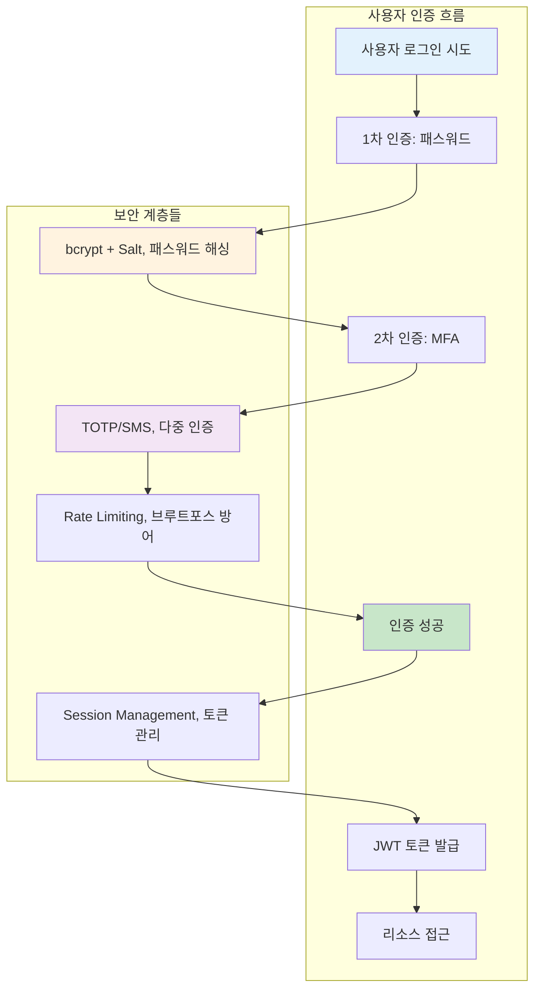
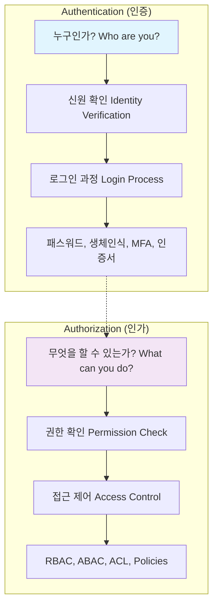
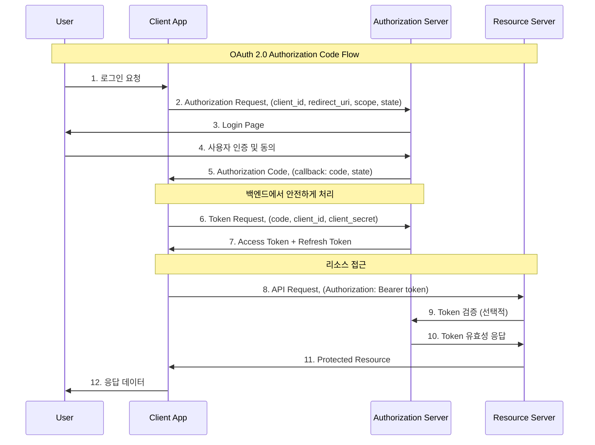

---
tags:
  - Authentication
  - Authorization
  - OAuth
  - JWT
  - RBAC
  - OIDC
---

# Chapter 15-3: 인증과 인가 - 신원 확인과 권한 관리의 과학

## 이 문서를 읽고 나면 답할 수 있는 질문들

- Authentication과 Authorization의 차이는 무엇인가요?
- OAuth 2.0과 OpenID Connect는 어떻게 작동하나요?
- JWT 토큰을 안전하게 구현하는 방법은?
- RBAC와 ABAC의 차이점과 선택 기준은?
- 다중 인증(MFA)을 어떻게 구현하나요?

## 들어가며: 디지털 신원의 중요성

### 🔓 2012년 LinkedIn 해킹: 6,500만 개 패스워드 유출 사건

2012년 6월, LinkedIn에서 역사상 최대 규모 중 하나의 계정 정보 유출 사고가 발생했습니다.

**사고의 전개과정**:

```bash
# 2012년 6월 5일: 최초 발견
해커가 러시아 포럼에 650만 개 암호화된 패스워드 게시
파일명: "combo_not.txt" (6.5MB 크기)

# 파일 내용 분석
$ head combo_not.txt
00000000000000000000000000000000  # MD5 해시들
aab87d2f7ff2e3b2b27df892c11b3e6a
5f4dcc3b5aa765d61d8327deb882cf99  # "password"의 MD5
e10adc3949ba59abbe56e057f20f883e  # "123456"의 MD5
...

# 😱 충격적 발견: Salt 없는 단순 MD5 해싱
```

**취약점 분석**:

```c
// LinkedIn이 사용한 취약한 패스워드 저장 방식 (추정)
char* hash_password(const char* password) {
    // 😱 Salt 없는 MD5 해싱 - 매우 위험!
    return md5(password);
}

// 해커의 크래킹 과정
1. Rainbow table 공격: MD5 해시를 원본 패스워드로 역추적
2. Dictionary 공격: 일반적인 패스워드들 대입
3. 결과: 수백만 개 패스워드 크래킹 성공

가장 많이 사용된 패스워드들:
- "123456": 753,305개 계정
- "linkedin": 172,523개 계정  
- "password": 144,458개 계정
- "123456789": 94,314개 계정
```

**파급 효과**:

```text
💥 즉각적 피해:
- 6,500만 사용자 계정 정보 노출
- 크래킹된 패스워드로 타 사이트 무차별 공격
- LinkedIn 주가 10% 하락

📈 장기적 영향:
- 전 업계의 패스워드 보안 정책 대전환
- 2단계 인증(2FA) 도입 가속화
- bcrypt, scrypt 등 안전한 해싱 알고리즘 표준화
```

### 🛡️ 현대적 인증 시스템: 다층 보안의 실현

LinkedIn 사고 이후 구축된 현대적 인증 아키텍처:



이 장에서는 현대적 인증과 인가 시스템의 모든 것을 다루겠습니다.

## Authentication vs Authorization

### 핵심 개념의 차이점



### 실제 구현 예시

```python
# auth_system.py - 완전한 인증/인가 시스템
import hashlib
import secrets
import jwt
import pyotp
import time
from datetime import datetime, timedelta
from functools import wraps
from enum import Enum
from typing import Dict, List, Optional

class Role(Enum):
    ADMIN = "admin"
    USER = "user"
    MODERATOR = "moderator"
    GUEST = "guest"

class Permission(Enum):
    READ = "read"
    WRITE = "write"
    DELETE = "delete"
    ADMIN = "admin"

class AuthenticationSystem:
    def __init__(self, jwt_secret: str):
        self.jwt_secret = jwt_secret
        self.users = {}  # 실제로는 데이터베이스 사용
        self.sessions = {}
        self.failed_attempts = {}  # IP별 실패 시도 추적
        
        # 역할별 권한 매핑
        self.role_permissions = {
            Role.ADMIN: [Permission.READ, Permission.WRITE, Permission.DELETE, Permission.ADMIN],
            Role.MODERATOR: [Permission.READ, Permission.WRITE, Permission.DELETE],
            Role.USER: [Permission.READ, Permission.WRITE],
            Role.GUEST: [Permission.READ]
        }
    
    def register_user(self, username: str, password: str, email: str, role: Role = Role.USER):
        """안전한 사용자 등록"""
        if username in self.users:
            raise ValueError("User already exists")
        
        # 1. 패스워드 강도 검증
        self._validate_password_strength(password)
        
        # 2. 안전한 패스워드 해싱 (bcrypt + salt)
        salt = secrets.token_hex(32)
        password_hash = self._hash_password(password, salt)
        
        # 3. TOTP 시크릿 생성 (2FA용)
        totp_secret = pyotp.random_base32()
        
        user_data = {
            'username': username,
            'email': email,
            'password_hash': password_hash,
            'salt': salt,
            'role': role,
            'totp_secret': totp_secret,
            'totp_enabled': False,
            'created_at': datetime.now(),
            'last_login': None,
            'login_attempts': 0,
            'locked_until': None
        }
        
        self.users[username] = user_data
        print(f"User {username} registered successfully")
        print(f"2FA Secret (QR code): {totp_secret}")
        return totp_secret
    
    def authenticate(self, username: str, password: str, totp_code: Optional[str] = None, 
                    client_ip: str = "unknown") -> Optional[Dict]:
        """안전한 사용자 인증"""
        
        # 1. Rate limiting 검사
        if self._is_rate_limited(client_ip):
            raise Exception("Too many failed attempts. Please try again later.")
        
        # 2. 사용자 존재 확인
        if username not in self.users:
            self._record_failed_attempt(client_ip)
            raise ValueError("Invalid credentials")
        
        user = self.users[username]
        
        # 3. 계정 잠금 확인
        if user.get('locked_until') and datetime.now() < user['locked_until']:
            raise Exception(f"Account locked until {user['locked_until']}")
        
        # 4. 패스워드 검증
        if not self._verify_password(password, user['password_hash'], user['salt']):
            self._record_failed_attempt(client_ip)
            user['login_attempts'] += 1
            
            # 5회 실패 시 계정 잠금
            if user['login_attempts'] >= 5:
                user['locked_until'] = datetime.now() + timedelta(minutes=30)
                raise Exception("Account locked due to multiple failed attempts")
            
            raise ValueError("Invalid credentials")
        
        # 5. 2FA 검증 (활성화된 경우)
        if user['totp_enabled']:
            if not totp_code:
                raise ValueError("2FA code required")
            
            if not self._verify_totp(user['totp_secret'], totp_code):
                self._record_failed_attempt(client_ip)
                raise ValueError("Invalid 2FA code")
        
        # 6. 인증 성공 처리
        user['login_attempts'] = 0
        user['locked_until'] = None
        user['last_login'] = datetime.now()
        self._clear_failed_attempts(client_ip)
        
        # 7. JWT 토큰 생성
        token = self._generate_jwt_token(username, user['role'])
        
        return {
            'user': {
                'username': username,
                'email': user['email'],
                'role': user['role'].value
            },
            'token': token,
            'expires_at': (datetime.now() + timedelta(hours=24)).isoformat()
        }
    
    def _validate_password_strength(self, password: str):
        """패스워드 강도 검증"""
        if len(password) < 12:
            raise ValueError("Password must be at least 12 characters long")
        
        has_upper = any(c.isupper() for c in password)
        has_lower = any(c.islower() for c in password)  
        has_digit = any(c.isdigit() for c in password)
        has_special = any(c in "!@#$%^&*()_+-=[]{}|;:,.<>?" for c in password)
        
        if not all([has_upper, has_lower, has_digit, has_special]):
            raise ValueError("Password must contain uppercase, lowercase, digit, and special character")
    
    def _hash_password(self, password: str, salt: str) -> str:
        """안전한 패스워드 해싱 (PBKDF2)"""
        # 실제로는 bcrypt나 scrypt 사용 권장
        return hashlib.pbkdf2_hmac('sha256', password.encode(), salt.encode(), 100000).hex()
    
    def _verify_password(self, password: str, password_hash: str, salt: str) -> bool:
        """패스워드 검증"""
        return self._hash_password(password, salt) == password_hash
    
    def _verify_totp(self, secret: str, code: str) -> bool:
        """TOTP 코드 검증"""
        totp = pyotp.TOTP(secret)
        return totp.verify(code, valid_window=1)  # 30초 윈도우
    
    def _generate_jwt_token(self, username: str, role: Role) -> str:
        """JWT 토큰 생성"""
        payload = {
            'username': username,
            'role': role.value,
            'iat': datetime.utcnow(),
            'exp': datetime.utcnow() + timedelta(hours=24)
        }
        return jwt.encode(payload, self.jwt_secret, algorithm='HS256')
    
    def verify_token(self, token: str) -> Optional[Dict]:
        """JWT 토큰 검증"""
        try:
            payload = jwt.decode(token, self.jwt_secret, algorithms=['HS256'])
            return payload
        except jwt.ExpiredSignatureError:
            raise Exception("Token has expired")
        except jwt.InvalidTokenError:
            raise Exception("Invalid token")
    
    def _is_rate_limited(self, client_ip: str) -> bool:
        """Rate limiting 검사"""
        if client_ip not in self.failed_attempts:
            return False
        
        attempts = self.failed_attempts[client_ip]
        recent_attempts = [
            attempt for attempt in attempts 
            if datetime.now() - attempt < timedelta(minutes=15)
        ]
        
        return len(recent_attempts) >= 5
    
    def _record_failed_attempt(self, client_ip: str):
        """실패한 로그인 시도 기록"""
        if client_ip not in self.failed_attempts:
            self.failed_attempts[client_ip] = []
        
        self.failed_attempts[client_ip].append(datetime.now())
    
    def _clear_failed_attempts(self, client_ip: str):
        """성공한 로그인 후 실패 기록 초기화"""
        if client_ip in self.failed_attempts:
            del self.failed_attempts[client_ip]

class AuthorizationSystem:
    def __init__(self, auth_system: AuthenticationSystem):
        self.auth_system = auth_system
    
    def require_auth(self, required_permission: Permission = None):
        """데코레이터: 인증 필수"""
        def decorator(func):
            @wraps(func)
            def wrapper(*args, **kwargs):
                # HTTP 헤더에서 토큰 추출 (실제로는 Flask/FastAPI 등에서)
                token = kwargs.get('auth_token')
                if not token:
                    raise Exception("Authentication required")
                
                try:
                    # 토큰 검증
                    payload = self.auth_system.verify_token(token)
                    username = payload['username']
                    role = Role(payload['role'])
                    
                    # 권한 검사 (필요한 경우)
                    if required_permission:
                        if not self.has_permission(role, required_permission):
                            raise Exception(f"Permission denied: {required_permission.value}")
                    
                    # 사용자 정보를 함수에 주입
                    kwargs['current_user'] = {
                        'username': username,
                        'role': role
                    }
                    
                    return func(*args, **kwargs)
                    
                except Exception as e:
                    raise Exception(f"Authentication failed: {str(e)}")
            
            return wrapper
        return decorator
    
    def has_permission(self, role: Role, permission: Permission) -> bool:
        """역할별 권한 확인"""
        user_permissions = self.auth_system.role_permissions.get(role, [])
        return permission in user_permissions
    
    def require_role(self, required_roles: List[Role]):
        """데코레이터: 특정 역할 필수"""  
        def decorator(func):
            @wraps(func)
            def wrapper(*args, **kwargs):
                current_user = kwargs.get('current_user')
                if not current_user:
                    raise Exception("Authentication required")
                
                user_role = current_user['role']
                if user_role not in required_roles:
                    raise Exception(f"Role {user_role.value} not authorized")
                
                return func(*args, **kwargs)
            return wrapper
        return decorator

# 사용 예시
def demo_auth_system():
    # 시스템 초기화
    auth_system = AuthenticationSystem(jwt_secret="super-secret-key")
    authz_system = AuthorizationSystem(auth_system)
    
    # 사용자 등록
    try:
        totp_secret = auth_system.register_user("alice", "MySecureP@ss123!", "alice@example.com", Role.USER)
        auth_system.register_user("admin", "AdminP@ss456!", "admin@example.com", Role.ADMIN)
        print("Users registered successfully")
    except ValueError as e:
        print(f"Registration error: {e}")
    
    # 로그인 시도
    try:
        # 일반 로그인
        result = auth_system.authenticate("alice", "MySecureP@ss123!", client_ip="192.168.1.100")
        token = result['token']
        print(f"Login successful! Token: {token[:50]}...")
        
        # 보호된 리소스 접근 예시
        @authz_system.require_auth(Permission.READ)
        def get_user_profile(auth_token=None, current_user=None):
            return f"Profile for {current_user['username']}"
        
        @authz_system.require_auth(Permission.ADMIN)
        @authz_system.require_role([Role.ADMIN])
        def admin_dashboard(auth_token=None, current_user=None):
            return f"Admin dashboard accessed by {current_user['username']}"
        
        # 권한 테스트
        profile = get_user_profile(auth_token=token)
        print(f"Profile access: {profile}")
        
        try:
            dashboard = admin_dashboard(auth_token=token)
        except Exception as e:
            print(f"Admin access denied: {e}")
            
    except Exception as e:
        print(f"Authentication error: {e}")

if __name__ == "__main__":
    demo_auth_system()
```

## OAuth 2.0과 OpenID Connect

### OAuth 2.0 핵심 플로우



### 완전한 OAuth 2.0 서버 구현

```python
#!/usr/bin/env python3
# oauth2_server.py - OAuth 2.0 인증 서버 구현

import secrets
import hashlib
import base64
import json
import time
from datetime import datetime, timedelta
from urllib.parse import urlencode, parse_qs
from typing import Dict, Optional, List
import jwt

class OAuth2AuthorizationServer:
    def __init__(self, jwt_secret: str):
        self.jwt_secret = jwt_secret
        
        # 등록된 클라이언트들 (실제로는 DB에 저장)
        self.clients = {
            'web_app_client': {
                'client_id': 'web_app_client',
                'client_secret': 'web_app_secret_12345',  # 실제로는 해시화해서 저장
                'redirect_uris': ['http://localhost:3000/callback', 'https://myapp.com/callback'],
                'allowed_scopes': ['read', 'write', 'profile'],
                'client_type': 'confidential'  # public 또는 confidential
            },
            'mobile_app_client': {
                'client_id': 'mobile_app_client', 
                'client_secret': None,  # Public client (모바일 앱)
                'redirect_uris': ['com.myapp://oauth/callback'],
                'allowed_scopes': ['read', 'profile'],
                'client_type': 'public'
            }
        }
        
        # 사용자 계정들 (실제로는 별도 시스템에서)
        self.users = {
            'alice@example.com': {
                'user_id': 'user_123',
                'username': 'alice',
                'email': 'alice@example.com',
                'password_hash': self._hash_password('password123')
            }
        }
        
        # 임시 저장소들
        self.authorization_codes = {}  # 실제로는 Redis 등 사용
        self.access_tokens = {}
        self.refresh_tokens = {}
    
    def _hash_password(self, password: str) -> str:
        """패스워드 해싱"""
        return hashlib.sha256(password.encode()).hexdigest()
    
    def _verify_password(self, password: str, password_hash: str) -> bool:
        """패스워드 검증"""
        return self._hash_password(password) == password_hash
    
    def create_authorization_request(self, client_id: str, redirect_uri: str, 
                                   scopes: List[str], state: str = None,
                                   code_challenge: str = None, 
                                   code_challenge_method: str = None) -> str:
        """인증 요청 URL 생성 (Step 1)"""
        
        # 1. 클라이언트 검증
        if client_id not in self.clients:
            raise ValueError("Invalid client_id")
        
        client = self.clients[client_id]
        
        # 2. 리다이렉트 URI 검증
        if redirect_uri not in client['redirect_uris']:
            raise ValueError("Invalid redirect_uri")
        
        # 3. 스코프 검증
        invalid_scopes = set(scopes) - set(client['allowed_scopes'])
        if invalid_scopes:
            raise ValueError(f"Invalid scopes: {invalid_scopes}")
        
        # 4. PKCE 검증 (Public Client인 경우)
        if client['client_type'] == 'public':
            if not code_challenge or not code_challenge_method:
                raise ValueError("PKCE required for public clients")
            
            if code_challenge_method not in ['S256', 'plain']:
                raise ValueError("Invalid code_challenge_method")
        
        # 5. 인증 요청 데이터 저장 (세션 등에)
        auth_request_id = secrets.token_urlsafe(32)
        
        auth_request = {
            'client_id': client_id,
            'redirect_uri': redirect_uri,
            'scopes': scopes,
            'state': state,
            'code_challenge': code_challenge,
            'code_challenge_method': code_challenge_method,
            'created_at': datetime.now()
        }
        
        # 실제로는 세션이나 캐시에 저장
        self.authorization_codes[auth_request_id] = auth_request
        
        return auth_request_id
    
    def authenticate_user(self, auth_request_id: str, username: str, password: str,
                         approved_scopes: List[str]) -> str:
        """사용자 인증 및 인가 코드 생성 (Step 2-3)"""
        
        # 1. 인증 요청 조회
        if auth_request_id not in self.authorization_codes:
            raise ValueError("Invalid or expired authorization request")
        
        auth_request = self.authorization_codes[auth_request_id]
        
        # 2. 사용자 인증
        if username not in self.users:
            raise ValueError("Invalid credentials")
        
        user = self.users[username]
        if not self._verify_password(password, user['password_hash']):
            raise ValueError("Invalid credentials")
        
        # 3. 스코프 검증 (사용자가 승인한 스코프만)
        requested_scopes = set(auth_request['scopes'])
        user_approved_scopes = set(approved_scopes)
        
        if not user_approved_scopes.issubset(requested_scopes):
            raise ValueError("Approved scopes exceed requested scopes")
        
        # 4. 인가 코드 생성
        authorization_code = secrets.token_urlsafe(43)  # 43문자 = 256비트
        
        code_data = {
            'user_id': user['user_id'],
            'client_id': auth_request['client_id'],
            'redirect_uri': auth_request['redirect_uri'],
            'scopes': list(user_approved_scopes),
            'code_challenge': auth_request.get('code_challenge'),
            'code_challenge_method': auth_request.get('code_challenge_method'),
            'expires_at': datetime.now() + timedelta(minutes=10),
            'used': False
        }
        
        self.authorization_codes[authorization_code] = code_data
        
        # 5. 리다이렉트 URL 생성
        params = {'code': authorization_code}
        if auth_request.get('state'):
            params['state'] = auth_request['state']
        
        redirect_url = f"{auth_request['redirect_uri']}?{urlencode(params)}"
        return redirect_url
    
    def exchange_code_for_tokens(self, code: str, client_id: str, 
                               client_secret: Optional[str] = None,
                               redirect_uri: str = None,
                               code_verifier: str = None) -> Dict:
        """인가 코드를 토큰으로 교환 (Step 4)"""
        
        # 1. 인가 코드 검증
        if code not in self.authorization_codes:
            raise ValueError("Invalid or expired authorization code")
        
        code_data = self.authorization_codes[code]
        
        # 2. 코드 만료 및 사용 여부 확인
        if datetime.now() > code_data['expires_at']:
            raise ValueError("Authorization code expired")
        
        if code_data['used']:
            raise ValueError("Authorization code already used")
        
        # 3. 클라이언트 인증
        if client_id != code_data['client_id']:
            raise ValueError("Client ID mismatch")
        
        client = self.clients[client_id]
        
        # Confidential Client인 경우 시크릿 검증
        if client['client_type'] == 'confidential':
            if not client_secret or client_secret != client['client_secret']:
                raise ValueError("Invalid client credentials")
        
        # 4. 리다이렉트 URI 검증
        if redirect_uri and redirect_uri != code_data['redirect_uri']:
            raise ValueError("Redirect URI mismatch")
        
        # 5. PKCE 검증 (Public Client)
        if client['client_type'] == 'public':
            if not code_verifier:
                raise ValueError("Code verifier required for public client")
            
            if not self._verify_pkce(code_data['code_challenge'], 
                                   code_data['code_challenge_method'], 
                                   code_verifier):
                raise ValueError("PKCE verification failed")
        
        # 6. 토큰 생성
        access_token = self._generate_access_token(
            user_id=code_data['user_id'],
            client_id=client_id,
            scopes=code_data['scopes']
        )
        
        refresh_token = self._generate_refresh_token(
            user_id=code_data['user_id'],
            client_id=client_id,
            scopes=code_data['scopes']
        )
        
        # 7. 코드 사용 처리
        code_data['used'] = True
        
        return {
            'access_token': access_token,
            'token_type': 'Bearer',
            'expires_in': 3600,  # 1시간
            'refresh_token': refresh_token,
            'scope': ' '.join(code_data['scopes'])
        }
    
    def _verify_pkce(self, code_challenge: str, method: str, code_verifier: str) -> bool:
        """PKCE 검증"""
        if method == 'plain':
            return code_challenge == code_verifier
        elif method == 'S256':
            # SHA256 해시 후 base64url 인코딩
            hash_value = hashlib.sha256(code_verifier.encode()).digest()
            expected = base64.urlsafe_b64encode(hash_value).decode().rstrip('=')
            return code_challenge == expected
        return False
    
    def _generate_access_token(self, user_id: str, client_id: str, scopes: List[str]) -> str:
        """Access Token 생성 (JWT)"""
        payload = {
            'iss': 'https://auth.myservice.com',  # Issuer
            'sub': user_id,                       # Subject (User ID)
            'aud': client_id,                     # Audience (Client ID)
            'iat': int(time.time()),              # Issued At
            'exp': int(time.time()) + 3600,       # Expires (1시간 후)
            'scope': ' '.join(scopes)             # 권한 범위
        }
        
        token = jwt.encode(payload, self.jwt_secret, algorithm='HS256')
        
        # 토큰 저장 (취소 등을 위해)
        self.access_tokens[token] = {
            'user_id': user_id,
            'client_id': client_id,
            'scopes': scopes,
            'expires_at': datetime.now() + timedelta(hours=1),
            'revoked': False
        }
        
        return token
    
    def _generate_refresh_token(self, user_id: str, client_id: str, scopes: List[str]) -> str:
        """Refresh Token 생성"""
        refresh_token = secrets.token_urlsafe(43)
        
        self.refresh_tokens[refresh_token] = {
            'user_id': user_id,
            'client_id': client_id,
            'scopes': scopes,
            'expires_at': datetime.now() + timedelta(days=30),  # 30일
            'revoked': False
        }
        
        return refresh_token
    
    def verify_access_token(self, token: str) -> Optional[Dict]:
        """Access Token 검증"""
        try:
            # JWT 검증
            payload = jwt.decode(token, self.jwt_secret, algorithms=['HS256'])
            
            # 토큰 취소 여부 확인
            if token in self.access_tokens:
                token_data = self.access_tokens[token]
                if token_data['revoked']:
                    return None
            
            return payload
            
        except jwt.ExpiredSignatureError:
            return None
        except jwt.InvalidTokenError:
            return None
    
    def refresh_access_token(self, refresh_token: str, client_id: str, 
                           client_secret: Optional[str] = None) -> Dict:
        """Refresh Token으로 새 Access Token 발급"""
        
        # 1. Refresh Token 검증
        if refresh_token not in self.refresh_tokens:
            raise ValueError("Invalid refresh token")
        
        token_data = self.refresh_tokens[refresh_token]
        
        if datetime.now() > token_data['expires_at'] or token_data['revoked']:
            raise ValueError("Refresh token expired or revoked")
        
        # 2. 클라이언트 인증
        if client_id != token_data['client_id']:
            raise ValueError("Client ID mismatch")
        
        client = self.clients[client_id]
        if client['client_type'] == 'confidential':
            if not client_secret or client_secret != client['client_secret']:
                raise ValueError("Invalid client credentials")
        
        # 3. 새 토큰 발급
        new_access_token = self._generate_access_token(
            user_id=token_data['user_id'],
            client_id=client_id,
            scopes=token_data['scopes']
        )
        
        new_refresh_token = self._generate_refresh_token(
            user_id=token_data['user_id'],
            client_id=client_id,
            scopes=token_data['scopes']
        )
        
        # 4. 기존 Refresh Token 취소
        token_data['revoked'] = True
        
        return {
            'access_token': new_access_token,
            'token_type': 'Bearer',
            'expires_in': 3600,
            'refresh_token': new_refresh_token,
            'scope': ' '.join(token_data['scopes'])
        }

# OAuth 2.0 클라이언트 구현 예시
class OAuth2Client:
    def __init__(self, client_id: str, client_secret: Optional[str], 
                 redirect_uri: str, auth_server: OAuth2AuthorizationServer):
        self.client_id = client_id
        self.client_secret = client_secret
        self.redirect_uri = redirect_uri
        self.auth_server = auth_server
        
        # PKCE용 (Public Client)
        self.code_verifier = None
        self.code_challenge = None
    
    def generate_auth_url(self, scopes: List[str], state: str = None) -> str:
        """인증 URL 생성"""
        
        # PKCE 준비 (모바일 앱 등 Public Client)
        if not self.client_secret:
            self.code_verifier = base64.urlsafe_b64encode(
                secrets.token_bytes(32)
            ).decode().rstrip('=')
            
            challenge = hashlib.sha256(self.code_verifier.encode()).digest()
            self.code_challenge = base64.urlsafe_b64encode(challenge).decode().rstrip('=')
        
        try:
            auth_request_id = self.auth_server.create_authorization_request(
                client_id=self.client_id,
                redirect_uri=self.redirect_uri,
                scopes=scopes,
                state=state,
                code_challenge=self.code_challenge,
                code_challenge_method='S256' if self.code_challenge else None
            )
            
            # 실제로는 인증 서버의 URL
            return f"https://auth.myservice.com/oauth/authorize?request_id={auth_request_id}"
            
        except ValueError as e:
            raise Exception(f"Failed to create auth URL: {e}")
    
    def exchange_code(self, code: str) -> Dict:
        """인가 코드를 토큰으로 교환"""
        try:
            return self.auth_server.exchange_code_for_tokens(
                code=code,
                client_id=self.client_id,
                client_secret=self.client_secret,
                redirect_uri=self.redirect_uri,
                code_verifier=self.code_verifier
            )
        except ValueError as e:
            raise Exception(f"Token exchange failed: {e}")

# 사용 예시
def demo_oauth2_flow():
    # OAuth 2.0 서버 초기화
    auth_server = OAuth2AuthorizationServer("oauth-secret-key")
    
    # 웹 애플리케이션 클라이언트
    client = OAuth2Client(
        client_id="web_app_client",
        client_secret="web_app_secret_12345",
        redirect_uri="http://localhost:3000/callback",
        auth_server=auth_server
    )
    
    print("=== OAuth 2.0 Flow Demo ===")
    
    # 1. 인증 URL 생성
    auth_url = client.generate_auth_url(
        scopes=['read', 'profile'],
        state='random_state_123'
    )
    print(f"1. Authorization URL: {auth_url}")
    
    # 2. 사용자 인증 시뮬레이션
    auth_request_id = auth_url.split('request_id=')[1]
    
    try:
        redirect_url = auth_server.authenticate_user(
            auth_request_id=auth_request_id,
            username='alice@example.com',
            password='password123',
            approved_scopes=['read', 'profile']
        )
        print(f"2. Redirect URL: {redirect_url}")
        
        # 3. 인가 코드 추출
        code = redirect_url.split('code=')[1].split('&')[0]
        print(f"3. Authorization Code: {code}")
        
        # 4. 토큰 교환
        tokens = client.exchange_code(code)
        print(f"4. Tokens received:")
        print(f"   Access Token: {tokens['access_token'][:50]}...")
        print(f"   Refresh Token: {tokens['refresh_token'][:50]}...")
        
        # 5. 토큰 검증
        token_info = auth_server.verify_access_token(tokens['access_token'])
        if token_info:
            print(f"5. Token verified! User: {token_info['sub']}, Scopes: {token_info['scope']}")
        
    except Exception as e:
        print(f"Error: {e}")

if __name__ == "__main__":
    demo_oauth2_flow()
```

## JWT (JSON Web Token) 심화

### JWT 구조와 보안 고려사항

```python
# jwt_security.py - JWT 보안 구현
import jwt
import json
import base64
import hmac
import hashlib
import time
from datetime import datetime, timedelta
from typing import Dict, Optional, Any

class SecureJWTManager:
    def __init__(self, secret_key: str, issuer: str = "myapp.com"):
        self.secret_key = secret_key
        self.issuer = issuer
        self.algorithm = 'HS256'
        
        # JWT 보안 설정
        self.max_token_age = timedelta(hours=1)  # 최대 토큰 수명
        self.refresh_token_age = timedelta(days=30)
        self.blacklist = set()  # 취소된 토큰들
        
    def create_token(self, user_id: str, roles: list = None, 
                    additional_claims: dict = None) -> str:
        """안전한 JWT 토큰 생성"""
        
        now = datetime.utcnow()
        
        # 표준 클레임들
        payload = {
            'iss': self.issuer,           # Issuer (토큰 발급자)
            'sub': str(user_id),          # Subject (사용자 ID)
            'iat': int(now.timestamp()),  # Issued At (발급 시간)
            'exp': int((now + self.max_token_age).timestamp()),  # Expiration
            'nbf': int(now.timestamp()),  # Not Before (유효 시작 시간)
            'jti': self._generate_jti(),  # JWT ID (고유 식별자)
        }
        
        # 커스텀 클레임들
        if roles:
            payload['roles'] = roles
            
        if additional_claims:
            # 예약된 클레임들과 충돌 방지
            reserved_claims = {'iss', 'sub', 'aud', 'exp', 'nbf', 'iat', 'jti'}
            for key, value in additional_claims.items():
                if key not in reserved_claims:
                    payload[key] = value
        
        return jwt.encode(payload, self.secret_key, algorithm=self.algorithm)
    
    def verify_token(self, token: str, audience: str = None) -> Optional[Dict]:
        """JWT 토큰 검증 (완전한 보안 검사)"""
        
        try:
            # 1. 블랙리스트 확인
            if self._is_blacklisted(token):
                raise jwt.InvalidTokenError("Token has been revoked")
            
            # 2. JWT 기본 검증
            options = {
                'verify_signature': True,
                'verify_exp': True,
                'verify_nbf': True,
                'verify_iat': True,
                'verify_aud': audience is not None,
            }
            
            payload = jwt.decode(
                token, 
                self.secret_key, 
                algorithms=[self.algorithm],
                audience=audience,
                issuer=self.issuer,
                options=options
            )
            
            # 3. 추가 보안 검증들
            self._additional_security_checks(payload, token)
            
            return payload
            
        except jwt.ExpiredSignatureError:
            raise Exception("Token has expired")
        except jwt.InvalidTokenError as e:
            raise Exception(f"Invalid token: {str(e)}")
        except Exception as e:
            raise Exception(f"Token verification failed: {str(e)}")
    
    def _additional_security_checks(self, payload: Dict, token: str):
        """추가 보안 검증"""
        
        # 1. 토큰 발급 시간이 너무 오래된 경우 (타임스탬프 공격 방지)
        iat = payload.get('iat')
        if iat:
            issued_time = datetime.fromtimestamp(iat)
            max_age = datetime.utcnow() - timedelta(hours=24)  # 24시간 이상 된 토큰 거부
            
            if issued_time < max_age:
                raise jwt.InvalidTokenError("Token is too old")
        
        # 2. JTI (JWT ID) 중복 사용 방지 (실제로는 Redis 등에 저장)
        jti = payload.get('jti')
        if jti and self._is_jti_used(jti):
            raise jwt.InvalidTokenError("Token ID already used")
        
        # 3. 비정상적인 클레임 값 검사
        user_id = payload.get('sub')
        if not user_id or len(str(user_id)) > 100:  # 비정상적인 사용자 ID
            raise jwt.InvalidTokenError("Invalid user ID")
    
    def _generate_jti(self) -> str:
        """JWT ID 생성 (고유 식별자)"""
        import uuid
        return str(uuid.uuid4())
    
    def _is_blacklisted(self, token: str) -> bool:
        """블랙리스트 확인"""
        # JWT ID로 확인 (실제로는 데이터베이스나 Redis 사용)
        try:
            payload = jwt.decode(token, options={"verify_signature": False})
            jti = payload.get('jti')
            return jti in self.blacklist
        except:
            return False
    
    def _is_jti_used(self, jti: str) -> bool:
        """JTI 중복 사용 확인 (replay attack 방지)"""
        # 실제로는 Redis 등에서 확인
        return False
    
    def revoke_token(self, token: str) -> bool:
        """토큰 취소 (로그아웃 시 등)"""
        try:
            payload = jwt.decode(token, options={"verify_signature": False})
            jti = payload.get('jti')
            if jti:
                self.blacklist.add(jti)
                return True
        except:
            pass
        return False
    
    def refresh_token(self, refresh_token: str) -> Optional[str]:
        """리프레시 토큰으로 새 액세스 토큰 발급"""
        try:
            # 리프레시 토큰 검증 (더 긴 만료 시간)
            payload = jwt.decode(
                refresh_token,
                self.secret_key,
                algorithms=[self.algorithm],
                issuer=self.issuer
            )
            
            # 토큰 타입 확인
            if payload.get('token_type') != 'refresh':
                raise jwt.InvalidTokenError("Not a refresh token")
            
            # 새 액세스 토큰 발급
            user_id = payload.get('sub')
            roles = payload.get('roles')
            
            return self.create_token(user_id, roles)
            
        except Exception as e:
            raise Exception(f"Token refresh failed: {str(e)}")
    
    def create_refresh_token(self, user_id: str, roles: list = None) -> str:
        """리프레시 토큰 생성"""
        now = datetime.utcnow()
        
        payload = {
            'iss': self.issuer,
            'sub': str(user_id),
            'iat': int(now.timestamp()),
            'exp': int((now + self.refresh_token_age).timestamp()),
            'jti': self._generate_jti(),
            'token_type': 'refresh',  # 토큰 타입 명시
        }
        
        if roles:
            payload['roles'] = roles
        
        return jwt.encode(payload, self.secret_key, algorithm=self.algorithm)
    
    def decode_token_unsafe(self, token: str) -> Optional[Dict]:
        """서명 검증 없이 토큰 디코딩 (디버깅용만)"""
        try:
            return jwt.decode(token, options={"verify_signature": False})
        except:
            return None

# JWT 클레임 검증 미들웨어
class JWTMiddleware:
    def __init__(self, jwt_manager: SecureJWTManager):
        self.jwt_manager = jwt_manager
    
    def require_jwt(self, required_roles: list = None):
        """JWT 인증 데코레이터"""
        def decorator(func):
            def wrapper(*args, **kwargs):
                # HTTP 헤더에서 토큰 추출
                auth_header = kwargs.get('authorization')
                if not auth_header or not auth_header.startswith('Bearer '):
                    raise Exception("Missing or invalid Authorization header")
                
                token = auth_header.split(' ')[1]
                
                try:
                    payload = self.jwt_manager.verify_token(token)
                    
                    # 역할 기반 접근 제어
                    if required_roles:
                        user_roles = payload.get('roles', [])
                        if not any(role in user_roles for role in required_roles):
                            raise Exception(f"Insufficient privileges. Required: {required_roles}")
                    
                    # 사용자 정보를 함수에 주입
                    kwargs['current_user'] = {
                        'user_id': payload.get('sub'),
                        'roles': payload.get('roles', []),
                        'exp': payload.get('exp')
                    }
                    
                    return func(*args, **kwargs)
                    
                except Exception as e:
                    raise Exception(f"Authentication failed: {str(e)}")
            
            return wrapper
        return decorator

# 사용 예시
def demo_jwt_security():
    jwt_manager = SecureJWTManager("super-secret-jwt-key", "myapp.com")
    middleware = JWTMiddleware(jwt_manager)
    
    print("=== JWT Security Demo ===")
    
    # 1. 토큰 생성
    access_token = jwt_manager.create_token(
        user_id="user123",
        roles=['user', 'premium'],
        additional_claims={'dept': 'engineering'}
    )
    
    refresh_token = jwt_manager.create_refresh_token(
        user_id="user123",
        roles=['user', 'premium']
    )
    
    print(f"Access Token: {access_token[:50]}...")
    print(f"Refresh Token: {refresh_token[:50]}...")
    
    # 2. 토큰 검증
    try:
        payload = jwt_manager.verify_token(access_token)
        print(f"Token verified! User: {payload['sub']}, Roles: {payload.get('roles')}")
    except Exception as e:
        print(f"Token verification failed: {e}")
    
    # 3. 보호된 엔드포인트 예시
    @middleware.require_jwt(['premium'])
    def premium_feature(authorization=None, current_user=None):
        return f"Premium feature accessed by user {current_user['user_id']}"
    
    try:
        result = premium_feature(authorization=f"Bearer {access_token}")
        print(f"Protected resource: {result}")
    except Exception as e:
        print(f"Access denied: {e}")
    
    # 4. 토큰 취소
    jwt_manager.revoke_token(access_token)
    
    try:
        jwt_manager.verify_token(access_token)
    except Exception as e:
        print(f"Revoked token rejected: {e}")
    
    # 5. 토큰 갱신
    try:
        new_access_token = jwt_manager.refresh_token(refresh_token)
        print(f"New token: {new_access_token[:50]}...")
    except Exception as e:
        print(f"Token refresh failed: {e}")

if __name__ == "__main__":
    demo_jwt_security()
```

## 다중 인증 (MFA) 구현

### TOTP (Time-based One-Time Password) 구현

```python
# mfa_system.py - 완전한 다중 인증 시스템
import pyotp
import qrcode
import io
import base64
import secrets
import hashlib
import json
from datetime import datetime, timedelta
from typing import Dict, Optional, List, Tuple

class MFASystem:
    def __init__(self):
        self.users_mfa = {}  # 실제로는 데이터베이스에 저장
        self.backup_codes = {}
        self.recovery_tokens = {}
        self.used_totp_codes = {}  # TOTP 재사용 방지
        
        # 웹훈 (WebAuthn) 설정
        self.webauthn_credentials = {}
        
    def enable_totp(self, user_id: str, app_name: str = "MyApp") -> Dict:
        """TOTP 2FA 활성화"""
        
        # 1. 랜덤 시크릿 생성 (160비트 권장)
        secret = pyotp.random_base32()
        
        # 2. TOTP 객체 생성
        totp = pyotp.TOTP(secret)
        
        # 3. QR 코드용 프로비저닝 URI 생성
        provisioning_uri = totp.provisioning_uri(
            name=user_id,
            issuer_name=app_name
        )
        
        # 4. QR 코드 이미지 생성
        qr_code_image = self._generate_qr_code(provisioning_uri)
        
        # 5. 백업 코드들 생성 (10개)
        backup_codes = self._generate_backup_codes()
        
        # 6. 사용자 MFA 정보 저장 (아직 활성화 안됨)
        self.users_mfa[user_id] = {
            'totp_secret': secret,
            'totp_enabled': False,  # 첫 번째 검증 후 활성화
            'backup_codes_hash': [self._hash_backup_code(code) for code in backup_codes],
            'recovery_email': None,
            'created_at': datetime.now()
        }
        
        return {
            'secret': secret,
            'qr_code': qr_code_image,
            'backup_codes': backup_codes,
            'manual_entry_key': secret  # 수동 입력용
        }
    
    def verify_and_activate_totp(self, user_id: str, totp_code: str) -> bool:
        """TOTP 코드 검증 및 활성화"""
        
        if user_id not in self.users_mfa:
            return False
        
        user_mfa = self.users_mfa[user_id]
        secret = user_mfa['totp_secret']
        
        # TOTP 코드 검증
        if self._verify_totp_code(secret, totp_code, user_id):
            # 첫 번째 검증 성공 시 활성화
            user_mfa['totp_enabled'] = True
            user_mfa['activated_at'] = datetime.now()
            return True
        
        return False
    
    def verify_totp(self, user_id: str, totp_code: str) -> bool:
        """TOTP 코드 검증 (로그인 시)"""
        
        if user_id not in self.users_mfa:
            return False
        
        user_mfa = self.users_mfa[user_id]
        
        if not user_mfa['totp_enabled']:
            return False
        
        secret = user_mfa['totp_secret']
        return self._verify_totp_code(secret, totp_code, user_id)
    
    def _verify_totp_code(self, secret: str, code: str, user_id: str) -> bool:
        """TOTP 코드 검증 (재사용 방지 포함)"""
        
        totp = pyotp.TOTP(secret)
        
        # 1. 기본 검증 (현재 시간 ±1 윈도우)
        if not totp.verify(code, valid_window=1):
            return False
        
        # 2. 재사용 방지 검사
        current_time_window = int(datetime.now().timestamp()) // 30  # 30초 윈도우
        code_key = f"{user_id}:{code}:{current_time_window}"
        
        if user_id not in self.used_totp_codes:
            self.used_totp_codes[user_id] = set()
        
        if code_key in self.used_totp_codes[user_id]:
            return False  # 이미 사용된 코드
        
        # 3. 사용된 코드 기록
        self.used_totp_codes[user_id].add(code_key)
        
        # 4. 오래된 사용 기록 정리 (메모리 절약)
        self._cleanup_used_codes(user_id, current_time_window)
        
        return True
    
    def _cleanup_used_codes(self, user_id: str, current_window: int):
        """오래된 TOTP 코드 기록 정리"""
        if user_id not in self.used_totp_codes:
            return
        
        # 5분(10개 윈도우) 이전 기록들 삭제
        cutoff_window = current_window - 10
        
        self.used_totp_codes[user_id] = {
            code_key for code_key in self.used_totp_codes[user_id]
            if int(code_key.split(':')[2]) > cutoff_window
        }
    
    def verify_backup_code(self, user_id: str, backup_code: str) -> bool:
        """백업 코드 검증 (일회성)"""
        
        if user_id not in self.users_mfa:
            return False
        
        user_mfa = self.users_mfa[user_id]
        backup_codes_hash = user_mfa.get('backup_codes_hash', [])
        
        backup_code_hash = self._hash_backup_code(backup_code)
        
        if backup_code_hash in backup_codes_hash:
            # 사용된 백업 코드 제거 (일회성)
            backup_codes_hash.remove(backup_code_hash)
            user_mfa['backup_codes_hash'] = backup_codes_hash
            
            # 사용 로그
            print(f"Backup code used for user {user_id}. {len(backup_codes_hash)} codes remaining.")
            
            return True
        
        return False
    
    def _generate_backup_codes(self, count: int = 10) -> List[str]:
        """백업 코드 생성"""
        codes = []
        for _ in range(count):
            # 8자리 숫자 코드 생성
            code = ''.join([str(secrets.randbelow(10)) for _ in range(8)])
            codes.append(code)
        return codes
    
    def _hash_backup_code(self, code: str) -> str:
        """백업 코드 해싱"""
        return hashlib.sha256(code.encode()).hexdigest()
    
    def _generate_qr_code(self, data: str) -> str:
        """QR 코드 이미지 생성 (base64 인코딩)"""
        qr = qrcode.QRCode(version=1, box_size=10, border=5)
        qr.add_data(data)
        qr.make(fit=True)
        
        img = qr.make_image(fill_color="black", back_color="white")
        
        # 이미지를 base64로 인코딩
        buffer = io.BytesIO()
        img.save(buffer, format='PNG')
        img_str = base64.b64encode(buffer.getvalue()).decode()
        
        return f"data:image/png;base64,{img_str}"
    
    def disable_mfa(self, user_id: str, admin_override: bool = False) -> bool:
        """MFA 비활성화"""
        
        if user_id not in self.users_mfa:
            return False
        
        if not admin_override:
            # 일반적으로는 백업 코드나 복구 과정 필요
            print(f"MFA disable requires admin override or recovery process for user {user_id}")
            return False
        
        del self.users_mfa[user_id]
        
        # 관련 데이터 정리
        if user_id in self.used_totp_codes:
            del self.used_totp_codes[user_id]
        
        return True
    
    def get_mfa_status(self, user_id: str) -> Dict:
        """MFA 상태 조회"""
        
        if user_id not in self.users_mfa:
            return {'enabled': False}
        
        user_mfa = self.users_mfa[user_id]
        
        return {
            'enabled': user_mfa['totp_enabled'],
            'backup_codes_remaining': len(user_mfa.get('backup_codes_hash', [])),
            'created_at': user_mfa['created_at'].isoformat(),
            'activated_at': user_mfa.get('activated_at').isoformat() if user_mfa.get('activated_at') else None
        }
    
    def generate_recovery_token(self, user_id: str, admin_user_id: str) -> str:
        """관리자용 복구 토큰 생성"""
        
        recovery_token = secrets.token_urlsafe(32)
        
        self.recovery_tokens[recovery_token] = {
            'user_id': user_id,
            'admin_user_id': admin_user_id,
            'created_at': datetime.now(),
            'expires_at': datetime.now() + timedelta(hours=1),  # 1시간 유효
            'used': False
        }
        
        return recovery_token
    
    def use_recovery_token(self, recovery_token: str, user_id: str) -> bool:
        """복구 토큰 사용"""
        
        if recovery_token not in self.recovery_tokens:
            return False
        
        token_data = self.recovery_tokens[recovery_token]
        
        # 토큰 검증
        if (token_data['user_id'] != user_id or
            token_data['used'] or
            datetime.now() > token_data['expires_at']):
            return False
        
        # 토큰 사용 처리
        token_data['used'] = True
        token_data['used_at'] = datetime.now()
        
        return True

# 통합 인증 시스템 (패스워드 + MFA)
class IntegratedAuthSystem:
    def __init__(self, auth_system, mfa_system):
        self.auth_system = auth_system
        self.mfa_system = mfa_system
    
    def login_with_mfa(self, username: str, password: str, 
                      totp_code: str = None, backup_code: str = None,
                      client_ip: str = "unknown") -> Dict:
        """MFA를 포함한 완전한 로그인"""
        
        # 1. 기본 인증 (사용자명 + 패스워드)
        try:
            auth_result = self.auth_system.authenticate(username, password, client_ip=client_ip)
        except Exception as e:
            raise Exception(f"Authentication failed: {str(e)}")
        
        user_id = auth_result['user']['username']
        
        # 2. MFA 상태 확인
        mfa_status = self.mfa_system.get_mfa_status(user_id)
        
        if not mfa_status['enabled']:
            # MFA 비활성화 상태면 기본 인증 결과 반환
            return auth_result
        
        # 3. MFA 검증
        mfa_verified = False
        
        if totp_code:
            mfa_verified = self.mfa_system.verify_totp(user_id, totp_code)
        elif backup_code:
            mfa_verified = self.mfa_system.verify_backup_code(user_id, backup_code)
        
        if not mfa_verified:
            raise Exception("MFA verification required")
        
        # 4. MFA 검증 성공 시 최종 토큰에 MFA 플래그 추가
        auth_result['mfa_verified'] = True
        
        return auth_result

# 사용 예시
def demo_mfa_system():
    print("=== MFA System Demo ===")
    
    mfa = MFASystem()
    
    # 1. TOTP 활성화
    user_id = "alice@example.com"
    setup_result = mfa.enable_totp(user_id, "MySecureApp")
    
    print(f"TOTP Secret: {setup_result['secret']}")
    print(f"Manual Entry Key: {setup_result['manual_entry_key']}")
    print(f"Backup Codes: {setup_result['backup_codes'][:3]}... (showing first 3)")
    
    # 2. QR 코드 출력 (실제로는 웹 페이지에 표시)
    qr_code_data = setup_result['qr_code']
    print(f"QR Code available (length: {len(qr_code_data)} chars)")
    
    # 3. TOTP 코드 생성 (시뮬레이션)
    totp = pyotp.TOTP(setup_result['secret'])
    current_code = totp.now()
    print(f"Current TOTP Code: {current_code}")
    
    # 4. TOTP 활성화
    if mfa.verify_and_activate_totp(user_id, current_code):
        print("TOTP activated successfully!")
    
    # 5. MFA 상태 확인
    status = mfa.get_mfa_status(user_id)
    print(f"MFA Status: {status}")
    
    # 6. 로그인 시 TOTP 검증
    next_code = totp.now()
    if mfa.verify_totp(user_id, next_code):
        print("TOTP verification successful!")
    
    # 7. 백업 코드 테스트
    backup_code = setup_result['backup_codes'][0]
    if mfa.verify_backup_code(user_id, backup_code):
        print("Backup code verification successful!")
    
    # 8. 최종 상태 확인
    final_status = mfa.get_mfa_status(user_id)
    print(f"Final Status: {final_status}")

if __name__ == "__main__":
    demo_mfa_system()
```

## 핵심 요점 정리

### 🎯 인증과 인가의 원칙들

1. **다층 인증**: 패스워드 + MFA로 보안 강화
2. **최소 권한**: 필요한 최소한의 권한만 부여
3. **토큰 만료**: 짧은 액세스 토큰 + 긴 리프레시 토큰
4. **안전한 저장**: 패스워드는 bcrypt/scrypt로 해싱
5. **세션 관리**: 로그아웃 시 토큰 무효화

### ⚠️ 흔한 실수들

```python
# ❌ 위험한 인증 구현들
password_hash = md5(password)              # Salt 없는 MD5 (매우 위험)
token_expires = "never"                    # 만료되지 않는 토큰
auth_header = f"Bearer {user_id}"          # 사용자 ID를 그대로 토큰으로
password_min_length = 4                    # 너무 짧은 패스워드
mfa_code_reuse = True                      # TOTP 코드 재사용 허용

# ✅ 안전한 구현들
password_hash = bcrypt.hashpw(password.encode(), bcrypt.gensalt())  # bcrypt + salt
token_expires = datetime.now() + timedelta(hours=1)                # 1시간 만료
jwt_token = jwt.encode(payload, secret_key, algorithm='HS256')      # 서명된 JWT
password_min_length = 12                                           # 충분한 길이
mfa_code_tracking = {}  # 사용된 코드 추적
```

### 🛡️ 보안 체크리스트

```bash
# 인증/인가 보안 점검 항목
✅ 강력한 패스워드 정책 적용
✅ bcrypt/scrypt/Argon2로 패스워드 해싱
✅ JWT 토큰 서명 검증
✅ 토큰 만료 시간 설정 (짧게)
✅ 2FA/MFA 구현
✅ Rate limiting으로 브루트포스 방지
✅ HTTPS 강제 사용
✅ 세션 고정 공격 방지
✅ CSRF 토큰 사용
✅ 정기적인 보안 감사
```

---

## 다음 단계

인증과 인가 시스템을 마스터했다면, 이제 컨테이너 환경에서의 보안을 배워보겠습니다:

**Next**: [15.4 컨테이너 보안](04-container-security.md)에서 이미지 스캔부터 런타임 보안까지 컨테이너 보안의 모든 것을 다룹니다.

**Key Takeaway**: "인증은 '누구인가?'를 확인하고, 인가는 '무엇을 할 수 있는가?'를 결정합니다. 두 과정 모두 완벽해야 진정한 보안이 실현됩니다." 🔐✅
