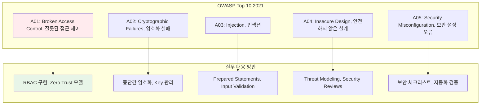

---
tags:
  - Security
  - Vulnerability
  - Penetration
  - Cryptography
  - Guide
  - DevSecOps
---

# Chapter 15: Security Engineering - 안전한 시스템 구축의 기술

## 이 장에서 다루는 내용

"보안은 나중에 생각하면 돼" - 이 말만큼 위험한 생각은 없습니다.

보안 취약점은 하루아침에 수년간 쌓아올린 신뢰와 비즈니스를 파괴할 수 있습니다. 하지만 많은 개발자들이 보안을 "누군가 다른 사람의 일"로 여기거나, 복잡하고 어려운 영역으로 생각합니다.

이 장에서는 **시스템 보안의 핵심 원리**부터 **실전 보안 구현 기법**까지, 안전하고 신뢰할 수 있는 소프트웨어를 만드는 방법을 배웁니다.

## 왜 이것을 알아야 하는가?

### 🔥 2019년 7월 23일, 새벽 2시 30분 - 해킹당한 날

제가 스타트업 CTO로 일할 때 겪었던 실제 보안 사고입니다:

**새벽 2:30 - 이상한 알림들**

```bash
📱 AWS CloudWatch: "EC2 CPU usage > 95% for 10 minutes"
📱 DataDog: "Unusual network traffic detected"
📱 Slack: "#monitoring Database connection spike"

# 처음엔 대수롭지 않게 생각했습니다
개발자 A: "트래픽이 갑자기 늘었나?"
개발자 B: "크롤러봇이 과도하게 접근하는 건 아닐까?"
```

**새벽 2:45 - 뭔가 이상하다**

```bash
# 서버 로그를 확인해보니...
$ tail -f /var/log/nginx/access.log
192.168.1.100 - - [23/Jul/2019:02:30:15 +0000] "GET /../../../etc/passwd" 404
192.168.1.100 - - [23/Jul/2019:02:30:16 +0000] "POST /admin' OR 1=1--" 500
192.168.1.100 - - [23/Jul/2019:02:30:17 +0000] "GET /api/users/../../../proc/version" 404

# 😱 공격 패턴이 보입니다!
# Directory Traversal, SQL Injection 시도...
```

**새벽 3:00 - 최악의 발견**

```bash
# 데이터베이스를 확인하니...
mysql> SELECT * FROM admin_users;
# 원래 2명의 관리자 계정
# 하지만 테이블에 3번째 계정이 생성되어 있음!

admin_id: 3
username: h4cker_temp
email: temp@hacker.com
password: $2b$10$... (암호화됨)
created_at: 2019-07-23 02:31:42  # 😱 15분 전에 생성!

# 더 충격적인 발견
mysql> SELECT COUNT(*) FROM users;
# 원래 50,000명의 사용자
# 하지만 모든 사용자의 email이 덮어쓰기됨
# "pwned@hackers.org"로 변경되어 있음!
```

**새벽 3:15 - 공격 벡터 추적**

```bash
# 공격이 어떻게 이뤄졌는지 분석
$ grep -r "h4cker_temp" /var/log/

# Apache 로그에서 발견한 공격 패턴:
POST /api/admin/create_user HTTP/1.1
Content-Type: application/json
{
  "username": "h4cker_temp",
  "email": "temp@hacker.com", 
  "password": "temp123",
  "role": "admin"  # 🔥 권한 상승 취약점!
}

# 원인: API에서 role 파라미터를 검증하지 않음
# 누구나 admin 계정을 만들 수 있는 치명적 취약점
```

**새벽 4:00 - 피해 규모 파악**

```bash
💥 피해 현황:
- 50,000명 사용자 이메일 주소 변경
- 관리자 계정 무단 생성
- 데이터베이스 백업 파일 다운로드 시도 (다행히 실패)
- 서버 root 권한 탈취 시도 (다행히 실패)

💸 비즈니스 영향:
- 사용자 신뢰 상실
- GDPR 위반으로 인한 잠재적 과징금
- 복구 작업을 위한 서비스 중단 (6시간)
- 보안 컨설팅 비용 (2,000만원)
```

### 🛡️ 보안 강화 후: 완전히 달라진 시스템

이 사고 이후 우리가 구축한 보안 시스템:

**다층 보안 아키텍처**

```yaml
# 1. 네트워크 레벨
WAF (Web Application Firewall):
  - SQL Injection 자동 차단
  - XSS 패턴 필터링
  - Rate limiting (IP당 100 req/min)

# 2. 애플리케이션 레벨  
API Gateway:
  - JWT 토큰 검증
  - 역할 기반 접근 제어 (RBAC)
  - API 사용량 모니터링

# 3. 데이터 레벨
Database Security:
  - 쿼리 파라미터화 (Prepared Statements)
  - 민감 데이터 암호화
  - 데이터베이스 감사 로깅
```

**실시간 위협 탐지**

```bash
# 2020년, 같은 유형의 공격이 다시 시도됨
🚨 Automated Response System:

02:30:15 - SQL Injection 패턴 탐지
02:30:16 - WAF에서 자동 차단
02:30:17 - 공격자 IP 자동 블랙리스트 추가
02:30:18 - Slack으로 보안팀 즉시 알림

# 공격은 30초 만에 자동으로 차단됨! ✅
# 시스템에는 전혀 피해 없음
```

### 🧠 보안의 핵심: "Security by Design"

보안은 나중에 추가하는 것이 아니라, 처음부터 설계에 포함되어야 합니다:

```mermaid
graph TD
    subgraph "Traditional Approach (위험)"
        T1[요구사항 정의]
        T2[설계 및 개발]
        T3[테스팅]
        T4[배포]
        T5[😱 보안 사고 발생]
        T6[🚨 긴급 패치]
    end
    
    subgraph "Security by Design (안전)"
        S1[보안 요구사항 정의]
        S2[위협 모델링]
        S3[보안 설계]
        S4[보안 개발 가이드라인]
        S5[보안 테스팅]
        S6[보안 모니터링]
        S7[🛡️ 안전한 운영]
    end
    
    T1 --> T2
    T2 --> T3
    T3 --> T4
    T4 --> T5
    T5 --> T6
    
    S1 --> S2
    S2 --> S3
    S3 --> S4
    S4 --> S5
    S5 --> S6
    S6 --> S7
    
    style T5 fill:#ffcdd2
    style S7 fill:#c8e6c9
```



## 보안 위협의 진화

### OWASP Top 10: 가장 위험한 취약점들



### 현대적 위협들

```bash
# 🔥 2023년 트렌드: 공급망 공격 (Supply Chain Attack)
사례: SolarWinds, Log4Shell, node-ipc 패키지

공격 벡터:
1. 오픈소스 라이브러리에 악성 코드 삽입
2. 개발자들이 무심코 업데이트
3. 수천 개 애플리케이션에 동시 감염

대응 방안:
- SBOM (Software Bill of Materials) 관리
- 의존성 취약점 스캔 자동화
- 패키지 무결성 검증
```

## 이 장의 구성

### [15.1 메모리 보안](01-memory-security.md)

**"Segmentation Fault도 보안 이슈일 수 있다"**

- 🛡️ **Buffer Overflow 방어**: 스택 카나리, ASLR, DEP 이해
- 💀 **Use-After-Free 탐지**: Dangling pointer와 메모리 해제 후 사용
- 🔍 **메모리 안전 도구**: AddressSanitizer, Valgrind 활용법
- 🦀 **언어별 메모리 안전성**: C/C++ vs Rust vs Go 비교

```c
// 클래식한 Buffer Overflow 취약점
void vulnerable_function(char *user_input) {
    char buffer[256];
    strcpy(buffer, user_input);  // 🚨 위험! 길이 검증 없음
    printf("Input: %s, ", buffer);
}

// 안전한 버전
void safe_function(char *user_input) {
    char buffer[256];
    strncpy(buffer, user_input, sizeof(buffer) - 1);
    buffer[sizeof(buffer) - 1] = '\0';  // null 종료 보장
    printf("Input: %s, ", buffer);
}
```

### [15.2 네트워크 보안](02-network-security.md)

**"네트워크는 적대적 환경이다"**

- 🔐 **TLS/SSL 심화**: 인증서 관리, cipher suite 선택, Perfect Forward Secrecy
- 🌊 **DDoS 방어**: SYN Flood, Amplification 공격 대응
- 🔍 **네트워크 모니터링**: 이상 트래픽 탐지, IDS/IPS 구축
- 🛡️ **Zero Trust 네트워킹**: mTLS, Service Mesh 보안

**실제 TLS 설정 최적화**:

```nginx
# nginx SSL 설정 - 보안 강화 버전
ssl_protocols TLSv1.2 TLSv1.3;
ssl_ciphers ECDHE-RSA-AES256-GCM-SHA384:ECDHE-RSA-CHACHA20-POLY1305;
ssl_prefer_server_ciphers off;
ssl_session_timeout 1d;
ssl_session_cache shared:MozTLS:10m;
ssl_session_tickets off;

# HSTS 적용
add_header Strict-Transport-Security "max-age=63072000" always;
```

### [15.3 인증과 인가](03-authentication-authorization.md)

**"신원 확인 없이는 신뢰할 수 없다"**

- 🎫 **OAuth 2.0/OIDC 완전 정복**: Authorization Code Flow, PKCE 구현
- 🏷️ **JWT 보안**: 서명 검증, 토큰 만료, 클레임 검증
- 🔑 **다중 인증 (MFA)**: TOTP, WebAuthn, 생체 인증
- 👥 **역할 기반 접근 제어**: RBAC vs ABAC 설계

```javascript
// JWT 토큰 검증 - 제대로 하는 방법
const jwt = require('jsonwebtoken');

function verifyToken(token) {
    try {
        // 1. 서명 검증 (비밀키 또는 공개키)
        const decoded = jwt.verify(token, process.env.JWT_SECRET);
        
        // 2. 필수 클레임 검증
        if (!decoded.sub || !decoded.exp || !decoded.iat) {
            throw new Error('Missing required claims');
        }
        
        // 3. 토큰 만료 시간 검증 (라이브러리가 자동으로 해주지만 명시)
        if (decoded.exp < Date.now() / 1000) {
            throw new Error('Token expired');
        }
        
        // 4. 발급자 검증
        if (decoded.iss !== 'https://your-auth-server.com') {
            throw new Error('Invalid issuer');
        }
        
        return decoded;
    } catch (error) {
        throw new Error(`Token validation failed: ${error.message}`);
    }
}
```

### [15.4 컨테이너 보안](04-container-security.md)

**"격리된 것처럼 보이지만 실제로는..."**

- 📦 **이미지 보안**: 취약점 스캔, SBOM 관리, Distroless 이미지
- 🔒 **런타임 보안**: seccomp, AppArmor, 권한 최소화
- 🚧 **컨테이너 이스케이프 방어**: Privileged 컨테이너의 위험성
- ☸️ **Kubernetes 보안**: Pod Security Standards, Network Policy

```dockerfile
# 안전한 Docker 이미지 작성법
FROM node:18-alpine AS builder
# 보안 업데이트 적용
RUN apk update && apk upgrade

# 의존성 설치 (루트 권한으로)
COPY package*.json ./
RUN npm ci --only=production

# 운영용 스테이지
FROM node:18-alpine AS runtime
# 비특권 사용자 생성
RUN addgroup -g 1001 -S nodejs && \
    adduser -S nodejs -u 1001

# 애플리케이션 복사
COPY --from=builder /app/node_modules ./node_modules
COPY . .

# 권한 설정
RUN chown -R nodejs:nodejs /app
USER nodejs  # 🔒 루트가 아닌 사용자로 실행

EXPOSE 3000
CMD ["node", "index.js"]
```

### [15.5 암호화와 키 관리](05-cryptography-key-management.md)

**"암호화는 구현이 90%, 이론이 10%"**

- 🔐 **대칭/비대칭 암호화**: AES-GCM vs ChaCha20-Poly1305 선택
- 🗝️ **키 관리**: KMS, HSM, 키 교체 전략
- 📝 **해시와 서명**: bcrypt vs Argon2, ECDSA vs RSA
- 🔄 **End-to-End 암호화**: Signal Protocol, Double Ratchet 구현

**실제 암호화 구현 예제**:

```go
// AES-GCM 암호화/복호화 구현
func encrypt(plaintext, key []byte) ([]byte, error) {
    block, err := aes.NewCipher(key)
    if err != nil {
        return nil, err
    }
    
    gcm, err := cipher.NewGCM(block)
    if err != nil {
        return nil, err
    }
    
    // 랜덤 nonce 생성 (매우 중요!)
    nonce := make([]byte, gcm.NonceSize())
    if _, err := io.ReadFull(rand.Reader, nonce); err != nil {
        return nil, err
    }
    
    // 암호화
    ciphertext := gcm.Seal(nonce, nonce, plaintext, nil)
    return ciphertext, nil
}
```

## 🚀 실습 프로젝트: Security Engineering Lab

### Week 1: 취약점 스캔 및 분석

```bash
# 의존성 취약점 스캔
$ npm audit
$ go mod download
$ govulncheck ./...

# 코드 취약점 스캔  
$ semgrep --config=p/security-audit .
$ bandit -r python_project/
$ gosec ./...

# 컨테이너 이미지 스캔
$ trivy image myapp:latest
$ docker scout cves myapp:latest
```

### Week 2: 웹 애플리케이션 보안 테스팅

```bash
# OWASP ZAP을 활용한 자동화 보안 테스팅
$ docker run -t owasp/zap2docker-stable zap-full-scan.py \
  -t http://localhost:8080

# SQL Injection 테스팅
$ sqlmap -u "http://localhost:8080/login" \
  --forms --dump --risk=3 --level=5

# HTTPS 설정 검증
$ testssl.sh --grade --protocols --server-defaults \
  https://your-domain.com
```

### Week 3: 인증/인가 시스템 구현

```yaml
# OAuth 2.0 서버 구축 (Keycloak)
version: '3'
services:
  keycloak:
    image: quay.io/keycloak/keycloak:latest
    environment:
      KEYCLOAK_ADMIN: admin
      KEYCLOAK_ADMIN_PASSWORD: admin
    ports:
      - "8080:8080"
    command: start-dev
```

### Week 4: 종합 보안 시스템 구축

```bash
# 통합 보안 모니터링 구축
$ helm install security-stack ./security-stack
# - Falco (런타임 보안 모니터링)
# - OPA (정책 엔진)  
# - Cert-Manager (인증서 자동 관리)
# - External Secrets (보안 정보 관리)
```

## 💡 보안 엔지니어링의 핵심 원칙들

### 1. 심층 방어 (Defense in Depth)

```bash
# 단일 보안 장치에 의존하지 않기
Layer 1: 네트워크 방화벽 + WAF
Layer 2: API Gateway + Rate Limiting  
Layer 3: 애플리케이션 Input Validation
Layer 4: 데이터베이스 접근 제어
Layer 5: 암호화 + 키 관리
Layer 6: 모니터링 + 로깅
```

### 2. 최소 권한 원칙 (Principle of Least Privilege)

```yaml
# Kubernetes Pod 보안 예시
apiVersion: v1
kind: Pod
spec:
  securityContext:
    runAsNonRoot: true
    runAsUser: 1000
    fsGroup: 2000
  containers:
  - name: app
    securityContext:
      allowPrivilegeEscalation: false
      readOnlyRootFilesystem: true
      capabilities:
        drop:
        - ALL
        add:
        - NET_BIND_SERVICE
```

### 3. 암호화: 전송 중 + 저장 중 + 사용 중

```bash
# 완전한 암호화 구현
1. 전송 중 (In Transit): TLS 1.3
2. 저장 중 (At Rest): AES-256 disk encryption  
3. 사용 중 (In Use): Intel SGX, Homomorphic encryption
```

## 🎯 Security Engineering 성숙도 모델

### Level 1: Reactive Security (반응적)

```text
🔴 현재 상황: "사고 발생 후 대응"

특징:
- 보안 사고 후 패치 적용
- 수동적인 취약점 관리
- 보안팀이 별도로 존재
- 개발 완료 후 보안 검토
```

### Level 2: Proactive Security (예방적)  

```text
🟡 현재 상황: "보안을 미리 고려"

특징:
- SAST/DAST 도구 도입
- 정기적인 보안 교육
- CI/CD에 보안 검사 포함
- 취약점 스캔 자동화
```

### Level 3: Continuous Security (지속적)

```text
🟢 목표 상황: "보안이 개발 프로세스에 완전히 통합"

특징:
- DevSecOps 문화 정착
- 실시간 위협 탐지 및 대응
- 자동화된 보안 정책 적용
- 보안 메트릭 기반 의사결정
```

## 실무 적용 체크리스트

### 🔐 보안 설계 체크리스트

```bash
# 아키텍처 레벨
✅ 위협 모델링 완료
✅ 데이터 분류 및 보호 수준 정의
✅ 네트워크 세분화 설계
✅ 인증/인가 흐름 설계

# 구현 레벨  
✅ Input validation 모든 곳에 적용
✅ Output encoding/sanitization
✅ 민감한 데이터 암호화
✅ 보안 헤더 설정 (CSP, HSTS 등)

# 배포 레벨
✅ 보안 설정 리뷰
✅ 취약점 스캔 자동화
✅ 침투 테스팅 실시
✅ 보안 모니터링 구축
```

### 🚨 인시던트 대응 프로세스

```bash
1. 탐지 (Detection)
   - 자동화된 위협 탐지
   - 이상 행위 모니터링
   
2. 분석 (Analysis)  
   - 공격 벡터 파악
   - 영향 범위 조사
   
3. 억제 (Containment)
   - 공격 차단
   - 추가 피해 방지
   
4. 근절 (Eradication)
   - 취약점 패치
   - 악성 코드 제거
   
5. 복구 (Recovery)
   - 시스템 정상화
   - 서비스 재개
   
6. 사후 검토 (Post-Incident)
   - 근본 원인 분석
   - 보안 강화 방안 도출
```

## 🎯 이 장을 마스터하면

✅ **위협 모델링**: 시스템의 보안 위험을 체계적으로 분석할 수 있습니다  
✅ **보안 코딩**: 안전한 코드를 작성하고 취약점을 사전에 방지할 수 있습니다  
✅ **암호화 구현**: 적절한 암호화 알고리즘을 선택하고 안전하게 구현할 수 있습니다  
✅ **보안 아키텍처**: 확장 가능하고 안전한 시스템 아키텍처를 설계할 수 있습니다  

## 보안 전문가들의 명언

### Bruce Schneier - 암호학자, 보안 전문가
>
> **"Security is a process, not a product"**
>
> 보안은 제품이 아니라 과정입니다. 한 번 구축하면 끝나는 것이 아니라 지속적으로 개선해야 합니다.

### Kevin Mitnick - 전 해커, 보안 컨설턴트
>
> **"The weakest link in the security chain is the human element"**
>
> 보안의 가장 약한 고리는 사람입니다. 기술적 보안만큼이나 사람에 대한 교육이 중요합니다.

### Dan Geer - 보안 연구자
>
> **"The price of reliability is the pursuit of the utmost simplicity"**
>
> 안정성의 대가는 극도의 단순성을 추구하는 것입니다. 복잡할수록 취약점이 많아집니다.

## 흥미로운 사실들 🤓

### 해킹의 역사

- 1988년: 최초의 인터넷 웜 "Morris Worm" (전체 인터넷의 10% 감염)
- 2010년: Stuxnet (물리적 시설을 타겟으로 한 최초의 사이버 무기)
- 2017년: WannaCry 랜섬웨어 (전 세계 30만대 감염)

### 보안의 경제학

- 2023년 사이버 보안 시장 규모: $173.5억 달러
- 평균 데이터 유출 비용: $4.45M (2023년 IBM 조사)
- 보안 인재 부족: 전 세계 350만 명 부족 (2023년 기준)

## 다음 단계

준비되셨나요? [15.1 메모리 보안](01-memory-security.md)에서 Buffer Overflow부터 시작해 메모리 레벨에서의 공격과 방어를 깊이 있게 다뤄보겠습니다.

"보안은 선택이 아니라 필수입니다." 안전한 소프트웨어를 만드는 여정을 시작해봅시다! 🛡️⚡
