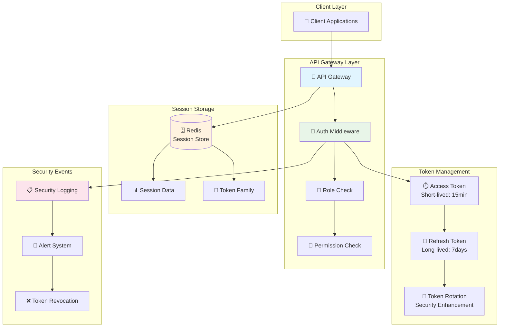

---
tags:
  - Authentication
  - Authorization
  - JWT
  - RBAC
  - Token Rotation
  - advanced
  - deep-study
  - hands-on
  - 인프라스트럭처
difficulty: ADVANCED
learning_time: "8-12시간"
main_topic: "인프라스트럭처"
priority_score: 4
---

# 16.5C API Gateway 통합 인증과 인가 시스템

## 🎯 학습 목표

API Gateway에서 가장 중요한 보안 기능인 통합 인증과 인가 시스템을 TypeScript로 구현하면서 다음을 학습합니다:

- JWT 기반 통합 인증 시스템 설계와 구현
- Refresh Token Rotation 보안 강화 기법
- Redis를 활용한 세션 관리와 토큰 저장
- 권한 기반 접근 제어 (RBAC) 구현
- 보안 이벤트 처리와 토큰 관리 전략
- Express 미들웨어를 통한 실전 통합

---

## 🔐 고급 인증과 인가 시스템

### JWT 기반 통합 인증 핵심 구조

```typescript
// TypeScript로 구현한 고급 인증 시스템
import jwt from 'jsonwebtoken';
import Redis from 'ioredis';
import { Request, Response, NextFunction } from 'express';
import crypto from 'crypto';

interface JWTPayload {
  userId: string;
  email: string;
  roles: string[];
  permissions: string[];
  sessionId: string;
  iat: number;
  exp: number;
  iss: string;
  aud: string;
}

interface RefreshTokenPayload {
  userId: string;
  sessionId: string;
  tokenFamily: string;
  iat: number;
  exp: number;
}
```

### 인증 서비스 핵심 클래스

```typescript
class AuthenticationService {
  private jwtSecret: string;
  private refreshSecret: string;
  private redis: Redis;
  private accessTokenTTL = 15 * 60; // 15 minutes
  private refreshTokenTTL = 7 * 24 * 60 * 60; // 7 days
  
  constructor(jwtSecret: string, refreshSecret: string, redisUrl: string) {
    this.jwtSecret = jwtSecret;
    this.refreshSecret = refreshSecret;
    this.redis = new Redis(redisUrl);
  }
  
  // 통합 로그인 처리
  async authenticateUser(email: string, password: string, clientInfo: any): Promise<{
    accessToken: string;
    refreshToken: string;
    user: any;
  }> {
    // 1. 사용자 검증 (User Service 호출)
    const user = await this.validateUserCredentials(email, password);
    
    if (!user) {
      throw new Error('Invalid credentials');
    }
    
    // 2. 세션 생성
    const sessionId = this.generateSessionId();
    const tokenFamily = this.generateTokenFamily();
    
    // 3. 사용자 권한 조회 (Permission Service 호출)
    const permissions = await this.getUserPermissions(user.id);
    
    // 4. Access Token 생성
    const accessToken = this.generateAccessToken({
      userId: user.id,
      email: user.email,
      roles: user.roles,
      permissions: permissions,
      sessionId: sessionId
    });
    
    // 5. Refresh Token 생성
    const refreshToken = this.generateRefreshToken({
      userId: user.id,
      sessionId: sessionId,
      tokenFamily: tokenFamily
    });
    
    // 6. 세션 정보를 Redis에 저장
    await this.storeSession(sessionId, {
      userId: user.id,
      email: user.email,
      roles: user.roles,
      permissions: permissions,
      tokenFamily: tokenFamily,
      clientInfo: clientInfo,
      loginTime: Date.now(),
      lastActivity: Date.now()
    });
    
    // 7. Refresh Token을 Redis에 저장 (보안)
    await this.storeRefreshToken(tokenFamily, refreshToken, user.id);
    
    console.log(`✅ 사용자 인증 성공: ${email} (session: ${sessionId})`);
    
    return {
      accessToken,
      refreshToken,
      user: {
        id: user.id,
        email: user.email,
        name: user.name,
        roles: user.roles,
        permissions: permissions
      }
    };
  }
```

### 🎫 토큰 생성 및 관리

```typescript
  // Access Token 생성
  private generateAccessToken(payload: Omit<JWTPayload, 'iat' | 'exp' | 'iss' | 'aud'>): string {
    const now = Math.floor(Date.now() / 1000);
    
    const tokenPayload: JWTPayload = {
      ...payload,
      iat: now,
      exp: now + this.accessTokenTTL,
      iss: 'api-gateway',
      aud: 'api-consumers'
    };
    
    return jwt.sign(tokenPayload, this.jwtSecret, {
      algorithm: 'HS256'
    });
  }
  
  // Refresh Token 생성
  private generateRefreshToken(payload: Omit<RefreshTokenPayload, 'iat' | 'exp'>): string {
    const now = Math.floor(Date.now() / 1000);
    
    const tokenPayload: RefreshTokenPayload = {
      ...payload,
      iat: now,
      exp: now + this.refreshTokenTTL
    };
    
    return jwt.sign(tokenPayload, this.refreshSecret, {
      algorithm: 'HS256'
    });
  }
  
  // Token 검증
  async verifyAccessToken(token: string): Promise<JWTPayload | null> {
    try {
      const payload = jwt.verify(token, this.jwtSecret) as JWTPayload;
      
      // 세션 유효성 검증
      const session = await this.getSession(payload.sessionId);
      
      if (!session) {
        console.log(`❌ 세션 만료: ${payload.sessionId}`);
        return null;
      }
      
      // 마지막 활동 시간 업데이트
      await this.updateLastActivity(payload.sessionId);
      
      return payload;
      
    } catch (error) {
      console.log(`❌ Token 검증 실패: ${error.message}`);
      return null;
    }
  }
```

### 🔄 Refresh Token Rotation 보안 강화

```typescript
  // Refresh Token으로 새 Access Token 발급
  async refreshAccessToken(refreshToken: string): Promise<{
    accessToken: string;
    refreshToken: string;
  } | null> {
    try {
      const payload = jwt.verify(refreshToken, this.refreshSecret) as RefreshTokenPayload;
      
      // Refresh Token 유효성 검증
      const storedToken = await this.getRefreshToken(payload.tokenFamily);
      
      if (!storedToken || storedToken !== refreshToken) {
        // 토큰 재사용 공격 탐지
        console.log(`🚨 토큰 재사용 공격 탐지: ${payload.userId}`);
        await this.revokeAllTokens(payload.userId);
        return null;
      }
      
      // 세션 정보 조회
      const session = await this.getSession(payload.sessionId);
      
      if (!session) {
        console.log(`❌ 세션이 존재하지 않음: ${payload.sessionId}`);
        return null;
      }
      
      // 새로운 Token Family 생성 (Refresh Token Rotation)
      const newTokenFamily = this.generateTokenFamily();
      
      // 새 Access Token 생성
      const newAccessToken = this.generateAccessToken({
        userId: session.userId,
        email: session.email,
        roles: session.roles,
        permissions: session.permissions,
        sessionId: payload.sessionId
      });
      
      // 새 Refresh Token 생성
      const newRefreshToken = this.generateRefreshToken({
        userId: payload.userId,
        sessionId: payload.sessionId,
        tokenFamily: newTokenFamily
      });
      
      // 기존 Refresh Token 삭제
      await this.deleteRefreshToken(payload.tokenFamily);
      
      // 새 Refresh Token 저장
      await this.storeRefreshToken(newTokenFamily, newRefreshToken, payload.userId);
      
      // 세션의 Token Family 업데이트
      await this.updateSessionTokenFamily(payload.sessionId, newTokenFamily);
      
      console.log(`🔄 Token 갱신 완료: ${payload.userId}`);
      
      return {
        accessToken: newAccessToken,
        refreshToken: newRefreshToken
      };
      
    } catch (error) {
      console.log(`❌ Refresh Token 검증 실패: ${error.message}`);
      return null;
    }
  }
```

### 🚪 로그아웃과 세션 관리

```typescript
  // 로그아웃 처리
  async logout(sessionId: string): Promise<void> {
    const session = await this.getSession(sessionId);
    
    if (session) {
      // Refresh Token 삭제
      await this.deleteRefreshToken(session.tokenFamily);
      
      // 세션 삭제
      await this.deleteSession(sessionId);
      
      console.log(`👋 로그아웃 완료: session ${sessionId}`);
    }
  }
  
  // 모든 세션 로그아웃 (보안 이벤트)
  async logoutAllSessions(userId: string): Promise<void> {
    // 사용자의 모든 세션 조회
    const sessionKeys = await this.redis.keys(`session:*`);
    const sessions = await this.redis.mget(sessionKeys);
    
    const userSessions = sessions
      .map(session => session ? JSON.parse(session) : null)
      .filter(session => session && session.userId === userId);
    
    // 모든 세션과 Refresh Token 삭제
    for (const session of userSessions) {
      await this.deleteRefreshToken(session.tokenFamily);
      await this.deleteSession(session.sessionId);
    }
    
    console.log(`🚪 전체 로그아웃 완료: 사용자 ${userId}, ${userSessions.length}개 세션`);
  }
```

### 🛡️ 권한 기반 접근 제어 (RBAC)

```typescript
  // 권한 검증 미들웨어
  requirePermission(permission: string) {
    return (req: Request, res: Response, next: NextFunction) => {
      const user = req.user as JWTPayload;
      
      if (!user) {
        return res.status(401).json({ error: 'Authentication required' });
      }
      
      if (!user.permissions.includes(permission)) {
        console.log(`❌ 권한 부족: ${user.userId}, 필요 권한: ${permission}`);
        return res.status(403).json({ 
          error: 'Insufficient permissions',
          required: permission,
          user_permissions: user.permissions
        });
      }
      
      next();
    };
  }
  
  // 역할 검증 미들웨어
  requireRole(role: string) {
    return (req: Request, res: Response, next: NextFunction) => {
      const user = req.user as JWTPayload;
      
      if (!user) {
        return res.status(401).json({ error: 'Authentication required' });
      }
      
      if (!user.roles.includes(role)) {
        console.log(`❌ 역할 부족: ${user.userId}, 필요 역할: ${role}`);
        return res.status(403).json({ 
          error: 'Insufficient role',
          required: role,
          user_roles: user.roles
        });
      }
      
      next();
    };
  }
```

### 📦 Redis 세션 관리 구현

```typescript
  // Redis 세션 관리
  private async storeSession(sessionId: string, sessionData: any): Promise<void> {
    await this.redis.setex(
      `session:${sessionId}`, 
      this.refreshTokenTTL, 
      JSON.stringify(sessionData)
    );
  }
  
  private async getSession(sessionId: string): Promise<any> {
    const sessionData = await this.redis.get(`session:${sessionId}`);
    return sessionData ? JSON.parse(sessionData) : null;
  }
  
  private async deleteSession(sessionId: string): Promise<void> {
    await this.redis.del(`session:${sessionId}`);
  }
  
  private async updateLastActivity(sessionId: string): Promise<void> {
    const session = await this.getSession(sessionId);
    
    if (session) {
      session.lastActivity = Date.now();
      await this.storeSession(sessionId, session);
    }
  }
  
  private async updateSessionTokenFamily(sessionId: string, tokenFamily: string): Promise<void> {
    const session = await this.getSession(sessionId);
    
    if (session) {
      session.tokenFamily = tokenFamily;
      await this.storeSession(sessionId, session);
    }
  }
```

### 🔒 Refresh Token 보안 관리

```typescript
  // Refresh Token 관리
  private async storeRefreshToken(tokenFamily: string, token: string, userId: string): Promise<void> {
    await this.redis.setex(
      `refresh:${tokenFamily}`, 
      this.refreshTokenTTL, 
      JSON.stringify({ token, userId })
    );
  }
  
  private async getRefreshToken(tokenFamily: string): Promise<string | null> {
    const data = await this.redis.get(`refresh:${tokenFamily}`);
    return data ? JSON.parse(data).token : null;
  }
  
  private async deleteRefreshToken(tokenFamily: string): Promise<void> {
    await this.redis.del(`refresh:${tokenFamily}`);
  }
  
  // 보안 관련 메서드
  private generateSessionId(): string {
    return crypto.randomBytes(32).toString('hex');
  }
  
  private generateTokenFamily(): string {
    return crypto.randomBytes(16).toString('hex');
  }
  
  private async revokeAllTokens(userId: string): Promise<void> {
    // 보안 이벤트 로깅
    console.log(`🚨 보안 이벤트: 사용자 ${userId}의 모든 토큰 폐기`);
    
    // 모든 세션 무효화
    await this.logoutAllSessions(userId);
    
    // 보안 알림 발송 (선택적)
    await this.sendSecurityAlert(userId, 'TOKEN_REVOCATION', 'All tokens revoked due to security event');
  }
  
  private async sendSecurityAlert(userId: string, eventType: string, message: string): Promise<void> {
    // 실제로는 Notification Service 호출
    console.log(`📧 보안 알림: ${userId} - ${eventType}: ${message}`);
  }
```

### 🔌 외부 서비스 통합

```typescript
  // 외부 서비스 호출
  private async validateUserCredentials(email: string, password: string): Promise<any> {
    // 실제로는 User Service API 호출
    // 여기서는 모의 구현
    return {
      id: 'user-123',
      email: email,
      name: 'John Doe',
      roles: ['user']
    };
  }
  
  private async getUserPermissions(userId: string): Promise<string[]> {
    // 실제로는 Permission Service API 호출
    // 여기서는 모의 구현
    return ['read:profile', 'write:posts', 'delete:own_posts'];
  }
}
```

---

## 🔧 Express 미들웨어 통합

### 인증 미들웨어 구현

```typescript
// Express 미들웨어
export function createAuthMiddleware(authService: AuthenticationService) {
  return async (req: Request, res: Response, next: NextFunction) => {
    const authHeader = req.headers.authorization;
    
    if (!authHeader || !authHeader.startsWith('Bearer ')) {
      return res.status(401).json({ error: 'Authorization header required' });
    }
    
    const token = authHeader.substring(7);
    const payload = await authService.verifyAccessToken(token);
    
    if (!payload) {
      return res.status(401).json({ error: 'Invalid or expired token' });
    }
    
    // 사용자 정보를 request에 추가
    req.user = payload;
    
    next();
  };
}
```

### 실제 사용 예제

```typescript
// 사용 예제
const authService = new AuthenticationService(
  process.env.JWT_SECRET!,
  process.env.REFRESH_SECRET!,
  process.env.REDIS_URL!
);

export default authService;
```

---

## 🛡️ 보안 강화 전략

### 다층 보안 아키텍처



### 보안 이벤트 모니터링

```typescript
// 보안 이벤트 타입 정의
enum SecurityEventType {
  LOGIN_SUCCESS = 'LOGIN_SUCCESS',
  LOGIN_FAILURE = 'LOGIN_FAILURE',
  TOKEN_REFRESH = 'TOKEN_REFRESH',
  TOKEN_REUSE_ATTACK = 'TOKEN_REUSE_ATTACK',
  PERMISSION_DENIED = 'PERMISSION_DENIED',
  SESSION_TIMEOUT = 'SESSION_TIMEOUT',
  FORCED_LOGOUT = 'FORCED_LOGOUT'
}

interface SecurityEvent {
  userId?: string;
  sessionId?: string;
  eventType: SecurityEventType;
  clientInfo: {
    ip: string;
    userAgent: string;
    location?: string;
  };
  timestamp: number;
  details: any;
}

class SecurityMonitor {
  private redis: Redis;
  
  async logSecurityEvent(event: SecurityEvent): Promise<void> {
    const eventKey = `security:${event.eventType}:${event.timestamp}`;
    await this.redis.setex(eventKey, 30 * 24 * 60 * 60, JSON.stringify(event)); // 30일 보관
    
    // 위험한 이벤트는 즉시 알림
    if (this.isDangerousEvent(event.eventType)) {
      await this.sendImmediateAlert(event);
    }
  }
  
  private isDangerousEvent(eventType: SecurityEventType): boolean {
    return [
      SecurityEventType.TOKEN_REUSE_ATTACK,
      SecurityEventType.PERMISSION_DENIED
    ].includes(eventType);
  }
  
  private async sendImmediateAlert(event: SecurityEvent): Promise<void> {
    console.log(`🚨 즉시 알림: ${event.eventType} - ${event.userId}`);
    // 실제로는 Slack, Email, SMS 등으로 알림 발송
  }
}
```

---

## 💡 핵심 포인트 요약

### ✅ 보안 설계 원칙

**1. 최소 권한 원칙 (Principle of Least Privilege)**

- Access Token은 짧은 수명 (15분)으로 노출 위험 최소화
- 권한별 세밀한 접근 제어로 필요한 권한만 부여
- 역할 기반 접근 제어로 관리 복잡도 감소

**2. 심층 방어 (Defense in Depth)**

- JWT 토큰 검증 + Redis 세션 검증 이중 확인
- Refresh Token Rotation으로 토큰 재사용 공격 방지
- 보안 이벤트 실시간 모니터링과 자동 대응

**3. 제로 트러스트 (Zero Trust)**

- 모든 요청에 대해 인증과 인가 검증 수행
- 세션 상태 실시간 확인으로 탈취된 토큰 무효화
- 비정상 패턴 탐지 시 즉시 모든 세션 차단

### 🎯 실무 적용 가이드

```bash
보안 강화 체크리스트:

✅ JWT Secret 키 안전한 관리 (환경 변수, KMS)
✅ Redis 접근 제어 및 암호화 통신
✅ HTTPS 강제 적용으로 토큰 전송 보안
✅ Rate Limiting으로 브루트포스 공격 방지  
✅ 보안 헤더 설정 (CORS, CSP, HSTS)
✅ 정기적인 토큰 순환 정책 수립
```

---

## 🔗 연관 학습 자료

- **[16.5A API Gateway 기초](./16-07-api-gateway-fundamentals.md)** - API Gateway 패턴의 기본 개념
- **[16.5B 라우팅과 로드 밸런싱](./05b-routing-load-balancing.md)** - 고성능 트래픽 처리
- **[16.5D Rate Limiting](./16-42-rate-limiting-monitoring.md)** - 트래픽 제어와 모니터링
- **[16.5 API Gateway 패턴 종합](./16-55-api-gateway-patterns.md)** - 전체 개요와 학습 로드맵

---

**다음**: [Rate Limiting과 트래픽 제어](./16-42-rate-limiting-monitoring.md)에서 고급 트래픽 관리 기법을 학습해보세요! ⚡

## 📚 관련 문서

### 📖 현재 문서 정보

- **난이도**: ADVANCED
- **주제**: 인프라스트럭처
- **예상 시간**: 8-12시간

### 🎯 학습 경로

- [📚 ADVANCED 레벨 전체 보기](../learning-paths/advanced/)
- [🏠 메인 학습 경로](../learning-paths/)
- [📋 전체 가이드 목록](../README.md)

### 📂 같은 챕터 (chapter-16-distributed-system-patterns)

- [15.1 마이크로서비스 아키텍처 개요](../chapter-15-microservices-architecture/16-01-microservices-architecture.md)
- [15.1A 모놀리스 문제점과 전환 전략](../chapter-15-microservices-architecture/16-10-monolith-to-microservices.md)
- [16.1B 마이크로서비스 설계 원칙과 패턴 개요](./16-11-design-principles.md)
- [16.1B1 단일 책임 원칙 (Single Responsibility Principle)](./16-12-1-single-responsibility-principle.md)
- [16.1B1 단일 책임 원칙 (Single Responsibility Principle)](./16-13-1-single-responsibility.md)

### 🏷️ 관련 키워드

`JWT`, `Authentication`, `Authorization`, `RBAC`, `Token Rotation`

### ⏭️ 다음 단계 가이드

- 시스템 전체의 관점에서 이해하려 노력하세요
- 다른 고급 주제들과의 연관성을 파악해보세요
