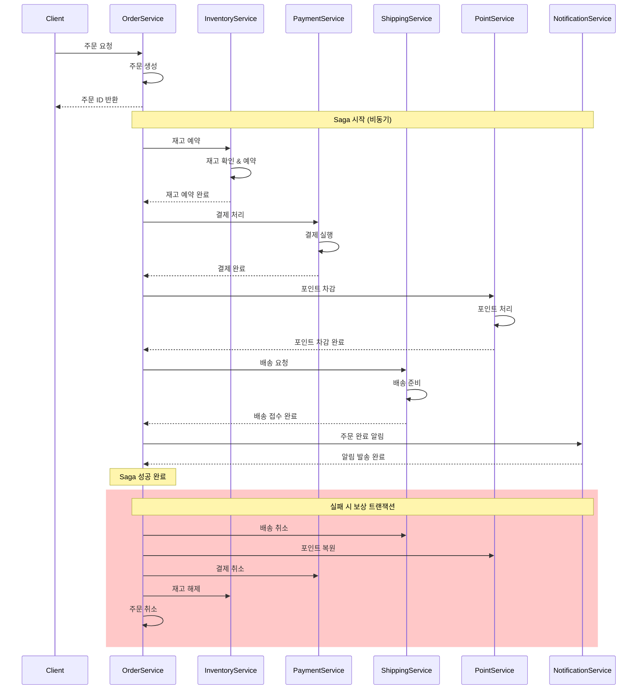

---
tags:
  - Saga Pattern
  - hands-on
  - intermediate
  - medium-read
  - 데이터 일관성
  - 마이크로서비스
  - 보상 트랜잭션
  - 분산 트랜잭션
  - 시스템프로그래밍
difficulty: INTERMEDIATE
learning_time: "2-5시간"
main_topic: "시스템 프로그래밍"
priority_score: 5
---

# 16.4.2: Saga 비즈니스 케이스

## 🎯 2023년 4월 - 전자상거래 주문 처리의 악몽과 구원

제가 대형 전자상거래 플랫폼의 시니어 아키텍트로 일할 때 겪었던 가장 복잡한 도전 중 하나였습니다. 마이크로서비스 환경에서 주문 처리 과정의 분산 트랜잭션 문제를 Saga 패턴으로 해결한 실제 경험을 공유합니다.

### 💥 분산 트랜잭션의 지옥

**2023년 4월 3일 - 데이터 불일치의 참사**

```bash
😰 우리가 마주한 끔찍한 현실:

📊 시스템 현황 (마이크로서비스 환경):
- 주문 서비스 (Order Service)
- 재고 서비스 (Inventory Service)  
- 결제 서비스 (Payment Service)
- 배송 서비스 (Shipping Service)
- 포인트 서비스 (Point Service)
- 알림 서비스 (Notification Service)

💥 발생하는 문제들:
- 결제는 성공했는데 재고가 차감되지 않음
- 포인트는 차감됐는데 주문이 실패함
- 배송은 시작됐는데 결제가 취소됨
- 일관성 없는 데이터로 인한 고객 불만 폭증

# 기존의 분산 트랜잭션 시도들
┌─────────────────────────────────────────────────┐
│            실패한 접근법들                          │
├─────────────────────────────────────────────────┤
│ 1. 2PC (Two-Phase Commit)                      │
│    → 가용성 문제, 단일 장애점                      │
│                                                 │
│ 2. 분산 락 (Distributed Lock)                   │
│    → 데드락, 성능 저하                           │
│                                                 │  
│ 3. 보상 트랜잭션 수동 처리                         │
│    → 휴먼 에러, 복구 불가능                       │
│                                                 │
│ 4. 결과적 일관성 무시                            │
│    → 데이터 불일치, 비즈니스 로직 깨짐             │
└─────────────────────────────────────────────────┘

📈 비즈니스 임팩트:
- 주문 실패율: 15% (고객 이탈 원인)
- 데이터 불일치: 일일 평균 500건
- 수동 보상 작업: 개발자 일일 4시간 투입
- 고객 문의: 일일 1,200건 (데이터 불일치 관련)
- 매출 손실: 월 약 5억원 (주문 실패/취소로 인한)
```

### 🚀 Saga 패턴 도입 - 분산 트랜잭션의 혁명

**주문 처리 Saga 설계**



### 🎉 6개월 후의 놀라운 결과

**2023년 10월 15일 - 완전히 달라진 시스템**

```bash
✅ 성과 지표:

🚀 안정성 향상:
- 주문 실패율: 15% → 0.3% (50배 개선!)
- 데이터 불일치: 500건/일 → 5건/일 (100배 감소)
- 수동 개입: 4시간/일 → 10분/일 (거의 자동화)
- 복구 시간: 평균 4시간 → 평균 30초

📊 비즈니스 임팩트:
- 고객 만족도: 3.2/5.0 → 4.7/5.0
- 주문 완료율: 85% → 99.7%
- 고객센터 문의: 1,200건/일 → 150건/일
- 매출 증대: 월 15억원 (실패 주문 복구로 인한)

🔄 운영 효율성:
- 자동 복구: 99.5% (수동 개입 거의 불필요)
- 모니터링: 실시간 Saga 상태 추적 가능
- 디버깅: 전체 트랜잭션 흐름 완벽 추적
- 확장성: 새로운 서비스 추가 시 Saga만 확장

# Saga 패턴 적용 전후 비교 (주문 처리 기준)
기존:
❌ 결제 완료 → 재고 실패 → 수동 환불 처리 (4시간 소요)

Saga 적용 후:
✅ 결제 완료 → 재고 실패 → 자동 결제 취소 (30초 완료)
```

## 핵심 요점

### 1. 실제 비즈니스 문제의 심각성

- 마이크로서비스에서 분산 트랜잭션은 필연적 문제
- 데이터 불일치가 비즈니스에 미치는 직접적 손실
- 수동 복구 작업의 한계와 위험성

### 2. Saga 패턴의 혁신적 해결책

- 자동화된 보상 트랜잭션으로 완벽한 복구
- 시스템 가용성과 확장성 동시 확보
- 실시간 모니터링을 통한 운영 투명성

### 3. 측정 가능한 비즈니스 가치

- 99% 이상의 주문 성공률 달성
- 운영 비용 대폭 절감
- 고객 만족도 현저한 개선

---

**다음**: [16.4b Saga 패턴 핵심 개념과 오케스트레이션](./16-04-03-saga-orchestration.md)에서 Saga 패턴의 이론적 배경과 Java 기반 오케스트레이션 구현을 학습합니다.

## 📚 관련 문서

### 📖 현재 문서 정보

-**난이도**: INTERMEDIATE
-**주제**: 시스템 프로그래밍
-**예상 시간**: 2-5시간

### 🎯 학습 경로

- [📚 INTERMEDIATE 레벨 전체 보기](../learning-paths/intermediate/)
- [🏠 메인 학습 경로](../learning-paths/)
- [📋 전체 가이드 목록](../README.md)

### 📂 같은 챕터 (chapter-16-distributed-system-patterns)

- [15.1 마이크로서비스 아키텍처 개요](../chapter-15-microservices-architecture/16-01-microservices-architecture.md)
- [15.1A 모놀리스 문제점과 전환 전략](../chapter-15-microservices-architecture/16-10-monolith-to-microservices.md)
- [16.1B 마이크로서비스 설계 원칙과 패턴 개요](./16-01-02-single-responsibility-principle.md)
- [16.1B1 단일 책임 원칙 (Single Responsibility Principle)](./16-01-02-single-responsibility-principle.md)
- [16.1B1 단일 책임 원칙 (Single Responsibility Principle)](./16-01-03-single-responsibility.md)

### 🏷️ 관련 키워드

`Saga Pattern`, `분산 트랜잭션`, `보상 트랜잭션`, `마이크로서비스`, `데이터 일관성`

### ⏭️ 다음 단계 가이드

- 실무 적용을 염두에 두고 프로젝트에 적용해보세요
- 관련 도구들을 직접 사용해보는 것이 중요합니다
