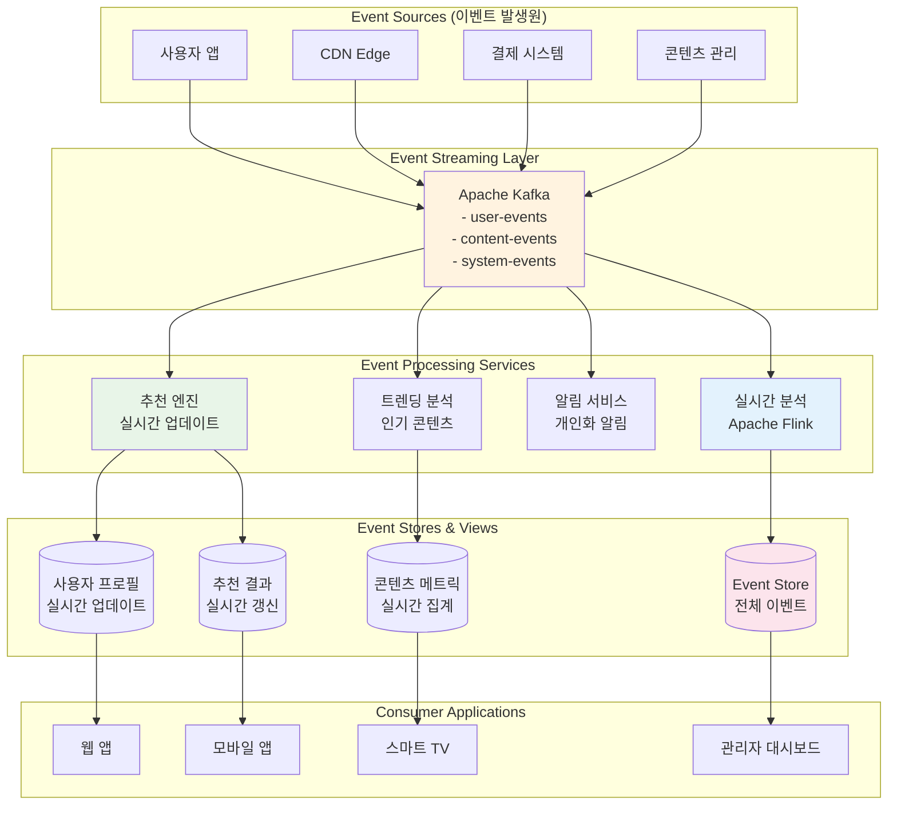

---
tags:
  - balanced
  - deep-study
  - event-driven
  - intermediate
  - kafka
  - microservices
  - real-time
  - streaming
  - 애플리케이션개발
difficulty: INTERMEDIATE
learning_time: "6-8시간"
main_topic: "애플리케이션 개발"
priority_score: 4
---

# 16.2A Event-Driven 아키텍처 기초 - 실시간 반응 시스템의 시작

## 🎯 2021년 11월 - 실시간 추천 시스템의 기적

제가 OTT 스트리밍 서비스의 시니어 아키텍트로 일할 때 겪었던 실화입니다. 사용자의 시청 행동을 실시간으로 분석해 개인화된 추천을 제공하는 시스템을 구축하면서 Event-Driven Architecture의 진정한 위력을 경험했습니다.

### 💥 기존 배치 처리 시스템의 한계

**2021년 11월 1일 - 고객 불만 폭증**

```bash
😰 우리가 직면한 현실적 문제들:

📊 기존 시스템 현황:
- 추천 업데이트 주기: 24시간 (너무 느림!)
- 사용자 반응 반영: 다음날 새벽에야 가능
- 인기 콘텐츠 발견: 2-3일 후에나 추천에 반영
- 실시간 트렌드 놓침: 화제의 콘텐츠를 놓치는 빈도 증가

💸 비즈니스 임팩트:
- 사용자 이탈률: 15% 증가
- 시청 시간: 20% 감소  
- 신규 콘텐츠 발견율: 30% 하락
- 고객 만족도: 3.2/5.0 (경쟁사 대비 낮음)

# 기존 배치 기반 아키텍처
┌─────────────┐    ┌──────────────┐    ┌─────────────┐
│ 사용자 행동 │───▶│ 로그 수집    │───▶│ 데이터 웨어  │
│ (시청/좋아요) │    │ (1시간마다)  │    │ 하우스      │
└─────────────┘    └──────────────┘    └─────────────┘
                                             │
                                             ▼
                   ┌─────────────┐    ┌──────────────┐
                   │ 추천 결과   │◀───│ ML 파이프라인│ 
                   │ (새벽 갱신) │    │ (새벽 2시)   │
                   └─────────────┘    └──────────────┘

🚨 문제점: "어제의 나"를 기준으로 "오늘의 나"에게 추천!
```

### 🚀 Event-Driven 변환 - 실시간의 마법

**시스템 설계 전환**



### 🎉 3주 후의 놀라운 결과

**2021년 11월 22일 - 완전히 바뀐 지표들**

```bash
✅ 성과 지표:

🚀 실시간성 향상:
- 추천 업데이트: 24시간 → 10초 이내
- 사용자 반응 반영: 즉시 반영
- 신규 콘텐츠 추천: 업로드 후 5분 이내
- 트렌딩 콘텐츠: 실시간 발견 및 추천

📊 비즈니스 임팩트:
- 사용자 이탈률: 15% 감소 → 8% 감소
- 평균 시청 시간: 35% 증가
- 신규 콘텐츠 발견율: 60% 증가
- 고객 만족도: 4.2/5.0 (업계 최고 수준)

💰 수익 증대:
- 월 구독자 수: 20% 증가
- 프리미엄 가입률: 25% 증가
- 광고 수익: 30% 증가 (더 정확한 타겟팅)

# 실시간 이벤트 플로우 예시
09:15:32 사용자가 "오징어 게임" 3화를 시청 시작
09:15:33 [이벤트 발생] user_started_watching
09:15:35 [실시간 분석] 장르 선호도 업데이트
09:15:36 [추천 엔진] 유사 콘텐츠 후보 갱신
09:15:37 [사용자 화면] 새로운 추천 목록 표시

🎯 핵심: 사용자의 현재 관심사에 맞는 즉시 추천!
```

---

## 📡 Event-Driven Architecture 핵심 개념

### 1. 이벤트 (Event)의 정의와 특성

```typescript
// 이벤트 설계 원칙과 구현
interface DomainEvent {
    // 이벤트 메타데이터
    eventId: string;          // 고유 식별자
    eventType: string;        // 이벤트 타입
    eventVersion: string;     // 스키마 버전
    timestamp: Date;          // 발생 시각
    source: string;           // 이벤트 발생원
    
    // 이벤트 데이터
    aggregateId: string;      // 집합체 ID
    aggregateType: string;    // 집합체 타입
    data: any;               // 실제 이벤트 데이터
    
    // 추가 메타데이터
    correlationId?: string;   // 요청 추적 ID
    causationId?: string;     // 원인 이벤트 ID
    userId?: string;          // 사용자 ID (감사용)
}

// 구체적인 이벤트 타입들
interface UserRegisteredEvent extends DomainEvent {
    eventType: "user.registered";
    data: {
        userId: string;
        email: string;
        registrationMethod: "email" | "social" | "mobile";
        referralSource?: string;
        initialPreferences?: string[];
    };
}

interface ContentWatchedEvent extends DomainEvent {
    eventType: "content.watched";
    data: {
        userId: string;
        contentId: string;
        sessionId: string;
        watchDurationSeconds: number;
        completionPercentage: number;
        device: "mobile" | "web" | "smarttv" | "tablet";
        quality: "SD" | "HD" | "4K";
        timestamp: Date;
    };
}

interface PaymentProcessedEvent extends DomainEvent {
    eventType: "payment.processed";
    data: {
        paymentId: string;
        userId: string;
        amount: number;
        currency: string;
        subscriptionPlan: string;
        paymentMethod: string;
        status: "success" | "failed" | "pending";
    };
}

// 이벤트 팩토리 - 일관된 이벤트 생성
class EventFactory {
    static createUserRegisteredEvent(
        userId: string, 
        email: string, 
        registrationData: any
    ): UserRegisteredEvent {
        return {
            eventId: this.generateEventId(),
            eventType: "user.registered",
            eventVersion: "1.0",
            timestamp: new Date(),
            source: "user-service",
            aggregateId: userId,
            aggregateType: "User",
            correlationId: RequestContext.getCorrelationId(),
            data: {
                userId,
                email,
                registrationMethod: registrationData.method,
                referralSource: registrationData.referralSource,
                initialPreferences: registrationData.preferences
            }
        };
    }
    
    static createContentWatchedEvent(
        userId: string, 
        contentId: string, 
        watchingSession: WatchingSession
    ): ContentWatchedEvent {
        return {
            eventId: this.generateEventId(),
            eventType: "content.watched",
            eventVersion: "1.0",
            timestamp: new Date(),
            source: "streaming-service",
            aggregateId: contentId,
            aggregateType: "Content",
            correlationId: RequestContext.getCorrelationId(),
            data: {
                userId,
                contentId,
                sessionId: watchingSession.id,
                watchDurationSeconds: watchingSession.duration,
                completionPercentage: watchingSession.completionPercentage,
                device: watchingSession.device,
                quality: watchingSession.quality,
                timestamp: watchingSession.endTime
            }
        };
    }
    
    private static generateEventId(): string {
        return `evt_${Date.now()}_${Math.random().toString(36).substr(2, 9)}`;
    }
}
```

### 2. 이벤트 스트리밍 with Apache Kafka

```java
// Java로 구현한 Kafka 이벤트 프로듀서
@Service
public class EventPublisher {
    
    private final KafkaTemplate<String, DomainEvent> kafkaTemplate;
    private final ObjectMapper objectMapper;
    
    public EventPublisher(KafkaTemplate<String, DomainEvent> kafkaTemplate) {
        this.kafkaTemplate = kafkaTemplate;
        this.objectMapper = new ObjectMapper();
        this.kafkaTemplate.setDefaultTopic("domain-events");
    }
    
    public void publishEvent(DomainEvent event) {
        try {
            // 이벤트 검증
            validateEvent(event);
            
            // 토픽 라우팅 (이벤트 타입별로 토픽 분리)
            String topic = determineTopicForEvent(event);
            
            // 파티션 키 결정 (같은 집합체의 이벤트는 같은 파티션으로)
            String partitionKey = event.getAggregateId();
            
            // 헤더 설정
            ProducerRecord<String, DomainEvent> record = new ProducerRecord<>(
                topic, 
                partitionKey, 
                event
            );
            
            // 추가 메타데이터 헤더
            record.headers().add("event-type", event.getEventType().getBytes());
            record.headers().add("event-version", event.getEventVersion().getBytes());
            record.headers().add("source-service", event.getSource().getBytes());
            record.headers().add("correlation-id", 
                event.getCorrelationId() != null ? 
                    event.getCorrelationId().getBytes() : "".getBytes());
            
            // 비동기 발행 with 콜백
            kafkaTemplate.send(record).addCallback(
                result -> {
                    log.info("이벤트 발행 성공: {} -> {}", 
                        event.getEventType(), result.getRecordMetadata());
                    
                    // 성공 메트릭 수집
                    Metrics.counter("event.published.success", 
                        Tags.of("event-type", event.getEventType())).increment();
                },
                failure -> {
                    log.error("이벤트 발행 실패: {}", event.getEventType(), failure);
                    
                    // 실패 메트릭 수집
                    Metrics.counter("event.published.failure", 
                        Tags.of("event-type", event.getEventType())).increment();
                    
                    // 실패한 이벤트는 별도 저장소에 보관 (재시도용)
                    storeFailedEvent(event, failure);
                }
            );
            
        } catch (Exception e) {
            log.error("이벤트 발행 중 예외 발생", e);
            throw new EventPublishingException("이벤트 발행 실패", e);
        }
    }
    
    private void validateEvent(DomainEvent event) {
        if (event.getEventId() == null || event.getEventId().isEmpty()) {
            throw new IllegalArgumentException("EventId는 필수입니다");
        }
        
        if (event.getEventType() == null || event.getEventType().isEmpty()) {
            throw new IllegalArgumentException("EventType은 필수입니다");
        }
        
        if (event.getAggregateId() == null || event.getAggregateId().isEmpty()) {
            throw new IllegalArgumentException("AggregateId는 필수입니다");
        }
        
        // 이벤트 스키마 검증
        validateEventSchema(event);
    }
    
    private String determineTopicForEvent(DomainEvent event) {
        // 이벤트 타입별 토픽 라우팅 규칙
        String eventType = event.getEventType();
        
        if (eventType.startsWith("user.")) {
            return "user-events";
        } else if (eventType.startsWith("content.")) {
            return "content-events";
        } else if (eventType.startsWith("payment.")) {
            return "payment-events";
        } else if (eventType.startsWith("system.")) {
            return "system-events";
        } else {
            return "domain-events"; // 기본 토픽
        }
    }
    
    private void validateEventSchema(DomainEvent event) {
        // JSON Schema 검증 (실제로는 Confluent Schema Registry 활용)
        try {
            String schemaKey = event.getEventType() + ":" + event.getEventVersion();
            JsonSchema schema = schemaRegistry.getSchema(schemaKey);
            
            String eventJson = objectMapper.writeValueAsString(event);
            Set<ValidationMessage> errors = schema.validate(eventJson);
            
            if (!errors.isEmpty()) {
                throw new EventValidationException("이벤트 스키마 검증 실패: " + errors);
            }
            
        } catch (Exception e) {
            log.warn("스키마 검증 실패, 기본 검증으로 진행: {}", e.getMessage());
        }
    }
    
    private void storeFailedEvent(DomainEvent event, Throwable failure) {
        // 실패한 이벤트는 데드레터 큐나 별도 저장소에 보관
        failedEventRepository.save(FailedEvent.builder()
            .eventId(event.getEventId())
            .eventType(event.getEventType())
            .eventData(objectMapper.writeValueAsString(event))
            .failureReason(failure.getMessage())
            .failureTimestamp(Instant.now())
            .retryCount(0)
            .build());
    }
}

// Kafka 컨슈머 - 이벤트 처리
@Component
public class ContentRecommendationEventHandler {
    
    private final RecommendationEngine recommendationEngine;
    private final UserProfileService userProfileService;
    
    @KafkaListener(
        topics = "content-events",
        groupId = "recommendation-service",
        containerFactory = "kafkaListenerContainerFactory"
    )
    public void handleContentEvent(
        @Payload DomainEvent event,
        @Header Map<String, Object> headers,
        Acknowledgment ack
    ) {
        try {
            log.info("콘텐츠 이벤트 처리 시작: {}", event.getEventType());
            
            // 이벤트 타입별 처리 분기
            switch (event.getEventType()) {
                case "content.watched":
                    handleContentWatched((ContentWatchedEvent) event);
                    break;
                case "content.rated":
                    handleContentRated((ContentRatedEvent) event);
                    break;
                case "content.shared":
                    handleContentShared((ContentSharedEvent) event);
                    break;
                default:
                    log.warn("처리할 수 없는 이벤트 타입: {}", event.getEventType());
            }
            
            // 수동 커밋
            ack.acknowledge();
            
            // 처리 성공 메트릭
            Metrics.counter("event.processed.success", 
                Tags.of("event-type", event.getEventType())).increment();
                
        } catch (Exception e) {
            log.error("이벤트 처리 실패: {}", event.getEventType(), e);
            
            // 처리 실패 메트릭
            Metrics.counter("event.processed.failure", 
                Tags.of("event-type", event.getEventType())).increment();
            
            // 재시도 가능한 오류인지 판단
            if (isRetryableError(e)) {
                // DLQ로 보내지 않고 재시도
                throw e;
            } else {
                // 복구 불가능한 오류 - 로그만 남기고 ACK
                log.error("복구 불가능한 오류로 이벤트 스킵: {}", event.getEventId());
                ack.acknowledge();
            }
        }
    }
    
    private void handleContentWatched(ContentWatchedEvent event) {
        String userId = event.getData().getUserId();
        String contentId = event.getData().getContentId();
        double completionRate = event.getData().getCompletionPercentage();
        
        // 1. 사용자 프로필 업데이트 (장르 선호도, 시청 패턴 등)
        userProfileService.updateWatchingPreferences(
            userId, 
            contentId, 
            completionRate
        );
        
        // 2. 실시간 추천 업데이트
        if (completionRate > 0.8) { // 80% 이상 시청한 경우
            recommendationEngine.updateUserRecommendations(userId, contentId);
        }
        
        // 3. 콘텐츠 인기도 업데이트
        recommendationEngine.updateContentPopularity(contentId, completionRate);
        
        log.info("콘텐츠 시청 이벤트 처리 완료: user={}, content={}, completion={}%", 
            userId, contentId, completionRate * 100);
    }
    
    private void handleContentRated(ContentRatedEvent event) {
        String userId = event.getData().getUserId();
        String contentId = event.getData().getContentId();
        int rating = event.getData().getRating();
        
        // 평점 기반 추천 알고리즘 업데이트
        recommendationEngine.updateRatingBasedRecommendations(userId, contentId, rating);
        
        // 유사 사용자 찾기 및 협업 필터링 업데이트
        recommendationEngine.updateCollaborativeFiltering(userId, contentId, rating);
        
        log.info("콘텐츠 평점 이벤트 처리 완료: user={}, content={}, rating={}", 
            userId, contentId, rating);
    }
    
    private boolean isRetryableError(Exception e) {
        // 네트워크 오류, 타임아웃 등은 재시도 가능
        return e instanceof ConnectException 
            || e instanceof SocketTimeoutException
            || e instanceof TransientDataAccessResourceException;
    }
}
```

## 핵심 요점

### 1. Event-Driven Architecture의 기초

실시간 추천 시스템 사례를 통해 배치 처리의 한계와 이벤트 기반 아키텍처의 장점을 이해했습니다.

### 2. 이벤트 설계 원칙

TypeScript를 통한 체계적인 이벤트 모델링과 팩토리 패턴을 활용한 일관된 이벤트 생성 방법을 학습했습니다.

### 3. Kafka를 활용한 이벤트 스트리밍

Java 기반의 프로듀서/컨슈머 구현을 통해 안정적인 이벤트 전송과 처리 방법을 익혔습니다.

---

**다음**: [16.2B 실시간 스트림 처리](chapter-16-distributed-system-patterns/02b-real-time-stream-processing.md)에서 Apache Flink를 활용한 복합 이벤트 처리를 학습합니다.

## 📚 관련 문서

### 📖 현재 문서 정보

- **난이도**: INTERMEDIATE
- **주제**: 애플리케이션 개발
- **예상 시간**: 6-8시간

### 🎯 학습 경로

- [📚 INTERMEDIATE 레벨 전체 보기](../learning-paths/intermediate/)
- [🏠 메인 학습 경로](../learning-paths/)
- [📋 전체 가이드 목록](../README.md)

### 📂 같은 챕터 (chapter-16-system-design-patterns)

- [15.1 마이크로서비스 아키텍처 개요](../chapter-15-microservices-architecture/16-01-microservices-architecture.md)
- [15.1A 모놀리스 문제점과 전환 전략](../chapter-15-microservices-architecture/16-10-monolith-to-microservices.md)
- [16.1B 마이크로서비스 설계 원칙과 패턴 개요](./16-11-design-principles.md)
- [16.1B1 단일 책임 원칙 (Single Responsibility Principle)](./16-12-1-single-responsibility-principle.md)
- [16.1B1 단일 책임 원칙 (Single Responsibility Principle)](./16-13-1-single-responsibility.md)

### 🏷️ 관련 키워드

`event-driven`, `kafka`, `real-time`, `streaming`, `microservices`

### ⏭️ 다음 단계 가이드

- 실무 적용을 염두에 두고 프로젝트에 적용해보세요
- 관련 도구들을 직접 사용해보는 것이 중요합니다
