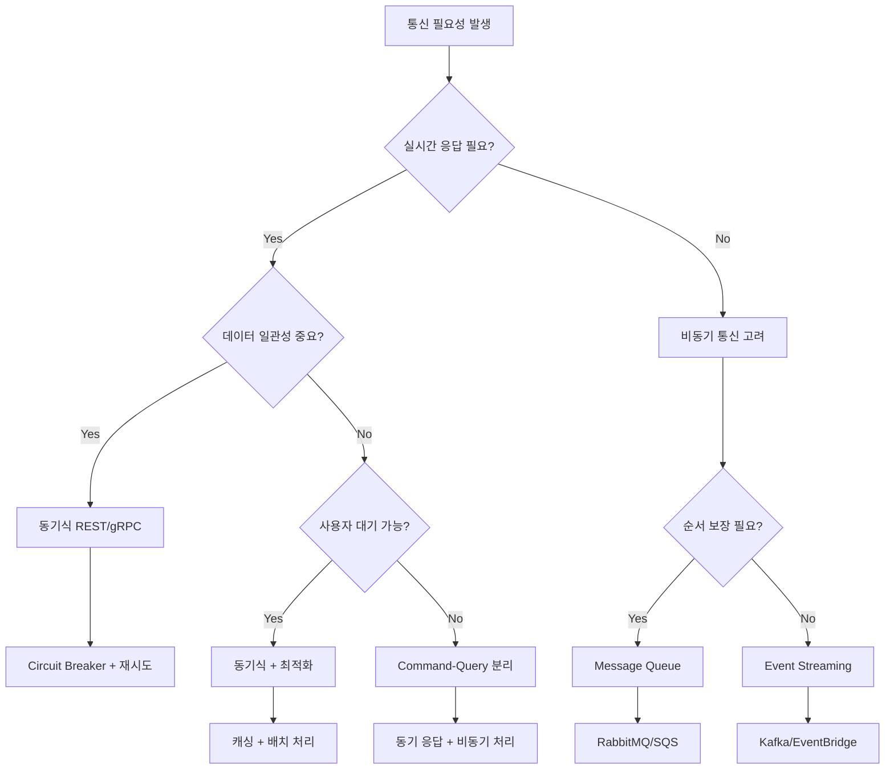

---
tags:
  - advanced
  - async_programming
  - deep-study
  - distributed_systems
  - hands-on
  - microservices
  - performance_optimization
  - service_communication
  - 인프라스트럭처
difficulty: ADVANCED
learning_time: "8-12시간"
main_topic: "인프라스트럭처"
priority_score: 4
---

# 16.7.2: 통신 패턴 모범 사례

## 🎯 통신 방식 선택의 핵심 기준

마이크로서비스 간 통신 방식을 선택할 때는 비즈니스 요구사항, 성능 특성, 운영 복잡도 등 다양한 요소를 종합적으로 고려해야 합니다. 실제 전자상거래 플랫폼에서 적용한 선택 기준과 최적화 전략을 살펴보겠습니다.

## 동기식 vs 비동기식 통신 선택 가이드

### 동기식 통신을 선택해야 하는 경우

**강한 일관성이 필요한 시나리오**:

```typescript
// 실시간 재고 확인 - 동기식 필수
class InventoryService {
  async reserveItems(orderItems: OrderItem[]): Promise<ReservationResult> {
    // 재고 부족 시 즉시 오류 응답 필요
    const result = await this.inventoryClient.checkAndReserve(orderItems);
    
    if (!result.success) {
      throw new InsufficientInventoryError(result.unavailableItems);
    }
    
    return result;
  }
}

// 결제 처리 - 동기식 필수
class PaymentService {
  async processPayment(paymentRequest: PaymentRequest): Promise<PaymentResult> {
    // 결제 성공/실패 즉시 확인 필요
    const result = await this.paymentGateway.charge(paymentRequest);
    
    if (result.status === 'failed') {
      throw new PaymentFailedError(result.errorMessage);
    }
    
    return result;
  }
}
```

**동기식 통신이 적합한 상황**:

-**실시간 데이터 정합성**: 재고 확인, 결제 처리, 권한 검증
-**즉시 응답 필요**: 사용자 인터페이스에서 바로 결과를 보여줘야 하는 경우
-**트랜잭션 일관성**: 여러 서비스 간 ACID 속성이 중요한 경우
-**단순한 요청-응답**: 복잡한 워크플로우가 없는 단순한 데이터 조회

### 비동기식 통신을 선택해야 하는 경우

**결과적 일관성으로 충분한 시나리오**:

```go
// 주문 완료 후 후속 처리 - 비동기식 적합
func (s *OrderService) CompleteOrder(orderID int64) error {
    // 1. 주문 상태 업데이트 (동기)
    err := s.repository.UpdateOrderStatus(orderID, OrderStatusCompleted)
    if err != nil {
        return err
    }
    
    // 2. 후속 처리는 비동기 이벤트로 처리
    events := []DomainEvent{
        OrderCompletedEvent{OrderID: orderID},
        InventoryReservedEvent{OrderID: orderID},
        CustomerNotificationEvent{OrderID: orderID},
    }
    
    for _, event := range events {
        s.eventPublisher.Publish(event.GetRoutingKey(), event)
    }
    
    return nil
}

// 이메일 발송, 리포트 생성 등은 별도 서비스에서 비동기 처리
func (s *NotificationService) HandleOrderCompleted(event OrderCompletedEvent) error {
    // 주문 완료 이메일 발송 (실패해도 주문 완료에는 영향 없음)
    return s.emailService.SendOrderConfirmation(event.OrderID)
}
```

**비동기식 통신이 적합한 상황**:

-**이벤트 기반 워크플로우**: 주문 처리, 사용자 가입 프로세스
-**배치 처리**: 리포트 생성, 데이터 동기화
-**알림 시스템**: 이메일, SMS, 푸시 알림
-**감사 로그**: 시스템 활동 추적 및 분석
-**서비스 간 결합도 감소**: 새로운 구독자 추가가 기존 시스템에 영향 없음

## 하이브리드 패턴: 상황에 따른 조합

### Command-Query 분리 패턴

```typescript
// 명령(Command) - 비동기 처리
class OrderCommandService {
  async createOrder(request: CreateOrderRequest): Promise<{orderId: string}> {
    // 1. 기본 주문 생성 (빠른 응답)
    const order = await this.createBasicOrder(request);
    
    // 2. 복잡한 후속 처리는 이벤트로 위임
    await this.eventPublisher.publish('order.created', {
      orderId: order.id,
      userId: request.userId,
      items: request.items
    });
    
    // 3. 사용자에게는 즉시 주문 ID 응답
    return { orderId: order.id };
  }
}

// 조회(Query) - 동기 처리
class OrderQueryService {
  async getOrderDetails(orderId: string): Promise<OrderDetails> {
    // 실시간 주문 상세 정보 조회
    return await this.orderRepository.findByIdWithDetails(orderId);
  }
  
  async getOrderStatus(orderId: string): Promise<OrderStatus> {
    // 빠른 상태 조회
    return await this.orderRepository.getStatus(orderId);
  }
}
```

## 통신 패턴별 성능 최적화 전략

### 동기식 통신 최적화

**1. Connection Pooling과 Keep-Alive**:

```typescript
class OptimizedHttpClient {
  private agent: http.Agent;
  
  constructor() {
    this.agent = new http.Agent({
      keepAlive: true,
      keepAliveMsecs: 30000,
      maxSockets: 50,        // 서비스당 최대 동시 연결 수
      maxFreeSockets: 10,    // 재사용할 유휴 연결 수
      timeout: 60000,        // 소켓 타임아웃
      freeSocketTimeout: 30000, // 유휴 연결 유지 시간
    });
  }
  
  private createAxiosInstance(): AxiosInstance {
    return axios.create({
      httpAgent: this.agent,
      httpsAgent: this.agent,
      timeout: 5000,
      // 압축 사용으로 네트워크 대역폭 절약
      headers: {
        'Accept-Encoding': 'gzip, deflate, br',
        'Connection': 'keep-alive'
      }
    });
  }
}
```

**2. 배치 요청 및 캐싱**:

```typescript
class BatchOptimizedClient {
  private cache = new Map<string, CacheItem>();
  private batchQueue = new Map<string, BatchRequest>();
  
  async getUsers(userIds: number[]): Promise<User[]> {
    // 1. 캐시에서 먼저 확인
    const cached: User[] = [];
    const uncachedIds: number[] = [];
    
    userIds.forEach(id => {
      const cacheKey = `user:${id}`;
      const item = this.cache.get(cacheKey);
      
      if (item && !item.isExpired()) {
        cached.push(item.data);
      } else {
        uncachedIds.push(id);
      }
    });
    
    // 2. 캐시되지 않은 데이터만 배치 요청
    let fetched: User[] = [];
    if (uncachedIds.length > 0) {
      fetched = await this.batchFetchUsers(uncachedIds);
      
      // 3. 새로 가져온 데이터 캐싱
      fetched.forEach(user => {
        this.cache.set(`user:${user.id}`, new CacheItem(user, 300000)); // 5분
      });
    }
    
    return [...cached, ...fetched];
  }
  
  private async batchFetchUsers(ids: number[]): Promise<User[]> {
    // 배치 크기 제한으로 대용량 요청 분할
    const batches = this.chunk(ids, 50);
    const results = await Promise.all(
      batches.map(batch => this.httpClient.post('/users/batch', {userIds: batch}))
    );
    
    return results.flatMap(response => response.data.users);
  }
}
```

### 비동기식 통신 최적화

**1. 메시지 압축 및 직렬화 최적화**:

```go
// Protocol Buffers 또는 MessagePack 사용
type OptimizedPublisher struct {
    publisher     *EventPublisher
    compressionType string
}

func (p *OptimizedPublisher) PublishEvent(routingKey string, event DomainEvent) error {
    // 1. 효율적인 직렬화
    var data []byte
    var err error
    
    switch p.compressionType {
    case "protobuf":
        data, err = proto.Marshal(event)
    case "msgpack":
        data, err = msgpack.Marshal(event)
    default:
        data, err = json.Marshal(event)
    }
    
    if err != nil {
        return err
    }
    
    // 2. 메시지 압축 (큰 메시지의 경우)
    if len(data) > 1024 { // 1KB 이상
        data = gzip.Compress(data)
    }
    
    // 3. 메타데이터와 함께 발행
    headers := amqp.Table{
        "content-encoding": p.compressionType,
        "compressed":      len(data) > 1024,
        "original-size":   len(data),
    }
    
    return p.publisher.PublishWithHeaders(routingKey, data, headers)
}
```

**2. 이벤트 스트림 최적화**:

```go
type StreamProcessor struct {
    batchSize     int
    flushInterval time.Duration
    buffer        []DomainEvent
    mutex         sync.Mutex
}

func (sp *StreamProcessor) ProcessEventStream() {
    ticker := time.NewTicker(sp.flushInterval)
    defer ticker.Stop()
    
    for {
        select {
        case event := <-sp.eventChannel:
            sp.addToBuffer(event)
            
            // 배치 크기에 도달하면 즉시 처리
            if len(sp.buffer) >= sp.batchSize {
                sp.flushBuffer()
            }
            
        case <-ticker.C:
            // 주기적으로 버퍼 비우기
            sp.flushBuffer()
        }
    }
}

func (sp *StreamProcessor) flushBuffer() {
    sp.mutex.Lock()
    defer sp.mutex.Unlock()
    
    if len(sp.buffer) == 0 {
        return
    }
    
    // 배치 처리로 성능 향상
    batch := make([]DomainEvent, len(sp.buffer))
    copy(batch, sp.buffer)
    sp.buffer = sp.buffer[:0] // 버퍼 클리어
    
    go sp.processBatch(batch) // 비동기 배치 처리
}
```

## 모니터링 및 관찰 가능성

### 통신 패턴별 핵심 메트릭

```typescript
// 동기식 통신 메트릭
class SyncCommunicationMetrics {
  recordRequest(service: string, endpoint: string, method: string) {
    this.prometheus.incrementCounter('http_requests_total', {
      service, endpoint, method
    });
  }
  
  recordLatency(service: string, endpoint: string, duration: number) {
    this.prometheus.recordHistogram('http_request_duration_seconds', duration, {
      service, endpoint
    });
  }
  
  recordCircuitBreakerState(service: string, state: string) {
    this.prometheus.setGauge('circuit_breaker_state', state === 'OPEN' ? 1 : 0, {
      service
    });
  }
}

// 비동기식 통신 메트릭
class AsyncCommunicationMetrics {
  recordMessagePublished(exchange: string, routingKey: string) {
    this.prometheus.incrementCounter('messages_published_total', {
      exchange, routing_key: routingKey
    });
  }
  
  recordMessageProcessed(queue: string, success: boolean, duration: number) {
    this.prometheus.incrementCounter('messages_processed_total', {
      queue, status: success ? 'success' : 'failed'
    });
    
    this.prometheus.recordHistogram('message_processing_duration_seconds', duration, {
      queue
    });
  }
  
  recordQueueDepth(queue: string, depth: number) {
    this.prometheus.setGauge('queue_depth', depth, { queue });
  }
}
```

## 장애 대응 및 복구 전략

### 계단식 장애(Cascading Failure) 방지

```typescript
// 다층 방어 시스템
class ResilientCommunicationManager {
  private circuitBreaker: CircuitBreaker;
  private bulkheadExecutor: BulkheadExecutor;
  private rateLimiter: RateLimiter;
  
  async callService(serviceCall: () => Promise<any>): Promise<any> {
    // 1. Rate Limiting으로 과부하 방지
    if (!this.rateLimiter.tryAcquire()) {
      throw new RateLimitExceededError();
    }
    
    // 2. Bulkhead로 리소스 격리
    return this.bulkheadExecutor.submit(async () => {
      // 3. Circuit Breaker로 장애 격리
      return this.circuitBreaker.execute(serviceCall);
    });
  }
}

// 서비스별 독립적인 스레드 풀 관리
class BulkheadExecutor {
  private executors = new Map<string, ThreadPoolExecutor>();
  
  constructor() {
    // 서비스별 격리된 실행 환경
    this.executors.set('user-service', new ThreadPoolExecutor(5, 10));
    this.executors.set('payment-service', new ThreadPoolExecutor(3, 5));
    this.executors.set('inventory-service', new ThreadPoolExecutor(10, 20));
  }
  
  async submit<T>(serviceName: string, task: () => Promise<T>): Promise<T> {
    const executor = this.executors.get(serviceName);
    if (!executor) {
      throw new Error(`No executor for service: ${serviceName}`);
    }
    
    return executor.submit(task);
  }
}
```

## 실전 적용 가이드라인

### 통신 패턴 결정 플로우



### 성능 최적화 체크리스트

**동기식 통신**:

- [ ] Connection Pooling 설정
- [ ] 적절한 타임아웃 값 설정
- [ ] Circuit Breaker 임계값 조정
- [ ] 재시도 정책 최적화 (지수 백오프 + 지터)
- [ ] 배치 API 활용
- [ ] 응답 데이터 압축
- [ ] 캐싱 전략 적용

**비동기식 통신**:

- [ ] 메시지 배치 처리
- [ ] 적절한 큐 크기 설정
- [ ] Dead Letter Queue 설정
- [ ] 메시지 TTL 설정
- [ ] 컨슈머 스케일링 정책
- [ ] 메시지 압축 적용
- [ ] 멱등성 보장

## 핵심 요점

### 1. 맥락적 선택의 중요성

비즈니스 요구사항과 기술적 제약을 모두 고려한 통신 방식 선택

### 2. 하이브리드 접근법

단일 패턴보다는 상황에 맞는 조합으로 최적의 사용자 경험 제공

### 3. 운영 관점의 고려

모니터링, 디버깅, 장애 복구까지 포함한 종합적인 설계

### 4. 점진적 최적화

초기에는 단순하게 시작하고, 실제 운영 데이터를 바탕으로 점진적 개선

---

**이전**: [비동기식 통신 - 메시지 큐와 이벤트](./16-01-07-asynchronous-communication.md)  
**다음**: [서비스 간 통신과 메시징 개요](chapter-15-microservices-architecture/16-16-service-communication.md)로 돌아가서 전체 내용을 정리하거나, [컨테이너화와 오케스트레이션](chapter-15-microservices-architecture/16-19-containerization-orchestration.md)에서 다음 단계를 학습합니다.

## 📚 관련 문서

### 📖 현재 문서 정보

-**난이도**: ADVANCED
-**주제**: 인프라스트럭처
-**예상 시간**: 8-12시간

### 🎯 학습 경로

- [📚 ADVANCED 레벨 전체 보기](../learning-paths/advanced/)
- [🏠 메인 학습 경로](../learning-paths/)
- [📋 전체 가이드 목록](../README.md)

### 📂 같은 챕터 (chapter-16-distributed-system-patterns)

- [15.1 마이크로서비스 아키텍처 개요](../chapter-15-microservices-architecture/16-01-microservices-architecture.md)
- [15.1A 모놀리스 문제점과 전환 전략](../chapter-15-microservices-architecture/16-10-monolith-to-microservices.md)
- [16.1B 마이크로서비스 설계 원칙과 패턴 개요](./16-01-02-single-responsibility-principle.md)
- [16.1B1 단일 책임 원칙 (Single Responsibility Principle)](./16-01-02-single-responsibility-principle.md)
- [16.1B1 단일 책임 원칙 (Single Responsibility Principle)](./16-01-03-single-responsibility.md)

### 🏷️ 관련 키워드

`microservices`, `service_communication`, `async_programming`, `performance_optimization`, `distributed_systems`

### ⏭️ 다음 단계 가이드

- 시스템 전체의 관점에서 이해하려 노력하세요
- 다른 고급 주제들과의 연관성을 파악해보세요
