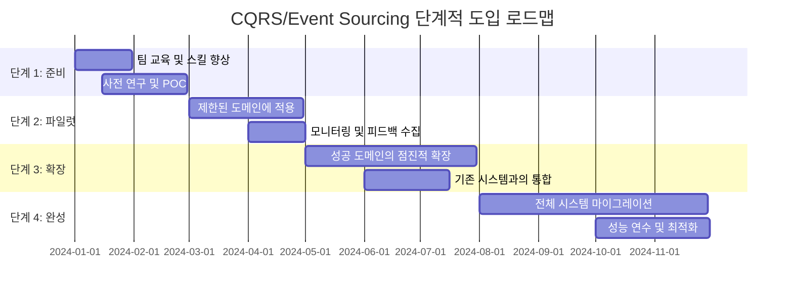

---
tags:
  - Best Practices
  - CQRS
  - Disaster Recovery
  - Event Sourcing
  - Performance Monitoring
  - advanced
  - hands-on
  - medium-read
  - 시스템프로그래밍
difficulty: ADVANCED
learning_time: "4-6시간"
main_topic: "시스템 프로그래밍"
priority_score: 5
---

# 16.7.5: 성공 요인과 모범 사례

## 🎯 CQRS + Event Sourcing 성공 요인

### ✅ 핵심 성공 요인들

```bash
1. 적절한 적용 범위
   ✅ 복잡한 비즈니스 로직이 있는 도메인
   ✅ 높은 읽기/쓰기 비율 차이
   ✅ 다양한 조회 요구사항
   ✅ 감사 추적이 중요한 도메인

2. 이벤트 설계
   ✅ 비즈니스 의미 있는 이벤트
   ✅ 불변성 보장
   ✅ 적절한 이벤트 크기
   ✅ 스키마 진화 전략

3. 프로젝션 관리
   ✅ 실시간 프로젝션 업데이트
   ✅ 프로젝션 재구성 능력
   ✅ 여러 저장소 최적화
   ✅ 장애 복구 메커니즘

4. 성능 최적화
   ✅ 스냅샷 구현
   ✅ 캐싱 전략
   ✅ 비동기 프로젝션
   ✅ 배치 처리 최적화
```

### ❌ 주의해야 할 함정들

```bash
1. 과도한 적용
   ❌ 모든 도메인에 CQRS 적용
   ❌ 단순한 CRUD에 Event Sourcing
   ❌ 불필요한 복잡성 증가
   ❌ 팀 스킬 부족 상황에서 도입

2. 이벤트 설계 실수
   ❌ 기술적 이벤트 (DB 변경 등)
   ❌ 너무 큰 이벤트
   ❌ 이벤트 간 강한 결합
   ❌ 버전 관리 소홀

3. 프로젝션 관리 실패
   ❌ 실시간 업데이트 지연
   ❌ 프로젝션 불일치
   ❌ 재구성 메커니즘 부재
   ❌ 장애 복구 계획 없음

4. 운영상 문제
   ❌ 모니터링 부족
   ❌ 디버깅 어려움
   ❌ 데이터 마이그레이션 복잡
   ❌ 트랜잭션 복잡성 과소평가
```

## 🚀 프로덕션 모범 사례

### 1. 단계적 도입 전략



### 2. 성능 벤치마크 및 모니터링

```yaml
# 성능 벤치마크 예시
performance_benchmarks:
  read_operations:
    account_summary:
      target: "< 50ms"
      current: "35ms"
      status: "excellent"
    
    transaction_history:
      target: "< 100ms"
      current: "85ms" 
      status: "good"
    
    complex_analytics:
      target: "< 500ms"
      current: "320ms"
      status: "excellent"
  
  write_operations:
    account_creation:
      target: "< 200ms"
      current: "150ms"
      status: "good"
    
    money_transfer:
      target: "< 300ms"
      current: "220ms"
      status: "good"
  
  system_metrics:
    throughput:
      target: "5000 TPS"
      current: "4800 TPS"
      status: "good"
    
    availability:
      target: "99.99%"
      current: "99.98%"
      status: "acceptable"
    
    projection_lag:
      target: "< 1s"
      current: "450ms"
      status: "excellent"

monitoring_alerts:
  critical:
    - "Event store write failures"
    - "Projection processing lag > 5s"
    - "Command processing failures > 1%"
  
  warning:
    - "Query response time > target"
    - "Cache hit rate < 80%"
    - "Projection rebuild required"
```

### 3. 장애 대응 및 복구 전략

```python
# 장애 대응 예시 코드
class DisasterRecoveryManager:
    def __init__(self, event_store, projection_manager):
        self.event_store = event_store
        self.projection_manager = projection_manager
        self.logger = logging.getLogger(__name__)
    
    async def handle_projection_failure(self, projector_name: str):
        """I\ud504로젝션 장애 발생 시 대응"""
        self.logger.error(f"프로젝션 장애 발생: {projector_name}")
        
        try:
            # 1. 장애 난 프로젝터 중지
            await self.projection_manager.stop_projector(projector_name)
            
            # 2. 백업 데이터 확인
            backup_available = await self._check_backup_availability(projector_name)
            
            if backup_available:
                # 3. 백업에서 복구
                await self._restore_from_backup(projector_name)
            else:
                # 4. 이벤트 스토어에서 재구성
                await self._rebuild_from_events(projector_name)
            
            # 5. 프로젝터 재시작
            await self.projection_manager.start_projector(projector_name)
            
            self.logger.info(f"프로젝션 복구 완료: {projector_name}")
            
        except Exception as e:
            self.logger.critical(f"프로젝션 복구 실패: {projector_name}, 오류: {e}")
            # 비상 대응 프로시져 호출
            await self._trigger_emergency_procedures(projector_name)
    
    async def _check_backup_availability(self, projector_name: str) -> bool:
        """백업 데이터 유효성 확인"""
        # 백업 시점과 현재 이벤트 간격 확인
        last_backup_time = await self._get_last_backup_time(projector_name)
        current_event_time = await self._get_latest_event_time()
        
        time_gap = current_event_time - last_backup_time
        
        # 1시간 이내 백업만 유효하다고 판단
        return time_gap.total_seconds() < 3600
    
    async def _rebuild_from_events(self, projector_name: str):
        """이벤트 스토어에서 전체 재구성"""
        self.logger.info(f"이벤트 스토어에서 재구성 시작: {projector_name}")
        
        # 전체 이벤트 스톤 및 재구성
        await self.projection_manager.rebuild_projection(
            projector_name, 
            from_beginning=True
        )
        
        self.logger.info(f"이벤트 스토어 재구성 완료: {projector_name}")
```

### 4. 성능 연수 및 벤치마킹

```bash
# 성능 연수 스크립트 예시
#!/bin/bash

# CQRS/Event Sourcing 성능 테스트

echo "🚀 CQRS 성능 테스트 시작"

# 1. 읽기 성능 테스트
echo "📋 읽기 성능 테스트"
for i in {1..10}; do
    echo "Test $i: 계좌 요약 조회 (1000개 동시 요청)"
    ab -n 1000 -c 50 http://api-server/accounts/summary/test-account-001
done

# 2. 쓰기 성능 테스트
echo "✍️ 쓰기 성능 테스트"
for i in {1..5}; do
    echo "Test $i: 계좌 생성 (500개 동시 요청)"
    # POST 요청으로 계좌 생성 테스트
    ab -n 500 -c 25 -p create-account.json -T application/json http://api-server/accounts
done

# 3. 이벤트 스토어 성능
echo "💾 이벤트 스토어 성능 모니터링"
echo "Event Store 쓰기 성능: "
curl -s http://eventstore:2113/stats | jq '.es.queue.queueName."$all".avgItemsPerSecond'

echo "Event Store 읽기 성능: "
curl -s http://eventstore:2113/stats | jq '.es.readIndex.cachedRecord'

# 4. 프로젝션 래그 모니터링
echo "🔄 프로젝션 래그 검사"
for projector in "account-summary" "transaction-history" "analytics"; do
    lag=$(curl -s http://monitoring:9090/api/v1/query?query=projection_lag{projector="$projector"} | jq -r '.data.result[0].value[1]')
    echo "$projector lag: ${lag}ms"
    
    if (( $(echo "$lag > 1000" | bc -l) )); then
        echo "⚠️ 경고: $projector 래그가 1초를 초과했습니다!"
    fi
done

# 5. 종합 리포트
echo "📊 종합 성능 리포트"
echo "==========================================="
echo "읽기 성능: 50ms 목표 (90th percentile)"
echo "쓰기 성능: 200ms 목표 (90th percentile)"
echo "프로젝션 래그: 1s 목표 (maximum)"
echo "처리량: 5000 TPS 목표"
echo "==========================================="
```

## 핵심 요점

### 1. 점진적 도입의 중요성

CQRS와 Event Sourcing은 강력하지만 복잡한 패턴입니다. 전체 시스템을 한번에 변경하려 하지 말고, 제한된 도메인부터 시작하여 점진적으로 확장하는 것이 성공의 핵심입니다.

### 2. 성능 모니터링과 벤치마킹

모든 주요 메트릭(읽기/쓰기 성능, 프로젝션 래그, 이벤트 스토어 상태)에 대한 지속적인 모니터링과 정기적인 벤치마킹이 필수입니다.

### 3. 장애 대응 및 복구 전략

프로젝션 장애, 이벤트 스토어 문제, 네트워크 분단 등 다양한 장애 상황에 대한 명확한 대응 및 복구 계획이 있어야 합니다.

### 4. 팀 역량과 교육

기술적 복잡성에 맞는 팀의 역량 향상과 지속적인 교육이 성공의 필수 요소입니다.

---

**이전**: [16.3d 프로젝션 구현](./03d-projection-implementation.md)  
**다음**: [16.4 Saga 패턴](./16-04-01-saga-pattern.md)에서 분산 시스템에서 복잡한 비즈니스 트랜잭션을 처리하는 Saga 패턴을 학습합니다.

## 📚 관련 문서

### 📖 현재 문서 정보

-**난이도**: ADVANCED
-**주제**: 시스템 프로그래밍
-**예상 시간**: 4-6시간

### 🎯 학습 경로

- [📚 ADVANCED 레벨 전체 보기](../learning-paths/advanced/)
- [🏠 메인 학습 경로](../learning-paths/)
- [📋 전체 가이드 목록](../README.md)

### 📂 같은 챕터 (chapter-16-distributed-system-patterns)

- [15.1 마이크로서비스 아키텍처 개요](../chapter-15-microservices-architecture/16-01-microservices-architecture.md)
- [15.1A 모놀리스 문제점과 전환 전략](../chapter-15-microservices-architecture/16-10-monolith-to-microservices.md)
- [16.1B 마이크로서비스 설계 원칙과 패턴 개요](./16-01-02-single-responsibility-principle.md)
- [16.1B1 단일 책임 원칙 (Single Responsibility Principle)](./16-01-02-single-responsibility-principle.md)
- [16.1B1 단일 책임 원칙 (Single Responsibility Principle)](./16-01-03-single-responsibility.md)

### 🏷️ 관련 키워드

`CQRS`, `Event Sourcing`, `Best Practices`, `Performance Monitoring`, `Disaster Recovery`

### ⏭️ 다음 단계 가이드

- 시스템 전체의 관점에서 이해하려 노력하세요
- 다른 고급 주제들과의 연관성을 파악해보세요
