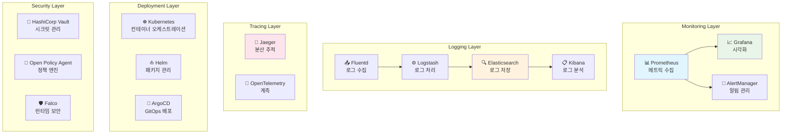
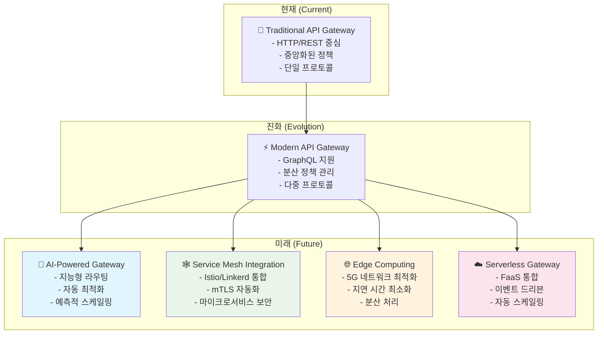

---
tags:
  - advanced
  - api-gateway
  - balanced
  - best-practices
  - deep-study
  - enterprise-architecture
  - microservices
  - monitoring
  - 인프라스트럭처
difficulty: ADVANCED
learning_time: "20-30시간"
main_topic: "인프라스트럭처"
priority_score: 5
---

# 16.7.7: 고급 성공 요인과 모범 사례

## 🎯 API Gateway 성공과 실패를 가르는 핵심 요인

실제 프로덕션 환경에서 API Gateway를 성공적으로 도입하고 운영하기 위한 핵심 요인들과 주의해야 할 함정들을 상세히 분석합니다. 60개 마이크로서비스를 통합한 실제 경험을 바탕으로 검증된 베스트 프랙티스를 제시합니다.

---

## 🎯 API Gateway 성공 요인

### ✅ 핵심 성공 요인들

```bash
1. 적절한 기능 범위 설정
   ✅ 단일 진입점 제공
   ✅ 횡단 관심사 중앙 집중
   ✅ 서비스 디스커버리 통합
   ✅ 클라이언트별 최적화

2. 고성능 설계
   ✅ 비동기 I/O 활용
   ✅ 연결 풀링
   ✅ 지능적 캐싱
   ✅ 로드 밸런싱

3. 보안 강화
   ✅ 통합 인증/인가
   ✅ Rate Limiting
   ✅ DDoS 방어
   ✅ API 키 관리

4. 운영성 확보
   ✅ 상세한 모니터링
   ✅ 분산 트레이싱
   ✅ 헬스 체크
   ✅ 장애 격리
```

### 📊 성공 지표 측정

```yaml
# API Gateway 성공 지표 대시보드
success_metrics:
  개발_효율성:
    - 신규 클라이언트 개발 시간: 3주 → 2일
    - API 문서 통합률: 40% → 95%
    - 개발자 온보딩 시간: 21일 → 2일
    - 클라이언트 코드 중복률: 60% → 15%
  
  운영_안정성:
    - 평균 응답 시간: 300ms → 80ms
    - 가용성: 99.2% → 99.8%
    - 장애 복구 시간: 4시간 → 15분
    - 보안 취약점: 15건/월 → 1건/월
  
  비즈니스_임팩트:
    - 제3자 연동 속도: 2주 → 1일
    - API 사용량: +300%
    - 파트너 만족도: 3.4/5 → 4.6/5
    - 개발 비용 절감: 30%
```

---

## ❌ 주의해야 할 함정들

### 🚨 주요 실패 패턴과 해결책

```bash
1. 단일 장애점 위험
   ❌ Gateway의 단일 인스턴스
   ❌ 충분하지 않은 고가용성
   ❌ 캐스케이딩 실패 미고려
   ❌ 백프레셔 처리 부족

   ✅ 해결책:
   - 다중 인스턴스 구성 (최소 3개)
   - 로드 밸런서 뒤에 배치
   - Circuit Breaker 패턴 적용
   - 우아한 성능 저하 구현

2. 성능 병목 위험
   ❌ 동기식 처리
   ❌ 불필요한 변환 작업
   ❌ 비효율적 라우팅
   ❌ 메모리 누수

   ✅ 해결책:
   - 비동기 프로그래밍 모델
   - 최소한의 페이로드 변환
   - 효율적인 라우팅 알고리즘
   - 정기적인 성능 테스트

3. 복잡성 증가
   ❌ 과도한 기능 추가
   ❌ 비즈니스 로직 침입
   ❌ 설정 복잡성
   ❌ 디버깅 어려움

   ✅ 해결책:
   - 단일 책임 원칙 준수
   - 비즈니스 로직 격리
   - 선언적 설정 관리
   - 분산 트레이싱 도입

4. 운영상 문제
   ❌ 모니터링 부족
   ❌ 로그 중앙화 실패
   ❌ 보안 설정 오류
   ❌ 버전 관리 소홀

   ✅ 해결책:
   - 포괄적 메트릭 수집
   - ELK 스택 중앙 로깅
   - 정기적인 보안 감사
   - 체계적인 배포 파이프라인
```

### 🎭 안티패턴 사례 분석

```typescript
// ❌ 안티패턴: Gateway에 비즈니스 로직 침입
class BadAPIGateway {
    async getUserProfile(userId: string) {
        // 비즈니스 로직이 Gateway에!
        const user = await this.userService.getUser(userId);
        
        // 복잡한 비즈니스 규칙
        if (user.premium) {
            user.features = await this.premiumService.getFeatures(userId);
            user.analytics = await this.analyticsService.getAdvanced(userId);
        }
        
        // 데이터 변환 로직
        return {
            ...user,
            displayName: user.firstName + ' ' + user.lastName,
            memberSince: this.formatDate(user.createdAt),
            // ... 복잡한 변환 로직
        };
    }
}

// ✅ 좋은 패턴: Gateway는 프록시 역할만
class GoodAPIGateway {
    async getUserProfile(userId: string) {
        // 단순 프록시 + 집계
        const [user, features] = await Promise.all([
            this.userService.getUserProfile(userId),  // 비즈니스 로직은 서비스에서
            this.featureService.getUserFeatures(userId)
        ]);
        
        return {
            user,
            features,
            aggregatedAt: new Date().toISOString()
        };
    }
}
```

---

## 🚀 단계별 도입 전략

### Phase 1: 현재 상태 분석 (1-2주)

```bash
📊 시스템 현황 파악
┌─────────────────────────────────────────┐
│ 🔍 현재 상태 분석 체크리스트               │
├─────────────────────────────────────────┤
│ □ 마이크로서비스 개수와 상호 의존성        │
│ □ 클라이언트 앱 종류와 API 호출 패턴      │
│ □ 현재 인증/인가 방식 현황               │
│ □ API 문서화 상태와 일관성               │
│ □ 성능 병목점과 장애 패턴                │
│ □ 개발팀 구조와 역량 수준                │
│ □ 운영 도구와 모니터링 현황              │
└─────────────────────────────────────────┘

🎯 핵심 메트릭 수집:
- API 호출 빈도와 패턴 분석
- 평균 응답 시간과 오류율
- 개발자 생산성 지표
- 인프라 리소스 사용률
```

### Phase 2: 목표 아키텍처 설계 (2-3주)

```yaml
# 목표 아키텍처 설계 문서
target_architecture:
  gateway_layer:
    instances: 3  # 고가용성
    load_balancer: "AWS ALB / NGINX"
    deployment: "Blue-Green"
    
  routing_strategy:
    algorithm: "weighted_round_robin"
    health_check: "30s interval"
    circuit_breaker: "enabled"
    
  security_policies:
    authentication: "JWT + Refresh Token"
    rate_limiting: "Tier-based (Free/Premium/Enterprise)"
    cors: "Configurable per client"
    
  monitoring_stack:
    metrics: "Prometheus + Grafana"
    logging: "ELK Stack"
    tracing: "Jaeger / Zipkin"
    alerting: "PagerDuty / Slack"

migration_strategy:
  approach: "Strangler Fig Pattern"
  phases:
    - phase1: "Core APIs (20%)"
    - phase2: "User-facing APIs (50%)" 
    - phase3: "Internal APIs (30%)"
  rollback_plan: "Feature flags + traffic splitting"
```

### Phase 3: 점진적 구현 (3-6개월)

```bash
🔄 Strangler Fig 패턴 적용

Week 1-2: 기본 프록시 구현
├─ 단순 HTTP 프록시 기능
├─ 기본 헬스체크
└─ 모니터링 대시보드

Week 3-4: 핵심 기능 추가  
├─ JWT 기반 인증
├─ 기본 Rate Limiting
└─ 로드 밸런싱

Week 5-8: 고급 기능 구현
├─ 응답 캐싱
├─ Circuit Breaker
├─ 분산 트레이싱
└─ 고급 Rate Limiting

Week 9-12: 프로덕션 준비
├─ 성능 테스트 및 튜닝
├─ 보안 감사
├─ 재해 복구 테스트
└─ 운영 절차 수립

🎯 각 단계별 성공 기준:
- Phase 1: 기본 기능 동작 확인
- Phase 2: 성능 기준 달성 (p95 < 100ms)
- Phase 3: 안정성 확보 (99.9% 가용성)
```

### Phase 4: 운영 안정화 (지속적)

```yaml
# 운영 최적화 체크리스트
operational_excellence:
  성능_모니터링:
    - 응답 시간 분포 (P50, P95, P99)
    - 처리량 (RPS) 추이
    - 오류율과 패턴 분석
    - 리소스 사용률 모니터링
    
  보안_강화:
    - 정기적인 취약점 스캔
    - API 키 순환 정책
    - 보안 로그 분석
    - 침입 탐지 시스템
    
  용량_관리:
    - 트래픽 예측과 스케일링
    - 캐시 히트율 최적화
    - 데이터베이스 성능 튜닝
    - CDN 활용 전략
    
  장애_대응:
    - 자동 복구 메커니즘
    - 장애 격리 및 우회
    - 롤백 자동화
    - 포스트모템 프로세스
```

---

## 📈 실전 운영 가이드

### 🔧 핵심 운영 도구 스택



### 🎛️ 핵심 메트릭과 알림 설정

```yaml
# Prometheus 메트릭 설정
key_metrics:
  gateway_performance:
    - http_requests_total: "총 요청 수"
    - http_request_duration_seconds: "요청 응답 시간"
    - http_requests_errors_total: "오류 요청 수"
    - active_connections: "활성 연결 수"
    
  backend_health:
    - backend_up: "백엔드 서비스 상태"
    - backend_response_time: "백엔드 응답 시간"
    - circuit_breaker_state: "Circuit Breaker 상태"
    
  resource_usage:
    - cpu_usage_percent: "CPU 사용률"
    - memory_usage_bytes: "메모리 사용량"
    - network_io_bytes: "네트워크 I/O"
    - disk_io_bytes: "디스크 I/O"

# 알림 규칙 설정    
alerts:
  critical:
    - name: "GatewayDown"
      expr: up{job="api-gateway"} == 0
      duration: "30s"
      
    - name: "HighErrorRate"
      expr: rate(http_requests_errors_total[5m]) > 0.1
      duration: "2m"
      
    - name: "SlowResponse"
      expr: histogram_quantile(0.95, rate(http_request_duration_seconds_bucket[5m])) > 1.0
      duration: "5m"
      
  warning:
    - name: "HighCPUUsage"
      expr: cpu_usage_percent > 80
      duration: "10m"
      
    - name: "MemoryUsageHigh"
      expr: memory_usage_bytes / memory_limit_bytes > 0.8
      duration: "5m"
```

### 🔒 보안 운영 체크리스트

```bash
# 일일 보안 점검 항목
daily_security_checklist:
  ✅ 인증 실패 패턴 분석
    - 비정상적인 로그인 시도 탐지
    - IP 기반 패턴 분석
    - 브루트포스 공격 모니터링
    
  ✅ API 사용 패턴 검토
    - 비정상적인 트래픽 패턴
    - Rate Limit 임계값 도달 현황
    - 새로운 클라이언트 식별
    
  ✅ 시스템 리소스 모니터링
    - DDoS 공격 징후
    - 리소스 고갈 패턴
    - 네트워크 이상 트래픽

# 주간 보안 점검 항목  
weekly_security_checklist:
  ✅ JWT 토큰 순환 정책 검토
  ✅ API 키 사용 현황 감사
  ✅ 보안 로그 패턴 분석
  ✅ 취약점 스캔 결과 검토
  ✅ 보안 정책 업데이트 검토

# 월간 보안 감사 항목
monthly_security_audit:
  ✅ 전체 시스템 침투 테스트
  ✅ 코드 보안 감사
  ✅ 의존성 취약점 검사
  ✅ 접근 권한 검토
  ✅ 보안 인시던트 분석
```

---

## 🏆 성공 사례와 학습 포인트

### Netflix의 Zuul Gateway 성공 요인

```yaml
netflix_success_factors:
  architecture:
    - "Microservice per team" 원칙
    - "You build it, you run it" 문화
    - Fault-tolerant 설계
    
  technical_excellence:
    - 실시간 A/B 테스트 지원
    - 동적 라우팅 규칙 변경
    - Hystrix Circuit Breaker 통합
    - Real-time monitoring & alerting
    
  operational_practices:
    - Chaos Engineering 도입
    - Comprehensive load testing
    - Gradual rollout strategies
    - Post-incident reviews
    
  performance_metrics:
    requests_per_second: 1000000+
    latency_p99: "10ms 이하"
    uptime: "99.99%"
    team_velocity: "300% 향상"
```

### Amazon API Gateway 핵심 학습

```json
{
  "amazon_lessons": {
    "scalability": {
      "auto_scaling": "트래픽에 따른 자동 스케일링",
      "global_distribution": "전 세계 엣지 로케이션 활용",
      "caching_strategy": "다층 캐싱으로 성능 최적화"
    },
    "developer_experience": {
      "easy_integration": "SDK와 CLI 도구 제공",
      "comprehensive_docs": "풍부한 문서와 예제",
      "testing_tools": "내장 테스트 및 디버깅 도구"
    },
    "enterprise_features": {
      "usage_analytics": "상세한 사용량 분석",
      "monetization": "API 수익화 모델 지원",
      "compliance": "SOC, HIPAA 등 컴플라이언스 지원"
    }
  }
}
```

---

## 🎯 실무 적용 로드맵

### 조직 규모별 도입 전략

```bash
# 스타트업 (팀 < 20명)
startup_approach:
  focus: "개발 속도와 단순성"
  tools: "Kong, Traefik 같은 경량 솔루션"
  timeline: "2-4주 빠른 구현"
  priorities:
    - 기본 프록시 기능
    - 간단한 인증
    - 기본 모니터링

# 성장기 기업 (팀 20-100명)  
growth_stage_approach:
  focus: "확장성과 안정성"
  tools: "Ambassador, Istio 같은 feature-rich 솔루션"
  timeline: "2-3개월 체계적 구현"
  priorities:
    - 고급 라우팅
    - 포괄적 보안
    - 상세한 모니터링

# 대기업 (팀 > 100명)
enterprise_approach:
  focus: "거버넌스와 컴플라이언스"
  tools: "사내 개발 또는 enterprise 솔루션"
  timeline: "6-12개월 단계적 구현"
  priorities:
    - 다중 테넌트 지원
    - 정책 관리
    - 감사와 컴플라이언스
```

### 기술 스택별 구현 가이드

```yaml
# Go 기반 구현 (고성능 중심)
go_implementation:
  frameworks: ["Gin", "Echo", "Gorilla"]
  advantages:
    - 뛰어난 성능
    - 낮은 메모리 사용량
    - 강력한 동시성
  use_cases: ["High-throughput APIs", "Real-time systems"]
  
# Node.js 기반 구현 (개발 속도 중심)  
nodejs_implementation:
  frameworks: ["Express", "Fastify", "Koa"]
  advantages:
    - 빠른 개발
    - 풍부한 생태계
    - JSON 처리 최적화
  use_cases: ["Rapid prototyping", "JavaScript 통합"]

# Java 기반 구현 (엔터프라이즈 중심)
java_implementation:
  frameworks: ["Spring Cloud Gateway", "Zuul"]
  advantages:
    - 성숙한 생태계
    - 풍부한 모니터링 도구
    - 강력한 보안 기능
  use_cases: ["Enterprise systems", "Complex integrations"]

# Python 기반 구현 (ML/AI 통합)
python_implementation:
  frameworks: ["FastAPI", "Flask", "Django"]
  advantages:
    - ML/AI 모델 통합
    - 데이터 과학 도구 연동
    - 풍부한 라이브러리
  use_cases: ["ML-powered APIs", "Data-driven applications"]
```

---

## 🚀 미래를 위한 준비

### 차세대 API Gateway 트렌드



### 준비해야 할 핵심 기술

```bash
# 향후 3년간 주목해야 할 기술들
emerging_technologies:
  
  🤖 AI/ML 통합:
    - 지능형 트래픽 분석
    - 자동 보안 위협 탐지
    - 예측적 스케일링
    - 개인화된 API 경험
    
  🕸️ Service Mesh:
    - Istio, Linkerd 생태계
    - mTLS 자동 암호화
    - 분산 정책 관리
    - 관찰 가능성 향상
    
  🌐 Edge Computing:
    - CDN과의 긴밀한 통합
    - 5G 네트워크 활용
    - IoT 디바이스 지원
    - 실시간 처리 최적화
    
  ☁️ Serverless 통합:
    - AWS Lambda, Azure Functions 연동
    - 이벤트 드리븐 아키텍처
    - 비용 최적화
    - 자동 리소스 관리
```

---

## 💡 핵심 요점 정리

### 🎯 API Gateway 도입의 핵심 성공 요소

1.**명확한 목표 설정**: 기술적 멋보다는 비즈니스 가치에 집중
2.**점진적 접근**: Big Bang 방식보다는 단계적 마이그레이션
3.**운영 우선**: 구축보다 운영 관점에서 설계
4.**팀 역량**: 기술 도입 전 충분한 학습과 준비
5.**지속적 개선**: 메트릭 기반 최적화와 지속적 학습

### 🔄 지속적 진화 전략

```yaml
continuous_improvement:
  측정: "메트릭 기반 의사결정"
  학습: "포스트모템과 회고"
  실험: "A/B 테스트와 카나리 배포"
  적응: "트렌드와 기술 변화 대응"
  공유: "지식과 경험의 조직 내 확산"
```

---

## 🔗 연관 학습 자료

-**[16.5A API Gateway 기초](./16-05-01-api-gateway-fundamentals.md)**- 기본 개념과 도입 배경
-**[16.5B 라우팅과 로드 밸런싱](./16-05-02-routing-load-balancing.md)**- 핵심 기능 구현
-**[16.5C 인증과 인가](./16-05-03-authentication-authorization.md)**- 보안 시스템 설계  
-**[16.5D Rate Limiting](./16-06-03-rate-limiting-monitoring.md)**- 트래픽 제어 전략
-**[16.5 API Gateway 패턴 종합](./16-05-04-api-gateway-patterns.md)**- 전체 개요

---

## 🌟 마무리: Chapter 16의 완성

지금까지**Chapter 16: System Design Patterns**에서 다음과 같은 현대적 아키텍처 패턴들을 깊이 있게 학습했습니다:

### 🏗️ 학습한 패턴들

1.**[16.1 마이크로서비스 아키텍처](chapter-15-microservices-architecture/16-01-microservices-architecture.md)**

- 모놀리스에서 마이크로서비스로의 전환
- 서비스 분해 전략과 통신 패턴
- 컨테이너화와 오케스트레이션

2.**[16.2 이벤트 드리븐 아키텍처](./16-02-01-event-driven-architecture.md)**

- 실시간 데이터 처리와 이벤트 스트리밍
- Apache Kafka와 복합 이벤트 처리
- 이벤트 소싱과 상태 관리

3.**[16.3 CQRS와 이벤트 소싱](./16-03-02-cqrs-event-sourcing.md)**

- 명령과 조회의 분리
- 이벤트 기반 상태 재구성
- 프로젝션과 읽기 모델 최적화

4.**[16.4 Saga 패턴](./16-04-01-saga-pattern.md)**

- 분산 트랜잭션 관리
- Orchestration vs Choreography
- 보상 트랜잭션과 장애 복구

5.**[16.5 API Gateway 패턴](./16-05-04-api-gateway-patterns.md)**

- 마이크로서비스의 통합 관문
- 고급 인증/인가와 Rate Limiting
- 트래픽 관리와 모니터링

### 💡 핵심 깨달음

이 장을 통해 얻은 가장 중요한 깨달음들:

```bash
🎯 아키텍처는 비즈니스를 위해 존재한다
- 기술적 우수성이 아닌 비즈니스 가치 창출이 목표
- 조직의 성숙도와 팀 구조를 고려한 설계
- 점진적 진화를 통한 위험 최소화

⚖️ 트레이드오프를 명확히 이해하라
- 모든 패턴에는 장단점이 존재
- 복잡성 증가 vs 확장성/유연성 향상
- 개발 속도 vs 운영 안정성

🔄 지속적인 학습과 개선
- 기술 트렌드의 빠른 변화 대응
- 실제 운영 경험을 통한 지식 축적
- 팀과 조직의 성장에 맞춘 아키텍처 진화
```

### 🚀 다음 여정

이제 당신은 단순한 개발자가 아니라**시스템 아키텍트**로서 다음과 같은 능력을 갖추게 되었습니다:

- 비즈니스 요구사항을 기술 아키텍처로 번역하는 능력
- 복잡한 분산 시스템을 설계하고 운영하는 능력  
- 성능, 확장성, 안정성을 균형있게 고려하는 능력
- 팀과 조직의 성장을 지원하는 아키텍처 설계 능력

**"좋은 아키텍처는 결정을 미룰 수 있게 해준다"**- Robert C. Martin

확장 가능하고 유연한 시스템을 통해 비즈니스의 성공을 지원하는 진정한 아키텍트가 되어보세요! 🏗️⚡

## 📚 관련 문서

### 📖 현재 문서 정보

-**난이도**: ADVANCED
-**주제**: 인프라스트럭처
-**예상 시간**: 20-30시간

### 🎯 학습 경로

- [📚 ADVANCED 레벨 전체 보기](../learning-paths/advanced/)
- [🏠 메인 학습 경로](../learning-paths/)
- [📋 전체 가이드 목록](../README.md)

### 📂 같은 챕터 (chapter-16-distributed-system-patterns)

- [15.1 마이크로서비스 아키텍처 개요](../chapter-15-microservices-architecture/16-01-microservices-architecture.md)
- [15.1A 모놀리스 문제점과 전환 전략](../chapter-15-microservices-architecture/16-10-monolith-to-microservices.md)
- [16.1B 마이크로서비스 설계 원칙과 패턴 개요](./16-01-02-single-responsibility-principle.md)
- [16.1B1 단일 책임 원칙 (Single Responsibility Principle)](./16-01-02-single-responsibility-principle.md)
- [16.1B1 단일 책임 원칙 (Single Responsibility Principle)](./16-01-03-single-responsibility.md)

### 🏷️ 관련 키워드

`api-gateway`, `microservices`, `best-practices`, `enterprise-architecture`, `monitoring`

### ⏭️ 다음 단계 가이드

- 시스템 전체의 관점에서 이해하려 노력하세요
- 다른 고급 주제들과의 연관성을 파악해보세요
