---
tags:
  - api-gateway
  - balanced
  - cross-cutting-concerns
  - intermediate
  - medium-read
  - microservices
  - single-entry-point
  - system-design
  - 애플리케이션개발
difficulty: INTERMEDIATE
learning_time: "3-4시간"
main_topic: "애플리케이션 개발"
priority_score: 4
---

# 16.5a API Gateway 기본 개념: 마이크로서비스의 관문지기

## 🎯 2022년 9월 - 마이크로서비스 혼돈에서 질서로

제가 글로벌 소셜미디어 플랫폼의 플랫폼 아키텍트로 일할 때 겪었던 가장 극적인 변화 중 하나였습니다. 60개의 마이크로서비스가 난립하면서 발생한 혼돈을 API Gateway로 해결한 실제 경험을 공유합니다.

## 💥 마이크로서비스 스파게티의 악몽

**2022년 9월 5일 - 클라이언트 팀의 절망**

```bash
😰 우리가 직면한 끔찍한 현실:

📊 시스템 현황:
- 마이크로서비스: 60개 (각기 다른 포트와 엔드포인트)
- 클라이언트 앱: 8개 (iOS, Android, Web, Admin 등)
- API 엔드포인트: 400개 이상
- 인증 방식: 5가지 (JWT, OAuth, API Key 등 혼재)
- 버전 관리: 혼돈 상태

💥 클라이언트 개발자들의 고통:
- "어떤 API를 어떻게 호출해야 하는지 모르겠어요"
- "인증이 API마다 달라서 8가지 방식을 구현해야 해요"
- "서비스가 다운되면 어떤 걸 호출해야 하는지..."
- "API 변경사항 추적이 불가능해요"

# 기존 클라이언트-서비스 직접 통신의 혼돈
┌─────────────────────────────────────────────────────────────┐
│                    Client Chaos                             │
│                                                             │
│  📱 iOS App        🌐 Web App       📊 Admin Panel          │
│     │                │                  │                   │
│     ├─ user-service:8001/api/v1         │                   │
│     ├─ post-service:8002/graphql ───────┤                   │
│     ├─ media-service:8003/v2/upload     │                   │
│     ├─ notification-service:8004 ───────┼─ different auth   │
│     ├─ analytics-service:8005/metrics ──┤                   │
│     ├─ comment-service:8006/v3 ─────────┤                   │
│     └─ ... 54 more services             │                   │
│                                                             │
│ 🚨 Problems:                                                │
│ - 400+ different endpoints to remember                     │
│ - 5 different authentication methods                       │
│ - No centralized rate limiting                            │
│ - No unified logging/monitoring                           │
│ - Cross-cutting concerns scattered everywhere              │
└─────────────────────────────────────────────────────────────┘

📈 비즈니스 임팩트:
- 클라이언트 개발 속도: 70% 감소
- 신규 개발자 온보딩: 평균 3주 (API 이해만으로)
- 장애 복구 시간: 평균 4시간 (원인 서비스 찾기 어려움)
- API 문서 불일치: 60% (유지보수 불가)
- 보안 취약점: 월 평균 15건 (인증 체계 혼재로 인한)
```

## 🚀 API Gateway 도입 - 단일 진입점의 마법

**통합 API Gateway 아키텍처**

```mermaid
graph TB
    subgraph "Client Layer"
        iOS[📱 iOS App]
        Android[📱 Android App] 
        Web[🌐 Web App]
        Admin[📊 Admin Panel]
        ThirdParty[🔌 Third-party APIs]
    end
    
    subgraph "API Gateway Layer"
        Gateway["🚪 API Gateway<br/>- Authentication<br/>- Rate Limiting<br/>- Load Balancing<br/>- Request Routing<br/>- Response Aggregation"]
        
        subgraph "Gateway Features"
            Auth[🔐 Auth Service]
            RateLimit[⏱️ Rate Limiter]
            LoadBalancer[⚖️ Load Balancer]
            Cache[💾 Cache]
            Monitor[📊 Monitoring]
        end
    end
    
    subgraph "Backend Services"
        UserSvc["👤 User Service<br/>:8001"]
        PostSvc["📝 Post Service<br/>:8002"]  
        MediaSvc["🖼️ Media Service<br/>:8003"]
        NotificationSvc["🔔 Notification Service<br/>:8004"]
        AnalyticsSvc["📈 Analytics Service<br/>:8005"]
        CommentSvc["💬 Comment Service<br/>:8006"]
        MoreSvcs[... 54 more services]
    end
    
    subgraph "Infrastructure"
        ServiceDiscovery["🗺️ Service Discovery<br/>Consul/Eureka"]
        ConfigServer["⚙️ Config Server"]
        LogAggregator["📝 Log Aggregator<br/>ELK Stack"]
    end
    
    iOS --> Gateway
    Android --> Gateway
    Web --> Gateway
    Admin --> Gateway
    ThirdParty --> Gateway
    
    Gateway --> Auth
    Gateway --> RateLimit
    Gateway --> LoadBalancer
    Gateway --> Cache
    Gateway --> Monitor
    
    Gateway --> UserSvc
    Gateway --> PostSvc
    Gateway --> MediaSvc
    Gateway --> NotificationSvc
    Gateway --> AnalyticsSvc
    Gateway --> CommentSvc
    Gateway --> MoreSvcs
    
    Gateway --> ServiceDiscovery
    Gateway --> ConfigServer
    Gateway --> LogAggregator
    
    style Gateway fill:#e1f5fe
    style Auth fill:#e8f5e8
    style RateLimit fill:#fff3e0
    style Cache fill:#fce4ec
```



## 🎉 6개월 후의 기적적인 변화

**2023년 3월 10일 - 완전히 달라진 개발 환경**

```bash
✅ 성과 지표:

🚀 개발 효율성 향상:
- 클라이언트 개발 속도: 70% 감소 → 200% 증가 (3배 향상!)
- 신규 개발자 온보딩: 3주 → 2일 (단일 API 문서)
- API 호출 복잡도: 400개 엔드포인트 → 1개 게이트웨이
- 인증 구현: 5가지 방식 → 1가지 통합 방식

📊 운영 안정성:
- 장애 복구 시간: 4시간 → 15분 (중앙 집중 모니터링)
- API 응답 시간: 평균 300ms → 80ms (캐싱 + 최적화)
- 보안 취약점: 15건/월 → 1건/월 (통합 보안 정책)
- 시스템 가용성: 99.2% → 99.8%

💰 비즈니스 임팩트:
- 개발 비용: 30% 절감 (중복 코드 제거)
- 출시 시간: 50% 단축 (통합된 개발 경험)
- 제3자 연동: 80% 증가 (표준화된 API)
- 고객 만족도: 3.4/5.0 → 4.6/5.0

# API Gateway 도입 전후 비교 (클라이언트 관점)
기존 (혼돈):
📱 → user-service:8001 ❌
📱 → post-service:8002 ❌ 
📱 → media-service:8003 ❌
... (60개 엔드포인트 각각 관리)

API Gateway (질서):
📱 → api-gateway.company.com ✅ → 모든 서비스
🌟 단 하나의 엔드포인트로 모든 기능 접근!
```

## 🏗️ API Gateway의 핵심 개념

### 1. 단일 진입점 (Single Entry Point)

```typescript
// 클라이언트 관점: Before vs After
// ❌ Before: 복잡한 다중 API 호출
class OldApiClient {
    async getUserProfile(userId: string) {
        // 3개의 서로 다른 서비스 호출 필요
        const user = await fetch('http://user-service:8001/api/v1/users/' + userId);
        const posts = await fetch('http://post-service:8002/graphql', {
            method: 'POST',
            body: JSON.stringify({query: `{posts(userId:"${userId}"){id title}}`})
        });
        const analytics = await fetch('http://analytics-service:8005/metrics/user/' + userId);
        
        return {user, posts, analytics};
    }
}

// ✅ After: 단일 게이트웨이 호출
class NewApiClient {
    async getUserProfile(userId: string) {
        // 하나의 통합된 엔드포인트
        return await fetch(`https://api.company.com/v1/users/${userId}/profile`, {
            headers: {
                'Authorization': 'Bearer ' + this.token  // 통합 인증
            }
        });
    }
}
```

### 2. 횡단 관심사 통합 (Cross-Cutting Concerns)

```yaml
# API Gateway가 중앙에서 처리하는 공통 기능들
cross_cutting_concerns:
  authentication:
    - JWT 토큰 검증
    - OAuth2 통합
    - API Key 관리
    
  authorization:
    - 역할 기반 접근 제어 (RBAC)
    - 리소스 레벨 권한
    - API 레벨 정책
    
  rate_limiting:
    - 사용자별 요청 제한
    - API별 쿼터 관리
    - DDoS 방어
    
  monitoring:
    - 요청/응답 로깅
    - 성능 메트릭 수집
    - 에러 추적 및 알림
    
  caching:
    - 응답 캐싱
    - 캐시 무효화
    - CDN 통합
    
  transformation:
    - 요청/응답 변환
    - 프로토콜 변환 (REST ↔ GraphQL)
    - API 버전 관리
```

### 3. 서비스 추상화 (Service Abstraction)

```go
// Gateway Router: 클라이언트가 알 필요 없는 백엔드 복잡성 숨김
type ServiceRoute struct {
    ClientPath   string   // 클라이언트가 보는 경로
    BackendPath  string   // 실제 서비스 경로
    Methods      []string // 허용된 HTTP 메서드
    Backends     []string // 로드 밸런싱 대상 서비스들
}

var routes = []ServiceRoute{
    {
        ClientPath: "/api/v1/users/*",
        BackendPath: "/internal/user-service/v2/users/*",
        Methods: []string{"GET", "POST", "PUT", "DELETE"},
        Backends: []string{
            "user-service-1.internal:8001",
            "user-service-2.internal:8001", 
            "user-service-3.internal:8001",
        },
    },
    {
        ClientPath: "/api/v1/posts/*", 
        BackendPath: "/graphql",  // REST → GraphQL 변환
        Methods: []string{"GET", "POST"},
        Backends: []string{"post-service.internal:8002"},
    },
    // 클라이언트는 백엔드의 복잡한 구조를 전혀 알 필요 없음!
}
```

## 🎯 API Gateway의 핵심 가치 제안

### 1. 개발자 경험 (Developer Experience) 개선

```bash
# 🌟 통합된 API 경험
# Single Source of Truth
curl -H "Authorization: Bearer $TOKEN" \
     https://api.company.com/v1/user/profile

# vs 기존의 복잡한 다중 호출
curl http://user-service:8001/api/v1/users/123
curl -X POST http://post-service:8002/graphql -d '{"query":"..."}'  
curl http://analytics-service:8005/metrics/user/123
# ... 수십 개의 다른 서비스 호출
```

### 2. 운영 복잡도 감소

```mermaid
graph LR
    subgraph "Before: N×M 복잡도"
        C1[Client 1] --> S1[Service 1]
        C1 --> S2[Service 2]
        C1 --> S3[Service 3]
        C2[Client 2] --> S1
        C2 --> S2 
        C2 --> S3
        C3[Client 3] --> S1
        C3 --> S2
        C3 --> S3
    end

    subgraph "After: N+M 복잡도"
        C1b[Client 1] --> GW[API Gateway]
        C2b[Client 2] --> GW
        C3b[Client 3] --> GW
        GW --> S1b[Service 1]
        GW --> S2b[Service 2]
        GW --> S3b[Service 3]
    end
```



### 3. 비즈니스 민첩성 (Business Agility)

```typescript
// 🚀 새로운 클라이언트 추가가 간단해짐
// 기존: 60개 서비스와 각각 통합 필요
// 새로운: 1개 Gateway API만 이해하면 됨

// 예: 새로운 모바일 앱 출시
class NewMobileApp {
    constructor() {
        this.apiBase = 'https://api.company.com';  // 끝!
        this.auth = new UnifiedAuth();              // 하나의 인증 방식
    }
    
    // 모든 기능에 즉시 접근 가능
    async getAllFeatures() {
        return Promise.all([
            this.getProfile(),
            this.getPosts(), 
            this.getNotifications(),
            this.getAnalytics()
            // ... 60개 기능 모두 동일한 방식으로 접근
        ]);
    }
}
```

## 🏆 API Gateway 성공 사례

### Netflix의 Zuul Gateway

```yaml
netflix_zuul_stats:
  requests_per_second: 1000000+  # 초당 100만 요청 처리
  latency_p99: 10ms             # 99퍼센타일 10ms 이하
  uptime: 99.99%                # 연간 다운타임 1시간 미만
  
  key_features:
    - Dynamic routing           # 무중단 라우팅 변경
    - Circuit breaker          # 장애전파 차단
    - Load shedding           # 과부하 시 요청 제한
    - Real-time monitoring    # 실시간 모니터링
```

### Amazon의 API Gateway

```json
{
  "amazon_api_gateway": {
    "scale": "수십억 요청/월 처리",
    "latency": "평균 30ms 이하",
    "availability": "99.95% SLA 보장",
    "features": [
      "Auto-scaling",
      "DDoS protection", 
      "API key management",
      "Request/response transformation",
      "Caching",
      "Throttling"
    ]
  }
}
```

## 📋 API Gateway 도입 체크리스트

### 도입이 필요한 신호들

```bash
✅ 이런 상황이면 API Gateway 도입을 고려하세요:

🚨 복잡도 신호:
□ 마이크로서비스가 10개 이상
□ 클라이언트 앱이 3개 이상  
□ API 엔드포인트가 50개 이상
□ 개발팀이 5개 이상

😰 개발 고충:
□ 새 클라이언트 개발에 2주 이상 소요
□ API 문서 동기화 불가능
□ 인증 방식이 팀마다 다름
□ 로깅/모니터링이 분산되어 장애 추적 어려움

💸 비즈니스 임팩트:
□ 개발 속도가 점점 느려짐
□ 제3자 파트너 연동이 어려움
□ 보안 정책 일관성 부족
□ 서비스별 SLA 관리 불가
```

### 도입 전 준비사항

```yaml
preparation_checklist:
  technical:
    - 현재 API 인벤토리 작성
    - 트래픽 패턴 분석  
    - 성능 요구사항 정의
    - 보안 정책 통합 계획
    
  organizational:
    - API 표준화 가이드라인
    - 팀 간 API 거버넌스 체계
    - 모니터링/알림 체계
    - 장애 대응 절차
    
  business:
    - ROI 계산 (개발 효율성 vs 구축 비용)
    - 마이그레이션 계획 (단계적 전환)
    - 교육 계획 (개발팀 대상)
    - 고객 영향 최소화 방안
```

## 핵심 요점

### 1. API Gateway는 복잡도를 중앙집중화한다

분산된 N×M 복잡도를 N+M으로 줄여 시스템 전체의 관리 복잡도를 획기적으로 감소시킨다.

### 2. 단일 진입점의 힘

클라이언트가 하나의 일관된 API 인터페이스만 알면 되므로 개발 생산성과 유지보수성이 크게 향상된다.

### 3. 횡단 관심사의 통합

인증, 인가, 로깅, 모니터링, 캐싱 등 모든 서비스에 공통으로 필요한 기능을 중앙에서 일관되게 처리한다.

### 4. 비즈니스 민첩성 향상

새로운 클라이언트 추가, 서비스 변경, 정책 업데이트가 게이트웨이를 통해 훨씬 쉽고 빠르게 가능해진다.

---

**이전**: [16.5 API Gateway 개요](./16-55-api-gateway-patterns.md)  
**다음**: [16.5b 라우팅과 로드 밸런싱](chapter-16-distributed-system-patterns/05b-routing-load-balancing.md)에서 고성능 트래픽 처리 기법을 학습합니다.

## 📚 관련 문서

### 📖 현재 문서 정보

- **난이도**: INTERMEDIATE
- **주제**: 애플리케이션 개발
- **예상 시간**: 3-4시간

### 🎯 학습 경로

- [📚 INTERMEDIATE 레벨 전체 보기](../learning-paths/intermediate/)
- [🏠 메인 학습 경로](../learning-paths/)
- [📋 전체 가이드 목록](../README.md)

### 📂 같은 챕터 (chapter-16-system-design-patterns)

- [15.1 마이크로서비스 아키텍처 개요](../chapter-15-microservices-architecture/16-01-microservices-architecture.md)
- [15.1A 모놀리스 문제점과 전환 전략](../chapter-15-microservices-architecture/16-10-monolith-to-microservices.md)
- [16.1B 마이크로서비스 설계 원칙과 패턴 개요](./16-11-design-principles.md)
- [16.1B1 단일 책임 원칙 (Single Responsibility Principle)](./16-12-1-single-responsibility-principle.md)
- [16.1B1 단일 책임 원칙 (Single Responsibility Principle)](./16-13-1-single-responsibility.md)

### 🏷️ 관련 키워드

`api-gateway`, `microservices`, `single-entry-point`, `system-design`, `cross-cutting-concerns`

### ⏭️ 다음 단계 가이드

- 실무 적용을 염두에 두고 프로젝트에 적용해보세요
- 관련 도구들을 직접 사용해보는 것이 중요합니다
