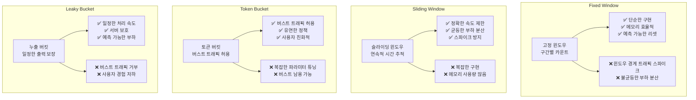

---
tags:
  - advanced
  - api_gateway
  - deep-study
  - hands-on
  - lua_script
  - rate_limiting
  - redis
  - traffic_control
  - 인프라스트럭처
difficulty: ADVANCED
learning_time: "8-12시간"
main_topic: "인프라스트럭처"
priority_score: 4
---

# 16.5D API Gateway Rate Limiting과 트래픽 제어

## 🎯 학습 목표

API Gateway에서 트래픽을 효과적으로 제어하는 고급 Rate Limiting 시스템을 Python으로 구현하면서 다음을 학습합니다:

- 4가지 주요 Rate Limiting 알고리즘 구현과 특징
- 사용자 티어별 동적 제한 정책 설계
- Redis 기반 분산 Rate Limiting 구현
- FastAPI 미들웨어를 통한 실전 통합
- Lua 스크립트를 활용한 원자적 연산 보장
- 실시간 트래픽 모니터링과 정책 조정

---

## ⚡ Rate Limiting과 Traffic Shaping

### Rate Limiting 핵심 데이터 구조

```python
# Python으로 구현한 고급 Rate Limiting 시스템
import asyncio
import time
import json
from typing import Dict, Optional, Tuple, Any
from dataclasses import dataclass, field
from enum import Enum
import redis
import hashlib
from datetime import datetime, timedelta

class RateLimitType(Enum):
    FIXED_WINDOW = "fixed_window"
    SLIDING_WINDOW = "sliding_window"
    TOKEN_BUCKET = "token_bucket"
    LEAKY_BUCKET = "leaky_bucket"

@dataclass
class RateLimit:
    limit: int           # 허용 요청 수
    window: int          # 시간 창 (초)
    type: RateLimitType  # Rate limit 타입
    burst_limit: Optional[int] = None  # 버스트 허용 한계
    
@dataclass
class RateLimitRule:
    name: str
    pattern: str         # URL 패턴 또는 서비스명
    user_limits: Dict[str, RateLimit] = field(default_factory=dict)  # 사용자 타입별
    ip_limits: Dict[str, RateLimit] = field(default_factory=dict)    # IP별
    global_limit: Optional[RateLimit] = None  # 전역 제한
    priority: int = 100  # 우선순위 (낮을수록 높은 우선순위)
```

### 고급 Rate Limiter 핵심 클래스

```python
class AdvancedRateLimiter:
    def __init__(self, redis_client: redis.Redis):
        self.redis = redis_client
        self.rules: Dict[str, RateLimitRule] = {}
        
        # 기본 규칙들 설정
        self._setup_default_rules()
    
    def _setup_default_rules(self):
        """기본 Rate Limiting 규칙 설정"""
        
        # 일반 API 엔드포인트
        self.add_rule(RateLimitRule(
            name="general_api",
            pattern="/api/v1/*",
            user_limits={
                "free": RateLimit(100, 3600, RateLimitType.SLIDING_WINDOW),      # 시간당 100건
                "premium": RateLimit(1000, 3600, RateLimitType.SLIDING_WINDOW),  # 시간당 1000건
                "enterprise": RateLimit(10000, 3600, RateLimitType.SLIDING_WINDOW)  # 시간당 10000건
            },
            ip_limits={
                "default": RateLimit(200, 3600, RateLimitType.SLIDING_WINDOW)  # IP당 시간당 200건
            },
            global_limit=RateLimit(50000, 60, RateLimitType.SLIDING_WINDOW),  # 전역 분당 50000건
            priority=100
        ))
        
        # 인증 엔드포인트 (더 엄격한 제한)
        self.add_rule(RateLimitRule(
            name="auth_api",
            pattern="/api/v1/auth/*",
            user_limits={
                "anonymous": RateLimit(5, 300, RateLimitType.FIXED_WINDOW)  # 5분간 5회
            },
            ip_limits={
                "default": RateLimit(20, 3600, RateLimitType.SLIDING_WINDOW)  # IP당 시간당 20건
            },
            priority=10  # 높은 우선순위
        ))
        
        # 업로드 엔드포인트 (Token Bucket)
        self.add_rule(RateLimitRule(
            name="upload_api",
            pattern="/api/v1/media/upload",
            user_limits={
                "free": RateLimit(10, 3600, RateLimitType.TOKEN_BUCKET, burst_limit=5),
                "premium": RateLimit(100, 3600, RateLimitType.TOKEN_BUCKET, burst_limit=20),
                "enterprise": RateLimit(1000, 3600, RateLimitType.TOKEN_BUCKET, burst_limit=100)
            },
            priority=50
        ))
        
        # 검색 API (Leaky Bucket)
        self.add_rule(RateLimitRule(
            name="search_api",
            pattern="/api/v1/search",
            user_limits={
                "free": RateLimit(60, 60, RateLimitType.LEAKY_BUCKET),      # 분당 60건
                "premium": RateLimit(300, 60, RateLimitType.LEAKY_BUCKET),  # 분당 300건
            },
            ip_limits={
                "default": RateLimit(100, 60, RateLimitType.LEAKY_BUCKET)  # IP당 분당 100건
            },
            priority=70
        ))
    
    def add_rule(self, rule: RateLimitRule):
        """Rate Limiting 규칙 추가"""
        self.rules[rule.name] = rule
        print(f"✅ Rate Limit 규칙 추가: {rule.name} - {rule.pattern}")
```

### 🎯 Rate Limit 검증 핵심 로직

```python
    async def check_rate_limit(
        self, 
        path: str, 
        user_id: Optional[str] = None,
        user_tier: str = "free",
        client_ip: str = "unknown",
        api_key: Optional[str] = None
    ) -> Tuple[bool, Dict[str, Any]]:
        """
        Rate Limit 확인
        Returns: (허용 여부, 상세 정보)
        """
        
        # 적용 가능한 규칙 찾기
        applicable_rules = self._find_applicable_rules(path)
        
        if not applicable_rules:
            # 규칙이 없으면 허용
            return True, {"status": "allowed", "reason": "no_rules"}
        
        # 각 규칙별로 검사 (우선순위 순)
        for rule in sorted(applicable_rules, key=lambda r: r.priority):
            allowed, details = await self._check_rule(
                rule, user_id, user_tier, client_ip, api_key
            )
            
            if not allowed:
                return False, {
                    "status": "rate_limited",
                    "rule": rule.name,
                    "details": details,
                    "retry_after": details.get("retry_after")
                }
        
        return True, {"status": "allowed", "rules_checked": len(applicable_rules)}
    
    def _find_applicable_rules(self, path: str) -> list[RateLimitRule]:
        """경로에 적용 가능한 규칙들 찾기"""
        applicable = []
        
        for rule in self.rules.values():
            if self._path_matches_pattern(path, rule.pattern):
                applicable.append(rule)
        
        return applicable
    
    def _path_matches_pattern(self, path: str, pattern: str) -> bool:
        """경로가 패턴과 매치되는지 확인"""
        import fnmatch
        return fnmatch.fnmatch(path, pattern)
    
    async def _check_rule(
        self,
        rule: RateLimitRule,
        user_id: Optional[str],
        user_tier: str,
        client_ip: str,
        api_key: Optional[str]
    ) -> Tuple[bool, Dict[str, Any]]:
        """개별 규칙 검사"""
        
        checks = []
        
        # 1. 전역 제한 검사
        if rule.global_limit:
            allowed, details = await self._check_limit(
                f"global:{rule.name}",
                rule.global_limit
            )
            checks.append(("global", allowed, details))
            if not allowed:
                return False, details
        
        # 2. 사용자별 제한 검사
        if user_id and user_tier in rule.user_limits:
            user_limit = rule.user_limits[user_tier]
            allowed, details = await self._check_limit(
                f"user:{user_id}:{rule.name}",
                user_limit
            )
            checks.append(("user", allowed, details))
            if not allowed:
                return False, details
        
        # 3. IP별 제한 검사
        if "default" in rule.ip_limits:
            ip_limit = rule.ip_limits["default"]
            allowed, details = await self._check_limit(
                f"ip:{client_ip}:{rule.name}",
                ip_limit
            )
            checks.append(("ip", allowed, details))
            if not allowed:
                return False, details
        
        return True, {"checks": checks}
```

---

## 🏗️ 4가지 Rate Limiting 알고리즘 구현

### 1. Fixed Window Algorithm

```python
    async def _check_fixed_window(self, key: str, rate_limit: RateLimit) -> Tuple[bool, Dict[str, Any]]:
        """Fixed Window 알고리즘"""
        now = int(time.time())
        window_start = (now // rate_limit.window) * rate_limit.window
        window_key = f"{key}:fixed:{window_start}"
        
        # Lua 스크립트로 원자적 실행
        lua_script = """
        local key = KEYS[1]
        local limit = tonumber(ARGV[1])
        local ttl = tonumber(ARGV[2])
        
        local current = redis.call('GET', key)
        if current == false then
            redis.call('SETEX', key, ttl, 1)
            return {1, 0, limit - 1}
        end
        
        current = tonumber(current)
        if current < limit then
            redis.call('INCR', key)
            return {1, current, limit - current - 1}
        else
            local remaining_ttl = redis.call('TTL', key)
            return {0, current, 0, remaining_ttl}
        end
        """
        
        result = await self._execute_lua(lua_script, [window_key], [rate_limit.limit, rate_limit.window])
        allowed = bool(result[0])
        current_count = result[1]
        remaining = result[2] if allowed else 0
        retry_after = result[3] if not allowed else None
        
        return allowed, {
            "algorithm": "fixed_window",
            "limit": rate_limit.limit,
            "current": current_count,
            "remaining": remaining,
            "window": rate_limit.window,
            "retry_after": retry_after
        }
```

### 2. Sliding Window Algorithm (더 정확한 제한)

```python
    async def _check_sliding_window(self, key: str, rate_limit: RateLimit) -> Tuple[bool, Dict[str, Any]]:
        """Sliding Window 알고리즘 (더 정확한 제한)"""
        now = time.time()
        window_key = f"{key}:sliding"
        
        # Lua 스크립트로 sliding window 구현
        lua_script = """
        local key = KEYS[1]
        local limit = tonumber(ARGV[1])
        local window = tonumber(ARGV[2])
        local now = tonumber(ARGV[3])
        
        -- 윈도우 시작 시간
        local window_start = now - window
        
        -- 만료된 항목들 제거
        redis.call('ZREMRANGEBYSCORE', key, '-inf', window_start)
        
        -- 현재 요청 수 확인
        local current_count = redis.call('ZCARD', key)
        
        if current_count < limit then
            -- 요청 허용
            redis.call('ZADD', key, now, now)
            redis.call('EXPIRE', key, window)
            return {1, current_count + 1, limit - current_count - 1}
        else
            -- 요청 거부
            local oldest = redis.call('ZRANGE', key, 0, 0, 'WITHSCORES')
            local retry_after = 0
            if #oldest > 0 then
                retry_after = math.ceil(tonumber(oldest[2]) + window - now)
            end
            return {0, current_count, 0, retry_after}
        end
        """
        
        result = await self._execute_lua(lua_script, [window_key], [rate_limit.limit, rate_limit.window, now])
        allowed = bool(result[0])
        current_count = result[1]
        remaining = result[2] if allowed else 0
        retry_after = result[3] if not allowed and len(result) > 3 else None
        
        return allowed, {
            "algorithm": "sliding_window",
            "limit": rate_limit.limit,
            "current": current_count,
            "remaining": remaining,
            "window": rate_limit.window,
            "retry_after": retry_after
        }
```

### 3. Token Bucket Algorithm (버스트 허용)

```python
    async def _check_token_bucket(self, key: str, rate_limit: RateLimit) -> Tuple[bool, Dict[str, Any]]:
        """Token Bucket 알고리즘 (버스트 허용)"""
        now = time.time()
        bucket_key = f"{key}:bucket"
        
        # Token bucket 파라미터
        capacity = rate_limit.burst_limit or rate_limit.limit
        refill_rate = rate_limit.limit / rate_limit.window  # tokens per second
        
        lua_script = """
        local key = KEYS[1]
        local capacity = tonumber(ARGV[1])
        local refill_rate = tonumber(ARGV[2])
        local now = tonumber(ARGV[3])
        
        -- 현재 bucket 상태 가져오기
        local bucket_data = redis.call('HMGET', key, 'tokens', 'last_refill')
        local tokens = tonumber(bucket_data[1]) or capacity
        local last_refill = tonumber(bucket_data[2]) or now
        
        -- 시간 경과에 따른 토큰 보충
        local elapsed = now - last_refill
        tokens = math.min(capacity, tokens + elapsed * refill_rate)
        
        if tokens >= 1 then
            -- 토큰 사용 가능
            tokens = tokens - 1
            redis.call('HMSET', key, 'tokens', tokens, 'last_refill', now)
            redis.call('EXPIRE', key, 3600)  -- 1시간 TTL
            return {1, math.floor(tokens)}
        else
            -- 토큰 부족
            redis.call('HMSET', key, 'tokens', tokens, 'last_refill', now)
            redis.call('EXPIRE', key, 3600)
            local retry_after = math.ceil((1 - tokens) / refill_rate)
            return {0, 0, retry_after}
        end
        """
        
        result = await self._execute_lua(lua_script, [bucket_key], [capacity, refill_rate, now])
        allowed = bool(result[0])
        remaining_tokens = result[1] if allowed else 0
        retry_after = result[2] if not allowed and len(result) > 2 else None
        
        return allowed, {
            "algorithm": "token_bucket",
            "capacity": capacity,
            "remaining_tokens": remaining_tokens,
            "refill_rate": refill_rate,
            "retry_after": retry_after
        }
```

### 4. Leaky Bucket Algorithm (일정한 처리 속도)

```python
    async def _check_leaky_bucket(self, key: str, rate_limit: RateLimit) -> Tuple[bool, Dict[str, Any]]:
        """Leaky Bucket 알고리즘 (일정한 처리 속도 보장)"""
        now = time.time()
        bucket_key = f"{key}:leaky"
        
        # Leaky bucket 파라미터
        capacity = rate_limit.limit  # bucket 크기
        leak_rate = rate_limit.limit / rate_limit.window  # leaks per second
        
        lua_script = """
        local key = KEYS[1]
        local capacity = tonumber(ARGV[1])
        local leak_rate = tonumber(ARGV[2])
        local now = tonumber(ARGV[3])
        
        -- 현재 bucket 상태
        local bucket_data = redis.call('HMGET', key, 'level', 'last_leak')
        local level = tonumber(bucket_data[1]) or 0
        local last_leak = tonumber(bucket_data[2]) or now
        
        -- 시간 경과에 따른 누출
        local elapsed = now - last_leak
        level = math.max(0, level - elapsed * leak_rate)
        
        if level < capacity then
            -- 요청 수용 가능
            level = level + 1
            redis.call('HMSET', key, 'level', level, 'last_leak', now)
            redis.call('EXPIRE', key, 3600)
            return {1, level, capacity - level}
        else
            -- bucket이 가득참
            redis.call('HMSET', key, 'level', level, 'last_leak', now)
            redis.call('EXPIRE', key, 3600)
            local retry_after = math.ceil(1 / leak_rate)
            return {0, level, 0, retry_after}
        end
        """
        
        result = await self._execute_lua(lua_script, [bucket_key], [capacity, leak_rate, now])
        allowed = bool(result[0])
        current_level = result[1]
        remaining_capacity = result[2] if allowed else 0
        retry_after = result[3] if not allowed and len(result) > 3 else None
        
        return allowed, {
            "algorithm": "leaky_bucket",
            "capacity": capacity,
            "current_level": current_level,
            "remaining_capacity": remaining_capacity,
            "leak_rate": leak_rate,
            "retry_after": retry_after
        }
```

---

## 🔧 Redis Lua 스크립트 실행

```python
    async def _execute_lua(self, script: str, keys: list, args: list):
        """Lua 스크립트 실행 (비동기)"""
        # 실제로는 Redis의 eval 명령어 사용
        # 여기서는 모의 구현
        script_hash = hashlib.sha1(script.encode()).hexdigest()
        
        try:
            # evalsha로 캐시된 스크립트 실행 시도
            return self.redis.evalsha(script_hash, len(keys), *keys, *args)
        except redis.exceptions.NoScriptError:
            # 스크립트가 캐시되지 않은 경우 eval 사용
            return self.redis.eval(script, len(keys), *keys, *args)
    
    async def _check_limit(self, key: str, rate_limit: RateLimit) -> Tuple[bool, Dict[str, Any]]:
        """실제 Rate Limit 알고리즘 실행"""
        
        if rate_limit.type == RateLimitType.FIXED_WINDOW:
            return await self._check_fixed_window(key, rate_limit)
        elif rate_limit.type == RateLimitType.SLIDING_WINDOW:
            return await self._check_sliding_window(key, rate_limit)
        elif rate_limit.type == RateLimitType.TOKEN_BUCKET:
            return await self._check_token_bucket(key, rate_limit)
        elif rate_limit.type == RateLimitType.LEAKY_BUCKET:
            return await self._check_leaky_bucket(key, rate_limit)
        else:
            return False, {"error": "unknown_rate_limit_type"}
    
    def get_rate_limit_status(self, user_id: str, user_tier: str = "free") -> Dict[str, Any]:
        """현재 Rate Limit 상태 조회"""
        status = {}
        
        for rule_name, rule in self.rules.items():
            if user_tier in rule.user_limits:
                # 사용자별 상태 조회
                key = f"user:{user_id}:{rule_name}"
                # 실제로는 Redis에서 현재 상태 조회
                status[rule_name] = {
                    "limit": rule.user_limits[user_tier].limit,
                    "window": rule.user_limits[user_tier].window,
                    "type": rule.user_limits[user_tier].type.value,
                    "current_usage": "조회 필요",  # Redis에서 실제 조회
                }
        
        return status
```

---

## 🚀 FastAPI 미들웨어 통합

### Rate Limiting 미들웨어 구현

```python
# FastAPI와 통합하는 미들웨어
from fastapi import FastAPI, Request, HTTPException
from fastapi.responses import JSONResponse
import redis

app = FastAPI()
redis_client = redis.Redis(host='localhost', port=6379, decode_responses=True)
rate_limiter = AdvancedRateLimiter(redis_client)

@app.middleware("http")
async def rate_limiting_middleware(request: Request, call_next):
    # 사용자 정보 추출
    user_id = request.headers.get("X-User-ID")
    user_tier = request.headers.get("X-User-Tier", "free")
    client_ip = request.client.host
    api_key = request.headers.get("X-API-Key")
    
    # Rate Limit 검사
    allowed, details = await rate_limiter.check_rate_limit(
        path=request.url.path,
        user_id=user_id,
        user_tier=user_tier,
        client_ip=client_ip,
        api_key=api_key
    )
    
    if not allowed:
        # Rate Limit 초과 시 429 응답
        headers = {
            "X-RateLimit-Limit": str(details.get("limit", "unknown")),
            "X-RateLimit-Remaining": str(details.get("remaining", 0)),
            "X-RateLimit-Reset": str(details.get("retry_after", 60)),
            "Retry-After": str(details.get("retry_after", 60))
        }
        
        return JSONResponse(
            status_code=429,
            content={
                "error": "Rate limit exceeded",
                "message": f"Too many requests. Rule: {details.get('rule')}",
                "retry_after": details.get("retry_after"),
                "details": details
            },
            headers=headers
        )
    
    # Rate Limit 통과 시 요청 처리
    response = await call_next(request)
    
    # 응답에 Rate Limit 정보 추가
    if details.get("status") == "allowed":
        response.headers["X-RateLimit-Limit"] = str(details.get("limit", "unknown"))
        response.headers["X-RateLimit-Remaining"] = str(details.get("remaining", "unknown"))
    
    return response
```

### API 엔드포인트 구현

```python
# Rate Limit 상태 조회 엔드포인트
@app.get("/api/v1/rate-limits/status")
async def get_rate_limit_status(
    request: Request,
    user_id: str = None,
    user_tier: str = "free"
):
    if not user_id:
        user_id = request.headers.get("X-User-ID")
    
    if not user_id:
        raise HTTPException(status_code=400, detail="User ID required")
    
    status = rate_limiter.get_rate_limit_status(user_id, user_tier)
    
    return {
        "user_id": user_id,
        "user_tier": user_tier,
        "rate_limits": status,
        "timestamp": datetime.utcnow().isoformat()
    }

# 사용 예제
if __name__ == "__main__":
    print("🚀 고급 Rate Limiter 시작")
    print("📋 설정된 규칙들:")
    
    for rule_name, rule in rate_limiter.rules.items():
        print(f"  - {rule_name}: {rule.pattern}")
        for tier, limit in rule.user_limits.items():
            print(f"    └─ {tier}: {limit.limit}/{limit.window}s ({limit.type.value})")
```

---

## 📊 알고리즘 비교와 선택 가이드

### Rate Limiting 알고리즘 특성 비교



### 사용 시나리오별 알고리즘 선택

| 시나리오 | 추천 알고리즘 | 이유 |
|---------|---------------|------|
| **일반 API 호출** | Sliding Window | 정확한 속도 제한으로 공정한 자원 배분 |
| **인증/로그인** | Fixed Window | 단순하고 강력한 제한으로 보안 강화 |
| **파일 업로드** | Token Bucket | 버스트 허용으로 사용성 향상 |
| **검색/조회** | Leaky Bucket | 서버 부하 안정화와 일정한 응답 시간 |
| **결제 API** | Fixed Window | 엄격한 제한으로 오남용 방지 |
| **실시간 API** | Sliding Window | 정밀한 트래픽 제어 |

---

## 💡 핵심 포인트 요약

### ✅ Rate Limiting 설계 원칙

**1. 계층화된 정책 적용**

- 전역 → 사용자 티어별 → IP별 순서로 검증
- 우선순위 기반 규칙 매칭으로 복잡한 정책 관리
- 예외 상황에 대한 우아한 처리 (Graceful Degradation)

**2. 원자적 연산 보장**

- Redis Lua 스크립트로 Race Condition 방지
- 분산 환경에서의 일관된 카운터 관리
- 캐시된 스크립트로 성능 최적화

**3. 사용자 경험 고려**

- 명확한 에러 메시지와 Retry-After 헤더
- 단계적 제한으로 급작스러운 차단 방지
- 실시간 상태 조회 API 제공

### 🎯 실무 적용 가이드

```bash
Rate Limiting 도입 체크리스트:

✅ 현재 트래픽 패턴 분석 및 기준선 설정
✅ 사용자 티어별 차등 정책 수립
✅ 알고리즘별 특성 이해 후 적절한 선택
✅ Redis 클러스터 구성으로 고가용성 확보
✅ 모니터링과 알림 체계 구축
✅ A/B 테스트로 정책 최적화
```

---

## 🔗 연관 학습 자료

- **[16.5A API Gateway 기초](chapter-16-distributed-system-patterns/16-07-api-gateway-fundamentals.md)** - API Gateway 패턴의 기본 개념
- **[16.5B 라우팅과 로드 밸런싱](chapter-16-distributed-system-patterns/05b-routing-load-balancing.md)** - 고성능 트래픽 처리
- **[16.5C 인증과 인가](chapter-16-distributed-system-patterns/05c-authentication-authorization.md)** - JWT 기반 통합 인증 시스템
- **[16.5E 성공 요인](chapter-16-distributed-system-patterns/16-56-success-factors-best-practices.md)** - 실무 적용 가이드와 베스트 프랙티스
- **[16.5 API Gateway 패턴 종합](chapter-16-distributed-system-patterns/16-55-api-gateway-patterns.md)** - 전체 개요와 학습 로드맵

---

**다음**: [성공 요인과 실무 가이드](chapter-16-distributed-system-patterns/16-56-success-factors-best-practices.md)에서 API Gateway 도입 전략을 완성해보세요! 🏆

## 📚 관련 문서

### 📖 현재 문서 정보

- **난이도**: ADVANCED
- **주제**: 인프라스트럭처
- **예상 시간**: 8-12시간

### 🎯 학습 경로

- [📚 ADVANCED 레벨 전체 보기](../learning-paths/advanced/)
- [🏠 메인 학습 경로](../learning-paths/)
- [📋 전체 가이드 목록](../README.md)

### 📂 같은 챕터 (chapter-16-system-design-patterns)

- [15.1 마이크로서비스 아키텍처 개요](../chapter-15-microservices-architecture/16-01-microservices-architecture.md)
- [15.1A 모놀리스 문제점과 전환 전략](../chapter-15-microservices-architecture/16-10-monolith-to-microservices.md)
- [16.1B 마이크로서비스 설계 원칙과 패턴 개요](./16-11-design-principles.md)
- [16.1B1 단일 책임 원칙 (Single Responsibility Principle)](./16-12-1-single-responsibility-principle.md)
- [16.1B1 단일 책임 원칙 (Single Responsibility Principle)](./16-13-1-single-responsibility.md)

### 🏷️ 관련 키워드

`rate_limiting`, `api_gateway`, `redis`, `lua_script`, `traffic_control`

### ⏭️ 다음 단계 가이드

- 시스템 전체의 관점에서 이해하려 노력하세요
- 다른 고급 주제들과의 연관성을 파악해보세요
