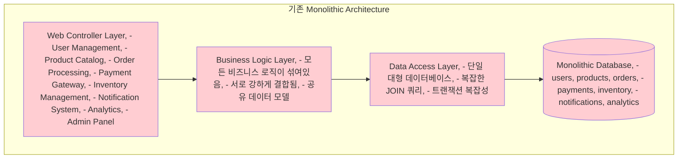
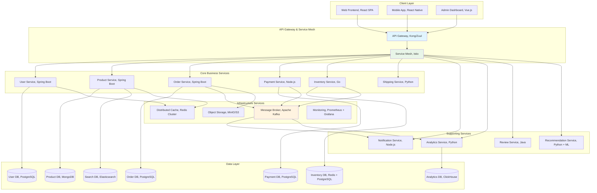

---
tags:
  - Microservices
  - Architecture
  - Distributed Systems
  - Docker
  - Kubernetes
  - Guide
---

# 15.1 마이크로서비스 아키텍처 - 작은 것이 아름답다

## 🚀 2018년 10월 - Monolith Hell에서 Microservices Heaven으로

제가 전자상거래 플랫폼의 리드 개발자로 일할 때 겪었던 아키텍처 전환의 생생한 기록입니다. 6개월 만에 거대한 모놀리스를 12개의 마이크로서비스로 분해하며 얻은 값진 경험을 공유합니다.

### 💥 모놀리스의 한계점 - 현실적인 고민들

**2018년 10월 15일 - 블랙프라이데이 준비 중**

```bash
🔥 우리가 직면한 현실적 문제들:

📊 시스템 현황:
- 코드베이스: 50만 라인 (Java Spring)
- 개발팀: 25명 (5개 팀)
- 배포 주기: 2주에 1회 (너무 느림!)
- 단일 데이터베이스: PostgreSQL (12TB)
- 서버: 20대 (수직 확장만 가능)

😰 일상적인 고통들:
- 한 팀이 코드를 수정하면 다른 팀 기능이 깨짐
- 결제 모듈 버그로 전체 서비스 다운
- 상품 검색 성능 문제로 주문도 느려짐
- 새 개발자 온보딩: 3주 (코드 이해만으로)
- 테스트 실행 시간: 4시간 (CI/CD 병목)
```

**팀별 고충들**

```bash
👥 각 팀이 겪는 구체적인 문제들:

Frontend 팀 (React):
"백엔드 API 하나 수정하려면 왜 전체 시스템을 이해해야 하나요?"

Backend 팀 (Spring):
"상품팀이 DB 스키마 바꾸면 주문팀 코드가 터져요"

DevOps 팀:
"배포할 때마다 모든 기능을 다시 테스트해야 해서 2일이 걸려요"

QA 팀:
"한 기능 테스트하려면 전체 환경을 셋업해야 해요"

Product 팀:
"새 기능 하나 출시하는데 왜 3개월이나 걸리죠?"
```

### 🎯 마이크로서비스 전환 결정 - 전략적 접근

**전환 전 심층 분석**



**도메인 분석과 서비스 경계 정의**

```bash
# Domain-Driven Design으로 Bounded Context 식별

🏪 E-commerce Platform의 핵심 도메인들:

1. User Management (사용자 관리)
   - 회원가입, 로그인, 프로필 관리
   - 권한 및 역할 관리
   
2. Product Catalog (상품 카탈로그)
   - 상품 등록, 수정, 삭제
   - 카테고리 관리, 검색
   
3. Inventory Management (재고 관리)
   - 재고 추적, 예약, 해제
   - 창고 관리
   
4. Order Processing (주문 처리)
   - 주문 생성, 수정, 취소
   - 주문 상태 관리
   
5. Payment Gateway (결제 게이트웨이)
   - 결제 처리, 환불
   - 다중 결제 수단 지원
   
6. Shipping (배송)
   - 배송 추적, 배송업체 연동
   - 배송 정책 관리
   
7. Notification (알림)
   - 이메일, SMS, 푸시 알림
   - 알림 템플릿 관리
   
8. Analytics (분석)
   - 사용자 행동 분석
   - 비즈니스 메트릭
   
9. Review & Rating (리뷰)
   - 상품 리뷰, 평점
   - 리뷰 검증 및 조회
```

### 🏗️ 마이크로서비스 아키텍처 설계

**최종 아키텍처 결과**



---

## 📋 마이크로서비스 설계 원칙

### 1. 단일 책임 원칙 (Single Responsibility Principle)

```java
// ❌ 잘못된 설계 - 하나의 서비스가 너무 많은 책임
@Service
public class UserOrderPaymentService {
    
    // 사용자 관리
    public User createUser(UserRequest request) { ... }
    public User updateUser(Long userId, UserRequest request) { ... }
    
    // 주문 처리  
    public Order createOrder(OrderRequest request) { ... }
    public Order updateOrderStatus(Long orderId, OrderStatus status) { ... }
    
    // 결제 처리
    public Payment processPayment(PaymentRequest request) { ... }
    public Payment refundPayment(Long paymentId) { ... }
    
    // 🚨 문제점: 서로 다른 비즈니스 도메인이 하나의 서비스에!
}

// ✅ 올바른 설계 - 각 서비스는 하나의 비즈니스 기능에만 집중
@Service
public class UserService {
    public User createUser(UserRequest request) {
        // 사용자 생성 로직
        User user = new User(request.getEmail(), request.getName());
        user = userRepository.save(user);
        
        // 이벤트 발행 (다른 서비스에 알림)
        eventPublisher.publishEvent(new UserCreatedEvent(user));
        
        return user;
    }
    
    public User getUserById(Long userId) {
        return userRepository.findById(userId)
            .orElseThrow(() -> new UserNotFoundException("사용자를 찾을 수 없습니다"));
    }
}

@Service  
public class OrderService {
    public Order createOrder(OrderRequest request) {
        // 1. 사용자 존재 확인 (User Service 호출)
        User user = userServiceClient.getUserById(request.getUserId());
        
        // 2. 상품 정보 확인 (Product Service 호출)
        List<Product> products = productServiceClient.getProductsByIds(request.getProductIds());
        
        // 3. 재고 확인 및 예약 (Inventory Service 호출)
        boolean inventoryReserved = inventoryServiceClient.reserveProducts(request.getItems());
        
        if (!inventoryReserved) {
            throw new InsufficientInventoryException("재고가 부족합니다");
        }
        
        // 4. 주문 생성
        Order order = new Order(user.getId(), request.getItems());
        order = orderRepository.save(order);
        
        // 5. 주문 생성 이벤트 발행
        eventPublisher.publishEvent(new OrderCreatedEvent(order));
        
        return order;
    }
}
```

### 2. Database per Service 패턴

```yaml
# 각 서비스가 자신만의 데이터베이스를 소유
version: '3.8'
services:
  # User Service with PostgreSQL
  user-service:
    image: microservices/user-service:latest
    environment:
      - DATABASE_URL=postgresql://user-db:5432/userdb
    depends_on:
      - user-db
      
  user-db:
    image: postgres:13
    environment:
      POSTGRES_DB: userdb
      POSTGRES_USER: userservice
      POSTGRES_PASSWORD: secret
    volumes:
      - user_data:/var/lib/postgresql/data

  # Product Service with MongoDB
  product-service:
    image: microservices/product-service:latest
    environment:
      - MONGO_URL=mongodb://product-db:27017/productdb
    depends_on:
      - product-db
      
  product-db:
    image: mongo:4.4
    environment:
      MONGO_INITDB_DATABASE: productdb
    volumes:
      - product_data:/data/db

  # Order Service with PostgreSQL  
  order-service:
    image: microservices/order-service:latest
    environment:
      - DATABASE_URL=postgresql://order-db:5432/orderdb
    depends_on:
      - order-db
      
  order-db:
    image: postgres:13
    environment:
      POSTGRES_DB: orderdb
      POSTGRES_USER: orderservice
      POSTGRES_PASSWORD: secret
    volumes:
      - order_data:/var/lib/postgresql/data

  # Payment Service with PostgreSQL (금융 데이터는 ACID 필수)
  payment-service:
    image: microservices/payment-service:latest
    environment:
      - DATABASE_URL=postgresql://payment-db:5432/paymentdb
    depends_on:
      - payment-db
      
  payment-db:
    image: postgres:13
    environment:
      POSTGRES_DB: paymentdb
      POSTGRES_USER: paymentservice
      POSTGRES_PASSWORD: secret
    volumes:
      - payment_data:/var/lib/postgresql/data

volumes:
  user_data:
  product_data:
  order_data:
  payment_data:
```

### 3. API 계약 우선 설계 (API Contract First)

```yaml
# OpenAPI 3.0 스펙으로 API 계약 정의 (user-service-api.yaml)
openapi: 3.0.0
info:
  title: User Service API
  version: 1.0.0
  description: 사용자 관리 마이크로서비스 API
  
servers:
  - url: https://api.ecommerce.com/users
    description: Production server
  - url: https://staging-api.ecommerce.com/users  
    description: Staging server

paths:
  /users:
    post:
      summary: 새 사용자 생성
      operationId: createUser
      requestBody:
        required: true
        content:
          application/json:
            schema:
              $ref: '#/components/schemas/CreateUserRequest'
            example:
              email: "john@example.com"
              name: "John Doe"
              phone: "+82-10-1234-5678"
      responses:
        '201':
          description: 사용자 생성 성공
          content:
            application/json:
              schema:
                $ref: '#/components/schemas/User'
        '400':
          description: 잘못된 요청
          content:
            application/json:
              schema:
                $ref: '#/components/schemas/Error'
        '409':
          description: 이메일 중복
          content:
            application/json:
              schema:
                $ref: '#/components/schemas/Error'
                
  /users/{userId}:
    get:
      summary: 사용자 정보 조회
      operationId: getUserById
      parameters:
        - name: userId
          in: path
          required: true
          schema:
            type: integer
            format: int64
      responses:
        '200':
          description: 사용자 정보
          content:
            application/json:
              schema:
                $ref: '#/components/schemas/User'
        '404':
          description: 사용자를 찾을 수 없음
          content:
            application/json:
              schema:
                $ref: '#/components/schemas/Error'

components:
  schemas:
    User:
      type: object
      required:
        - id
        - email  
        - name
        - createdAt
      properties:
        id:
          type: integer
          format: int64
          example: 12345
        email:
          type: string
          format: email
          example: "john@example.com"
        name:
          type: string
          example: "John Doe"
        phone:
          type: string
          example: "+82-10-1234-5678"
        createdAt:
          type: string
          format: date-time
          example: "2023-10-15T14:30:00Z"
        updatedAt:
          type: string
          format: date-time
          example: "2023-10-15T14:30:00Z"
          
    CreateUserRequest:
      type: object
      required:
        - email
        - name
      properties:
        email:
          type: string
          format: email
        name:
          type: string
          minLength: 2
          maxLength: 100
        phone:
          type: string
          pattern: '^\+82-10-\d{4}-\d{4}$'
          
    Error:
      type: object
      required:
        - error
        - message
      properties:
        error:
          type: string
          example: "VALIDATION_ERROR"
        message:
          type: string
          example: "이메일 형식이 올바르지 않습니다"
        details:
          type: array
          items:
            type: string
```

---

## 🔄 서비스 간 통신 패턴

### 1. 동기식 통신 - REST API

```typescript
// TypeScript로 구현한 서비스 클라이언트
interface UserServiceClient {
  createUser(request: CreateUserRequest): Promise<User>;
  getUserById(userId: number): Promise<User>;
  updateUser(userId: number, request: UpdateUserRequest): Promise<User>;
  deleteUser(userId: number): Promise<void>;
}

class RestUserServiceClient implements UserServiceClient {
  private baseUrl: string;
  private httpClient: AxiosInstance;
  
  constructor(baseUrl: string) {
    this.baseUrl = baseUrl;
    this.httpClient = axios.create({
      baseURL: baseUrl,
      timeout: 5000,
      headers: {
        'Content-Type': 'application/json',
      },
    });
    
    // 요청/응답 인터셉터 설정
    this.setupInterceptors();
  }
  
  private setupInterceptors() {
    // 요청 인터셉터 - 인증 토큰 추가
    this.httpClient.interceptors.request.use(
      (config) => {
        const token = AuthService.getAccessToken();
        if (token) {
          config.headers.Authorization = `Bearer ${token}`;
        }
        return config;
      },
      (error) => Promise.reject(error)
    );
    
    // 응답 인터셉터 - 에러 처리 및 재시도
    this.httpClient.interceptors.response.use(
      (response) => response,
      async (error) => {
        const originalRequest = error.config;
        
        // 401 에러 시 토큰 갱신 시도
        if (error.response?.status === 401 && !originalRequest._retry) {
          originalRequest._retry = true;
          
          try {
            await AuthService.refreshToken();
            const newToken = AuthService.getAccessToken();
            originalRequest.headers.Authorization = `Bearer ${newToken}`;
            return this.httpClient(originalRequest);
          } catch (refreshError) {
            // 토큰 갱신 실패 시 로그인 페이지로 리다이렉트
            AuthService.logout();
            throw refreshError;
          }
        }
        
        return Promise.reject(error);
      }
    );
  }
  
  async createUser(request: CreateUserRequest): Promise<User> {
    try {
      const response = await this.httpClient.post<User>('/users', request);
      return response.data;
    } catch (error) {
      this.handleError(error, 'createUser');
      throw error;
    }
  }
  
  async getUserById(userId: number): Promise<User> {
    try {
      const response = await this.httpClient.get<User>(`/users/${userId}`);
      return response.data;
    } catch (error) {
      if (error.response?.status === 404) {
        throw new UserNotFoundError(`사용자 ID ${userId}를 찾을 수 없습니다`);
      }
      this.handleError(error, 'getUserById');
      throw error;
    }
  }
  
  private handleError(error: any, operation: string) {
    console.error(`UserServiceClient.${operation} 실패:`, {
      message: error.message,
      status: error.response?.status,
      data: error.response?.data,
      timestamp: new Date().toISOString(),
    });
    
    // 메트릭 수집
    MetricsCollector.incrementCounter('user_service_client_errors', {
      operation,
      status_code: error.response?.status?.toString() || 'network_error',
    });
  }
}

// Circuit Breaker 패턴 적용
class CircuitBreakerUserServiceClient implements UserServiceClient {
  private client: RestUserServiceClient;
  private circuitBreaker: CircuitBreaker;
  
  constructor(baseUrl: string) {
    this.client = new RestUserServiceClient(baseUrl);
    this.circuitBreaker = new CircuitBreaker({
      timeout: 3000,
      errorThresholdPercentage: 50,
      resetTimeout: 30000,
      onOpen: () => console.log('User Service Circuit Breaker OPEN'),
      onHalfOpen: () => console.log('User Service Circuit Breaker HALF-OPEN'),
      onClose: () => console.log('User Service Circuit Breaker CLOSED'),
    });
  }
  
  async getUserById(userId: number): Promise<User> {
    return this.circuitBreaker.execute(() => this.client.getUserById(userId));
  }
  
  // 다른 메서드들도 유사하게 Circuit Breaker 적용...
}
```

### 2. 비동기식 통신 - 메시지 큐

```go
// Go언어로 구현한 이벤트 기반 통신
package messaging

import (
    "encoding/json"
    "fmt"
    "log"
    "time"
    
    "github.com/streadway/amqp"
)

// 이벤트 타입 정의
type Event struct {
    ID        string                 `json:"id"`
    Type      string                 `json:"type"`
    Source    string                 `json:"source"`
    Data      map[string]interface{} `json:"data"`
    Timestamp time.Time              `json:"timestamp"`
    Version   string                 `json:"version"`
}

// 이벤트 발행자
type EventPublisher struct {
    connection *amqp.Connection
    channel    *amqp.Channel
    exchange   string
}

func NewEventPublisher(amqpURL, exchange string) (*EventPublisher, error) {
    conn, err := amqp.Dial(amqpURL)
    if err != nil {
        return nil, fmt.Errorf("RabbitMQ 연결 실패: %v", err)
    }
    
    ch, err := conn.Channel()
    if err != nil {
        conn.Close()
        return nil, fmt.Errorf("채널 생성 실패: %v", err)
    }
    
    // Exchange 선언
    err = ch.ExchangeDeclare(
        exchange,   // name
        "topic",    // type
        true,       // durable
        false,      // auto-deleted
        false,      // internal
        false,      // no-wait
        nil,        // arguments
    )
    if err != nil {
        ch.Close()
        conn.Close()
        return nil, fmt.Errorf("Exchange 선언 실패: %v", err)
    }
    
    return &EventPublisher{
        connection: conn,
        channel:    ch,
        exchange:   exchange,
    }, nil
}

func (p *EventPublisher) PublishEvent(routingKey string, event Event) error {
    eventData, err := json.Marshal(event)
    if err != nil {
        return fmt.Errorf("이벤트 직렬화 실패: %v", err)
    }
    
    err = p.channel.Publish(
        p.exchange,   // exchange
        routingKey,   // routing key
        false,        // mandatory
        false,        // immediate
        amqp.Publishing{
            ContentType:  "application/json",
            DeliveryMode: amqp.Persistent, // 메시지 영속화
            Timestamp:    time.Now(),
            MessageId:    event.ID,
            Body:         eventData,
        })
    
    if err != nil {
        return fmt.Errorf("이벤트 발행 실패: %v", err)
    }
    
    log.Printf("이벤트 발행 완료: %s -> %s", event.Type, routingKey)
    return nil
}

// 이벤트 구독자
type EventSubscriber struct {
    connection *amqp.Connection
    channel    *amqp.Channel
    exchange   string
    queueName  string
    handlers   map[string]EventHandler
}

type EventHandler func(event Event) error

func NewEventSubscriber(amqpURL, exchange, queueName string) (*EventSubscriber, error) {
    conn, err := amqp.Dial(amqpURL)
    if err != nil {
        return nil, fmt.Errorf("RabbitMQ 연결 실패: %v", err)
    }
    
    ch, err := conn.Channel()
    if err != nil {
        conn.Close()
        return nil, fmt.Errorf("채널 생성 실패: %v", err)
    }
    
    // QoS 설정 - 한 번에 1개 메시지만 처리
    err = ch.Qos(1, 0, false)
    if err != nil {
        ch.Close()
        conn.Close()
        return nil, fmt.Errorf("QoS 설정 실패: %v", err)
    }
    
    // 큐 선언
    _, err = ch.QueueDeclare(
        queueName, // name
        true,      // durable
        false,     // delete when unused
        false,     // exclusive
        false,     // no-wait
        nil,       // arguments
    )
    if err != nil {
        ch.Close()
        conn.Close()
        return nil, fmt.Errorf("큐 선언 실패: %v", err)
    }
    
    return &EventSubscriber{
        connection: conn,
        channel:    ch,
        exchange:   exchange,
        queueName:  queueName,
        handlers:   make(map[string]EventHandler),
    }, nil
}

func (s *EventSubscriber) RegisterHandler(routingKey string, handler EventHandler) error {
    // 큐를 Exchange에 바인딩
    err := s.channel.QueueBind(
        s.queueName, // queue name
        routingKey,  // routing key
        s.exchange,  // exchange
        false,       // no-wait
        nil,         // arguments
    )
    if err != nil {
        return fmt.Errorf("큐 바인딩 실패: %v", err)
    }
    
    s.handlers[routingKey] = handler
    log.Printf("이벤트 핸들러 등록: %s -> %s", routingKey, s.queueName)
    return nil
}

func (s *EventSubscriber) StartConsuming() error {
    msgs, err := s.channel.Consume(
        s.queueName, // queue
        "",          // consumer
        false,       // auto-ack (수동 ACK 사용)
        false,       // exclusive
        false,       // no-local
        false,       // no-wait
        nil,         // args
    )
    if err != nil {
        return fmt.Errorf("메시지 구독 시작 실패: %v", err)
    }
    
    log.Printf("이벤트 구독 시작: %s", s.queueName)
    
    // 메시지 처리 고루틴
    go func() {
        for delivery := range msgs {
            var event Event
            err := json.Unmarshal(delivery.Body, &event)
            if err != nil {
                log.Printf("이벤트 역직렬화 실패: %v", err)
                delivery.Nack(false, false) // 재시도하지 않고 버림
                continue
            }
            
            // 라우팅 키로 핸들러 찾기
            handler, exists := s.handlers[delivery.RoutingKey]
            if !exists {
                log.Printf("핸들러가 없는 라우팅 키: %s", delivery.RoutingKey)
                delivery.Ack(false)
                continue
            }
            
            // 이벤트 처리
            err = handler(event)
            if err != nil {
                log.Printf("이벤트 처리 실패: %v", err)
                // 실패한 메시지는 DLQ(Dead Letter Queue)로 보냄
                delivery.Nack(false, false)
            } else {
                log.Printf("이벤트 처리 완료: %s", event.Type)
                delivery.Ack(false)
            }
        }
    }()
    
    return nil
}

// 실제 사용 예제
func main() {
    // 사용자 서비스에서 이벤트 발행
    publisher, err := NewEventPublisher("amqp://localhost:5672", "ecommerce.events")
    if err != nil {
        log.Fatal("Publisher 생성 실패:", err)
    }
    defer publisher.connection.Close()
    
    // 사용자 생성 이벤트 발행
    userCreatedEvent := Event{
        ID:        generateUUID(),
        Type:      "user.created",
        Source:    "user-service",
        Timestamp: time.Now(),
        Version:   "1.0",
        Data: map[string]interface{}{
            "userId": 12345,
            "email":  "john@example.com",
            "name":   "John Doe",
        },
    }
    
    err = publisher.PublishEvent("user.created", userCreatedEvent)
    if err != nil {
        log.Fatal("이벤트 발행 실패:", err)
    }
    
    // 주문 서비스에서 사용자 생성 이벤트 구독
    subscriber, err := NewEventSubscriber("amqp://localhost:5672", "ecommerce.events", "order-service-queue")
    if err != nil {
        log.Fatal("Subscriber 생성 실패:", err)
    }
    defer subscriber.connection.Close()
    
    // 사용자 생성 이벤트 핸들러 등록
    subscriber.RegisterHandler("user.created", func(event Event) error {
        userId, ok := event.Data["userId"].(float64) // JSON 숫자는 float64로 파싱됨
        if !ok {
            return fmt.Errorf("유효하지 않은 userId")
        }
        
        log.Printf("새 사용자 생성됨: %v", userId)
        
        // 사용자별 기본 장바구니 생성 등의 로직 수행
        err := createDefaultCartForUser(int64(userId))
        if err != nil {
            return fmt.Errorf("기본 장바구니 생성 실패: %v", err)
        }
        
        return nil
    })
    
    // 구독 시작
    err = subscriber.StartConsuming()
    if err != nil {
        log.Fatal("구독 시작 실패:", err)
    }
    
    // 프로그램이 종료되지 않도록 대기
    select {}
}

func createDefaultCartForUser(userId int64) error {
    // 사용자별 기본 장바구니 생성 로직
    log.Printf("사용자 %d의 기본 장바구니 생성", userId)
    return nil
}

func generateUUID() string {
    // UUID 생성 로직 (실제로는 uuid 라이브러리 사용)
    return fmt.Sprintf("event-%d", time.Now().UnixNano())
}
```

---

## 🐳 컨테이너화와 오케스트레이션

### Docker로 마이크로서비스 패키징

```dockerfile
# User Service Dockerfile (Multi-stage build)
# Build stage
FROM openjdk:11-jdk-slim AS builder

WORKDIR /app

# Maven 의존성 파일들 먼저 복사 (레이어 캐싱 최적화)
COPY pom.xml .
COPY .mvn .mvn
COPY mvnw .

# 의존성 다운로드
RUN ./mvnw dependency:go-offline

# 소스 코드 복사 및 빌드
COPY src src
RUN ./mvnw package -DskipTests

# Runtime stage
FROM openjdk:11-jre-slim

# 비루트 사용자 생성 (보안)
RUN groupadd -r appuser && useradd -r -g appuser appuser

WORKDIR /app

# APM 에이전트 설치
ADD https://github.com/elastic/apm-agent-java/releases/download/v1.32.0/elastic-apm-agent-1.32.0.jar /app/elastic-apm-agent.jar

# 빌드된 JAR 파일 복사
COPY --from=builder /app/target/user-service-*.jar app.jar

# 권한 설정
RUN chown -R appuser:appuser /app
USER appuser

# 헬스 체크
HEALTHCHECK --interval=30s --timeout=3s --start-period=5s --retries=3 \
    CMD curl -f http://localhost:8080/actuator/health || exit 1

# 환경 변수 기본값
ENV JAVA_OPTS="-Xms256m -Xmx512m -XX:+UseG1GC" \
    ELASTIC_APM_SERVICE_NAME="user-service" \
    ELASTIC_APM_ENVIRONMENT="production" \
    ELASTIC_APM_APPLICATION_PACKAGES="com.ecommerce.user"

# JVM과 애플리케이션 옵션
ENTRYPOINT ["sh", "-c", "java $JAVA_OPTS -javaagent:./elastic-apm-agent.jar -jar app.jar"]

EXPOSE 8080
```

### Kubernetes에서 마이크로서비스 배포

```yaml
# user-service-deployment.yaml
apiVersion: apps/v1
kind: Deployment
metadata:
  name: user-service
  labels:
    app: user-service
    version: v1
spec:
  replicas: 3
  selector:
    matchLabels:
      app: user-service
  template:
    metadata:
      labels:
        app: user-service
        version: v1
    spec:
      containers:
      - name: user-service
        image: ecommerce/user-service:1.2.3
        imagePullPolicy: Always
        ports:
        - containerPort: 8080
          name: http
        env:
        - name: DATABASE_URL
          valueFrom:
            secretKeyRef:
              name: user-db-secret
              key: url
        - name: DATABASE_USERNAME
          valueFrom:
            secretKeyRef:
              name: user-db-secret
              key: username
        - name: DATABASE_PASSWORD
          valueFrom:
            secretKeyRef:
              name: user-db-secret
              key: password
        - name: REDIS_URL
          value: "redis://redis-cluster:6379"
        - name: KAFKA_BROKERS
          value: "kafka-0.kafka:9092,kafka-1.kafka:9092,kafka-2.kafka:9092"
        - name: ELASTIC_APM_SERVER_URLS
          value: "http://apm-server:8200"
        
        resources:
          requests:
            memory: "256Mi"
            cpu: "250m"
          limits:
            memory: "512Mi"
            cpu: "500m"
            
        livenessProbe:
          httpGet:
            path: /actuator/health/liveness
            port: 8080
          initialDelaySeconds: 60
          periodSeconds: 30
          timeoutSeconds: 5
          failureThreshold: 3
          
        readinessProbe:
          httpGet:
            path: /actuator/health/readiness
            port: 8080
          initialDelaySeconds: 30
          periodSeconds: 10
          timeoutSeconds: 3
          failureThreshold: 3
          
        lifecycle:
          preStop:
            exec:
              command: ["/bin/sh", "-c", "sleep 15"]
              
      # Graceful shutdown
      terminationGracePeriodSeconds: 30
      
      # Pod Disruption Budget과 함께 사용
      affinity:
        podAntiAffinity:
          preferredDuringSchedulingIgnoredDuringExecution:
          - weight: 100
            podAffinityTerm:
              labelSelector:
                matchExpressions:
                - key: app
                  operator: In
                  values:
                  - user-service
              topologyKey: kubernetes.io/hostname

---
apiVersion: v1
kind: Service
metadata:
  name: user-service
  labels:
    app: user-service
spec:
  selector:
    app: user-service
  ports:
  - name: http
    port: 80
    targetPort: 8080
  type: ClusterIP

---
apiVersion: policy/v1
kind: PodDisruptionBudget
metadata:
  name: user-service-pdb
spec:
  minAvailable: 2
  selector:
    matchLabels:
      app: user-service

---
apiVersion: autoscaling/v2
kind: HorizontalPodAutoscaler
metadata:
  name: user-service-hpa
spec:
  scaleTargetRef:
    apiVersion: apps/v1
    kind: Deployment
    name: user-service
  minReplicas: 3
  maxReplicas: 10
  metrics:
  - type: Resource
    resource:
      name: cpu
      target:
        type: Utilization
        averageUtilization: 70
  - type: Resource
    resource:
      name: memory
      target:
        type: Utilization
        averageUtilization: 80
  behavior:
    scaleUp:
      stabilizationWindowSeconds: 60
      policies:
      - type: Percent
        value: 100
        periodSeconds: 15
    scaleDown:
      stabilizationWindowSeconds: 300
      policies:
      - type: Percent
        value: 10
        periodSeconds: 60
```

---

## 📊 마이크로서비스 모니터링과 추적

### 분산 트레이싱 구현

```python
# Python Flask 마이크로서비스의 분산 트레이싱
from flask import Flask, request, jsonify
from opentelemetry import trace
from opentelemetry.exporter.jaeger.thrift import JaegerExporter
from opentelemetry.instrumentation.flask import FlaskInstrumentor
from opentelemetry.instrumentation.requests import RequestsInstrumentor
from opentelemetry.instrumentation.sqlalchemy import SQLAlchemyInstrumentor
from opentelemetry.sdk.trace import TracerProvider
from opentelemetry.sdk.trace.export import BatchSpanProcessor
from opentelemetry.sdk.resources import Resource
import requests
import time
import logging

# OpenTelemetry 초기화
def init_tracing(service_name: str):
    # 리소스 정보 설정
    resource = Resource.create({
        "service.name": service_name,
        "service.version": "1.0.0",
        "deployment.environment": "production"
    })
    
    # TraceProvider 설정
    trace.set_tracer_provider(TracerProvider(resource=resource))
    
    # Jaeger Exporter 설정
    jaeger_exporter = JaegerExporter(
        agent_host_name="jaeger-agent",
        agent_port=6831,
    )
    
    # Span Processor 추가
    span_processor = BatchSpanProcessor(jaeger_exporter)
    trace.get_tracer_provider().add_span_processor(span_processor)

# Flask 앱 생성
app = Flask(__name__)
init_tracing("order-service")

# 자동 instrumentation
FlaskInstrumentor().instrument_app(app)
RequestsInstrumentor().instrument()
SQLAlchemyInstrumentor().instrument()

# Tracer 생성
tracer = trace.get_tracer(__name__)

class OrderService:
    def __init__(self):
        self.user_service_url = "http://user-service"
        self.product_service_url = "http://product-service"
        self.payment_service_url = "http://payment-service"
        
    def create_order(self, order_data):
        """주문 생성 - 여러 서비스 호출을 추적"""
        with tracer.start_as_current_span("create_order") as span:
            # Span에 메타데이터 추가
            span.set_attribute("order.user_id", order_data["user_id"])
            span.set_attribute("order.item_count", len(order_data["items"]))
            span.set_attribute("order.total_amount", order_data["total_amount"])
            
            try:
                # 1. 사용자 검증
                user = self.validate_user(order_data["user_id"])
                span.add_event("사용자 검증 완료", {
                    "user.email": user["email"],
                    "user.membership": user["membership_level"]
                })
                
                # 2. 상품 정보 조회
                products = self.get_products(order_data["items"])
                span.add_event("상품 정보 조회 완료", {
                    "product.count": len(products)
                })
                
                # 3. 재고 확인
                if not self.check_inventory(order_data["items"]):
                    span.set_status(trace.Status(trace.StatusCode.ERROR, "재고 부족"))
                    raise ValueError("재고가 부족합니다")
                
                # 4. 결제 처리
                payment_result = self.process_payment({
                    "user_id": order_data["user_id"],
                    "amount": order_data["total_amount"],
                    "payment_method": order_data["payment_method"]
                })
                
                span.add_event("결제 처리 완료", {
                    "payment.transaction_id": payment_result["transaction_id"],
                    "payment.status": payment_result["status"]
                })
                
                # 5. 주문 저장
                order = self.save_order({
                    **order_data,
                    "payment_id": payment_result["transaction_id"],
                    "status": "confirmed"
                })
                
                span.set_status(trace.Status(trace.StatusCode.OK))
                span.set_attribute("order.id", order["order_id"])
                
                return order
                
            except Exception as e:
                # 오류 정보를 span에 기록
                span.record_exception(e)
                span.set_status(trace.Status(trace.StatusCode.ERROR, str(e)))
                logging.error(f"주문 생성 실패: {str(e)}")
                raise
    
    def validate_user(self, user_id):
        """사용자 검증 - 외부 서비스 호출"""
        with tracer.start_as_current_span("validate_user") as span:
            span.set_attribute("user.id", user_id)
            
            start_time = time.time()
            response = requests.get(
                f"{self.user_service_url}/users/{user_id}",
                timeout=5,
                headers={"X-Request-ID": self.get_request_id()}
            )
            
            duration = time.time() - start_time
            span.set_attribute("http.duration_ms", duration * 1000)
            span.set_attribute("http.status_code", response.status_code)
            
            if response.status_code != 200:
                span.set_status(trace.Status(trace.StatusCode.ERROR, "사용자 검증 실패"))
                raise ValueError(f"사용자 검증 실패: {response.status_code}")
            
            user_data = response.json()
            span.add_event("사용자 정보 조회 성공")
            return user_data
    
    def get_products(self, items):
        """상품 정보 조회 - 병렬 처리"""
        with tracer.start_as_current_span("get_products") as span:
            span.set_attribute("product.item_count", len(items))
            
            # 상품 ID 목록 추출
            product_ids = [item["product_id"] for item in items]
            
            # 병렬로 상품 정보 조회
            with tracer.start_as_current_span("fetch_product_details"):
                response = requests.post(
                    f"{self.product_service_url}/products/batch",
                    json={"product_ids": product_ids},
                    timeout=10,
                    headers={"X-Request-ID": self.get_request_id()}
                )
                
                if response.status_code != 200:
                    span.set_status(trace.Status(trace.StatusCode.ERROR, "상품 조회 실패"))
                    raise ValueError("상품 정보를 가져올 수 없습니다")
                
                products = response.json()
                span.set_attribute("product.found_count", len(products))
                return products
    
    def process_payment(self, payment_data):
        """결제 처리 - 중요한 비즈니스 로직"""
        with tracer.start_as_current_span("process_payment") as span:
            span.set_attribute("payment.amount", payment_data["amount"])
            span.set_attribute("payment.method", payment_data["payment_method"])
            
            # 결제 서비스 호출
            response = requests.post(
                f"{self.payment_service_url}/payments",
                json=payment_data,
                timeout=30,  # 결제는 타임아웃을 길게
                headers={"X-Request-ID": self.get_request_id()}
            )
            
            if response.status_code != 200:
                span.set_status(trace.Status(trace.StatusCode.ERROR, "결제 실패"))
                raise ValueError("결제 처리에 실패했습니다")
            
            payment_result = response.json()
            span.add_event("결제 성공", {
                "transaction_id": payment_result["transaction_id"]
            })
            
            return payment_result
    
    def get_request_id(self):
        """현재 요청의 추적 ID 생성"""
        current_span = trace.get_current_span()
        if current_span:
            return current_span.get_span_context().trace_id
        return "unknown"

# Flask 라우트
order_service = OrderService()

@app.route('/orders', methods=['POST'])
def create_order():
    """주문 생성 API"""
    try:
        order_data = request.get_json()
        
        # 입력 검증
        if not order_data or not order_data.get('user_id'):
            return jsonify({"error": "사용자 ID가 필요합니다"}), 400
            
        if not order_data.get('items'):
            return jsonify({"error": "주문 항목이 필요합니다"}), 400
        
        # 주문 생성
        order = order_service.create_order(order_data)
        
        return jsonify(order), 201
        
    except ValueError as e:
        return jsonify({"error": str(e)}), 400
    except Exception as e:
        logging.error(f"주문 생성 중 예기치 못한 오류: {str(e)}")
        return jsonify({"error": "내부 서버 오류"}), 500

@app.route('/health', methods=['GET'])
def health_check():
    """헬스 체크"""
    return jsonify({
        "status": "healthy",
        "service": "order-service",
        "timestamp": time.time()
    })

if __name__ == '__main__':
    # 개발 환경에서만 실행
    app.run(host='0.0.0.0', port=8080, debug=True)
```

---

## 🎯 마이크로서비스 성공 요인과 실패 요인

### ✅ 성공 요인들

```bash
1. 조직 구조와 일치 (Conway's Law)
   - 각 팀이 하나의 서비스를 소유
   - 명확한 책임과 권한 분할
   - 자율적인 개발/배포 가능

2. 도메인 주도 설계 (DDD)
   - 비즈니스 도메인에 따른 서비스 분리
   - Bounded Context 명확히 정의
   - 도메인 전문가와의 긴밀한 협업

3. API 우선 개발
   - API 계약을 먼저 정의
   - 클라이언트와 서버 독립 개발
   - 버전 관리와 하위 호환성

4. 자동화된 DevOps
   - CI/CD 파이프라인 완전 자동화
   - Infrastructure as Code
   - 모니터링과 알림 시스템

5. 문화적 변화
   - You Build It, You Run It 원칙
   - 실패에 대한 학습 문화
   - 지속적인 개선 마인드
```

### ❌ 실패 요인들

```bash
1. 잘못된 서비스 분해
   - 너무 세분화 (Nano-services)
   - 비즈니스 로직이 아닌 기술적 기준으로 분리
   - 데이터 일관성 문제 무시

2. 분산 시스템 복잡성 과소평가
   - 네트워크 지연과 실패 무시
   - 분산 트랜잭션의 어려움
   - 디버깅과 모니터링 어려움

3. 조직적 준비 부족
   - 기존 조직 구조 유지
   - 충분한 인력과 스킬 부족
   - 운영 부담 증가에 대한 대비 부족

4. 기술적 부채 누적
   - 레거시 시스템과의 통합 어려움
   - 서비스 간 의존성 복잡화
   - 데이터 중복과 불일치
```

### 🎯 마이크로서비스 도입 체크리스트

```bash
📋 도입 전 준비사항:

조직적 준비:
✅ 팀 구조 개편 가능한가?
✅ DevOps 역량이 충분한가?
✅ 24/7 운영 체제 준비되었나?
✅ 마이크로서비스 전문 인력이 있나?

기술적 준비:
✅ 컨테이너/쿠버네티스 경험
✅ 모니터링/로깅 시스템
✅ API Gateway/Service Mesh
✅ 메시지 큐/이벤트 스트리밍

비즈니스 준비:
✅ 도메인 모델이 명확한가?
✅ 서비스 경계를 정의할 수 있나?
✅ 추가 운영 비용 감당 가능한가?
✅ 초기 성능 저하 수용 가능한가?
```

---

## 🚀 다음 단계

마이크로서비스 아키텍처의 기반을 다졌으니, 이제 더 고도화된 패턴들을 학습할 차례입니다.

[15.2 이벤트 드리븐 아키텍처](02-event-driven-architecture.md)에서는 마이크로서비스 간의 느슨한 결합을 달성하고 실시간 데이터 처리를 가능하게 하는 이벤트 기반 통신 패턴을 깊이 있게 다뤄보겠습니다.

"마이크로서비스는 아키텍처가 아니라 조직의 문제를 해결하는 도구입니다." - 올바른 이유로 마이크로서비스를 도입하고, 점진적으로 발전시켜 나가세요! 🏗️⚡
