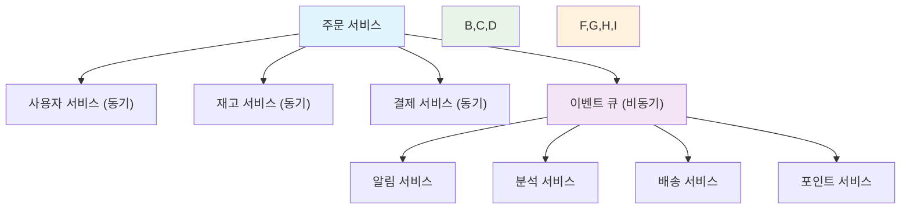

---
tags:
  - Microservices
  - Service Communication
  - System Design
  - Overview
---

# 16.1C 서비스 간 통신과 메시징 개요

## 🎯 마이크로서비스 통신의 핵심 원리

마이크로서비스 아키텍처에서 서비스 간 통신은 전체 시스템의 안정성과 성능을 결정하는 가장 중요한 요소입니다. 단순히 API를 호출하는 것을 넘어서, 장애 격리, 성능 최적화, 확장성을 고려한 통신 전략이 필요합니다.

이 섹션에서는 실제 전자상거래 플랫폼에서 검증된 통신 패턴들을 통해 견고한 마이크로서비스 간 통신을 구현하는 방법을 학습합니다.

## 📚 학습 로드맵

이 통신 패턴 가이드는 3개의 핵심 문서로 구성되어 있습니다:

### 1️⃣ [동기식 통신 - REST API와 Circuit Breaker](01c1-synchronous-communication.md)

- **TypeScript 기반 견고한 REST 클라이언트 구현**
  - Circuit Breaker 패턴 적용
  - 지능형 재시도 로직 (지수 백오프 + 지터)
  - 포괄적인 에러 핸들링 및 메트릭 수집
- **실전 적용 사례**
  - JWT 토큰 자동 갱신
  - 분산 트레이싱 헤더 관리
  - 배치 요청 최적화
  - Fallback 메커니즘

### 2️⃣ [비동기식 통신 - 메시지 큐와 이벤트 기반](01c2-asynchronous-communication.md)

- **Go 언어 기반 이벤트 시스템 구현**
  - RabbitMQ를 활용한 견고한 Publisher/Subscriber
  - Publisher Confirm을 통한 메시지 전달 보장
  - 자동 재연결 및 Dead Letter Queue 처리
- **실전 운영 고려사항**
  - 이벤트 역직렬화 및 타입 안전성
  - 미들웨어 패턴을 통한 확장성
  - 분산 트레이싱 및 메트릭 통합

### 3️⃣ [통신 패턴 선택과 실전 최적화 가이드](01c3-communication-patterns-best-practices.md)

- **통신 방식 선택 기준과 하이브리드 패턴**
  - 동기식 vs 비동기식 통신 선택 가이드
  - Command-Query 분리 패턴
  - 상황별 최적 통신 조합 전략
- **성능 최적화와 장애 대응**
  - Connection Pooling, 배치 처리, 캐싱 전략
  - Circuit Breaker, Bulkhead, Rate Limiting 조합
  - 캐스케이딩 장애 방지 시스템

## 🎯 핵심 개념 비교표

| 측면 | 동기식 통신 | 비동기식 통신 | 하이브리드 패턴 |
|------|-------------|---------------|-----------------|
| **응답성** | 즉시 응답 | 결과적 일관성 | Command-Query 분리 |
| **장애 격리** | Circuit Breaker | Message Queue | 다층 방어 시스템 |
| **확장성** | 제한적 | 높음 | 상황에 따른 조합 |
| **복잡성** | 낮음 | 높음 | 중간 (점진적 도입) |
| **사용처** | 실시간 조회/결제 | 이벤트 처리/분석 | 엔터프라이즈 시스템 |

## 🚀 실전 활용 시나리오

### 전자상거래 주문 처리 시나리오

**동기식 통신 사용 케이스:**

- 사용자 정보 조회 (주문 생성 시 즉시 필요)
- 재고 확인 (실시간 검증 필요)
- 결제 처리 (즉시 성공/실패 확인 필요)

**비동기식 통신 사용 케이스:**

- 주문 생성 이벤트 → 재고 차감, 배송 준비, 알림 전송
- 결제 완료 이벤트 → 영수증 발송, 포인트 적립, 분석 데이터 수집
- 배송 상태 변경 → 고객 알림, 배송 추적 업데이트

## 🎭 학습 전략

### 초보자 (권장 순서)

1. **[동기식 통신](01c1-synchronous-communication.md)** → REST API 기초와 Circuit Breaker 이해
2. **간단한 동기 클라이언트 구현** → 재시도, 타임아웃 등 기본 패턴 적용
3. **[비동기식 통신](01c2-asynchronous-communication.md)** → 이벤트 기반 아키텍처 학습
4. **[통신 패턴 선택 가이드](01c3-communication-patterns-best-practices.md)** → 실전 선택 기준과 최적화 전략

### 중급자 (심화 학습)

1. **[통신 패턴 선택 가이드](01c3-communication-patterns-best-practices.md)** → 하이브리드 패턴과 성능 최적화
2. **동기식 고급 패턴** → Bulkhead, Rate Limiting, 캐스케이딩 장애 방지
3. **비동기식 고급 패턴** → Saga, Event Sourcing, CQRS
4. **운영 및 모니터링** → 메트릭, 로깅, 분산 트레이싱

### 전문가 (마스터 레벨)

1. **프로토콜 최적화** → gRPC, GraphQL, WebSocket 활용
2. **멀티 클라우드 통신** → 서비스 메시, API Gateway 패턴
3. **보안 강화** → mTLS, OAuth2/OIDC, 요청 서명
4. **카오스 엔지니어링** → 장애 주입, 복구 테스트

## 🔗 연관 학습

### 선행 학습

- [마이크로서비스 설계 원칙](01b-design-principles.md) - 서비스 분할과 경계 설정
- [분산 시스템 기초](../chapter-14-distributed-systems/index.md) - CAP 정리, 일관성 모델

### 후속 학습

- [컨테이너화와 오케스트레이션](01d-containerization-orchestration.md) - 배포 및 운영 전략
- [모니터링과 성공 요인](01e-monitoring-success-factors.md) - 운영 관점의 통신 최적화

## 📊 주요 성능 지표

### 동기식 통신 KPI

- **응답 시간**: P95 < 200ms, P99 < 500ms
- **가용성**: 99.9% 이상 (Circuit Breaker 효과)
- **에러율**: < 0.1% (재시도 후 최종 실패율)
- **처리량**: 초당 요청 수 (TPS)

### 비동기식 통신 KPI

- **메시지 처리 지연**: 평균 < 1초
- **메시지 전달률**: 99.99% (DLQ 포함)
- **큐 백로그**: 정상 상태 < 100개
- **처리 순서**: 순서 보장 필요 시 파티션 단위 측정

---

**다음**: 구체적인 구현을 위해 [동기식 통신 패턴](01c1-synchronous-communication.md)부터 시작하거나, [비동기식 통신 패턴](01c2-asynchronous-communication.md), [통신 패턴 선택 가이드](01c3-communication-patterns-best-practices.md)로 직접 이동할 수 있습니다.
