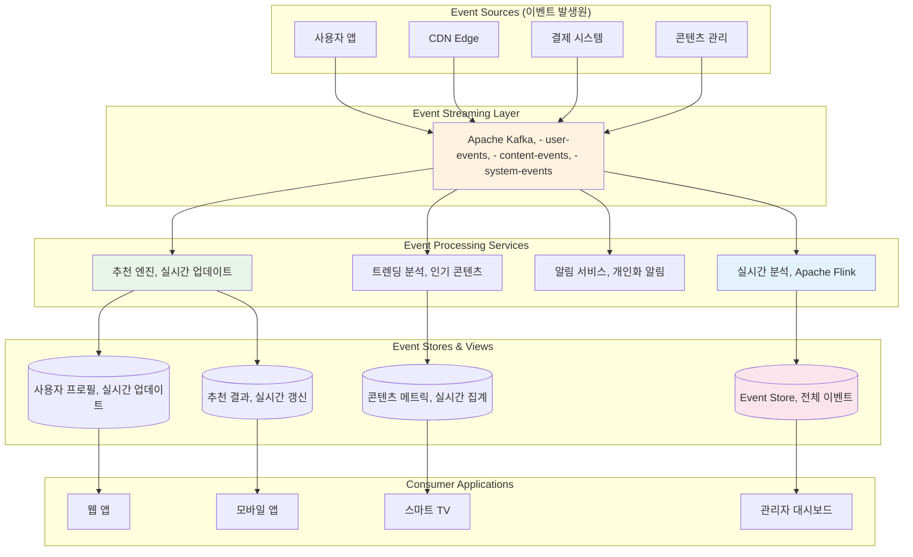

---
tags:
  - Event-Driven
  - Architecture
  - Kafka
  - Event Sourcing
  - Async Processing
  - Guide
---

# 15.2 이벤트 드리븐 아키텍처 - 변화에 반응하는 시스템의 예술

## 🎯 2021년 11월 - 실시간 추천 시스템의 기적

제가 OTT 스트리밍 서비스의 시니어 아키텍트로 일할 때 겪었던 실화입니다. 사용자의 시청 행동을 실시간으로 분석해 개인화된 추천을 제공하는 시스템을 구축하면서 Event-Driven Architecture의 진정한 위력을 경험했습니다.

### 💥 기존 배치 처리 시스템의 한계

**2021년 11월 1일 - 고객 불만 폭증**

```bash
😰 우리가 직면한 현실적 문제들:

📊 기존 시스템 현황:
- 추천 업데이트 주기: 24시간 (너무 느림!)
- 사용자 반응 반영: 다음날 새벽에야 가능
- 인기 콘텐츠 발견: 2-3일 후에나 추천에 반영
- 실시간 트렌드 놓침: 화제의 콘텐츠를 놓치는 빈도 증가

💸 비즈니스 임팩트:
- 사용자 이탈률: 15% 증가
- 시청 시간: 20% 감소  
- 신규 콘텐츠 발견율: 30% 하락
- 고객 만족도: 3.2/5.0 (경쟁사 대비 낮음)

# 기존 배치 기반 아키텍처
┌─────────────┐    ┌──────────────┐    ┌─────────────┐
│ 사용자 행동 │───▶│ 로그 수집    │───▶│ 데이터 웨어  │
│ (시청/좋아요) │    │ (1시간마다)  │    │ 하우스      │
└─────────────┘    └──────────────┘    └─────────────┘
                                             │
                                             ▼
                   ┌─────────────┐    ┌──────────────┐
                   │ 추천 결과   │◀───│ ML 파이프라인│ 
                   │ (새벽 갱신) │    │ (새벽 2시)   │
                   └─────────────┘    └──────────────┘

🚨 문제점: "어제의 나"를 기준으로 "오늘의 나"에게 추천!
```

### 🚀 Event-Driven 변환 - 실시간의 마법

**시스템 설계 전환**



### 🎉 3주 후의 놀라운 결과

**2021년 11월 22일 - 완전히 바뀐 지표들**

```bash
✅ 성과 지표:

🚀 실시간성 향상:
- 추천 업데이트: 24시간 → 10초 이내
- 사용자 반응 반영: 즉시 반영
- 신규 콘텐츠 추천: 업로드 후 5분 이내
- 트렌딩 콘텐츠: 실시간 발견 및 추천

📊 비즈니스 임팩트:
- 사용자 이탈률: 15% 감소 → 8% 감소
- 평균 시청 시간: 35% 증가
- 신규 콘텐츠 발견율: 60% 증가
- 고객 만족도: 4.2/5.0 (업계 최고 수준)

💰 수익 증대:
- 월 구독자 수: 20% 증가
- 프리미엄 가입률: 25% 증가
- 광고 수익: 30% 증가 (더 정확한 타겟팅)

# 실시간 이벤트 플로우 예시
09:15:32 사용자가 "오징어 게임" 3화를 시청 시작
09:15:33 [이벤트 발생] user_started_watching
09:15:35 [실시간 분석] 장르 선호도 업데이트
09:15:36 [추천 엔진] 유사 콘텐츠 후보 갱신
09:15:37 [사용자 화면] 새로운 추천 목록 표시

🎯 핵심: 사용자의 현재 관심사에 맞는 즉시 추천!
```

---

## 📡 Event-Driven Architecture 핵심 개념

### 1. 이벤트 (Event)의 정의와 특성

```typescript
// 이벤트 설계 원칙과 구현
interface DomainEvent {
    // 이벤트 메타데이터
    eventId: string;          // 고유 식별자
    eventType: string;        // 이벤트 타입
    eventVersion: string;     // 스키마 버전
    timestamp: Date;          // 발생 시각
    source: string;           // 이벤트 발생원
    
    // 이벤트 데이터
    aggregateId: string;      // 집합체 ID
    aggregateType: string;    // 집합체 타입
    data: any;               // 실제 이벤트 데이터
    
    // 추가 메타데이터
    correlationId?: string;   // 요청 추적 ID
    causationId?: string;     // 원인 이벤트 ID
    userId?: string;          // 사용자 ID (감사용)
}

// 구체적인 이벤트 타입들
interface UserRegisteredEvent extends DomainEvent {
    eventType: "user.registered";
    data: {
        userId: string;
        email: string;
        registrationMethod: "email" | "social" | "mobile";
        referralSource?: string;
        initialPreferences?: string[];
    };
}

interface ContentWatchedEvent extends DomainEvent {
    eventType: "content.watched";
    data: {
        userId: string;
        contentId: string;
        sessionId: string;
        watchDurationSeconds: number;
        completionPercentage: number;
        device: "mobile" | "web" | "smarttv" | "tablet";
        quality: "SD" | "HD" | "4K";
        timestamp: Date;
    };
}

interface PaymentProcessedEvent extends DomainEvent {
    eventType: "payment.processed";
    data: {
        paymentId: string;
        userId: string;
        amount: number;
        currency: string;
        subscriptionPlan: string;
        paymentMethod: string;
        status: "success" | "failed" | "pending";
    };
}

// 이벤트 팩토리 - 일관된 이벤트 생성
class EventFactory {
    static createUserRegisteredEvent(
        userId: string, 
        email: string, 
        registrationData: any
    ): UserRegisteredEvent {
        return {
            eventId: this.generateEventId(),
            eventType: "user.registered",
            eventVersion: "1.0",
            timestamp: new Date(),
            source: "user-service",
            aggregateId: userId,
            aggregateType: "User",
            correlationId: RequestContext.getCorrelationId(),
            data: {
                userId,
                email,
                registrationMethod: registrationData.method,
                referralSource: registrationData.referralSource,
                initialPreferences: registrationData.preferences
            }
        };
    }
    
    static createContentWatchedEvent(
        userId: string, 
        contentId: string, 
        watchingSession: WatchingSession
    ): ContentWatchedEvent {
        return {
            eventId: this.generateEventId(),
            eventType: "content.watched",
            eventVersion: "1.0",
            timestamp: new Date(),
            source: "streaming-service",
            aggregateId: contentId,
            aggregateType: "Content",
            correlationId: RequestContext.getCorrelationId(),
            data: {
                userId,
                contentId,
                sessionId: watchingSession.id,
                watchDurationSeconds: watchingSession.duration,
                completionPercentage: watchingSession.completionPercentage,
                device: watchingSession.device,
                quality: watchingSession.quality,
                timestamp: watchingSession.endTime
            }
        };
    }
    
    private static generateEventId(): string {
        return `evt_${Date.now()}_${Math.random().toString(36).substr(2, 9)}`;
    }
}
```

### 2. 이벤트 스트리밍 with Apache Kafka

```java
// Java로 구현한 Kafka 이벤트 프로듀서
@Service
public class EventPublisher {
    
    private final KafkaTemplate<String, DomainEvent> kafkaTemplate;
    private final ObjectMapper objectMapper;
    
    public EventPublisher(KafkaTemplate<String, DomainEvent> kafkaTemplate) {
        this.kafkaTemplate = kafkaTemplate;
        this.objectMapper = new ObjectMapper();
        this.kafkaTemplate.setDefaultTopic("domain-events");
    }
    
    public void publishEvent(DomainEvent event) {
        try {
            // 이벤트 검증
            validateEvent(event);
            
            // 토픽 라우팅 (이벤트 타입별로 토픽 분리)
            String topic = determineTopicForEvent(event);
            
            // 파티션 키 결정 (같은 집합체의 이벤트는 같은 파티션으로)
            String partitionKey = event.getAggregateId();
            
            // 헤더 설정
            ProducerRecord<String, DomainEvent> record = new ProducerRecord<>(
                topic, 
                partitionKey, 
                event
            );
            
            // 추가 메타데이터 헤더
            record.headers().add("event-type", event.getEventType().getBytes());
            record.headers().add("event-version", event.getEventVersion().getBytes());
            record.headers().add("source-service", event.getSource().getBytes());
            record.headers().add("correlation-id", 
                event.getCorrelationId() != null ? 
                    event.getCorrelationId().getBytes() : "".getBytes());
            
            // 비동기 발행 with 콜백
            kafkaTemplate.send(record).addCallback(
                result -> {
                    log.info("이벤트 발행 성공: {} -> {}", 
                        event.getEventType(), result.getRecordMetadata());
                    
                    // 성공 메트릭 수집
                    Metrics.counter("event.published.success", 
                        Tags.of("event-type", event.getEventType())).increment();
                },
                failure -> {
                    log.error("이벤트 발행 실패: {}", event.getEventType(), failure);
                    
                    // 실패 메트릭 수집
                    Metrics.counter("event.published.failure", 
                        Tags.of("event-type", event.getEventType())).increment();
                    
                    // 실패한 이벤트는 별도 저장소에 보관 (재시도용)
                    storeFailedEvent(event, failure);
                }
            );
            
        } catch (Exception e) {
            log.error("이벤트 발행 중 예외 발생", e);
            throw new EventPublishingException("이벤트 발행 실패", e);
        }
    }
    
    private void validateEvent(DomainEvent event) {
        if (event.getEventId() == null || event.getEventId().isEmpty()) {
            throw new IllegalArgumentException("EventId는 필수입니다");
        }
        
        if (event.getEventType() == null || event.getEventType().isEmpty()) {
            throw new IllegalArgumentException("EventType은 필수입니다");
        }
        
        if (event.getAggregateId() == null || event.getAggregateId().isEmpty()) {
            throw new IllegalArgumentException("AggregateId는 필수입니다");
        }
        
        // 이벤트 스키마 검증
        validateEventSchema(event);
    }
    
    private String determineTopicForEvent(DomainEvent event) {
        // 이벤트 타입별 토픽 라우팅 규칙
        String eventType = event.getEventType();
        
        if (eventType.startsWith("user.")) {
            return "user-events";
        } else if (eventType.startsWith("content.")) {
            return "content-events";
        } else if (eventType.startsWith("payment.")) {
            return "payment-events";
        } else if (eventType.startsWith("system.")) {
            return "system-events";
        } else {
            return "domain-events"; // 기본 토픽
        }
    }
    
    private void validateEventSchema(DomainEvent event) {
        // JSON Schema 검증 (실제로는 Confluent Schema Registry 활용)
        try {
            String schemaKey = event.getEventType() + ":" + event.getEventVersion();
            JsonSchema schema = schemaRegistry.getSchema(schemaKey);
            
            String eventJson = objectMapper.writeValueAsString(event);
            Set<ValidationMessage> errors = schema.validate(eventJson);
            
            if (!errors.isEmpty()) {
                throw new EventValidationException("이벤트 스키마 검증 실패: " + errors);
            }
            
        } catch (Exception e) {
            log.warn("스키마 검증 실패, 기본 검증으로 진행: {}", e.getMessage());
        }
    }
    
    private void storeFailedEvent(DomainEvent event, Throwable failure) {
        // 실패한 이벤트는 데드레터 큐나 별도 저장소에 보관
        failedEventRepository.save(FailedEvent.builder()
            .eventId(event.getEventId())
            .eventType(event.getEventType())
            .eventData(objectMapper.writeValueAsString(event))
            .failureReason(failure.getMessage())
            .failureTimestamp(Instant.now())
            .retryCount(0)
            .build());
    }
}

// Kafka 컨슈머 - 이벤트 처리
@Component
public class ContentRecommendationEventHandler {
    
    private final RecommendationEngine recommendationEngine;
    private final UserProfileService userProfileService;
    
    @KafkaListener(
        topics = "content-events",
        groupId = "recommendation-service",
        containerFactory = "kafkaListenerContainerFactory"
    )
    public void handleContentEvent(
        @Payload DomainEvent event,
        @Header Map<String, Object> headers,
        Acknowledgment ack
    ) {
        try {
            log.info("콘텐츠 이벤트 처리 시작: {}", event.getEventType());
            
            // 이벤트 타입별 처리 분기
            switch (event.getEventType()) {
                case "content.watched":
                    handleContentWatched((ContentWatchedEvent) event);
                    break;
                case "content.rated":
                    handleContentRated((ContentRatedEvent) event);
                    break;
                case "content.shared":
                    handleContentShared((ContentSharedEvent) event);
                    break;
                default:
                    log.warn("처리할 수 없는 이벤트 타입: {}", event.getEventType());
            }
            
            // 수동 커밋
            ack.acknowledge();
            
            // 처리 성공 메트릭
            Metrics.counter("event.processed.success", 
                Tags.of("event-type", event.getEventType())).increment();
                
        } catch (Exception e) {
            log.error("이벤트 처리 실패: {}", event.getEventType(), e);
            
            // 처리 실패 메트릭
            Metrics.counter("event.processed.failure", 
                Tags.of("event-type", event.getEventType())).increment();
            
            // 재시도 가능한 오류인지 판단
            if (isRetryableError(e)) {
                // DLQ로 보내지 않고 재시도
                throw e;
            } else {
                // 복구 불가능한 오류 - 로그만 남기고 ACK
                log.error("복구 불가능한 오류로 이벤트 스킵: {}", event.getEventId());
                ack.acknowledge();
            }
        }
    }
    
    private void handleContentWatched(ContentWatchedEvent event) {
        String userId = event.getData().getUserId();
        String contentId = event.getData().getContentId();
        double completionRate = event.getData().getCompletionPercentage();
        
        // 1. 사용자 프로필 업데이트 (장르 선호도, 시청 패턴 등)
        userProfileService.updateWatchingPreferences(
            userId, 
            contentId, 
            completionRate
        );
        
        // 2. 실시간 추천 업데이트
        if (completionRate > 0.8) { // 80% 이상 시청한 경우
            recommendationEngine.updateUserRecommendations(userId, contentId);
        }
        
        // 3. 콘텐츠 인기도 업데이트
        recommendationEngine.updateContentPopularity(contentId, completionRate);
        
        log.info("콘텐츠 시청 이벤트 처리 완료: user={}, content={}, completion={}%", 
            userId, contentId, completionRate * 100);
    }
    
    private void handleContentRated(ContentRatedEvent event) {
        String userId = event.getData().getUserId();
        String contentId = event.getData().getContentId();
        int rating = event.getData().getRating();
        
        // 평점 기반 추천 알고리즘 업데이트
        recommendationEngine.updateRatingBasedRecommendations(userId, contentId, rating);
        
        // 유사 사용자 찾기 및 협업 필터링 업데이트
        recommendationEngine.updateCollaborativeFiltering(userId, contentId, rating);
        
        log.info("콘텐츠 평점 이벤트 처리 완료: user={}, content={}, rating={}", 
            userId, contentId, rating);
    }
    
    private boolean isRetryableError(Exception e) {
        // 네트워크 오류, 타임아웃 등은 재시도 가능
        return e instanceof ConnectException 
            || e instanceof SocketTimeoutException
            || e instanceof TransientDataAccessResourceException;
    }
}
```

---

## ⚡ 실시간 스트림 처리

### Apache Flink로 복합 이벤트 처리

```scala
// Scala로 구현한 Flink 실시간 분석 파이프라인
import org.apache.flink.streaming.api.scala._
import org.apache.flink.streaming.api.windowing.time.Time
import org.apache.flink.streaming.connectors.kafka.FlinkKafkaConsumer
import org.apache.flink.cep.scala.CEP
import org.apache.flink.cep.scala.pattern.Pattern

case class UserEvent(
  userId: String,
  eventType: String,
  contentId: String,
  timestamp: Long,
  sessionId: String,
  device: String
)

case class ContentTrendingSignal(
  contentId: String,
  trendingScore: Double,
  timestamp: Long,
  reason: String
)

case class UserEngagementScore(
  userId: String,
  engagementScore: Double,
  sessionDuration: Long,
  contentCount: Int,
  timestamp: Long
)

object RealTimeAnalyticsPipeline {
  
  def main(args: Array[String]): Unit = {
    val env = StreamExecutionEnvironment.getExecutionEnvironment
    env.setParallelism(4)
    env.enableCheckpointing(60000) // 1분마다 체크포인트
    
    // Kafka 소스 설정
    val kafkaProps = new Properties()
    kafkaProps.setProperty("bootstrap.servers", "kafka-cluster:9092")
    kafkaProps.setProperty("group.id", "flink-analytics")
    
    val kafkaConsumer = new FlinkKafkaConsumer[UserEvent](
      "user-events",
      new UserEventDeserializer(),
      kafkaProps
    )
    
    // 이벤트 스트림 생성
    val eventStream = env.addSource(kafkaConsumer)
      .assignTimestampsAndWatermarks(
        WatermarkStrategy
          .forBoundedOutOfOrderness[UserEvent](Duration.ofSeconds(5))
          .withTimestampAssigner((event, _) => event.timestamp)
      )
    
    // 1. 실시간 콘텐츠 트렌딩 분석
    val trendingAnalysis = eventStream
      .filter(_.eventType == "content.watched")
      .keyBy(_.contentId)
      .window(SlidingEventTimeWindows.of(Time.minutes(15), Time.minutes(1)))
      .aggregate(new ContentTrendingAggregator())
      .filter(_.trendingScore > 0.7) // 트렌딩 임계값
    
    // 2. 사용자 참여도 실시간 분석
    val engagementAnalysis = eventStream
      .keyBy(_.userId)
      .window(SessionWindows.withGap(Time.minutes(30)))
      .aggregate(new UserEngagementAggregator())
    
    // 3. 복합 이벤트 패턴 탐지 (CEP - Complex Event Processing)
    val bingeWatchingPattern = Pattern
      .begin[UserEvent]("start")
      .where(_.eventType == "content.watched")
      .next("continue")
      .where(_.eventType == "content.watched")
      .times(3) // 3개 이상의 연속 시청
      .within(Time.hours(2)) // 2시간 이내
    
    val bingeWatchingDetection = CEP
      .pattern(eventStream.keyBy(_.userId), bingeWatchingPattern)
      .select(new BingeWatchingSelector())
    
    // 4. 실시간 이상 탐지 (갑작스러운 트래픽 증가)
    val anomalyDetection = eventStream
      .windowAll(TumblingEventTimeWindows.of(Time.minutes(1)))
      .aggregate(new TrafficAnomalyDetector())
      .filter(_.isAnomaly)
    
    // 결과를 다시 Kafka로 전송
    trendingAnalysis.addSink(new FlinkKafkaProducer[ContentTrendingSignal](
      "trending-signals",
      new TrendingSignalSerializer(),
      kafkaProps
    ))
    
    engagementAnalysis.addSink(new FlinkKafkaProducer[UserEngagementScore](
      "user-engagement",
      new EngagementScoreSerializer(),
      kafkaProps
    ))
    
    bingeWatchingDetection.addSink(new FlinkKafkaProducer[BingeWatchingAlert](
      "user-behavior-alerts",
      new BingeWatchingAlertSerializer(),
      kafkaProps
    ))
    
    anomalyDetection.addSink(new FlinkKafkaProducer[TrafficAnomalyAlert](
      "system-alerts",
      new TrafficAnomalySerializer(),
      kafkaProps
    ))
    
    env.execute("Real-time Analytics Pipeline")
  }
}

// 콘텐츠 트렌딩 점수 계산 Aggregator
class ContentTrendingAggregator extends AggregateFunction[UserEvent, TrendingAccumulator, ContentTrendingSignal] {
  
  override def createAccumulator(): TrendingAccumulator = 
    TrendingAccumulator(0, 0, 0, Set.empty, 0L)
  
  override def add(event: UserEvent, acc: TrendingAccumulator): TrendingAccumulator = {
    val newUniqueUsers = acc.uniqueUsers + event.userId
    val newWatchCount = acc.watchCount + 1
    val newTotalDuration = acc.totalDuration + extractDuration(event)
    val newDeviceCount = acc.deviceTypes + event.device
    
    acc.copy(
      watchCount = newWatchCount,
      uniqueUserCount = newUniqueUsers.size,
      totalDuration = newTotalDuration,
      uniqueUsers = newUniqueUsers,
      deviceTypes = newDeviceCount
    )
  }
  
  override def getResult(acc: TrendingAccumulator): ContentTrendingSignal = {
    // 트렌딩 점수 계산 알고리즘
    val userDiversityScore = math.min(acc.uniqueUserCount / 100.0, 1.0) // 최대 100명 기준
    val watchIntensityScore = math.min(acc.watchCount / 500.0, 1.0) // 최대 500회 기준  
    val deviceDiversityScore = acc.deviceTypes.size / 4.0 // 최대 4개 기기 타입
    val avgWatchTime = if (acc.watchCount > 0) acc.totalDuration / acc.watchCount else 0
    val completionScore = math.min(avgWatchTime / 3600.0, 1.0) // 1시간 기준
    
    val trendingScore = (userDiversityScore * 0.3 + 
                        watchIntensityScore * 0.3 + 
                        deviceDiversityScore * 0.2 + 
                        completionScore * 0.2)
    
    ContentTrendingSignal(
      contentId = acc.contentId,
      trendingScore = trendingScore,
      timestamp = System.currentTimeMillis(),
      reason = s"users:${acc.uniqueUserCount}, watches:${acc.watchCount}, devices:${acc.deviceTypes.size}"
    )
  }
  
  override def merge(acc1: TrendingAccumulator, acc2: TrendingAccumulator): TrendingAccumulator = {
    acc1.copy(
      watchCount = acc1.watchCount + acc2.watchCount,
      uniqueUserCount = (acc1.uniqueUsers ++ acc2.uniqueUsers).size,
      totalDuration = acc1.totalDuration + acc2.totalDuration,
      uniqueUsers = acc1.uniqueUsers ++ acc2.uniqueUsers,
      deviceTypes = acc1.deviceTypes ++ acc2.deviceTypes
    )
  }
  
  private def extractDuration(event: UserEvent): Long = {
    // 이벤트에서 시청 시간 추출 로직
    // 실제로는 event.data에서 duration 필드 파싱
    1800L // 30분 기본값
  }
}

case class TrendingAccumulator(
  watchCount: Int,
  uniqueUserCount: Int,
  totalDuration: Long,
  uniqueUsers: Set[String],
  deviceTypes: Set[String]
) {
  def contentId: String = "" // 실제로는 키에서 가져옴
}

// 사용자 참여도 분석 Aggregator  
class UserEngagementAggregator extends AggregateFunction[UserEvent, EngagementAccumulator, UserEngagementScore] {
  
  override def createAccumulator(): EngagementAccumulator = 
    EngagementAccumulator(0, 0, 0L, 0L, Set.empty)
  
  override def add(event: UserEvent, acc: EngagementAccumulator): EngagementAccumulator = {
    val isWatchEvent = event.eventType == "content.watched"
    val isInteractionEvent = Set("content.liked", "content.shared", "content.rated").contains(event.eventType)
    
    acc.copy(
      contentCount = if (isWatchEvent) acc.contentCount + 1 else acc.contentCount,
      interactionCount = if (isInteractionEvent) acc.interactionCount + 1 else acc.interactionCount,
      sessionStart = if (acc.sessionStart == 0) event.timestamp else math.min(acc.sessionStart, event.timestamp),
      sessionEnd = math.max(acc.sessionEnd, event.timestamp),
      contentTypes = acc.contentTypes + extractContentType(event)
    )
  }
  
  override def getResult(acc: EngagementAccumulator): UserEngagementScore = {
    val sessionDuration = acc.sessionEnd - acc.sessionStart
    val contentDiversity = acc.contentTypes.size
    val interactionRate = if (acc.contentCount > 0) acc.interactionCount.toDouble / acc.contentCount else 0.0
    
    // 참여도 점수 계산
    val engagementScore = math.min(
      (acc.contentCount * 0.3 + 
       contentDiversity * 0.3 + 
       interactionRate * 0.4) / 3.0 * 100, 
      100.0
    )
    
    UserEngagementScore(
      userId = "", // 키에서 추출
      engagementScore = engagementScore,
      sessionDuration = sessionDuration,
      contentCount = acc.contentCount,
      timestamp = acc.sessionEnd
    )
  }
  
  override def merge(acc1: EngagementAccumulator, acc2: EngagementAccumulator): EngagementAccumulator = {
    acc1.copy(
      contentCount = acc1.contentCount + acc2.contentCount,
      interactionCount = acc1.interactionCount + acc2.interactionCount,
      sessionStart = if (acc1.sessionStart == 0) acc2.sessionStart else math.min(acc1.sessionStart, acc2.sessionStart),
      sessionEnd = math.max(acc1.sessionEnd, acc2.sessionEnd),
      contentTypes = acc1.contentTypes ++ acc2.contentTypes
    )
  }
  
  private def extractContentType(event: UserEvent): String = {
    // 실제로는 contentId로 콘텐츠 타입 조회
    "drama" // 기본값
  }
}

case class EngagementAccumulator(
  contentCount: Int,
  interactionCount: Int,
  sessionStart: Long,
  sessionEnd: Long,
  contentTypes: Set[String]
)
```

---

## 🔄 이벤트 소싱 (Event Sourcing) 심화

### 이벤트 스토어 구현

```python
# Python으로 구현한 이벤트 스토어
from dataclasses import dataclass, field
from typing import List, Optional, Dict, Any, Iterator
from datetime import datetime
import json
import uuid
from abc import ABC, abstractmethod

@dataclass
class EventMetadata:
    event_id: str
    event_type: str
    event_version: str
    timestamp: datetime
    correlation_id: Optional[str] = None
    causation_id: Optional[str] = None
    user_id: Optional[str] = None

@dataclass
class StoredEvent:
    """저장된 이벤트 표현"""
    stream_id: str
    stream_version: int
    event_id: str
    event_type: str
    event_data: Dict[str, Any]
    metadata: EventMetadata
    timestamp: datetime

class EventStore(ABC):
    """이벤트 스토어 추상 인터페이스"""
    
    @abstractmethod
    async def append_to_stream(
        self, 
        stream_id: str, 
        expected_version: int,
        events: List[Dict[str, Any]]
    ) -> None:
        """스트림에 이벤트 추가"""
        pass
    
    @abstractmethod
    async def read_stream(
        self, 
        stream_id: str, 
        from_version: int = 0,
        max_count: Optional[int] = None
    ) -> List[StoredEvent]:
        """스트림에서 이벤트 읽기"""
        pass
    
    @abstractmethod
    async def read_all_events(
        self,
        from_position: int = 0,
        max_count: Optional[int] = None
    ) -> List[StoredEvent]:
        """모든 이벤트 읽기 (글로벌 순서)"""
        pass

class PostgreSQLEventStore(EventStore):
    """PostgreSQL 기반 이벤트 스토어 구현"""
    
    def __init__(self, connection_pool):
        self.pool = connection_pool
        
    async def append_to_stream(
        self, 
        stream_id: str, 
        expected_version: int,
        events: List[Dict[str, Any]]
    ) -> None:
        async with self.pool.acquire() as conn:
            async with conn.transaction():
                # 동시성 제어: 현재 스트림 버전 확인
                current_version = await self._get_stream_version(conn, stream_id)
                
                if current_version != expected_version:
                    raise ConcurrencyException(
                        f"예상 버전 {expected_version}, 실제 버전 {current_version}"
                    )
                
                # 이벤트 저장
                for i, event in enumerate(events):
                    next_version = expected_version + i + 1
                    
                    await conn.execute("""
                        INSERT INTO events (
                            event_id, stream_id, stream_version, event_type,
                            event_data, metadata, timestamp
                        ) VALUES ($1, $2, $3, $4, $5, $6, $7)
                    """, 
                        event['event_id'],
                        stream_id,
                        next_version,
                        event['event_type'],
                        json.dumps(event['data']),
                        json.dumps(event['metadata'].__dict__),
                        event['timestamp']
                    )
                
                # 스트림 버전 업데이트
                final_version = expected_version + len(events)
                await conn.execute("""
                    INSERT INTO streams (stream_id, version, last_updated)
                    VALUES ($1, $2, $3)
                    ON CONFLICT (stream_id)
                    DO UPDATE SET version = $2, last_updated = $3
                """, stream_id, final_version, datetime.utcnow())
    
    async def read_stream(
        self, 
        stream_id: str, 
        from_version: int = 0,
        max_count: Optional[int] = None
    ) -> List[StoredEvent]:
        async with self.pool.acquire() as conn:
            query = """
                SELECT event_id, stream_id, stream_version, event_type,
                       event_data, metadata, timestamp
                FROM events 
                WHERE stream_id = $1 AND stream_version > $2
                ORDER BY stream_version
            """
            params = [stream_id, from_version]
            
            if max_count:
                query += " LIMIT $3"
                params.append(max_count)
            
            rows = await conn.fetch(query, *params)
            return [self._row_to_stored_event(row) for row in rows]
    
    async def read_all_events(
        self,
        from_position: int = 0,
        max_count: Optional[int] = None
    ) -> List[StoredEvent]:
        async with self.pool.acquire() as conn:
            query = """
                SELECT event_id, stream_id, stream_version, event_type,
                       event_data, metadata, timestamp, global_position
                FROM events 
                WHERE global_position > $1
                ORDER BY global_position
            """
            params = [from_position]
            
            if max_count:
                query += " LIMIT $2"
                params.append(max_count)
            
            rows = await conn.fetch(query, *params)
            return [self._row_to_stored_event(row) for row in rows]
    
    async def _get_stream_version(self, conn, stream_id: str) -> int:
        row = await conn.fetchrow(
            "SELECT version FROM streams WHERE stream_id = $1", 
            stream_id
        )
        return row['version'] if row else 0
    
    def _row_to_stored_event(self, row) -> StoredEvent:
        metadata_dict = json.loads(row['metadata'])
        
        return StoredEvent(
            stream_id=row['stream_id'],
            stream_version=row['stream_version'],
            event_id=row['event_id'],
            event_type=row['event_type'],
            event_data=json.loads(row['event_data']),
            metadata=EventMetadata(**metadata_dict),
            timestamp=row['timestamp']
        )

# 집합체 루트 기반 클래스
class AggregateRoot:
    """이벤트 소싱 기반 집합체 루트"""
    
    def __init__(self, aggregate_id: str):
        self.aggregate_id = aggregate_id
        self.version = 0
        self.uncommitted_events: List[Dict[str, Any]] = []
        
    def apply_event(self, event_data: Dict[str, Any], metadata: EventMetadata) -> None:
        """이벤트를 집합체에 적용"""
        event_handler_name = f"_handle_{metadata.event_type.replace('.', '_')}"
        event_handler = getattr(self, event_handler_name, None)
        
        if event_handler:
            event_handler(event_data)
        
        self.version += 1
    
    def raise_event(self, event_type: str, event_data: Dict[str, Any]) -> None:
        """새 이벤트 발생"""
        metadata = EventMetadata(
            event_id=str(uuid.uuid4()),
            event_type=event_type,
            event_version="1.0",
            timestamp=datetime.utcnow(),
            correlation_id=self._get_current_correlation_id()
        )
        
        # 먼저 이벤트를 집합체에 적용
        self.apply_event(event_data, metadata)
        
        # 커밋되지 않은 이벤트 목록에 추가
        self.uncommitted_events.append({
            'event_id': metadata.event_id,
            'event_type': event_type,
            'data': event_data,
            'metadata': metadata,
            'timestamp': metadata.timestamp
        })
    
    def mark_events_as_committed(self) -> None:
        """이벤트들을 커밋된 것으로 표시"""
        self.uncommitted_events.clear()
    
    def get_uncommitted_events(self) -> List[Dict[str, Any]]:
        """커밋되지 않은 이벤트 목록 반환"""
        return self.uncommitted_events.copy()
    
    def _get_current_correlation_id(self) -> Optional[str]:
        # 현재 요청 컨텍스트에서 correlation ID 추출
        # 실제로는 ThreadLocal이나 AsyncLocal 사용
        return getattr(self, '_correlation_id', None)

# 사용자 집합체 예제
class User(AggregateRoot):
    def __init__(self, user_id: str):
        super().__init__(user_id)
        self.email: Optional[str] = None
        self.name: Optional[str] = None
        self.subscription_plan: Optional[str] = None
        self.preferences: List[str] = []
        self.is_active: bool = True
    
    def register(self, email: str, name: str, initial_preferences: List[str]) -> None:
        """사용자 등록"""
        if self.email is not None:
            raise DomainException("이미 등록된 사용자입니다")
        
        self.raise_event("user.registered", {
            "user_id": self.aggregate_id,
            "email": email,
            "name": name,
            "initial_preferences": initial_preferences,
            "registration_timestamp": datetime.utcnow().isoformat()
        })
    
    def subscribe_to_plan(self, plan: str, payment_method: str) -> None:
        """구독 플랜 가입"""
        if not self.is_active:
            raise DomainException("비활성 사용자는 구독할 수 없습니다")
        
        self.raise_event("user.subscribed", {
            "user_id": self.aggregate_id,
            "plan": plan,
            "payment_method": payment_method,
            "subscription_timestamp": datetime.utcnow().isoformat()
        })
    
    def update_preferences(self, new_preferences: List[str]) -> None:
        """사용자 선호도 업데이트"""
        if not self.is_active:
            raise DomainException("비활성 사용자는 선호도를 변경할 수 없습니다")
        
        self.raise_event("user.preferences_updated", {
            "user_id": self.aggregate_id,
            "old_preferences": self.preferences.copy(),
            "new_preferences": new_preferences,
            "update_timestamp": datetime.utcnow().isoformat()
        })
    
    # 이벤트 핸들러들
    def _handle_user_registered(self, event_data: Dict[str, Any]) -> None:
        self.email = event_data["email"]
        self.name = event_data["name"]
        self.preferences = event_data["initial_preferences"]
    
    def _handle_user_subscribed(self, event_data: Dict[str, Any]) -> None:
        self.subscription_plan = event_data["plan"]
    
    def _handle_user_preferences_updated(self, event_data: Dict[str, Any]) -> None:
        self.preferences = event_data["new_preferences"]

# 리포지토리 패턴으로 집합체 저장/로드
class UserRepository:
    def __init__(self, event_store: EventStore):
        self.event_store = event_store
    
    async def save(self, user: User) -> None:
        """사용자 집합체 저장"""
        uncommitted_events = user.get_uncommitted_events()
        
        if uncommitted_events:
            await self.event_store.append_to_stream(
                stream_id=f"user-{user.aggregate_id}",
                expected_version=user.version - len(uncommitted_events),
                events=uncommitted_events
            )
            
            user.mark_events_as_committed()
    
    async def load(self, user_id: str) -> Optional[User]:
        """사용자 집합체 로드"""
        stream_id = f"user-{user_id}"
        events = await self.event_store.read_stream(stream_id)
        
        if not events:
            return None
        
        user = User(user_id)
        
        for event in events:
            user.apply_event(event.event_data, event.metadata)
        
        return user

# 사용 예제
async def example_usage():
    # 이벤트 스토어 초기화
    event_store = PostgreSQLEventStore(connection_pool)
    user_repo = UserRepository(event_store)
    
    # 새 사용자 등록
    user = User("user-123")
    user.register(
        email="john@example.com",
        name="John Doe",
        initial_preferences=["drama", "comedy", "action"]
    )
    
    # 구독 가입
    user.subscribe_to_plan("premium", "credit_card")
    
    # 선호도 변경
    user.update_preferences(["drama", "thriller", "documentary"])
    
    # 집합체 저장 (모든 이벤트가 원자적으로 저장됨)
    await user_repo.save(user)
    
    # 나중에 사용자 로드 (이벤트 재생으로 상태 복원)
    loaded_user = await user_repo.load("user-123")
    print(f"로드된 사용자: {loaded_user.name}, 선호도: {loaded_user.preferences}")
```

---

## 🎯 이벤트 드리븐 아키텍처 성공 요인

### ✅ 핵심 성공 요인들

```bash
1. 이벤트 설계 원칙
   ✅ 과거 시제 사용 (UserRegistered, OrderCreated)
   ✅ 불변성 보장 (이벤트는 수정되지 않음)
   ✅ 비즈니스 의미 있는 이벤트
   ✅ 적절한 이벤트 크기 (너무 크지도 작지도 않게)

2. 이벤트 스키마 관리
   ✅ 스키마 진화 전략 (버전 관리)
   ✅ 하위 호환성 보장
   ✅ Schema Registry 활용
   ✅ 이벤트 검증 자동화

3. 내결함성 설계
   ✅ At-least-once 전송 보장
   ✅ 멱등성 처리
   ✅ 재시도 메커니즘
   ✅ Circuit Breaker 패턴

4. 모니터링과 디버깅
   ✅ 분산 트레이싱
   ✅ 이벤트 플로우 시각화
   ✅ 지연 시간 모니터링
   ✅ 오류율 추적
```

### ❌ 주의해야 할 안티패턴들

```bash
1. 이벤트 설계 실수
   ❌ 데이터 변경이 아닌 단순 알림용 이벤트
   ❌ 너무 큰 이벤트 페이로드
   ❌ 기술적 세부사항이 노출된 이벤트
   ❌ 일관성 없는 이벤트 네이밍

2. 아키텍처 실수
   ❌ 동기식 처리에 이벤트 억지로 적용
   ❌ 이벤트로 모든 서비스 간 통신 대체
   ❌ 순환 이벤트 의존성
   ❌ 이벤트 순서에 대한 과도한 의존

3. 운영상 실수
   ❌ 백프레셔 처리 미흡
   ❌ 파독 큐 관리 소홀
   ❌ 이벤트 스키마 검증 생략
   ❌ 모니터링 부족
```

### 🛠️ 실무 구현 체크리스트

```yaml
# 이벤트 드리븐 시스템 구축 체크리스트

이벤트 설계:
  - [ ] 도메인 이벤트 식별 완료
  - [ ] 이벤트 스키마 정의
  - [ ] 이벤트 버전 관리 전략 수립
  - [ ] 이벤트 생명주기 정의

인프라스트럭처:
  - [ ] 메시지 브로커 선택 (Kafka/RabbitMQ/Pulsar)
  - [ ] 스키마 레지스트리 구축
  - [ ] 이벤트 스토어 구현
  - [ ] 백업/복구 전략 수립

서비스 구현:
  - [ ] 이벤트 프로듀서 구현
  - [ ] 이벤트 컨슈머 구현
  - [ ] 멱등성 처리 구현
  - [ ] 재시도 로직 구현

모니터링:
  - [ ] 이벤트 플로우 추적
  - [ ] 지연 시간 모니터링
  - [ ] 오류율 알림 설정
  - [ ] 처리량 메트릭 수집

테스팅:
  - [ ] 이벤트 기반 테스트 작성
  - [ ] 통합 테스트 자동화
  - [ ] 카오스 엔지니어링 적용
  - [ ] 성능 테스트 실시
```

---

## 🚀 다음 단계

Event-Driven Architecture의 기초를 탄탄히 다졌으니, 이제 더 고급 패턴들을 학습할 시간입니다.

[15.3 CQRS와 이벤트 소싱](03-cqrs-event-sourcing.md)에서는 명령과 조회를 분리하고 이벤트로 상태를 관리하는 고급 아키텍처 패턴을 심도 있게 다뤄보겠습니다.

"이벤트는 과거에 일어난 사실입니다. 그 사실을 바탕으로 현재와 미래를 결정하는 것이 Event-Driven Architecture의 핵심입니다."

실시간으로 반응하는 시스템을 통해 사용자에게 더 나은 경험을 제공해봅시다! 🎯⚡
