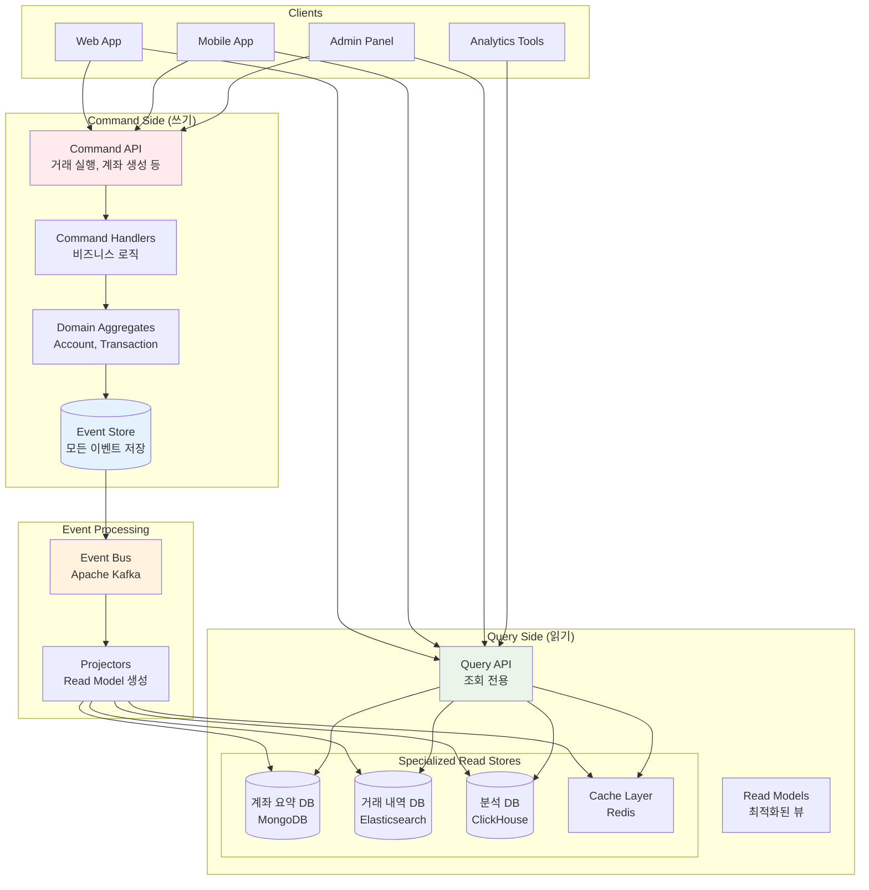

---
tags:
  - CQRS
  - Event Sourcing
  - Architecture
  - DDD
  - Database
  - Guide
---

# 15.3 CQRS와 이벤트 소싱 - 읽기와 쓰기를 분리하면 마법이 일어난다

## 🎯 2022년 8월 - 금융 시스템에서 만난 CQRS의 기적

제가 핀테크 회사의 시스템 아키텍트로 일할 때 겪었던 놀라운 변화의 이야기입니다. 복잡한 금융 거래 시스템에서 성능과 일관성 문제를 동시에 해결하기 위해 CQRS와 Event Sourcing을 도입한 실제 경험을 공유합니다.

### 💥 기존 CRUD 시스템의 한계점

**2022년 8월 10일 - 성능 위기의 날**

```bash
😰 우리가 마주한 심각한 문제들:

📊 시스템 현황:
- 일일 거래 건수: 50만 건
- 계좌 조회 API: 평균 응답시간 2.5초 (너무 느림!)
- 거래 내역 조회: 8초 (타임아웃 빈발)
- 복잡한 JOIN 쿼리: 15개 테이블 조인
- 데이터베이스 CPU 사용률: 95% (위험 수준)

💸 비즈니스 임팩트:
- 고객 불만 급증: 앱 평점 2.1/5.0
- 거래 포기율: 35% (조회 지연으로 인한)
- 고객센터 문의: 일일 2,000건
- 개발팀 야근: 매일 (성능 최적화 시도)

# 기존 전통적인 CRUD 아키텍처
┌─────────────────────────────────────────────────────┐
│                Client Applications                   │
│  ┌─────────────┐ ┌─────────────┐ ┌─────────────┐   │
│  │   Web App   │ │ Mobile App  │ │ Admin Panel │   │
│  └─────────────┘ └─────────────┘ └─────────────┘   │
└─────────────────────────────────────────────────────┘
                         │
                    ┌────▼────┐
                    │API Server│
                    │(하나의 DB)│
                    └────┬────┘
                         │
        ┌────────────────▼────────────────┐
        │      Monolithic Database        │
        │  ┌─────────────────────────────┐ │
        │  │ accounts  │ transactions    │ │
        │  │ users     │ balances       │ │  
        │  │ cards     │ transfers      │ │
        │  │ loans     │ payments       │ │
        │  │ ...       │ ...            │ │
        │  └─────────────────────────────┘ │
        └─────────────────────────────────┘

🚨 근본적 문제들:
- 읽기와 쓰기가 같은 모델 사용
- 복잡한 조회를 위한 과도한 JOIN
- 정규화된 데이터로 인한 조회 성능 저하
- 동시성 문제 (읽기와 쓰기가 서로 블로킹)
- 확장성 한계 (수직 확장만 가능)
```

### 🚀 CQRS + Event Sourcing 도입 - 패러다임의 전환

**시스템 재설계 결과**



### 🎉 3개월 후의 놀라운 결과

**2022년 11월 15일 - 완전히 달라진 시스템**

```bash
✅ 성과 지표:

🚀 성능 향상:
- 계좌 조회 API: 2.5초 → 50ms (50배 향상!)
- 거래 내역 조회: 8초 → 100ms (80배 향상!)
- 동시 처리량: 500 TPS → 5,000 TPS (10배 향상)
- 데이터베이스 CPU: 95% → 30% (여유로운 운영)

📊 비즈니스 임팩트:
- 앱 평점: 2.1/5.0 → 4.6/5.0 (사용자 만족도 대폭 상승)
- 거래 포기율: 35% → 3% (성능 향상으로 인한)
- 고객센터 문의: 2,000건/일 → 200건/일
- 개발팀 야근: 거의 없음 (안정적인 시스템)

🔄 운영 효율성:
- 개발 속도: 독립적인 읽기/쓰기 모델로 병렬 개발 가능
- 확장성: 읽기와 쓰기를 개별적으로 스케일링
- 감사 추적: 모든 거래 이력 완벽 보존
- 복구 능력: 언제든 과거 시점으로 시스템 상태 재구성 가능

# 실제 성능 비교 (계좌 잔액 조회 기준)
기존 CRUD: 
┌─────────┐  2.5초   ┌──────────────┐
│ Client  │ ────────▶ │    API +     │
│         │ ◀──────── │ Complex JOIN │
└─────────┘          └──────────────┘

CQRS:
┌─────────┐   50ms   ┌──────────────┐
│ Client  │ ────────▶ │ Optimized    │
│         │ ◀──────── │ Read Model   │
└─────────┘          └──────────────┘
```

---

## 📚 CQRS (Command Query Responsibility Segregation) 핵심 개념

### 1. 명령(Command)과 조회(Query) 분리

```csharp
// C#으로 구현한 CQRS 패턴

// === COMMAND SIDE (쓰기) ===

// 명령 정의
public abstract class Command
{
    public string CommandId { get; }
    public DateTime Timestamp { get; }
    public string UserId { get; }
    
    protected Command(string userId)
    {
        CommandId = Guid.NewGuid().ToString();
        Timestamp = DateTime.UtcNow;
        UserId = userId;
    }
}

public class CreateAccountCommand : Command
{
    public string AccountId { get; }
    public string AccountType { get; }
    public decimal InitialDeposit { get; }
    public string Currency { get; }
    
    public CreateAccountCommand(
        string userId, 
        string accountId, 
        string accountType, 
        decimal initialDeposit,
        string currency = "USD"
    ) : base(userId)
    {
        AccountId = accountId;
        AccountType = accountType;
        InitialDeposit = initialDeposit;
        Currency = currency;
    }
}

public class TransferMoneyCommand : Command
{
    public string FromAccountId { get; }
    public string ToAccountId { get; }
    public decimal Amount { get; }
    public string Reference { get; }
    
    public TransferMoneyCommand(
        string userId,
        string fromAccountId,
        string toAccountId,
        decimal amount,
        string reference
    ) : base(userId)
    {
        FromAccountId = fromAccountId;
        ToAccountId = toAccountId;
        Amount = amount;
        Reference = reference;
    }
}

// 명령 핸들러
public interface ICommandHandler<TCommand> where TCommand : Command
{
    Task<CommandResult> HandleAsync(TCommand command);
}

public class CreateAccountCommandHandler : ICommandHandler<CreateAccountCommand>
{
    private readonly IAccountRepository _accountRepository;
    private readonly IEventStore _eventStore;
    private readonly ILogger<CreateAccountCommandHandler> _logger;
    
    public CreateAccountCommandHandler(
        IAccountRepository accountRepository,
        IEventStore eventStore,
        ILogger<CreateAccountCommandHandler> logger)
    {
        _accountRepository = accountRepository;
        _eventStore = eventStore;
        _logger = logger;
    }
    
    public async Task<CommandResult> HandleAsync(CreateAccountCommand command)
    {
        try
        {
            // 1. 비즈니스 규칙 검증
            await ValidateBusinessRules(command);
            
            // 2. 도메인 집합체 생성
            var account = Account.Create(
                command.AccountId,
                command.UserId,
                command.AccountType,
                command.InitialDeposit,
                command.Currency
            );
            
            // 3. 집합체 저장 (이벤트들이 저장됨)
            await _accountRepository.SaveAsync(account);
            
            _logger.LogInformation("계좌 생성 완료: {AccountId}", command.AccountId);
            
            return CommandResult.Success(command.CommandId);
        }
        catch (DomainException ex)
        {
            _logger.LogWarning("계좌 생성 실패 - 도메인 규칙 위반: {Error}", ex.Message);
            return CommandResult.Failure(command.CommandId, ex.Message);
        }
        catch (Exception ex)
        {
            _logger.LogError(ex, "계좌 생성 중 예기치 못한 오류");
            return CommandResult.Failure(command.CommandId, "내부 서버 오류");
        }
    }
    
    private async Task ValidateBusinessRules(CreateAccountCommand command)
    {
        // 최소 입금액 검증
        if (command.InitialDeposit < 100)
        {
            throw new DomainException("최소 입금액은 $100입니다");
        }
        
        // 계좌 ID 중복 검증
        var existingAccount = await _accountRepository.GetByIdAsync(command.AccountId);
        if (existingAccount != null)
        {
            throw new DomainException($"계좌 ID {command.AccountId}는 이미 존재합니다");
        }
        
        // 사용자당 계좌 개수 제한
        var userAccountCount = await _accountRepository.CountByUserIdAsync(command.UserId);
        if (userAccountCount >= 5)
        {
            throw new DomainException("사용자당 최대 5개의 계좌만 생성할 수 있습니다");
        }
    }
}

// === QUERY SIDE (읽기) ===

// 쿼리 정의
public abstract class Query<TResult>
{
    public string QueryId { get; }
    public DateTime Timestamp { get; }
    
    protected Query()
    {
        QueryId = Guid.NewGuid().ToString();
        Timestamp = DateTime.UtcNow;
    }
}

public class GetAccountSummaryQuery : Query<AccountSummaryDto>
{
    public string AccountId { get; }
    
    public GetAccountSummaryQuery(string accountId)
    {
        AccountId = accountId;
    }
}

public class GetTransactionHistoryQuery : Query<TransactionHistoryDto>
{
    public string AccountId { get; }
    public DateTime? FromDate { get; }
    public DateTime? ToDate { get; }
    public int PageNumber { get; }
    public int PageSize { get; }
    
    public GetTransactionHistoryQuery(
        string accountId, 
        DateTime? fromDate = null, 
        DateTime? toDate = null,
        int pageNumber = 1,
        int pageSize = 20)
    {
        AccountId = accountId;
        FromDate = fromDate ?? DateTime.UtcNow.AddDays(-30);
        ToDate = toDate ?? DateTime.UtcNow;
        PageNumber = pageNumber;
        PageSize = pageSize;
    }
}

// 읽기 모델 (Read Model)
public class AccountSummaryDto
{
    public string AccountId { get; set; }
    public string AccountType { get; set; }
    public decimal CurrentBalance { get; set; }
    public decimal AvailableBalance { get; set; }
    public string Currency { get; set; }
    public DateTime LastTransactionDate { get; set; }
    public int TransactionCount30Days { get; set; }
    public List<string> RecentTransactionIds { get; set; }
}

public class TransactionHistoryDto
{
    public List<TransactionDto> Transactions { get; set; }
    public int TotalCount { get; set; }
    public int PageNumber { get; set; }
    public int PageSize { get; set; }
    public bool HasNextPage { get; set; }
}

public class TransactionDto
{
    public string TransactionId { get; set; }
    public string Type { get; set; } // "CREDIT", "DEBIT", "TRANSFER"
    public decimal Amount { get; set; }
    public string Currency { get; set; }
    public DateTime Timestamp { get; set; }
    public string Description { get; set; }
    public decimal BalanceAfter { get; set; }
    public string CounterpartyAccount { get; set; }
    public string Reference { get; set; }
}

// 쿼리 핸들러
public interface IQueryHandler<TQuery, TResult> where TQuery : Query<TResult>
{
    Task<TResult> HandleAsync(TQuery query);
}

public class GetAccountSummaryQueryHandler : IQueryHandler<GetAccountSummaryQuery, AccountSummaryDto>
{
    private readonly IAccountSummaryRepository _summaryRepository;
    private readonly IMemoryCache _cache;
    private readonly ILogger<GetAccountSummaryQueryHandler> _logger;
    
    public GetAccountSummaryQueryHandler(
        IAccountSummaryRepository summaryRepository,
        IMemoryCache cache,
        ILogger<GetAccountSummaryQueryHandler> logger)
    {
        _summaryRepository = summaryRepository;
        _cache = cache;
        _logger = logger;
    }
    
    public async Task<AccountSummaryDto> HandleAsync(GetAccountSummaryQuery query)
    {
        // 캐시에서 먼저 조회
        var cacheKey = $"account_summary_{query.AccountId}";
        
        if (_cache.TryGetValue(cacheKey, out AccountSummaryDto cachedSummary))
        {
            _logger.LogDebug("계좌 요약 캐시 적중: {AccountId}", query.AccountId);
            return cachedSummary;
        }
        
        // 캐시 미스 시 데이터베이스에서 조회
        var summary = await _summaryRepository.GetByAccountIdAsync(query.AccountId);
        
        if (summary == null)
        {
            throw new NotFoundException($"계좌 {query.AccountId}를 찾을 수 없습니다");
        }
        
        // 캐시에 저장 (5분간 유지)
        var cacheOptions = new MemoryCacheEntryOptions
        {
            AbsoluteExpirationRelativeToNow = TimeSpan.FromMinutes(5),
            SlidingExpiration = TimeSpan.FromMinutes(1)
        };
        
        _cache.Set(cacheKey, summary, cacheOptions);
        
        _logger.LogDebug("계좌 요약 조회 완료: {AccountId}", query.AccountId);
        return summary;
    }
}

// CQRS 중재자 (Mediator)
public interface ICommandBus
{
    Task<CommandResult> SendAsync<TCommand>(TCommand command) where TCommand : Command;
}

public interface IQueryBus
{
    Task<TResult> SendAsync<TResult>(Query<TResult> query);
}

public class InMemoryCommandBus : ICommandBus
{
    private readonly IServiceProvider _serviceProvider;
    
    public InMemoryCommandBus(IServiceProvider serviceProvider)
    {
        _serviceProvider = serviceProvider;
    }
    
    public async Task<CommandResult> SendAsync<TCommand>(TCommand command) where TCommand : Command
    {
        var handler = _serviceProvider.GetRequiredService<ICommandHandler<TCommand>>();
        return await handler.HandleAsync(command);
    }
}

public class InMemoryQueryBus : IQueryBus
{
    private readonly IServiceProvider _serviceProvider;
    
    public InMemoryQueryBus(IServiceProvider serviceProvider)
    {
        _serviceProvider = serviceProvider;
    }
    
    public async Task<TResult> SendAsync<TResult>(Query<TResult> query)
    {
        var handlerType = typeof(IQueryHandler<,>).MakeGenericType(query.GetType(), typeof(TResult));
        var handler = _serviceProvider.GetRequiredService(handlerType);
        
        var method = handlerType.GetMethod("HandleAsync");
        var task = (Task<TResult>)method.Invoke(handler, new object[] { query });
        
        return await task;
    }
}
```

---

## 📝 Event Sourcing 심화 구현

### 1. 도메인 집합체와 이벤트 소싱

```csharp
// 이벤트 정의
public abstract class DomainEvent
{
    public string EventId { get; }
    public DateTime Timestamp { get; }
    public string AggregateId { get; protected set; }
    public int Version { get; set; }
    
    protected DomainEvent()
    {
        EventId = Guid.NewGuid().ToString();
        Timestamp = DateTime.UtcNow;
    }
}

public class AccountCreatedEvent : DomainEvent
{
    public string UserId { get; }
    public string AccountType { get; }
    public decimal InitialDeposit { get; }
    public string Currency { get; }
    
    public AccountCreatedEvent(
        string aggregateId,
        string userId,
        string accountType,
        decimal initialDeposit,
        string currency)
    {
        AggregateId = aggregateId;
        UserId = userId;
        AccountType = accountType;
        InitialDeposit = initialDeposit;
        Currency = currency;
    }
}

public class MoneyDepositedEvent : DomainEvent
{
    public decimal Amount { get; }
    public decimal BalanceAfter { get; }
    public string Reference { get; }
    
    public MoneyDepositedEvent(
        string aggregateId,
        decimal amount,
        decimal balanceAfter,
        string reference)
    {
        AggregateId = aggregateId;
        Amount = amount;
        BalanceAfter = balanceAfter;
        Reference = reference;
    }
}

public class MoneyWithdrawnEvent : DomainEvent
{
    public decimal Amount { get; }
    public decimal BalanceAfter { get; }
    public string Reference { get; }
    public decimal Fee { get; }
    
    public MoneyWithdrawnEvent(
        string aggregateId,
        decimal amount,
        decimal balanceAfter,
        string reference,
        decimal fee = 0)
    {
        AggregateId = aggregateId;
        Amount = amount;
        BalanceAfter = balanceAfter;
        Reference = reference;
        Fee = fee;
    }
}

public class MoneyTransferredEvent : DomainEvent
{
    public string ToAccountId { get; }
    public decimal Amount { get; }
    public decimal BalanceAfter { get; }
    public string Reference { get; }
    public decimal TransferFee { get; }
    
    public MoneyTransferredEvent(
        string aggregateId,
        string toAccountId,
        decimal amount,
        decimal balanceAfter,
        string reference,
        decimal transferFee)
    {
        AggregateId = aggregateId;
        ToAccountId = toAccountId;
        Amount = amount;
        BalanceAfter = balanceAfter;
        Reference = reference;
        TransferFee = transferFee;
    }
}

// 집합체 루트 기반 클래스
public abstract class AggregateRoot
{
    private readonly List<DomainEvent> _uncommittedEvents = new();
    
    public string Id { get; protected set; }
    public int Version { get; private set; }
    
    protected void ApplyEvent(DomainEvent @event)
    {
        // 이벤트를 집합체에 적용
        ApplyEventToState(@event);
        
        // 버전 증가
        Version++;
        @event.Version = Version;
        
        // 커밋되지 않은 이벤트 목록에 추가
        _uncommittedEvents.Add(@event);
    }
    
    protected abstract void ApplyEventToState(DomainEvent @event);
    
    public IEnumerable<DomainEvent> GetUncommittedEvents()
    {
        return _uncommittedEvents.AsReadOnly();
    }
    
    public void ClearUncommittedEvents()
    {
        _uncommittedEvents.Clear();
    }
    
    public void LoadFromHistory(IEnumerable<DomainEvent> events)
    {
        foreach (var @event in events.OrderBy(e => e.Version))
        {
            ApplyEventToState(@event);
            Version = @event.Version;
        }
    }
}

// 계좌 도메인 집합체
public class Account : AggregateRoot
{
    public string UserId { get; private set; }
    public string AccountType { get; private set; }
    public decimal Balance { get; private set; }
    public string Currency { get; private set; }
    public bool IsActive { get; private set; }
    public DateTime CreatedAt { get; private set; }
    public DateTime LastTransactionAt { get; private set; }
    
    private Account() { } // EF Core를 위한 빈 생성자
    
    public static Account Create(
        string accountId, 
        string userId, 
        string accountType, 
        decimal initialDeposit,
        string currency)
    {
        // 비즈니스 규칙 검증
        if (initialDeposit < 0)
            throw new DomainException("초기 입금액은 0 이상이어야 합니다");
        
        if (string.IsNullOrEmpty(userId))
            throw new DomainException("사용자 ID는 필수입니다");
        
        if (!IsValidAccountType(accountType))
            throw new DomainException($"유효하지 않은 계좌 타입: {accountType}");
        
        var account = new Account();
        
        // 계좌 생성 이벤트 발생
        account.ApplyEvent(new AccountCreatedEvent(
            accountId, userId, accountType, initialDeposit, currency));
        
        return account;
    }
    
    public void Deposit(decimal amount, string reference)
    {
        if (amount <= 0)
            throw new DomainException("입금액은 0보다 커야 합니다");
        
        if (!IsActive)
            throw new DomainException("비활성 계좌에는 입금할 수 없습니다");
        
        var newBalance = Balance + amount;
        
        ApplyEvent(new MoneyDepositedEvent(Id, amount, newBalance, reference));
    }
    
    public void Withdraw(decimal amount, string reference)
    {
        if (amount <= 0)
            throw new DomainException("출금액은 0보다 커야 합니다");
        
        if (!IsActive)
            throw new DomainException("비활성 계좌에서는 출금할 수 없습니다");
        
        var fee = CalculateWithdrawalFee(amount);
        var totalAmount = amount + fee;
        
        if (Balance < totalAmount)
            throw new DomainException("잔액이 부족합니다");
        
        var newBalance = Balance - totalAmount;
        
        ApplyEvent(new MoneyWithdrawnEvent(Id, amount, newBalance, reference, fee));
    }
    
    public void TransferTo(string toAccountId, decimal amount, string reference)
    {
        if (amount <= 0)
            throw new DomainException("이체금액은 0보다 커야 합니다");
        
        if (!IsActive)
            throw new DomainException("비활성 계좌에서는 이체할 수 없습니다");
        
        if (Id == toAccountId)
            throw new DomainException("자기 자신에게는 이체할 수 없습니다");
        
        var transferFee = CalculateTransferFee(amount);
        var totalAmount = amount + transferFee;
        
        if (Balance < totalAmount)
            throw new DomainException("잔액이 부족합니다");
        
        var newBalance = Balance - totalAmount;
        
        ApplyEvent(new MoneyTransferredEvent(
            Id, toAccountId, amount, newBalance, reference, transferFee));
    }
    
    protected override void ApplyEventToState(DomainEvent @event)
    {
        switch (@event)
        {
            case AccountCreatedEvent e:
                Id = e.AggregateId;
                UserId = e.UserId;
                AccountType = e.AccountType;
                Balance = e.InitialDeposit;
                Currency = e.Currency;
                IsActive = true;
                CreatedAt = e.Timestamp;
                LastTransactionAt = e.Timestamp;
                break;
                
            case MoneyDepositedEvent e:
                Balance = e.BalanceAfter;
                LastTransactionAt = e.Timestamp;
                break;
                
            case MoneyWithdrawnEvent e:
                Balance = e.BalanceAfter;
                LastTransactionAt = e.Timestamp;
                break;
                
            case MoneyTransferredEvent e:
                Balance = e.BalanceAfter;
                LastTransactionAt = e.Timestamp;
                break;
        }
    }
    
    private static bool IsValidAccountType(string accountType)
    {
        var validTypes = new[] { "CHECKING", "SAVINGS", "BUSINESS", "INVESTMENT" };
        return validTypes.Contains(accountType.ToUpper());
    }
    
    private decimal CalculateWithdrawalFee(decimal amount)
    {
        // 출금 수수료 계산 로직
        return AccountType == "SAVINGS" && amount > 1000 ? 5.00m : 0.00m;
    }
    
    private decimal CalculateTransferFee(decimal amount)
    {
        // 이체 수수료 계산 로직
        return amount > 10000 ? 10.00m : 2.00m;
    }
}

// 이벤트 스토어 구현
public class EventStoreRepository : IAccountRepository
{
    private readonly IEventStore _eventStore;
    private readonly IEventPublisher _eventPublisher;
    private readonly ILogger<EventStoreRepository> _logger;
    
    public EventStoreRepository(
        IEventStore eventStore,
        IEventPublisher eventPublisher,
        ILogger<EventStoreRepository> logger)
    {
        _eventStore = eventStore;
        _eventPublisher = eventPublisher;
        _logger = logger;
    }
    
    public async Task<Account> GetByIdAsync(string accountId)
    {
        var streamName = GetStreamName(accountId);
        var events = await _eventStore.ReadStreamAsync(streamName);
        
        if (!events.Any())
        {
            return null;
        }
        
        var account = new Account();
        account.LoadFromHistory(events);
        
        _logger.LogDebug("계좌 로드 완료: {AccountId}, 이벤트 수: {EventCount}", 
            accountId, events.Count());
        
        return account;
    }
    
    public async Task SaveAsync(Account account)
    {
        var streamName = GetStreamName(account.Id);
        var expectedVersion = account.Version - account.GetUncommittedEvents().Count();
        var uncommittedEvents = account.GetUncommittedEvents().ToList();
        
        if (!uncommittedEvents.Any())
        {
            return;
        }
        
        try
        {
            // 이벤트 스토어에 저장
            await _eventStore.AppendToStreamAsync(
                streamName, 
                expectedVersion, 
                uncommittedEvents);
            
            // 이벤트 발행 (프로젝션 업데이트용)
            foreach (var @event in uncommittedEvents)
            {
                await _eventPublisher.PublishAsync(@event);
            }
            
            // 커밋되지 않은 이벤트 클리어
            account.ClearUncommittedEvents();
            
            _logger.LogInformation("계좌 저장 완료: {AccountId}, 이벤트 수: {EventCount}",
                account.Id, uncommittedEvents.Count);
        }
        catch (ConcurrencyException ex)
        {
            _logger.LogWarning("동시성 충돌: {AccountId}, 예상 버전: {ExpectedVersion}",
                account.Id, expectedVersion);
            throw new DomainException("다른 사용자가 동시에 같은 계좌를 수정했습니다. 다시 시도해주세요.");
        }
    }
    
    private string GetStreamName(string accountId)
    {
        return $"account-{accountId}";
    }
}
```

---

## 🔄 프로젝션 (Projection) 구현

### 읽기 모델 생성과 업데이트

```python
# Python으로 구현한 프로젝션 시스템
import asyncio
import json
from dataclasses import dataclass
from datetime import datetime, timedelta
from typing import Dict, List, Optional, Any
from abc import ABC, abstractmethod
import asyncpg
import aioredis
from elasticsearch import AsyncElasticsearch

@dataclass
class DomainEvent:
    event_id: str
    event_type: str
    aggregate_id: str
    version: int
    timestamp: datetime
    data: Dict[str, Any]

class EventProjector(ABC):
    """이벤트 프로젝터 기본 클래스"""
    
    @abstractmethod
    async def project_event(self, event: DomainEvent) -> None:
        """이벤트를 프로젝션에 적용"""
        pass
    
    @abstractmethod
    def can_handle(self, event_type: str) -> bool:
        """해당 이벤트 타입을 처리할 수 있는지 확인"""
        pass

class AccountSummaryProjector(EventProjector):
    """계좌 요약 정보 프로젝션"""
    
    def __init__(self, mongo_client, redis_client):
        self.mongo = mongo_client
        self.redis = redis_client
        self.db = self.mongo.get_database("read_models")
        self.collection = self.db.get_collection("account_summaries")
    
    def can_handle(self, event_type: str) -> bool:
        return event_type in [
            "AccountCreated",
            "MoneyDeposited", 
            "MoneyWithdrawn",
            "MoneyTransferred"
        ]
    
    async def project_event(self, event: DomainEvent) -> None:
        handler_map = {
            "AccountCreated": self._handle_account_created,
            "MoneyDeposited": self._handle_money_deposited,
            "MoneyWithdrawn": self._handle_money_withdrawn,
            "MoneyTransferred": self._handle_money_transferred
        }
        
        handler = handler_map.get(event.event_type)
        if handler:
            await handler(event)
            # 캐시 무효화
            await self._invalidate_cache(event.aggregate_id)
    
    async def _handle_account_created(self, event: DomainEvent) -> None:
        account_summary = {
            "_id": event.aggregate_id,
            "account_id": event.aggregate_id,
            "user_id": event.data["user_id"],
            "account_type": event.data["account_type"],
            "currency": event.data["currency"],
            "current_balance": event.data["initial_deposit"],
            "available_balance": event.data["initial_deposit"],
            "created_at": event.timestamp,
            "last_transaction_at": event.timestamp,
            "transaction_count_30days": 1,
            "total_deposits": event.data["initial_deposit"],
            "total_withdrawals": 0.0,
            "total_transfers_out": 0.0,
            "total_transfers_in": 0.0,
            "is_active": True,
            "last_updated": event.timestamp
        }
        
        await self.collection.insert_one(account_summary)
        print(f"✅ 계좌 요약 생성: {event.aggregate_id}")
    
    async def _handle_money_deposited(self, event: DomainEvent) -> None:
        account_id = event.aggregate_id
        amount = event.data["amount"]
        new_balance = event.data["balance_after"]
        
        # 30일 간의 거래 수 계산
        thirty_days_ago = event.timestamp - timedelta(days=30)
        
        update_data = {
            "$set": {
                "current_balance": new_balance,
                "available_balance": new_balance,
                "last_transaction_at": event.timestamp,
                "last_updated": event.timestamp
            },
            "$inc": {
                "total_deposits": amount,
                "transaction_count_30days": 1
            }
        }
        
        await self.collection.update_one(
            {"_id": account_id},
            update_data
        )
        
        print(f"💰 입금 프로젝션 업데이트: {account_id}, 금액: ${amount}")
    
    async def _handle_money_withdrawn(self, event: DomainEvent) -> None:
        account_id = event.aggregate_id
        amount = event.data["amount"]
        fee = event.data.get("fee", 0)
        new_balance = event.data["balance_after"]
        
        update_data = {
            "$set": {
                "current_balance": new_balance,
                "available_balance": new_balance,
                "last_transaction_at": event.timestamp,
                "last_updated": event.timestamp
            },
            "$inc": {
                "total_withdrawals": amount + fee,
                "transaction_count_30days": 1
            }
        }
        
        await self.collection.update_one(
            {"_id": account_id},
            update_data
        )
        
        print(f"💸 출금 프로젝션 업데이트: {account_id}, 금액: ${amount}")
    
    async def _handle_money_transferred(self, event: DomainEvent) -> None:
        from_account_id = event.aggregate_id
        to_account_id = event.data["to_account_id"]
        amount = event.data["amount"]
        fee = event.data.get("transfer_fee", 0)
        new_balance = event.data["balance_after"]
        
        # 송금 계좌 업데이트
        update_from = {
            "$set": {
                "current_balance": new_balance,
                "available_balance": new_balance,
                "last_transaction_at": event.timestamp,
                "last_updated": event.timestamp
            },
            "$inc": {
                "total_transfers_out": amount + fee,
                "transaction_count_30days": 1
            }
        }
        
        await self.collection.update_one(
            {"_id": from_account_id},
            update_from
        )
        
        # 수신 계좌도 업데이트 (별도 이벤트가 있겠지만 여기서도 처리)
        # 실제로는 수신 계좌에 MoneyReceivedEvent가 따로 발생해야 함
        
        print(f"🔄 이체 프로젝션 업데이트: {from_account_id} → {to_account_id}, 금액: ${amount}")
    
    async def _invalidate_cache(self, account_id: str) -> None:
        """계좌 관련 캐시 무효화"""
        cache_keys = [
            f"account_summary:{account_id}",
            f"account_balance:{account_id}",
            f"account_transactions:{account_id}:*"
        ]
        
        for key in cache_keys:
            if "*" in key:
                # 패턴 매칭으로 여러 키 삭제
                keys_to_delete = await self.redis.keys(key)
                if keys_to_delete:
                    await self.redis.delete(*keys_to_delete)
            else:
                await self.redis.delete(key)

class TransactionHistoryProjector(EventProjector):
    """거래 내역 프로젝션 (Elasticsearch)"""
    
    def __init__(self, elasticsearch_client: AsyncElasticsearch):
        self.es = elasticsearch_client
        self.index_name = "transaction_history"
    
    def can_handle(self, event_type: str) -> bool:
        return event_type in [
            "MoneyDeposited",
            "MoneyWithdrawn", 
            "MoneyTransferred",
            "MoneyReceived"  # 이체 수신
        ]
    
    async def project_event(self, event: DomainEvent) -> None:
        transaction_doc = await self._create_transaction_document(event)
        
        # Elasticsearch에 인덱싱
        await self.es.index(
            index=self.index_name,
            id=f"{event.event_id}",
            body=transaction_doc
        )
        
        print(f"📋 거래 내역 인덱싱: {event.event_type} - {event.aggregate_id}")
    
    async def _create_transaction_document(self, event: DomainEvent) -> Dict[str, Any]:
        """이벤트를 거래 내역 문서로 변환"""
        base_doc = {
            "transaction_id": event.event_id,
            "account_id": event.aggregate_id,
            "timestamp": event.timestamp.isoformat(),
            "event_type": event.event_type,
            "version": event.version
        }
        
        if event.event_type == "MoneyDeposited":
            return {
                **base_doc,
                "type": "CREDIT",
                "amount": event.data["amount"],
                "balance_after": event.data["balance_after"],
                "description": f"Deposit - {event.data.get('reference', 'N/A')}",
                "reference": event.data.get("reference"),
                "counterparty": None,
                "fee": 0.0
            }
        
        elif event.event_type == "MoneyWithdrawn":
            return {
                **base_doc,
                "type": "DEBIT",
                "amount": event.data["amount"],
                "balance_after": event.data["balance_after"],
                "description": f"Withdrawal - {event.data.get('reference', 'N/A')}",
                "reference": event.data.get("reference"),
                "counterparty": None,
                "fee": event.data.get("fee", 0.0)
            }
        
        elif event.event_type == "MoneyTransferred":
            return {
                **base_doc,
                "type": "TRANSFER_OUT",
                "amount": event.data["amount"],
                "balance_after": event.data["balance_after"],
                "description": f"Transfer to {event.data['to_account_id']}",
                "reference": event.data.get("reference"),
                "counterparty": event.data["to_account_id"],
                "fee": event.data.get("transfer_fee", 0.0)
            }
        
        elif event.event_type == "MoneyReceived":
            return {
                **base_doc,
                "type": "TRANSFER_IN",
                "amount": event.data["amount"],
                "balance_after": event.data["balance_after"],
                "description": f"Transfer from {event.data['from_account_id']}",
                "reference": event.data.get("reference"),
                "counterparty": event.data["from_account_id"],
                "fee": 0.0
            }

class AnalyticsProjector(EventProjector):
    """실시간 분석용 프로젝션 (ClickHouse)"""
    
    def __init__(self, clickhouse_client):
        self.ch = clickhouse_client
    
    def can_handle(self, event_type: str) -> bool:
        return True  # 모든 이벤트를 분석 목적으로 저장
    
    async def project_event(self, event: DomainEvent) -> None:
        # ClickHouse에 이벤트 저장 (분석용)
        query = """
        INSERT INTO events_analytics 
        (event_id, event_type, aggregate_id, user_id, timestamp, amount, event_data)
        VALUES
        """
        
        values = {
            "event_id": event.event_id,
            "event_type": event.event_type,
            "aggregate_id": event.aggregate_id,
            "user_id": event.data.get("user_id", ""),
            "timestamp": event.timestamp,
            "amount": self._extract_amount(event),
            "event_data": json.dumps(event.data)
        }
        
        await self.ch.execute(query, [values])
        print(f"📊 분석 데이터 저장: {event.event_type}")
    
    def _extract_amount(self, event: DomainEvent) -> float:
        """이벤트에서 금액 추출"""
        if "amount" in event.data:
            return float(event.data["amount"])
        elif "initial_deposit" in event.data:
            return float(event.data["initial_deposit"])
        return 0.0

# 프로젝션 관리자
class ProjectionManager:
    def __init__(self):
        self.projectors: List[EventProjector] = []
    
    def register_projector(self, projector: EventProjector) -> None:
        self.projectors.append(projector)
        print(f"✅ 프로젝터 등록: {projector.__class__.__name__}")
    
    async def project_event(self, event: DomainEvent) -> None:
        """이벤트를 모든 관련 프로젝터에 전달"""
        tasks = []
        
        for projector in self.projectors:
            if projector.can_handle(event.event_type):
                tasks.append(projector.project_event(event))
        
        if tasks:
            # 병렬로 모든 프로젝션 실행
            await asyncio.gather(*tasks, return_exceptions=True)
            print(f"🔄 프로젝션 완료: {event.event_type} → {len(tasks)}개 프로젝터")
    
    async def rebuild_projections(self, from_event_number: int = 0) -> None:
        """전체 프로젝션 재구성"""
        print("🔄 프로젝션 재구성 시작...")
        
        # 이벤트 스토어에서 모든 이벤트 읽기
        events = await self._read_all_events(from_event_number)
        
        total_events = len(events)
        processed = 0
        
        for event in events:
            await self.project_event(event)
            processed += 1
            
            if processed % 1000 == 0:
                print(f"진행 상황: {processed}/{total_events} ({processed/total_events*100:.1f}%)")
        
        print(f"✅ 프로젝션 재구성 완료: {total_events}개 이벤트 처리")
    
    async def _read_all_events(self, from_event_number: int) -> List[DomainEvent]:
        # 실제로는 이벤트 스토어에서 모든 이벤트 읽기
        # 여기서는 예제를 위해 빈 리스트 반환
        return []

# 사용 예제
async def setup_projections():
    # 데이터베이스 클라이언트 초기화
    mongo_client = motor.motor_asyncio.AsyncIOMotorClient("mongodb://localhost:27017")
    redis_client = aioredis.from_url("redis://localhost:6379")
    es_client = AsyncElasticsearch([{"host": "localhost", "port": 9200}])
    
    # 프로젝션 관리자 초기화
    projection_manager = ProjectionManager()
    
    # 프로젝터들 등록
    projection_manager.register_projector(
        AccountSummaryProjector(mongo_client, redis_client)
    )
    projection_manager.register_projector(
        TransactionHistoryProjector(es_client)
    )
    projection_manager.register_projector(
        AnalyticsProjector(clickhouse_client)
    )
    
    return projection_manager

# 실시간 이벤트 처리
async def handle_real_time_events(projection_manager: ProjectionManager):
    # Kafka 또는 다른 이벤트 스트림에서 이벤트 수신
    while True:
        try:
            # 이벤트 수신 (실제로는 Kafka Consumer 등 사용)
            event = await receive_event_from_stream()
            
            if event:
                await projection_manager.project_event(event)
        
        except Exception as e:
            print(f"❌ 이벤트 처리 오류: {e}")
            # 에러 핸들링, 재시도 로직 등
            await asyncio.sleep(1)
```

---

## 🎯 CQRS + Event Sourcing 성공 요인

### ✅ 핵심 성공 요인들

```bash
1. 적절한 적용 범위
   ✅ 복잡한 비즈니스 로직이 있는 도메인
   ✅ 높은 읽기/쓰기 비율 차이
   ✅ 다양한 조회 요구사항
   ✅ 감사 추적이 중요한 도메인

2. 이벤트 설계
   ✅ 비즈니스 의미 있는 이벤트
   ✅ 불변성 보장
   ✅ 적절한 이벤트 크기
   ✅ 스키마 진화 전략

3. 프로젝션 관리
   ✅ 실시간 프로젝션 업데이트
   ✅ 프로젝션 재구성 능력
   ✅ 여러 저장소 최적화
   ✅ 장애 복구 메커니즘

4. 성능 최적화
   ✅ 스냅샷 구현
   ✅ 캐싱 전략
   ✅ 비동기 프로젝션
   ✅ 배치 처리 최적화
```

### ❌ 주의해야 할 함정들

```bash
1. 과도한 적용
   ❌ 모든 도메인에 CQRS 적용
   ❌ 단순한 CRUD에 Event Sourcing
   ❌ 불필요한 복잡성 증가
   ❌ 팀 스킬 부족 상황에서 도입

2. 이벤트 설계 실수
   ❌ 기술적 이벤트 (DB 변경 등)
   ❌ 너무 큰 이벤트
   ❌ 이벤트 간 강한 결합
   ❌ 버전 관리 소홀

3. 프로젝션 관리 실패
   ❌ 실시간 업데이트 지연
   ❌ 프로젝션 불일치
   ❌ 재구성 메커니즘 부재
   ❌ 장애 복구 계획 없음

4. 운영상 문제
   ❌ 모니터링 부족
   ❌ 디버깅 어려움
   ❌ 데이터 마이그레이션 복잡
   ❌ 트랜잭션 복잡성 과소평가
```

---

## 🚀 다음 단계

CQRS와 Event Sourcing의 강력함을 체험했으니, 이제 분산 시스템에서 복잡한 비즈니스 트랜잭션을 처리하는 방법을 배워보겠습니다.

[15.4 Saga 패턴](04-saga-pattern.md)에서는 마이크로서비스 환경에서 분산 트랜잭션을 안전하고 효율적으로 관리하는 Saga 패턴을 심도 있게 다뤄보겠습니다.

"상태를 저장하지 말고, 변화를 저장하라" - Event Sourcing의 핵심 철학입니다.

과거의 모든 변화를 기록함으로써 현재를 완벽히 재구성하고, 미래를 예측할 수 있는 시스템을 만들어봅시다! 📝⚡
