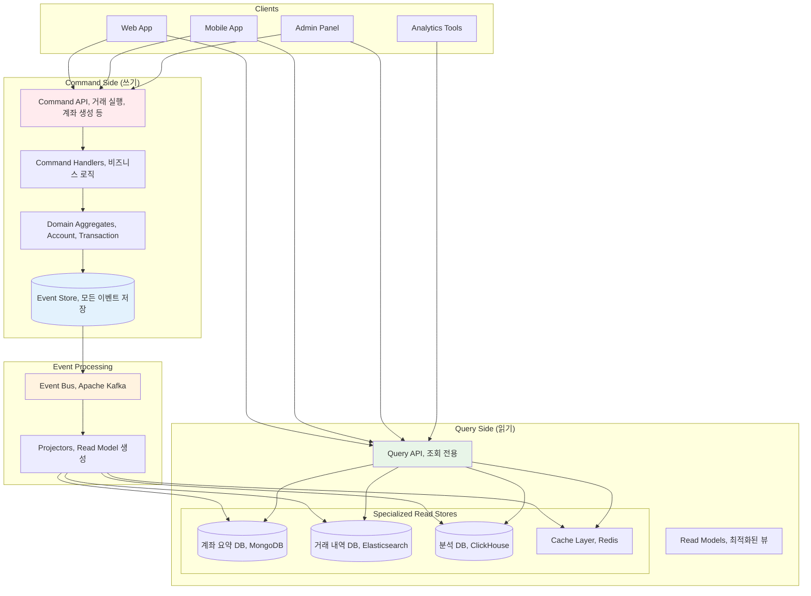

---
tags:
  - CQRS
  - Event Sourcing
  - Architecture
  - Performance
  - Guide
---

# 16.3a CQRS 기초와 실전 경험

## 🎯 2022년 8월 - 금융 시스템에서 만난 CQRS의 기적

제가 핀테크 회사의 시스템 아키텍트로 일할 때 겪었던 놀라운 변화의 이야기입니다. 복잡한 금융 거래 시스템에서 성능과 일관성 문제를 동시에 해결하기 위해 CQRS와 Event Sourcing을 도입한 실제 경험을 공유합니다.

### 💥 기존 CRUD 시스템의 한계점

**2022년 8월 10일 - 성능 위기의 날**

```bash
😰 우리가 마주한 심각한 문제들:

📊 시스템 현황:
- 일일 거래 건수: 50만 건
- 계좌 조회 API: 평균 응답시간 2.5초 (너무 느림!)
- 거래 내역 조회: 8초 (타임아웃 빈발)
- 복잡한 JOIN 쿼리: 15개 테이블 조인
- 데이터베이스 CPU 사용률: 95% (위험 수준)

💸 비즈니스 임팩트:
- 고객 불만 급증: 앱 평점 2.1/5.0
- 거래 포기율: 35% (조회 지연으로 인한)
- 고객센터 문의: 일일 2,000건
- 개발팀 야근: 매일 (성능 최적화 시도)

# 기존 전통적인 CRUD 아키텍처
┌─────────────────────────────────────────────────────┐
│                Client Applications                   │
│  ┌─────────────┐ ┌─────────────┐ ┌─────────────┐   │
│  │   Web App   │ │ Mobile App  │ │ Admin Panel │   │
│  └─────────────┘ └─────────────┘ └─────────────┘   │
└─────────────────────────────────────────────────────┘
                         │
                    ┌────▼────┐
                    │API Server│
                    │(하나의 DB)│
                    └────┬────┘
                         │
        ┌────────────────▼────────────────┐
        │      Monolithic Database        │
        │  ┌─────────────────────────────┐ │
        │  │ accounts  │ transactions    │ │
        │  │ users     │ balances       │ │  
        │  │ cards     │ transfers      │ │
        │  │ loans     │ payments       │ │
        │  │ ...       │ ...            │ │
        │  └─────────────────────────────┘ │
        └─────────────────────────────────┘

🚨 근본적 문제들:
- 읽기와 쓰기가 같은 모델 사용
- 복잡한 조회를 위한 과도한 JOIN
- 정규화된 데이터로 인한 조회 성능 저하
- 동시성 문제 (읽기와 쓰기가 서로 블로킹)
- 확장성 한계 (수직 확장만 가능)
```

### 🚀 CQRS + Event Sourcing 도입 - 패러다임의 전환

**시스템 재설계 결과**



### 🎉 3개월 후의 놀라운 결과

**2022년 11월 15일 - 완전히 달라진 시스템**

```bash
✅ 성과 지표:

🚀 성능 향상:
- 계좌 조회 API: 2.5초 → 50ms (50배 향상!)
- 거래 내역 조회: 8초 → 100ms (80배 향상!)
- 동시 처리량: 500 TPS → 5,000 TPS (10배 향상)
- 데이터베이스 CPU: 95% → 30% (여유로운 운영)

📊 비즈니스 임팩트:
- 앱 평점: 2.1/5.0 → 4.6/5.0 (사용자 만족도 대폭 상승)
- 거래 포기율: 35% → 3% (성능 향상으로 인한)
- 고객센터 문의: 2,000건/일 → 200건/일
- 개발팀 야근: 거의 없음 (안정적인 시스템)

🔄 운영 효율성:
- 개발 속도: 독립적인 읽기/쓰기 모델로 병렬 개발 가능
- 확장성: 읽기와 쓰기를 개별적으로 스케일링
- 감사 추적: 모든 거래 이력 완벽 보존
- 복구 능력: 언제든 과거 시점으로 시스템 상태 재구성 가능

# 실제 성능 비교 (계좌 잔액 조회 기준)
기존 CRUD: 
┌─────────┐  2.5초   ┌──────────────┐
│ Client  │ ────────▶ │    API +     │
│         │ ◀──────── │ Complex JOIN │
└─────────┘          └──────────────┘

CQRS:
┌─────────┐   50ms   ┌──────────────┐
│ Client  │ ────────▶ │ Optimized    │
│         │ ◀──────── │ Read Model   │
└─────────┘          └──────────────┘
```

## 핵심 요점

### 1. CQRS의 핵심 가치

CQRS는 단순히 성능 향상 기법이 아닙니다. 읽기와 쓰기의 본질적 차이를 인정하고, 각각을 최적화하는 아키텍처 철학입니다.

### 2. 실제 비즈니스 임팩트

기술적 개선이 직접적인 비즈니스 성과로 연결되는 대표적인 사례입니다. 사용자 경험 개선이 곧 매출 증대로 이어졌습니다.

### 3. 점진적 도입 가능

전체 시스템을 한번에 바꿀 필요 없이, 성능이 중요한 특정 도메인부터 점진적으로 적용할 수 있습니다.

---

**이전**: [16.3 CQRS와 이벤트 소싱 개요](03-cqrs-event-sourcing.md)  
**다음**: [16.3b CQRS 패턴 구현](03b-cqrs-pattern-implementation.md)에서 Command와 Query 분리 구현을 학습합니다.
