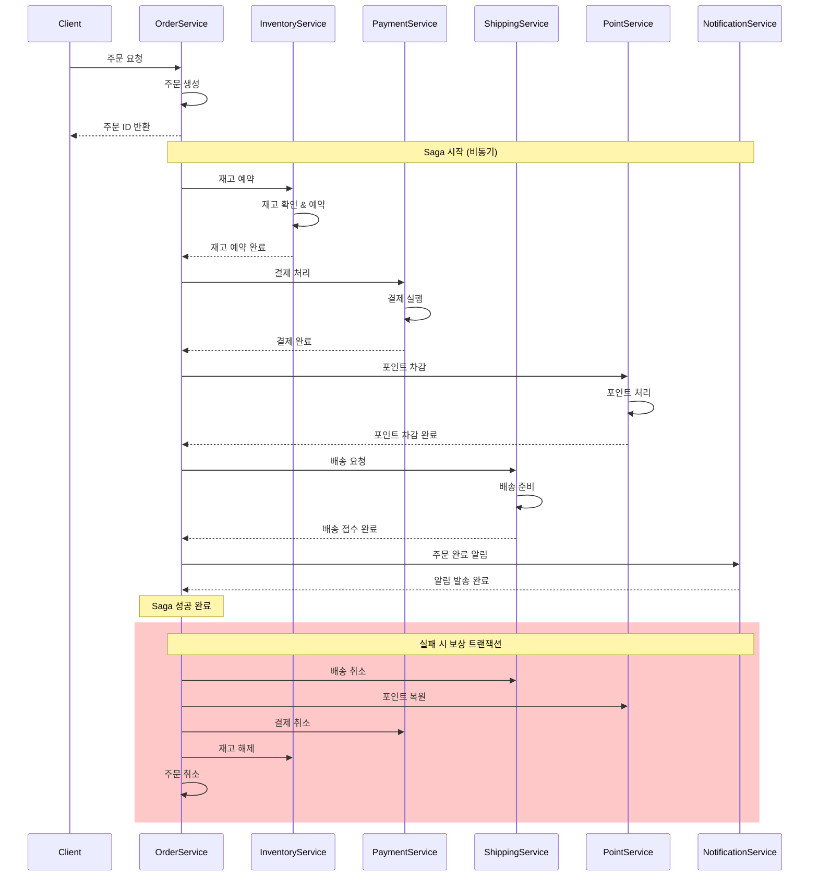
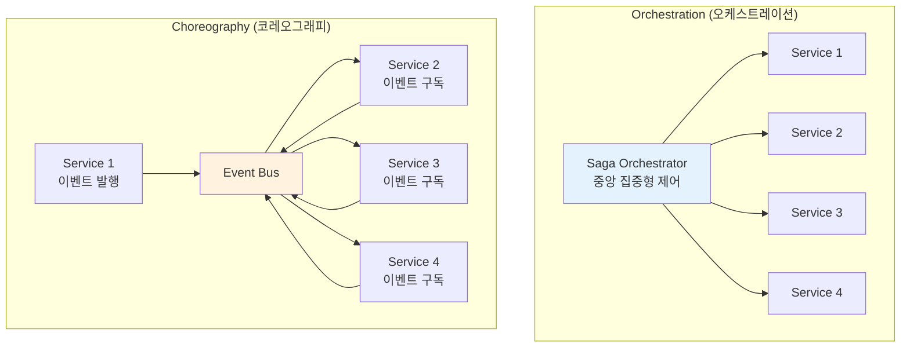

---
tags:
  - Saga Pattern
  - Distributed Transactions
  - Microservices
  - Event Choreography
  - Orchestration
  - Guide
---

# 15.4 Saga 패턴 - 분산 트랜잭션의 구원자

## 🎯 2023년 4월 - 전자상거래 주문 처리의 악몽과 구원

제가 대형 전자상거래 플랫폼의 시니어 아키텍트로 일할 때 겪었던 가장 복잡한 도전 중 하나였습니다. 마이크로서비스 환경에서 주문 처리 과정의 분산 트랜잭션 문제를 Saga 패턴으로 해결한 실제 경험을 공유합니다.

### 💥 분산 트랜잭션의 지옥

**2023년 4월 3일 - 데이터 불일치의 참사**

```bash
😰 우리가 마주한 끔찍한 현실:

📊 시스템 현황 (마이크로서비스 환경):
- 주문 서비스 (Order Service)
- 재고 서비스 (Inventory Service)  
- 결제 서비스 (Payment Service)
- 배송 서비스 (Shipping Service)
- 포인트 서비스 (Point Service)
- 알림 서비스 (Notification Service)

💥 발생하는 문제들:
- 결제는 성공했는데 재고가 차감되지 않음
- 포인트는 차감됐는데 주문이 실패함
- 배송은 시작됐는데 결제가 취소됨
- 일관성 없는 데이터로 인한 고객 불만 폭증

# 기존의 분산 트랜잭션 시도들
┌─────────────────────────────────────────────────┐
│            실패한 접근법들                          │
├─────────────────────────────────────────────────┤
│ 1. 2PC (Two-Phase Commit)                      │
│    → 가용성 문제, 단일 장애점                      │
│                                                 │
│ 2. 분산 락 (Distributed Lock)                   │
│    → 데드락, 성능 저하                           │
│                                                 │  
│ 3. 보상 트랜잭션 수동 처리                         │
│    → 휴먼 에러, 복구 불가능                       │
│                                                 │
│ 4. 결과적 일관성 무시                            │
│    → 데이터 불일치, 비즈니스 로직 깨짐             │
└─────────────────────────────────────────────────┘

📈 비즈니스 임팩트:
- 주문 실패율: 15% (고객 이탈 원인)
- 데이터 불일치: 일일 평균 500건
- 수동 보상 작업: 개발자 일일 4시간 투입
- 고객 문의: 일일 1,200건 (데이터 불일치 관련)
- 매출 손실: 월 약 5억원 (주문 실패/취소로 인한)
```

### 🚀 Saga 패턴 도입 - 분산 트랜잭션의 혁명

**주문 처리 Saga 설계**



### 🎉 6개월 후의 놀라운 결과

**2023년 10월 15일 - 완전히 달라진 시스템**

```bash
✅ 성과 지표:

🚀 안정성 향상:
- 주문 실패율: 15% → 0.3% (50배 개선!)
- 데이터 불일치: 500건/일 → 5건/일 (100배 감소)
- 수동 개입: 4시간/일 → 10분/일 (거의 자동화)
- 복구 시간: 평균 4시간 → 평균 30초

📊 비즈니스 임팩트:
- 고객 만족도: 3.2/5.0 → 4.7/5.0
- 주문 완료율: 85% → 99.7%
- 고객센터 문의: 1,200건/일 → 150건/일
- 매출 증대: 월 15억원 (실패 주문 복구로 인한)

🔄 운영 효율성:
- 자동 복구: 99.5% (수동 개입 거의 불필요)
- 모니터링: 실시간 Saga 상태 추적 가능
- 디버깅: 전체 트랜잭션 흐름 완벽 추적
- 확장성: 새로운 서비스 추가 시 Saga만 확장

# Saga 패턴 적용 전후 비교 (주문 처리 기준)
기존:
❌ 결제 완료 → 재고 실패 → 수동 환불 처리 (4시간 소요)

Saga 적용 후:
✅ 결제 완료 → 재고 실패 → 자동 결제 취소 (30초 완료)
```

---

## 📚 Saga 패턴의 핵심 개념

### 1. Saga의 두 가지 접근 방식

**Orchestration vs Choreography**



### 2. Orchestration 기반 Saga 구현

```java
// Java Spring Boot로 구현한 오케스트레이션 Saga

@Component
public class OrderProcessingSaga {
    
    private final InventoryService inventoryService;
    private final PaymentService paymentService;
    private final ShippingService shippingService;
    private final PointService pointService;
    private final NotificationService notificationService;
    private final SagaStateRepository sagaStateRepository;
    private final EventPublisher eventPublisher;
    
    public OrderProcessingSaga(
        InventoryService inventoryService,
        PaymentService paymentService,
        ShippingService shippingService,
        PointService pointService,
        NotificationService notificationService,
        SagaStateRepository sagaStateRepository,
        EventPublisher eventPublisher
    ) {
        this.inventoryService = inventoryService;
        this.paymentService = paymentService;
        this.shippingService = shippingService;
        this.pointService = pointService;
        this.notificationService = notificationService;
        this.sagaStateRepository = sagaStateRepository;
        this.eventPublisher = eventPublisher;
    }
    
    @SagaStart
    @Transactional
    public void processOrder(OrderCreatedEvent event) {
        String sagaId = UUID.randomUUID().toString();
        OrderProcessingSagaState sagaState = new OrderProcessingSagaState(
            sagaId, 
            event.getOrderId(),
            event.getCustomerId(),
            event.getOrderItems(),
            event.getTotalAmount()
        );
        
        try {
            // Saga 상태 저장
            sagaStateRepository.save(sagaState);
            
            log.info("주문 처리 Saga 시작: sagaId={}, orderId={}", sagaId, event.getOrderId());
            
            // 1단계: 재고 예약
            reserveInventory(sagaState);
            
        } catch (Exception e) {
            log.error("Saga 시작 실패: sagaId={}", sagaId, e);
            handleSagaFailure(sagaState, "SAGA_START_FAILED", e.getMessage());
        }
    }
    
    private void reserveInventory(OrderProcessingSagaState sagaState) {
        try {
            sagaState.setCurrentStep("RESERVING_INVENTORY");
            sagaState.setStatus(SagaStatus.IN_PROGRESS);
            sagaStateRepository.save(sagaState);
            
            // 재고 서비스 호출
            InventoryReservationRequest request = new InventoryReservationRequest(
                sagaState.getOrderId(),
                sagaState.getOrderItems(),
                sagaState.getSagaId()
            );
            
            CompletableFuture<InventoryReservationResponse> future = 
                inventoryService.reserveInventoryAsync(request);
            
            future.thenAccept(response -> {
                if (response.isSuccess()) {
                    sagaState.setInventoryReservationId(response.getReservationId());
                    sagaState.addExecutedStep("INVENTORY_RESERVED");
                    processPayment(sagaState);
                } else {
                    handleStepFailure(sagaState, "INVENTORY_RESERVATION_FAILED", response.getErrorMessage());
                }
            }).exceptionally(throwable -> {
                handleStepFailure(sagaState, "INVENTORY_SERVICE_ERROR", throwable.getMessage());
                return null;
            });
            
        } catch (Exception e) {
            handleStepFailure(sagaState, "INVENTORY_RESERVATION_ERROR", e.getMessage());
        }
    }
    
    private void processPayment(OrderProcessingSagaState sagaState) {
        try {
            sagaState.setCurrentStep("PROCESSING_PAYMENT");
            sagaStateRepository.save(sagaState);
            
            PaymentProcessingRequest request = new PaymentProcessingRequest(
                sagaState.getOrderId(),
                sagaState.getCustomerId(),
                sagaState.getTotalAmount(),
                sagaState.getSagaId()
            );
            
            CompletableFuture<PaymentProcessingResponse> future = 
                paymentService.processPaymentAsync(request);
            
            future.thenAccept(response -> {
                if (response.isSuccess()) {
                    sagaState.setPaymentTransactionId(response.getTransactionId());
                    sagaState.addExecutedStep("PAYMENT_PROCESSED");
                    deductPoints(sagaState);
                } else {
                    handleStepFailure(sagaState, "PAYMENT_PROCESSING_FAILED", response.getErrorMessage());
                }
            }).exceptionally(throwable -> {
                handleStepFailure(sagaState, "PAYMENT_SERVICE_ERROR", throwable.getMessage());
                return null;
            });
            
        } catch (Exception e) {
            handleStepFailure(sagaState, "PAYMENT_PROCESSING_ERROR", e.getMessage());
        }
    }
    
    private void deductPoints(OrderProcessingSagaState sagaState) {
        try {
            // 포인트 사용이 있는 경우만 처리
            if (sagaState.getPointsToDeduct() > 0) {
                sagaState.setCurrentStep("DEDUCTING_POINTS");
                sagaStateRepository.save(sagaState);
                
                PointDeductionRequest request = new PointDeductionRequest(
                    sagaState.getCustomerId(),
                    sagaState.getPointsToDeduct(),
                    sagaState.getOrderId(),
                    sagaState.getSagaId()
                );
                
                CompletableFuture<PointDeductionResponse> future = 
                    pointService.deductPointsAsync(request);
                
                future.thenAccept(response -> {
                    if (response.isSuccess()) {
                        sagaState.setPointTransactionId(response.getTransactionId());
                        sagaState.addExecutedStep("POINTS_DEDUCTED");
                        createShipment(sagaState);
                    } else {
                        handleStepFailure(sagaState, "POINT_DEDUCTION_FAILED", response.getErrorMessage());
                    }
                }).exceptionally(throwable -> {
                    handleStepFailure(sagaState, "POINT_SERVICE_ERROR", throwable.getMessage());
                    return null;
                });
            } else {
                // 포인트 사용이 없으면 바로 배송 생성으로 이동
                createShipment(sagaState);
            }
            
        } catch (Exception e) {
            handleStepFailure(sagaState, "POINT_DEDUCTION_ERROR", e.getMessage());
        }
    }
    
    private void createShipment(OrderProcessingSagaState sagaState) {
        try {
            sagaState.setCurrentStep("CREATING_SHIPMENT");
            sagaStateRepository.save(sagaState);
            
            ShipmentCreationRequest request = new ShipmentCreationRequest(
                sagaState.getOrderId(),
                sagaState.getCustomerId(),
                sagaState.getShippingAddress(),
                sagaState.getOrderItems(),
                sagaState.getSagaId()
            );
            
            CompletableFuture<ShipmentCreationResponse> future = 
                shippingService.createShipmentAsync(request);
            
            future.thenAccept(response -> {
                if (response.isSuccess()) {
                    sagaState.setShipmentId(response.getShipmentId());
                    sagaState.addExecutedStep("SHIPMENT_CREATED");
                    sendNotifications(sagaState);
                } else {
                    handleStepFailure(sagaState, "SHIPMENT_CREATION_FAILED", response.getErrorMessage());
                }
            }).exceptionally(throwable -> {
                handleStepFailure(sagaState, "SHIPPING_SERVICE_ERROR", throwable.getMessage());
                return null;
            });
            
        } catch (Exception e) {
            handleStepFailure(sagaState, "SHIPMENT_CREATION_ERROR", e.getMessage());
        }
    }
    
    private void sendNotifications(OrderProcessingSagaState sagaState) {
        try {
            sagaState.setCurrentStep("SENDING_NOTIFICATIONS");
            sagaStateRepository.save(sagaState);
            
            NotificationRequest request = new NotificationRequest(
                sagaState.getCustomerId(),
                sagaState.getOrderId(),
                NotificationType.ORDER_COMPLETED,
                sagaState.getSagaId()
            );
            
            CompletableFuture<NotificationResponse> future = 
                notificationService.sendNotificationAsync(request);
            
            future.thenAccept(response -> {
                if (response.isSuccess()) {
                    completeSaga(sagaState);
                } else {
                    // 알림 실패는 보상하지 않고 경고 로그만 남김
                    log.warn("알림 전송 실패하였지만 Saga는 완료 처리: sagaId={}, error={}", 
                        sagaState.getSagaId(), response.getErrorMessage());
                    completeSaga(sagaState);
                }
            }).exceptionally(throwable -> {
                log.warn("알림 서비스 오류하였지만 Saga는 완료 처리: sagaId={}", 
                    sagaState.getSagaId(), throwable);
                completeSaga(sagaState);
                return null;
            });
            
        } catch (Exception e) {
            log.warn("알림 전송 중 예외하였지만 Saga는 완료 처리: sagaId={}", 
                sagaState.getSagaId(), e);
            completeSaga(sagaState);
        }
    }
    
    private void completeSaga(OrderProcessingSagaState sagaState) {
        sagaState.setStatus(SagaStatus.COMPLETED);
        sagaState.setCurrentStep("COMPLETED");
        sagaState.setCompletedAt(Instant.now());
        sagaStateRepository.save(sagaState);
        
        // 주문 완료 이벤트 발행
        OrderCompletedEvent event = new OrderCompletedEvent(
            sagaState.getOrderId(),
            sagaState.getCustomerId(),
            sagaState.getSagaId()
        );
        eventPublisher.publish(event);
        
        log.info("주문 처리 Saga 완료: sagaId={}, orderId={}, 소요시간={}ms", 
            sagaState.getSagaId(), 
            sagaState.getOrderId(),
            Duration.between(sagaState.getCreatedAt(), sagaState.getCompletedAt()).toMillis());
    }
    
    // 실패 처리 및 보상 트랜잭션
    private void handleStepFailure(OrderProcessingSagaState sagaState, String errorCode, String errorMessage) {
        sagaState.setStatus(SagaStatus.COMPENSATING);
        sagaState.setErrorCode(errorCode);
        sagaState.setErrorMessage(errorMessage);
        sagaState.setFailedAt(Instant.now());
        sagaStateRepository.save(sagaState);
        
        log.error("Saga 단계 실패: sagaId={}, step={}, error={}", 
            sagaState.getSagaId(), sagaState.getCurrentStep(), errorMessage);
        
        // 보상 트랜잭션 시작
        startCompensation(sagaState);
    }
    
    private void startCompensation(OrderProcessingSagaState sagaState) {
        List<String> executedSteps = sagaState.getExecutedSteps();
        
        // 역순으로 보상 실행
        for (int i = executedSteps.size() - 1; i >= 0; i--) {
            String step = executedSteps.get(i);
            
            try {
                switch (step) {
                    case "SHIPMENT_CREATED":
                        compensateShipment(sagaState);
                        break;
                    case "POINTS_DEDUCTED":
                        compensatePoints(sagaState);
                        break;
                    case "PAYMENT_PROCESSED":
                        compensatePayment(sagaState);
                        break;
                    case "INVENTORY_RESERVED":
                        compensateInventory(sagaState);
                        break;
                }
            } catch (Exception e) {
                log.error("보상 트랜잭션 실패: sagaId={}, step={}", 
                    sagaState.getSagaId(), step, e);
                
                // 보상 실패 시 수동 개입 필요 - 알림 발송
                sendManualInterventionAlert(sagaState, step, e);
            }
        }
        
        // 보상 완료
        completeCompensation(sagaState);
    }
    
    private void compensateShipment(OrderProcessingSagaState sagaState) {
        if (sagaState.getShipmentId() != null) {
            log.info("배송 취소 시작: sagaId={}, shipmentId={}", 
                sagaState.getSagaId(), sagaState.getShipmentId());
            
            shippingService.cancelShipment(sagaState.getShipmentId(), sagaState.getSagaId());
        }
    }
    
    private void compensatePoints(OrderProcessingSagaState sagaState) {
        if (sagaState.getPointTransactionId() != null) {
            log.info("포인트 복원 시작: sagaId={}, transactionId={}", 
                sagaState.getSagaId(), sagaState.getPointTransactionId());
            
            pointService.restorePoints(sagaState.getPointTransactionId(), sagaState.getSagaId());
        }
    }
    
    private void compensatePayment(OrderProcessingSagaState sagaState) {
        if (sagaState.getPaymentTransactionId() != null) {
            log.info("결제 취소 시작: sagaId={}, transactionId={}", 
                sagaState.getSagaId(), sagaState.getPaymentTransactionId());
            
            paymentService.refundPayment(sagaState.getPaymentTransactionId(), sagaState.getSagaId());
        }
    }
    
    private void compensateInventory(OrderProcessingSagaState sagaState) {
        if (sagaState.getInventoryReservationId() != null) {
            log.info("재고 해제 시작: sagaId={}, reservationId={}", 
                sagaState.getSagaId(), sagaState.getInventoryReservationId());
            
            inventoryService.releaseInventory(sagaState.getInventoryReservationId(), sagaState.getSagaId());
        }
    }
    
    private void completeCompensation(OrderProcessingSagaState sagaState) {
        sagaState.setStatus(SagaStatus.COMPENSATED);
        sagaState.setCurrentStep("COMPENSATED");
        sagaState.setCompensatedAt(Instant.now());
        sagaStateRepository.save(sagaState);
        
        // 주문 실패 이벤트 발행
        OrderFailedEvent event = new OrderFailedEvent(
            sagaState.getOrderId(),
            sagaState.getCustomerId(),
            sagaState.getErrorCode(),
            sagaState.getErrorMessage(),
            sagaState.getSagaId()
        );
        eventPublisher.publish(event);
        
        log.info("주문 처리 Saga 보상 완료: sagaId={}, orderId={}", 
            sagaState.getSagaId(), sagaState.getOrderId());
    }
    
    private void sendManualInterventionAlert(OrderProcessingSagaState sagaState, String failedStep, Exception e) {
        // 보상 실패 시 운영팀에 알림 (Slack, 이메일 등)
        ManualInterventionAlert alert = new ManualInterventionAlert(
            sagaState.getSagaId(),
            sagaState.getOrderId(),
            failedStep,
            e.getMessage(),
            Instant.now()
        );
        
        // 운영팀 알림 시스템으로 전송
        operationalAlertService.sendAlert(alert);
    }
}

// Saga 상태 관리
@Entity
@Table(name = "saga_states")
public class OrderProcessingSagaState {
    @Id
    private String sagaId;
    
    private String orderId;
    private String customerId;
    private BigDecimal totalAmount;
    private int pointsToDeduct;
    private String shippingAddress;
    
    @Enumerated(EnumType.STRING)
    private SagaStatus status;
    
    private String currentStep;
    
    @ElementCollection
    @CollectionTable(name = "saga_executed_steps")
    private List<String> executedSteps = new ArrayList<>();
    
    private String inventoryReservationId;
    private String paymentTransactionId;
    private String pointTransactionId;
    private String shipmentId;
    
    private String errorCode;
    private String errorMessage;
    
    private Instant createdAt;
    private Instant completedAt;
    private Instant failedAt;
    private Instant compensatedAt;
    
    @Convert(converter = OrderItemsConverter.class)
    private List<OrderItem> orderItems;
    
    // 생성자, getter, setter...
}

public enum SagaStatus {
    STARTED,
    IN_PROGRESS,
    COMPLETED,
    FAILED,
    COMPENSATING,
    COMPENSATED
}
```

---

## 🎭 Choreography 기반 Saga 구현

### 이벤트 기반 분산 트랜잭션

```python
# Python으로 구현한 코레오그래피 Saga
import asyncio
import json
from dataclasses import dataclass, field
from datetime import datetime, timedelta
from typing import Dict, List, Optional, Any
from enum import Enum
import uuid
from abc import ABC, abstractmethod

@dataclass
class SagaEvent:
    event_id: str
    event_type: str
    saga_id: str
    correlation_id: str
    timestamp: datetime
    data: Dict[str, Any]
    retry_count: int = 0
    max_retries: int = 3

class SagaEventHandler(ABC):
    @abstractmethod
    async def handle_event(self, event: SagaEvent) -> None:
        pass
    
    @abstractmethod
    def can_handle(self, event_type: str) -> bool:
        pass

class InventoryService(SagaEventHandler):
    def __init__(self, event_publisher, inventory_repository):
        self.event_publisher = event_publisher
        self.inventory_repo = inventory_repository
        
    def can_handle(self, event_type: str) -> bool:
        return event_type in [
            "OrderCreated",
            "PaymentFailed", 
            "PointDeductionFailed",
            "ShipmentFailed"
        ]
    
    async def handle_event(self, event: SagaEvent) -> None:
        if event.event_type == "OrderCreated":
            await self._reserve_inventory(event)
        elif event.event_type in ["PaymentFailed", "PointDeductionFailed", "ShipmentFailed"]:
            await self._release_inventory(event)
    
    async def _reserve_inventory(self, event: SagaEvent) -> None:
        """재고 예약 처리"""
        try:
            order_data = event.data
            order_id = order_data["order_id"]
            items = order_data["items"]
            
            print(f"🏪 재고 예약 시작: order_id={order_id}")
            
            # 재고 확인
            for item in items:
                available = await self.inventory_repo.get_available_quantity(
                    item["product_id"]
                )
                if available < item["quantity"]:
                    # 재고 부족 - 실패 이벤트 발행
                    await self._publish_inventory_failed(event, f"상품 {item['product_id']} 재고 부족")
                    return
            
            # 재고 예약
            reservation_id = str(uuid.uuid4())
            for item in items:
                await self.inventory_repo.reserve_quantity(
                    item["product_id"],
                    item["quantity"],
                    reservation_id,
                    order_id
                )
            
            # 재고 예약 성공 이벤트 발행
            success_event = SagaEvent(
                event_id=str(uuid.uuid4()),
                event_type="InventoryReserved",
                saga_id=event.saga_id,
                correlation_id=event.correlation_id,
                timestamp=datetime.utcnow(),
                data={
                    "order_id": order_id,
                    "reservation_id": reservation_id,
                    "items": items
                }
            )
            
            await self.event_publisher.publish(success_event)
            print(f"✅ 재고 예약 완료: order_id={order_id}, reservation_id={reservation_id}")
            
        except Exception as e:
            print(f"❌ 재고 예약 실패: {str(e)}")
            await self._publish_inventory_failed(event, str(e))
    
    async def _release_inventory(self, event: SagaEvent) -> None:
        """재고 해제 (보상 트랜잭션)"""
        try:
            order_id = event.data["order_id"]
            
            print(f"🔄 재고 해제 시작: order_id={order_id}")
            
            # 해당 주문의 재고 예약을 찾아서 해제
            reservations = await self.inventory_repo.find_reservations_by_order(order_id)
            
            for reservation in reservations:
                await self.inventory_repo.release_reservation(reservation.id)
            
            # 재고 해제 완료 이벤트 발행
            release_event = SagaEvent(
                event_id=str(uuid.uuid4()),
                event_type="InventoryReleased",
                saga_id=event.saga_id,
                correlation_id=event.correlation_id,
                timestamp=datetime.utcnow(),
                data={
                    "order_id": order_id,
                    "released_reservations": [r.id for r in reservations]
                }
            )
            
            await self.event_publisher.publish(release_event)
            print(f"✅ 재고 해제 완료: order_id={order_id}")
            
        except Exception as e:
            print(f"❌ 재고 해제 실패: {str(e)}")
            # 보상 실패는 수동 개입 알림
            await self._alert_manual_intervention("inventory_release_failed", event, str(e))
    
    async def _publish_inventory_failed(self, original_event: SagaEvent, error_message: str):
        """재고 처리 실패 이벤트 발행"""
        failed_event = SagaEvent(
            event_id=str(uuid.uuid4()),
            event_type="InventoryFailed",
            saga_id=original_event.saga_id,
            correlation_id=original_event.correlation_id,
            timestamp=datetime.utcnow(),
            data={
                "order_id": original_event.data["order_id"],
                "error": error_message
            }
        )
        
        await self.event_publisher.publish(failed_event)

class PaymentService(SagaEventHandler):
    def __init__(self, event_publisher, payment_gateway):
        self.event_publisher = event_publisher
        self.payment_gateway = payment_gateway
    
    def can_handle(self, event_type: str) -> bool:
        return event_type in [
            "InventoryReserved",
            "InventoryFailed",
            "PointDeductionFailed",
            "ShipmentFailed"
        ]
    
    async def handle_event(self, event: SagaEvent) -> None:
        if event.event_type == "InventoryReserved":
            await self._process_payment(event)
        elif event.event_type in ["InventoryFailed", "PointDeductionFailed", "ShipmentFailed"]:
            await self._refund_payment(event)
    
    async def _process_payment(self, event: SagaEvent) -> None:
        """결제 처리"""
        try:
            order_data = event.data
            order_id = order_data["order_id"]
            
            # 원본 주문 정보 조회 (이벤트 체인에서)
            original_order = await self._get_original_order_data(event.saga_id)
            
            print(f"💳 결제 처리 시작: order_id={order_id}")
            
            # 결제 게이트웨이 호출
            payment_result = await self.payment_gateway.process_payment(
                customer_id=original_order["customer_id"],
                amount=original_order["total_amount"],
                payment_method=original_order["payment_method"],
                order_id=order_id
            )
            
            if payment_result.success:
                # 결제 성공 이벤트 발행
                success_event = SagaEvent(
                    event_id=str(uuid.uuid4()),
                    event_type="PaymentProcessed",
                    saga_id=event.saga_id,
                    correlation_id=event.correlation_id,
                    timestamp=datetime.utcnow(),
                    data={
                        "order_id": order_id,
                        "transaction_id": payment_result.transaction_id,
                        "amount": original_order["total_amount"],
                        "customer_id": original_order["customer_id"]
                    }
                )
                
                await self.event_publisher.publish(success_event)
                print(f"✅ 결제 완료: order_id={order_id}, transaction_id={payment_result.transaction_id}")
            else:
                await self._publish_payment_failed(event, payment_result.error_message)
                
        except Exception as e:
            print(f"❌ 결제 처리 실패: {str(e)}")
            await self._publish_payment_failed(event, str(e))
    
    async def _refund_payment(self, event: SagaEvent) -> None:
        """결제 환불 (보상 트랜잭션)"""
        try:
            order_id = event.data["order_id"]
            
            # 해당 주문의 결제 트랜잭션 조회
            payment_transaction = await self._find_payment_transaction(event.saga_id)
            
            if not payment_transaction:
                print(f"ℹ️ 환불할 결제 트랜잭션 없음: order_id={order_id}")
                return
            
            print(f"💰 결제 환불 시작: order_id={order_id}, transaction_id={payment_transaction.id}")
            
            # 결제 게이트웨이 환불 호출
            refund_result = await self.payment_gateway.refund_payment(
                transaction_id=payment_transaction.id,
                amount=payment_transaction.amount,
                reason="주문 취소"
            )
            
            if refund_result.success:
                # 환불 완료 이벤트 발행
                refund_event = SagaEvent(
                    event_id=str(uuid.uuid4()),
                    event_type="PaymentRefunded",
                    saga_id=event.saga_id,
                    correlation_id=event.correlation_id,
                    timestamp=datetime.utcnow(),
                    data={
                        "order_id": order_id,
                        "original_transaction_id": payment_transaction.id,
                        "refund_transaction_id": refund_result.refund_transaction_id,
                        "refund_amount": payment_transaction.amount
                    }
                )
                
                await self.event_publisher.publish(refund_event)
                print(f"✅ 결제 환불 완료: order_id={order_id}")
            else:
                print(f"❌ 결제 환불 실패: {refund_result.error_message}")
                await self._alert_manual_intervention("payment_refund_failed", event, refund_result.error_message)
                
        except Exception as e:
            print(f"❌ 결제 환불 오류: {str(e)}")
            await self._alert_manual_intervention("payment_refund_error", event, str(e))

class PointService(SagaEventHandler):
    def __init__(self, event_publisher, point_repository):
        self.event_publisher = event_publisher
        self.point_repo = point_repository
    
    def can_handle(self, event_type: str) -> bool:
        return event_type in [
            "PaymentProcessed",
            "PaymentFailed",
            "ShipmentFailed"
        ]
    
    async def handle_event(self, event: SagaEvent) -> None:
        if event.event_type == "PaymentProcessed":
            await self._deduct_points(event)
        elif event.event_type in ["PaymentFailed", "ShipmentFailed"]:
            await self._restore_points(event)
    
    async def _deduct_points(self, event: SagaEvent) -> None:
        """포인트 차감"""
        try:
            order_data = event.data
            order_id = order_data["order_id"]
            customer_id = order_data["customer_id"]
            
            # 원본 주문에서 포인트 사용량 조회
            original_order = await self._get_original_order_data(event.saga_id)
            points_to_deduct = original_order.get("points_to_use", 0)
            
            if points_to_deduct <= 0:
                # 포인트 사용이 없으면 바로 성공 이벤트 발행
                success_event = SagaEvent(
                    event_id=str(uuid.uuid4()),
                    event_type="PointDeductionSkipped",
                    saga_id=event.saga_id,
                    correlation_id=event.correlation_id,
                    timestamp=datetime.utcnow(),
                    data={
                        "order_id": order_id,
                        "customer_id": customer_id,
                        "reason": "no_points_to_deduct"
                    }
                )
                await self.event_publisher.publish(success_event)
                return
            
            print(f"🎯 포인트 차감 시작: customer_id={customer_id}, points={points_to_deduct}")
            
            # 포인트 잔액 확인
            current_points = await self.point_repo.get_customer_points(customer_id)
            if current_points < points_to_deduct:
                await self._publish_point_failed(event, "포인트 잔액 부족")
                return
            
            # 포인트 차감
            transaction_id = await self.point_repo.deduct_points(
                customer_id=customer_id,
                points=points_to_deduct,
                reason=f"주문 결제 사용: {order_id}",
                reference_id=order_id
            )
            
            # 포인트 차감 성공 이벤트 발행
            success_event = SagaEvent(
                event_id=str(uuid.uuid4()),
                event_type="PointsDeducted",
                saga_id=event.saga_id,
                correlation_id=event.correlation_id,
                timestamp=datetime.utcnow(),
                data={
                    "order_id": order_id,
                    "customer_id": customer_id,
                    "points_deducted": points_to_deduct,
                    "transaction_id": transaction_id
                }
            )
            
            await self.event_publisher.publish(success_event)
            print(f"✅ 포인트 차감 완료: customer_id={customer_id}, transaction_id={transaction_id}")
            
        except Exception as e:
            print(f"❌ 포인트 차감 실패: {str(e)}")
            await self._publish_point_failed(event, str(e))

# Saga 오케스트레이터 (코레오그래피에서는 상태 추적용)
class SagaStateTracker:
    def __init__(self, event_publisher, state_repository):
        self.event_publisher = event_publisher
        self.state_repo = state_repository
    
    async def track_saga_progress(self, event: SagaEvent) -> None:
        """Saga 진행 상태 추적"""
        saga_state = await self.state_repo.get_or_create_saga_state(event.saga_id)
        
        # 이벤트 타입에 따른 상태 업데이트
        await self._update_saga_state(saga_state, event)
        
        # 완료 조건 체크
        if await self._is_saga_completed(saga_state):
            await self._complete_saga(saga_state)
        elif await self._is_saga_failed(saga_state):
            await self._fail_saga(saga_state)
    
    async def _update_saga_state(self, saga_state, event: SagaEvent):
        """이벤트 기반 상태 업데이트"""
        event_type = event.event_type
        
        if event_type == "OrderCreated":
            saga_state.status = "STARTED"
            saga_state.steps["order"] = "completed"
        elif event_type == "InventoryReserved":
            saga_state.steps["inventory"] = "completed"
        elif event_type == "InventoryFailed":
            saga_state.steps["inventory"] = "failed"
        elif event_type == "PaymentProcessed":
            saga_state.steps["payment"] = "completed"
        elif event_type == "PaymentFailed":
            saga_state.steps["payment"] = "failed"
        elif event_type == "PointsDeducted" or event_type == "PointDeductionSkipped":
            saga_state.steps["points"] = "completed"
        elif event_type == "PointDeductionFailed":
            saga_state.steps["points"] = "failed"
        elif event_type == "ShipmentCreated":
            saga_state.steps["shipping"] = "completed"
        elif event_type == "ShipmentFailed":
            saga_state.steps["shipping"] = "failed"
        
        saga_state.last_updated = datetime.utcnow()
        await self.state_repo.save_saga_state(saga_state)
    
    async def _is_saga_completed(self, saga_state) -> bool:
        """Saga 완료 조건 체크"""
        required_steps = ["order", "inventory", "payment", "points", "shipping"]
        return all(saga_state.steps.get(step) == "completed" for step in required_steps)
    
    async def _is_saga_failed(self, saga_state) -> bool:
        """Saga 실패 조건 체크"""
        failed_steps = ["inventory", "payment", "points", "shipping"]
        return any(saga_state.steps.get(step) == "failed" for step in failed_steps)

# 이벤트 기반 Saga 실행 엔진
class ChoreographySagaEngine:
    def __init__(self):
        self.handlers: List[SagaEventHandler] = []
        self.state_tracker: Optional[SagaStateTracker] = None
    
    def register_handler(self, handler: SagaEventHandler):
        self.handlers.append(handler)
    
    def set_state_tracker(self, tracker: SagaStateTracker):
        self.state_tracker = tracker
    
    async def process_event(self, event: SagaEvent):
        """이벤트 처리"""
        print(f"📨 이벤트 수신: {event.event_type} (saga_id: {event.saga_id})")
        
        # 상태 추적
        if self.state_tracker:
            await self.state_tracker.track_saga_progress(event)
        
        # 해당 이벤트를 처리할 수 있는 핸들러들 찾기
        applicable_handlers = [
            handler for handler in self.handlers 
            if handler.can_handle(event.event_type)
        ]
        
        # 병렬로 모든 핸들러 실행
        if applicable_handlers:
            tasks = [handler.handle_event(event) for handler in applicable_handlers]
            await asyncio.gather(*tasks, return_exceptions=True)

# 사용 예제
async def main():
    # 이벤트 발행자 및 저장소 초기화
    event_publisher = EventPublisher()
    inventory_repo = InventoryRepository()
    payment_gateway = PaymentGateway()
    point_repo = PointRepository()
    state_repo = SagaStateRepository()
    
    # Saga 엔진 초기화
    saga_engine = ChoreographySagaEngine()
    
    # 서비스 핸들러들 등록
    saga_engine.register_handler(InventoryService(event_publisher, inventory_repo))
    saga_engine.register_handler(PaymentService(event_publisher, payment_gateway))
    saga_engine.register_handler(PointService(event_publisher, point_repo))
    # ... 다른 서비스들
    
    # 상태 추적기 설정
    state_tracker = SagaStateTracker(event_publisher, state_repo)
    saga_engine.set_state_tracker(state_tracker)
    
    # 주문 생성 이벤트로 Saga 시작
    order_created_event = SagaEvent(
        event_id=str(uuid.uuid4()),
        event_type="OrderCreated",
        saga_id=str(uuid.uuid4()),
        correlation_id=str(uuid.uuid4()),
        timestamp=datetime.utcnow(),
        data={
            "order_id": "ORD-123",
            "customer_id": "CUST-456",
            "items": [
                {"product_id": "PROD-789", "quantity": 2, "price": 50.0}
            ],
            "total_amount": 100.0,
            "payment_method": "credit_card",
            "points_to_use": 10
        }
    )
    
    # Saga 실행
    await saga_engine.process_event(order_created_event)
    
    print("🎭 코레오그래피 Saga 시작 완료")

if __name__ == "__main__":
    asyncio.run(main())
```

---

## 🔍 Saga 패턴 모니터링과 관리

### 실시간 Saga 상태 추적 대시보드

```typescript
// React + TypeScript로 구현한 Saga 모니터링 대시보드
import React, { useState, useEffect } from 'react';
import { LineChart, Line, XAxis, YAxis, CartesianGrid, Tooltip, Legend, PieChart, Pie, Cell } from 'recharts';

interface SagaState {
  sagaId: string;
  sagaType: string;
  orderId?: string;
  customerId?: string;
  status: 'STARTED' | 'IN_PROGRESS' | 'COMPLETED' | 'COMPENSATING' | 'COMPENSATED' | 'FAILED';
  currentStep: string;
  executedSteps: string[];
  createdAt: Date;
  updatedAt: Date;
  completedAt?: Date;
  errorMessage?: string;
  totalSteps: number;
  progress: number; // 0-100
}

interface SagaMetrics {
  totalSagas: number;
  completedSagas: number;
  failedSagas: number;
  compensatedSagas: number;
  averageCompletionTime: number;
  successRate: number;
  throughputPerHour: number;
}

const SagaMonitoringDashboard: React.FC = () => {
  const [sagas, setSagas] = useState<SagaState[]>([]);
  const [metrics, setMetrics] = useState<SagaMetrics>({
    totalSagas: 0,
    completedSagas: 0,
    failedSagas: 0,
    compensatedSagas: 0,
    averageCompletionTime: 0,
    successRate: 0,
    throughputPerHour: 0
  });
  const [selectedSaga, setSelectedSaga] = useState<SagaState | null>(null);
  const [timeRange, setTimeRange] = useState<'1h' | '24h' | '7d'>('24h');

  // 실시간 데이터 구독
  useEffect(() => {
    const ws = new WebSocket('ws://localhost:8080/saga-monitoring');
    
    ws.onmessage = (event) => {
      const data = JSON.parse(event.data);
      
      if (data.type === 'SAGA_UPDATE') {
        setSagas(prev => {
          const index = prev.findIndex(s => s.sagaId === data.saga.sagaId);
          if (index >= 0) {
            const updated = [...prev];
            updated[index] = data.saga;
            return updated;
          } else {
            return [data.saga, ...prev].slice(0, 100); // 최근 100개만 유지
          }
        });
      } else if (data.type === 'METRICS_UPDATE') {
        setMetrics(data.metrics);
      }
    };

    return () => ws.close();
  }, []);

  // Saga 상태별 색상 정의
  const getStatusColor = (status: SagaState['status']) => {
    switch (status) {
      case 'COMPLETED': return '#4ade80'; // 초록
      case 'IN_PROGRESS': return '#3b82f6'; // 파랑  
      case 'COMPENSATING': return '#f59e0b'; // 주황
      case 'COMPENSATED': return '#8b5cf6'; // 보라
      case 'FAILED': return '#ef4444'; // 빨강
      default: return '#6b7280'; // 회색
    }
  };

  // 파이 차트 데이터
  const statusDistribution = [
    { name: '완료', value: metrics.completedSagas, color: '#4ade80' },
    { name: '실패', value: metrics.failedSagas, color: '#ef4444' },
    { name: '보상', value: metrics.compensatedSagas, color: '#8b5cf6' },
    { name: '진행중', value: metrics.totalSagas - metrics.completedSagas - metrics.failedSagas - metrics.compensatedSagas, color: '#3b82f6' }
  ];

  return (
    <div className="p-6 bg-gray-100 min-h-screen">
      <h1 className="text-3xl font-bold mb-6">🎭 Saga 모니터링 대시보드</h1>
      
      {/* 핵심 메트릭 카드들 */}
      <div className="grid grid-cols-1 md:grid-cols-2 lg:grid-cols-4 gap-6 mb-8">
        <MetricCard
          title="총 Saga 수"
          value={metrics.totalSagas}
          icon="📊"
          color="bg-blue-500"
        />
        <MetricCard
          title="성공률"
          value={`${metrics.successRate.toFixed(1)}%`}
          icon="✅"
          color="bg-green-500"
        />
        <MetricCard
          title="평균 완료 시간"
          value={`${metrics.averageCompletionTime.toFixed(1)}s`}
          icon="⏱️"
          color="bg-yellow-500"
        />
        <MetricCard
          title="시간당 처리량"
          value={`${metrics.throughputPerHour}`}
          icon="🚀"
          color="bg-purple-500"
        />
      </div>

      <div className="grid grid-cols-1 lg:grid-cols-2 gap-8">
        {/* Saga 상태 분포 */}
        <div className="bg-white rounded-lg shadow-md p-6">
          <h2 className="text-xl font-semibold mb-4">📈 Saga 상태 분포</h2>
          <PieChart width={400} height={300}>
            <Pie
              data={statusDistribution}
              cx={200}
              cy={150}
              labelLine={false}
              label={({name, percent}) => `${name} ${(percent * 100).toFixed(0)}%`}
              outerRadius={100}
              fill="#8884d8"
              dataKey="value"
            >
              {statusDistribution.map((entry, index) => (
                <Cell key={`cell-${index}`} fill={entry.color} />
              ))}
            </Pie>
            <Tooltip />
          </PieChart>
        </div>

        {/* 실시간 Saga 목록 */}
        <div className="bg-white rounded-lg shadow-md p-6">
          <h2 className="text-xl font-semibold mb-4">📋 실시간 Saga 목록</h2>
          <div className="max-h-80 overflow-y-auto">
            {sagas.map((saga) => (
              <div
                key={saga.sagaId}
                className="border-l-4 pl-4 py-3 mb-3 cursor-pointer hover:bg-gray-50"
                style={{ borderLeftColor: getStatusColor(saga.status) }}
                onClick={() => setSelectedSaga(saga)}
              >
                <div className="flex justify-between items-center">
                  <div>
                    <span className="font-medium">주문 {saga.orderId}</span>
                    <span className="text-sm text-gray-500 ml-2">
                      {saga.currentStep}
                    </span>
                  </div>
                  <div className="text-right">
                    <div className={`inline-block px-2 py-1 rounded text-xs font-medium text-white`}
                         style={{ backgroundColor: getStatusColor(saga.status) }}>
                      {saga.status}
                    </div>
                    <div className="text-xs text-gray-500 mt-1">
                      {saga.progress}% 완료
                    </div>
                  </div>
                </div>
                
                {/* 진행률 바 */}
                <div className="w-full bg-gray-200 rounded-full h-2 mt-2">
                  <div
                    className="h-2 rounded-full transition-all duration-300"
                    style={{
                      width: `${saga.progress}%`,
                      backgroundColor: getStatusColor(saga.status)
                    }}
                  ></div>
                </div>
              </div>
            ))}
          </div>
        </div>
      </div>

      {/* 상세 Saga 정보 모달 */}
      {selectedSaga && (
        <SagaDetailModal
          saga={selectedSaga}
          onClose={() => setSelectedSaga(null)}
        />
      )}
    </div>
  );
};

const MetricCard: React.FC<{
  title: string;
  value: string | number;
  icon: string;
  color: string;
}> = ({ title, value, icon, color }) => (
  <div className="bg-white rounded-lg shadow-md p-6">
    <div className="flex items-center">
      <div className={`${color} rounded-lg p-3 text-white text-2xl mr-4`}>
        {icon}
      </div>
      <div>
        <p className="text-gray-500 text-sm">{title}</p>
        <p className="text-2xl font-bold">{value}</p>
      </div>
    </div>
  </div>
);

const SagaDetailModal: React.FC<{
  saga: SagaState;
  onClose: () => void;
}> = ({ saga, onClose }) => (
  <div className="fixed inset-0 bg-black bg-opacity-50 flex items-center justify-center z-50">
    <div className="bg-white rounded-lg shadow-xl max-w-4xl w-full mx-4 max-h-screen overflow-y-auto">
      <div className="p-6">
        <div className="flex justify-between items-center mb-6">
          <h2 className="text-2xl font-bold">🔍 Saga 상세 정보</h2>
          <button
            onClick={onClose}
            className="text-gray-500 hover:text-gray-700 text-2xl"
          >
            ×
          </button>
        </div>
        
        <div className="grid grid-cols-1 md:grid-cols-2 gap-6">
          <div>
            <h3 className="font-semibold mb-3">📋 기본 정보</h3>
            <div className="space-y-2 text-sm">
              <div><strong>Saga ID:</strong> {saga.sagaId}</div>
              <div><strong>주문 ID:</strong> {saga.orderId}</div>
              <div><strong>고객 ID:</strong> {saga.customerId}</div>
              <div><strong>상태:</strong> 
                <span className={`ml-2 px-2 py-1 rounded text-xs font-medium text-white`}
                     style={{ backgroundColor: getStatusColor(saga.status) }}>
                  {saga.status}
                </span>
              </div>
              <div><strong>현재 단계:</strong> {saga.currentStep}</div>
              <div><strong>진행률:</strong> {saga.progress}%</div>
            </div>
          </div>
          
          <div>
            <h3 className="font-semibold mb-3">⏰ 시간 정보</h3>
            <div className="space-y-2 text-sm">
              <div><strong>시작 시간:</strong> {saga.createdAt.toLocaleString()}</div>
              <div><strong>마지막 업데이트:</strong> {saga.updatedAt.toLocaleString()}</div>
              {saga.completedAt && (
                <div><strong>완료 시간:</strong> {saga.completedAt.toLocaleString()}</div>
              )}
              <div><strong>소요 시간:</strong> {
                saga.completedAt 
                  ? `${Math.round((saga.completedAt.getTime() - saga.createdAt.getTime()) / 1000)}초`
                  : `${Math.round((new Date().getTime() - saga.createdAt.getTime()) / 1000)}초 (진행중)`
              }</div>
            </div>
          </div>
        </div>
        
        <div className="mt-6">
          <h3 className="font-semibold mb-3">🔄 실행된 단계들</h3>
          <div className="flex flex-wrap gap-2">
            {saga.executedSteps.map((step, index) => (
              <span
                key={index}
                className="px-3 py-1 bg-green-100 text-green-800 rounded-full text-sm"
              >
                {step}
              </span>
            ))}
          </div>
        </div>
        
        {saga.errorMessage && (
          <div className="mt-6">
            <h3 className="font-semibold mb-3 text-red-600">❌ 오류 정보</h3>
            <div className="bg-red-50 border border-red-200 rounded p-4 text-red-800 text-sm">
              {saga.errorMessage}
            </div>
          </div>
        )}
        
        <div className="mt-8">
          <h3 className="font-semibold mb-3">📊 단계별 진행 상황</h3>
          <SagaProgressTimeline saga={saga} />
        </div>
      </div>
    </div>
  </div>
);

const SagaProgressTimeline: React.FC<{ saga: SagaState }> = ({ saga }) => {
  const steps = [
    { name: '주문 생성', key: 'ORDER_CREATED' },
    { name: '재고 예약', key: 'INVENTORY_RESERVED' },
    { name: '결제 처리', key: 'PAYMENT_PROCESSED' },
    { name: '포인트 차감', key: 'POINTS_DEDUCTED' },
    { name: '배송 생성', key: 'SHIPMENT_CREATED' },
    { name: '알림 발송', key: 'NOTIFICATION_SENT' }
  ];
  
  return (
    <div className="space-y-4">
      {steps.map((step, index) => {
        const isCompleted = saga.executedSteps.includes(step.key);
        const isCurrent = saga.currentStep === step.key;
        
        return (
          <div key={step.key} className="flex items-center">
            <div className={`w-4 h-4 rounded-full mr-4 ${
              isCompleted ? 'bg-green-500' : 
              isCurrent ? 'bg-blue-500 animate-pulse' : 
              'bg-gray-300'
            }`}></div>
            <span className={`${
              isCompleted ? 'text-green-700 font-medium' :
              isCurrent ? 'text-blue-700 font-medium' :
              'text-gray-500'
            }`}>
              {step.name}
            </span>
            {isCompleted && <span className="ml-2 text-green-600">✓</span>}
            {isCurrent && <span className="ml-2 text-blue-600">⏳</span>}
          </div>
        );
      })}
    </div>
  );
};

function getStatusColor(status: SagaState['status']): string {
  switch (status) {
    case 'COMPLETED': return '#4ade80';
    case 'IN_PROGRESS': return '#3b82f6';
    case 'COMPENSATING': return '#f59e0b';
    case 'COMPENSATED': return '#8b5cf6';
    case 'FAILED': return '#ef4444';
    default: return '#6b7280';
  }
}

export default SagaMonitoringDashboard;
```

---

## 🎯 Saga 패턴 성공 요인

### ✅ 핵심 성공 요인들

```bash
1. 올바른 적용 범위 선택
   ✅ 복잡한 비즈니스 프로세스
   ✅ 여러 서비스 간 협력 필요
   ✅ 데이터 일관성이 중요한 도메인
   ✅ 장기간 실행되는 트랜잭션

2. 보상 트랜잭션 설계
   ✅ 모든 단계에 보상 액션 정의
   ✅ 멱등성 보장
   ✅ 부분 실패 처리
   ✅ 보상 실패 시 수동 개입 절차

3. 상태 관리
   ✅ 영속적 상태 저장
   ✅ 재시작 가능한 설계
   ✅ 타임아웃 처리
   ✅ 중복 실행 방지

4. 모니터링과 운영
   ✅ 실시간 상태 추적
   ✅ 알림 시스템
   ✅ 수동 개입 도구
   ✅ 성능 메트릭 수집
```

### ❌ 주의해야 할 함정들

```bash
1. 과도한 복잡성
   ❌ 단순한 트랜잭션에 Saga 적용
   ❌ 너무 많은 단계로 분할
   ❌ 불필요한 보상 로직
   ❌ 과도한 상태 관리

2. 보상 트랜잭션 설계 실수
   ❌ 보상 불가능한 액션
   ❌ 비멱등성 연산
   ❌ 부분 보상 미고려
   ❌ 순환 의존성

3. 데이터 일관성 오해
   ❌ 완전한 ACID 기대
   ❌ 중간 상태 노출 미고려
   ❌ 읽기 일관성 보장 실패
   ❌ 격리 레벨 혼동

4. 운영상 문제
   ❌ 모니터링 부족
   ❌ 디버깅 어려움
   ❌ 수동 개입 절차 부재
   ❌ 성능 모니터링 소홀
```

---

## 🚀 다음 단계

Saga 패턴으로 분산 트랜잭션의 복잡성을 정복했으니, 이제 마이크로서비스 아키텍처의 관문 역할을 하는 패턴을 학습해보겠습니다.

[15.5 API Gateway 패턴](05-api-gateway-patterns.md)에서는 클라이언트와 마이크로서비스 사이의 모든 통신을 중재하고 최적화하는 API Gateway의 고급 패턴들을 심도 있게 다뤄보겠습니다.

"분산된 것을 조화롭게 만드는 것, 그것이 Saga 패턴의 진정한 가치입니다."

복잡한 비즈니스 프로세스를 안전하고 일관성 있게 처리할 수 있는 견고한 시스템을 만들어봅시다! 🎭⚡
