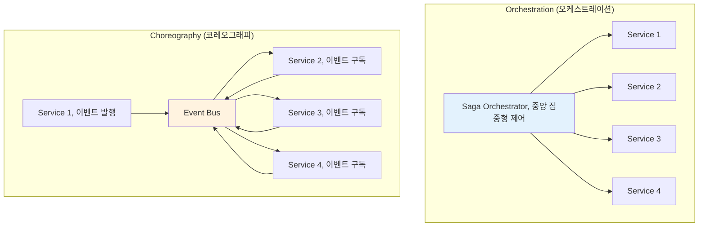

---
tags:
  - Saga Pattern
  - Orchestration
  - Microservices
  - Java Spring Boot
  - Guide
---

# 16.4b Saga 패턴 핵심 개념과 오케스트레이션

## 📚 Saga 패턴의 핵심 개념

### 1. Saga의 두 가지 접근 방식

**Orchestration vs Choreography**



### 2. Orchestration 기반 Saga 구현

```java
// Java Spring Boot로 구현한 오케스트레이션 Saga

@Component
public class OrderProcessingSaga {
    
    private final InventoryService inventoryService;
    private final PaymentService paymentService;
    private final ShippingService shippingService;
    private final PointService pointService;
    private final NotificationService notificationService;
    private final SagaStateRepository sagaStateRepository;
    private final EventPublisher eventPublisher;
    
    public OrderProcessingSaga(
        InventoryService inventoryService,
        PaymentService paymentService,
        ShippingService shippingService,
        PointService pointService,
        NotificationService notificationService,
        SagaStateRepository sagaStateRepository,
        EventPublisher eventPublisher
    ) {
        this.inventoryService = inventoryService;
        this.paymentService = paymentService;
        this.shippingService = shippingService;
        this.pointService = pointService;
        this.notificationService = notificationService;
        this.sagaStateRepository = sagaStateRepository;
        this.eventPublisher = eventPublisher;
    }
    
    @SagaStart
    @Transactional
    public void processOrder(OrderCreatedEvent event) {
        String sagaId = UUID.randomUUID().toString();
        OrderProcessingSagaState sagaState = new OrderProcessingSagaState(
            sagaId, 
            event.getOrderId(),
            event.getCustomerId(),
            event.getOrderItems(),
            event.getTotalAmount()
        );
        
        try {
            // Saga 상태 저장
            sagaStateRepository.save(sagaState);
            
            log.info("주문 처리 Saga 시작: sagaId={}, orderId={}", sagaId, event.getOrderId());
            
            // 1단계: 재고 예약
            reserveInventory(sagaState);
            
        } catch (Exception e) {
            log.error("Saga 시작 실패: sagaId={}", sagaId, e);
            handleSagaFailure(sagaState, "SAGA_START_FAILED", e.getMessage());
        }
    }
    
    private void reserveInventory(OrderProcessingSagaState sagaState) {
        try {
            sagaState.setCurrentStep("RESERVING_INVENTORY");
            sagaState.setStatus(SagaStatus.IN_PROGRESS);
            sagaStateRepository.save(sagaState);
            
            // 재고 서비스 호출
            InventoryReservationRequest request = new InventoryReservationRequest(
                sagaState.getOrderId(),
                sagaState.getOrderItems(),
                sagaState.getSagaId()
            );
            
            CompletableFuture<InventoryReservationResponse> future = 
                inventoryService.reserveInventoryAsync(request);
            
            future.thenAccept(response -> {
                if (response.isSuccess()) {
                    sagaState.setInventoryReservationId(response.getReservationId());
                    sagaState.addExecutedStep("INVENTORY_RESERVED");
                    processPayment(sagaState);
                } else {
                    handleStepFailure(sagaState, "INVENTORY_RESERVATION_FAILED", response.getErrorMessage());
                }
            }).exceptionally(throwable -> {
                handleStepFailure(sagaState, "INVENTORY_SERVICE_ERROR", throwable.getMessage());
                return null;
            });
            
        } catch (Exception e) {
            handleStepFailure(sagaState, "INVENTORY_RESERVATION_ERROR", e.getMessage());
        }
    }
    
    private void processPayment(OrderProcessingSagaState sagaState) {
        try {
            sagaState.setCurrentStep("PROCESSING_PAYMENT");
            sagaStateRepository.save(sagaState);
            
            PaymentProcessingRequest request = new PaymentProcessingRequest(
                sagaState.getOrderId(),
                sagaState.getCustomerId(),
                sagaState.getTotalAmount(),
                sagaState.getSagaId()
            );
            
            CompletableFuture<PaymentProcessingResponse> future = 
                paymentService.processPaymentAsync(request);
            
            future.thenAccept(response -> {
                if (response.isSuccess()) {
                    sagaState.setPaymentTransactionId(response.getTransactionId());
                    sagaState.addExecutedStep("PAYMENT_PROCESSED");
                    deductPoints(sagaState);
                } else {
                    handleStepFailure(sagaState, "PAYMENT_PROCESSING_FAILED", response.getErrorMessage());
                }
            }).exceptionally(throwable -> {
                handleStepFailure(sagaState, "PAYMENT_SERVICE_ERROR", throwable.getMessage());
                return null;
            });
            
        } catch (Exception e) {
            handleStepFailure(sagaState, "PAYMENT_PROCESSING_ERROR", e.getMessage());
        }
    }
    
    private void deductPoints(OrderProcessingSagaState sagaState) {
        try {
            // 포인트 사용이 있는 경우만 처리
            if (sagaState.getPointsToDeduct() > 0) {
                sagaState.setCurrentStep("DEDUCTING_POINTS");
                sagaStateRepository.save(sagaState);
                
                PointDeductionRequest request = new PointDeductionRequest(
                    sagaState.getCustomerId(),
                    sagaState.getPointsToDeduct(),
                    sagaState.getOrderId(),
                    sagaState.getSagaId()
                );
                
                CompletableFuture<PointDeductionResponse> future = 
                    pointService.deductPointsAsync(request);
                
                future.thenAccept(response -> {
                    if (response.isSuccess()) {
                        sagaState.setPointTransactionId(response.getTransactionId());
                        sagaState.addExecutedStep("POINTS_DEDUCTED");
                        createShipment(sagaState);
                    } else {
                        handleStepFailure(sagaState, "POINT_DEDUCTION_FAILED", response.getErrorMessage());
                    }
                }).exceptionally(throwable -> {
                    handleStepFailure(sagaState, "POINT_SERVICE_ERROR", throwable.getMessage());
                    return null;
                });
            } else {
                // 포인트 사용이 없으면 바로 배송 생성으로 이동
                createShipment(sagaState);
            }
            
        } catch (Exception e) {
            handleStepFailure(sagaState, "POINT_DEDUCTION_ERROR", e.getMessage());
        }
    }
    
    private void createShipment(OrderProcessingSagaState sagaState) {
        try {
            sagaState.setCurrentStep("CREATING_SHIPMENT");
            sagaStateRepository.save(sagaState);
            
            ShipmentCreationRequest request = new ShipmentCreationRequest(
                sagaState.getOrderId(),
                sagaState.getCustomerId(),
                sagaState.getShippingAddress(),
                sagaState.getOrderItems(),
                sagaState.getSagaId()
            );
            
            CompletableFuture<ShipmentCreationResponse> future = 
                shippingService.createShipmentAsync(request);
            
            future.thenAccept(response -> {
                if (response.isSuccess()) {
                    sagaState.setShipmentId(response.getShipmentId());
                    sagaState.addExecutedStep("SHIPMENT_CREATED");
                    sendNotifications(sagaState);
                } else {
                    handleStepFailure(sagaState, "SHIPMENT_CREATION_FAILED", response.getErrorMessage());
                }
            }).exceptionally(throwable -> {
                handleStepFailure(sagaState, "SHIPPING_SERVICE_ERROR", throwable.getMessage());
                return null;
            });
            
        } catch (Exception e) {
            handleStepFailure(sagaState, "SHIPMENT_CREATION_ERROR", e.getMessage());
        }
    }
    
    private void sendNotifications(OrderProcessingSagaState sagaState) {
        try {
            sagaState.setCurrentStep("SENDING_NOTIFICATIONS");
            sagaStateRepository.save(sagaState);
            
            NotificationRequest request = new NotificationRequest(
                sagaState.getCustomerId(),
                sagaState.getOrderId(),
                NotificationType.ORDER_COMPLETED,
                sagaState.getSagaId()
            );
            
            CompletableFuture<NotificationResponse> future = 
                notificationService.sendNotificationAsync(request);
            
            future.thenAccept(response -> {
                if (response.isSuccess()) {
                    completeSaga(sagaState);
                } else {
                    // 알림 실패는 보상하지 않고 경고 로그만 남김
                    log.warn("알림 전송 실패하였지만 Saga는 완료 처리: sagaId={}, error={}", 
                        sagaState.getSagaId(), response.getErrorMessage());
                    completeSaga(sagaState);
                }
            }).exceptionally(throwable -> {
                log.warn("알림 서비스 오류하였지만 Saga는 완료 처리: sagaId={}", 
                    sagaState.getSagaId(), throwable);
                completeSaga(sagaState);
                return null;
            });
            
        } catch (Exception e) {
            log.warn("알림 전송 중 예외하였지만 Saga는 완료 처리: sagaId={}", 
                sagaState.getSagaId(), e);
            completeSaga(sagaState);
        }
    }
    
    private void completeSaga(OrderProcessingSagaState sagaState) {
        sagaState.setStatus(SagaStatus.COMPLETED);
        sagaState.setCurrentStep("COMPLETED");
        sagaState.setCompletedAt(Instant.now());
        sagaStateRepository.save(sagaState);
        
        // 주문 완료 이벤트 발행
        OrderCompletedEvent event = new OrderCompletedEvent(
            sagaState.getOrderId(),
            sagaState.getCustomerId(),
            sagaState.getSagaId()
        );
        eventPublisher.publish(event);
        
        log.info("주문 처리 Saga 완료: sagaId={}, orderId={}, 소요시간={}ms", 
            sagaState.getSagaId(), 
            sagaState.getOrderId(),
            Duration.between(sagaState.getCreatedAt(), sagaState.getCompletedAt()).toMillis());
    }
    
    // 실패 처리 및 보상 트랜잭션
    private void handleStepFailure(OrderProcessingSagaState sagaState, String errorCode, String errorMessage) {
        sagaState.setStatus(SagaStatus.COMPENSATING);
        sagaState.setErrorCode(errorCode);
        sagaState.setErrorMessage(errorMessage);
        sagaState.setFailedAt(Instant.now());
        sagaStateRepository.save(sagaState);
        
        log.error("Saga 단계 실패: sagaId={}, step={}, error={}", 
            sagaState.getSagaId(), sagaState.getCurrentStep(), errorMessage);
        
        // 보상 트랜잭션 시작
        startCompensation(sagaState);
    }
    
    private void startCompensation(OrderProcessingSagaState sagaState) {
        List<String> executedSteps = sagaState.getExecutedSteps();
        
        // 역순으로 보상 실행
        for (int i = executedSteps.size() - 1; i >= 0; i--) {
            String step = executedSteps.get(i);
            
            try {
                switch (step) {
                    case "SHIPMENT_CREATED":
                        compensateShipment(sagaState);
                        break;
                    case "POINTS_DEDUCTED":
                        compensatePoints(sagaState);
                        break;
                    case "PAYMENT_PROCESSED":
                        compensatePayment(sagaState);
                        break;
                    case "INVENTORY_RESERVED":
                        compensateInventory(sagaState);
                        break;
                }
            } catch (Exception e) {
                log.error("보상 트랜잭션 실패: sagaId={}, step={}", 
                    sagaState.getSagaId(), step, e);
                
                // 보상 실패 시 수동 개입 필요 - 알림 발송
                sendManualInterventionAlert(sagaState, step, e);
            }
        }
        
        // 보상 완료
        completeCompensation(sagaState);
    }
    
    private void compensateShipment(OrderProcessingSagaState sagaState) {
        if (sagaState.getShipmentId() != null) {
            log.info("배송 취소 시작: sagaId={}, shipmentId={}", 
                sagaState.getSagaId(), sagaState.getShipmentId());
            
            shippingService.cancelShipment(sagaState.getShipmentId(), sagaState.getSagaId());
        }
    }
    
    private void compensatePoints(OrderProcessingSagaState sagaState) {
        if (sagaState.getPointTransactionId() != null) {
            log.info("포인트 복원 시작: sagaId={}, transactionId={}", 
                sagaState.getSagaId(), sagaState.getPointTransactionId());
            
            pointService.restorePoints(sagaState.getPointTransactionId(), sagaState.getSagaId());
        }
    }
    
    private void compensatePayment(OrderProcessingSagaState sagaState) {
        if (sagaState.getPaymentTransactionId() != null) {
            log.info("결제 취소 시작: sagaId={}, transactionId={}", 
                sagaState.getSagaId(), sagaState.getPaymentTransactionId());
            
            paymentService.refundPayment(sagaState.getPaymentTransactionId(), sagaState.getSagaId());
        }
    }
    
    private void compensateInventory(OrderProcessingSagaState sagaState) {
        if (sagaState.getInventoryReservationId() != null) {
            log.info("재고 해제 시작: sagaId={}, reservationId={}", 
                sagaState.getSagaId(), sagaState.getInventoryReservationId());
            
            inventoryService.releaseInventory(sagaState.getInventoryReservationId(), sagaState.getSagaId());
        }
    }
    
    private void completeCompensation(OrderProcessingSagaState sagaState) {
        sagaState.setStatus(SagaStatus.COMPENSATED);
        sagaState.setCurrentStep("COMPENSATED");
        sagaState.setCompensatedAt(Instant.now());
        sagaStateRepository.save(sagaState);
        
        // 주문 실패 이벤트 발행
        OrderFailedEvent event = new OrderFailedEvent(
            sagaState.getOrderId(),
            sagaState.getCustomerId(),
            sagaState.getErrorCode(),
            sagaState.getErrorMessage(),
            sagaState.getSagaId()
        );
        eventPublisher.publish(event);
        
        log.info("주문 처리 Saga 보상 완료: sagaId={}, orderId={}", 
            sagaState.getSagaId(), sagaState.getOrderId());
    }
    
    private void sendManualInterventionAlert(OrderProcessingSagaState sagaState, String failedStep, Exception e) {
        // 보상 실패 시 운영팀에 알림 (Slack, 이메일 등)
        ManualInterventionAlert alert = new ManualInterventionAlert(
            sagaState.getSagaId(),
            sagaState.getOrderId(),
            failedStep,
            e.getMessage(),
            Instant.now()
        );
        
        // 운영팀 알림 시스템으로 전송
        operationalAlertService.sendAlert(alert);
    }
}

// Saga 상태 관리
@Entity
@Table(name = "saga_states")
public class OrderProcessingSagaState {
    @Id
    private String sagaId;
    
    private String orderId;
    private String customerId;
    private BigDecimal totalAmount;
    private int pointsToDeduct;
    private String shippingAddress;
    
    @Enumerated(EnumType.STRING)
    private SagaStatus status;
    
    private String currentStep;
    
    @ElementCollection
    @CollectionTable(name = "saga_executed_steps")
    private List<String> executedSteps = new ArrayList<>();
    
    private String inventoryReservationId;
    private String paymentTransactionId;
    private String pointTransactionId;
    private String shipmentId;
    
    private String errorCode;
    private String errorMessage;
    
    private Instant createdAt;
    private Instant completedAt;
    private Instant failedAt;
    private Instant compensatedAt;
    
    @Convert(converter = OrderItemsConverter.class)
    private List<OrderItem> orderItems;
    
    // 생성자, getter, setter...
}

public enum SagaStatus {
    STARTED,
    IN_PROGRESS,
    COMPLETED,
    FAILED,
    COMPENSATING,
    COMPENSATED
}
```

## 핵심 요점

### 1. 오케스트레이션의 장점

- **중앙 집중 제어**: 단일 지점에서 Saga 전체 흐름 관리
- **명확한 상태 추적**: 각 단계의 진행 상황을 명확히 파악 가능
- **오류 처리 용이**: 실패 지점 즉시 파악 및 자동 보상 처리
- **복잡한 비즈니스 로직 지원**: 조건분기, 병렬 처리 등 복잡한 플로우 여지

### 2. 오케스트레이션의 단점

- **단일 장애점**: 오케스트레이터가 실패하면 전체 Saga 중단
- **결합도 증가**: 모든 서비스가 오케스트레이터와 연결
- **성능 병목**: 중앙 집중형 처리로 인한 성능 한계
- **스키마 진화**: 비즈니스 로직 변경 시 오케스트레이터 수정 필요

### 3. 실전 구현 고려사항

#### 3.1 비동기 처리

- **CompletableFuture** 활용으로 비블로킹 오퍼레이션 지원
- **예외 처리**: exceptionally() 메소드로 비동기 오류 잘 처리
- **체이닝**: 성공 시 다음 단계로 자동 전환

#### 3.2 상태 지속성

- **데이터베이스 저장**: Saga 상태를 영속적으로 저장
- **실행된 단계 추적**: 보상 트랜잭션에 필요한 정보 보관
- **중단점 복구**: 시스템 재시작 시 중단된 지점부터 재개

#### 3.3 보상 트랜잭션 설계

- **역순 보상**: 실행된 단계를 역순으로 보상
- **멩등성 보장**: 보상 오퍼레이션이 여러 번 실행되어도 결과 동일
- **보상 실패 처리**: 수동 개입 알림 시스템 연결

#### 3.4 모니터링과 로깅

- **상세 로깅**: 각 단계의 시작, 완료, 실패 로그 기록
- **성능 메트릭**: 각 Saga의 소요 시간 측정
- **알림 연계**: 실패 및 수동 개입 상황 알림

---

**이전**: [16.4a Saga 패턴 비즈니스 사례](04a-saga-business-case.md)  
**다음**: [16.4c Saga 패턴 코레오그래피 구현](04c-saga-choreography.md)에서 이벤트 주도의 분산 코레오그래피 접근법을 학습합니다.
