---
tags:
  - API Gateway
  - Microservices
  - Rate Limiting
  - Authentication
  - Load Balancing
  - Guide
---

# 15.5 API Gateway 패턴 - 마이크로서비스의 관문지기

## 🎯 2022년 9월 - 마이크로서비스 혼돈에서 질서로

제가 글로벌 소셜미디어 플랫폼의 플랫폼 아키텍트로 일할 때 겪었던 가장 극적인 변화 중 하나였습니다. 60개의 마이크로서비스가 난립하면서 발생한 혼돈을 API Gateway로 해결한 실제 경험을 공유합니다.

### 💥 마이크로서비스 스파게티의 악몽

**2022년 9월 5일 - 클라이언트 팀의 절망**

```bash
😰 우리가 직면한 끔찍한 현실:

📊 시스템 현황:
- 마이크로서비스: 60개 (각기 다른 포트와 엔드포인트)
- 클라이언트 앱: 8개 (iOS, Android, Web, Admin 등)
- API 엔드포인트: 400개 이상
- 인증 방식: 5가지 (JWT, OAuth, API Key 등 혼재)
- 버전 관리: 혼돈 상태

💥 클라이언트 개발자들의 고통:
- "어떤 API를 어떻게 호출해야 하는지 모르겠어요"
- "인증이 API마다 달라서 8가지 방식을 구현해야 해요"
- "서비스가 다운되면 어떤 걸 호출해야 하는지..."
- "API 변경사항 추적이 불가능해요"

# 기존 클라이언트-서비스 직접 통신의 혼돈
┌─────────────────────────────────────────────────────────────┐
│                    Client Chaos                             │
│                                                             │
│  📱 iOS App        🌐 Web App       📊 Admin Panel          │
│     │                │                  │                   │
│     ├─ user-service:8001/api/v1         │                   │
│     ├─ post-service:8002/graphql ───────┤                   │
│     ├─ media-service:8003/v2/upload     │                   │
│     ├─ notification-service:8004 ───────┼─ different auth   │
│     ├─ analytics-service:8005/metrics ──┤                   │
│     ├─ comment-service:8006/v3 ─────────┤                   │
│     └─ ... 54 more services             │                   │
│                                                             │
│ 🚨 Problems:                                                │
│ - 400+ different endpoints to remember                     │
│ - 5 different authentication methods                       │
│ - No centralized rate limiting                            │
│ - No unified logging/monitoring                           │
│ - Cross-cutting concerns scattered everywhere              │
└─────────────────────────────────────────────────────────────┘

📈 비즈니스 임팩트:
- 클라이언트 개발 속도: 70% 감소
- 신규 개발자 온보딩: 평균 3주 (API 이해만으로)
- 장애 복구 시간: 평균 4시간 (원인 서비스 찾기 어려움)
- API 문서 불일치: 60% (유지보수 불가)
- 보안 취약점: 월 평균 15건 (인증 체계 혼재로 인한)
```

### 🚀 API Gateway 도입 - 단일 진입점의 마법

**통합 API Gateway 아키텍처**

```mermaid
graph TB
    subgraph "Client Layer"
        iOS[📱 iOS App]
        Android[📱 Android App] 
        Web[🌐 Web App]
        Admin[📊 Admin Panel]
        ThirdParty[🔌 Third-party APIs]
    end
    
    subgraph "API Gateway Layer"
        Gateway[🚪 API Gateway, - Authentication, - Rate Limiting, - Load Balancing, - Request Routing, - Response Aggregation]
        
        subgraph "Gateway Features"
            Auth[🔐 Auth Service]
            RateLimit[⏱️ Rate Limiter]
            LoadBalancer[⚖️ Load Balancer]
            Cache[💾 Cache]
            Monitor[📊 Monitoring]
        end
    end
    
    subgraph "Backend Services"
        UserSvc[👤 User Service, :8001]
        PostSvc[📝 Post Service, :8002]  
        MediaSvc[🖼️ Media Service, :8003]
        NotificationSvc[🔔 Notification Service, :8004]
        AnalyticsSvc[📈 Analytics Service, :8005]
        CommentSvc[💬 Comment Service, :8006]
        MoreSvcs[... 54 more services]
    end
    
    subgraph "Infrastructure"
        ServiceDiscovery[🗺️ Service Discovery, Consul/Eureka]
        ConfigServer[⚙️ Config Server]
        LogAggregator[📝 Log Aggregator, ELK Stack]
    end
    
    iOS --> Gateway
    Android --> Gateway
    Web --> Gateway
    Admin --> Gateway
    ThirdParty --> Gateway
    
    Gateway --> Auth
    Gateway --> RateLimit
    Gateway --> LoadBalancer
    Gateway --> Cache
    Gateway --> Monitor
    
    Gateway --> UserSvc
    Gateway --> PostSvc
    Gateway --> MediaSvc
    Gateway --> NotificationSvc
    Gateway --> AnalyticsSvc
    Gateway --> CommentSvc
    Gateway --> MoreSvcs
    
    Gateway --> ServiceDiscovery
    Gateway --> ConfigServer
    Gateway --> LogAggregator
    
    style Gateway fill:#e1f5fe
    style Auth fill:#e8f5e8
    style RateLimit fill:#fff3e0
    style Cache fill:#fce4ec
```



### 🎉 6개월 후의 기적적인 변화

**2023년 3월 10일 - 완전히 달라진 개발 환경**

```bash
✅ 성과 지표:

🚀 개발 효율성 향상:
- 클라이언트 개발 속도: 70% 감소 → 200% 증가 (3배 향상!)
- 신규 개발자 온보딩: 3주 → 2일 (단일 API 문서)
- API 호출 복잡도: 400개 엔드포인트 → 1개 게이트웨이
- 인증 구현: 5가지 방식 → 1가지 통합 방식

📊 운영 안정성:
- 장애 복구 시간: 4시간 → 15분 (중앙 집중 모니터링)
- API 응답 시간: 평균 300ms → 80ms (캐싱 + 최적화)
- 보안 취약점: 15건/월 → 1건/월 (통합 보안 정책)
- 시스템 가용성: 99.2% → 99.8%

💰 비즈니스 임팩트:
- 개발 비용: 30% 절감 (중복 코드 제거)
- 출시 시간: 50% 단축 (통합된 개발 경험)
- 제3자 연동: 80% 증가 (표준화된 API)
- 고객 만족도: 3.4/5.0 → 4.6/5.0

# API Gateway 도입 전후 비교 (클라이언트 관점)
기존 (혼돈):
📱 → user-service:8001 ❌
📱 → post-service:8002 ❌  
📱 → media-service:8003 ❌
... (60개 엔드포인트 각각 관리)

API Gateway (질서):
📱 → api-gateway.company.com ✅ → 모든 서비스
🌟 단 하나의 엔드포인트로 모든 기능 접근!
```

---

## 🚪 API Gateway 핵심 기능 구현

### 1. 고성능 라우팅과 로드 밸런싱

```go
// Go언어로 구현한 고성능 API Gateway
package gateway

import (
    "context"
    "fmt"
    "log"
    "net/http"
    "net/http/httputil"
    "net/url"
    "strings"
    "sync"
    "time"
    
    "github.com/gorilla/mux"
    "go.uber.org/zap"
)

// Service represents a backend service
type Service struct {
    Name         string            `json:"name"`
    Instances    []*ServiceInstance `json:"instances"`
    HealthCheck  string            `json:"health_check"`
    CircuitBreaker *CircuitBreaker  `json:"-"`
    mutex        sync.RWMutex
}

type ServiceInstance struct {
    ID       string    `json:"id"`
    Host     string    `json:"host"`
    Port     int       `json:"port"`
    Weight   int       `json:"weight"`
    Healthy  bool      `json:"healthy"`
    LastSeen time.Time `json:"last_seen"`
}

// APIGateway main struct
type APIGateway struct {
    services       map[string]*Service
    router         *mux.Router
    rateLimiter    *RateLimiter
    authenticator  *Authenticator
    cache          *ResponseCache
    logger         *zap.Logger
    middleware     []Middleware
    mutex          sync.RWMutex
}

func NewAPIGateway(logger *zap.Logger) *APIGateway {
    gateway := &APIGateway{
        services:      make(map[string]*Service),
        router:        mux.NewRouter(),
        rateLimiter:   NewRateLimiter(),
        authenticator: NewAuthenticator(),
        cache:         NewResponseCache(),
        logger:        logger,
    }
    
    gateway.setupRoutes()
    gateway.setupMiddleware()
    
    return gateway
}

func (gw *APIGateway) setupRoutes() {
    // Health check endpoint
    gw.router.HandleFunc("/health", gw.healthCheckHandler).Methods("GET")
    
    // Metrics endpoint
    gw.router.HandleFunc("/metrics", gw.metricsHandler).Methods("GET")
    
    // Main API routes with service discovery
    gw.router.PathPrefix("/api/v1/users").HandlerFunc(gw.proxyHandler("user-service"))
    gw.router.PathPrefix("/api/v1/posts").HandlerFunc(gw.proxyHandler("post-service"))
    gw.router.PathPrefix("/api/v1/media").HandlerFunc(gw.proxyHandler("media-service"))
    gw.router.PathPrefix("/api/v1/notifications").HandlerFunc(gw.proxyHandler("notification-service"))
    gw.router.PathPrefix("/api/v1/analytics").HandlerFunc(gw.proxyHandler("analytics-service"))
    
    // Aggregation endpoints
    gw.router.HandleFunc("/api/v1/feed", gw.aggregatedFeedHandler).Methods("GET")
    gw.router.HandleFunc("/api/v1/dashboard", gw.dashboardAggregationHandler).Methods("GET")
}

func (gw *APIGateway) setupMiddleware() {
    // Request ID middleware
    gw.Use(RequestIDMiddleware)
    
    // Logging middleware
    gw.Use(LoggingMiddleware(gw.logger))
    
    // CORS middleware
    gw.Use(CORSMiddleware)
    
    // Authentication middleware
    gw.Use(AuthenticationMiddleware(gw.authenticator))
    
    // Rate limiting middleware
    gw.Use(RateLimitingMiddleware(gw.rateLimiter))
    
    // Circuit breaker middleware
    gw.Use(CircuitBreakerMiddleware)
    
    // Caching middleware
    gw.Use(CachingMiddleware(gw.cache))
    
    // Metrics middleware
    gw.Use(MetricsMiddleware)
}

// Load balancing with weighted round-robin
func (gw *APIGateway) selectServiceInstance(serviceName string) (*ServiceInstance, error) {
    gw.mutex.RLock()
    service, exists := gw.services[serviceName]
    gw.mutex.RUnlock()
    
    if !exists {
        return nil, fmt.Errorf("service %s not found", serviceName)
    }
    
    service.mutex.RLock()
    defer service.mutex.RUnlock()
    
    // Filter healthy instances
    healthyInstances := make([]*ServiceInstance, 0)
    totalWeight := 0
    
    for _, instance := range service.Instances {
        if instance.Healthy {
            healthyInstances = append(healthyInstances, instance)
            totalWeight += instance.Weight
        }
    }
    
    if len(healthyInstances) == 0 {
        return nil, fmt.Errorf("no healthy instances available for service %s", serviceName)
    }
    
    // Weighted round-robin selection
    if totalWeight == 0 {
        // Equal weight fallback
        return healthyInstances[time.Now().UnixNano()%int64(len(healthyInstances))], nil
    }
    
    // Weighted selection
    target := time.Now().UnixNano() % int64(totalWeight)
    current := int64(0)
    
    for _, instance := range healthyInstances {
        current += int64(instance.Weight)
        if target < current {
            return instance, nil
        }
    }
    
    // Fallback
    return healthyInstances[0], nil
}

// Proxy handler with intelligent routing
func (gw *APIGateway) proxyHandler(serviceName string) http.HandlerFunc {
    return func(w http.ResponseWriter, r *http.Request) {
        ctx := r.Context()
        
        // Apply middleware chain
        handler := gw.applyMiddleware(http.HandlerFunc(func(w http.ResponseWriter, r *http.Request) {
            gw.handleProxy(w, r, serviceName)
        }))
        
        handler.ServeHTTP(w, r.WithContext(ctx))
    }
}

func (gw *APIGateway) handleProxy(w http.ResponseWriter, r *http.Request, serviceName string) {
    // Select healthy service instance
    instance, err := gw.selectServiceInstance(serviceName)
    if err != nil {
        gw.logger.Error("Failed to select service instance", 
            zap.String("service", serviceName), 
            zap.Error(err))
        http.Error(w, "Service Unavailable", http.StatusServiceUnavailable)
        return
    }
    
    // Create target URL
    target := &url.URL{
        Scheme: "http",
        Host:   fmt.Sprintf("%s:%d", instance.Host, instance.Port),
    }
    
    // Create reverse proxy
    proxy := httputil.NewSingleHostReverseProxy(target)
    
    // Custom proxy director for header manipulation
    originalDirector := proxy.Director
    proxy.Director = func(req *http.Request) {
        originalDirector(req)
        
        // Add custom headers
        req.Header.Set("X-Forwarded-For", r.RemoteAddr)
        req.Header.Set("X-Gateway-Service", serviceName)
        req.Header.Set("X-Request-ID", GetRequestID(r.Context()))
        req.Header.Set("X-User-ID", GetUserID(r.Context()))
    }
    
    // Custom error handler
    proxy.ErrorHandler = func(w http.ResponseWriter, r *http.Request, err error) {
        gw.logger.Error("Proxy error", 
            zap.String("service", serviceName),
            zap.String("instance", instance.ID),
            zap.Error(err))
        
        // Mark instance as unhealthy
        instance.Healthy = false
        
        // Try circuit breaker
        service := gw.services[serviceName]
        if service.CircuitBreaker.ShouldTrip() {
            gw.logger.Warn("Circuit breaker tripped", zap.String("service", serviceName))
            http.Error(w, "Service Circuit Breaker Open", http.StatusServiceUnavailable)
            return
        }
        
        // Retry with another instance
        retryInstance, retryErr := gw.selectServiceInstance(serviceName)
        if retryErr != nil {
            http.Error(w, "All service instances unavailable", http.StatusServiceUnavailable)
            return
        }
        
        // Retry proxy
        retryTarget := &url.URL{
            Scheme: "http",
            Host:   fmt.Sprintf("%s:%d", retryInstance.Host, retryInstance.Port),
        }
        retryProxy := httputil.NewSingleHostReverseProxy(retryTarget)
        retryProxy.ServeHTTP(w, r)
    }
    
    // Execute proxy
    proxy.ServeHTTP(w, r)
}

// Response aggregation for complex queries
func (gw *APIGateway) aggregatedFeedHandler(w http.ResponseWriter, r *http.Request) {
    ctx := r.Context()
    userID := GetUserID(ctx)
    
    if userID == "" {
        http.Error(w, "Unauthorized", http.StatusUnauthorized)
        return
    }
    
    // Parallel requests to multiple services
    type Result struct {
        Key   string
        Data  interface{}
        Error error
    }
    
    results := make(chan Result, 4)
    
    // Get user profile
    go func() {
        profile, err := gw.fetchUserProfile(ctx, userID)
        results <- Result{"profile", profile, err}
    }()
    
    // Get posts feed
    go func() {
        posts, err := gw.fetchUserFeed(ctx, userID)
        results <- Result{"posts", posts, err}
    }()
    
    // Get notifications count
    go func() {
        count, err := gw.fetchNotificationCount(ctx, userID)
        results <- Result{"notifications", count, err}
    }()
    
    // Get trending topics
    go func() {
        trends, err := gw.fetchTrendingTopics(ctx)
        results <- Result{"trending", trends, err}
    }()
    
    // Collect results with timeout
    aggregatedData := make(map[string]interface{})
    timeout := time.After(2 * time.Second)
    collected := 0
    
    for collected < 4 {
        select {
        case result := <-results:
            if result.Error == nil {
                aggregatedData[result.Key] = result.Data
            } else {
                gw.logger.Warn("Aggregation partial failure", 
                    zap.String("key", result.Key), 
                    zap.Error(result.Error))
                aggregatedData[result.Key] = nil
            }
            collected++
            
        case <-timeout:
            gw.logger.Warn("Aggregation timeout", zap.Int("collected", collected))
            break
        }
    }
    
    // Return aggregated response
    w.Header().Set("Content-Type", "application/json")
    w.Header().Set("X-Aggregated", "true")
    
    response := map[string]interface{}{
        "status": "success",
        "data":   aggregatedData,
        "meta": map[string]interface{}{
            "aggregated_at": time.Now().Format(time.RFC3339),
            "services_called": 4,
            "services_succeeded": len(aggregatedData),
        },
    }
    
    if err := json.NewEncoder(w).Encode(response); err != nil {
        gw.logger.Error("Failed to encode aggregated response", zap.Error(err))
    }
}

// Service-specific fetch functions
func (gw *APIGateway) fetchUserProfile(ctx context.Context, userID string) (interface{}, error) {
    req, err := http.NewRequestWithContext(ctx, "GET", 
        fmt.Sprintf("/api/internal/users/%s/profile", userID), nil)
    if err != nil {
        return nil, err
    }
    
    return gw.makeServiceRequest("user-service", req)
}

func (gw *APIGateway) fetchUserFeed(ctx context.Context, userID string) (interface{}, error) {
    req, err := http.NewRequestWithContext(ctx, "GET", 
        fmt.Sprintf("/api/internal/feed/%s?limit=20", userID), nil)
    if err != nil {
        return nil, err
    }
    
    return gw.makeServiceRequest("post-service", req)
}

func (gw *APIGateway) makeServiceRequest(serviceName string, req *http.Request) (interface{}, error) {
    instance, err := gw.selectServiceInstance(serviceName)
    if err != nil {
        return nil, err
    }
    
    // Create HTTP client with timeout
    client := &http.Client{
        Timeout: 1 * time.Second,
    }
    
    // Update request URL
    req.URL.Scheme = "http"
    req.URL.Host = fmt.Sprintf("%s:%d", instance.Host, instance.Port)
    
    resp, err := client.Do(req)
    if err != nil {
        return nil, err
    }
    defer resp.Body.Close()
    
    if resp.StatusCode != http.StatusOK {
        return nil, fmt.Errorf("service returned status %d", resp.StatusCode)
    }
    
    var result interface{}
    if err := json.NewDecoder(resp.Body).Decode(&result); err != nil {
        return nil, err
    }
    
    return result, nil
}

// Middleware support
type Middleware func(http.Handler) http.Handler

func (gw *APIGateway) Use(middleware Middleware) {
    gw.middleware = append(gw.middleware, middleware)
}

func (gw *APIGateway) applyMiddleware(handler http.Handler) http.Handler {
    for i := len(gw.middleware) - 1; i >= 0; i-- {
        handler = gw.middleware[i](handler)
    }
    return handler
}

// Health check for the gateway itself
func (gw *APIGateway) healthCheckHandler(w http.ResponseWriter, r *http.Request) {
    health := map[string]interface{}{
        "status": "healthy",
        "timestamp": time.Now().Format(time.RFC3339),
        "services": gw.getServicesHealth(),
        "version": "1.0.0",
    }
    
    w.Header().Set("Content-Type", "application/json")
    json.NewEncoder(w).Encode(health)
}

func (gw *APIGateway) getServicesHealth() map[string]interface{} {
    gw.mutex.RLock()
    defer gw.mutex.RUnlock()
    
    servicesHealth := make(map[string]interface{})
    
    for name, service := range gw.services {
        service.mutex.RLock()
        healthyCount := 0
        totalCount := len(service.Instances)
        
        for _, instance := range service.Instances {
            if instance.Healthy {
                healthyCount++
            }
        }
        
        servicesHealth[name] = map[string]interface{}{
            "healthy_instances": healthyCount,
            "total_instances":   totalCount,
            "status":           fmt.Sprintf("%d/%d", healthyCount, totalCount),
        }
        service.mutex.RUnlock()
    }
    
    return servicesHealth
}

// Service discovery integration
func (gw *APIGateway) RegisterService(service *Service) {
    gw.mutex.Lock()
    defer gw.mutex.Unlock()
    
    gw.services[service.Name] = service
    gw.logger.Info("Service registered", 
        zap.String("name", service.Name),
        zap.Int("instances", len(service.Instances)))
}

func (gw *APIGateway) StartHealthChecking() {
    ticker := time.NewTicker(30 * time.Second)
    go func() {
        for range ticker.C {
            gw.checkServicesHealth()
        }
    }()
}

func (gw *APIGateway) checkServicesHealth() {
    gw.mutex.RLock()
    services := make([]*Service, 0, len(gw.services))
    for _, service := range gw.services {
        services = append(services, service)
    }
    gw.mutex.RUnlock()
    
    for _, service := range services {
        go gw.checkServiceHealth(service)
    }
}

func (gw *APIGateway) checkServiceHealth(service *Service) {
    service.mutex.Lock()
    defer service.mutex.Unlock()
    
    for _, instance := range service.Instances {
        go func(inst *ServiceInstance) {
            healthy := gw.pingInstance(inst, service.HealthCheck)
            inst.Healthy = healthy
            inst.LastSeen = time.Now()
            
            if healthy {
                gw.logger.Debug("Instance healthy", 
                    zap.String("service", service.Name),
                    zap.String("instance", inst.ID))
            } else {
                gw.logger.Warn("Instance unhealthy", 
                    zap.String("service", service.Name),
                    zap.String("instance", inst.ID))
            }
        }(instance)
    }
}

func (gw *APIGateway) pingInstance(instance *ServiceInstance, healthPath string) bool {
    client := &http.Client{Timeout: 5 * time.Second}
    
    url := fmt.Sprintf("http://%s:%d%s", instance.Host, instance.Port, healthPath)
    resp, err := client.Get(url)
    
    if err != nil {
        return false
    }
    defer resp.Body.Close()
    
    return resp.StatusCode == http.StatusOK
}

// Start the gateway server
func (gw *APIGateway) Start(port int) error {
    server := &http.Server{
        Addr:         fmt.Sprintf(":%d", port),
        Handler:      gw.router,
        ReadTimeout:  15 * time.Second,
        WriteTimeout: 15 * time.Second,
        IdleTimeout:  60 * time.Second,
    }
    
    gw.logger.Info("API Gateway starting", zap.Int("port", port))
    
    // Start health checking
    gw.StartHealthChecking()
    
    return server.ListenAndServe()
}
```

---

## 🔐 고급 인증과 인가 시스템

### JWT 기반 통합 인증

```typescript
// TypeScript로 구현한 고급 인증 시스템
import jwt from 'jsonwebtoken';
import Redis from 'ioredis';
import { Request, Response, NextFunction } from 'express';
import crypto from 'crypto';

interface JWTPayload {
  userId: string;
  email: string;
  roles: string[];
  permissions: string[];
  sessionId: string;
  iat: number;
  exp: number;
  iss: string;
  aud: string;
}

interface RefreshTokenPayload {
  userId: string;
  sessionId: string;
  tokenFamily: string;
  iat: number;
  exp: number;
}

class AuthenticationService {
  private jwtSecret: string;
  private refreshSecret: string;
  private redis: Redis;
  private accessTokenTTL = 15 * 60; // 15 minutes
  private refreshTokenTTL = 7 * 24 * 60 * 60; // 7 days
  
  constructor(jwtSecret: string, refreshSecret: string, redisUrl: string) {
    this.jwtSecret = jwtSecret;
    this.refreshSecret = refreshSecret;
    this.redis = new Redis(redisUrl);
  }
  
  // 통합 로그인 처리
  async authenticateUser(email: string, password: string, clientInfo: any): Promise<{
    accessToken: string;
    refreshToken: string;
    user: any;
  }> {
    // 1. 사용자 검증 (User Service 호출)
    const user = await this.validateUserCredentials(email, password);
    
    if (!user) {
      throw new Error('Invalid credentials');
    }
    
    // 2. 세션 생성
    const sessionId = this.generateSessionId();
    const tokenFamily = this.generateTokenFamily();
    
    // 3. 사용자 권한 조회 (Permission Service 호출)
    const permissions = await this.getUserPermissions(user.id);
    
    // 4. Access Token 생성
    const accessToken = this.generateAccessToken({
      userId: user.id,
      email: user.email,
      roles: user.roles,
      permissions: permissions,
      sessionId: sessionId
    });
    
    // 5. Refresh Token 생성
    const refreshToken = this.generateRefreshToken({
      userId: user.id,
      sessionId: sessionId,
      tokenFamily: tokenFamily
    });
    
    // 6. 세션 정보를 Redis에 저장
    await this.storeSession(sessionId, {
      userId: user.id,
      email: user.email,
      roles: user.roles,
      permissions: permissions,
      tokenFamily: tokenFamily,
      clientInfo: clientInfo,
      loginTime: Date.now(),
      lastActivity: Date.now()
    });
    
    // 7. Refresh Token을 Redis에 저장 (보안)
    await this.storeRefreshToken(tokenFamily, refreshToken, user.id);
    
    console.log(`✅ 사용자 인증 성공: ${email} (session: ${sessionId})`);
    
    return {
      accessToken,
      refreshToken,
      user: {
        id: user.id,
        email: user.email,
        name: user.name,
        roles: user.roles,
        permissions: permissions
      }
    };
  }
  
  // Access Token 생성
  private generateAccessToken(payload: Omit<JWTPayload, 'iat' | 'exp' | 'iss' | 'aud'>): string {
    const now = Math.floor(Date.now() / 1000);
    
    const tokenPayload: JWTPayload = {
      ...payload,
      iat: now,
      exp: now + this.accessTokenTTL,
      iss: 'api-gateway',
      aud: 'api-consumers'
    };
    
    return jwt.sign(tokenPayload, this.jwtSecret, {
      algorithm: 'HS256'
    });
  }
  
  // Refresh Token 생성
  private generateRefreshToken(payload: Omit<RefreshTokenPayload, 'iat' | 'exp'>): string {
    const now = Math.floor(Date.now() / 1000);
    
    const tokenPayload: RefreshTokenPayload = {
      ...payload,
      iat: now,
      exp: now + this.refreshTokenTTL
    };
    
    return jwt.sign(tokenPayload, this.refreshSecret, {
      algorithm: 'HS256'
    });
  }
  
  // Token 검증
  async verifyAccessToken(token: string): Promise<JWTPayload | null> {
    try {
      const payload = jwt.verify(token, this.jwtSecret) as JWTPayload;
      
      // 세션 유효성 검증
      const session = await this.getSession(payload.sessionId);
      
      if (!session) {
        console.log(`❌ 세션 만료: ${payload.sessionId}`);
        return null;
      }
      
      // 마지막 활동 시간 업데이트
      await this.updateLastActivity(payload.sessionId);
      
      return payload;
      
    } catch (error) {
      console.log(`❌ Token 검증 실패: ${error.message}`);
      return null;
    }
  }
  
  // Refresh Token으로 새 Access Token 발급
  async refreshAccessToken(refreshToken: string): Promise<{
    accessToken: string;
    refreshToken: string;
  } | null> {
    try {
      const payload = jwt.verify(refreshToken, this.refreshSecret) as RefreshTokenPayload;
      
      // Refresh Token 유효성 검증
      const storedToken = await this.getRefreshToken(payload.tokenFamily);
      
      if (!storedToken || storedToken !== refreshToken) {
        // 토큰 재사용 공격 탐지
        console.log(`🚨 토큰 재사용 공격 탐지: ${payload.userId}`);
        await this.revokeAllTokens(payload.userId);
        return null;
      }
      
      // 세션 정보 조회
      const session = await this.getSession(payload.sessionId);
      
      if (!session) {
        console.log(`❌ 세션이 존재하지 않음: ${payload.sessionId}`);
        return null;
      }
      
      // 새로운 Token Family 생성 (Refresh Token Rotation)
      const newTokenFamily = this.generateTokenFamily();
      
      // 새 Access Token 생성
      const newAccessToken = this.generateAccessToken({
        userId: session.userId,
        email: session.email,
        roles: session.roles,
        permissions: session.permissions,
        sessionId: payload.sessionId
      });
      
      // 새 Refresh Token 생성
      const newRefreshToken = this.generateRefreshToken({
        userId: payload.userId,
        sessionId: payload.sessionId,
        tokenFamily: newTokenFamily
      });
      
      // 기존 Refresh Token 삭제
      await this.deleteRefreshToken(payload.tokenFamily);
      
      // 새 Refresh Token 저장
      await this.storeRefreshToken(newTokenFamily, newRefreshToken, payload.userId);
      
      // 세션의 Token Family 업데이트
      await this.updateSessionTokenFamily(payload.sessionId, newTokenFamily);
      
      console.log(`🔄 Token 갱신 완료: ${payload.userId}`);
      
      return {
        accessToken: newAccessToken,
        refreshToken: newRefreshToken
      };
      
    } catch (error) {
      console.log(`❌ Refresh Token 검증 실패: ${error.message}`);
      return null;
    }
  }
  
  // 로그아웃 처리
  async logout(sessionId: string): Promise<void> {
    const session = await this.getSession(sessionId);
    
    if (session) {
      // Refresh Token 삭제
      await this.deleteRefreshToken(session.tokenFamily);
      
      // 세션 삭제
      await this.deleteSession(sessionId);
      
      console.log(`👋 로그아웃 완료: session ${sessionId}`);
    }
  }
  
  // 모든 세션 로그아웃 (보안 이벤트)
  async logoutAllSessions(userId: string): Promise<void> {
    // 사용자의 모든 세션 조회
    const sessionKeys = await this.redis.keys(`session:*`);
    const sessions = await this.redis.mget(sessionKeys);
    
    const userSessions = sessions
      .map(session => session ? JSON.parse(session) : null)
      .filter(session => session && session.userId === userId);
    
    // 모든 세션과 Refresh Token 삭제
    for (const session of userSessions) {
      await this.deleteRefreshToken(session.tokenFamily);
      await this.deleteSession(session.sessionId);
    }
    
    console.log(`🚪 전체 로그아웃 완료: 사용자 ${userId}, ${userSessions.length}개 세션`);
  }
  
  // 권한 검증 미들웨어
  requirePermission(permission: string) {
    return (req: Request, res: Response, next: NextFunction) => {
      const user = req.user as JWTPayload;
      
      if (!user) {
        return res.status(401).json({ error: 'Authentication required' });
      }
      
      if (!user.permissions.includes(permission)) {
        console.log(`❌ 권한 부족: ${user.userId}, 필요 권한: ${permission}`);
        return res.status(403).json({ 
          error: 'Insufficient permissions',
          required: permission,
          user_permissions: user.permissions
        });
      }
      
      next();
    };
  }
  
  // 역할 검증 미들웨어
  requireRole(role: string) {
    return (req: Request, res: Response, next: NextFunction) => {
      const user = req.user as JWTPayload;
      
      if (!user) {
        return res.status(401).json({ error: 'Authentication required' });
      }
      
      if (!user.roles.includes(role)) {
        console.log(`❌ 역할 부족: ${user.userId}, 필요 역할: ${role}`);
        return res.status(403).json({ 
          error: 'Insufficient role',
          required: role,
          user_roles: user.roles
        });
      }
      
      next();
    };
  }
  
  // Redis 세션 관리
  private async storeSession(sessionId: string, sessionData: any): Promise<void> {
    await this.redis.setex(
      `session:${sessionId}`, 
      this.refreshTokenTTL, 
      JSON.stringify(sessionData)
    );
  }
  
  private async getSession(sessionId: string): Promise<any> {
    const sessionData = await this.redis.get(`session:${sessionId}`);
    return sessionData ? JSON.parse(sessionData) : null;
  }
  
  private async deleteSession(sessionId: string): Promise<void> {
    await this.redis.del(`session:${sessionId}`);
  }
  
  private async updateLastActivity(sessionId: string): Promise<void> {
    const session = await this.getSession(sessionId);
    
    if (session) {
      session.lastActivity = Date.now();
      await this.storeSession(sessionId, session);
    }
  }
  
  private async updateSessionTokenFamily(sessionId: string, tokenFamily: string): Promise<void> {
    const session = await this.getSession(sessionId);
    
    if (session) {
      session.tokenFamily = tokenFamily;
      await this.storeSession(sessionId, session);
    }
  }
  
  // Refresh Token 관리
  private async storeRefreshToken(tokenFamily: string, token: string, userId: string): Promise<void> {
    await this.redis.setex(
      `refresh:${tokenFamily}`, 
      this.refreshTokenTTL, 
      JSON.stringify({ token, userId })
    );
  }
  
  private async getRefreshToken(tokenFamily: string): Promise<string | null> {
    const data = await this.redis.get(`refresh:${tokenFamily}`);
    return data ? JSON.parse(data).token : null;
  }
  
  private async deleteRefreshToken(tokenFamily: string): Promise<void> {
    await this.redis.del(`refresh:${tokenFamily}`);
  }
  
  // 보안 관련 메서드
  private generateSessionId(): string {
    return crypto.randomBytes(32).toString('hex');
  }
  
  private generateTokenFamily(): string {
    return crypto.randomBytes(16).toString('hex');
  }
  
  private async revokeAllTokens(userId: string): Promise<void> {
    // 보안 이벤트 로깅
    console.log(`🚨 보안 이벤트: 사용자 ${userId}의 모든 토큰 폐기`);
    
    // 모든 세션 무효화
    await this.logoutAllSessions(userId);
    
    // 보안 알림 발송 (선택적)
    await this.sendSecurityAlert(userId, 'TOKEN_REVOCATION', 'All tokens revoked due to security event');
  }
  
  private async sendSecurityAlert(userId: string, eventType: string, message: string): Promise<void> {
    // 실제로는 Notification Service 호출
    console.log(`📧 보안 알림: ${userId} - ${eventType}: ${message}`);
  }
  
  // 외부 서비스 호출
  private async validateUserCredentials(email: string, password: string): Promise<any> {
    // 실제로는 User Service API 호출
    // 여기서는 모의 구현
    return {
      id: 'user-123',
      email: email,
      name: 'John Doe',
      roles: ['user']
    };
  }
  
  private async getUserPermissions(userId: string): Promise<string[]> {
    // 실제로는 Permission Service API 호출
    // 여기서는 모의 구현
    return ['read:profile', 'write:posts', 'delete:own_posts'];
  }
}

// Express 미들웨어
export function createAuthMiddleware(authService: AuthenticationService) {
  return async (req: Request, res: Response, next: NextFunction) => {
    const authHeader = req.headers.authorization;
    
    if (!authHeader || !authHeader.startsWith('Bearer ')) {
      return res.status(401).json({ error: 'Authorization header required' });
    }
    
    const token = authHeader.substring(7);
    const payload = await authService.verifyAccessToken(token);
    
    if (!payload) {
      return res.status(401).json({ error: 'Invalid or expired token' });
    }
    
    // 사용자 정보를 request에 추가
    req.user = payload;
    
    next();
  };
}

// 사용 예제
const authService = new AuthenticationService(
  process.env.JWT_SECRET!,
  process.env.REFRESH_SECRET!,
  process.env.REDIS_URL!
);

export default authService;
```

---

## ⚡ Rate Limiting과 Traffic Shaping

### 고급 Rate Limiting 구현

```python
# Python으로 구현한 고급 Rate Limiting 시스템
import asyncio
import time
import json
from typing import Dict, Optional, Tuple, Any
from dataclasses import dataclass, field
from enum import Enum
import redis
import hashlib
from datetime import datetime, timedelta

class RateLimitType(Enum):
    FIXED_WINDOW = "fixed_window"
    SLIDING_WINDOW = "sliding_window"
    TOKEN_BUCKET = "token_bucket"
    LEAKY_BUCKET = "leaky_bucket"

@dataclass
class RateLimit:
    limit: int           # 허용 요청 수
    window: int          # 시간 창 (초)
    type: RateLimitType  # Rate limit 타입
    burst_limit: Optional[int] = None  # 버스트 허용 한계
    
@dataclass
class RateLimitRule:
    name: str
    pattern: str         # URL 패턴 또는 서비스명
    user_limits: Dict[str, RateLimit] = field(default_factory=dict)  # 사용자 타입별
    ip_limits: Dict[str, RateLimit] = field(default_factory=dict)    # IP별
    global_limit: Optional[RateLimit] = None  # 전역 제한
    priority: int = 100  # 우선순위 (낮을수록 높은 우선순위)

class AdvancedRateLimiter:
    def __init__(self, redis_client: redis.Redis):
        self.redis = redis_client
        self.rules: Dict[str, RateLimitRule] = {}
        
        # 기본 규칙들 설정
        self._setup_default_rules()
    
    def _setup_default_rules(self):
        """기본 Rate Limiting 규칙 설정"""
        
        # 일반 API 엔드포인트
        self.add_rule(RateLimitRule(
            name="general_api",
            pattern="/api/v1/*",
            user_limits={
                "free": RateLimit(100, 3600, RateLimitType.SLIDING_WINDOW),      # 시간당 100건
                "premium": RateLimit(1000, 3600, RateLimitType.SLIDING_WINDOW),  # 시간당 1000건
                "enterprise": RateLimit(10000, 3600, RateLimitType.SLIDING_WINDOW)  # 시간당 10000건
            },
            ip_limits={
                "default": RateLimit(200, 3600, RateLimitType.SLIDING_WINDOW)  # IP당 시간당 200건
            },
            global_limit=RateLimit(50000, 60, RateLimitType.SLIDING_WINDOW),  # 전역 분당 50000건
            priority=100
        ))
        
        # 인증 엔드포인트 (더 엄격한 제한)
        self.add_rule(RateLimitRule(
            name="auth_api",
            pattern="/api/v1/auth/*",
            user_limits={
                "anonymous": RateLimit(5, 300, RateLimitType.FIXED_WINDOW)  # 5분간 5회
            },
            ip_limits={
                "default": RateLimit(20, 3600, RateLimitType.SLIDING_WINDOW)  # IP당 시간당 20건
            },
            priority=10  # 높은 우선순위
        ))
        
        # 업로드 엔드포인트 (Token Bucket)
        self.add_rule(RateLimitRule(
            name="upload_api",
            pattern="/api/v1/media/upload",
            user_limits={
                "free": RateLimit(10, 3600, RateLimitType.TOKEN_BUCKET, burst_limit=5),
                "premium": RateLimit(100, 3600, RateLimitType.TOKEN_BUCKET, burst_limit=20),
                "enterprise": RateLimit(1000, 3600, RateLimitType.TOKEN_BUCKET, burst_limit=100)
            },
            priority=50
        ))
        
        # 검색 API (Leaky Bucket)
        self.add_rule(RateLimitRule(
            name="search_api",
            pattern="/api/v1/search",
            user_limits={
                "free": RateLimit(60, 60, RateLimitType.LEAKY_BUCKET),      # 분당 60건
                "premium": RateLimit(300, 60, RateLimitType.LEAKY_BUCKET),  # 분당 300건
            },
            ip_limits={
                "default": RateLimit(100, 60, RateLimitType.LEAKY_BUCKET)  # IP당 분당 100건
            },
            priority=70
        ))
    
    def add_rule(self, rule: RateLimitRule):
        """Rate Limiting 규칙 추가"""
        self.rules[rule.name] = rule
        print(f"✅ Rate Limit 규칙 추가: {rule.name} - {rule.pattern}")
    
    async def check_rate_limit(
        self, 
        path: str, 
        user_id: Optional[str] = None,
        user_tier: str = "free",
        client_ip: str = "unknown",
        api_key: Optional[str] = None
    ) -> Tuple[bool, Dict[str, Any]]:
        """
        Rate Limit 확인
        Returns: (허용 여부, 상세 정보)
        """
        
        # 적용 가능한 규칙 찾기
        applicable_rules = self._find_applicable_rules(path)
        
        if not applicable_rules:
            # 규칙이 없으면 허용
            return True, {"status": "allowed", "reason": "no_rules"}
        
        # 각 규칙별로 검사 (우선순위 순)
        for rule in sorted(applicable_rules, key=lambda r: r.priority):
            allowed, details = await self._check_rule(
                rule, user_id, user_tier, client_ip, api_key
            )
            
            if not allowed:
                return False, {
                    "status": "rate_limited",
                    "rule": rule.name,
                    "details": details,
                    "retry_after": details.get("retry_after")
                }
        
        return True, {"status": "allowed", "rules_checked": len(applicable_rules)}
    
    def _find_applicable_rules(self, path: str) -> list[RateLimitRule]:
        """경로에 적용 가능한 규칙들 찾기"""
        applicable = []
        
        for rule in self.rules.values():
            if self._path_matches_pattern(path, rule.pattern):
                applicable.append(rule)
        
        return applicable
    
    def _path_matches_pattern(self, path: str, pattern: str) -> bool:
        """경로가 패턴과 매치되는지 확인"""
        import fnmatch
        return fnmatch.fnmatch(path, pattern)
    
    async def _check_rule(
        self,
        rule: RateLimitRule,
        user_id: Optional[str],
        user_tier: str,
        client_ip: str,
        api_key: Optional[str]
    ) -> Tuple[bool, Dict[str, Any]]:
        """개별 규칙 검사"""
        
        checks = []
        
        # 1. 전역 제한 검사
        if rule.global_limit:
            allowed, details = await self._check_limit(
                f"global:{rule.name}",
                rule.global_limit
            )
            checks.append(("global", allowed, details))
            if not allowed:
                return False, details
        
        # 2. 사용자별 제한 검사
        if user_id and user_tier in rule.user_limits:
            user_limit = rule.user_limits[user_tier]
            allowed, details = await self._check_limit(
                f"user:{user_id}:{rule.name}",
                user_limit
            )
            checks.append(("user", allowed, details))
            if not allowed:
                return False, details
        
        # 3. IP별 제한 검사
        if "default" in rule.ip_limits:
            ip_limit = rule.ip_limits["default"]
            allowed, details = await self._check_limit(
                f"ip:{client_ip}:{rule.name}",
                ip_limit
            )
            checks.append(("ip", allowed, details))
            if not allowed:
                return False, details
        
        return True, {"checks": checks}
    
    async def _check_limit(self, key: str, rate_limit: RateLimit) -> Tuple[bool, Dict[str, Any]]:
        """실제 Rate Limit 알고리즘 실행"""
        
        if rate_limit.type == RateLimitType.FIXED_WINDOW:
            return await self._check_fixed_window(key, rate_limit)
        elif rate_limit.type == RateLimitType.SLIDING_WINDOW:
            return await self._check_sliding_window(key, rate_limit)
        elif rate_limit.type == RateLimitType.TOKEN_BUCKET:
            return await self._check_token_bucket(key, rate_limit)
        elif rate_limit.type == RateLimitType.LEAKY_BUCKET:
            return await self._check_leaky_bucket(key, rate_limit)
        else:
            return False, {"error": "unknown_rate_limit_type"}
    
    async def _check_fixed_window(self, key: str, rate_limit: RateLimit) -> Tuple[bool, Dict[str, Any]]:
        """Fixed Window 알고리즘"""
        now = int(time.time())
        window_start = (now // rate_limit.window) * rate_limit.window
        window_key = f"{key}:fixed:{window_start}"
        
        # Lua 스크립트로 원자적 실행
        lua_script = """
        local key = KEYS[1]
        local limit = tonumber(ARGV[1])
        local ttl = tonumber(ARGV[2])
        
        local current = redis.call('GET', key)
        if current == false then
            redis.call('SETEX', key, ttl, 1)
            return {1, 0, limit - 1}
        end
        
        current = tonumber(current)
        if current < limit then
            redis.call('INCR', key)
            return {1, current, limit - current - 1}
        else
            local remaining_ttl = redis.call('TTL', key)
            return {0, current, 0, remaining_ttl}
        end
        """
        
        result = await self._execute_lua(lua_script, [window_key], [rate_limit.limit, rate_limit.window])
        allowed = bool(result[0])
        current_count = result[1]
        remaining = result[2] if allowed else 0
        retry_after = result[3] if not allowed else None
        
        return allowed, {
            "algorithm": "fixed_window",
            "limit": rate_limit.limit,
            "current": current_count,
            "remaining": remaining,
            "window": rate_limit.window,
            "retry_after": retry_after
        }
    
    async def _check_sliding_window(self, key: str, rate_limit: RateLimit) -> Tuple[bool, Dict[str, Any]]:
        """Sliding Window 알고리즘 (더 정확한 제한)"""
        now = time.time()
        window_key = f"{key}:sliding"
        
        # Lua 스크립트로 sliding window 구현
        lua_script = """
        local key = KEYS[1]
        local limit = tonumber(ARGV[1])
        local window = tonumber(ARGV[2])
        local now = tonumber(ARGV[3])
        
        -- 윈도우 시작 시간
        local window_start = now - window
        
        -- 만료된 항목들 제거
        redis.call('ZREMRANGEBYSCORE', key, '-inf', window_start)
        
        -- 현재 요청 수 확인
        local current_count = redis.call('ZCARD', key)
        
        if current_count < limit then
            -- 요청 허용
            redis.call('ZADD', key, now, now)
            redis.call('EXPIRE', key, window)
            return {1, current_count + 1, limit - current_count - 1}
        else
            -- 요청 거부
            local oldest = redis.call('ZRANGE', key, 0, 0, 'WITHSCORES')
            local retry_after = 0
            if #oldest > 0 then
                retry_after = math.ceil(tonumber(oldest[2]) + window - now)
            end
            return {0, current_count, 0, retry_after}
        end
        """
        
        result = await self._execute_lua(lua_script, [window_key], [rate_limit.limit, rate_limit.window, now])
        allowed = bool(result[0])
        current_count = result[1]
        remaining = result[2] if allowed else 0
        retry_after = result[3] if not allowed and len(result) > 3 else None
        
        return allowed, {
            "algorithm": "sliding_window",
            "limit": rate_limit.limit,
            "current": current_count,
            "remaining": remaining,
            "window": rate_limit.window,
            "retry_after": retry_after
        }
    
    async def _check_token_bucket(self, key: str, rate_limit: RateLimit) -> Tuple[bool, Dict[str, Any]]:
        """Token Bucket 알고리즘 (버스트 허용)"""
        now = time.time()
        bucket_key = f"{key}:bucket"
        
        # Token bucket 파라미터
        capacity = rate_limit.burst_limit or rate_limit.limit
        refill_rate = rate_limit.limit / rate_limit.window  # tokens per second
        
        lua_script = """
        local key = KEYS[1]
        local capacity = tonumber(ARGV[1])
        local refill_rate = tonumber(ARGV[2])
        local now = tonumber(ARGV[3])
        
        -- 현재 bucket 상태 가져오기
        local bucket_data = redis.call('HMGET', key, 'tokens', 'last_refill')
        local tokens = tonumber(bucket_data[1]) or capacity
        local last_refill = tonumber(bucket_data[2]) or now
        
        -- 시간 경과에 따른 토큰 보충
        local elapsed = now - last_refill
        tokens = math.min(capacity, tokens + elapsed * refill_rate)
        
        if tokens >= 1 then
            -- 토큰 사용 가능
            tokens = tokens - 1
            redis.call('HMSET', key, 'tokens', tokens, 'last_refill', now)
            redis.call('EXPIRE', key, 3600)  -- 1시간 TTL
            return {1, math.floor(tokens)}
        else
            -- 토큰 부족
            redis.call('HMSET', key, 'tokens', tokens, 'last_refill', now)
            redis.call('EXPIRE', key, 3600)
            local retry_after = math.ceil((1 - tokens) / refill_rate)
            return {0, 0, retry_after}
        end
        """
        
        result = await self._execute_lua(lua_script, [bucket_key], [capacity, refill_rate, now])
        allowed = bool(result[0])
        remaining_tokens = result[1] if allowed else 0
        retry_after = result[2] if not allowed and len(result) > 2 else None
        
        return allowed, {
            "algorithm": "token_bucket",
            "capacity": capacity,
            "remaining_tokens": remaining_tokens,
            "refill_rate": refill_rate,
            "retry_after": retry_after
        }
    
    async def _check_leaky_bucket(self, key: str, rate_limit: RateLimit) -> Tuple[bool, Dict[str, Any]]:
        """Leaky Bucket 알고리즘 (일정한 처리 속도 보장)"""
        now = time.time()
        bucket_key = f"{key}:leaky"
        
        # Leaky bucket 파라미터
        capacity = rate_limit.limit  # bucket 크기
        leak_rate = rate_limit.limit / rate_limit.window  # leaks per second
        
        lua_script = """
        local key = KEYS[1]
        local capacity = tonumber(ARGV[1])
        local leak_rate = tonumber(ARGV[2])
        local now = tonumber(ARGV[3])
        
        -- 현재 bucket 상태
        local bucket_data = redis.call('HMGET', key, 'level', 'last_leak')
        local level = tonumber(bucket_data[1]) or 0
        local last_leak = tonumber(bucket_data[2]) or now
        
        -- 시간 경과에 따른 누출
        local elapsed = now - last_leak
        level = math.max(0, level - elapsed * leak_rate)
        
        if level < capacity then
            -- 요청 수용 가능
            level = level + 1
            redis.call('HMSET', key, 'level', level, 'last_leak', now)
            redis.call('EXPIRE', key, 3600)
            return {1, level, capacity - level}
        else
            -- bucket이 가득참
            redis.call('HMSET', key, 'level', level, 'last_leak', now)
            redis.call('EXPIRE', key, 3600)
            local retry_after = math.ceil(1 / leak_rate)
            return {0, level, 0, retry_after}
        end
        """
        
        result = await self._execute_lua(lua_script, [bucket_key], [capacity, leak_rate, now])
        allowed = bool(result[0])
        current_level = result[1]
        remaining_capacity = result[2] if allowed else 0
        retry_after = result[3] if not allowed and len(result) > 3 else None
        
        return allowed, {
            "algorithm": "leaky_bucket",
            "capacity": capacity,
            "current_level": current_level,
            "remaining_capacity": remaining_capacity,
            "leak_rate": leak_rate,
            "retry_after": retry_after
        }
    
    async def _execute_lua(self, script: str, keys: list, args: list):
        """Lua 스크립트 실행 (비동기)"""
        # 실제로는 Redis의 eval 명령어 사용
        # 여기서는 모의 구현
        script_hash = hashlib.sha1(script.encode()).hexdigest()
        
        try:
            # evalsha로 캐시된 스크립트 실행 시도
            return self.redis.evalsha(script_hash, len(keys), *keys, *args)
        except redis.exceptions.NoScriptError:
            # 스크립트가 캐시되지 않은 경우 eval 사용
            return self.redis.eval(script, len(keys), *keys, *args)
    
    def get_rate_limit_status(self, user_id: str, user_tier: str = "free") -> Dict[str, Any]:
        """현재 Rate Limit 상태 조회"""
        status = {}
        
        for rule_name, rule in self.rules.items():
            if user_tier in rule.user_limits:
                # 사용자별 상태 조회
                key = f"user:{user_id}:{rule_name}"
                # 실제로는 Redis에서 현재 상태 조회
                status[rule_name] = {
                    "limit": rule.user_limits[user_tier].limit,
                    "window": rule.user_limits[user_tier].window,
                    "type": rule.user_limits[user_tier].type.value,
                    "current_usage": "조회 필요",  # Redis에서 실제 조회
                }
        
        return status

# FastAPI와 통합하는 미들웨어
from fastapi import FastAPI, Request, HTTPException
from fastapi.responses import JSONResponse
import redis

app = FastAPI()
redis_client = redis.Redis(host='localhost', port=6379, decode_responses=True)
rate_limiter = AdvancedRateLimiter(redis_client)

@app.middleware("http")
async def rate_limiting_middleware(request: Request, call_next):
    # 사용자 정보 추출
    user_id = request.headers.get("X-User-ID")
    user_tier = request.headers.get("X-User-Tier", "free")
    client_ip = request.client.host
    api_key = request.headers.get("X-API-Key")
    
    # Rate Limit 검사
    allowed, details = await rate_limiter.check_rate_limit(
        path=request.url.path,
        user_id=user_id,
        user_tier=user_tier,
        client_ip=client_ip,
        api_key=api_key
    )
    
    if not allowed:
        # Rate Limit 초과 시 429 응답
        headers = {
            "X-RateLimit-Limit": str(details.get("limit", "unknown")),
            "X-RateLimit-Remaining": str(details.get("remaining", 0)),
            "X-RateLimit-Reset": str(details.get("retry_after", 60)),
            "Retry-After": str(details.get("retry_after", 60))
        }
        
        return JSONResponse(
            status_code=429,
            content={
                "error": "Rate limit exceeded",
                "message": f"Too many requests. Rule: {details.get('rule')}",
                "retry_after": details.get("retry_after"),
                "details": details
            },
            headers=headers
        )
    
    # Rate Limit 통과 시 요청 처리
    response = await call_next(request)
    
    # 응답에 Rate Limit 정보 추가
    if details.get("status") == "allowed":
        response.headers["X-RateLimit-Limit"] = str(details.get("limit", "unknown"))
        response.headers["X-RateLimit-Remaining"] = str(details.get("remaining", "unknown"))
    
    return response

# Rate Limit 상태 조회 엔드포인트
@app.get("/api/v1/rate-limits/status")
async def get_rate_limit_status(
    request: Request,
    user_id: str = None,
    user_tier: str = "free"
):
    if not user_id:
        user_id = request.headers.get("X-User-ID")
    
    if not user_id:
        raise HTTPException(status_code=400, detail="User ID required")
    
    status = rate_limiter.get_rate_limit_status(user_id, user_tier)
    
    return {
        "user_id": user_id,
        "user_tier": user_tier,
        "rate_limits": status,
        "timestamp": datetime.utcnow().isoformat()
    }

# 사용 예제
if __name__ == "__main__":
    print("🚀 고급 Rate Limiter 시작")
    print("📋 설정된 규칙들:")
    
    for rule_name, rule in rate_limiter.rules.items():
        print(f"  - {rule_name}: {rule.pattern}")
        for tier, limit in rule.user_limits.items():
            print(f"    └─ {tier}: {limit.limit}/{limit.window}s ({limit.type.value})")
```

---

## 🎯 API Gateway 성공 요인

### ✅ 핵심 성공 요인들

```bash
1. 적절한 기능 범위 설정
   ✅ 단일 진입점 제공
   ✅ 횡단 관심사 중앙 집중
   ✅ 서비스 디스커버리 통합
   ✅ 클라이언트별 최적화

2. 고성능 설계
   ✅ 비동기 I/O 활용
   ✅ 연결 풀링
   ✅ 지능적 캐싱
   ✅ 로드 밸런싱

3. 보안 강화
   ✅ 통합 인증/인가
   ✅ Rate Limiting
   ✅ DDoS 방어
   ✅ API 키 관리

4. 운영성 확보
   ✅ 상세한 모니터링
   ✅ 분산 트레이싱
   ✅ 헬스 체크
   ✅ 장애 격리
```

### ❌ 주의해야 할 함정들

```bash
1. 단일 장애점 위험
   ❌ Gateway의 단일 인스턴스
   ❌ 충분하지 않은 고가용성
   ❌ 캐스케이딩 실패 미고려
   ❌ 백프레셔 처리 부족

2. 성능 병목 위험
   ❌ 동기식 처리
   ❌ 불필요한 변환 작업
   ❌ 비효율적 라우팅
   ❌ 메모리 누수

3. 복잡성 증가
   ❌ 과도한 기능 추가
   ❌ 비즈니스 로직 침입
   ❌ 설정 복잡성
   ❌ 디버깅 어려움

4. 운영상 문제
   ❌ 모니터링 부족
   ❌ 로그 중앙화 실패
   ❌ 보안 설정 오류
   ❌ 버전 관리 소홀
```

---

## 🚀 마무리: Chapter 15의 완성

지금까지 Chapter 15: System Design Patterns에서 다음과 같은 현대적 아키텍처 패턴들을 깊이 있게 학습했습니다:

### 🏗️ 학습한 패턴들

1. **[15.1 마이크로서비스 아키텍처](01-microservices-architecture.md)**
   - 모놀리스에서 마이크로서비스로의 전환
   - 서비스 분해 전략과 통신 패턴
   - 컨테이너화와 오케스트레이션

2. **[15.2 이벤트 드리븐 아키텍처](02-event-driven-architecture.md)**
   - 실시간 데이터 처리와 이벤트 스트리밍
   - Apache Kafka와 복합 이벤트 처리
   - 이벤트 소싱과 상태 관리

3. **[15.3 CQRS와 이벤트 소싱](03-cqrs-event-sourcing.md)**
   - 명령과 조회의 분리
   - 이벤트 기반 상태 재구성
   - 프로젝션과 읽기 모델 최적화

4. **[15.4 Saga 패턴](04-saga-pattern.md)**
   - 분산 트랜잭션 관리
   - Orchestration vs Choreography
   - 보상 트랜잭션과 장애 복구

5. **[15.5 API Gateway 패턴](05-api-gateway-patterns.md)**
   - 마이크로서비스의 통합 관문
   - 고급 인증/인가와 Rate Limiting
   - 트래픽 관리와 모니터링

### 💡 핵심 깨달음

이 장을 통해 얻은 가장 중요한 깨달음들:

```bash
🎯 아키텍처는 비즈니스를 위해 존재한다
- 기술적 우수성이 아닌 비즈니스 가치 창출이 목표
- 조직의 성숙도와 팀 구조를 고려한 설계
- 점진적 진화를 통한 위험 최소화

⚖️ 트레이드오프를 명확히 이해하라
- 모든 패턴에는 장단점이 존재
- 복잡성 증가 vs 확장성/유연성 향상
- 개발 속도 vs 운영 안정성

🔄 지속적인 학습과 개선
- 기술 트렌드의 빠른 변화 대응
- 실제 운영 경험을 통한 지식 축적
- 팀과 조직의 성장에 맞춘 아키텍처 진화
```

### 🚀 다음 여정

이제 당신은 단순한 개발자가 아니라 **시스템 아키텍트**로서 다음과 같은 능력을 갖추게 되었습니다:

- 비즈니스 요구사항을 기술 아키텍처로 번역하는 능력
- 복잡한 분산 시스템을 설계하고 운영하는 능력  
- 성능, 확장성, 안정성을 균형있게 고려하는 능력
- 팀과 조직의 성장을 지원하는 아키텍처 설계 능력

### 🎯 실무 적용 가이드

**단계별 적용 전략:**

```bash
Phase 1: 현재 상태 분석 (1-2주)
- 기존 시스템 아키텍처 문서화
- 성능/확장성 병목점 식별
- 팀 역량과 조직 구조 평가

Phase 2: 목표 아키텍처 설계 (2-3주)
- 비즈니스 목표에 맞는 패턴 선택
- 마이그레이션 전략 수립
- 위험 요소 분석 및 대응 계획

Phase 3: 점진적 구현 (3-6개월)
- Strangler Fig 패턴으로 점진적 전환
- 각 단계별 성과 측정
- 지속적인 학습과 개선

Phase 4: 운영 안정화 (지속적)
- 모니터링과 알림 체계 구축
- 성능 최적화 및 튜닝
- 팀 교육과 지식 공유
```

"좋은 아키텍처는 결정을 미룰 수 있게 해준다" - Robert C. Martin

확장 가능하고 유연한 시스템을 통해 비즈니스의 성공을 지원하는 진정한 아키텍트가 되어보세요! 🏗️⚡
