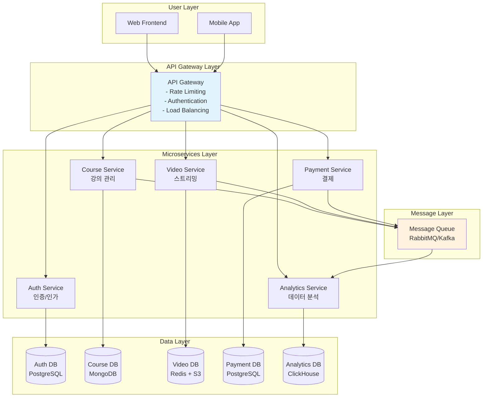
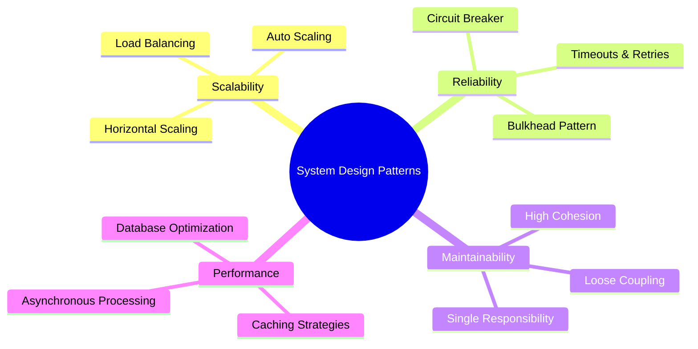
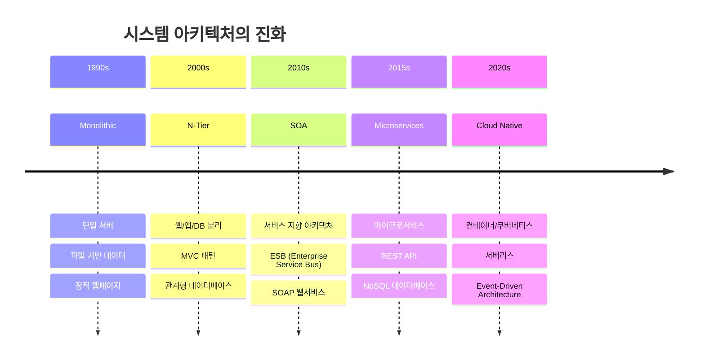
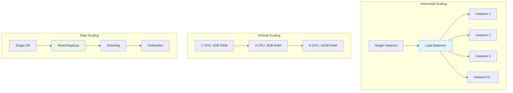
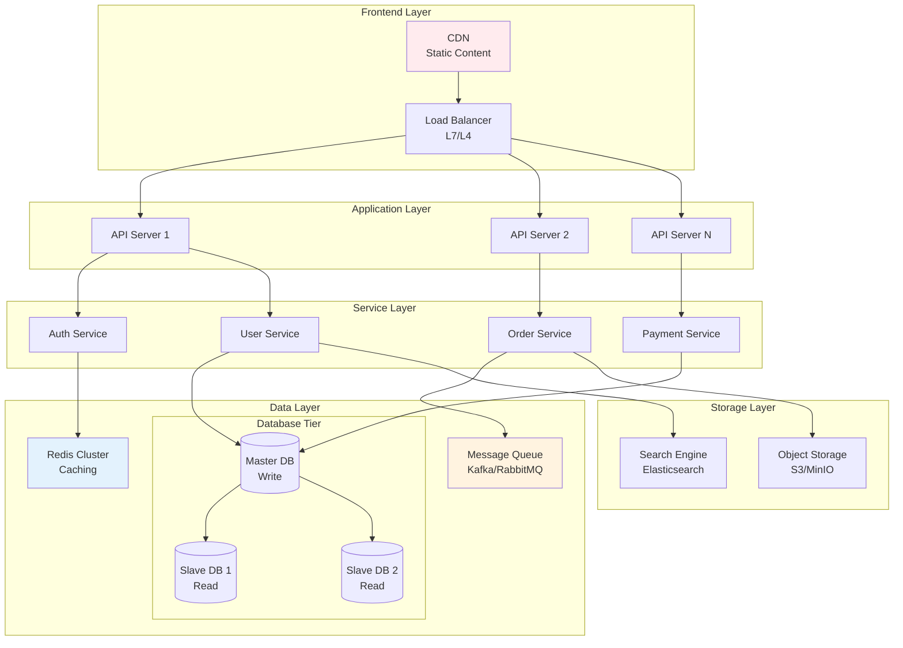

---
tags:
  - System Design
  - Architecture
  - Microservices
  - Distributed Systems
  - Guide
  - Patterns
---

# Chapter 15: System Design Patterns - 확장 가능한 아키텍처의 예술

## 이 장에서 다루는 내용

"우리가 만든 시스템이 Netflix처럼 확장될 수 있을까?" - 모든 개발자가 한 번쯤 꿈꾸는 질문입니다.

하지만 확장성은 하루아침에 얻어지는 것이 아닙니다. 수백만 사용자를 감당하는 시스템들은 모두 검증된 **설계 패턴**과 **아키텍처 원칙**을 바탕으로 구축됩니다.

이 장에서는 **실무에서 검증된 시스템 설계 패턴**부터 **현대적 분산 시스템 아키텍처**까지, 확장 가능하고 견고한 시스템을 설계하는 방법을 배웁니다.

## 왜 이것을 알아야 하는가?

### 🚀 2020년 3월 15일 - 코로나19와 함께 온 트래픽 폭증

제가 온라인 교육 플랫폼 CTO로 일할 때 겪었던 실제 이야기입니다. 갑작스러운 원격 수업 전환으로 우리 시스템이 극한의 상황을 맞았습니다.

**평상시와 코로나19 시기 비교**

```bash
📊 2020년 2월 (평상시):
- 동시 접속자: 5,000명
- 일일 활성 사용자: 50,000명
- 동영상 스트리밍: 10TB/day
- 서버 인스턴스: 20대

🔥 2020년 3월 (코로나19 시기):
- 동시 접속자: 80,000명 (16배 증가!)
- 일일 활성 사용자: 1,200,000명 (24배 증가!)
- 동영상 스트리밍: 450TB/day (45배 증가!)
- 필요 서버 인스턴스: ???
```

### 💥 기존 모놀리식 시스템의 한계

**3월 16일 월요일 오전 9시 - 대참사**

```bash
# 시스템 모니터링 알람이 쏟아집니다
🚨 Database connection pool exhausted
🚨 Memory usage: 98% (Out of memory!)
🚨 API response time: 30,000ms (timeout!)
🚨 Video streaming server crashed

# 기존 모놀리식 아키텍처
┌─────────────────────────────────┐
│        Monolithic App           │
│  ┌─────────────────────────────┐ │
│  │ User Auth + Course + Video  │ │ ← 하나의 거대한 애플리케이션
│  │ + Payment + Analytics       │ │
│  └─────────────────────────────┘ │
└─────────────────────────────────┘
             │
        ┌────▼────┐
        │ Database│  ← 단일 장애점
        └─────────┘

💥 문제점:
- 한 기능의 부하가 전체 시스템을 다운시킴
- 스케일링이 부분적으로 불가능
- 배포 시 전체 시스템 중단
- 기술 스택 변경의 어려움
```

### 🛠️ 마이크로서비스 아키텍처로의 대전환

**3일 만에 긴급 마이크로서비스 전환**



### 🎯 3일 후의 기적적 결과

**3월 19일 목요일 - 완전히 달라진 시스템**

```bash
✅ 성과:
- 동시 접속자 100,000명 처리 성공
- API 응답시간 50ms 이하 유지
- 서비스별 독립적 스케일링 가능
- 99.9% 가용성 달성

📊 서비스별 스케일링:
- Auth Service: 5개 인스턴스
- Course Service: 15개 인스턴스  
- Video Service: 50개 인스턴스 (가장 많은 부하)
- Payment Service: 3개 인스턴스
- Analytics Service: 10개 인스턴스

💡 핵심 깨달음:
"올바른 아키텍처 패턴은 시스템을 재앙에서 구원한다"
```

### 🧠 시스템 설계 패턴의 힘

이 경험을 통해 깨달은 **시스템 설계의 핵심 원리들**:



---

## 현대적 시스템 아키텍처의 진화

### 전통적 아키텍처에서 클라우드 네이티브까지



### 각 아키텍처의 장단점 비교

```bash
🏗️ Monolithic Architecture
✅ 장점:
- 개발 초기 단순함
- 로컬 트랜잭션 보장
- 디버깅 용이성
- 배포 단순함

❌ 단점:
- 기술 스택 제약
- 부분적 스케일링 불가
- 단일 장애점
- 대규모 팀 협업 어려움

🔧 적용 상황:
- 스타트업 초기 MVP
- 소규모 팀 (< 10명)
- 트래픽이 적은 서비스

---

🚀 Microservices Architecture  
✅ 장점:
- 독립적 개발/배포
- 기술 스택 자유도
- 부분적 스케일링
- 팀별 소유권 명확

❌ 단점:
- 분산 시스템 복잡성
- 네트워크 지연 시간
- 데이터 일관성 문제
- 운영 복잡도 증가

🔧 적용 상황:
- 대규모 서비스
- 여러 팀이 협업
- 높은 트래픽
- 빠른 기능 개발 필요

---

☁️ Serverless Architecture
✅ 장점:
- 서버 관리 불필요
- 사용량 기반 과금
- 자동 스케일링
- 빠른 개발/배포

❌ 단점:
- 콜드 스타트 지연
- 플랫폼 종속성
- 디버깅 어려움
- 실행 시간 제한

🔧 적용 상황:
- 이벤트 기반 처리
- 간헐적 작업
- 프로토타입 개발
- 비용 최적화 필요
```

---

## 이 장의 구성

### [15.1 마이크로서비스 아키텍처](01-microservices-architecture.md)

**"작은 것이 아름답다 - 하지만 복잡하다"**

- 🏗️ **마이크로서비스 설계 원칙**: 단일 책임, 데이터 소유권, 독립적 배포
- 🔄 **서비스 분해 전략**: Domain-Driven Design, Event Storming
- 🌐 **서비스 간 통신**: REST vs gRPC vs Message Queue
- 📊 **데이터 관리**: Database per Service, 분산 트랜잭션

```typescript
// 마이크로서비스 패턴 예제
interface UserService {
  createUser(userData: UserCreateRequest): Promise<User>;
  getUserById(id: string): Promise<User>;
  updateUserProfile(id: string, data: UserUpdateRequest): Promise<User>;
}

interface OrderService {
  createOrder(orderData: OrderCreateRequest): Promise<Order>;
  getOrderHistory(userId: string): Promise<Order[]>;
  updateOrderStatus(orderId: string, status: OrderStatus): Promise<void>;
}

// 서비스 간 이벤트 기반 통신
class UserEventPublisher {
  async publishUserCreated(user: User): Promise<void> {
    await this.messageQueue.publish('user.created', {
      userId: user.id,
      email: user.email,
      timestamp: Date.now()
    });
  }
}
```

### [15.2 이벤트 드리븐 아키텍처](02-event-driven-architecture.md)

**"변화를 받아들이는 것이 아니라, 변화에 반응하는 것"**

- 📡 **이벤트 스트리밍**: Apache Kafka, Event Sourcing
- 🎯 **이벤트 처리 패턴**: Event Sourcing, CQRS, Saga Pattern
- ⚡ **실시간 데이터 처리**: Stream Processing, Complex Event Processing
- 🔄 **이벤트 재처리**: Dead Letter Queue, Replay 메커니즘

```python
# Event-Driven Architecture 구현 예제
from dataclasses import dataclass
from datetime import datetime
from typing import List, Dict, Any
import asyncio

@dataclass
class Event:
    event_id: str
    event_type: str
    data: Dict[str, Any]
    timestamp: datetime
    version: int

class EventStore:
    def __init__(self):
        self.events: List[Event] = []
    
    async def append_event(self, event: Event):
        """이벤트를 스토어에 추가"""
        self.events.append(event)
        await self.notify_subscribers(event)
    
    async def get_events(self, aggregate_id: str) -> List[Event]:
        """특정 집합체의 모든 이벤트 조회"""
        return [e for e in self.events if e.data.get('aggregate_id') == aggregate_id]

class EventHandler:
    async def handle_user_created(self, event: Event):
        """사용자 생성 이벤트 처리"""
        user_data = event.data
        # 이메일 서비스에 환영 메일 발송 요청
        await self.email_service.send_welcome_email(user_data['email'])
        # 분석 서비스에 사용자 가입 이벤트 전송
        await self.analytics_service.track_user_signup(user_data)
```

### [15.3 CQRS와 이벤트 소싱](03-cqrs-event-sourcing.md)

**"읽기와 쓰기를 분리하면 마법이 일어난다"**

- 📖 **CQRS 패턴**: Command/Query 분리, 읽기/쓰기 모델 최적화
- 📚 **이벤트 소싱**: 상태 대신 변경 사항 저장, 시간 여행 가능
- 🔄 **프로젝션 관리**: Read Model 생성, 이벤트 재생
- ⚡ **성능 최적화**: 스냅샷, 캐싱 전략

```csharp
// CQRS + Event Sourcing 구현 (C#)
public class OrderAggregate 
{
    public string OrderId { get; private set; }
    public OrderStatus Status { get; private set; }
    public List<OrderItem> Items { get; private set; } = new();
    
    // Command: 주문 생성
    public IEnumerable<IEvent> CreateOrder(CreateOrderCommand command) 
    {
        // 비즈니스 로직 검증
        if (command.Items?.Any() != true)
            throw new InvalidOperationException("주문 항목이 없습니다");
            
        // 이벤트 생성
        yield return new OrderCreatedEvent 
        {
            OrderId = command.OrderId,
            CustomerId = command.CustomerId,
            Items = command.Items,
            Timestamp = DateTime.UtcNow
        };
    }
    
    // Event Handler: 상태 변경
    public void Apply(OrderCreatedEvent @event) 
    {
        OrderId = @event.OrderId;
        Status = OrderStatus.Created;
        Items = @event.Items.ToList();
    }
}

// Query Model (읽기 전용)
public class OrderReadModel 
{
    public string OrderId { get; set; }
    public string CustomerName { get; set; }
    public decimal TotalAmount { get; set; }
    public DateTime CreatedAt { get; set; }
    public List<OrderItemReadModel> Items { get; set; }
}
```

### [15.4 Saga 패턴](04-saga-pattern.md)

**"분산 트랜잭션의 구원자"**

- 🔄 **분산 트랜잭션 관리**: 장시간 실행되는 비즈니스 프로세스
- 📋 **Orchestration vs Choreography**: 중앙 집중형 vs 분산형 조정
- ↩️ **보상 트랜잭션**: 실패 시 롤백 전략
- 🎯 **Saga 패턴 구현**: State Machine, Event-driven Saga

```go
// Saga Pattern 구현 (Go)
package main

import (
    "context"
    "fmt"
    "time"
)

// Saga Step 인터페이스
type SagaStep interface {
    Execute(ctx context.Context, data interface{}) error
    Compensate(ctx context.Context, data interface{}) error
}

// 주문 처리 Saga
type OrderProcessingSaga struct {
    steps []SagaStep
    executedSteps []int
}

func (s *OrderProcessingSaga) Execute(ctx context.Context, orderData interface{}) error {
    // Forward recovery: 각 단계 순차 실행
    for i, step := range s.steps {
        if err := step.Execute(ctx, orderData); err != nil {
            // 실패 시 보상 트랜잭션 실행
            s.compensate(ctx, orderData)
            return fmt.Errorf("saga step %d failed: %w", i, err)
        }
        s.executedSteps = append(s.executedSteps, i)
    }
    return nil
}

func (s *OrderProcessingSaga) compensate(ctx context.Context, data interface{}) {
    // Backward recovery: 실행된 단계들을 역순으로 보상
    for i := len(s.executedSteps) - 1; i >= 0; i-- {
        stepIndex := s.executedSteps[i]
        if err := s.steps[stepIndex].Compensate(ctx, data); err != nil {
            // 보상 실패 로깅 (수동 개입 필요)
            fmt.Printf("보상 실패 - Step %d: %v\n", stepIndex, err)
        }
    }
}

// 실제 사용 예제
func main() {
    saga := &OrderProcessingSaga{
        steps: []SagaStep{
            &ReserveInventoryStep{},  // 재고 예약
            &ProcessPaymentStep{},    // 결제 처리  
            &CreateShipmentStep{},    // 배송 생성
            &SendConfirmationStep{},  // 확인 메일 발송
        },
    }
    
    orderData := map[string]interface{}{
        "orderId": "order-123",
        "amount": 99.99,
        "items": []string{"item1", "item2"},
    }
    
    if err := saga.Execute(context.Background(), orderData); err != nil {
        fmt.Printf("Saga 실행 실패: %v\n", err)
    } else {
        fmt.Println("주문 처리 완료!")
    }
}
```

### [15.5 API 게이트웨이 패턴](05-api-gateway-patterns.md)

**"마이크로서비스의 관문지기"**

- 🚪 **API 게이트웨이 역할**: 라우팅, 인증, 속도 제한, 모니터링
- 🔄 **백엔드 for 프론트엔드 (BFF)**: 클라이언트별 최적화된 API
- ⚡ **성능 최적화**: 응답 집계, 캐싱, 압축
- 🛡️ **보안 패턴**: OAuth 2.0 통합, API Key 관리, Rate Limiting

```javascript
// API Gateway 구현 예제 (Node.js + Express)
const express = require('express');
const httpProxy = require('http-proxy-middleware');
const rateLimit = require('express-rate-limit');
const jwt = require('jsonwebtoken');

class APIGateway {
    constructor() {
        this.app = express();
        this.setupMiddleware();
        this.setupRoutes();
    }
    
    setupMiddleware() {
        // Rate Limiting
        const limiter = rateLimit({
            windowMs: 15 * 60 * 1000, // 15분
            max: 100, // 최대 100 요청
            message: 'API 호출 한도를 초과했습니다'
        });
        
        this.app.use(limiter);
        this.app.use(express.json());
        this.app.use(this.authenticationMiddleware);
        this.app.use(this.loggingMiddleware);
    }
    
    setupRoutes() {
        // User Service 프록시
        this.app.use('/api/users', 
            this.createServiceProxy('http://user-service:3001')
        );
        
        // Order Service 프록시  
        this.app.use('/api/orders',
            this.createServiceProxy('http://order-service:3002')
        );
        
        // Payment Service 프록시
        this.app.use('/api/payments',
            this.createServiceProxy('http://payment-service:3003')
        );
        
        // API 집계 엔드포인트
        this.app.get('/api/dashboard/:userId', this.getDashboardData);
    }
    
    createServiceProxy(target) {
        return httpProxy({
            target,
            changeOrigin: true,
            onError: (err, req, res) => {
                console.error('프록시 오류:', err.message);
                res.status(503).json({ 
                    error: '서비스를 일시적으로 사용할 수 없습니다' 
                });
            },
            onProxyRes: (proxyRes, req, res) => {
                // 응답 헤더 조작
                proxyRes.headers['X-Gateway'] = 'API-Gateway-v1.0';
            }
        });
    }
    
    // 여러 서비스에서 데이터를 집계하는 BFF 패턴
    async getDashboardData(req, res) {
        const userId = req.params.userId;
        
        try {
            // 병렬로 여러 서비스 호출
            const [userInfo, recentOrders, paymentMethods] = await Promise.all([
                this.callService(`http://user-service:3001/users/${userId}`),
                this.callService(`http://order-service:3002/orders/user/${userId}?limit=5`),
                this.callService(`http://payment-service:3003/payment-methods/user/${userId}`)
            ]);
            
            // 클라이언트에 최적화된 형태로 집계
            const dashboard = {
                user: {
                    name: userInfo.name,
                    email: userInfo.email,
                    memberSince: userInfo.createdAt
                },
                recentActivity: {
                    orders: recentOrders.map(order => ({
                        id: order.id,
                        status: order.status,
                        total: order.totalAmount,
                        date: order.createdAt
                    }))
                },
                paymentInfo: {
                    hasPaymentMethod: paymentMethods.length > 0,
                    defaultCard: paymentMethods.find(pm => pm.isDefault)
                }
            };
            
            res.json(dashboard);
        } catch (error) {
            console.error('대시보드 데이터 집계 실패:', error);
            res.status(500).json({ error: '대시보드 데이터를 불러올 수 없습니다' });
        }
    }
    
    authenticationMiddleware(req, res, next) {
        // 공개 엔드포인트는 인증 스킵
        if (req.path.startsWith('/health') || req.path.startsWith('/docs')) {
            return next();
        }
        
        const token = req.headers.authorization?.replace('Bearer ', '');
        if (!token) {
            return res.status(401).json({ error: '인증 토큰이 필요합니다' });
        }
        
        try {
            const decoded = jwt.verify(token, process.env.JWT_SECRET);
            req.user = decoded;
            next();
        } catch (error) {
            res.status(401).json({ error: '유효하지 않은 토큰입니다' });
        }
    }
    
    loggingMiddleware(req, res, next) {
        const start = Date.now();
        
        res.on('finish', () => {
            const duration = Date.now() - start;
            console.log(JSON.stringify({
                method: req.method,
                url: req.url,
                status: res.statusCode,
                duration: `${duration}ms`,
                userAgent: req.headers['user-agent'],
                ip: req.ip,
                timestamp: new Date().toISOString()
            }));
        });
        
        next();
    }
}

const gateway = new APIGateway();
gateway.app.listen(3000, () => {
    console.log('API Gateway running on port 3000');
});
```

---

## 🏗️ 시스템 설계의 핵심 원칙들

### 1. 확장성 (Scalability)



### 2. 가용성 (Availability)

```bash
# 9의 법칙 - 가용성 레벨별 다운타임
99%      (Two 9s):     3.65 days/year
99.9%    (Three 9s):   8.76 hours/year  
99.99%   (Four 9s):    52.56 minutes/year
99.999%  (Five 9s):    5.26 minutes/year
99.9999% (Six 9s):     31.5 seconds/year

# 고가용성 구현 전략
1. 중복성 (Redundancy): 단일 장애점 제거
2. 장애 조치 (Failover): 자동 대체 시스템
3. 로드 밸런싱: 트래픽 분산
4. 헬스 체크: 상태 모니터링
5. Circuit Breaker: 연쇄 장애 방지
```

### 3. 일관성 (Consistency)

```python
# CAP 정리에 따른 일관성 모델들
class ConsistencyModels:
    
    # 강한 일관성 (Strong Consistency)
    def strong_consistency_example():
        """
        모든 노드가 항상 같은 데이터를 반환
        예: 전통적인 RDBMS, 금융 시스템
        """
        pass
    
    # 최종 일관성 (Eventual Consistency)  
    def eventual_consistency_example():
        """
        일정 시간 후 모든 노드가 같은 데이터로 수렴
        예: DNS, 소셜 미디어 피드
        """
        pass
    
    # 약한 일관성 (Weak Consistency)
    def weak_consistency_example():
        """
        일관성을 보장하지 않음
        예: 캐시, 실시간 게임
        """
        pass

# BASE vs ACID
"""
ACID (관계형 DB):
- Atomicity: 원자성
- Consistency: 일관성  
- Isolation: 격리성
- Durability: 지속성

BASE (NoSQL):
- Basically Available: 기본적 가용성
- Soft state: 유연한 상태
- Eventual consistency: 최종 일관성
"""
```

---

## 🎯 실전 시스템 설계 방법론

### 1. 시스템 설계 인터뷰 접근법

```bash
📋 시스템 설계 단계 (45분 인터뷰 기준):

1. 요구사항 명확화 (5분)
   - 기능 요구사항 정의
   - 비기능 요구사항 정의
   - 규모 추정 (사용자 수, 트래픽)

2. 고수준 설계 (10분)
   - 주요 컴포넌트 식별
   - API 설계
   - 데이터베이스 스키마

3. 상세 설계 (20분)
   - 각 컴포넌트 깊이 있게 설계
   - 확장성, 가용성 고려
   - 데이터 플로우 설계

4. 스케일업 고려사항 (10분)
   - 병목점 식별 및 해결
   - 모니터링 및 메트릭
   - 보안 고려사항
```

### 2. 대용량 시스템 설계 패턴



---

## 🚀 실습 프로젝트: 대용량 시스템 구축

### Week 1: 마이크로서비스 분해

```bash
# 기존 모놀리스를 마이크로서비스로 분해
$ docker-compose up -d
# - user-service (회원 관리)
# - product-service (상품 관리) 
# - order-service (주문 처리)
# - payment-service (결제 처리)
# - notification-service (알림 발송)
```

### Week 2: 이벤트 드리븐 아키텍처

```bash
# Kafka를 활용한 이벤트 스트리밍 구축
$ helm install kafka confluent/cp-helm-charts
$ kubectl apply -f event-driven-microservices.yaml

# 이벤트 플로우 테스팅
$ kafka-console-producer --topic user-events
$ kafka-console-consumer --topic order-events
```

### Week 3: CQRS + Event Sourcing

```bash
# EventStore 클러스터 구축
$ docker run -d --name eventstore-node1 \
  eventstore/eventstore:latest \
  --cluster-size=3 --discover-via-dns

# Read Model 프로젝션 구현
$ npm install @eventstore/db-client
$ node event-sourcing-projections.js
```

### Week 4: 종합 시스템 구축

```yaml
# Kubernetes에서 전체 마이크로서비스 배포
apiVersion: argoproj.io/v1alpha1
kind: Application
metadata:
  name: microservices-system
spec:
  source:
    repoURL: https://github.com/your-repo/microservices
    path: k8s/
  destination:
    server: https://kubernetes.default.svc
    namespace: production
```

---

## 💡 시스템 설계의 지혜

### 아키텍트들의 명언

#### Martin Fowler - 소프트웨어 아키텍트
>
> **"Any fool can write code that a computer can understand. Good programmers write code that humans can understand."**
>
> 시스템 설계도 마찬가지입니다. 기계가 실행할 수 있는 시스템은 누구나 만들 수 있지만, 사람이 이해하고 유지보수할 수 있는 시스템을 만드는 것이 진정한 실력입니다.

#### Werner Vogels - Amazon CTO  
>
> **"Everything fails all the time"**
>
> 대규모 분산 시스템에서는 장애가 정상적인 상황입니다. 장애를 방지하려 하지 말고, 장애에 견딜 수 있는 시스템을 설계하세요.

#### Pat Helland - 분산 시스템 전문가
>
> **"Data on the outside vs data on the inside"**
>
> 마이크로서비스에서는 서비스 내부의 데이터와 서비스 간에 공유되는 데이터를 명확히 구분해야 합니다.

### 🎯 시스템 설계의 황금률

```bash
1. 단순함이 최고다 (Simplicity is the ultimate sophistication)
   - 복잡한 것을 단순하게 만드는 것이 진정한 실력
   
2. 확장성을 처음부터 고려하라
   - 나중에 추가하기엔 너무 늦다
   
3. 장애는 언제나 일어난다
   - 장애 복구 시간을 최소화하라
   
4. 모니터링 없이는 운영할 수 없다
   - 측정할 수 없으면 개선할 수 없다
   
5. 보안은 나중에 추가할 수 없다
   - 처음부터 설계에 포함하라
```

---

## 흥미로운 사실들 🤓

### 대용량 시스템의 놀라운 숫자들

```bash
📊 Google (2023년 기준):
- 검색 쿼리: 초당 99,000건
- Gmail: 18억 사용자
- YouTube: 분당 500시간 영상 업로드
- 데이터센터: 전 세계 20개 이상

📊 Amazon (2023년 기준):  
- Prime Day 최고: 초당 70,000 주문
- AWS: 월 1조 API 호출 처리
- DynamoDB: 초당 2천만 요청 처리
- S3: 100조 개 이상 객체 저장

📊 Netflix (2023년 기준):
- 동시 스트리밍: 1억 5천만 세션
- 콘텐츠 전송량: 하루 250 페타바이트
- 마이크로서비스: 2,500개 이상
- 배포 빈도: 하루 4,000회
```

### 시스템 아키텍처의 역사

```bash
1960년대: 메인프레임 시대
- IBM System/360
- 단일 거대 컴퓨터
- 배치 처리 중심

1980년대: 클라이언트-서버 모델
- PC의 등장
- 분산 컴퓨팅의 시작
- SQL 데이터베이스

2000년대: 웹 서비스와 SOA
- XML, SOAP 프로토콜
- 서비스 지향 아키텍처
- 엔터프라이즈 서비스 버스

2010년대: 클라우드와 마이크로서비스
- AWS, Azure, GCP
- 컨테이너 기술 (Docker)
- REST API, JSON

2020년대: 서버리스와 엣지 컴퓨팅
- 함수형 컴퓨팅 (FaaS)
- 엣지 데이터센터
- AI/ML 통합 시스템
```

---

## 다음 단계

준비되셨나요? [15.1 마이크로서비스 아키텍처](01-microservices-architecture.md)에서 실제 마이크로서비스를 설계하고 구현하는 방법을 심도 있게 다뤄보겠습니다.

이제 당신은 단순한 애플리케이션 개발자가 아니라 **시스템 아키텍트**로서의 여정을 시작합니다.

"좋은 아키텍처는 결정을 미룰 수 있게 해준다" - Robert Martin의 말처럼, 올바른 설계 패턴을 통해 변화에 유연하게 대응할 수 있는 시스템을 만들어봅시다! 🏗️⚡
