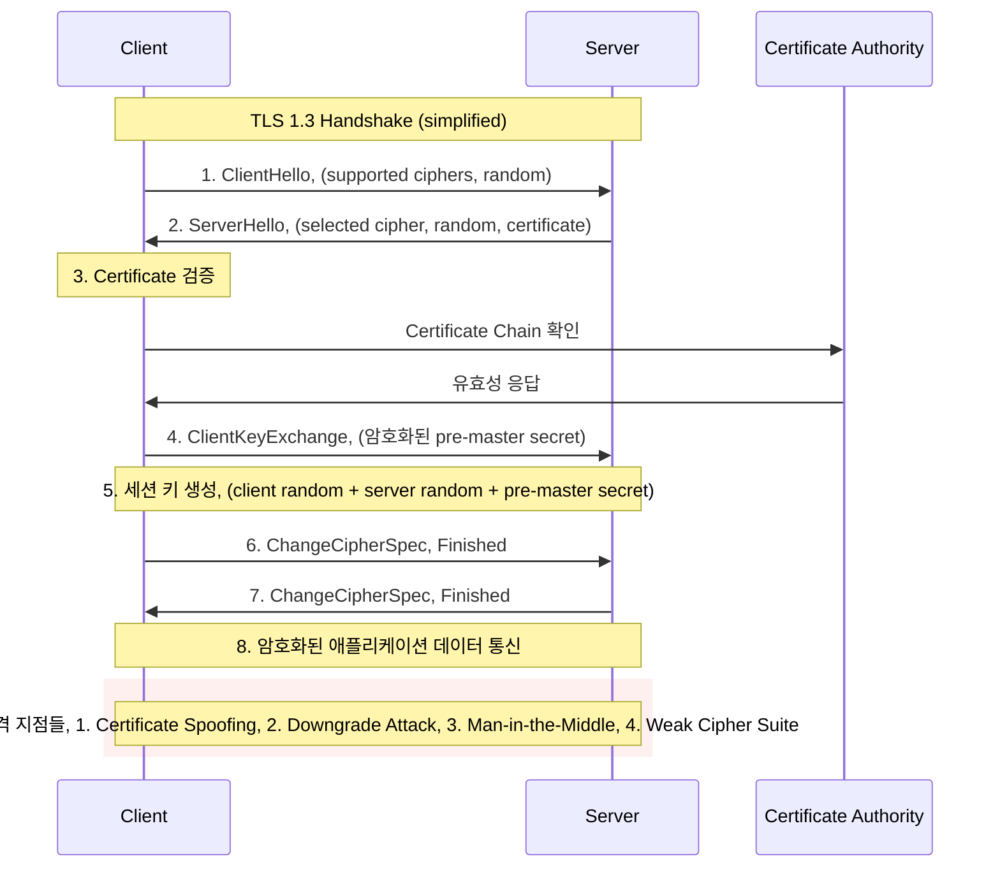

---
tags:
  - SSL
  - TLS
  - certificate_pinning
  - deep-study
  - encryption
  - hands-on
  - https
  - intermediate
  - 시스템프로그래밍
difficulty: INTERMEDIATE
learning_time: "8-12시간"
main_topic: "시스템 프로그래밍"
priority_score: 4
---

# Chapter 15-2b: TLS/SSL 프로토콜과 암호화 통신

## TLS/SSL: 안전한 통신의 기반

### TLS Handshake 과정과 보안 고려사항



### 실제 TLS 구현과 보안 설정

**nginx에서의 최신 TLS 보안 설정**:

```nginx
# nginx.conf - 프로덕션 등급 TLS 설정
server {
    listen 443 ssl http2;
    server_name your-domain.com;

    # 인증서 설정
    ssl_certificate /path/to/fullchain.pem;
    ssl_certificate_key /path/to/privkey.pem;
    ssl_trusted_certificate /path/to/chain.pem;

    # TLS 버전 제한 (오직 1.2, 1.3만 허용)
    ssl_protocols TLSv1.2 TLSv1.3;

    # 강력한 cipher suite만 허용
    ssl_ciphers ECDHE-ECDSA-AES256-GCM-SHA384:ECDHE-RSA-AES256-GCM-SHA384:ECDHE-ECDSA-CHACHA20-POLY1305:ECDHE-RSA-CHACHA20-POLY1305:ECDHE-ECDSA-AES128-GCM-SHA256:ECDHE-RSA-AES128-GCM-SHA256;
    ssl_prefer_server_ciphers off;  # TLS 1.3에서는 클라이언트 선택 우선

    # Perfect Forward Secrecy를 위한 DH 파라미터
    ssl_dhparam /path/to/dhparam.pem;

    # OCSP Stapling (인증서 상태 확인 최적화)
    ssl_stapling on;
    ssl_stapling_verify on;
    resolver 8.8.8.8 8.8.4.4 valid=300s;
    resolver_timeout 5s;

    # 세션 설정
    ssl_session_cache shared:SSL:50m;
    ssl_session_timeout 1d;
    ssl_session_tickets off;  # 보안을 위해 비활성화

    # 보안 헤더들
    add_header Strict-Transport-Security "max-age=63072000; includeSubDomains; preload" always;
    add_header X-Frame-Options DENY always;
    add_header X-Content-Type-Options nosniff always;
    add_header X-XSS-Protection "1; mode=block" always;
    add_header Referrer-Policy "strict-origin-when-cross-origin" always;

    # CSP (Content Security Policy)
    add_header Content-Security-Policy "default-src 'self'; script-src 'self' 'unsafe-inline'; style-src 'self' 'unsafe-inline'; img-src 'self' data: https:; font-src 'self';" always;
}
```

**Apache에서의 TLS 보안 설정**:

```apache
# apache-ssl.conf - Apache 2.4 TLS 보안 설정
<VirtualHost *:443>
    ServerName your-domain.com
    DocumentRoot /var/www/html

    # SSL 엔진 활성화
    SSLEngine on
    
    # 인증서 설정
    SSLCertificateFile /path/to/cert.pem
    SSLCertificateKeyFile /path/to/private.key
    SSLCertificateChainFile /path/to/chain.pem

    # TLS 프로토콜 제한
    SSLProtocol -all +TLSv1.2 +TLSv1.3

    # Cipher Suite 설정 (Mozilla Modern 기준)
    SSLCipherSuite ECDHE-ECDSA-AES256-GCM-SHA384:ECDHE-RSA-AES256-GCM-SHA384:ECDHE-ECDSA-CHACHA20-POLY1305:ECDHE-RSA-CHACHA20-POLY1305:ECDHE-ECDSA-AES128-GCM-SHA256:ECDHE-RSA-AES128-GCM-SHA256
    SSLHonorCipherOrder off

    # Perfect Forward Secrecy
    SSLUseStapling on
    SSLStaplingCache "shmcb:logs/ssl_stapling(32768)"

    # 세션 캐시
    SSLSessionCache "shmcb:logs/ssl_scache(512000)"
    SSLSessionCacheTimeout 300

    # 보안 헤더
    Header always set Strict-Transport-Security "max-age=63072000; includeSubDomains; preload"
    Header always set X-Frame-Options DENY
    Header always set X-Content-Type-Options nosniff
    Header always set X-XSS-Protection "1; mode=block"
    Header always set Referrer-Policy "strict-origin-when-cross-origin"
</VirtualHost>
```

### TLS 보안 설정 검증 도구

```python
#!/usr/bin/env python3
# tls_security_scanner.py - TLS 보안 설정 검증 도구

import ssl
import socket
import json
import subprocess
import concurrent.futures
from urllib.parse import urlparse
from datetime import datetime, timedelta

class TLSSecurityScanner:
    def __init__(self):
        self.weak_ciphers = [
            'RC4', 'DES', '3DES', 'MD5', 'SHA1',
            'NULL', 'EXPORT', 'ANONYMOUS'
        ]
        
        self.deprecated_protocols = [
            'SSLv2', 'SSLv3', 'TLSv1.0', 'TLSv1.1'
        ]
        
        self.required_headers = [
            'Strict-Transport-Security',
            'X-Content-Type-Options', 
            'X-Frame-Options',
            'X-XSS-Protection'
        ]

    def scan_tls_configuration(self, hostname, port=443):
        """TLS 설정 종합 검사"""
        print(f"🔍 TLS 보안 검사 시작: {hostname}:{port}")
        
        results = {
            'hostname': hostname,
            'port': port,
            'timestamp': datetime.now().isoformat(),
            'certificate': {},
            'protocols': {},
            'ciphers': {},
            'headers': {},
            'vulnerabilities': [],
            'recommendations': [],
            'overall_grade': 'F'
        }

        try:
            # 1. 인증서 검사
            cert_info = self.check_certificate(hostname, port)
            results['certificate'] = cert_info
            
            # 2. 지원되는 TLS 프로토콜 검사
            protocol_info = self.check_supported_protocols(hostname, port)
            results['protocols'] = protocol_info
            
            # 3. Cipher Suite 검사
            cipher_info = self.check_cipher_suites(hostname, port)
            results['ciphers'] = cipher_info
            
            # 4. 보안 헤더 검사
            header_info = self.check_security_headers(hostname, port)
            results['headers'] = header_info
            
            # 5. 취약점 및 권장사항 분석
            self.analyze_vulnerabilities(results)
            
            # 6. 전체 보안 등급 계산
            results['overall_grade'] = self.calculate_security_grade(results)
            
        except Exception as e:
            results['error'] = str(e)
            print(f"❌ 스캔 중 오류 발생: {e}")
        
        return results

    def check_certificate(self, hostname, port):
        """SSL 인증서 검사"""
        try:
            context = ssl.create_default_context()
            
            with socket.create_connection((hostname, port), timeout=10) as sock:
                with context.wrap_socket(sock, server_hostname=hostname) as ssock:
                    cert = ssock.getpeercert()
                    
                    # 인증서 유효기간 검사
                    not_after = datetime.strptime(cert['notAfter'], '%b %d %H:%M:%S %Y %Z')
                    not_before = datetime.strptime(cert['notBefore'], '%b %d %H:%M:%S %Y %Z')
                    days_until_expiry = (not_after - datetime.now()).days
                    
                    # Subject Alternative Names 검사
                    san_list = []
                    if 'subjectAltName' in cert:
                        san_list = [name[1] for name in cert['subjectAltName'] if name[0] == 'DNS']
                    
                    return {
                        'subject': dict(x[0] for x in cert['subject']),
                        'issuer': dict(x[0] for x in cert['issuer']), 
                        'version': cert['version'],
                        'serial_number': cert['serialNumber'],
                        'not_before': cert['notBefore'],
                        'not_after': cert['notAfter'],
                        'days_until_expiry': days_until_expiry,
                        'subject_alt_names': san_list,
                        'is_expired': days_until_expiry < 0,
                        'expires_soon': days_until_expiry < 30
                    }
                    
        except Exception as e:
            return {'error': str(e)}

    def check_supported_protocols(self, hostname, port):
        """지원되는 TLS 프로토콜 버전 검사"""
        protocols_to_test = [
            ('SSLv2', ssl.PROTOCOL_SSLv23),  # 실제로는 사용 불가
            ('SSLv3', ssl.PROTOCOL_SSLv23),  # 실제로는 사용 불가  
            ('TLSv1.0', ssl.PROTOCOL_TLSv1 if hasattr(ssl, 'PROTOCOL_TLSv1') else None),
            ('TLSv1.1', ssl.PROTOCOL_TLSv1_1 if hasattr(ssl, 'PROTOCOL_TLSv1_1') else None),
            ('TLSv1.2', ssl.PROTOCOL_TLSv1_2 if hasattr(ssl, 'PROTOCOL_TLSv1_2') else None),
            ('TLSv1.3', ssl.PROTOCOL_TLS if hasattr(ssl, 'PROTOCOL_TLS') else None)
        ]
        
        supported_protocols = {}
        
        for protocol_name, protocol_const in protocols_to_test:
            if protocol_const is None:
                continue
                
            try:
                context = ssl.SSLContext(protocol_const)
                context.check_hostname = False
                context.verify_mode = ssl.CERT_NONE
                
                with socket.create_connection((hostname, port), timeout=5) as sock:
                    with context.wrap_socket(sock) as ssock:
                        supported_protocols[protocol_name] = {
                            'supported': True,
                            'cipher': ssock.cipher(),
                            'version': ssock.version()
                        }
            except:
                supported_protocols[protocol_name] = {'supported': False}
        
        return supported_protocols

    def check_cipher_suites(self, hostname, port):
        """Cipher Suite 보안성 검사"""
        try:
            context = ssl.create_default_context()
            
            with socket.create_connection((hostname, port), timeout=10) as sock:
                with context.wrap_socket(sock, server_hostname=hostname) as ssock:
                    cipher_info = ssock.cipher()
                    
                    if cipher_info:
                        cipher_name, protocol_version, bits = cipher_info
                        
                        # 약한 암호화 알고리즘 검사
                        is_weak = any(weak in cipher_name.upper() for weak in self.weak_ciphers)
                        
                        return {
                            'current_cipher': cipher_name,
                            'protocol_version': protocol_version,
                            'key_bits': bits,
                            'is_weak_cipher': is_weak,
                            'supports_forward_secrecy': 'ECDHE' in cipher_name or 'DHE' in cipher_name
                        }
            
        except Exception as e:
            return {'error': str(e)}

    def check_security_headers(self, hostname, port):
        """HTTP 보안 헤더 검사"""
        try:
            import http.client
            
            if port == 443:
                conn = http.client.HTTPSConnection(hostname, timeout=10)
            else:
                conn = http.client.HTTPConnection(hostname, port, timeout=10)
            
            conn.request("GET", "/")
            response = conn.getresponse()
            headers = dict(response.getheaders())
            conn.close()
            
            security_headers = {}
            
            for header in self.required_headers:
                security_headers[header] = {
                    'present': header in headers,
                    'value': headers.get(header, None)
                }
            
            # HSTS 상세 분석
            if 'Strict-Transport-Security' in headers:
                hsts_value = headers['Strict-Transport-Security']
                security_headers['HSTS_Analysis'] = {
                    'has_max_age': 'max-age=' in hsts_value,
                    'includes_subdomains': 'includeSubDomains' in hsts_value,
                    'preload': 'preload' in hsts_value
                }
            
            return security_headers
            
        except Exception as e:
            return {'error': str(e)}

    def analyze_vulnerabilities(self, results):
        """취약점 분석 및 권고사항 생성"""
        vulnerabilities = []
        recommendations = []
        
        # 인증서 관련 취약점
        cert = results.get('certificate', {})
        if cert.get('is_expired'):
            vulnerabilities.append('EXPIRED_CERTIFICATE')
            recommendations.append('인증서를 즉시 갱신하세요')
        elif cert.get('expires_soon'):
            vulnerabilities.append('CERTIFICATE_EXPIRES_SOON')
            recommendations.append('인증서 만료 전에 갱신 계획을 세우세요')
        
        # 프로토콜 관련 취약점
        protocols = results.get('protocols', {})
        for deprecated in self.deprecated_protocols:
            if protocols.get(deprecated, {}).get('supported'):
                vulnerabilities.append(f'DEPRECATED_PROTOCOL_{deprecated}')
                recommendations.append(f'{deprecated} 프로토콜을 비활성화하세요')
        
        # Cipher Suite 관련 취약점
        cipher_info = results.get('ciphers', {})
        if cipher_info.get('is_weak_cipher'):
            vulnerabilities.append('WEAK_CIPHER_SUITE')
            recommendations.append('약한 암호화 알고리즘을 사용하지 않도록 설정하세요')
        
        if not cipher_info.get('supports_forward_secrecy'):
            vulnerabilities.append('NO_PERFECT_FORWARD_SECRECY')
            recommendations.append('Perfect Forward Secrecy를 지원하는 Cipher Suite를 사용하세요')
        
        # 보안 헤더 관련 취약점
        headers = results.get('headers', {})
        for header in self.required_headers:
            if not headers.get(header, {}).get('present'):
                vulnerabilities.append(f'MISSING_SECURITY_HEADER_{header}')
                recommendations.append(f'{header} 헤더를 추가하세요')
        
        results['vulnerabilities'] = vulnerabilities
        results['recommendations'] = recommendations

    def calculate_security_grade(self, results):
        """보안 등급 계산 (A+ ~ F)"""
        score = 100
        
        # 인증서 문제 (-20점)
        if results['certificate'].get('is_expired'):
            score -= 20
        elif results['certificate'].get('expires_soon'):
            score -= 5
        
        # 프로토콜 문제 (각각 -15점)
        for deprecated in self.deprecated_protocols:
            if results.get('protocols', {}).get(deprecated, {}).get('supported'):
                score -= 15
        
        # Cipher Suite 문제 (-10점)
        if results.get('ciphers', {}).get('is_weak_cipher'):
            score -= 10
        
        if not results.get('ciphers', {}).get('supports_forward_secrecy'):
            score -= 10
        
        # 보안 헤더 문제 (각각 -5점)
        headers = results.get('headers', {})
        for header in self.required_headers:
            if not headers.get(header, {}).get('present'):
                score -= 5
        
        # 등급 계산
        if score >= 95:
            return 'A+'
        elif score >= 90:
            return 'A'
        elif score >= 85:
            return 'A-'
        elif score >= 80:
            return 'B+'
        elif score >= 75:
            return 'B'
        elif score >= 70:
            return 'B-'
        elif score >= 65:
            return 'C+'
        elif score >= 60:
            return 'C'
        elif score >= 55:
            return 'C-'
        elif score >= 50:
            return 'D'
        else:
            return 'F'

    def generate_report(self, results):
        """보안 검사 보고서 생성"""
        print("=" * 60)
        print(f"🔒 TLS 보안 검사 보고서")
        print(f"📅 검사일: {results['timestamp']}")
        print(f"🌐 대상: {results['hostname']}:{results['port']}")
        print(f"📊 전체 등급: {results['overall_grade']}")
        print("=" * 60)
        
        # 인증서 정보
        cert = results.get('certificate', {})
        if 'error' not in cert:
            print("📜 인증서 정보:")
            print(f"  발급자: {cert.get('issuer', {}).get('organizationName', 'N/A')}")
            print(f"  유효기간: {cert.get('not_after', 'N/A')}")
            print(f"  만료까지: {cert.get('days_until_expiry', 'N/A')}일")
            
            if cert.get('is_expired'):
                print("  ❌ 인증서가 만료되었습니다!")
            elif cert.get('expires_soon'):
                print("  ⚠️ 인증서가 곧 만료됩니다!")
            else:
                print("  ✅ 인증서가 유효합니다")
        
        # 프로토콜 지원 현황
        print("\n🔐 지원 프로토콜:")
        protocols = results.get('protocols', {})
        for protocol, info in protocols.items():
            if info.get('supported'):
                if protocol in self.deprecated_protocols:
                    print(f"  ❌ {protocol}: 지원됨 (비추천)")
                else:
                    print(f"  ✅ {protocol}: 지원됨")
            else:
                if protocol in self.deprecated_protocols:
                    print(f"  ✅ {protocol}: 비활성화됨 (권장)")
                else:
                    print(f"  ⚠️ {protocol}: 지원되지 않음")
        
        # 보안 헤더 현황
        print("\n🛡️ 보안 헤더:")
        headers = results.get('headers', {})
        for header in self.required_headers:
            if headers.get(header, {}).get('present'):
                print(f"  ✅ {header}: 설정됨")
            else:
                print(f"  ❌ {header}: 누락")
        
        # 취약점 요약
        vulnerabilities = results.get('vulnerabilities', [])
        if vulnerabilities:
            print(f"\n🚨 발견된 취약점 ({len(vulnerabilities)}개):")
            for vuln in vulnerabilities:
                print(f"  - {vuln}")
        else:
            print("\n✅ 발견된 취약점 없음")
        
        # 권장사항
        recommendations = results.get('recommendations', [])
        if recommendations:
            print(f"\n💡 권장사항 ({len(recommendations)}개):")
            for rec in recommendations:
                print(f"  - {rec}")

# 사용 예시
if __name__ == "__main__":
    scanner = TLSSecurityScanner()
    
    # 테스트할 도메인들
    test_domains = [
        'google.com',
        'github.com', 
        'stackoverflow.com'
    ]
    
    for domain in test_domains:
        print(f"\n{'='*80}")
        results = scanner.scan_tls_configuration(domain)
        scanner.generate_report(results)
        
        # JSON 형태로 상세 결과 저장
        with open(f'tls_scan_{domain}_{datetime.now().strftime("%Y%m%d_%H%M")}.json', 'w') as f:
            json.dump(results, f, indent=2, ensure_ascii=False)
```

### TLS 취약점과 공격 기법들

#### 1. SSL Strip 공격 (프로토콜 다운그레이드)

```python
#!/usr/bin/env python3
# sslstrip_demo.py - SSL Strip 공격 시연 (교육 목적)

from scapy.all import *
import re

def process_packet(packet):
    if packet.haslayer(Raw):
        payload = packet[Raw].load.decode('utf-8', errors='ignore')

        # HTTPS 링크를 HTTP로 변경
        if 'https://' in payload:
            print(f"[ATTACK] Stripping HTTPS from: {payload[:100]}...")
            modified_payload = payload.replace('https://', 'http://')

            # 패킷 수정 (실제로는 더 복잡한 과정 필요)
            packet[Raw].load = modified_payload.encode()

    return packet

# 네트워크 인터페이스에서 HTTP 트래픽 감시
# 주의: 교육 목적으로만 사용, 실제 공격은 불법
sniff(filter="tcp port 80", prn=process_packet, iface="wlan0")
```

#### 2. Certificate Pinning으로 중간자 공격 방어

```javascript
// 웹 애플리케이션에서의 Certificate Pinning
class SecureHTTPSClient {
    constructor() {
        this.expectedFingerprints = [
            'sha256/YLh1dUR9y6Kja30RrAn7JKnbQG/uEtLMkBgFF2Fuihg=',  // 현재 인증서
            'sha256/Vjs8r4z+80wjNcr1YKepWQboSIRi63WsWXhIMN+eWys='   // 백업 인증서
        ];
    }

    async makeSecureRequest(url) {
        try {
            const response = await fetch(url, {
                method: 'GET',
                headers: {
                    'Accept': 'application/json',
                }
            });

            // 실제 구현에서는 브라우저 API로 인증서 fingerprint 확인
            await this.validateCertificatePin(response);

            return response;
        } catch (error) {
            console.error('Secure request failed:', error);
            throw new Error('Certificate pinning validation failed');
        }
    }

    async validateCertificatePin(response) {
        // Simplified certificate validation
        const serverCert = await this.getCertificateFingerprint(response);

        if (!this.expectedFingerprints.includes(serverCert)) {
            throw new Error('Certificate pinning failed - potential MITM attack');
        }

        console.log('Certificate pinning validation passed');
    }

    async getCertificateFingerprint(response) {
        // 실제 구현에서는 Web Crypto API 또는 서버에서 헤더로 전달
        // 여기서는 시뮬레이션
        return 'sha256/YLh1dUR9y6Kja30RrAn7JKnbQG/uEtLMkBgFF2Fuihg=';
    }
}

// 사용 예시
const client = new SecureHTTPSClient();
client.makeSecureRequest('https://api.example.com/sensitive-data');
```

#### 3. 모바일 앱에서의 Certificate Pinning (Android)

```java
// Android 앱에서의 Certificate Pinning 구현
public class SecureNetworkManager {
    private OkHttpClient client;
    
    public SecureNetworkManager() {
        // Certificate Pinning 설정
        CertificatePinner certificatePinner = new CertificatePinner.Builder()
            .add("api.yourservice.com", "sha256/YLh1dUR9y6Kja30RrAn7JKnbQG/uEtLMkBgFF2Fuihg=")
            .add("api.yourservice.com", "sha256/Vjs8r4z+80wjNcr1YKepWQboSIRi63WsWXhIMN+eWys=")
            .build();
        
        this.client = new OkHttpClient.Builder()
            .certificatePinner(certificatePinner)
            .connectTimeout(30, TimeUnit.SECONDS)
            .readTimeout(30, TimeUnit.SECONDS)
            .addInterceptor(new SecurityHeaderInterceptor())
            .build();
    }
    
    public Response makeSecureRequest(String url) throws IOException {
        Request request = new Request.Builder()
            .url(url)
            .addHeader("User-Agent", "YourApp/1.0")
            .addHeader("Accept", "application/json")
            .build();
            
        try {
            Response response = client.newCall(request).execute();
            
            // 추가 보안 검증
            if (!response.isSuccessful()) {
                throw new SecurityException("Request failed with code: " + response.code());
            }
            
            // TLS 버전 검증
            String tlsVersion = response.handshake().tlsVersion().javaName();
            if (!tlsVersion.startsWith("TLSv1.2") && !tlsVersion.startsWith("TLSv1.3")) {
                throw new SecurityException("Insecure TLS version: " + tlsVersion);
            }
            
            return response;
            
        } catch (SSLPeerUnverifiedException e) {
            // Certificate Pinning 실패
            throw new SecurityException("Certificate pinning failed", e);
        }
    }
    
    // 보안 헤더 검증 인터셉터
    private class SecurityHeaderInterceptor implements Interceptor {
        @Override
        public Response intercept(Chain chain) throws IOException {
            Response response = chain.proceed(chain.request());
            
            // 보안 헤더 검증
            String hsts = response.header("Strict-Transport-Security");
            if (hsts == null || !hsts.contains("max-age")) {
                Log.w("Security", "HSTS header missing or invalid");
            }
            
            return response;
        }
    }
}
```

## 핵심 요점

### 🎯 TLS 보안 설정 원칙

1. **최신 TLS 버전 사용**: TLS 1.2 이상 강제, TLS 1.3 권장
2. **강력한 Cipher Suite**: ECDHE, AES-GCM, ChaCha20-Poly1305 사용
3. **Perfect Forward Secrecy**: DHE 또는 ECDHE 키 교환 방식
4. **인증서 관리**: 유효한 CA 인증서, 정기적인 갱신
5. **보안 헤더**: HSTS, CSP 등 필수 헤더 설정

### ⚠️ 흔한 TLS 설정 실수들

```bash
# ❌ 위험한 TLS 설정들
1. 약한 프로토콜 허용 (SSLv3, TLS 1.0/1.1)
2. 취약한 Cipher Suite 사용 (RC4, DES, 3DES)
3. Self-signed 인증서 사용 (프로덕션 환경)
4. 보안 헤더 누락 (HSTS, CSP 등)
5. Certificate Pinning 미적용 (모바일 앱)

# ✅ 올바른 TLS 설정들
1. TLS 1.2+ 강제, TLS 1.3 우선
2. AEAD 암호화 방식 사용 (GCM, Poly1305)
3. 공인 CA에서 발급받은 유효한 인증서
4. 모든 보안 헤더 적용
5. Certificate/Public Key Pinning 구현
```

### 🛡️ TLS 보안 체크리스트

```bash
# TLS 보안 점검 항목
✅ TLS 1.2+ 강제 설정
✅ 강력한 cipher suite만 허용
✅ Perfect Forward Secrecy 지원
✅ HSTS 헤더 설정 (preload 포함)
✅ OCSP Stapling 활성화
✅ Certificate Pinning 구현 (모바일/API)
✅ 정기적인 인증서 갱신 계획
✅ TLS 설정 정기 검사
✅ 보안 헤더 전체 적용
✅ 취약점 스캐너로 정기 점검
```

---

**이전**: [네트워크 보안 기초와 위협 환경](chapter-17-security-engineering/17-01-network-fundamentals.md)  
**다음**: [DDoS 공격 탐지와 방어 시스템](chapter-17-security-engineering/17-13-ddos-defense.md)에서 대규모 분산 공격에 대한 탐지와 방어 메커니즘을 학습합니다.

## 📚 관련 문서

### 📖 현재 문서 정보

- **난이도**: INTERMEDIATE
- **주제**: 시스템 프로그래밍
- **예상 시간**: 8-12시간

### 🎯 학습 경로

- [📚 INTERMEDIATE 레벨 전체 보기](../learning-paths/intermediate/)
- [🏠 메인 학습 경로](../learning-paths/)
- [📋 전체 가이드 목록](../README.md)

### 📂 같은 챕터 (chapter-15-security-engineering)

- [Chapter 15-1: 메모리 보안 - 메모리 공격과 방어의 과학](./17-10-memory-security.md)
- [Chapter 15.2 네트워크 보안 개요](./17-11-network-security.md)
- [Chapter 15-2a: 네트워크 보안 기초와 위협 환경](./17-01-network-fundamentals.md)
- [Chapter 15-2c: DDoS 공격 탐지와 방어 시스템](./17-13-ddos-defense.md)
- [Chapter 15-2d: Zero Trust 아키텍처와 고급 모니터링](./17-40-zero-trust-monitoring.md)

### 🏷️ 관련 키워드

`TLS`, `SSL`, `certificate_pinning`, `encryption`, `https`

### ⏭️ 다음 단계 가이드

- 실무 적용을 염두에 두고 프로젝트에 적용해보세요
- 관련 도구들을 직접 사용해보는 것이 중요합니다
