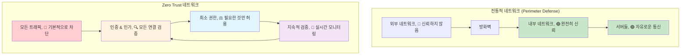

---
tags:
  - advanced
  - deep-study
  - hands-on
  - mtls
  - security_automation
  - service_mesh
  - threat_detection
  - zero_trust
  - 인프라스트럭처
difficulty: ADVANCED
learning_time: "15-25시간"
main_topic: "인프라스트럭처"
priority_score: 5
---

# Chapter 15-2d: Zero Trust 아키텍처와 고급 모니터링

## Zero Trust 네트워킹

### Zero Trust 모델의 핵심 원칙



### mTLS (Mutual TLS) 구현

```go
// mtls_server.go - mTLS 서버 구현
package main

import (
    "crypto/tls"
    "crypto/x509"
    "fmt"
    "io/ioutil"
    "log"
    "net/http"
    "time"
)

func setupMTLSServer() *http.Server {
    // 클라이언트 인증서를 검증할 CA 인증서 로드
    caCert, err := ioutil.ReadFile("ca-cert.pem")
    if err != nil {
        log.Fatal("Failed to read CA certificate:", err)
    }

    caCertPool := x509.NewCertPool()
    if !caCertPool.AppendCertsFromPEM(caCert) {
        log.Fatal("Failed to parse CA certificate")
    }

    // mTLS 설정
    tlsConfig := &tls.Config{
        // 클라이언트 인증서 요구
        ClientAuth: tls.RequireAndVerifyClientCert,
        ClientCAs:  caCertPool,

        // 서버 인증서 설정
        Certificates: []tls.Certificate{loadServerCertificate()},

        // 보안 강화 설정
        MinVersion: tls.VersionTLS12,
        CipherSuites: []uint16{
            tls.TLS_ECDHE_RSA_WITH_AES_256_GCM_SHA384,
            tls.TLS_ECDHE_ECDSA_WITH_AES_256_GCM_SHA384,
            tls.TLS_ECDHE_RSA_WITH_CHACHA20_POLY1305,
            tls.TLS_ECDHE_ECDSA_WITH_CHACHA20_POLY1305,
        },
    }

    server := &http.Server{
        Addr:      ":8443",
        TLSConfig: tlsConfig,
        Handler:   setupMTLSHandlers(),
    }

    return server
}

func setupMTLSHandlers() http.Handler {
    mux := http.NewServeMux()

    // 인증된 클라이언트만 접근 가능한 엔드포인트
    mux.HandleFunc("/api/sensitive", func(w http.ResponseWriter, r *http.Request) {
        // 클라이언트 인증서 정보 추출
        if r.TLS == nil || len(r.TLS.PeerCertificates) == 0 {
            http.Error(w, "No client certificate provided", http.StatusUnauthorized)
            return
        }

        clientCert := r.TLS.PeerCertificates[0]
        clientCN := clientCert.Subject.CommonName

        // 클라이언트 인증서 유효성 추가 검증
        if !isAuthorizedClient(clientCert) {
            log.Printf("Unauthorized client attempt: %s", clientCN)
            http.Error(w, "Client not authorized", http.StatusForbidden)
            return
        }

        log.Printf("Authorized client connected: %s", clientCN)

        // 비즈니스 로직 처리
        response := fmt.Sprintf(`{
            "message": "Welcome, %s!",
            "timestamp": "%v",
            "sensitive_data": "This data requires mTLS authentication"
        }`, clientCN, time.Now().Format(time.RFC3339))

        w.Header().Set("Content-Type", "application/json")
        w.WriteHeader(http.StatusOK)
        w.Write([]byte(response))
    })

    return mux
}

func isAuthorizedClient(cert *x509.Certificate) bool {
    // 허용된 클라이언트 목록 (실제로는 데이터베이스나 설정 파일에서)
    authorizedClients := map[string]bool{
        "client-service-1": true,
        "client-service-2": true,
        "admin-client":     true,
    }

    clientCN := cert.Subject.CommonName

    // 1. Common Name 확인
    if !authorizedClients[clientCN] {
        return false
    }

    // 2. 인증서 유효기간 확인 (추가 검증)
    if cert.NotAfter.Before(time.Now()) {
        log.Printf("Client certificate expired: %s", clientCN)
        return false
    }

    // 3. 인증서 해지 목록(CRL) 확인 (실제 환경에서는 필수)
    if isRevokedCertificate(cert) {
        log.Printf("Client certificate revoked: %s", clientCN)
        return false
    }

    return true
}

func isRevokedCertificate(cert *x509.Certificate) bool {
    // 실제 구현에서는 CRL(Certificate Revocation List) 또는 
    // OCSP(Online Certificate Status Protocol) 확인
    // 여기서는 시뮬레이션
    return false
}

func loadServerCertificate() tls.Certificate {
    cert, err := tls.LoadX509KeyPair("server-cert.pem", "server-key.pem")
    if err != nil {
        log.Fatal("Failed to load server certificate:", err)
    }
    return cert
}

// 클라이언트 예시
func createMTLSClient() *http.Client {
    // 클라이언트 인증서 로드
    clientCert, err := tls.LoadX509KeyPair("client-cert.pem", "client-key.pem")
    if err != nil {
        log.Fatal("Failed to load client certificate:", err)
    }

    // 서버 CA 인증서 로드
    caCert, err := ioutil.ReadFile("ca-cert.pem")
    if err != nil {
        log.Fatal("Failed to read CA certificate:", err)
    }

    caCertPool := x509.NewCertPool()
    caCertPool.AppendCertsFromPEM(caCert)

    // mTLS 클라이언트 설정
    tlsConfig := &tls.Config{
        Certificates: []tls.Certificate{clientCert},
        RootCAs:      caCertPool,
        ServerName:   "server.example.com", // 서버 인증서의 CN과 일치해야 함
    }

    transport := &http.Transport{
        TLSClientConfig: tlsConfig,
    }

    return &http.Client{
        Transport: transport,
        Timeout:   30 * time.Second,
    }
}

// 사용 예시
func main() {
    // mTLS 서버 시작
    server := setupMTLSServer()
    
    log.Println("🔒 mTLS 서버 시작: https://localhost:8443")
    log.Fatal(server.ListenAndServeTLS("", ""))
}
```

### Service Mesh 보안 (Istio 예시)

```yaml
# istio-security-policies.yaml - Service Mesh 보안 정책
apiVersion: security.istio.io/v1beta1
kind: AuthorizationPolicy
metadata:
  name: frontend-authz
  namespace: production
spec:
  selector:
    matchLabels:
      app: frontend
  rules:
  # 인증된 사용자만 허용
  - from:
    - source:
        principals: ["cluster.local/ns/production/sa/frontend-service"]
    to:
    - operation:
        methods: ["GET", "POST"]
    when:
    - key: request.headers[authorization]
      values: ["Bearer *"]

---
apiVersion: security.istio.io/v1beta1
kind: AuthorizationPolicy
metadata:
  name: database-authz
  namespace: production
spec:
  selector:
    matchLabels:
      app: database
  rules:
  # 오직 백엔드 서비스만 데이터베이스 접근 허용
  - from:
    - source:
        principals: ["cluster.local/ns/production/sa/backend-service"]
    to:
    - operation:
        ports: ["5432"]  # PostgreSQL 포트
    when:
    - key: source.ip
      values: ["10.0.0.0/16"]  # 내부 네트워크에서만

---
apiVersion: security.istio.io/v1beta1
kind: PeerAuthentication
metadata:
  name: default
  namespace: production
spec:
  # 모든 서비스 간 통신에 mTLS 강제
  mtls:
    mode: STRICT

---
apiVersion: networking.istio.io/v1beta1
kind: DestinationRule
metadata:
  name: default
  namespace: production
spec:
  host: "*.local"
  trafficPolicy:
    tls:
      mode: ISTIO_MUTUAL  # Istio mTLS 사용

---
# 네트워크 정책으로 추가 보안 계층
apiVersion: networking.k8s.io/v1
kind: NetworkPolicy
metadata:
  name: deny-all-default
  namespace: production
spec:
  podSelector: {}
  policyTypes:
  - Ingress
  - Egress
  # 기본적으로 모든 트래픽 차단

---
apiVersion: networking.k8s.io/v1
kind: NetworkPolicy
metadata:
  name: allow-frontend-to-backend
  namespace: production
spec:
  podSelector:
    matchLabels:
      app: backend
  policyTypes:
  - Ingress
  ingress:
  - from:
    - podSelector:
        matchLabels:
          app: frontend
    ports:
    - protocol: TCP
      port: 8080
```

## 네트워크 보안 모니터링

### 실시간 위협 탐지 시스템

```python
#!/usr/bin/env python3
# network_threat_detector.py - 고급 네트워크 위협 탐지

import asyncio
import json
import time
from collections import defaultdict, deque
from datetime import datetime, timedelta
import numpy as np
from sklearn.ensemble import IsolationForest
import logging

class NetworkThreatDetector:
    def __init__(self):
        self.connection_patterns = defaultdict(deque)
        self.traffic_baseline = {}
        self.anomaly_detector = IsolationForest(contamination=0.1, random_state=42)
        self.threat_signatures = self.load_threat_signatures()

        # 위협 카테고리별 임계값
        self.thresholds = {
            'port_scan': {'unique_ports': 10, 'time_window': 60},
            'brute_force': {'failed_attempts': 5, 'time_window': 300},
            'data_exfiltration': {'data_size': 100*1024*1024, 'time_window': 3600},
            'lateral_movement': {'unique_targets': 5, 'time_window': 1800}
        }

        self.setup_logging()

    def setup_logging(self):
        logging.basicConfig(
            level=logging.INFO,
            format='%(asctime)s - %(name)s - %(levelname)s - %(message)s',
            handlers=[
                logging.FileHandler('network_threats.log'),
                logging.StreamHandler()
            ]
        )
        self.logger = logging.getLogger(__name__)

    def load_threat_signatures(self):
        """알려진 위협 시그니처 로드"""
        return {
            'malware_c2': [
                r'.*\.onion\.',  # Tor 도메인
                r'[0-9]{1,3}\.[0-9]{1,3}\.[0-9]{1,3}\.[0-9]{1,3}:[0-9]+',  # 직접 IP 연결
                r'.*\.tk\.',     # 의심스러운 TLD
            ],
            'suspicious_user_agents': [
                r'sqlmap',
                r'nikto',
                r'masscan',
                r'nmap',
                r'bot',
            ],
            'attack_patterns': [
                r'union.*select',    # SQL Injection
                r'<script.*>',       # XSS
                r'\.\./',           # Directory Traversal
                r'cmd\.exe',        # Command Injection
            ]
        }

    async def analyze_connection(self, src_ip, dst_ip, dst_port, protocol, payload=None):
        """단일 연결 분석"""
        current_time = datetime.now()
        connection_key = f"{src_ip}->{dst_ip}:{dst_port}"

        # 연결 패턴 기록
        self.connection_patterns[src_ip].append({
            'timestamp': current_time,
            'dst_ip': dst_ip,
            'dst_port': dst_port,
            'protocol': protocol,
            'payload_size': len(payload) if payload else 0
        })

        # 탐지 알고리즘 실행
        threats = []

        # 1. 포트 스캔 탐지
        port_scan_threat = await self.detect_port_scan(src_ip)
        if port_scan_threat:
            threats.append(port_scan_threat)

        # 2. 브루트 포스 공격 탐지
        brute_force_threat = await self.detect_brute_force(src_ip, dst_ip, dst_port)
        if brute_force_threat:
            threats.append(brute_force_threat)

        # 3. 데이터 탈취 탐지
        if payload:
            exfiltration_threat = await self.detect_data_exfiltration(src_ip, payload)
            if exfiltration_threat:
                threats.append(exfiltration_threat)

        # 4. 측면 이동 탐지
        lateral_threat = await self.detect_lateral_movement(src_ip)
        if lateral_threat:
            threats.append(lateral_threat)

        # 위협 발견 시 알림
        for threat in threats:
            await self.handle_threat(threat, connection_key)

        return threats

    async def detect_port_scan(self, src_ip):
        """포트 스캔 공격 탐지"""
        recent_connections = self.get_recent_connections(src_ip, 60)  # 최근 1분

        if not recent_connections:
            return None

        # 고유한 포트 수 계산
        unique_ports = set(conn['dst_port'] for conn in recent_connections)
        unique_hosts = set(conn['dst_ip'] for conn in recent_connections)

        if len(unique_ports) > self.thresholds['port_scan']['unique_ports']:
            return {
                'type': 'port_scan',
                'severity': 'high',
                'src_ip': src_ip,
                'details': {
                    'unique_ports': len(unique_ports),
                    'unique_hosts': len(unique_hosts),
                    'ports': list(unique_ports)[:20]  # 처음 20개만 로그
                }
            }

        return None

    async def detect_brute_force(self, src_ip, dst_ip, dst_port):
        """브루트 포스 공격 탐지 (로그인 서비스)"""
        if dst_port not in [22, 21, 23, 3389, 443, 80]:  # 일반적인 로그인 포트
            return None

        recent_connections = self.get_recent_connections(src_ip, 300)  # 최근 5분
        same_target_connections = [
            conn for conn in recent_connections
            if conn['dst_ip'] == dst_ip and conn['dst_port'] == dst_port
        ]

        if len(same_target_connections) > self.thresholds['brute_force']['failed_attempts']:
            return {
                'type': 'brute_force',
                'severity': 'high',
                'src_ip': src_ip,
                'dst_ip': dst_ip,
                'dst_port': dst_port,
                'details': {
                    'attempts': len(same_target_connections),
                    'service': self.get_service_name(dst_port)
                }
            }

        return None

    async def detect_data_exfiltration(self, src_ip, payload):
        """데이터 탈취 탐지"""
        recent_connections = self.get_recent_connections(src_ip, 3600)  # 최근 1시간

        # 총 데이터 전송량 계산
        total_data = sum(conn['payload_size'] for conn in recent_connections)

        if total_data > self.thresholds['data_exfiltration']['data_size']:
            return {
                'type': 'data_exfiltration',
                'severity': 'critical',
                'src_ip': src_ip,
                'details': {
                    'total_data_mb': total_data / (1024 * 1024),
                    'connections': len(recent_connections)
                }
            }

        return None

    async def detect_lateral_movement(self, src_ip):
        """측면 이동 탐지 (내부 네트워크에서 여러 호스트로 연결)"""
        if not self.is_internal_ip(src_ip):
            return None

        recent_connections = self.get_recent_connections(src_ip, 1800)  # 최근 30분
        unique_internal_targets = set(
            conn['dst_ip'] for conn in recent_connections
            if self.is_internal_ip(conn['dst_ip'])
        )

        if len(unique_internal_targets) > self.thresholds['lateral_movement']['unique_targets']:
            return {
                'type': 'lateral_movement',
                'severity': 'high',
                'src_ip': src_ip,
                'details': {
                    'unique_targets': len(unique_internal_targets),
                    'targets': list(unique_internal_targets)[:10]  # 처음 10개만
                }
            }

        return None

    def get_recent_connections(self, src_ip, seconds):
        """최근 N초간의 연결 기록 반환"""
        cutoff_time = datetime.now() - timedelta(seconds=seconds)
        connections = self.connection_patterns.get(src_ip, [])

        return [conn for conn in connections if conn['timestamp'] > cutoff_time]

    def is_internal_ip(self, ip):
        """내부 네트워크 IP 확인"""
        private_ranges = [
            '10.0.0.0/8',
            '172.16.0.0/12',
            '192.168.0.0/16'
        ]
        # 실제로는 ipaddress 모듈 사용
        return ip.startswith('10.') or ip.startswith('192.168.') or ip.startswith('172.')

    def get_service_name(self, port):
        """포트 번호로 서비스 이름 반환"""
        services = {
            22: 'SSH',
            21: 'FTP',
            23: 'Telnet',
            25: 'SMTP',
            53: 'DNS',
            80: 'HTTP',
            443: 'HTTPS',
            3389: 'RDP'
        }
        return services.get(port, f'Port-{port}')

    async def handle_threat(self, threat, connection_key):
        """위협 탐지 시 처리"""
        self.logger.critical(f"🚨 THREAT DETECTED: {threat['type']}")
        self.logger.critical(f"   Severity: {threat['severity']}")
        self.logger.critical(f"   Source IP: {threat['src_ip']}")
        self.logger.critical(f"   Details: {json.dumps(threat['details'], indent=2)}")

        # 자동 대응 조치
        if threat['severity'] == 'critical':
            await self.execute_emergency_response(threat)
        elif threat['severity'] == 'high':
            await self.execute_high_priority_response(threat)

    async def execute_emergency_response(self, threat):
        """긴급 대응 조치"""
        src_ip = threat['src_ip']

        # 1. 즉시 IP 차단
        await self.block_ip_immediately(src_ip)

        # 2. 관련 세션 모두 종료
        await self.terminate_all_sessions(src_ip)

        # 3. 긴급 알림 발송
        await self.send_critical_alert(threat)

        self.logger.critical(f"Emergency response executed for {src_ip}")

    async def execute_high_priority_response(self, threat):
        """높은 우선순위 대응"""
        src_ip = threat['src_ip']

        # 1. Rate limiting 강화
        await self.apply_aggressive_rate_limiting(src_ip)

        # 2. 추가 모니터링 시작
        await self.start_enhanced_monitoring(src_ip)

        # 3. 보안팀 알림
        await self.notify_security_team(threat)

    async def block_ip_immediately(self, ip):
        """즉시 IP 차단"""
        import subprocess

        try:
            # iptables를 사용한 즉시 차단
            cmd = f"iptables -I INPUT 1 -s {ip} -j DROP"
            result = subprocess.run(cmd.split(), capture_output=True, text=True)

            if result.returncode == 0:
                self.logger.info(f"Successfully blocked IP: {ip}")
            else:
                self.logger.error(f"Failed to block IP {ip}: {result.stderr}")

        except Exception as e:
            self.logger.error(f"Error blocking IP {ip}: {e}")

    async def terminate_all_sessions(self, ip):
        """특정 IP의 모든 세션 종료"""
        # 실제 구현에서는 네트워크 장비 API 또는 시스템 명령 사용
        self.logger.info(f"Terminating all sessions for IP: {ip}")

    async def send_critical_alert(self, threat):
        """긴급 알림 발송"""
        # 실제 환경에서는 PagerDuty, Slack, SMS 등
        alert_message = f"🚨 CRITICAL THREAT: {threat['type']} from {threat['src_ip']}"
        self.logger.critical(f"ALERT SENT: {alert_message}")

    async def apply_aggressive_rate_limiting(self, ip):
        """강화된 Rate Limiting 적용"""
        self.logger.info(f"Applying aggressive rate limiting for IP: {ip}")

    async def start_enhanced_monitoring(self, ip):
        """강화된 모니터링 시작"""
        self.logger.info(f"Starting enhanced monitoring for IP: {ip}")

    async def notify_security_team(self, threat):
        """보안팀 알림"""
        notification = {
            'timestamp': datetime.now().isoformat(),
            'threat_type': threat['type'],
            'severity': threat['severity'],
            'source_ip': threat['src_ip'],
            'details': threat['details']
        }
        
        # 실제로는 Slack, Email, SIEM 시스템에 전송
        self.logger.info(f"Security team notified: {json.dumps(notification)}")

# 사용 예시와 테스트
async def simulate_network_traffic():
    """네트워크 트래픽 시뮬레이션"""
    detector = NetworkThreatDetector()

    # 정상 트래픽
    await detector.analyze_connection("192.168.1.100", "192.168.1.200", 80, "TCP")
    await detector.analyze_connection("192.168.1.100", "192.168.1.201", 443, "TCP")

    # 포트 스캔 시뮬레이션
    print("시뮬레이션: 포트 스캔 공격")
    for port in range(20, 35):  # 15개 포트 스캔
        await detector.analyze_connection("10.0.0.1", "192.168.1.200", port, "TCP")
        await asyncio.sleep(0.1)

    # 브루트 포스 시뮬레이션
    print("시뮬레이션: SSH 브루트 포스")
    for i in range(10):  # 10번 연속 시도
        await detector.analyze_connection("203.0.113.50", "192.168.1.200", 22, "TCP")
        await asyncio.sleep(0.5)

    # 측면 이동 시뮬레이션
    print("시뮬레이션: 내부 네트워크 측면 이동")
    for i in range(10):  # 10개 내부 호스트에 연결
        target_ip = f"192.168.1.{200 + i}"
        await detector.analyze_connection("192.168.1.150", target_ip, 445, "TCP")  # SMB
        await asyncio.sleep(0.2)

if __name__ == "__main__":
    asyncio.run(simulate_network_traffic())
```

### 네트워크 보안 메트릭 대시보드

```python
#!/usr/bin/env python3
# security_metrics_dashboard.py - 보안 메트릭 대시보드

import json
import time
from datetime import datetime, timedelta
from collections import defaultdict, Counter
import matplotlib.pyplot as plt
import seaborn as sns
import pandas as pd
from typing import Dict, List, Any

class SecurityMetricsDashboard:
    def __init__(self):
        self.metrics_data = defaultdict(list)
        self.alert_history = []
        self.threat_categories = [
            'port_scan', 'brute_force', 'data_exfiltration', 
            'lateral_movement', 'ddos', 'malware_c2'
        ]
        
    def record_metric(self, metric_type: str, value: Any, timestamp: datetime = None):
        """보안 메트릭 기록"""
        if timestamp is None:
            timestamp = datetime.now()
            
        self.metrics_data[metric_type].append({
            'timestamp': timestamp,
            'value': value
        })

    def record_security_alert(self, alert_data: Dict):
        """보안 알림 기록"""
        alert_data['timestamp'] = datetime.now()
        self.alert_history.append(alert_data)

    def generate_hourly_threat_report(self, hours: int = 24) -> Dict:
        """시간대별 위협 현황 보고서"""
        cutoff_time = datetime.now() - timedelta(hours=hours)
        recent_alerts = [
            alert for alert in self.alert_history 
            if alert['timestamp'] > cutoff_time
        ]
        
        # 시간대별 분류
        hourly_stats = defaultdict(lambda: defaultdict(int))
        
        for alert in recent_alerts:
            hour = alert['timestamp'].strftime('%Y-%m-%d %H:00')
            threat_type = alert.get('type', 'unknown')
            hourly_stats[hour][threat_type] += 1
        
        return dict(hourly_stats)

    def calculate_security_score(self) -> Dict:
        """전체 보안 점수 계산"""
        recent_24h = datetime.now() - timedelta(hours=24)
        recent_alerts = [
            alert for alert in self.alert_history
            if alert['timestamp'] > recent_24h
        ]
        
        # 기본 점수 100에서 시작
        base_score = 100
        
        # 알림 유형별 감점
        severity_penalties = {
            'critical': 20,
            'high': 10,
            'medium': 5,
            'low': 2
        }
        
        total_penalty = 0
        for alert in recent_alerts:
            severity = alert.get('severity', 'medium')
            total_penalty += severity_penalties.get(severity, 5)
        
        security_score = max(0, base_score - total_penalty)
        
        return {
            'score': security_score,
            'grade': self.get_security_grade(security_score),
            'alerts_24h': len(recent_alerts),
            'penalty_applied': total_penalty,
            'details': {
                'by_severity': Counter(alert.get('severity', 'unknown') for alert in recent_alerts),
                'by_type': Counter(alert.get('type', 'unknown') for alert in recent_alerts)
            }
        }

    def get_security_grade(self, score: int) -> str:
        """보안 점수를 등급으로 변환"""
        if score >= 95:
            return 'A+'
        elif score >= 90:
            return 'A'
        elif score >= 85:
            return 'B+'
        elif score >= 80:
            return 'B'
        elif score >= 70:
            return 'C'
        elif score >= 60:
            return 'D'
        else:
            return 'F'

    def generate_top_attackers_report(self, limit: int = 10) -> List[Dict]:
        """상위 공격자 IP 분석"""
        recent_24h = datetime.now() - timedelta(hours=24)
        recent_alerts = [
            alert for alert in self.alert_history
            if alert['timestamp'] > recent_24h and 'src_ip' in alert
        ]
        
        ip_stats = defaultdict(lambda: {
            'count': 0,
            'types': [],
            'severities': [],
            'first_seen': None,
            'last_seen': None
        })
        
        for alert in recent_alerts:
            src_ip = alert['src_ip']
            stats = ip_stats[src_ip]
            
            stats['count'] += 1
            stats['types'].append(alert.get('type', 'unknown'))
            stats['severities'].append(alert.get('severity', 'unknown'))
            
            if stats['first_seen'] is None or alert['timestamp'] < stats['first_seen']:
                stats['first_seen'] = alert['timestamp']
            if stats['last_seen'] is None or alert['timestamp'] > stats['last_seen']:
                stats['last_seen'] = alert['timestamp']
        
        # 가장 활발한 공격자들 정렬
        top_attackers = sorted(
            ip_stats.items(),
            key=lambda x: x[1]['count'],
            reverse=True
        )[:limit]
        
        result = []
        for ip, stats in top_attackers:
            result.append({
                'ip': ip,
                'alert_count': stats['count'],
                'attack_types': list(set(stats['types'])),
                'max_severity': max(stats['severities'], key=lambda x: ['low', 'medium', 'high', 'critical'].index(x)) if stats['severities'] else 'unknown',
                'first_seen': stats['first_seen'].isoformat(),
                'last_seen': stats['last_seen'].isoformat(),
                'duration_hours': (stats['last_seen'] - stats['first_seen']).total_seconds() / 3600
            })
        
        return result

    def visualize_threat_timeline(self, hours: int = 24):
        """위협 타임라인 시각화"""
        cutoff_time = datetime.now() - timedelta(hours=hours)
        recent_alerts = [
            alert for alert in self.alert_history
            if alert['timestamp'] > cutoff_time
        ]
        
        if not recent_alerts:
            print("📊 표시할 위협 데이터가 없습니다.")
            return
        
        # 데이터 준비
        df_data = []
        for alert in recent_alerts:
            df_data.append({
                'timestamp': alert['timestamp'],
                'type': alert.get('type', 'unknown'),
                'severity': alert.get('severity', 'unknown'),
                'src_ip': alert.get('src_ip', 'unknown')
            })
        
        df = pd.DataFrame(df_data)
        
        # 시간대별 위협 수 그래프
        plt.figure(figsize=(15, 10))
        
        # 서브플롯 1: 시간대별 위협 수
        plt.subplot(2, 2, 1)
        df['hour'] = df['timestamp'].dt.hour
        hourly_counts = df.groupby('hour').size()
        plt.bar(hourly_counts.index, hourly_counts.values, color='red', alpha=0.7)
        plt.title('시간대별 위협 탐지 수')
        plt.xlabel('시간')
        plt.ylabel('위협 수')
        plt.xticks(range(24))
        
        # 서브플롯 2: 위협 유형별 분포
        plt.subplot(2, 2, 2)
        type_counts = df['type'].value_counts()
        plt.pie(type_counts.values, labels=type_counts.index, autopct='%1.1f%%')
        plt.title('위협 유형별 분포')
        
        # 서브플롯 3: 심각도별 분포
        plt.subplot(2, 2, 3)
        severity_counts = df['severity'].value_counts()
        colors = {'critical': 'red', 'high': 'orange', 'medium': 'yellow', 'low': 'green'}
        bar_colors = [colors.get(severity, 'gray') for severity in severity_counts.index]
        plt.bar(severity_counts.index, severity_counts.values, color=bar_colors)
        plt.title('심각도별 분포')
        plt.ylabel('위협 수')
        
        # 서브플롯 4: 상위 공격 IP
        plt.subplot(2, 2, 4)
        top_ips = df['src_ip'].value_counts().head(10)
        plt.barh(range(len(top_ips)), top_ips.values)
        plt.yticks(range(len(top_ips)), top_ips.index)
        plt.title('상위 공격 IP (TOP 10)')
        plt.xlabel('공격 횟수')
        
        plt.tight_layout()
        plt.savefig(f'security_dashboard_{datetime.now().strftime("%Y%m%d_%H%M")}.png', dpi=300, bbox_inches='tight')
        plt.show()

    def export_security_report(self, filename: str = None) -> str:
        """보안 보고서 JSON 내보내기"""
        if filename is None:
            filename = f"security_report_{datetime.now().strftime('%Y%m%d_%H%M')}.json"
        
        report_data = {
            'generated_at': datetime.now().isoformat(),
            'security_score': self.calculate_security_score(),
            'threat_summary_24h': self.generate_hourly_threat_report(24),
            'top_attackers': self.generate_top_attackers_report(20),
            'total_alerts': len(self.alert_history),
            'alert_categories': {
                category: len([alert for alert in self.alert_history if alert.get('type') == category])
                for category in self.threat_categories
            }
        }
        
        with open(filename, 'w', encoding='utf-8') as f:
            json.dump(report_data, f, ensure_ascii=False, indent=2, default=str)
        
        print(f"📊 보안 보고서 저장 완료: {filename}")
        return filename

# 사용 예시
def simulate_security_dashboard():
    dashboard = SecurityMetricsDashboard()
    
    # 시뮬레이션 데이터 생성
    import random
    
    threat_types = ['port_scan', 'brute_force', 'ddos', 'malware_c2']
    severities = ['low', 'medium', 'high', 'critical']
    
    # 24시간 동안의 가상 알림 생성
    for i in range(200):  # 200개 알림
        alert_time = datetime.now() - timedelta(hours=random.uniform(0, 24))
        
        alert_data = {
            'type': random.choice(threat_types),
            'severity': random.choice(severities),
            'src_ip': f"10.0.{random.randint(0, 255)}.{random.randint(1, 254)}",
            'timestamp': alert_time,
            'details': {
                'port': random.choice([22, 80, 443, 445, 3389]),
                'attempts': random.randint(1, 100)
            }
        }
        
        dashboard.record_security_alert(alert_data)
    
    # 보안 점수 출력
    security_score = dashboard.calculate_security_score()
    print("🏆 현재 보안 점수:")
    print(f"   점수: {security_score['score']}/100 (등급: {security_score['grade']})")
    print(f"   24시간 알림 수: {security_score['alerts_24h']}")
    
    # 상위 공격자 리포트
    print("\n🎯 상위 공격자 (TOP 5):")
    top_attackers = dashboard.generate_top_attackers_report(5)
    for i, attacker in enumerate(top_attackers, 1):
        print(f"   {i}. {attacker['ip']} - {attacker['alert_count']}회 공격 ({attacker['max_severity']} 심각도)")
    
    # 시각화 생성
    dashboard.visualize_threat_timeline(24)
    
    # 보고서 내보내기
    report_file = dashboard.export_security_report()
    
    return dashboard, report_file

if __name__ == "__main__":
    # 보안 대시보드 시뮬레이션 실행
    dashboard, report_file = simulate_security_dashboard()
    print(f"\n✅ 보안 대시보드 시뮬레이션 완료")
    print(f"📄 상세 보고서: {report_file}")
```

## 핵심 요점 정리

### 🎯 네트워크 보안의 원칙들

1. **Zero Trust**: 어떤 네트워크 트래픽도 기본적으로 신뢰하지 않음
2. **심층 방어**: 여러 계층의 보안 장치로 다중 보호
3. **지속적 모니터링**: 실시간 위협 탐지와 대응
4. **최소 권한**: 필요한 최소한의 네트워크 접근만 허용
5. **암호화 우선**: 모든 통신은 암호화를 전제로 설계

### ⚠️ 흔한 실수들

```bash
# ❌ 위험한 네트워크 보안 실수들
1. 기본 인증서 사용 (self-signed, 만료된 인증서)
2. 약한 TLS 설정 (SSLv3, TLS 1.0 허용)
3. 내부 네트워크 과신 (동일 네트워크 내 무제한 접근)
4. 로그 미수집 (네트워크 트래픽 분석 불가)
5. 패치 미적용 (알려진 취약점 방치)

# ✅ 올바른 접근들
1. 공식 CA에서 발급받은 유효한 인증서 사용
2. TLS 1.2+ 강제, 강력한 cipher suite 선택
3. 내부 네트워크도 Zero Trust 원칙 적용
4. 모든 네트워크 트래픽 로그 수집 및 분석
5. 정기적인 보안 패치와 취약점 스캔
```

### 🛡️ 실무 보안 체크리스트

```bash
# 네트워크 보안 점검 항목
✅ TLS 1.2+ 강제 설정
✅ 강력한 cipher suite만 허용
✅ HSTS, CSP 등 보안 헤더 적용
✅ Certificate Pinning 구현
✅ DDoS 방어 시스템 구축
✅ WAF/IPS 적용
✅ 네트워크 세분화 (Network Segmentation)
✅ mTLS 구현 (서비스 간 통신)
✅ 실시간 위협 탐지 시스템
✅ 정기적인 침투 테스팅
```

### 🔮 미래의 네트워크 보안

**새로운 위협과 대응**:

- **AI 기반 공격**: 머신러닝을 활용한 고도화된 공격
- **IoT 보안**: 수십억 개의 연결 기기 보안 관리
- **5G/6G 보안**: 새로운 네트워크 기술의 보안 위험
- **양자 컴퓨팅**: 기존 암호화의 한계와 양자내성 암호화

**진화하는 방어 기술**:

- **AI 기반 위협 탐지**: 패턴 인식과 이상 탐지
- **자동화된 보안 대응**: SOAR 플랫폼과 자동화
- **제로 트러스트 확산**: 모든 인프라의 제로 트러스트 적용
- **클라우드 네이티브 보안**: 컨테이너와 서버리스 환경 보안

---

**이전**: [DDoS 공격 탐지와 방어 시스템](chapter-17-security-engineering/17-13-ddos-defense.md)  
**다음**: [인증과 인가](./17-14-authentication-authorization.md)에서 애플리케이션 레벨 보안과 현대적인 인증 시스템을 학습합니다.

**Key Takeaway**: "네트워크는 적대적 환경입니다. 모든 통신을 암호화하고, 모든 연결을 의심하며, 지속적으로 모니터링하세요." 🌐🔒

## 📚 관련 문서

### 📖 현재 문서 정보

- **난이도**: ADVANCED
- **주제**: 인프라스트럭처
- **예상 시간**: 15-25시간

### 🎯 학습 경로

- [📚 ADVANCED 레벨 전체 보기](../learning-paths/advanced/)
- [🏠 메인 학습 경로](../learning-paths/)
- [📋 전체 가이드 목록](../README.md)

### 📂 같은 챕터 (chapter-15-security-engineering)

- [Chapter 15-1: 메모리 보안 - 메모리 공격과 방어의 과학](./17-10-memory-security.md)
- [Chapter 15.2 네트워크 보안 개요](./17-11-network-security.md)
- [Chapter 15-2a: 네트워크 보안 기초와 위협 환경](./17-01-network-fundamentals.md)
- [Chapter 15-2b: TLS/SSL 프로토콜과 암호화 통신](./17-12-tls-protocols.md)
- [Chapter 15-2c: DDoS 공격 탐지와 방어 시스템](./17-13-ddos-defense.md)

### 🏷️ 관련 키워드

`zero_trust`, `mtls`, `service_mesh`, `threat_detection`, `security_automation`

### ⏭️ 다음 단계 가이드

- 시스템 전체의 관점에서 이해하려 노력하세요
- 다른 고급 주제들과의 연관성을 파악해보세요
