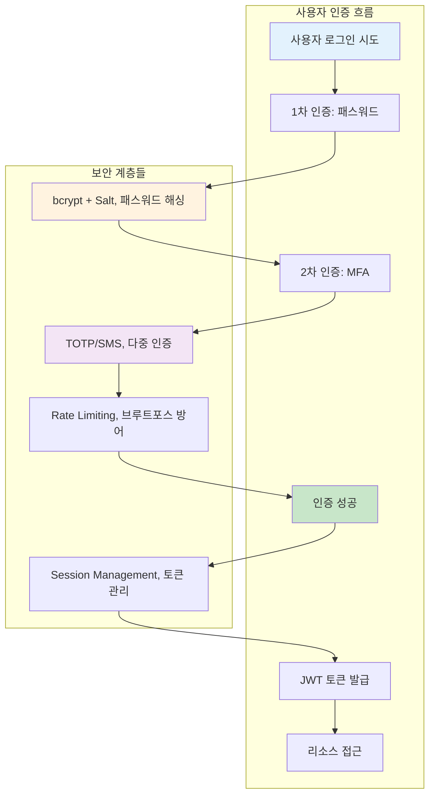
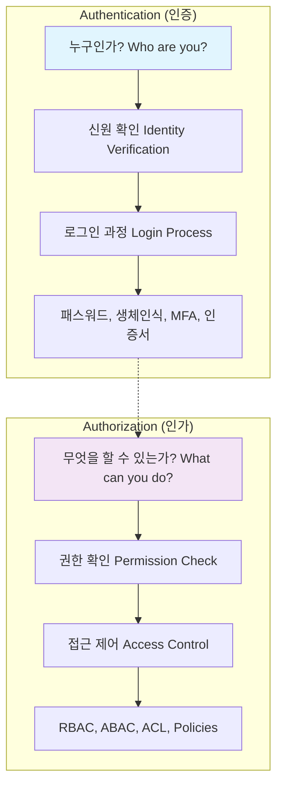

---
tags:
  - Authentication
  - Authorization
  - JWT
  - Password
  - Security
  - deep-study
  - hands-on
  - intermediate
  - 애플리케이션개발
difficulty: INTERMEDIATE
learning_time: "6-8시간"
main_topic: "애플리케이션 개발"
priority_score: 4
---

# 17.1.2: 인증 기초 개념

## 이 문서를 읽고 나면 답할 수 있는 질문들

- Authentication과 Authorization의 차이는 무엇인가요?
- LinkedIn 해킹 사건에서 배울 수 있는 보안 교훈은?
- 안전한 패스워드 저장과 검증 방법은?
- Rate Limiting으로 브루트포스 공격을 어떻게 막나요?
- 현대적 다층 보안 아키텍처는 어떻게 구성하나요?

## 들어가며: 디지털 신원의 중요성

### 🔓 2012년 LinkedIn 해킹: 6,500만 개 패스워드 유출 사건

2012년 6월, LinkedIn에서 역사상 최대 규모 중 하나의 계정 정보 유출 사고가 발생했습니다.

**사고의 전개과정**:

```bash
# 2012년 6월 5일: 최초 발견
해커가 러시아 포럼에 650만 개 암호화된 패스워드 게시
파일명: "combo_not.txt" (6.5MB 크기)

# 파일 내용 분석
$ head combo_not.txt
00000000000000000000000000000000  # MD5 해시들
aab87d2f7ff2e3b2b27df892c11b3e6a
5f4dcc3b5aa765d61d8327deb882cf99  # "password"의 MD5
e10adc3949ba59abbe56e057f20f883e  # "123456"의 MD5
...

# 😱 충격적 발견: Salt 없는 단순 MD5 해싱
```

**취약점 분석**:

```c
// LinkedIn이 사용한 취약한 패스워드 저장 방식 (추정)
char* hash_password(const char* password) {
    // 😱 Salt 없는 MD5 해싱 - 매우 위험!
    return md5(password);
}

// 해커의 크래킹 과정
1. Rainbow table 공격: MD5 해시를 원본 패스워드로 역추적
2. Dictionary 공격: 일반적인 패스워드들 대입
3. 결과: 수백만 개 패스워드 크래킹 성공

가장 많이 사용된 패스워드들:
- "123456": 753,305개 계정
- "linkedin": 172,523개 계정
- "password": 144,458개 계정
- "123456789": 94,314개 계정
```

**파급 효과**:

```text
💥 즉각적 피해:
- 6,500만 사용자 계정 정보 노출
- 크래킹된 패스워드로 타 사이트 무차별 공격
- LinkedIn 주가 10% 하락

📈 장기적 영향:
- 전 업계의 패스워드 보안 정책 대전환
- 2단계 인증(2FA) 도입 가속화
- bcrypt, scrypt 등 안전한 해싱 알고리즘 표준화
```

### 🛡️ 현대적 인증 시스템: 다층 보안의 실현

LinkedIn 사고 이후 구축된 현대적 인증 아키텍처:



## Authentication vs Authorization

### 핵심 개념의 차이점



### 실제 구현 예시

```python
# auth_system.py - 완전한 인증/인가 시스템
import hashlib
import secrets
import jwt
import pyotp
import time
from datetime import datetime, timedelta
from functools import wraps
from enum import Enum
from typing import Dict, List, Optional

class Role(Enum):
    ADMIN = "admin"
    USER = "user"
    MODERATOR = "moderator"
    GUEST = "guest"

class Permission(Enum):
    READ = "read"
    WRITE = "write"
    DELETE = "delete"
    ADMIN = "admin"

class AuthenticationSystem:
    def __init__(self, jwt_secret: str):
        self.jwt_secret = jwt_secret
        self.users = {}  # 실제로는 데이터베이스 사용
        self.sessions = {}
        self.failed_attempts = {}  # IP별 실패 시도 추적

        # 역할별 권한 매핑
        self.role_permissions = {
            Role.ADMIN: [Permission.READ, Permission.WRITE, Permission.DELETE, Permission.ADMIN],
            Role.MODERATOR: [Permission.READ, Permission.WRITE, Permission.DELETE],
            Role.USER: [Permission.READ, Permission.WRITE],
            Role.GUEST: [Permission.READ]
        }

    def register_user(self, username: str, password: str, email: str, role: Role = Role.USER):
        """안전한 사용자 등록"""
        if username in self.users:
            raise ValueError("User already exists")

        # 1. 패스워드 강도 검증
        self._validate_password_strength(password)

        # 2. 안전한 패스워드 해싱 (bcrypt + salt)
        salt = secrets.token_hex(32)
        password_hash = self._hash_password(password, salt)

        # 3. TOTP 시크릿 생성 (2FA용)
        totp_secret = pyotp.random_base32()

        user_data = {
            'username': username,
            'email': email,
            'password_hash': password_hash,
            'salt': salt,
            'role': role,
            'totp_secret': totp_secret,
            'totp_enabled': False,
            'created_at': datetime.now(),
            'last_login': None,
            'login_attempts': 0,
            'locked_until': None
        }

        self.users[username] = user_data
        print(f"User {username} registered successfully")
        print(f"2FA Secret (QR code): {totp_secret}")
        return totp_secret

    def authenticate(self, username: str, password: str, totp_code: Optional[str] = None,
                    client_ip: str = "unknown") -> Optional[Dict]:
        """안전한 사용자 인증"""

        # 1. Rate limiting 검사
        if self._is_rate_limited(client_ip):
            raise Exception("Too many failed attempts. Please try again later.")

        # 2. 사용자 존재 확인
        if username not in self.users:
            self._record_failed_attempt(client_ip)
            raise ValueError("Invalid credentials")

        user = self.users[username]

        # 3. 계정 잠금 확인
        if user.get('locked_until') and datetime.now() < user['locked_until']:
            raise Exception(f"Account locked until {user['locked_until']}")

        # 4. 패스워드 검증
        if not self._verify_password(password, user['password_hash'], user['salt']):
            self._record_failed_attempt(client_ip)
            user['login_attempts'] += 1

            # 5회 실패 시 계정 잠금
            if user['login_attempts'] >= 5:
                user['locked_until'] = datetime.now() + timedelta(minutes=30)
                raise Exception("Account locked due to multiple failed attempts")

            raise ValueError("Invalid credentials")

        # 5. 2FA 검증 (활성화된 경우)
        if user['totp_enabled']:
            if not totp_code:
                raise ValueError("2FA code required")

            if not self._verify_totp(user['totp_secret'], totp_code):
                self._record_failed_attempt(client_ip)
                raise ValueError("Invalid 2FA code")

        # 6. 인증 성공 처리
        user['login_attempts'] = 0
        user['locked_until'] = None
        user['last_login'] = datetime.now()
        self._clear_failed_attempts(client_ip)

        # 7. JWT 토큰 생성
        token = self._generate_jwt_token(username, user['role'])

        return {
            'user': {
                'username': username,
                'email': user['email'],
                'role': user['role'].value
            },
            'token': token,
            'expires_at': (datetime.now() + timedelta(hours=24)).isoformat()
        }

    def _validate_password_strength(self, password: str):
        """패스워드 강도 검증"""
        if len(password) < 12:
            raise ValueError("Password must be at least 12 characters long")

        has_upper = any(c.isupper() for c in password)
        has_lower = any(c.islower() for c in password)
        has_digit = any(c.isdigit() for c in password)
        has_special = any(c in "!@#$%^&*()_+-=[]{}|;:,.<>?" for c in password)

        if not all([has_upper, has_lower, has_digit, has_special]):
            raise ValueError("Password must contain uppercase, lowercase, digit, and special character")

    def _hash_password(self, password: str, salt: str) -> str:
        """안전한 패스워드 해싱 (PBKDF2)"""
        # 실제로는 bcrypt나 scrypt 사용 권장
        return hashlib.pbkdf2_hmac('sha256', password.encode(), salt.encode(), 100000).hex()

    def _verify_password(self, password: str, password_hash: str, salt: str) -> bool:
        """패스워드 검증"""
        return self._hash_password(password, salt) == password_hash

    def _verify_totp(self, secret: str, code: str) -> bool:
        """TOTP 코드 검증"""
        totp = pyotp.TOTP(secret)
        return totp.verify(code, valid_window=1)  # 30초 윈도우

    def _generate_jwt_token(self, username: str, role: Role) -> str:
        """JWT 토큰 생성"""
        payload = {
            'username': username,
            'role': role.value,
            'iat': datetime.utcnow(),
            'exp': datetime.utcnow() + timedelta(hours=24)
        }
        return jwt.encode(payload, self.jwt_secret, algorithm='HS256')

    def verify_token(self, token: str) -> Optional[Dict]:
        """JWT 토큰 검증"""
        try:
            payload = jwt.decode(token, self.jwt_secret, algorithms=['HS256'])
            return payload
        except jwt.ExpiredSignatureError:
            raise Exception("Token has expired")
        except jwt.InvalidTokenError:
            raise Exception("Invalid token")

    def _is_rate_limited(self, client_ip: str) -> bool:
        """Rate limiting 검사"""
        if client_ip not in self.failed_attempts:
            return False

        attempts = self.failed_attempts[client_ip]
        recent_attempts = [
            attempt for attempt in attempts
            if datetime.now() - attempt < timedelta(minutes=15)
        ]

        return len(recent_attempts) >= 5

    def _record_failed_attempt(self, client_ip: str):
        """실패한 로그인 시도 기록"""
        if client_ip not in self.failed_attempts:
            self.failed_attempts[client_ip] = []

        self.failed_attempts[client_ip].append(datetime.now())

    def _clear_failed_attempts(self, client_ip: str):
        """성공한 로그인 후 실패 기록 초기화"""
        if client_ip in self.failed_attempts:
            del self.failed_attempts[client_ip]

class AuthorizationSystem:
    def __init__(self, auth_system: AuthenticationSystem):
        self.auth_system = auth_system

    def require_auth(self, required_permission: Permission = None):
        """데코레이터: 인증 필수"""
        def decorator(func):
            @wraps(func)
            def wrapper(*args,**kwargs):
                # HTTP 헤더에서 토큰 추출 (실제로는 Flask/FastAPI 등에서)
                token = kwargs.get('auth_token')
                if not token:
                    raise Exception("Authentication required")

                try:
                    # 토큰 검증
                    payload = self.auth_system.verify_token(token)
                    username = payload['username']
                    role = Role(payload['role'])

                    # 권한 검사 (필요한 경우)
                    if required_permission:
                        if not self.has_permission(role, required_permission):
                            raise Exception(f"Permission denied: {required_permission.value}")

                    # 사용자 정보를 함수에 주입
                    kwargs['current_user'] = {
                        'username': username,
                        'role': role
                    }

                    return func(*args,**kwargs)

                except Exception as e:
                    raise Exception(f"Authentication failed: {str(e)}")

            return wrapper
        return decorator

    def has_permission(self, role: Role, permission: Permission) -> bool:
        """역할별 권한 확인"""
        user_permissions = self.auth_system.role_permissions.get(role, [])
        return permission in user_permissions

    def require_role(self, required_roles: List[Role]):
        """데코레이터: 특정 역할 필수"""
        def decorator(func):
            @wraps(func)
            def wrapper(*args,**kwargs):
                current_user = kwargs.get('current_user')
                if not current_user:
                    raise Exception("Authentication required")

                user_role = current_user['role']
                if user_role not in required_roles:
                    raise Exception(f"Role {user_role.value} not authorized")

                return func(*args,**kwargs)
            return wrapper
        return decorator

# 사용 예시
def demo_auth_system():
    # 시스템 초기화
    auth_system = AuthenticationSystem(jwt_secret="super-secret-key")
    authz_system = AuthorizationSystem(auth_system)

    # 사용자 등록
    try:
        totp_secret = auth_system.register_user("alice", "MySecureP@ss123!", "alice@example.com", Role.USER)
        auth_system.register_user("admin", "AdminP@ss456!", "admin@example.com", Role.ADMIN)
        print("Users registered successfully")
    except ValueError as e:
        print(f"Registration error: {e}")

    # 로그인 시도
    try:
        # 일반 로그인
        result = auth_system.authenticate("alice", "MySecureP@ss123!", client_ip="192.168.1.100")
        token = result['token']
        print(f"Login successful! Token: {token[:50]}...")

        # 보호된 리소스 접근 예시
        @authz_system.require_auth(Permission.READ)
        def get_user_profile(auth_token=None, current_user=None):
            return f"Profile for {current_user['username']}"

        @authz_system.require_auth(Permission.ADMIN)
        @authz_system.require_role([Role.ADMIN])
        def admin_dashboard(auth_token=None, current_user=None):
            return f"Admin dashboard accessed by {current_user['username']}"

        # 권한 테스트
        profile = get_user_profile(auth_token=token)
        print(f"Profile access: {profile}")

        try:
            dashboard = admin_dashboard(auth_token=token)
        except Exception as e:
            print(f"Admin access denied: {e}")

    except Exception as e:
        print(f"Authentication error: {e}")

if __name__ == "__main__":
    demo_auth_system()
```

## 핵심 요점

### 1. 인증과 인가의 명확한 구분

-**Authentication**: "누구인가?"를 확인하는 과정
-**Authorization**: "무엇을 할 수 있는가?"를 결정하는 과정

- 반드시 인증이 먼저 이루어진 후 인가가 진행됨

### 2. 다층 보안 아키텍처

- 패스워드 강도 검증과 안전한 해싱
- Rate limiting으로 브루트포스 공격 방지
- 계정 잠금과 복구 메커니즘

### 3. 실제 프로덕션 고려사항

- IP 기반 실패 시도 추적
- 토큰 기반 세션 관리
- 역할별 세밀한 권한 제어

---

**이전**: [인증과 인가 개요](./17-03-01-authentication-authorization.md)
**다음**: [OAuth 2.0 구현](./17-03-02-oauth2-implementation.md)에서 OAuth 2.0 플로우와 서버 구현을 학습합니다.

## 📚 관련 문서

### 📖 현재 문서 정보

-**난이도**: INTERMEDIATE
-**주제**: 애플리케이션 개발
-**예상 시간**: 6-8시간

### 🎯 학습 경로

- [📚 INTERMEDIATE 레벨 전체 보기](../learning-paths/intermediate/)
- [🏠 메인 학습 경로](../learning-paths/)
- [📋 전체 가이드 목록](../README.md)

### 📂 같은 챕터 (chapter-17-security-engineering)

- [Chapter 17-02-01: 메모리 보안과 공격 방어](./17-02-01-memory-security.md)
- [Chapter 17-02-02: 네트워크 보안 개요](./17-02-02-network-security.md)
- [Chapter 17-01-01: 네트워크 보안 기초와 위협 환경](./17-01-01-network-fundamentals.md)
- [Chapter 17-02-03: TLS 프로토콜과 암호화 통신](./17-02-03-tls-protocols.md)
- [Chapter 17-02-04: DDoS 공격 탐지와 방어](./17-02-04-ddos-defense.md)

### 🏷️ 관련 키워드

`Authentication`, `Authorization`, `Security`, `Password`, `JWT`

### ⏭️ 다음 단계 가이드

- 실무 적용을 염두에 두고 프로젝트에 적용해보세요
- 관련 도구들을 직접 사용해보는 것이 중요합니다
