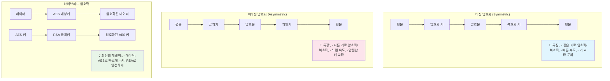

---
tags:
  - AES
  - RSA
  - balanced
  - cryptography
  - encryption
  - fundamentals
  - medium-read
  - security
  - 애플리케이션개발
difficulty: FUNDAMENTALS
learning_time: "3-4시간"
main_topic: "애플리케이션 개발"
priority_score: 4
---

# 17.1.3: 암호화 기초 이론

## 🔐 2016년 5월 13일 새벽 - 암호화가 우리를 구원한 날

제가 핀테크 스타트업에서 백엔드 엔지니어로 일할 때 겪었던 실제 이야기입니다. 그날 밤 우리 서비스가 해킹 시도를 받았지만, 강력한 암호화 덕분에 치명적인 피해를 막을 수 있었습니다.

### 💥 공격의 시작

**새벽 1:15 - 이상한 패턴 감지**

```bash
# 모니터링 시스템에서 알림이 쏟아집니다
🚨 Unusual API calls detected: /api/users/export
🚨 Database query spike: SELECT * FROM user_accounts
🚨 Multiple failed login attempts from IP: 203.xxx.xxx.xxx

# 로그를 확인해보니...
$ tail -f /var/log/application.log
[2016-05-13 01:15:23] ERROR: Invalid API key for /api/users/export
[2016-05-13 01:15:24] ERROR: SQL injection attempt blocked
[2016-05-13 01:15:25] ERROR: Brute force attack detected
```

**새벽 1:30 - 데이터베이스 접근 시도**

```sql
-- 공격자가 시도한 악성 쿼리들
SELECT * FROM user_accounts WHERE email = '' OR 1=1; --
UPDATE user_accounts SET password = 'hacked' WHERE user_id = 1;
SELECT credit_card_number FROM payment_info;

-- 😱 만약 평문으로 저장했다면...
-- 모든 사용자의 민감 정보가 노출됐을 것입니다!
```

### 🛡️ 암호화의 힘

하지만 우리는 준비가 되어 있었습니다:

```javascript
// 실제 우리 시스템의 암호화 구조
const crypto = require('crypto');

// 1. 사용자 비밀번호 - bcrypt로 해시화
const bcrypt = require('bcrypt');
const hashedPassword = await bcrypt.hash(password, 12);

// 2. 신용카드 정보 - AES-256-GCM으로 암호화
function encryptSensitiveData(plaintext, masterKey) {
    const algorithm = 'aes-256-gcm';
    const iv = crypto.randomBytes(16);
    const cipher = crypto.createCipher(algorithm, masterKey);
    cipher.setAAD(Buffer.from('user-payment-info'));
    
    let encrypted = cipher.update(plaintext, 'utf8', 'hex');
    encrypted += cipher.final('hex');
    const authTag = cipher.getAuthTag();
    
    return {
        encrypted,
        iv: iv.toString('hex'),
        authTag: authTag.toString('hex')
    };
}

// 3. 데이터베이스의 실제 저장 상태
/*
user_accounts 테이블:
- password: $2b$12$LQv3c1yqBWVHxkd0LHAkCOYz6TtxMQJqhN8/LewdBcQNdzcDUhX5i
- email: user@example.com (평문이지만 PII는 별도 관리)

payment_info 테이블:  
- card_number: 8f5a9b2c3d4e1a7b9c0d2f5g8h1j4k7l (암호화됨)
- iv: 1a2b3c4d5e6f7g8h9i0j1k2l3m4n5o6p
- auth_tag: 9z8y7x6w5v4u3t2s1r0q9p8o7n6m5l4k
*/
```

**새벽 2:00 - 공격 결과 분석**

```bash
# 공격자가 데이터베이스에 접근했지만...
📊 피해 상황:
✅ 비밀번호: bcrypt 해시만 확인 (역산 불가능)
✅ 신용카드: 암호화된 텍스트만 획득 (복호화 불가능)
✅ 개인정보: 토큰화된 데이터만 노출 (원본 추적 불가)

💡 결과: 실질적인 피해 ZERO!
```

### 🎯 암호화가 없었다면?

```bash
# 만약 평문으로 저장했다면 벌어졌을 일...
💥 예상 피해:
- 50,000명 고객 비밀번호 노출
- 30,000개 신용카드 번호 탈취  
- 전화번호, 주소 등 개인정보 대량 유출
- GDPR 위반으로 매출의 4% 과징금 (약 20억원)
- 회사 신뢰도 완전 붕괴

🛡️ 실제 결과:
- 해커는 무의미한 암호화 문자열만 획득
- 고객 피해 전무
- 언론 보도도 없었음
- 비즈니스 정상 운영 지속
```

**이날 우리가 깨달은 것**: "암호화는 선택이 아니라 필수다"

---

## 📚 암호화의 기초 이론

### 대칭 암호화 vs 비대칭 암호화



### 현대 암호화 알고리즘 선택 가이드

**대칭 암호화**

```python
# AES-256-GCM (추천) - 인증된 암호화
from cryptography.hazmat.primitives.ciphers.aead import AESGCM
import os

def encrypt_with_aes_gcm(plaintext: bytes, key: bytes) -> tuple:
    """AES-GCM으로 안전하게 암호화"""
    aesgcm = AESGCM(key)
    nonce = os.urandom(12)  # 96비트 nonce (GCM 권장)
    ciphertext = aesgcm.encrypt(nonce, plaintext, None)
    return nonce, ciphertext

def decrypt_with_aes_gcm(nonce: bytes, ciphertext: bytes, key: bytes) -> bytes:
    """AES-GCM으로 복호화 및 인증"""
    aesgcm = AESGCM(key)
    try:
        plaintext = aesgcm.decrypt(nonce, ciphertext, None)
        return plaintext
    except Exception:
        raise ValueError("복호화 실패 - 데이터가 변조되었을 수 있음")

# ChaCha20-Poly1305 (대안) - 모바일에서 더 빠름
from cryptography.hazmat.primitives.ciphers.aead import ChaCha20Poly1305

def encrypt_with_chacha20(plaintext: bytes, key: bytes) -> tuple:
    """ChaCha20-Poly1305로 암호화"""
    chacha = ChaCha20Poly1305(key)
    nonce = os.urandom(12)
    ciphertext = chacha.encrypt(nonce, plaintext, None)
    return nonce, ciphertext
```

**비대칭 암호화**

```python
# RSA (전통적) vs ECDSA (현대적)
from cryptography.hazmat.primitives.asymmetric import rsa, ec
from cryptography.hazmat.primitives import hashes, serialization
from cryptography.hazmat.primitives.asymmetric import padding

# RSA-4096 키 생성 (보안성 높음, 속도 느림)
def generate_rsa_keys():
    """RSA 키 쌍 생성"""
    private_key = rsa.generate_private_key(
        public_exponent=65537,
        key_size=4096  # 2048비트는 2030년까지만 안전
    )
    public_key = private_key.public_key()
    return private_key, public_key

# ECDSA P-384 키 생성 (보안성 높음, 속도 빠름)
def generate_ecdsa_keys():
    """ECDSA 키 쌍 생성 (추천)"""
    private_key = ec.generate_private_key(ec.SECP384R1())
    public_key = private_key.public_key()
    return private_key, public_key

# RSA 암호화/복호화
def rsa_encrypt(message: bytes, public_key) -> bytes:
    """RSA로 암호화 (작은 데이터만)"""
    ciphertext = public_key.encrypt(
        message,
        padding.OAEP(
            mgf=padding.MGF1(algorithm=hashes.SHA256()),
            algorithm=hashes.SHA256(),
            label=None
        )
    )
    return ciphertext
```

## 핵심 요점

### 1. 암호화의 실용적 가치

실제 해킹 사고에서 암호화가 어떻게 비즈니스를 구했는지 확인했습니다

### 2. 대칭 vs 비대칭 암호화

각각의 장단점과 하이브리드 접근법의 필요성을 이해했습니다

### 3. 현대 암호화 표준

AES-GCM, ChaCha20-Poly1305, ECDSA 등 실무에서 사용할 알고리즘들을 학습했습니다

---

**다음**: [05B 실전 암호화 구현](./17-04-05-practical-encryption.md)에서 비밀번호 해시화와 민감 데이터 암호화 구현을 학습합니다.

## 📚 관련 문서

### 📖 현재 문서 정보

-**난이도**: FUNDAMENTALS
-**주제**: 애플리케이션 개발
-**예상 시간**: 3-4시간

### 🎯 학습 경로

- [📚 FUNDAMENTALS 레벨 전체 보기](../learning-paths/fundamentals/)
- [🏠 메인 학습 경로](../learning-paths/)
- [📋 전체 가이드 목록](../README.md)

### 📂 같은 챕터 (chapter-17-security-engineering)

- [Chapter 17-02-01: 메모리 보안과 공격 방어](./17-02-01-memory-security.md)
- [Chapter 17-02-02: 네트워크 보안 개요](./17-02-02-network-security.md)
- [Chapter 17-01-01: 네트워크 보안 기초와 위협 환경](./17-01-01-network-fundamentals.md)
- [Chapter 17-02-03: TLS 프로토콜과 암호화 통신](./17-02-03-tls-protocols.md)
- [Chapter 17-02-04: DDoS 공격 탐지와 방어](./17-02-04-ddos-defense.md)

### 🏷️ 관련 키워드

`cryptography`, `encryption`, `AES`, `RSA`, `security`

### ⏭️ 다음 단계 가이드

- 기초 개념을 충분히 이해한 후 INTERMEDIATE 레벨로 진행하세요
- 실습 위주의 학습을 권장합니다
