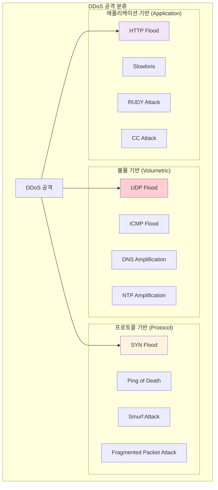

---
tags:
  - anomaly-detection
  - attack-detection
  - ddos-defense
  - hands-on
  - intermediate
  - medium-read
  - network-security
  - rate-limiting
  - 인프라스트럭처
difficulty: INTERMEDIATE
learning_time: "4-6시간"
main_topic: "인프라스트럭처"
priority_score: 0
---

# 17.2.4: DDoS 공격 탐지와 방어

## DDoS 공격과 방어 전략

### DDoS 공격의 종류별 특징



### 실시간 DDoS 탐지 시스템

```python
#!/usr/bin/env python3
# ddos_detector.py - 실시간 DDoS 탐지 시스템

import time
import threading
from collections import defaultdict, deque
from datetime import datetime, timedelta
import psutil
import logging

class DDoSDetector:
    def __init__(self, thresholds=None):
        self.thresholds = thresholds or {
            'requests_per_minute': 1000,    # 분당 요청 수
            'unique_ips_threshold': 100,    # 고유 IP 수 임계값
            'syn_flood_threshold': 500,     # SYN 패킷 임계값
            'bandwidth_threshold': 100,     # Mbps
        }

        # 통계 데이터 저장
        self.request_counts = defaultdict(deque)
        self.ip_requests = defaultdict(int)
        self.syn_packets = deque()
        self.bandwidth_history = deque()

        # 탐지 결과
        self.attack_detected = False
        self.attack_type = None
        self.attack_start_time = None

        self.setup_logging()

    def setup_logging(self):
        logging.basicConfig(
            level=logging.INFO,
            format='%(asctime)s - %(levelname)s - %(message)s',
            handlers=[
                logging.FileHandler('ddos_detection.log'),
                logging.StreamHandler()
            ]
        )
        self.logger = logging.getLogger(__name__)

    def monitor_network_stats(self):
        """네트워크 통계 모니터링"""
        while True:
            try:
                # 네트워크 I/O 통계
                net_io = psutil.net_io_counters()
                current_bandwidth = (net_io.bytes_recv + net_io.bytes_sent) * 8 / 1024 / 1024  # Mbps

                # 최근 1분간의 대역폭 데이터 유지
                current_time = datetime.now()
                self.bandwidth_history.append((current_time, current_bandwidth))

                # 1분 이전 데이터 제거
                while (self.bandwidth_history and
                       current_time - self.bandwidth_history[0][0] > timedelta(minutes=1)):
                    self.bandwidth_history.popleft()

                # 대역폭 기반 탐지
                if self.detect_bandwidth_anomaly():
                    self.trigger_alert("Bandwidth Anomaly",
                                     f"Unusual bandwidth spike: {current_bandwidth:.2f} Mbps")

                time.sleep(1)  # 1초마다 체크

            except Exception as e:
                self.logger.error(f"Network monitoring error: {e}")
                time.sleep(5)

    def log_request(self, ip_address, request_type="HTTP"):
        """요청 로깅 및 패턴 분석"""
        current_time = datetime.now()

        # IP별 요청 수 카운트
        self.ip_requests[ip_address] += 1

        # 시간별 요청 수 기록
        minute_key = current_time.strftime("%Y%m%d%H%M")
        self.request_counts[minute_key].append((current_time, ip_address, request_type))

        # 1분 이전 데이터 정리
        cutoff_time = current_time - timedelta(minutes=1)
        for key in list(self.request_counts.keys()):
            if key < cutoff_time.strftime("%Y%m%d%H%M"):
                del self.request_counts[key]

        # 실시간 탐지
        self.detect_http_flood()
        self.detect_distributed_attack()

    def detect_http_flood(self):
        """HTTP Flood 공격 탐지"""
        current_minute = datetime.now().strftime("%Y%m%d%H%M")
        requests_this_minute = len(self.request_counts[current_minute])

        if requests_this_minute > self.thresholds['requests_per_minute']:
            if not self.attack_detected:
                self.trigger_alert("HTTP Flood",
                                 f"Detected {requests_this_minute} requests in current minute")

    def detect_distributed_attack(self):
        """분산 공격 탐지 (여러 IP에서 오는 공격)"""
        unique_ips = len(self.ip_requests)
        total_requests = sum(self.ip_requests.values())

        if (unique_ips > self.thresholds['unique_ips_threshold'] and
            total_requests > self.thresholds['requests_per_minute']):

            # IP당 평균 요청 수가 적으면서 총량이 많으면 분산 공격 의심
            avg_requests_per_ip = total_requests / unique_ips
            if avg_requests_per_ip < 50:  # IP당 50개 미만의 요청
                self.trigger_alert("Distributed Attack",
                                 f"Detected distributed attack from {unique_ips} IPs")

    def detect_bandwidth_anomaly(self):
        """대역폭 이상 탐지"""
        if len(self.bandwidth_history) < 10:
            return False

        recent_bandwidth = [bw for _, bw in self.bandwidth_history[-10:]]
        avg_bandwidth = sum(recent_bandwidth) / len(recent_bandwidth)

        return avg_bandwidth > self.thresholds['bandwidth_threshold']

    def detect_syn_flood(self, syn_packet_count):
        """SYN Flood 공격 탐지"""
        current_time = datetime.now()
        self.syn_packets.append(current_time)

        # 1분 이전 데이터 제거
        cutoff_time = current_time - timedelta(minutes=1)
        while self.syn_packets and self.syn_packets[0] < cutoff_time:
            self.syn_packets.popleft()

        if len(self.syn_packets) > self.thresholds['syn_flood_threshold']:
            self.trigger_alert("SYN Flood",
                             f"Detected {len(self.syn_packets)} SYN packets in last minute")

    def trigger_alert(self, attack_type, details):
        """공격 탐지 시 알림 발송"""
        if not self.attack_detected:
            self.attack_detected = True
            self.attack_type = attack_type
            self.attack_start_time = datetime.now()

            alert_message = f"🚨 DDoS ATTACK DETECTED: {attack_type}, "
            alert_message += f"Details: {details}, "
            alert_message += f"Time: {self.attack_start_time}, "

            self.logger.critical(alert_message)

            # 실제 환경에서는 SMS, Slack, PagerDuty 등으로 알림
            self.send_emergency_notification(alert_message)

            # 자동 방어 조치 시작
            self.activate_defense_measures()

    def activate_defense_measures(self):
        """자동 방어 조치 활성화"""
        self.logger.info("Activating defense measures...")

        # 1. Rate Limiting 강화
        self.enable_aggressive_rate_limiting()

        # 2. 의심스러운 IP 차단
        self.block_suspicious_ips()

        # 3. 트래픽 필터링 강화
        self.enable_traffic_filtering()

    def enable_aggressive_rate_limiting(self):
        """강화된 Rate Limiting 활성화"""
        # iptables를 사용한 연결 제한
        import subprocess

        commands = [
            # 분당 연결 수 제한
            "iptables -A INPUT -p tcp --dport 80 -m limit --limit 25/minute --limit-burst 100 -j ACCEPT",
            "iptables -A INPUT -p tcp --dport 443 -m limit --limit 25/minute --limit-burst 100 -j ACCEPT",

            # SYN 패킷 제한
            "iptables -A INPUT -p tcp --syn -m limit --limit 1/s --limit-burst 3 -j ACCEPT",

            # ICMP 제한
            "iptables -A INPUT -p icmp --icmp-type echo-request -m limit --limit 1/s -j ACCEPT"
        ]

        for cmd in commands:
            try:
                subprocess.run(cmd.split(), check=True, capture_output=True)
                self.logger.info(f"Applied: {cmd}")
            except subprocess.CalledProcessError as e:
                self.logger.error(f"Failed to apply: {cmd}, Error: {e}")

    def block_suspicious_ips(self):
        """의심스러운 IP 차단"""
        suspicious_threshold = 100  # IP당 100회 이상 요청 시 의심

        for ip, count in self.ip_requests.items():
            if count > suspicious_threshold:
                self.block_ip(ip)
                self.logger.warning(f"Blocked suspicious IP: {ip} (requests: {count})")

    def block_ip(self, ip_address):
        """특정 IP 차단"""
        import subprocess

        try:
            cmd = f"iptables -A INPUT -s {ip_address} -j DROP"
            subprocess.run(cmd.split(), check=True, capture_output=True)
            self.logger.info(f"Blocked IP: {ip_address}")
        except subprocess.CalledProcessError as e:
            self.logger.error(f"Failed to block IP {ip_address}: {e}")

    def send_emergency_notification(self, message):
        """응급 알림 발송"""
        # 실제 환경에서는 다양한 알림 채널 사용
        # 예: Slack, SMS, PagerDuty, Email 등

        # Slack 웹훅 예시 (실제로는 설정된 웹훅 URL 사용)
        import requests
        import json

        slack_webhook_url = "https://hooks.slack.com/services/YOUR/WEBHOOK/URL"

        payload = {
            "text": f"🚨 CRITICAL SECURITY ALERT 🚨",
            "attachments": [
                {
                    "color": "danger",
                    "fields": [
                        {
                            "title": "DDoS Attack Detected",
                            "value": message,
                            "short": False
                        }
                    ]
                }
            ]
        }

        try:
            response = requests.post(slack_webhook_url,
                                   data=json.dumps(payload),
                                   headers={'Content-Type': 'application/json'})
            if response.status_code == 200:
                self.logger.info("Emergency notification sent successfully")
            else:
                self.logger.error(f"Failed to send notification: {response.status_code}")
        except Exception as e:
            self.logger.error(f"Notification error: {e}")

# 사용 예시
if __name__ == "__main__":
    detector = DDoSDetector()

    # 네트워크 모니터링 스레드 시작
    monitor_thread = threading.Thread(target=detector.monitor_network_stats, daemon=True)
    monitor_thread.start()

    # 웹 서버에서 사용하는 경우의 시뮬레이션
    import random
    import time

    # 정상 트래픽 시뮬레이션
    for i in range(100):
        ip = f"192.168.1.{random.randint(1, 50)}"
        detector.log_request(ip, "HTTP")
        time.sleep(0.1)

    print("정상 트래픽 처리 완료")

    # 공격 트래픽 시뮬레이션
    print("DDoS 공격 시뮬레이션 시작...")
    for i in range(2000):  # 대량 요청
        ip = f"10.0.0.{random.randint(1, 200)}"  # 다양한 IP에서
        detector.log_request(ip, "HTTP")
        if i % 100 == 0:
            time.sleep(0.01)  # 짧은 간격

    # 결과 대기
    time.sleep(2)
    print("시뮬레이션 완료")
```

### 고급 DDoS 탐지 알고리즘

```python
#!/usr/bin/env python3
# advanced_ddos_detector.py - 머신러닝 기반 DDoS 탐지

import numpy as np
from sklearn.ensemble import IsolationForest
from sklearn.preprocessing import StandardScaler
import joblib
import pandas as pd
from datetime import datetime, timedelta
import asyncio
import aiofiles

class MLDDoSDetector:
    def __init__(self, model_path=None):
        self.scaler = StandardScaler()
        self.isolation_forest = IsolationForest(
            contamination=0.1,  # 10%의 이상치 예상
            random_state=42,
            n_estimators=100
        )
        
        # 특성 추출을 위한 윈도우
        self.time_window = 60  # 60초 윈도우
        self.traffic_buffer = []
        
        # 모델이 있으면 로드
        if model_path:
            self.load_model(model_path)
        else:
            self.is_trained = False

    def extract_features(self, traffic_data):
        """트래픽 데이터에서 특성 추출"""
        if not traffic_data:
            return None
        
        df = pd.DataFrame(traffic_data)
        
        # 기본 통계 특성
        features = {
            'total_packets': len(df),
            'unique_ips': df['src_ip'].nunique(),
            'unique_ports': df['dst_port'].nunique(),
            'avg_packet_size': df['packet_size'].mean(),
            'std_packet_size': df['packet_size'].std(),
            'tcp_ratio': len(df[df['protocol'] == 'TCP']) / len(df),
            'udp_ratio': len(df[df['protocol'] == 'UDP']) / len(df),
            'icmp_ratio': len(df[df['protocol'] == 'ICMP']) / len(df),
        }
        
        # 시간 기반 특성
        df['timestamp'] = pd.to_datetime(df['timestamp'])
        time_diffs = df['timestamp'].diff().dt.total_seconds().dropna()
        
        if len(time_diffs) > 0:
            features.update({
                'avg_time_interval': time_diffs.mean(),
                'std_time_interval': time_diffs.std(),
                'min_time_interval': time_diffs.min(),
                'max_time_interval': time_diffs.max(),
            })
        else:
            features.update({
                'avg_time_interval': 0,
                'std_time_interval': 0,
                'min_time_interval': 0,
                'max_time_interval': 0,
            })
        
        # IP 분포 특성
        ip_counts = df['src_ip'].value_counts()
        features.update({
            'max_requests_per_ip': ip_counts.max(),
            'entropy_ip_distribution': self.calculate_entropy(ip_counts.values),
            'top_ip_percentage': ip_counts.iloc[0] / len(df) if len(ip_counts) > 0 else 0,
        })
        
        # 포트 분포 특성
        port_counts = df['dst_port'].value_counts()
        features.update({
            'entropy_port_distribution': self.calculate_entropy(port_counts.values),
            'top_port_percentage': port_counts.iloc[0] / len(df) if len(port_counts) > 0 else 0,
        })
        
        return np.array(list(features.values())).reshape(1, -1)

    def calculate_entropy(self, values):
        """엔트로피 계산"""
        if len(values) == 0:
            return 0
        
        probabilities = values / np.sum(values)
        probabilities = probabilities[probabilities > 0]  # 0이 아닌 값만
        
        return -np.sum(probabilities * np.log2(probabilities))

    async def process_traffic_stream(self, packet_data):
        """실시간 트래픽 처리"""
        current_time = datetime.now()
        
        # 패킷 데이터를 버퍼에 추가
        packet_data['timestamp'] = current_time
        self.traffic_buffer.append(packet_data)
        
        # 윈도우 크기 유지 (시간 기반)
        cutoff_time = current_time - timedelta(seconds=self.time_window)
        self.traffic_buffer = [
            p for p in self.traffic_buffer 
            if datetime.fromisoformat(str(p['timestamp'])) > cutoff_time
        ]
        
        # 충분한 데이터가 있고 모델이 훈련되어 있으면 예측 수행
        if len(self.traffic_buffer) >= 100 and self.is_trained:
            features = self.extract_features(self.traffic_buffer)
            if features is not None:
                prediction = await self.predict_anomaly(features)
                if prediction == -1:  # 이상 징후 탐지
                    await self.handle_anomaly_detection(features)

    async def predict_anomaly(self, features):
        """이상 징후 예측"""
        try:
            # 특성 정규화
            features_scaled = self.scaler.transform(features)
            
            # 이상 탐지 수행
            prediction = self.isolation_forest.predict(features_scaled)
            anomaly_score = self.isolation_forest.decision_function(features_scaled)
            
            return prediction[0], anomaly_score[0]
        except Exception as e:
            print(f"Prediction error: {e}")
            return 1, 0  # 정상으로 처리

    async def handle_anomaly_detection(self, features):
        """이상 징후 탐지 시 처리"""
        alert_data = {
            'timestamp': datetime.now().isoformat(),
            'alert_type': 'ML_ANOMALY_DETECTED',
            'severity': 'HIGH',
            'features': features.tolist(),
            'description': 'Machine learning model detected traffic anomaly'
        }
        
        print(f"🤖 ML 기반 이상 탐지: {alert_data['description']}")
        
        # 상세 분석 수행
        detailed_analysis = await self.analyze_anomaly_details()
        alert_data['detailed_analysis'] = detailed_analysis
        
        # 알림 발송
        await self.send_ml_alert(alert_data)

    async def analyze_anomaly_details(self):
        """이상 징후 상세 분석"""
        if not self.traffic_buffer:
            return {}
        
        df = pd.DataFrame(self.traffic_buffer)
        
        analysis = {
            'top_source_ips': df['src_ip'].value_counts().head(10).to_dict(),
            'target_ports': df['dst_port'].value_counts().head(10).to_dict(),
            'protocol_distribution': df['protocol'].value_counts().to_dict(),
            'packet_size_stats': {
                'mean': df['packet_size'].mean(),
                'std': df['packet_size'].std(),
                'min': df['packet_size'].min(),
                'max': df['packet_size'].max(),
            },
            'time_pattern': self.analyze_time_pattern(df)
        }
        
        return analysis

    def analyze_time_pattern(self, df):
        """시간 패턴 분석"""
        df['timestamp'] = pd.to_datetime(df['timestamp'])
        df = df.sort_values('timestamp')
        
        # 초당 패킷 수 계산
        df['second'] = df['timestamp'].dt.floor('S')
        packets_per_second = df.groupby('second').size()
        
        return {
            'packets_per_second_stats': {
                'mean': packets_per_second.mean(),
                'std': packets_per_second.std(),
                'max': packets_per_second.max(),
                'min': packets_per_second.min(),
            },
            'burst_pattern': len(packets_per_second[packets_per_second > packets_per_second.mean() + 2 * packets_per_second.std()])
        }

    async def send_ml_alert(self, alert_data):
        """ML 기반 알림 발송"""
        # 파일에 저장
        async with aiofiles.open('ml_ddos_alerts.jsonl', 'a') as f:
            await f.write(f"{json.dumps(alert_data)}\n")
        
        # 실제 환경에서는 여기에 Slack, PagerDuty 등 연동
        print(f"🚨 ML Alert sent: {alert_data['alert_type']}")

    def train_model(self, historical_data):
        """히스토리 데이터로 모델 훈련"""
        print("🎓 DDoS 탐지 모델 훈련 시작...")
        
        features_list = []
        
        for traffic_sample in historical_data:
            features = self.extract_features(traffic_sample)
            if features is not None:
                features_list.append(features[0])
        
        if not features_list:
            print("❌ 훈련할 데이터가 없습니다.")
            return
        
        X = np.array(features_list)
        
        # 데이터 정규화
        X_scaled = self.scaler.fit_transform(X)
        
        # 모델 훈련
        self.isolation_forest.fit(X_scaled)
        self.is_trained = True
        
        print(f"✅ 모델 훈련 완료: {X.shape[0]}개 샘플로 훈련")

    def save_model(self, model_path):
        """모델 저장"""
        model_data = {
            'scaler': self.scaler,
            'isolation_forest': self.isolation_forest,
            'is_trained': self.is_trained
        }
        joblib.dump(model_data, model_path)
        print(f"💾 모델 저장 완료: {model_path}")

    def load_model(self, model_path):
        """모델 로드"""
        try:
            model_data = joblib.load(model_path)
            self.scaler = model_data['scaler']
            self.isolation_forest = model_data['isolation_forest']
            self.is_trained = model_data['is_trained']
            print(f"📂 모델 로드 완료: {model_path}")
        except Exception as e:
            print(f"❌ 모델 로드 실패: {e}")

# 사용 예시
async def simulate_ml_detection():
    detector = MLDDoSDetector()
    
    # 정상 트래픽으로 모델 훈련
    normal_traffic_samples = []
    for i in range(50):  # 50개 정상 트래픽 샘플 생성
        sample = []
        for j in range(100):  # 각 샘플당 100개 패킷
            packet = {
                'src_ip': f"192.168.1.{np.random.randint(1, 50)}",
                'dst_port': np.random.choice([80, 443, 22, 25]),
                'protocol': np.random.choice(['TCP', 'UDP'], p=[0.8, 0.2]),
                'packet_size': np.random.normal(1000, 200),
                'timestamp': datetime.now() - timedelta(seconds=np.random.randint(0, 3600))
            }
            sample.append(packet)
        normal_traffic_samples.append(sample)
    
    detector.train_model(normal_traffic_samples)
    
    # 이상 트래픽 시뮬레이션
    print("🔥 이상 트래픽 시뮬레이션 시작...")
    for i in range(1000):  # 이상 트래픽 패턴
        packet = {
            'src_ip': f"10.0.0.{np.random.randint(1, 200)}",  # 다양한 IP
            'dst_port': 80,  # 특정 포트 집중
            'protocol': 'TCP',
            'packet_size': 64,  # 작은 패킷
            'timestamp': datetime.now()
        }
        await detector.process_traffic_stream(packet)
        if i % 100 == 0:
            await asyncio.sleep(0.1)

if __name__ == "__main__":
    import json
    asyncio.run(simulate_ml_detection())
```

### 계층별 DDoS 방어 전략

```yaml
# CloudFlare/AWS Shield 스타일 다층 DDoS 방어
defense_layers:

  # Layer 1: 네트워크 엣지 (ISP/CDN 레벨)
  edge_defense:
    - name: "Anycast 네트워크"
      description: "트래픽을 전 세계로 분산"
      capacity: "10+ Tbps"

    - name: "Rate Limiting"
      description: "IP별, 지역별 트래픽 제한"
      rules:
        - "IP당 초당 100 요청"
        - "국가별 트래픽 비율 제한"

    - name: "GeoBlocking"
      description: "의심스러운 지역 차단"
      countries: ["known_attack_sources"]

  # Layer 2: 클라우드 WAF (Web Application Firewall)
  waf_defense:
    - name: "HTTP Flood 방어"
      techniques:
        - "JavaScript Challenge"
        - "CAPTCHA 인증"
        - "Browser Fingerprinting"

    - name: "Bot 탐지"
      methods:
        - "User-Agent 분석"
        - "행동 패턴 분석"
        - "TLS fingerprinting"

    - name: "IP reputation"
      sources:
        - "Known botnet IPs"
        - "Tor exit nodes"
        - "Open proxies"

  # Layer 3: 애플리케이션 서버
  server_defense:
    - name: "Connection Limiting"
      config: |
        # nginx 설정
        limit_conn_zone $binary_remote_addr zone=conn_limit_per_ip:10m;
        limit_req_zone $binary_remote_addr zone=req_limit_per_ip:10m rate=5r/s;

        server {
            limit_conn conn_limit_per_ip 10;
            limit_req zone=req_limit_per_ip burst=10 nodelay;
        }

    - name: "Resource Monitoring"
      metrics:
        - "CPU usage"
        - "Memory usage"
        - "Network bandwidth"
        - "Active connections"

  # Layer 4: 데이터베이스
  database_defense:
    - name: "Connection Pooling"
      description: "데이터베이스 연결 수 제한"
      max_connections: 100

    - name: "Query Rate Limiting"
      description: "복잡한 쿼리 제한"
      slow_query_limit: "1 per second"
```

### 실전 DDoS 방어 설정

**nginx에서의 고급 Rate Limiting**:

```nginx
# nginx-ddos-protection.conf
http {
    # IP별 연결 수 제한
    limit_conn_zone $binary_remote_addr zone=conn_limit_per_ip:10m;
    
    # IP별 요청 속도 제한
    limit_req_zone $binary_remote_addr zone=req_limit_per_ip:10m rate=10r/s;
    
    # 전체 연결 수 제한
    limit_conn_zone $server_name zone=conn_limit_per_server:10m;
    
    # GeoIP 기반 제한 (선택사항)
    geo $limited {
        default 0;
        # 특정 국가 코드들을 제한 (예시)
        ~^(CN|RU|KP) 1;
    }
    
    # 봇 탐지를 위한 User-Agent 필터
    map $http_user_agent $bot_agent {
        default 0;
        ~*(bot|crawler|spider|scraper) 1;
        "" 1; # 빈 User-Agent
    }
    
    server {
        listen 80;
        server_name example.com;
        
        # 기본 연결 제한 적용
        limit_conn conn_limit_per_ip 10;
        limit_conn conn_limit_per_server 1000;
        
        # 요청 속도 제한 (burst 허용)
        limit_req zone=req_limit_per_ip burst=20 nodelay;
        
        # GeoIP 기반 차단
        if ($limited = 1) {
            return 444; # 연결 종료
        }
        
        # 의심스러운 User-Agent 차단
        if ($bot_agent = 1) {
            return 444;
        }
        
        # 특정 패턴의 요청 차단
        location ~* \.(php|asp|jsp)$ {
            return 444; # 정적 사이트의 경우
        }
        
        # API 엔드포인트는 더 엄격한 제한
        location /api/ {
            limit_req zone=req_limit_per_ip burst=5 nodelay;
            
            # API 키 검증 (예시)
            if ($http_x_api_key = "") {
                return 401;
            }
        }
        
        # 정적 파일은 캐싱으로 부하 감소
        location ~* \.(jpg|jpeg|png|gif|ico|css|js)$ {
            expires 1y;
            add_header Cache-Control "public, no-transform";
        }
    }
    
    # 에러 페이지는 간단하게
    error_page 503 /503.html;
    location = /503.html {
        root /var/www/error-pages;
        internal;
    }
}
```

**iptables를 이용한 네트워크 레벨 방어**:

```bash
#!/bin/bash
# advanced-ddos-protection.sh

# SYN Flood 방어
iptables -A INPUT -p tcp --syn -m limit --limit 1/s --limit-burst 3 -j ACCEPT
iptables -A INPUT -p tcp --syn -j DROP

# UDP Flood 방어 
iptables -A INPUT -p udp -m limit --limit 1/s --limit-burst 3 -j ACCEPT
iptables -A INPUT -p udp -j DROP

# ICMP Flood 방어
iptables -A INPUT -p icmp --icmp-type echo-request -m limit --limit 1/s -j ACCEPT
iptables -A INPUT -p icmp --icmp-type echo-request -j DROP

# 연결 추적 기반 방어 (Connection Tracking)
iptables -A INPUT -m state --state ESTABLISHED,RELATED -j ACCEPT
iptables -A INPUT -m state --state INVALID -j DROP

# 포트 스캔 방어
iptables -A INPUT -m state --state NEW -p tcp --tcp-flags ALL ALL -j DROP
iptables -A INPUT -m state --state NEW -p tcp --tcp-flags ALL NONE -j DROP
iptables -A INPUT -m state --state NEW -p tcp --tcp-flags ALL FIN,URG,PSH -j DROP
iptables -A INPUT -m state --state NEW -p tcp --tcp-flags ALL SYN,RST,ACK,FIN,URG -j DROP

# 특정 IP 범위에서 오는 대량 트래픽 제한
iptables -A INPUT -s 10.0.0.0/8 -m limit --limit 10/minute -j ACCEPT
iptables -A INPUT -s 10.0.0.0/8 -j DROP

# 로깅 (분석용)
iptables -A INPUT -m limit --limit 3/min --limit-burst 3 -j LOG --log-prefix "DDoS-Block: " --log-level 4

echo "🛡️ DDoS 방어 규칙 적용 완료"
```

## 핵심 요점

### 🎯 DDoS 방어 전략

1.**다층 방어**: 네트워크/애플리케이션/인프라 각 계층에서 방어
2.**실시간 탐지**: 트래픽 패턴 모니터링과 자동 차단
3.**확장성 고려**: CDN/로드밸런서를 통한 트래픽 분산
4.**자동화**: 사람 개입 없는 즉시 대응 시스템
5.**사후 분석**: 공격 패턴 분석으로 방어 개선

### ⚠️ DDoS 방어의 한계점

```bash
# DDoS 방어의 현실적 한계들
1. 완벽한 방어는 불가능 (충분한 규모의 공격 시)
2. 정상 사용자도 영향받을 수 있음 (False Positive)
3. 비용 문제 (대용량 방어 솔루션은 고비용)
4. 새로운 공격 기법에 대한 대응 지연
5. 애플리케이션 계층 공격은 탐지가 어려움

# 따라서 중요한 것은:
✅ 위험 허용 수준 설정
✅ 비즈니스 연속성 계획  
✅ 정기적인 방어 시스템 점검
✅ 공격 발생 시 대응 절차
✅ 복구 계획 수립
```

---

**이전**: [TLS/SSL 프로토콜과 암호화 통신](./17-02-03-tls-protocols.md)  
**다음**: [Zero Trust 아키텍처와 고급 모니터링](./17-05-01-zero-trust-monitoring.md)에서 현대적인 네트워크 보안 모델과 위협 탐지 시스템을 학습합니다.

## 📚 관련 문서

### 📖 현재 문서 정보

-**난이도**: INTERMEDIATE
-**주제**: 인프라스트럭처
-**예상 시간**: 4-6시간

### 🎯 학습 경로

- [📚 INTERMEDIATE 레벨 전체 보기](../learning-paths/intermediate/)
- [🏠 메인 학습 경로](../learning-paths/)
- [📋 전체 가이드 목록](../README.md)

### 📂 같은 챕터 (chapter-17-security-engineering)

- [Chapter 17-02-01: 메모리 보안과 공격 방어](./17-02-01-memory-security.md)
- [Chapter 17-02-02: 네트워크 보안 개요](./17-02-02-network-security.md)
- [Chapter 17-01-01: 네트워크 보안 기초와 위협 환경](./17-01-01-network-fundamentals.md)
- [Chapter 17-02-03: TLS 프로토콜과 암호화 통신](./17-02-03-tls-protocols.md)
- [Chapter 17-05-01: Zero Trust 모니터링](./17-05-01-zero-trust-monitoring.md)

### 🏷️ 관련 키워드

`ddos-defense`, `network-security`, `attack-detection`, `rate-limiting`, `anomaly-detection`

### ⏭️ 다음 단계 가이드

- 실무 적용을 염두에 두고 프로젝트에 적용해보세요
- 관련 도구들을 직접 사용해보는 것이 중요합니다
