---
tags:
  - Authentication
  - Authorization
  - JWT
  - OAuth2.0
  - PKCE
  - deep-study
  - hands-on
  - intermediate
  - 애플리케이션개발
difficulty: INTERMEDIATE
learning_time: "6-8시간"
main_topic: "애플리케이션 개발"
priority_score: 4
---

# 17.3.2: OAuth2 구현

## OAuth 2.0과 OpenID Connect

### OAuth 2.0 핵심 플로우

```mermaid
sequenceDiagram
    participant U as User
    participant C as Client App
    participant AS as Authorization Server
    participant RS as Resource Server
    
    Note over U,RS: OAuth 2.0 Authorization Code Flow
    
    U->>C: 1. 로그인 요청
    C->>AS: 2. Authorization Request, (client_id, redirect_uri, scope, state)
    AS->>U: 3. Login Page
    U->>AS: 4. 사용자 인증 및 동의
    AS->>C: 5. Authorization Code, (callback: code, state)
    
    Note over C,AS: 백엔드에서 안전하게 처리
    C->>AS: 6. Token Request, (code, client_id, client_secret)
    AS->>C: 7. Access Token + Refresh Token
    
    Note over C,RS: 리소스 접근
    C->>RS: 8. API Request, (Authorization: Bearer token)
    RS->>AS: 9. Token 검증 (선택적)
    AS->>RS: 10. Token 유효성 응답
    RS->>C: 11. Protected Resource
    C->>U: 12. 응답 데이터
```



### 완전한 OAuth 2.0 서버 구현

```python
#!/usr/bin/env python3
# oauth2_server.py - OAuth 2.0 인증 서버 구현

import secrets
import hashlib
import base64
import json
import time
from datetime import datetime, timedelta
from urllib.parse import urlencode, parse_qs
from typing import Dict, Optional, List
import jwt

class OAuth2AuthorizationServer:
    def __init__(self, jwt_secret: str):
        self.jwt_secret = jwt_secret
        
        # 등록된 클라이언트들 (실제로는 DB에 저장)
        self.clients = {
            'web_app_client': {
                'client_id': 'web_app_client',
                'client_secret': 'web_app_secret_12345',  # 실제로는 해시화해서 저장
                'redirect_uris': ['http://localhost:3000/callback', 'https://myapp.com/callback'],
                'allowed_scopes': ['read', 'write', 'profile'],
                'client_type': 'confidential'  # public 또는 confidential
            },
            'mobile_app_client': {
                'client_id': 'mobile_app_client', 
                'client_secret': None,  # Public client (모바일 앱)
                'redirect_uris': ['com.myapp://oauth/callback'],
                'allowed_scopes': ['read', 'profile'],
                'client_type': 'public'
            }
        }
        
        # 사용자 계정들 (실제로는 별도 시스템에서)
        self.users = {
            'alice@example.com': {
                'user_id': 'user_123',
                'username': 'alice',
                'email': 'alice@example.com',
                'password_hash': self._hash_password('password123')
            }
        }
        
        # 임시 저장소들
        self.authorization_codes = {}  # 실제로는 Redis 등 사용
        self.access_tokens = {}
        self.refresh_tokens = {}
    
    def _hash_password(self, password: str) -> str:
        """패스워드 해싱"""
        return hashlib.sha256(password.encode()).hexdigest()
    
    def _verify_password(self, password: str, password_hash: str) -> bool:
        """패스워드 검증"""
        return self._hash_password(password) == password_hash
    
    def create_authorization_request(self, client_id: str, redirect_uri: str, 
                                   scopes: List[str], state: str = None,
                                   code_challenge: str = None, 
                                   code_challenge_method: str = None) -> str:
        """인증 요청 URL 생성 (Step 1)"""
        
        # 1. 클라이언트 검증
        if client_id not in self.clients:
            raise ValueError("Invalid client_id")
        
        client = self.clients[client_id]
        
        # 2. 리다이렉트 URI 검증
        if redirect_uri not in client['redirect_uris']:
            raise ValueError("Invalid redirect_uri")
        
        # 3. 스코프 검증
        invalid_scopes = set(scopes) - set(client['allowed_scopes'])
        if invalid_scopes:
            raise ValueError(f"Invalid scopes: {invalid_scopes}")
        
        # 4. PKCE 검증 (Public Client인 경우)
        if client['client_type'] == 'public':
            if not code_challenge or not code_challenge_method:
                raise ValueError("PKCE required for public clients")
            
            if code_challenge_method not in ['S256', 'plain']:
                raise ValueError("Invalid code_challenge_method")
        
        # 5. 인증 요청 데이터 저장 (세션 등에)
        auth_request_id = secrets.token_urlsafe(32)
        
        auth_request = {
            'client_id': client_id,
            'redirect_uri': redirect_uri,
            'scopes': scopes,
            'state': state,
            'code_challenge': code_challenge,
            'code_challenge_method': code_challenge_method,
            'created_at': datetime.now()
        }
        
        # 실제로는 세션이나 캐시에 저장
        self.authorization_codes[auth_request_id] = auth_request
        
        return auth_request_id
    
    def authenticate_user(self, auth_request_id: str, username: str, password: str,
                         approved_scopes: List[str]) -> str:
        """사용자 인증 및 인가 코드 생성 (Step 2-3)"""
        
        # 1. 인증 요청 조회
        if auth_request_id not in self.authorization_codes:
            raise ValueError("Invalid or expired authorization request")
        
        auth_request = self.authorization_codes[auth_request_id]
        
        # 2. 사용자 인증
        if username not in self.users:
            raise ValueError("Invalid credentials")
        
        user = self.users[username]
        if not self._verify_password(password, user['password_hash']):
            raise ValueError("Invalid credentials")
        
        # 3. 스코프 검증 (사용자가 승인한 스코프만)
        requested_scopes = set(auth_request['scopes'])
        user_approved_scopes = set(approved_scopes)
        
        if not user_approved_scopes.issubset(requested_scopes):
            raise ValueError("Approved scopes exceed requested scopes")
        
        # 4. 인가 코드 생성
        authorization_code = secrets.token_urlsafe(43)  # 43문자 = 256비트
        
        code_data = {
            'user_id': user['user_id'],
            'client_id': auth_request['client_id'],
            'redirect_uri': auth_request['redirect_uri'],
            'scopes': list(user_approved_scopes),
            'code_challenge': auth_request.get('code_challenge'),
            'code_challenge_method': auth_request.get('code_challenge_method'),
            'expires_at': datetime.now() + timedelta(minutes=10),
            'used': False
        }
        
        self.authorization_codes[authorization_code] = code_data
        
        # 5. 리다이렉트 URL 생성
        params = {'code': authorization_code}
        if auth_request.get('state'):
            params['state'] = auth_request['state']
        
        redirect_url = f"{auth_request['redirect_uri']}?{urlencode(params)}"
        return redirect_url
    
    def exchange_code_for_tokens(self, code: str, client_id: str, 
                               client_secret: Optional[str] = None,
                               redirect_uri: str = None,
                               code_verifier: str = None) -> Dict:
        """인가 코드를 토큰으로 교환 (Step 4)"""
        
        # 1. 인가 코드 검증
        if code not in self.authorization_codes:
            raise ValueError("Invalid or expired authorization code")
        
        code_data = self.authorization_codes[code]
        
        # 2. 코드 만료 및 사용 여부 확인
        if datetime.now() > code_data['expires_at']:
            raise ValueError("Authorization code expired")
        
        if code_data['used']:
            raise ValueError("Authorization code already used")
        
        # 3. 클라이언트 인증
        if client_id != code_data['client_id']:
            raise ValueError("Client ID mismatch")
        
        client = self.clients[client_id]
        
        # Confidential Client인 경우 시크릿 검증
        if client['client_type'] == 'confidential':
            if not client_secret or client_secret != client['client_secret']:
                raise ValueError("Invalid client credentials")
        
        # 4. 리다이렉트 URI 검증
        if redirect_uri and redirect_uri != code_data['redirect_uri']:
            raise ValueError("Redirect URI mismatch")
        
        # 5. PKCE 검증 (Public Client)
        if client['client_type'] == 'public':
            if not code_verifier:
                raise ValueError("Code verifier required for public client")
            
            if not self._verify_pkce(code_data['code_challenge'], 
                                   code_data['code_challenge_method'], 
                                   code_verifier):
                raise ValueError("PKCE verification failed")
        
        # 6. 토큰 생성
        access_token = self._generate_access_token(
            user_id=code_data['user_id'],
            client_id=client_id,
            scopes=code_data['scopes']
        )
        
        refresh_token = self._generate_refresh_token(
            user_id=code_data['user_id'],
            client_id=client_id,
            scopes=code_data['scopes']
        )
        
        # 7. 코드 사용 처리
        code_data['used'] = True
        
        return {
            'access_token': access_token,
            'token_type': 'Bearer',
            'expires_in': 3600,  # 1시간
            'refresh_token': refresh_token,
            'scope': ' '.join(code_data['scopes'])
        }
    
    def _verify_pkce(self, code_challenge: str, method: str, code_verifier: str) -> bool:
        """PKCE 검증"""
        if method == 'plain':
            return code_challenge == code_verifier
        elif method == 'S256':
            # SHA256 해시 후 base64url 인코딩
            hash_value = hashlib.sha256(code_verifier.encode()).digest()
            expected = base64.urlsafe_b64encode(hash_value).decode().rstrip('=')
            return code_challenge == expected
        return False
    
    def _generate_access_token(self, user_id: str, client_id: str, scopes: List[str]) -> str:
        """Access Token 생성 (JWT)"""
        payload = {
            'iss': 'https://auth.myservice.com',  # Issuer
            'sub': user_id,                       # Subject (User ID)
            'aud': client_id,                     # Audience (Client ID)
            'iat': int(time.time()),              # Issued At
            'exp': int(time.time()) + 3600,       # Expires (1시간 후)
            'scope': ' '.join(scopes)             # 권한 범위
        }
        
        token = jwt.encode(payload, self.jwt_secret, algorithm='HS256')
        
        # 토큰 저장 (취소 등을 위해)
        self.access_tokens[token] = {
            'user_id': user_id,
            'client_id': client_id,
            'scopes': scopes,
            'expires_at': datetime.now() + timedelta(hours=1),
            'revoked': False
        }
        
        return token
    
    def _generate_refresh_token(self, user_id: str, client_id: str, scopes: List[str]) -> str:
        """Refresh Token 생성"""
        refresh_token = secrets.token_urlsafe(43)
        
        self.refresh_tokens[refresh_token] = {
            'user_id': user_id,
            'client_id': client_id,
            'scopes': scopes,
            'expires_at': datetime.now() + timedelta(days=30),  # 30일
            'revoked': False
        }
        
        return refresh_token
    
    def verify_access_token(self, token: str) -> Optional[Dict]:
        """Access Token 검증"""
        try:
            # JWT 검증
            payload = jwt.decode(token, self.jwt_secret, algorithms=['HS256'])
            
            # 토큰 취소 여부 확인
            if token in self.access_tokens:
                token_data = self.access_tokens[token]
                if token_data['revoked']:
                    return None
            
            return payload
            
        except jwt.ExpiredSignatureError:
            return None
        except jwt.InvalidTokenError:
            return None
    
    def refresh_access_token(self, refresh_token: str, client_id: str, 
                           client_secret: Optional[str] = None) -> Dict:
        """Refresh Token으로 새 Access Token 발급"""
        
        # 1. Refresh Token 검증
        if refresh_token not in self.refresh_tokens:
            raise ValueError("Invalid refresh token")
        
        token_data = self.refresh_tokens[refresh_token]
        
        if datetime.now() > token_data['expires_at'] or token_data['revoked']:
            raise ValueError("Refresh token expired or revoked")
        
        # 2. 클라이언트 인증
        if client_id != token_data['client_id']:
            raise ValueError("Client ID mismatch")
        
        client = self.clients[client_id]
        if client['client_type'] == 'confidential':
            if not client_secret or client_secret != client['client_secret']:
                raise ValueError("Invalid client credentials")
        
        # 3. 새 토큰 발급
        new_access_token = self._generate_access_token(
            user_id=token_data['user_id'],
            client_id=client_id,
            scopes=token_data['scopes']
        )
        
        new_refresh_token = self._generate_refresh_token(
            user_id=token_data['user_id'],
            client_id=client_id,
            scopes=token_data['scopes']
        )
        
        # 4. 기존 Refresh Token 취소
        token_data['revoked'] = True
        
        return {
            'access_token': new_access_token,
            'token_type': 'Bearer',
            'expires_in': 3600,
            'refresh_token': new_refresh_token,
            'scope': ' '.join(token_data['scopes'])
        }

# OAuth 2.0 클라이언트 구현 예시
class OAuth2Client:
    def __init__(self, client_id: str, client_secret: Optional[str], 
                 redirect_uri: str, auth_server: OAuth2AuthorizationServer):
        self.client_id = client_id
        self.client_secret = client_secret
        self.redirect_uri = redirect_uri
        self.auth_server = auth_server
        
        # PKCE용 (Public Client)
        self.code_verifier = None
        self.code_challenge = None
    
    def generate_auth_url(self, scopes: List[str], state: str = None) -> str:
        """인증 URL 생성"""
        
        # PKCE 준비 (모바일 앱 등 Public Client)
        if not self.client_secret:
            self.code_verifier = base64.urlsafe_b64encode(
                secrets.token_bytes(32)
            ).decode().rstrip('=')
            
            challenge = hashlib.sha256(self.code_verifier.encode()).digest()
            self.code_challenge = base64.urlsafe_b64encode(challenge).decode().rstrip('=')
        
        try:
            auth_request_id = self.auth_server.create_authorization_request(
                client_id=self.client_id,
                redirect_uri=self.redirect_uri,
                scopes=scopes,
                state=state,
                code_challenge=self.code_challenge,
                code_challenge_method='S256' if self.code_challenge else None
            )
            
            # 실제로는 인증 서버의 URL
            return f"https://auth.myservice.com/oauth/authorize?request_id={auth_request_id}"
            
        except ValueError as e:
            raise Exception(f"Failed to create auth URL: {e}")
    
    def exchange_code(self, code: str) -> Dict:
        """인가 코드를 토큰으로 교환"""
        try:
            return self.auth_server.exchange_code_for_tokens(
                code=code,
                client_id=self.client_id,
                client_secret=self.client_secret,
                redirect_uri=self.redirect_uri,
                code_verifier=self.code_verifier
            )
        except ValueError as e:
            raise Exception(f"Token exchange failed: {e}")

# 사용 예시
def demo_oauth2_flow():
    # OAuth 2.0 서버 초기화
    auth_server = OAuth2AuthorizationServer("oauth-secret-key")
    
    # 웹 애플리케이션 클라이언트
    client = OAuth2Client(
        client_id="web_app_client",
        client_secret="web_app_secret_12345",
        redirect_uri="http://localhost:3000/callback",
        auth_server=auth_server
    )
    
    print("=== OAuth 2.0 Flow Demo ===")
    
    # 1. 인증 URL 생성
    auth_url = client.generate_auth_url(
        scopes=['read', 'profile'],
        state='random_state_123'
    )
    print(f"1. Authorization URL: {auth_url}")
    
    # 2. 사용자 인증 시뮬레이션
    auth_request_id = auth_url.split('request_id=')[1]
    
    try:
        redirect_url = auth_server.authenticate_user(
            auth_request_id=auth_request_id,
            username='alice@example.com',
            password='password123',
            approved_scopes=['read', 'profile']
        )
        print(f"2. Redirect URL: {redirect_url}")
        
        # 3. 인가 코드 추출
        code = redirect_url.split('code=')[1].split('&')[0]
        print(f"3. Authorization Code: {code}")
        
        # 4. 토큰 교환
        tokens = client.exchange_code(code)
        print(f"4. Tokens received:")
        print(f"   Access Token: {tokens['access_token'][:50]}...")
        print(f"   Refresh Token: {tokens['refresh_token'][:50]}...")
        
        # 5. 토큰 검증
        token_info = auth_server.verify_access_token(tokens['access_token'])
        if token_info:
            print(f"5. Token verified! User: {token_info['sub']}, Scopes: {token_info['scope']}")
        
    except Exception as e:
        print(f"Error: {e}")

if __name__ == "__main__":
    demo_oauth2_flow()
```

## 핵심 요점

### 1. OAuth 2.0 플로우 이해

-**Authorization Code Flow**: 가장 안전한 방식, 웹 앱에서 사용
-**PKCE (Proof Key for Code Exchange)**: 모바일 앱 등 Public Client를 위한 보안 강화

### 2. 클라이언트 타입별 보안

-**Confidential Client**: 서버 측에서 실행, client_secret 보유
-**Public Client**: 브라우저/모바일에서 실행, PKCE 필수

### 3. 토큰 관리 전략

-**Access Token**: 짧은 수명 (1시간), API 접근용
-**Refresh Token**: 긴 수명 (30일), 새 Access Token 발급용

### 4. 스코프 기반 권한 제어

- 최소 권한 원칙에 따른 스코프 설계
- 사용자 동의 기반 권한 부여

---

**이전**: [기본 개념과 구현](./17-01-02-authentication-basics.md)  
**다음**: [JWT 보안](./17-03-03-jwt-security.md)에서 JWT 토큰의 구조와 보안 고려사항을 학습합니다.

## 📚 관련 문서

### 📖 현재 문서 정보

-**난이도**: INTERMEDIATE
-**주제**: 애플리케이션 개발
-**예상 시간**: 6-8시간

### 🎯 학습 경로

- [📚 INTERMEDIATE 레벨 전체 보기](../learning-paths/intermediate/)
- [🏠 메인 학습 경로](../learning-paths/)
- [📋 전체 가이드 목록](../README.md)

### 📂 같은 챕터 (chapter-17-security-engineering)

- [Chapter 17-02-01: 메모리 보안과 공격 방어](./17-02-01-memory-security.md)
- [Chapter 17-02-02: 네트워크 보안 개요](./17-02-02-network-security.md)
- [Chapter 17-01-01: 네트워크 보안 기초와 위협 환경](./17-01-01-network-fundamentals.md)
- [Chapter 17-02-03: TLS 프로토콜과 암호화 통신](./17-02-03-tls-protocols.md)
- [Chapter 17-02-04: DDoS 공격 탐지와 방어](./17-02-04-ddos-defense.md)

### 🏷️ 관련 키워드

`OAuth2.0`, `PKCE`, `JWT`, `Authorization`, `Authentication`

### ⏭️ 다음 단계 가이드

- 실무 적용을 염두에 두고 프로젝트에 적용해보세요
- 관련 도구들을 직접 사용해보는 것이 중요합니다
