---
tags:
  - 2FA
  - MFA
  - TOTP
  - WebAuthn
  - authentication
  - hands-on
  - intermediate
  - medium-read
  - 애플리케이션개발
difficulty: INTERMEDIATE
learning_time: "4-6시간"
main_topic: "애플리케이션 개발"
priority_score: 4
---

# 17.3.4: MFA 구현

## 다중 인증 (MFA) 구현

### TOTP (Time-based One-Time Password) 구현

```python
# mfa_system.py - 완전한 다중 인증 시스템
import pyotp
import qrcode
import io
import base64
import secrets
import hashlib
import json
from datetime import datetime, timedelta
from typing import Dict, Optional, List, Tuple

class MFASystem:
    def __init__(self):
        self.users_mfa = {}  # 실제로는 데이터베이스에 저장
        self.backup_codes = {}
        self.recovery_tokens = {}
        self.used_totp_codes = {}  # TOTP 재사용 방지
        
        # 웹훈 (WebAuthn) 설정
        self.webauthn_credentials = {}
        
    def enable_totp(self, user_id: str, app_name: str = "MyApp") -> Dict:
        """TOTP 2FA 활성화"""
        
        # 1. 랜덤 시크릿 생성 (160비트 권장)
        secret = pyotp.random_base32()
        
        # 2. TOTP 객체 생성
        totp = pyotp.TOTP(secret)
        
        # 3. QR 코드용 프로비저닝 URI 생성
        provisioning_uri = totp.provisioning_uri(
            name=user_id,
            issuer_name=app_name
        )
        
        # 4. QR 코드 이미지 생성
        qr_code_image = self._generate_qr_code(provisioning_uri)
        
        # 5. 백업 코드들 생성 (10개)
        backup_codes = self._generate_backup_codes()
        
        # 6. 사용자 MFA 정보 저장 (아직 활성화 안됨)
        self.users_mfa[user_id] = {
            'totp_secret': secret,
            'totp_enabled': False,  # 첫 번째 검증 후 활성화
            'backup_codes_hash': [self._hash_backup_code(code) for code in backup_codes],
            'recovery_email': None,
            'created_at': datetime.now()
        }
        
        return {
            'secret': secret,
            'qr_code': qr_code_image,
            'backup_codes': backup_codes,
            'manual_entry_key': secret  # 수동 입력용
        }
    
    def verify_and_activate_totp(self, user_id: str, totp_code: str) -> bool:
        """TOTP 코드 검증 및 활성화"""
        
        if user_id not in self.users_mfa:
            return False
        
        user_mfa = self.users_mfa[user_id]
        secret = user_mfa['totp_secret']
        
        # TOTP 코드 검증
        if self._verify_totp_code(secret, totp_code, user_id):
            # 첫 번째 검증 성공 시 활성화
            user_mfa['totp_enabled'] = True
            user_mfa['activated_at'] = datetime.now()
            return True
        
        return False
    
    def verify_totp(self, user_id: str, totp_code: str) -> bool:
        """TOTP 코드 검증 (로그인 시)"""
        
        if user_id not in self.users_mfa:
            return False
        
        user_mfa = self.users_mfa[user_id]
        
        if not user_mfa['totp_enabled']:
            return False
        
        secret = user_mfa['totp_secret']
        return self._verify_totp_code(secret, totp_code, user_id)
    
    def _verify_totp_code(self, secret: str, code: str, user_id: str) -> bool:
        """TOTP 코드 검증 (재사용 방지 포함)"""
        
        totp = pyotp.TOTP(secret)
        
        # 1. 기본 검증 (현재 시간 ±1 윈도우)
        if not totp.verify(code, valid_window=1):
            return False
        
        # 2. 재사용 방지 검사
        current_time_window = int(datetime.now().timestamp()) // 30  # 30초 윈도우
        code_key = f"{user_id}:{code}:{current_time_window}"
        
        if user_id not in self.used_totp_codes:
            self.used_totp_codes[user_id] = set()
        
        if code_key in self.used_totp_codes[user_id]:
            return False  # 이미 사용된 코드
        
        # 3. 사용된 코드 기록
        self.used_totp_codes[user_id].add(code_key)
        
        # 4. 오래된 사용 기록 정리 (메모리 절약)
        self._cleanup_used_codes(user_id, current_time_window)
        
        return True
    
    def _cleanup_used_codes(self, user_id: str, current_window: int):
        """오래된 TOTP 코드 기록 정리"""
        if user_id not in self.used_totp_codes:
            return
        
        # 5분(10개 윈도우) 이전 기록들 삭제
        cutoff_window = current_window - 10
        
        self.used_totp_codes[user_id] = {
            code_key for code_key in self.used_totp_codes[user_id]
            if int(code_key.split(':')[2]) > cutoff_window
        }
    
    def verify_backup_code(self, user_id: str, backup_code: str) -> bool:
        """백업 코드 검증 (일회성)"""
        
        if user_id not in self.users_mfa:
            return False
        
        user_mfa = self.users_mfa[user_id]
        backup_codes_hash = user_mfa.get('backup_codes_hash', [])
        
        backup_code_hash = self._hash_backup_code(backup_code)
        
        if backup_code_hash in backup_codes_hash:
            # 사용된 백업 코드 제거 (일회성)
            backup_codes_hash.remove(backup_code_hash)
            user_mfa['backup_codes_hash'] = backup_codes_hash
            
            # 사용 로그
            print(f"Backup code used for user {user_id}. {len(backup_codes_hash)} codes remaining.")
            
            return True
        
        return False
    
    def _generate_backup_codes(self, count: int = 10) -> List[str]:
        """백업 코드 생성"""
        codes = []
        for _ in range(count):
            # 8자리 숫자 코드 생성
            code = ''.join([str(secrets.randbelow(10)) for _ in range(8)])
            codes.append(code)
        return codes
    
    def _hash_backup_code(self, code: str) -> str:
        """백업 코드 해싱"""
        return hashlib.sha256(code.encode()).hexdigest()
    
    def _generate_qr_code(self, data: str) -> str:
        """QR 코드 이미지 생성 (base64 인코딩)"""
        qr = qrcode.QRCode(version=1, box_size=10, border=5)
        qr.add_data(data)
        qr.make(fit=True)
        
        img = qr.make_image(fill_color="black", back_color="white")
        
        # 이미지를 base64로 인코딩
        buffer = io.BytesIO()
        img.save(buffer, format='PNG')
        img_str = base64.b64encode(buffer.getvalue()).decode()
        
        return f"data:image/png;base64,{img_str}"
    
    def disable_mfa(self, user_id: str, admin_override: bool = False) -> bool:
        """MFA 비활성화"""
        
        if user_id not in self.users_mfa:
            return False
        
        if not admin_override:
            # 일반적으로는 백업 코드나 복구 과정 필요
            print(f"MFA disable requires admin override or recovery process for user {user_id}")
            return False
        
        del self.users_mfa[user_id]
        
        # 관련 데이터 정리
        if user_id in self.used_totp_codes:
            del self.used_totp_codes[user_id]
        
        return True
    
    def get_mfa_status(self, user_id: str) -> Dict:
        """MFA 상태 조회"""
        
        if user_id not in self.users_mfa:
            return {'enabled': False}
        
        user_mfa = self.users_mfa[user_id]
        
        return {
            'enabled': user_mfa['totp_enabled'],
            'backup_codes_remaining': len(user_mfa.get('backup_codes_hash', [])),
            'created_at': user_mfa['created_at'].isoformat(),
            'activated_at': user_mfa.get('activated_at').isoformat() if user_mfa.get('activated_at') else None
        }
    
    def generate_recovery_token(self, user_id: str, admin_user_id: str) -> str:
        """관리자용 복구 토큰 생성"""
        
        recovery_token = secrets.token_urlsafe(32)
        
        self.recovery_tokens[recovery_token] = {
            'user_id': user_id,
            'admin_user_id': admin_user_id,
            'created_at': datetime.now(),
            'expires_at': datetime.now() + timedelta(hours=1),  # 1시간 유효
            'used': False
        }
        
        return recovery_token
    
    def use_recovery_token(self, recovery_token: str, user_id: str) -> bool:
        """복구 토큰 사용"""
        
        if recovery_token not in self.recovery_tokens:
            return False
        
        token_data = self.recovery_tokens[recovery_token]
        
        # 토큰 검증
        if (token_data['user_id'] != user_id or
            token_data['used'] or
            datetime.now() > token_data['expires_at']):
            return False
        
        # 토큰 사용 처리
        token_data['used'] = True
        token_data['used_at'] = datetime.now()
        
        return True

# 통합 인증 시스템 (패스워드 + MFA)
class IntegratedAuthSystem:
    def __init__(self, auth_system, mfa_system):
        self.auth_system = auth_system
        self.mfa_system = mfa_system
    
    def login_with_mfa(self, username: str, password: str, 
                      totp_code: str = None, backup_code: str = None,
                      client_ip: str = "unknown") -> Dict:
        """MFA를 포함한 완전한 로그인"""
        
        # 1. 기본 인증 (사용자명 + 패스워드)
        try:
            auth_result = self.auth_system.authenticate(username, password, client_ip=client_ip)
        except Exception as e:
            raise Exception(f"Authentication failed: {str(e)}")
        
        user_id = auth_result['user']['username']
        
        # 2. MFA 상태 확인
        mfa_status = self.mfa_system.get_mfa_status(user_id)
        
        if not mfa_status['enabled']:
            # MFA 비활성화 상태면 기본 인증 결과 반환
            return auth_result
        
        # 3. MFA 검증
        mfa_verified = False
        
        if totp_code:
            mfa_verified = self.mfa_system.verify_totp(user_id, totp_code)
        elif backup_code:
            mfa_verified = self.mfa_system.verify_backup_code(user_id, backup_code)
        
        if not mfa_verified:
            raise Exception("MFA verification required")
        
        # 4. MFA 검증 성공 시 최종 토큰에 MFA 플래그 추가
        auth_result['mfa_verified'] = True
        
        return auth_result

# 사용 예시
def demo_mfa_system():
    print("=== MFA System Demo ===")
    
    mfa = MFASystem()
    
    # 1. TOTP 활성화
    user_id = "alice@example.com"
    setup_result = mfa.enable_totp(user_id, "MySecureApp")
    
    print(f"TOTP Secret: {setup_result['secret']}")
    print(f"Manual Entry Key: {setup_result['manual_entry_key']}")
    print(f"Backup Codes: {setup_result['backup_codes'][:3]}... (showing first 3)")
    
    # 2. QR 코드 출력 (실제로는 웹 페이지에 표시)
    qr_code_data = setup_result['qr_code']
    print(f"QR Code available (length: {len(qr_code_data)} chars)")
    
    # 3. TOTP 코드 생성 (시뮬레이션)
    totp = pyotp.TOTP(setup_result['secret'])
    current_code = totp.now()
    print(f"Current TOTP Code: {current_code}")
    
    # 4. TOTP 활성화
    if mfa.verify_and_activate_totp(user_id, current_code):
        print("TOTP activated successfully!")
    
    # 5. MFA 상태 확인
    status = mfa.get_mfa_status(user_id)
    print(f"MFA Status: {status}")
    
    # 6. 로그인 시 TOTP 검증
    next_code = totp.now()
    if mfa.verify_totp(user_id, next_code):
        print("TOTP verification successful!")
    
    # 7. 백업 코드 테스트
    backup_code = setup_result['backup_codes'][0]
    if mfa.verify_backup_code(user_id, backup_code):
        print("Backup code verification successful!")
    
    # 8. 최종 상태 확인
    final_status = mfa.get_mfa_status(user_id)
    print(f"Final Status: {final_status}")

if __name__ == "__main__":
    demo_mfa_system()
```

## MFA 구현 고려사항

### 1. TOTP 설정 플로우

```mermaid
sequenceDiagram
    participant U as User
    participant A as App
    participant M as MFA System
    participant T as TOTP App
    
    Note over U,T: MFA 활성화 과정
    
    U->>A: MFA 활성화 요청
    A->>M: enable_totp() 호출
    M->>M: 시크릿 생성
    M->>M: QR 코드 생성
    M->>A: QR 코드 + 백업 코드 반환
    A->>U: QR 코드 표시
    
    U->>T: QR 코드 스캔
    T->>T: TOTP 시크릿 저장
    T->>U: 6자리 코드 생성
    
    U->>A: 검증 코드 입력
    A->>M: verify_and_activate_totp()
    M->>M: 코드 검증 및 활성화
    M->>A: 활성화 완료
    A->>U: MFA 설정 완료
```



### 2. 백업 코드 관리

```python
# 백업 코드 보안 관리
class BackupCodeManager:
    def __init__(self):
        self.used_codes = set()
    
    def generate_secure_backup_codes(self, user_id: str, count: int = 10) -> List[str]:
        """안전한 백업 코드 생성"""
        codes = []
        
        for _ in range(count):
            # 8자리 숫자-문자 조합
            code_chars = secrets.choice('ABCDEFGHIJKLMNPQRSTUVWXYZ123456789')
            code = ''.join([secrets.choice('ABCDEFGHIJKLMNPQRSTUVWXYZ123456789') 
                           for _ in range(8)])
            
            # 사용자 친화적 형식 (4-4 그룹)
            formatted_code = f"{code[:4]}-{code[4:]}"
            codes.append(formatted_code)
        
        return codes
    
    def display_backup_codes_safely(self, codes: List[str]) -> str:
        """백업 코드 안전한 표시"""
        warning_message = """
        ⚠️  중요한 백업 코드 ⚠️
        
        다음 백업 코드들을 안전한 곳에 보관하세요:
        - 각 코드는 한 번만 사용 가능합니다
        - TOTP 앱을 분실했을 때 로그인에 사용됩니다
        - 인쇄하여 안전한 곳에 보관하는 것을 권장합니다
        
        백업 코드:
        """
        
        codes_text = '\n'.join([f"  {i+1:2d}. {code}" for i, code in enumerate(codes)])
        
        return warning_message + codes_text + """
        
        ⚠️  이 페이지를 벗어나면 코드를 다시 볼 수 없습니다!
        """
```

### 3. WebAuthn 지원 (고급)

```python
# WebAuthn 지원 (FIDO2/U2F)
class WebAuthnSupport:
    def __init__(self):
        self.credentials = {}  # 실제로는 DB 저장
    
    def register_webauthn_credential(self, user_id: str, credential_data: Dict) -> bool:
        """WebAuthn 인증서 등록"""
        try:
            # 실제로는 웹 브라우저에서 navigator.credentials.create() 호출
            credential_id = credential_data.get('id')
            public_key = credential_data.get('publicKey')
            
            if user_id not in self.credentials:
                self.credentials[user_id] = []
            
            self.credentials[user_id].append({
                'credential_id': credential_id,
                'public_key': public_key,
                'registered_at': datetime.now(),
                'last_used': None,
                'nickname': credential_data.get('nickname', 'Security Key')
            })
            
            return True
            
        except Exception as e:
            print(f"WebAuthn registration failed: {e}")
            return False
    
    def verify_webauthn_assertion(self, user_id: str, assertion_data: Dict) -> bool:
        """WebAuthn 인증 검증"""
        try:
            # 실제로는 웹 브라우저에서 navigator.credentials.get() 결과 검증
            credential_id = assertion_data.get('id')
            signature = assertion_data.get('signature')
            
            user_credentials = self.credentials.get(user_id, [])
            
            for cred in user_credentials:
                if cred['credential_id'] == credential_id:
                    # 실제로는 공개키로 서명 검증
                    # 여기서는 시뮬레이션
                    cred['last_used'] = datetime.now()
                    return True
            
            return False
            
        except Exception as e:
            print(f"WebAuthn verification failed: {e}")
            return False
```

## 핵심 요점

### 1. MFA 선택 가이드

-**TOTP**: 가장 일반적, Google Authenticator 등 앱 사용
-**SMS**: 편리하지만 SIM 스와핑 위험 있음
-**WebAuthn**: 가장 안전, 하드웨어 키 또는 생체인식

### 2. 사용자 경험 고려사항

-**백업 코드**: TOTP 앱 분실 시 복구 수단
-**복구 프로세스**: 관리자 개입 또는 이메일 인증
-**다중 방법**: 여러 MFA 방법 동시 지원

### 3. 보안 모범 사례

-**재사용 방지**: 사용된 TOTP 코드 추적
-**시간 동기화**: 서버 시간 정확성 유지
-**Rate Limiting**: MFA 시도 횟수 제한

### 4. 복구 및 관리

-**관리자 개입**: 긴급 상황 시 MFA 비활성화
-**감사 로그**: 모든 MFA 활동 기록
-**정기 검토**: 사용하지 않는 MFA 방법 정리

---

**이전**: [JWT 보안](./17-03-03-jwt-security.md)  
**다음**: [인증과 인가 개요](./17-03-01-authentication-authorization.md)로 돌아가서 다른 보안 토픽을 학습합니다.

## 📚 관련 문서

### 📖 현재 문서 정보

-**난이도**: INTERMEDIATE
-**주제**: 애플리케이션 개발
-**예상 시간**: 4-6시간

### 🎯 학습 경로

- [📚 INTERMEDIATE 레벨 전체 보기](../learning-paths/intermediate/)
- [🏠 메인 학습 경로](../learning-paths/)
- [📋 전체 가이드 목록](../README.md)

### 📂 같은 챕터 (chapter-17-security-engineering)

- [Chapter 17-02-01: 메모리 보안과 공격 방어](./17-02-01-memory-security.md)
- [Chapter 17-02-02: 네트워크 보안 개요](./17-02-02-network-security.md)
- [Chapter 17-01-01: 네트워크 보안 기초와 위협 환경](./17-01-01-network-fundamentals.md)
- [Chapter 17-02-03: TLS 프로토콜과 암호화 통신](./17-02-03-tls-protocols.md)
- [Chapter 17-02-04: DDoS 공격 탐지와 방어](./17-02-04-ddos-defense.md)

### 🏷️ 관련 키워드

`MFA`, `TOTP`, `2FA`, `WebAuthn`, `authentication`

### ⏭️ 다음 단계 가이드

- 실무 적용을 염두에 두고 프로젝트에 적용해보세요
- 관련 도구들을 직접 사용해보는 것이 중요합니다
