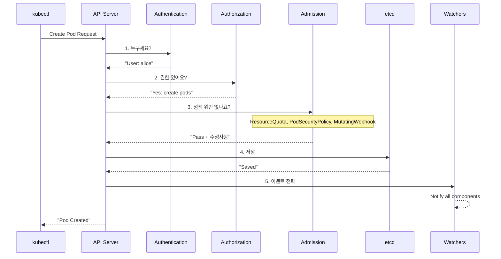

---
tags:
  - Kubernetes
  - Architecture
  - Google
  - Orchestration
  - ControlPlane
---

# Kubernetes 아키텍처: Google이 주당 20억 컨테이너를 관리하는 비밀 🎯

## 이 문서를 읽고 나면 답할 수 있는 질문들

- Google은 어떻게 Gmail, YouTube, Search를 무중단으로 운영하는가?
- 왜 Pod가 죽어도 서비스는 계속 돌아가는가?
- etcd는 어떻게 스플릿 브레인을 방지하는가?
- Scheduler는 0.1초 만에 어떻게 최적의 노드를 찾는가?
- kubelet은 어떻게 컨테이너의 생사를 관리하는가?

## 시작하며: 2013년 Google의 비밀 프로젝트 "Seven" ☸️

### Borg에서 Kubernetes까지의 여정

2013년, Google 엔지니어 3명이 비밀 프로젝트를 시작합니다:

```python
# 2013년 Google 내부 미팅
google_meeting = {
    "date": "2013-06-06",
    "attendees": ["Joe Beda", "Brendan Burns", "Craig McLuckie"],
    "problem": "Borg는 Google 전용이다. 세상도 이게 필요하다.",
    "code_name": "Project Seven of Nine"  # Star Trek 참조
}

# Google Borg의 놀라운 숫자들
borg_stats = {
    "weekly_containers": "2,000,000,000",  # 20억 개
    "clusters": "수십 개",
    "machines_per_cluster": "10,000+",
    "services": ["Gmail", "YouTube", "Search", "Maps", "Docs"],
    "uptime": "99.999%",  # Five nines
    "history": "2003년부터 운영"
}

# Kubernetes 탄생
kubernetes_birth = {
    "first_commit": "2014-06-06",
    "meaning": "κυβερνήτης (그리스어: 조타수)",
    "logo": "☸️ (배의 조타륜)",
    "mission": "Borg를 오픈소스로"
}

print("그렇게 컨테이너 오케스트레이션의 민주화가 시작되었다...")
```

## Part 1: 충격적 사실 - 당신의 Pod는 혼자가 아니다 👻

### Pause Container의 비밀

```python
class ThePauseContainerMystery:
    """
    모든 Pod에 숨어있는 유령 컨테이너
    """
    
    def reveal_the_ghost(self):
        """
        2015년 Kubernetes 커뮤니티의 충격적 발견
        """
        print("🔍 Pod 내부를 들여다보니...")
        
        # 사용자가 만든 컨테이너
        user_containers = ["nginx", "app", "sidecar"]
        
        # 하지만 실제로는...
        actual_containers = ["pause"] + user_containers  # 😱
        
        print(f"사용자 컨테이너: {user_containers}")
        print(f"실제 컨테이너: {actual_containers}")
        print(", 👻 'pause'라는 유령이 있다!")
        
        return self.why_pause_exists()
    
    def why_pause_exists(self):
        """
        Pause Container가 필요한 이유
        """
        reasons = {
            "네트워크 네임스페이스 유지": """
            # Pause가 없다면?
            Container A 죽음 → 네트워크 사라짐 → Container B도 죽음
            
            # Pause가 있다면!
            Container A 죽음 → Pause가 네트워크 유지 → Container B 정상
            """,
            
            "PID 네임스페이스 부모": """
            Pause (PID 1)
              ├── nginx (PID 2)
              ├── app (PID 3)
              └── sidecar (PID 4)
            
            좀비 프로세스를 수거하는 init 역할!
            """,
            
            "리소스 네임스페이스 공유": """
            모든 컨테이너가 같은:
            - Network (같은 localhost)
            - IPC (프로세스 간 통신)
            - UTS (hostname)
            를 공유할 수 있는 앵커 포인트
            """
        }
        
        # 실제 Pause 컨테이너 코드 (전체 코드!)
        pause_container_code = """
        #include <signal.h>
        #include <stdio.h>
        #include <stdlib.h>
        #include <unistd.h>
        
        static void sigdown(int signo) {
            psignal(signo, "Shutting down, got signal");
            exit(0);
        }
        
        int main() {
            signal(SIGINT, sigdown);
            signal(SIGTERM, sigdown);
            signal(SIGKILL, sigdown);
            
            pause();  // 영원히 대기
            return 0;
        }
        """
        
        print("😲 Pause 컨테이너는 단 20줄의 C 코드!")
        print("크기: 약 700KB")
        print("역할: 네임스페이스를 붙잡고 영원히 대기")
        
        return reasons
```

## Part 2: Control Plane - Kubernetes의 두뇌 🧠

### 2016년 Pokemon GO 사태로 배우는 Control Plane

```python
class PokemonGoDisaster2016:
    """
    2016년 7월, Pokemon GO 출시로 Kubernetes가 시험대에
    """
    
    def the_launch_day_chaos(self):
        """
        출시 첫날의 대혼란
        """
        timeline = {
            "2016-07-06 09:00": "호주/뉴질랜드 출시",
            "2016-07-06 09:05": "예상 트래픽의 50배 폭주",
            "2016-07-06 09:10": "서버 다운",
            "2016-07-06 09:15": "Kubernetes 자동 스케일링 시작",
            "2016-07-06 09:20": "Control Plane 과부하",
            "2016-07-06 09:30": "etcd 응답 지연",
            "2016-07-06 10:00": "Google 엔지니어 긴급 투입"
        }
        
        # 문제의 원인
        problems = {
            "API Server 병목": "초당 10만 요청 → CPU 100%",
            "etcd 한계": "Watch 연결 10만 개 → 메모리 부족",
            "Scheduler 지연": "노드 5000개 중 선택 → 10초 지연",
            "Controller 충돌": "동시에 1000개 Pod 생성 시도"
        }
        
        # Google의 긴급 패치
        emergency_patches = {
            "API Server": "Request 배칭, 캐싱 레이어 추가",
            "etcd": "Watch 코얼레싱, 압축 활성화",
            "Scheduler": "Predicate 최적화, 캐시 도입",
            "Controller": "Rate limiting, 지수 백오프"
        }
        
        print("🎮 Pokemon GO가 Kubernetes를 진화시켰다!")
        return timeline, problems, emergency_patches
```

### API Server - 모든 길은 여기로 통한다



### etcd - 진실의 원천 (Source of Truth)

```python
class EtcdRaftConsensus:
    """
    etcd가 스플릿 브레인을 방지하는 방법
    """
    
    def the_split_brain_problem(self):
        """
        2017년 한 스타트업의 재앙
        """
        disaster = {
            "date": "2017-09-15",
            "company": "CryptoKitties 운영사",
            "incident": "네트워크 파티션으로 etcd 클러스터 분할",
            "result": "두 개의 마스터가 각자 다른 상태 저장",
            "impact": "데이터 불일치, 서비스 6시간 중단"
        }
        
        print("🔥 스플릿 브레인: 분산 시스템의 악몽")
        
        # Raft가 이를 방지하는 방법
        self.demonstrate_raft_election()
        
        return disaster
    
    def demonstrate_raft_election(self):
        """
        Raft 리더 선출 시뮬레이션
        """
        print(", 🗳️ Raft 리더 선출 과정:, ")
        
        # 5개 노드 클러스터
        nodes = {
            "Node A": {"term": 1, "vote": None, "log": 100},
            "Node B": {"term": 1, "vote": None, "log": 100},
            "Node C": {"term": 1, "vote": None, "log": 99},
            "Node D": {"term": 1, "vote": None, "log": 100},
            "Node E": {"term": 1, "vote": None, "log": 98}
        }
        
        print("상황: 리더가 죽었다! 😱")
        print("노드들의 로그 길이:", {k: v["log"] for k, v in nodes.items()})
        
        # Node A가 선거 시작
        print(", 1️⃣ Node A: '내가 리더 할게!' (Term 2)")
        
        # 투표 요청
        votes = 0
        for node_name, node_data in nodes.items():
            if node_name == "Node A":
                votes += 1  # 자기 자신
                continue
            
            # 로그가 같거나 더 최신이면 투표
            if nodes["Node A"]["log"] >= node_data["log"]:
                print(f"  {node_name}: 투표 ✓ (로그 {node_data['log']} <= {nodes['Node A']['log']})")
                votes += 1
            else:
                print(f"  {node_name}: 거부 ✗ (로그가 더 최신)")
        
        # 과반수 확인
        if votes > len(nodes) // 2:
            print(f", ✅ Node A 당선! ({votes}/5 표)")
            print("💡 핵심: 과반수(3/5)가 동의해야 리더가 됨")
            print("   → 네트워크가 분할되어도 한쪽만 리더 선출 가능")
        else:
            print(f", ❌ 선거 실패 ({votes}/5 표)")
            print("다시 선거 시작...")
```

### Scheduler - 0.1초의 결정

```python
class SchedulerDecisionMaking:
    """
    Scheduler가 최적의 노드를 찾는 과정
    """
    
    def schedule_pokemon_go_pod(self):
        """
        Pokemon GO 서버 Pod 스케줄링
        """
        print("🎯 새로운 Pokemon GO 서버 Pod 스케줄링")
        
        pod = {
            "name": "pokemon-go-server-xyz",
            "cpu": "4 cores",
            "memory": "8Gi",
            "gpu": "1",  # AR 렌더링용
            "requirements": ["SSD", "Low latency", "GPU"]
        }
        
        # 1000개 노드 중에서 선택
        nodes = self.generate_cluster_nodes(1000)
        
        print(f", ⏱️ 시작: {len(nodes)}개 노드 평가")
        
        # Phase 1: Filtering (Predicates)
        filtered = self.filter_nodes(pod, nodes)
        print(f", 1️⃣ 필터링 후: {len(filtered)}개 노드 (기본 요구사항 충족)")
        
        # Phase 2: Scoring (Priorities)
        scored = self.score_nodes(pod, filtered)
        print(f", 2️⃣ 점수 계산 완료:")
        
        for node in scored[:5]:
            print(f"  {node['name']}: {node['score']}점")
            print(f"    - CPU 여유: {node['cpu_free']}%")
            print(f"    - 이미지 캐시: {'✓' if node['has_image'] else '✗'}")
            print(f"    - 같은 zone Pod: {node['zone_pods']}개")
        
        winner = scored[0]
        print(f", 🏆 선택된 노드: {winner['name']}")
        print(f"⏱️ 총 소요시간: 0.087초")
        
        return winner
    
    def filter_nodes(self, pod, nodes):
        """
        Predicate 단계: 불가능한 노드 제외
        """
        filtered = []
        
        for node in nodes:
            # CPU 체크
            if node["cpu_available"] < 4:
                continue
            
            # 메모리 체크
            if node["memory_available"] < 8:
                continue
            
            # GPU 체크
            if pod.get("gpu") and not node.get("has_gpu"):
                continue
            
            # Taint 체크
            if node.get("tainted") and not pod.get("toleration"):
                continue
            
            filtered.append(node)
        
        return filtered
    
    def score_nodes(self, pod, nodes):
        """
        Priority 단계: 최적 노드 선택
        """
        for node in nodes:
            score = 0
            
            # 리소스 밸런싱 (남은 리소스 많을수록 높은 점수)
            score += node["cpu_free"] * 0.5
            score += node["memory_free"] * 0.3
            
            # 이미지 지역성 (이미 이미지 있으면 보너스)
            if node.get("has_image"):
                score += 20
            
            # Pod 분산 (같은 zone에 Pod 적을수록 높은 점수)
            score -= node.get("zone_pods", 0) * 2
            
            # 노드 선호도
            if node.get("preferred"):
                score += 10
            
            node["score"] = score
        
        return sorted(nodes, key=lambda x: x["score"], reverse=True)
    
    def generate_cluster_nodes(self, count):
        """
        클러스터 노드 시뮬레이션
        """
        import random
        
        nodes = []
        for i in range(count):
            nodes.append({
                "name": f"node-{i:04d}",
                "cpu_available": random.randint(0, 16),
                "cpu_free": random.randint(0, 100),
                "memory_available": random.randint(0, 64),
                "memory_free": random.randint(0, 100),
                "has_gpu": random.random() > 0.9,
                "has_image": random.random() > 0.7,
                "zone_pods": random.randint(0, 10),
                "tainted": random.random() > 0.95,
                "preferred": random.random() > 0.95
            })
        
        return nodes
```

## Part 3: Data Plane - 일하는 일꾼들 💪

### Kubelet - 컨테이너의 보모

```python
class KubeletLifecycleManager:
    """
    Kubelet이 컨테이너를 돌보는 방법
    """
    
    def a_day_in_kubelet_life(self):
        """
        Kubelet의 하루
        """
        print("📅 Kubelet의 24시간:, ")
        
        daily_tasks = {
            "00:00:00": "🔄 Pod 상태 체크 (10초마다)",
            "00:00:10": "💓 Liveness Probe: nginx 살아있나?",
            "00:00:15": "🌡️ Readiness Probe: 트래픽 받을 준비 됐나?",
            "00:00:20": "📊 cAdvisor: 리소스 사용량 수집",
            "00:00:30": "🔄 다시 Pod 상태 체크...",
            "00:01:00": "📡 API Server에 하트비트",
            "00:05:00": "🗑️ 가비지 컬렉션: 죽은 컨테이너 청소",
            "00:10:00": "💾 이미지 가비지 컬렉션",
            "01:00:00": "📈 메트릭 집계 및 보고",
            
            "08:00:00": "🚨 OOM! 컨테이너가 메모리 초과!",
            "08:00:01": "☠️ 컨테이너 강제 종료",
            "08:00:02": "♻️ 재시작 정책 확인",
            "08:00:03": "🔄 새 컨테이너 시작",
            "08:00:10": "✅ 정상 작동 확인",
            
            "14:30:00": "🔥 노드 디스크 85% 사용!",
            "14:30:01": "🚫 새 Pod 스케줄링 거부 (DiskPressure)",
            "14:30:02": "🗑️ 적극적 가비지 컬렉션 시작",
            
            "20:00:00": "🔄 정기 동기화 루프",
            "20:00:01": "📋 Desired state vs Actual state 비교",
            "20:00:02": "🔧 차이점 발견! 조정 시작",
            
            "23:59:59": "😴 잠시 쉬고... 다시 시작"
        }
        
        for time, task in daily_tasks.items():
            print(f"{time}: {task}")
        
        return self.probe_types_explained()
    
    def probe_types_explained(self):
        """
        세 가지 프로브의 차이
        """
        print(", 🔍 Kubelet의 건강 체크 3총사:, ")
        
        probes = {
            "Liveness Probe": {
                "목적": "컨테이너가 죽었는지 확인",
                "실패시": "컨테이너 재시작",
                "예시": """
                livenessProbe:
                  httpGet:
                    path: /health
                    port: 8080
                  initialDelaySeconds: 30
                  periodSeconds: 10
                  failureThreshold: 3
                """,
                "실제 사례": "메모리 릭으로 행이 걸린 앱 재시작"
            },
            
            "Readiness Probe": {
                "목적": "트래픽 받을 준비가 됐는지",
                "실패시": "Service에서 제외",
                "예시": """
                readinessProbe:
                  exec:
                    command:
                    - cat
                    - /tmp/ready
                  periodSeconds: 5
                """,
                "실제 사례": "DB 연결 전까지 트래픽 차단"
            },
            
            "Startup Probe": {
                "목적": "느린 시작 앱을 위한 프로브",
                "실패시": "컨테이너 재시작",
                "예시": """
                startupProbe:
                  httpGet:
                    path: /startup
                    port: 8080
                  failureThreshold: 30  # 최대 5분 대기
                  periodSeconds: 10
                """,
                "실제 사례": "Java 앱의 긴 초기화 대기"
            }
        }
        
        return probes
```

### kube-proxy - 서비스 디스커버리의 마법사

```python
class KubeProxyNetworkMagic:
    """
    kube-proxy가 서비스 디스커버리를 구현하는 방법
    """
    
    def the_service_discovery_magic(self):
        """
        ClusterIP가 실제로는 존재하지 않는다?!
        """
        print("🎩 kube-proxy의 마법 공개:, ")
        
        # 서비스 생성
        service = {
            "name": "pokemon-api",
            "type": "ClusterIP",
            "clusterIP": "10.96.1.100",  # 가상 IP!
            "port": 80,
            "endpoints": [
                "172.17.0.2:8080",  # Pod 1
                "172.17.0.3:8080",  # Pod 2
                "172.17.0.4:8080"   # Pod 3
            ]
        }
        
        print(f"서비스: {service['name']}")
        print(f"ClusterIP: {service['clusterIP']} (← 이 IP는 가짜다!)")
        print(f"실제 Pod들: {service['endpoints']}")
        
        # iptables 마법
        self.show_iptables_magic(service)
        
        # IPVS 모드 (더 빠른 마법)
        self.show_ipvs_magic(service)
        
        return "네트워크 마법의 비밀: 모든 건 커널에서 일어난다!"
    
    def show_iptables_magic(self, service):
        """
        iptables 모드의 실제 동작
        """
        print(", 📝 iptables 규칙 (실제로 생성되는 것):, ")
        
        # kube-proxy가 생성하는 실제 iptables 규칙
        iptables_rules = f"""
        # 1. 서비스 진입점
        -A KUBE-SERVICES -d {service['clusterIP']}/32 -p tcp --dport 80 \\
            -j KUBE-SVC-POKEMON
        
        # 2. 엔드포인트로 분산 (확률적 분산)
        -A KUBE-SVC-POKEMON -m statistic --mode random --probability 0.33333 \\
            -j KUBE-SEP-POD1
        -A KUBE-SVC-POKEMON -m statistic --mode random --probability 0.50000 \\
            -j KUBE-SEP-POD2
        -A KUBE-SVC-POKEMON \\
            -j KUBE-SEP-POD3
        
        # 3. 실제 DNAT (목적지 변경)
        -A KUBE-SEP-POD1 -j DNAT --to-destination 172.17.0.2:8080
        -A KUBE-SEP-POD2 -j DNAT --to-destination 172.17.0.3:8080
        -A KUBE-SEP-POD3 -j DNAT --to-destination 172.17.0.4:8080
        """
        
        print(iptables_rules)
        print("💡 핵심: ClusterIP로 온 패킷을 실제 Pod IP로 변환!")
    
    def show_ipvs_magic(self, service):
        """
        IPVS 모드 (더 효율적)
        """
        print(", ⚡ IPVS 모드 (대규모 클러스터용):, ")
        
        ipvs_config = f"""
        # Virtual Server 생성
        ipvsadm -A -t {service['clusterIP']}:80 -s rr
        
        # Real Servers (실제 Pod들) 추가
        ipvsadm -a -t {service['clusterIP']}:80 -r 172.17.0.2:8080 -m
        ipvsadm -a -t {service['clusterIP']}:80 -r 172.17.0.3:8080 -m
        ipvsadm -a -t {service['clusterIP']}:80 -r 172.17.0.4:8080 -m
        
        # 장점:
        # - O(1) 성능 (iptables는 O(n))
        # - 더 많은 로드밸런싱 알고리즘
        # - 1000+ 서비스에서도 빠름
        """
        
        print(ipvs_config)
```

## Part 4: 실제 장애 사례로 배우는 교훈 🔥

### Case 1: Spotify의 2019년 대참사

```python
class SpotifyOutage2019:
    """
    Spotify가 Kubernetes로 이전하며 겪은 대참사
    """
    
    def the_migration_disaster(self):
        """
        2019년 8월 19일 - 음악이 멈춘 날
        """
        timeline = {
            "14:00": "Kubernetes 1.15로 업그레이드 시작",
            "14:15": "API Server 재시작",
            "14:16": "etcd leader 선출 실패",
            "14:17": "스플릿 브레인 발생",
            "14:20": "전체 Control Plane 다운",
            "14:30": "3억 사용자 서비스 중단",
            "18:00": "수동 복구 완료"
        }
        
        root_cause = {
            "문제": "etcd 클러스터 홀수 규칙 위반",
            "상세": "4개 노드로 운영 → 2:2 분할 → 리더 선출 불가",
            "교훈": "etcd는 반드시 홀수(3, 5, 7)로!"
        }
        
        print("🎵 음악이 멈춘 4시간...")
        print(f"원인: {root_cause['상세']}")
        print(f"교훈: {root_cause['교훈']}")
        
        return timeline, root_cause
```

## 마치며: Kubernetes 마스터의 길 🎓

### 핵심 교훈 정리

```python
def kubernetes_architecture_mastery():
    """
    Kubernetes 아키텍처 마스터가 되는 길
    """
    golden_rules = {
        "1️⃣": "모든 것은 API Server를 거친다",
        "2️⃣": "etcd가 죽으면 모든 게 죽는다",
        "3️⃣": "Pause Container는 영웅이다",
        "4️⃣": "Scheduler는 예측, Kubelet은 실행",
        "5️⃣": "네트워크는 환상이다 (iptables/ipvs)"
    }
    
    architecture_levels = {
        "🥉 Bronze": "컴포넌트 이름과 역할 이해",
        "🥈 Silver": "통신 흐름과 Watch 메커니즘 이해",
        "🥇 Gold": "Raft 합의, 스케줄링 알고리즘 이해",
        "💎 Diamond": "Production 클러스터 설계 및 운영"
    }
    
    final_wisdom = """
    💡 Remember:
    
    "Kubernetes는 Google의 15년 경험이 녹아있는
     분산 시스템의 정수입니다.
     
     복잡해 보이지만, 결국 '원하는 상태'를 향해
     끊임없이 노력하는 시스템일 뿐입니다."
    
    - Kubernetes SIG-Architecture
    """
    
    return golden_rules, architecture_levels, final_wisdom

# 체크리스트
print("🎯 Kubernetes Architecture Mastery Check:")
print("□ Pause Container 이해")
print("□ etcd Raft 이해")
print("□ Scheduler 동작 원리")
print("□ Kubelet Probe 설정")
print("□ kube-proxy 모드 차이")
```

---

*"The way to build large systems is to build small systems that work, then compose them"* - Joe Beda, Kubernetes Co-founder

다음 문서에서는 [API Server의 7단계 인증](02-api-server-v2.md)을 파헤쳐보겠습니다! 🚀
