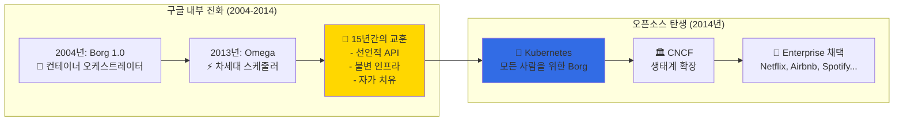

---
tags:
  - Kubernetes
  - Architecture
  - ControlPlane
  - etcd
  - APIServer
---

# Kubernetes Architecture - 구글이 20억 컨테이너를 관리하는 법 🏗️

## 이 섹션을 읽으면 답할 수 있는 질문들

- 구글은 어떻게 전 세계 데이터센터를 하나처럼 관리할까?
- API Server는 어떻게 초당 100만 요청을 처리하는가?
- etcd가 분산 환경에서 데이터 일관성을 보장하는 원리는?
- Scheduler는 어떻게 수천 개 Pod를 최적 배치하는가?
- Cloudflare는 어떻게 Kubernetes로 DDoS를 막았을까?

## 시작하며: 20억 컨테이너의 지휘자

### 충격적인 사실: 구글이 매주 실행하는 컨테이너 수

2017년, 구글 엔지니어 Eric Brewer가 공개한 놀라운 사실:

```python
# 구글의 일주일 컨테이너 운영 현황 (2017년)
google_weekly_stats = {
    "containers_launched": "2,000,000,000",  # 20억 개
    "services_managed": "thousands",
    "datacenters": "global_scale",
    "engineers_managing": "nobody_knows_where_containers_run"  # 충격!
}

print("🤯 깨달음: 구글 엔지니어들도 개별 컨테이너 위치를 모른다!")
```

**어떻게 이게 가능할까요?**바로 Kubernetes Architecture의**추상화 마법**덕분입니다.

### Kubernetes 탄생: Borg에서 배운 15년의 교훈



## Kubernetes Architecture 심층 탐구 📚

### [1. Overview: Google의 2B 컨테이너 비밀](01-overview.md)

**Google이 20억 개 컨테이너를 매주 실행하는 마법**

2017년 Google I/O에서 공개된 충격적인 사실부터, Kubernetes가 어떻게 전 세계 데이터센터를 하나의 거대한 컴퓨터처럼 다루는지 알아봅니다. 당신도 Google 엔지니어처럼 "컨테이너 위치를 몰라도" 서비스를 운영할 수 있게 됩니다.

🏗️**핵심 내용**:

- Control Plane vs Data Plane 완벽 분리
- Master-Worker 아키텍처의 숨은 장점
- Declarative API의 철학과 실제 구현
- Google Borg에서 Kubernetes로의 진화 과정

---

### [2. API Server: Cloudflare의 DDoS 방어 사례](02-api-server.md)

**초당 100만 요청을 버티는 단일 진입점**

Cloudflare가 어떻게 Kubernetes API Server를 활용해 대규모 DDoS 공격을 막았는지, API Server가 모든 클러스터 통신의 중심이 되면서도 단일 장애점이 되지 않는 비밀을 탐험합니다.

🎛️**핵심 내용**:

- API Server의 3단계 요청 처리 파이프라인
- Authentication, Authorization, Admission 체인
- etcd와의 최적화된 통신 패턴
- 대규모 트래픽 처리를 위한 확장성 설계

---

### [3. etcd: Discord의 10억 메시지 복구 이야기](03-etcd.md)

**분산 합의 알고리즘으로 데이터 일관성 보장**

Discord가 어떻게 etcd 장애 상황에서도 10억 개의 메시지 데이터를 안전하게 복구했는지, Raft 합의 알고리즘이 어떻게 분산 환경에서 데이터 일관성을 보장하는지 깊이 있게 다룹니다.

💾**핵심 내용**:

- Raft 합의 알고리즘의 실제 동작 원리
- etcd의 Watch 메커니즘과 이벤트 스트리밍
- Compaction과 Defragmentation 최적화
- 실제 장애 상황에서의 복구 전략

## Architecture 활용 시나리오 가이드 🎯

### 시나리오 1: 고가용성 Control Plane

```yaml
# Multi-Master 설정으로 단일 장애점 제거
apiVersion: kubeadm.k8s.io/v1beta3
kind: ClusterConfiguration
metadata:
  name: production-cluster
controlPlaneEndpoint: "k8s-api.company.com:6443"
etcd:
  external:
    endpoints:
    - "https://etcd1.company.com:2379"
    - "https://etcd2.company.com:2379"  
    - "https://etcd3.company.com:2379"
apiServer:
  certSANs:
  - "k8s-api.company.com"
  - "10.0.0.100"
controllerManager:
  extraArgs:
    leader-elect: "true"
    leader-elect-lease-duration: "15s"
scheduler:
  extraArgs:
    leader-elect: "true"
```

### 시나리오 2: API Server 성능 튜닝

```python
# API Server 요청 분석 및 최적화
class APIServerOptimization:
    """
    대규모 클러스터를 위한 API Server 최적화
    """
    
    def analyze_request_patterns(self):
        """
        API 요청 패턴 분석
        """
        patterns = {
            "list_requests": {
                "frequency": "high",
                "cost": "expensive",
                "optimization": "pagination + watch"
            },
            "get_requests": {
                "frequency": "very_high", 
                "cost": "cheap",
                "optimization": "client_caching"
            },
            "watch_requests": {
                "frequency": "constant",
                "cost": "memory_intensive",
                "optimization": "selective_watch"
            }
        }
        
        return patterns
    
    def configure_api_server(self):
        """
        고성능을 위한 API Server 설정
        """
        config = {
            "max_requests_inflight": 400,      # 동시 요청 제한
            "max_mutating_requests_inflight": 200,  # 변경 요청 제한
            "request_timeout": "1m0s",         # 요청 타임아웃
            "min_request_timeout": 1800,       # 최소 타임아웃
            "enable_priority_and_fairness": True,  # 우선순위 큐
            "goaway_chance": 0.02              # 연결 재분산
        }
        
        return config
```

### 시나리오 3: etcd 모니터링 및 백업

```python
class ETCDOperations:
    """
    운영 환경에서의 etcd 관리
    """
    
    def monitor_etcd_health(self):
        """
        etcd 클러스터 상태 모니터링
        """
        health_checks = [
            "etcdctl endpoint health --cluster",
            "etcdctl endpoint status --cluster -w table",
            "etcdctl member list -w table",
            "etcdctl alarm list"
        ]
        
        metrics = {
            "db_size": "< 8GB (권장)",
            "backend_commit_duration": "< 25ms", 
            "wal_fsync_duration": "< 10ms",
            "network_peer_round_trip_time": "< 50ms"
        }
        
        return health_checks, metrics
    
    def backup_strategy(self):
        """
        etcd 백업 전략
        """
        strategy = {
            "snapshot_frequency": "every_6_hours",
            "retention_policy": "30_days",
            "cross_region_backup": True,
            "automation": {
                "tool": "etcd-backup-operator",
                "storage": "s3://k8s-etcd-backups/",
                "encryption": "AES-256"
            }
        }
        
        return strategy
```

## Architecture 마스터 로드맵 🗺️

### 기초 (1주)

- [ ] Control Plane과 Data Plane 이해
- [ ] kubectl을 통한 API Server 통신 경험
- [ ] etcd 기본 CLI 명령어 숙달

### 중급 (1개월)

- [ ] API Server 인증/인가 메커니즘 구현
- [ ] etcd Watch를 활용한 실시간 모니터링
- [ ] Custom Resource Definition 작성

### 고급 (3개월)

- [ ] Multi-Master 클러스터 구축
- [ ] API Server 성능 튜닝
- [ ] etcd 백업/복구 자동화

### 전문가 (6개월+)

- [ ] Kubernetes Operator 패턴 구현
- [ ] Control Plane 장애 대응 시나리오
- [ ] 대규모 클러스터 아키텍처 설계

## 실전 트러블슈팅 🔧

### 문제 1: API Server 응답 지연

```python
api_server_debugging = {
    "일반적인_원인": [
        "etcd 응답 지연 (디스크 I/O)",
        "과도한 List 요청",
        "대량의 Watch 연결",
        "메모리/CPU 리소스 부족"
    ],
    
    "해결_방법": [
        "etcd 성능 최적화",
        "클라이언트 사이드 캐싱", 
        "Pagination 활용",
        "Request/Limit 튜닝"
    ],
    
    "모니터링_메트릭": [
        "apiserver_request_duration_seconds",
        "etcd_request_duration_seconds",
        "apiserver_current_inflight_requests"
    ]
}
```

### 문제 2: etcd 클러스터 Split-Brain

```python
etcd_split_brain_recovery = {
    "증상": [
        "클러스터 멤버 간 통신 실패",
        "Leader 선출 불가",
        "API Server 요청 타임아웃"
    ],
    
    "복구_절차": [
        "1. 네트워크 연결 상태 확인",
        "2. etcd 로그 분석",
        "3. 과반수 멤버로 새 클러스터 시작",
        "4. 나머지 멤버 재조인"
    ],
    
    "예방_방법": [
        "홀수 개 멤버 유지 (3, 5, 7)",
        "네트워크 파티션 방지",
        "정기적인 백업 수행"
    ]
}
```

## 성능 벤치마크 📊

### Control Plane 확장성

```python
scalability_limits = {
    "api_server": {
        "max_nodes": 5000,
        "max_pods_per_node": 110,
        "max_services": 10000,
        "max_concurrent_requests": 1000
    },
    
    "etcd": {
        "max_db_size": "8GB",
        "max_write_throughput": "10000/sec", 
        "max_read_throughput": "200000/sec",
        "recommended_members": 3
    },
    
    "scheduler": {
        "scheduling_throughput": "100_pods/sec",
        "max_pending_pods": 1000,
        "decision_latency": "< 100ms"
    }
}
```

## 마치며: Architecture는 Kubernetes의 심장

Kubernetes Architecture를 깊이 이해하면, 단순한 컨테이너 관리 도구가 아닌**분산 시스템의 걸작**임을 알게 됩니다.

**Architecture가 가르쳐주는 교훈들**:

1. 🎯**선언적 설계**: 원하는 상태만 정의하면 시스템이 알아서 달성
2. 🔄**자가 치유**: 장애를 감지하고 자동으로 복구
3. 📈**무한 확장**: 수평적 확장의 한계가 없는 설계
4. 🛡️**견고한 추상화**: 복잡성을 숨기고 단순한 인터페이스 제공

이제 Control Plane의 깊은 내부로 들어가 볼 준비가 되셨나요? 🚀

---

**다음 읽기**: [Overview: Google의 2B 컨테이너 비밀](01-overview.md)
