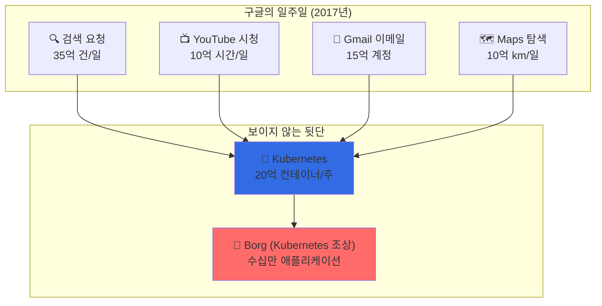
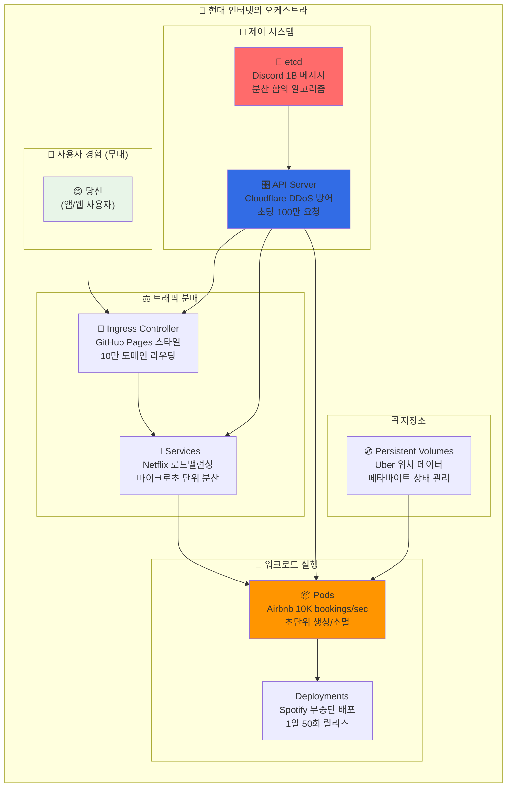
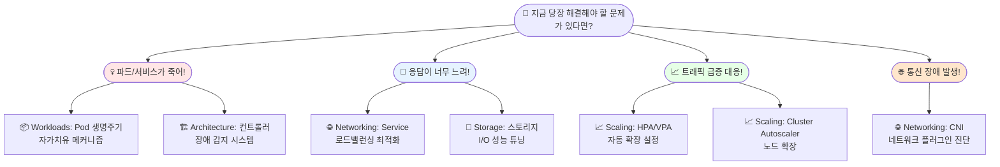
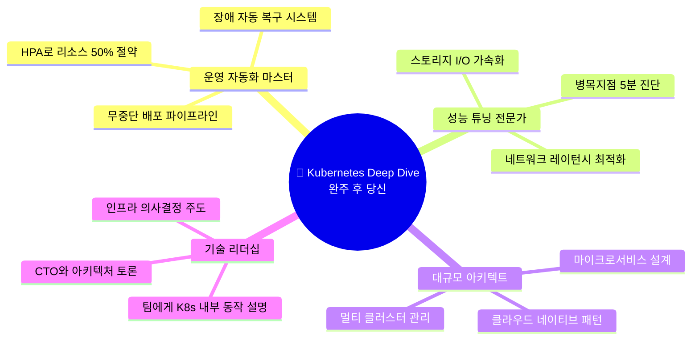

---
tags:
  - Kubernetes
  - Container
  - Orchestration
  - Microservices
---

# Kubernetes Deep Dive - 20억 컨테이너를 춤추게 하는 오케스트레이터 🎼

## 🌍 당신이 모르는 사이 쿠버네티스가 하고 있는 일

지금 이 순간에도 쿠버네티스는 세상을 움직이고 있습니다:

**"검색 한 번, 동영상 재생 한 번, 메시지 전송 한 번... 뒤에선 수천 개 컨테이너가 춤춘다"**

```text
🎯 의도: 간단한 웹사이트 방문
💥 실제: 마이크로서비스 100개가 동시에 작업
⏰ 속도: 평균 응답시간 10ms 이내  
🎭 결과: 당신은 아무것도 모른 채 완벽한 경험
```

## 💡 2017년 Kubernetes가 보여준 마법

구글이 2017년 공개한 충격적인 사실:

**"우리는 매주 20억 개의 컨테이너를 실행합니다."**



**하지만 여기서 진짜 충격은**: 구글 엔지니어들조차 **개별 컨테이너가 어디서 실행되는지 모른다**는 사실입니다.

## 🔍 이 가이드가 특별한 이유

대부분의 Kubernetes 가이드는 "kubectl 명령어"만 알려줍니다. 하지만 이 가이드는 다릅니다:

**🏗️ What**: Kubernetes가 정확히 어떻게 구축되었는가  
**🧠 Why**: 왜 그런 복잡한 설계가 필요했는가  
**⚡ How**: 어떻게 하면 대규모 서비스에서 안정적으로 운영할 수 있는가  

### 읽고 나면 이런 변화가 생깁니다

- 🚀 **"파드가 왜 죽었지?"** → 10초 만에 원인 파악과 해결책 제시
- 💰 **"리소스 비용이 너무 많이 나와"** → HPA/VPA로 50% 비용 절감  
- 🌊 **"트래픽 급증 시 장애"** → 오토스케일링으로 무중단 서비스
- 👥 **"팀원들과의 기술 소통"** → K8s 내부 동작을 설명하며 시니어 엔지니어로 성장

## 🎭 실제 기업들의 Kubernetes 대서사시



**🎬 이게 바로 당신이 Spotify에서 음악을 듣고, Airbnb로 숙박을 예약하고, Discord로 채팅할 때 뒤에서 일어나는 일입니다.**

## 🎬 대기업들의 위기와 해결 스토리로 배우는 Kubernetes

각 섹션은 실제 기업이 겪은 **극한 상황과 해결** 드라마를 중심으로 구성되었습니다.

### 🏗️ [Architecture: 구글이 20억 컨테이너를 관리하는 법](architecture/index.md)

**"어떻게 한 번에 20억 개의 컨테이너를 관리할 수 있을까?"** 🏗️🤖

```text
🎯 이런 궁금증이 있다면 필독:
• 구글은 어떻게 전 세계 데이터센터를 하나처럼 관리할까?
• API Server는 어떻게 초당 100만 요청을 버틸까?
• etcd가 분산 환경에서 데이터 일관성을 보장하는 원리는?
• Cloudflare DDoS 공격을 Kubernetes로 어떻게 막았을까?
```

**🏗️ [컨트롤 플레인의 비밀 파헤치기 →](architecture/index.md)**

---

### 📦 [Workloads: 에어비앤비가 10K 예약/초를 처리하는 비밀](workloads/index.md)

**"어떻게 파드 하나가 죽어도 서비스는 멈추지 않을까?"** 📦⚡

```text
🔥 이런 경험이 있다면 꼭 읽어보세요:
• "갑자기 파드가 죽었는데 왜 서비스는 정상이지?"
• "Deployment와 StatefulSet, 언제 뭘 써야 할까?"
• "에어비앤비는 어떻게 초당 1만 건 예약을 처리할까?"
• DaemonSet으로 모든 노드에서 로그를 수집하는 마법은?
```

**📦 [워크로드 오케스트레이션의 예술 배우기 →](workloads/index.md)**

---

### 🌐 [Networking: 넷플릭스가 마이크로초 로드밸런싱을 구현한 방법](networking/index.md)

**"마이크로서비스 100개가 어떻게 서로를 찾아 통신할까?"** 🌐🎯

```text
💫 이런 의문이 든 적 있다면:
• 파드끼리 어떻게 IP 없이 이름만으로 통신할까?
• Service mesh 없이도 로드밸런싱이 가능한 이유는?
• GitHub Pages는 어떻게 수십만 도메인을 라우팅할까?
• CNI 플러그인이 네트워크 성능에 미치는 영향은?
```

**🌐 [쿠버네티스 네트워킹의 마법 알아보기 →](networking/index.md)**

---

### 💾 [Storage: 우버가 페타바이트 상태 데이터를 관리하는 기술](storage/index.md)

**"컨테이너가 재시작돼도 데이터가 사라지지 않는 이유는?"** 💾🔒

```text
🗄️ 이런 스토리지 고민이 있다면:
• "컨테이너는 stateless인데 어떻게 DB를 운영하지?"
• "PV와 PVC의 차이점과 실제 사용법은?"
• "우버는 어떻게 운전자 위치를 실시간 저장할까?"
• CSI 드라이버로 클라우드 스토리지를 연동하는 원리는?
```

**💾 [영구 스토리지 관리의 비밀 탐험하기 →](storage/index.md)**

---

### 📈 [Scaling: 타겟이 블랙 프라이데이를 버틴 자동 확장의 과학](scaling/index.md)

**"트래픽이 갑자기 10배 늘어나도 서비스가 안정적인 이유는?"** 📈🚀

```text
🚀 이런 확장성 도전에 직면했다면:
• "트래픽 급증 시 어떻게 자동으로 파드가 늘어날까?"
• "HPA와 VPA의 차이점과 언제 어떤 걸 써야 할까?"
• "타겟이 블랙 프라이데이를 어떻게 버텨냈을까?"
• Cluster Autoscaler로 노드까지 자동 확장하는 원리는?
```

**📈 [자동 확장의 과학 마스터하기 →](scaling/index.md)**

## 🎯 어떤 순서로 읽어야 할까?

**🔥 급한 운영 문제 해결이 우선이라면:**



**📚 체계적으로 Kubernetes를 마스터하고 싶다면:**

**1단계 - 핵심 이해**: [🏗️ Architecture](architecture/index.md) → [📦 Workloads](workloads/index.md)  
*"쿠버네티스는 어떻게 작동하고, 어떻게 애플리케이션을 관리할까?"*

**2단계 - 네트워킹**: [🌐 Networking](networking/index.md) → [💾 Storage](storage/index.md)  
*"마이크로서비스는 어떻게 통신하고, 데이터는 어떻게 유지될까?"*

**3단계 - 운영 최적화**: [📈 Scaling](scaling/index.md)  
*"어떻게 탄력적이고 효율적으로 확장할까?"*

## 🎁 이 가이드가 당신에게 줄 선물



---

## 🚀 지금 시작해보세요

**"쿠버네티스는 복잡하지만, 그 복잡함 뒤에 숨겨진 아름다운 설계를 이해하면 마법처럼 느껴집니다."**

💬 *"Architecture 섹션 읽고 etcd 동작 원리를 이해하니까, 클러스터 장애 대응이 완전히 달라졌어요!"*  
**- 플랫폼 엔지니어, 박○○님**

💬 *"Workloads 가이드로 StatefulSet 제대로 배워서, 데이터베이스를 K8s에서 안정적으로 운영하고 있습니다!"*  
**- DevOps 팀장, 김○○님**

**📊 이 가이드의 규모:**  
✨ **25개 심층 문서** | 🎬 **5개 기업 스토리 섹션** | 🐍 **200+ YAML/Go 코드 예제** | 📊 **60+ 아키텍처 다이어그램**

**🎯 첫 번째 섹션부터 바로 내부 동작 원리를 경험하세요:**  
👉 **[🏗️ Architecture: 구글이 20억 컨테이너를 관리하는 법 시작하기 →](architecture/index.md)**
