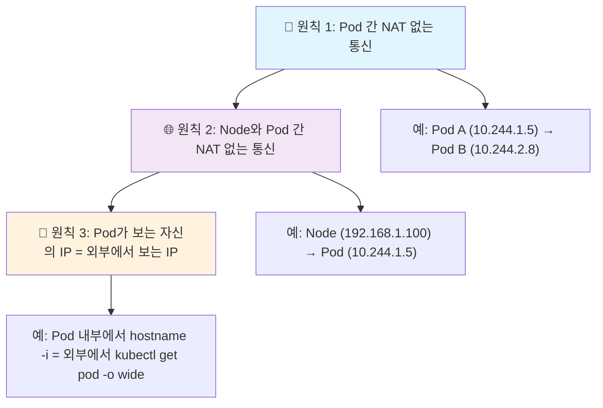
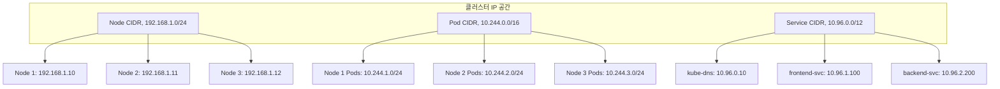
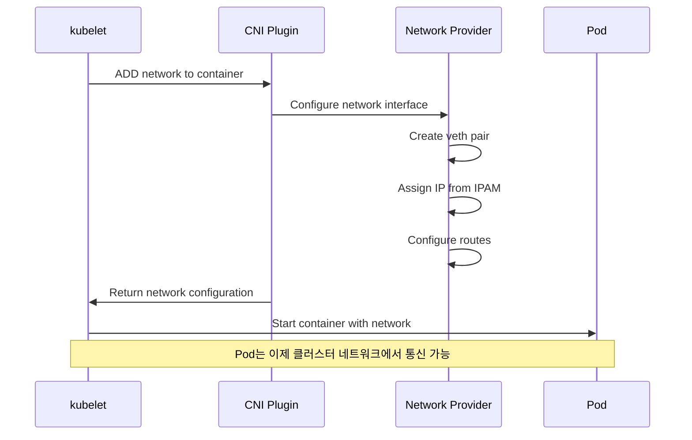
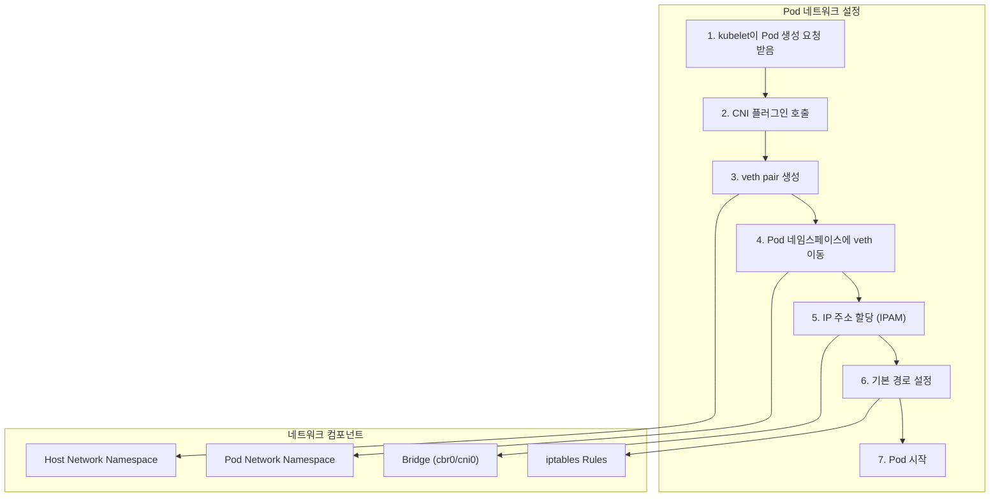
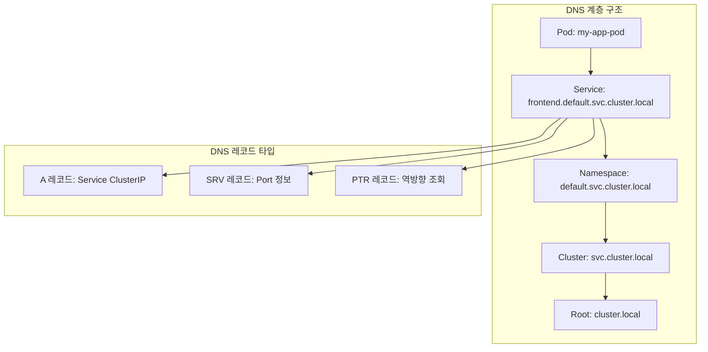

---
tags:
  - Kubernetes
  - Networking
  - CNI
  - CoreDNS
---

# Kubernetes 클러스터 네트워킹 모델

## 🎯 개요

2019년 블랙 프라이데이, Shopify의 트래픽이 평소의 10배로 급증했습니다. 수천 개의 마이크로서비스가 동시에 통신하며 주문을 처리하는 상황에서, 한 가지 놀라운 사실이 있었습니다. **모든 Pod는 서로를 직접 찾아 통신할 수 있었고, 복잡한 NAT나 포트 매핑 없이도 안정적으로 동작했습니다.**

이것이 바로 Kubernetes의 혁신적인 네트워킹 모델의 힘입니다. 전통적인 가상 머신 환경에서는 복잡한 포트 포워딩과 프록시 설정이 필요했지만, Kubernetes는 **"모든 Pod가 고유한 IP를 갖고 서로 직접 통신한다"**는 단순하면서도 강력한 원칙을 제시했습니다.

## 📖 Kubernetes 네트워킹 원칙

### 핵심 원칙 3가지

Kubernetes 네트워킹은 세 가지 핵심 원칙을 기반으로 합니다:



### 1. Pod 간 NAT 없는 통신

**전통적인 방식의 문제점:**

```python
# 전통적인 컨테이너 네트워킹 (Docker 기본 모드)
class DockerNetworking:
    def __init__(self):
        self.bridge = "docker0"  # 172.17.0.1
        self.containers = {}
    
    def communicate(self, container_a, container_b):
        # 복잡한 포트 매핑과 NAT 필요
        port_mapping = {
            "container_a": {"internal": 8080, "external": 32001},
            "container_b": {"internal": 8080, "external": 32002}
        }
        
        # 외부 포트로만 통신 가능
        return f"http://host:{port_mapping['container_b']['external']}"
```

**Kubernetes 방식의 장점:**

```python
# Kubernetes Pod 네트워킹
class KubernetesPodNetworking:
    def __init__(self):
        self.pod_cidr = "10.244.0.0/16"
        self.pods = {
            "frontend-pod": "10.244.1.5",
            "backend-pod": "10.244.2.8",
            "database-pod": "10.244.3.12"
        }
    
    def communicate(self, source_pod, target_pod):
        # 직접 IP 통신 - NAT 불필요!
        source_ip = self.pods[source_pod]
        target_ip = self.pods[target_pod]
        
        return f"Direct communication: {source_ip} → {target_ip}:8080"
    
    def service_discovery(self, service_name):
        # DNS 기반 서비스 발견
        return f"{service_name}.default.svc.cluster.local"
```

### 2. 클러스터 IP 공간 설계

**IP 주소 공간 분할:**



```python
class ClusterNetworkManager:
    def __init__(self):
        self.network_config = {
            "cluster_cidr": "10.244.0.0/16",      # Pod 전용
            "service_cidr": "10.96.0.0/12",       # Service 전용
            "node_cidr": "192.168.1.0/24"         # Node 전용
        }
        self.node_pod_cidrs = {}
    
    def allocate_pod_cidr(self, node_name):
        """각 노드에 Pod CIDR 블록 할당"""
        node_count = len(self.node_pod_cidrs)
        pod_subnet = f"10.244.{node_count + 1}.0/24"  # 각 노드당 254개 Pod IP
        
        self.node_pod_cidrs[node_name] = {
            "cidr": pod_subnet,
            "available_ips": list(range(2, 255)),  # .1은 게이트웨이용
            "allocated_pods": {}
        }
        
        return pod_subnet
    
    def assign_pod_ip(self, node_name, pod_name):
        """Pod에 IP 주소 할당"""
        node_info = self.node_pod_cidrs[node_name]
        if not node_info["available_ips"]:
            raise Exception("No more IPs available on this node")
        
        ip_suffix = node_info["available_ips"].pop(0)
        node_subnet = node_info["cidr"].split('/')[0].rsplit('.', 1)[0]
        pod_ip = f"{node_subnet}.{ip_suffix}"
        
        node_info["allocated_pods"][pod_name] = pod_ip
        return pod_ip
```

## 🌐 네트워크 구현 아키텍처

### Container Network Interface (CNI) 개요



### 네트워크 구현 방식

#### 1. Overlay 네트워크 (VXLAN)

**Flannel VXLAN 모드 예시:**

```python
class FlannelVXLAN:
    def __init__(self):
        self.vxlan_config = {
            "network": "10.244.0.0/16",
            "backend_type": "vxlan",
            "vni": 1,  # VXLAN Network Identifier
            "port": 8472
        }
        self.node_mappings = {}
    
    def setup_vxlan_interface(self, node_ip, pod_subnet):
        """VXLAN 터널 인터페이스 설정"""
        commands = [
            # VXLAN 인터페이스 생성
            f"ip link add flannel.1 type vxlan id 1 dev eth0 dstport 8472",
            
            # IP 주소 할당
            f"ip addr add {pod_subnet} dev flannel.1",
            
            # 인터페이스 활성화
            f"ip link set flannel.1 up",
            
            # 라우팅 규칙 추가
            f"ip route add 10.244.0.0/16 dev flannel.1"
        ]
        
        return commands
    
    def create_tunnel_route(self, dest_subnet, dest_node_ip):
        """다른 노드로의 터널 라우팅 생성"""
        return [
            f"ip route add {dest_subnet} via {dest_node_ip} dev flannel.1",
            f"bridge fdb append 00:00:00:00:00:00 dev flannel.1 dst {dest_node_ip}"
        ]
```

#### 2. 라우팅 기반 네트워크

**Calico BGP 모드 예시:**

```python
class CalicoBGP:
    def __init__(self):
        self.bgp_config = {
            "as_number": 64512,
            "router_id": "auto",
            "network": "10.244.0.0/16"
        }
        self.bird_config = {}
    
    def generate_bird_config(self, node_ip, neighbors):
        """BIRD BGP 라우터 설정 생성"""
        config = f"""
# BIRD 라우터 설정
router id {node_ip};

# BGP 프로토콜 정의
protocol bgp kubernetes {{
    description "Kubernetes BGP";
    local as {self.bgp_config['as_number']};
    
    # 이웃 노드들과 BGP 피어링
"""
        
        for neighbor_ip in neighbors:
            config += f"""
    neighbor {neighbor_ip} as {self.bgp_config['as_number']};
"""
        
        config += """
    # Pod CIDR 경로 광고
    export filter {
        if net ~ 10.244.0.0/16 then accept;
        reject;
    };
}
"""
        
        return config
    
    def advertise_pod_routes(self, node_subnet):
        """Pod 서브넷을 BGP로 광고"""
        return f"ip route add {node_subnet} dev cali+ proto bird"
```

#### 3. 클라우드 프로바이더 통합

**AWS VPC CNI 예시:**

```python
class AWSVPCCNI:
    def __init__(self, instance_type="m5.large"):
        self.instance_limits = {
            "m5.large": {"max_enis": 3, "ips_per_eni": 10},
            "m5.xlarge": {"max_enis": 4, "ips_per_eni": 15},
            "m5.2xlarge": {"max_enis": 4, "ips_per_eni": 15}
        }
        self.instance_type = instance_type
    
    def calculate_max_pods(self):
        """인스턴스 타입별 최대 Pod 수 계산"""
        limits = self.instance_limits[self.instance_type]
        
        # 첫 번째 ENI는 Primary IP 사용
        primary_eni_pods = limits["ips_per_eni"] - 1
        
        # 나머지 ENI는 모든 IP 사용 가능
        secondary_eni_pods = (limits["max_enis"] - 1) * limits["ips_per_eni"]
        
        return primary_eni_pods + secondary_eni_pods
    
    def assign_pod_ip(self, pod_name):
        """AWS ENI에서 Secondary IP를 Pod에 할당"""
        return {
            "method": "ENI Secondary IP",
            "pod_ip": "192.168.1.100",  # VPC CIDR 범위 내
            "subnet": "subnet-abc123",
            "security_groups": ["sg-pod-default"],
            "direct_vpc_routing": True
        }
```

## 🎯 Pod 네트워킹 구현

### Pod 네트워크 설정 과정



### veth pair 구현

```python
class VethPairManager:
    def __init__(self):
        self.bridge_name = "cni0"
        self.pods = {}
    
    def create_veth_pair(self, pod_name, pod_ip, netns_path):
        """veth pair 생성 및 설정"""
        host_veth = f"veth{pod_name[:8]}"
        pod_veth = "eth0"
        
        commands = [
            # veth pair 생성
            f"ip link add {host_veth} type veth peer name {pod_veth}",
            
            # Pod veth를 네임스페이스로 이동
            f"ip link set {pod_veth} netns {netns_path}",
            
            # Host veth를 브리지에 연결
            f"ip link set {host_veth} master {self.bridge_name}",
            f"ip link set {host_veth} up",
            
            # Pod 네임스페이스에서 인터페이스 설정
            f"ip netns exec {netns_path} ip addr add {pod_ip}/24 dev {pod_veth}",
            f"ip netns exec {netns_path} ip link set {pod_veth} up",
            f"ip netns exec {netns_path} ip route add default via 169.254.1.1 dev {pod_veth}"
        ]
        
        self.pods[pod_name] = {
            "host_veth": host_veth,
            "pod_veth": pod_veth,
            "ip": pod_ip,
            "netns": netns_path
        }
        
        return commands
    
    def setup_bridge(self):
        """CNI 브리지 설정"""
        return [
            f"ip link add {self.bridge_name} type bridge",
            f"ip link set {self.bridge_name} up",
            f"ip addr add 10.244.1.1/24 dev {self.bridge_name}"
        ]
```

### iptables 규칙 관리

```python
class IptablesManager:
    def __init__(self):
        self.cluster_cidr = "10.244.0.0/16"
        self.service_cidr = "10.96.0.0/12"
    
    def setup_pod_networking_rules(self):
        """Pod 네트워킹을 위한 iptables 규칙"""
        rules = [
            # Pod 간 통신 허용
            f"iptables -A FORWARD -s {self.cluster_cidr} -j ACCEPT",
            f"iptables -A FORWARD -d {self.cluster_cidr} -j ACCEPT",
            
            # NAT 규칙 (외부 통신용)
            f"iptables -t nat -A POSTROUTING -s {self.cluster_cidr} ! -d {self.cluster_cidr} -j MASQUERADE",
            
            # 서비스 트래픽 허용
            f"iptables -A FORWARD -s {self.service_cidr} -j ACCEPT",
            f"iptables -A FORWARD -d {self.service_cidr} -j ACCEPT"
        ]
        
        return rules
    
    def setup_service_rules(self, service_ip, service_port, endpoints):
        """Service에 대한 로드밸런싱 규칙"""
        rules = []
        
        # 각 엔드포인트에 대한 DNAT 규칙
        for i, endpoint in enumerate(endpoints):
            endpoint_ip, endpoint_port = endpoint.split(':')
            probability = f"1/{len(endpoints) - i}"
            
            rules.append(
                f"iptables -t nat -A KUBE-SERVICES "
                f"-d {service_ip}/32 -p tcp --dport {service_port} "
                f"-m statistic --mode random --probability {probability} "
                f"-j DNAT --to-destination {endpoint_ip}:{endpoint_port}"
            )
        
        return rules
```

## 🔍 클러스터 DNS (CoreDNS)

### DNS 기반 서비스 디스커버리

Kubernetes의 DNS 시스템은 Service와 Pod에 대한 자동 이름 해석을 제공합니다:



### CoreDNS 설정

```python
class CoreDNSManager:
    def __init__(self):
        self.cluster_domain = "cluster.local"
        self.cluster_dns_ip = "10.96.0.10"
        self.upstream_servers = ["8.8.8.8", "8.8.4.4"]
    
    def generate_corefile(self):
        """CoreDNS Corefile 설정 생성"""
        return f"""
# Kubernetes DNS 처리
{self.cluster_domain}:53 {{
    errors
    health {{
        lameduck 5s
    }}
    ready
    kubernetes {self.cluster_domain} in-addr.arpa ip6.arpa {{
        pods insecure
        fallthrough in-addr.arpa ip6.arpa
        ttl 30
    }}
    prometheus :9153
    forward . /etc/resolv.conf {{
        max_concurrent 1000
    }}
    cache 30
    loop
    reload
    loadbalance
}}

# 외부 DNS 처리
.:53 {{
    errors
    health
    ready
    kubernetes {self.cluster_domain} in-addr.arpa ip6.arpa {{
        pods insecure
        fallthrough in-addr.arpa ip6.arpa
    }}
    forward . {' '.join(self.upstream_servers)}
    cache 30
    loop
    reload
    loadbalance
}}
"""
    
    def resolve_service(self, service_name, namespace="default"):
        """서비스 이름을 IP로 해석"""
        fqdn = f"{service_name}.{namespace}.svc.{self.cluster_domain}"
        
        return {
            "fqdn": fqdn,
            "type": "A",
            "ttl": 30,
            "records": ["10.96.1.100"]  # Service ClusterIP
        }
    
    def resolve_pod(self, pod_ip):
        """Pod IP를 DNS 이름으로 변환"""
        # Pod IP 10.244.1.5 → 1-5.10-244-1.default.pod.cluster.local
        ip_parts = pod_ip.split('.')
        pod_dns = f"{ip_parts[2]}-{ip_parts[3]}.{ip_parts[0]}-{ip_parts[1]}.default.pod.{self.cluster_domain}"
        
        return {
            "fqdn": pod_dns,
            "type": "A", 
            "ttl": 30,
            "records": [pod_ip]
        }
```

### DNS 정책과 성능 최적화

```python
class DNSOptimizer:
    def __init__(self):
        self.dns_policies = {
            "Default": "Use node DNS settings",
            "ClusterFirst": "Use cluster DNS first, then node DNS",
            "ClusterFirstWithHostNet": "For hostNetwork pods",
            "None": "Custom DNS configuration required"
        }
    
    def optimize_dns_config(self, workload_type):
        """워크로드 타입별 DNS 최적화"""
        configs = {
            "web_service": {
                "policy": "ClusterFirst",
                "ndots": 2,  # 짧은 이름도 허용
                "searches": ["default.svc.cluster.local", "svc.cluster.local"],
                "nameservers": ["10.96.0.10"],
                "options": [
                    {"name": "timeout", "value": "2"},
                    {"name": "attempts", "value": "2"}
                ]
            },
            "batch_job": {
                "policy": "ClusterFirst", 
                "ndots": 1,  # 외부 도메인 조회 최적화
                "searches": ["default.svc.cluster.local"],
                "nameservers": ["10.96.0.10", "8.8.8.8"],
                "options": [
                    {"name": "single-request-reopen", "value": None}
                ]
            }
        }
        
        return configs.get(workload_type, configs["web_service"])
    
    def setup_dns_caching(self):
        """노드 레벨 DNS 캐싱 설정"""
        return {
            "nodelocal_dns": {
                "enabled": True,
                "local_dns": "169.254.20.10",
                "cache_size": 1000,
                "negative_cache_ttl": 30
            },
            "pod_dns_config": {
                "nameservers": ["169.254.20.10"],  # NodeLocal DNS
                "searches": ["default.svc.cluster.local"],
                "options": [
                    {"name": "ndots", "value": "2"},
                    {"name": "edns0", "value": None}
                ]
            }
        }
```

## 🛠️ 실전 활용

### 1. 네트워크 트러블슈팅

**연결 문제 진단 스크립트:**

```python
class NetworkTroubleshooter:
    def __init__(self):
        self.diagnostic_tools = ["ping", "nslookup", "traceroute", "netstat", "ss"]
    
    def diagnose_pod_connectivity(self, source_pod, target_pod):
        """Pod 간 연결 문제 진단"""
        checks = {
            "basic_connectivity": [
                f"kubectl exec {source_pod} -- ping -c 3 {target_pod}",
                f"kubectl exec {source_pod} -- nc -zv {target_pod} 8080"
            ],
            "dns_resolution": [
                f"kubectl exec {source_pod} -- nslookup kubernetes.default",
                f"kubectl exec {source_pod} -- nslookup {target_pod}"
            ],
            "routing_check": [
                f"kubectl exec {source_pod} -- ip route",
                f"kubectl exec {source_pod} -- arp -a"
            ],
            "firewall_check": [
                "iptables -L -n | grep -E 'DROP|REJECT'",
                "kubectl get networkpolicies"
            ]
        }
        
        return checks
    
    def check_cni_status(self, node_name):
        """CNI 플러그인 상태 확인"""
        return {
            "cni_config": "/etc/cni/net.d/",
            "cni_bin": "/opt/cni/bin/",
            "pod_cidrs": f"kubectl get node {node_name} -o jsonpath='{{.spec.podCIDR}}'",
            "network_interfaces": f"kubectl debug node/{node_name} -- ip link show"
        }
```

### 2. 네트워크 정책 설계

```python
class NetworkPolicyDesigner:
    def __init__(self):
        self.default_policies = {}
    
    def create_default_deny_policy(self, namespace):
        """기본 거부 정책 생성"""
        return {
            "apiVersion": "networking.k8s.io/v1",
            "kind": "NetworkPolicy",
            "metadata": {
                "name": "default-deny-all",
                "namespace": namespace
            },
            "spec": {
                "podSelector": {},  # 모든 Pod에 적용
                "policyTypes": ["Ingress", "Egress"]
            }
        }
    
    def create_microservice_policy(self, service_name, allowed_services):
        """마이크로서비스별 네트워크 정책"""
        return {
            "apiVersion": "networking.k8s.io/v1",
            "kind": "NetworkPolicy", 
            "metadata": {
                "name": f"{service_name}-netpol"
            },
            "spec": {
                "podSelector": {
                    "matchLabels": {"app": service_name}
                },
                "policyTypes": ["Ingress", "Egress"],
                "ingress": [
                    {
                        "from": [
                            {
                                "podSelector": {
                                    "matchLabels": {"app": svc}
                                }
                            }
                            for svc in allowed_services
                        ],
                        "ports": [
                            {"protocol": "TCP", "port": 8080}
                        ]
                    }
                ],
                "egress": [
                    {
                        "to": [
                            {
                                "podSelector": {
                                    "matchLabels": {"app": "database"}
                                }
                            }
                        ],
                        "ports": [
                            {"protocol": "TCP", "port": 5432}
                        ]
                    }
                ]
            }
        }
```

### 3. 네트워크 성능 모니터링

```python
class NetworkMonitor:
    def __init__(self):
        self.metrics_endpoints = {
            "prometheus": "http://prometheus.monitoring:9090",
            "grafana": "http://grafana.monitoring:3000"
        }
    
    def collect_network_metrics(self):
        """네트워크 성능 메트릭 수집"""
        return {
            "bandwidth_metrics": [
                "container_network_receive_bytes_total",
                "container_network_transmit_bytes_total"
            ],
            "latency_metrics": [
                "coredns_dns_request_duration_seconds",
                "rest_client_request_duration_seconds"
            ],
            "error_metrics": [
                "container_network_receive_errors_total",
                "coredns_dns_responses_total{rcode!='NOERROR'}"
            ]
        }
    
    def setup_network_dashboard(self):
        """네트워크 모니터링 대시보드 설정"""
        return {
            "panels": [
                {
                    "title": "Pod 네트워크 트래픽",
                    "query": "rate(container_network_receive_bytes_total[5m])"
                },
                {
                    "title": "DNS 해석 지연시간", 
                    "query": "histogram_quantile(0.95, coredns_dns_request_duration_seconds_bucket)"
                },
                {
                    "title": "CNI 플러그인 성능",
                    "query": "cni_operations_duration_seconds"
                }
            ]
        }
```

## 📊 성능 최적화

### DNS 성능 최적화

```python
class DNSPerformanceOptimizer:
    def __init__(self):
        self.optimization_strategies = {}
    
    def optimize_ndots(self, workload_profile):
        """ndots 최적화로 DNS 조회 횟수 감소"""
        profiles = {
            "internal_services": {
                "ndots": 2,  # cluster.local 도메인 우선
                "expected_queries": 1
            },
            "external_apis": {
                "ndots": 1,  # 외부 FQDN 우선
                "expected_queries": 1
            },
            "mixed_workload": {
                "ndots": 2,
                "search_domains": ["default.svc.cluster.local"],
                "expected_queries": 1.5
            }
        }
        
        return profiles[workload_profile]
    
    def setup_nodelocal_dns(self):
        """NodeLocal DNSCache 설정"""
        return {
            "daemonset_config": {
                "cache_size": 1000,
                "negative_cache_ttl": 30,
                "local_dns_ip": "169.254.20.10",
                "prometheus_metrics": True
            },
            "performance_gain": {
                "latency_reduction": "85%",
                "dns_queries_per_second": "10x improvement",
                "cache_hit_rate": "95%"
            }
        }
```

### 대역폭 최적화

```python
class BandwidthOptimizer:
    def __init__(self):
        self.node_capacity = {}
    
    def calculate_network_limits(self, instance_type):
        """인스턴스별 네트워크 한계 계산"""
        network_limits = {
            "m5.large": {"bandwidth_mbps": 750, "pps": 300000},
            "m5.xlarge": {"bandwidth_mbps": 1250, "pps": 500000},
            "c5n.xlarge": {"bandwidth_mbps": 25000, "pps": 1000000}
        }
        
        return network_limits.get(instance_type, {"bandwidth_mbps": 1000, "pps": 400000})
    
    def optimize_pod_placement(self, network_intensive_pods):
        """네트워크 집약적 Pod 배치 최적화"""
        placement_strategy = {
            "anti_affinity": "Spread across nodes to avoid bandwidth contention",
            "node_selector": {
                "node.kubernetes.io/instance-type": "c5n.large"  # Enhanced networking
            },
            "topology_spread": {
                "max_skew": 1,
                "topology_key": "kubernetes.io/hostname"
            }
        }
        
        return placement_strategy
```

## 🔒 보안 고려사항

### 네트워크 격리 전략

```python
class NetworkSecurityManager:
    def __init__(self):
        self.security_zones = {}
    
    def create_zero_trust_network(self):
        """제로 트러스트 네트워크 구현"""
        return {
            "default_policy": "DENY_ALL",
            "explicit_allows": {
                "frontend": ["backend"],
                "backend": ["database"],
                "monitoring": ["all"]  # 모니터링 시스템만 예외
            },
            "encryption": {
                "service_mesh": "istio/linkerd",
                "mutual_tls": True,
                "certificates": "cert-manager"
            }
        }
    
    def implement_network_segmentation(self, environment):
        """환경별 네트워크 분할"""
        segmentation = {
            "production": {
                "namespaces": ["prod-frontend", "prod-backend", "prod-data"],
                "policies": "strict",
                "cross_namespace": False
            },
            "staging": {
                "namespaces": ["staging"],
                "policies": "permissive",
                "cross_namespace": True
            },
            "development": {
                "namespaces": ["dev-*"],
                "policies": "open",
                "cross_namespace": True
            }
        }
        
        return segmentation[environment]
```

## 🎯 실습 및 검증

### 네트워크 설정 검증

```bash
#!/bin/bash

# 1. Pod 간 연결 테스트
echo "Testing pod-to-pod connectivity..."
kubectl run test-pod --image=busybox --rm -it -- ping -c 3 10.244.2.5

# 2. 서비스 DNS 해석 테스트  
echo "Testing DNS resolution..."
kubectl run dns-test --image=busybox --rm -it -- nslookup kubernetes.default

# 3. 외부 연결 테스트
echo "Testing external connectivity..."
kubectl run external-test --image=busybox --rm -it -- ping -c 3 8.8.8.8

# 4. CNI 플러그인 상태 확인
echo "Checking CNI status..."
kubectl get pods -n kube-system | grep -E "(flannel|calico|weave)"
```

이처럼 Kubernetes의 클러스터 네트워킹은 복잡해 보이지만, **단순한 원칙**을 기반으로 설계되었습니다. 모든 Pod가 고유한 IP를 갖고, NAT 없이 서로 통신할 수 있다는 기본 원칙만 이해하면, 나머지는 CNI 플러그인과 CoreDNS가 자동으로 처리해줍니다.

다음 문서에서는 이러한 네트워크 위에서 동작하는 **Service의 타입별 동작 원리**를 자세히 살펴보겠습니다.
