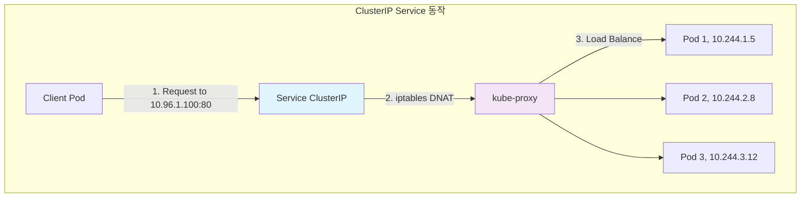
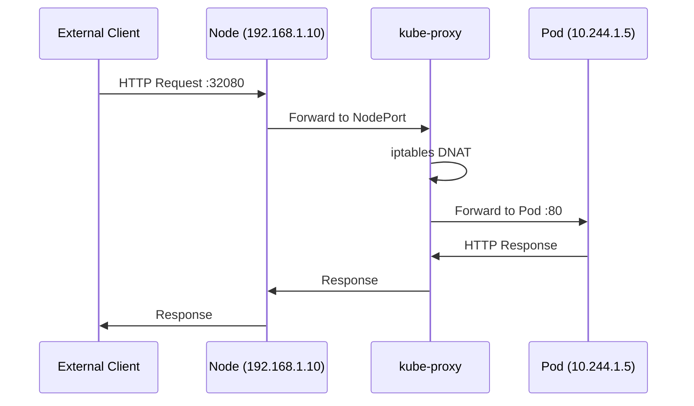
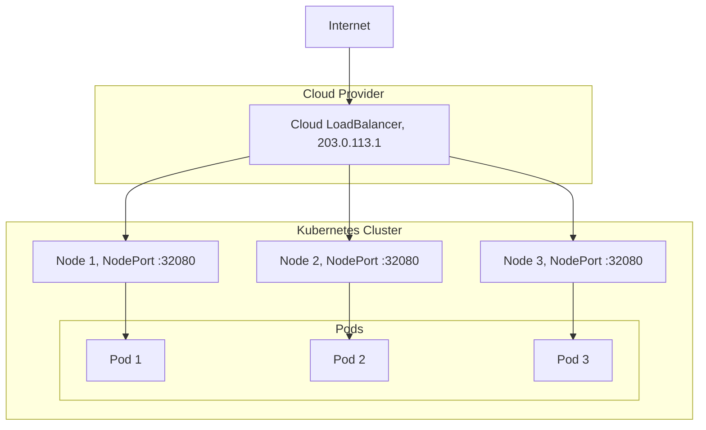

---
tags:
  - Kubernetes
  - Service
  - LoadBalancer
  - Ingress
---

# Kubernetes Service 타입별 동작 원리

## 🎯 개요

2020년, 전 세계가 집에 머물며 Netflix를 시청할 때, Netflix의 백엔드에서는 수천 개의 마이크로서비스가 초당 수백만 건의 요청을 처리하고 있었습니다. 하지만 각 서비스는 동적으로 생성되고 삭제되는 Pod들로 구성되어 있어서, **Pod의 IP가 계속 바뀌는 상황**이었습니다.

만약 전통적인 방식이라면 로드밸런서 설정을 끊임없이 업데이트해야 했겠지만, Kubernetes Service는 이 모든 것을 **자동으로 추상화**했습니다. 단 하나의 안정적인 IP와 DNS 이름으로, 뒤에서 변화하는 수백 개의 Pod 인스턴스를 투명하게 관리한 것입니다.

이것이 바로 Kubernetes Service의 핵심 가치입니다. **변화하는 인프라 위에서 변하지 않는 접점을 제공하는 것.**

## 📖 Service 개념과 필요성

### 전통적인 방식의 한계

```python
# 전통적인 로드밸런싱의 문제점
class TraditionalLoadBalancer:
    def __init__(self):
        self.backend_servers = []
        self.health_check_failures = 0
    
    def add_server(self, ip, port):
        # 수동으로 서버 추가
        self.backend_servers.append(f"{ip}:{port}")
        self.update_config_file()  # 설정 파일 수정
        self.reload_config()       # 서비스 재시작
    
    def remove_server(self, ip, port):
        # 서버 제거 시에도 수동 작업
        server = f"{ip}:{port}"
        if server in self.backend_servers:
            self.backend_servers.remove(server)
            self.update_config_file()
            self.reload_config()
    
    def handle_pod_crash(self):
        # Pod가 죽으면 수동으로 IP 제거해야 함
        print("Manual intervention required!")
        print("Update load balancer configuration")
        print("Remove failed instances")
```

### Kubernetes Service의 자동화

```python
# Kubernetes Service의 동적 관리
class KubernetesService:
    def __init__(self, service_name, selector):
        self.name = service_name
        self.selector = selector  # app=nginx 같은 라벨 셀렉터
        self.cluster_ip = self.allocate_cluster_ip()
        self.endpoints = []
        self.iptables_rules = []
    
    def watch_pods(self):
        """Pod 변화를 자동으로 감지하고 엔드포인트 업데이트"""
        while True:
            matching_pods = self.get_pods_by_selector(self.selector)
            new_endpoints = []
            
            for pod in matching_pods:
                if self.is_pod_ready(pod):
                    new_endpoints.append({
                        "ip": pod.status.podIP,
                        "port": 80,
                        "node": pod.spec.nodeName
                    })
            
            if new_endpoints != self.endpoints:
                self.endpoints = new_endpoints
                self.update_iptables_rules()
                print(f"Service {self.name} updated: {len(self.endpoints)} endpoints")
    
    def allocate_cluster_ip(self):
        """Service CIDR에서 고유 IP 할당"""
        return "10.96.1.100"  # kube-apiserver가 자동 할당
    
    def update_iptables_rules(self):
        """iptables 규칙을 자동으로 업데이트"""
        self.cleanup_old_rules()
        
        for i, endpoint in enumerate(self.endpoints):
            probability = f"1/{len(self.endpoints) - i}"
            rule = (
                f"iptables -t nat -A KUBE-SERVICES "
                f"-d {self.cluster_ip}/32 -p tcp --dport 80 "
                f"-m statistic --mode random --probability {probability} "
                f"-j DNAT --to-destination {endpoint['ip']}:{endpoint['port']}"
            )
            self.iptables_rules.append(rule)
```

## 🌐 Service 타입 상세 분석

### 1. ClusterIP Service

**가장 기본적인 Service 타입**으로, 클러스터 내부에서만 접근 가능한 가상 IP를 제공합니다.



**구현 원리:**

```python
class ClusterIPService:
    def __init__(self, name, selector, port):
        self.name = name
        self.selector = selector
        self.cluster_ip = self.get_cluster_ip()
        self.port = port
        self.endpoints_controller = EndpointsController(self)
    
    def get_cluster_ip(self):
        """Service CIDR 범위에서 IP 할당"""
        # 기본적으로 10.96.0.0/12 범위에서 할당
        # kube-apiserver가 중복 방지하며 할당
        return "10.96.1.100"
    
    def create_iptables_rules(self):
        """iptables 기반 로드밸런싱 규칙 생성"""
        endpoints = self.endpoints_controller.get_ready_endpoints()
        
        if not endpoints:
            return []
        
        rules = []
        # 첫 번째 규칙: Service IP로의 접근을 감지
        rules.append(
            f"iptables -A KUBE-SERVICES "
            f"-d {self.cluster_ip}/32 -p tcp --dport {self.port} "
            f"-j KUBE-SVC-{self.name}"
        )
        
        # 각 엔드포인트로의 분산 규칙
        for i, endpoint in enumerate(endpoints):
            probability = f"1/{len(endpoints) - i}"
            rules.append(
                f"iptables -A KUBE-SVC-{self.name} "
                f"-m statistic --mode random --probability {probability} "
                f"-j KUBE-SEP-{endpoint['name']}"
            )
            
            rules.append(
                f"iptables -A KUBE-SEP-{endpoint['name']} "
                f"-p tcp -j DNAT --to-destination {endpoint['ip']}:{endpoint['port']}"
            )
        
        return rules
```

**세션 어피니티 (Session Affinity):**

```python
class SessionAffinityHandler:
    def __init__(self, service):
        self.service = service
        self.session_timeout = 10800  # 3시간
    
    def enable_client_ip_affinity(self):
        """클라이언트 IP 기반 세션 고정"""
        return {
            "sessionAffinity": "ClientIP",
            "sessionAffinityConfig": {
                "clientIP": {
                    "timeoutSeconds": self.session_timeout
                }
            }
        }
    
    def create_affinity_rules(self):
        """세션 어피니티를 위한 iptables 규칙"""
        return [
            # 클라이언트 IP를 해시하여 일관된 엔드포인트로 라우팅
            f"iptables -A KUBE-SVC-{self.service.name} "
            f"-m statistic --mode random --probability 0.33 "
            f"-m recent --name {self.service.name} --set "
            f"-j KUBE-SEP-ENDPOINT1",
            
            # 기존 연결은 같은 엔드포인트로 유지
            f"iptables -A KUBE-SVC-{self.service.name} "
            f"-m recent --name {self.service.name} --rcheck --seconds {self.session_timeout} "
            f"-j KUBE-SEP-ENDPOINT1"
        ]
```

### 2. NodePort Service

**모든 노드의 특정 포트**를 통해 Service에 외부 접근을 허용합니다.



**구현 세부사항:**

```python
class NodePortService:
    def __init__(self, name, selector, port, node_port=None):
        self.cluster_ip_service = ClusterIPService(name, selector, port)
        self.node_port = node_port or self.allocate_node_port()
        self.external_traffic_policy = "Cluster"  # or "Local"
    
    def allocate_node_port(self):
        """30000-32767 범위에서 포트 할당"""
        import random
        allocated_ports = self.get_allocated_node_ports()
        
        while True:
            port = random.randint(30000, 32767)
            if port not in allocated_ports:
                return port
    
    def create_nodeport_rules(self):
        """모든 노드에 NodePort 규칙 적용"""
        rules = []
        
        # 모든 노드 IP에서 NodePort 수신
        for node_ip in self.get_node_ips():
            rules.append(
                f"iptables -A KUBE-NODEPORTS "
                f"-p tcp --dport {self.node_port} "
                f"-j KUBE-SVC-{self.cluster_ip_service.name}"
            )
        
        # 외부 트래픽을 ClusterIP로 리다이렉트
        rules.append(
            f"iptables -A KUBE-SVC-{self.cluster_ip_service.name} "
            f"-j DNAT --to-destination {self.cluster_ip_service.cluster_ip}:80"
        )
        
        return rules
    
    def handle_external_traffic_policy(self):
        """외부 트래픽 정책에 따른 라우팅"""
        if self.external_traffic_policy == "Local":
            # 로컬 노드의 Pod만 사용 (소스 IP 보존)
            return self.get_local_endpoints()
        else:
            # 클러스터 전체 Pod 사용 (SNAT 적용)
            return self.cluster_ip_service.endpoints_controller.get_ready_endpoints()
```

**소스 IP 보존:**

```python
class SourceIPPreservation:
    def __init__(self, service):
        self.service = service
    
    def configure_local_traffic_policy(self):
        """Local 트래픽 정책으로 소스 IP 보존"""
        return {
            "externalTrafficPolicy": "Local",
            "healthCheckNodePort": 32123,  # 헬스체크용 포트
            "advantages": [
                "Client IP is preserved",
                "No extra network hops",
                "Better performance"
            ],
            "disadvantages": [
                "Potential load imbalance",
                "Health check complexity"
            ]
        }
    
    def setup_health_check_endpoint(self, node_port):
        """헬스체크 엔드포인트 설정"""
        return {
            "path": "/healthz",
            "port": node_port,
            "response": "200 OK if local endpoints exist",
            "purpose": "External LB health checking"
        }
```

### 3. LoadBalancer Service

**클라우드 프로바이더의 로드밸런서**와 통합하여 외부 접근을 제공합니다.



**구현 예시 (AWS ELB):**

```python
class AWSLoadBalancerService:
    def __init__(self, service_spec):
        self.service = service_spec
        self.elb_client = boto3.client('elbv2')
        self.node_port = None
        self.target_group_arn = None
    
    def provision_load_balancer(self):
        """AWS ALB/NLB 프로비저닝"""
        # 1. NodePort Service 생성 (백엔드용)
        node_port_service = NodePortService(
            name=self.service.name,
            selector=self.service.selector,
            port=self.service.port
        )
        self.node_port = node_port_service.node_port
        
        # 2. Target Group 생성
        self.target_group_arn = self.create_target_group()
        
        # 3. Load Balancer 생성
        lb_arn = self.create_load_balancer()
        
        # 4. Listener 설정
        self.create_listener(lb_arn, self.target_group_arn)
        
        # 5. Health Check 설정
        self.configure_health_checks()
        
        return self.get_load_balancer_dns(lb_arn)
    
    def create_target_group(self):
        """Target Group 생성 및 노드 등록"""
        response = self.elb_client.create_target_group(
            Name=f"{self.service.name}-tg",
            Protocol='HTTP',
            Port=self.node_port,
            VpcId=self.get_vpc_id(),
            TargetType='instance',
            HealthCheckProtocol='HTTP',
            HealthCheckPath='/',
            HealthCheckPort=str(self.node_port)
        )
        
        tg_arn = response['TargetGroups'][0]['TargetGroupArn']
        
        # 모든 워커 노드를 타겟으로 등록
        targets = []
        for node in self.get_worker_nodes():
            targets.append({
                'Id': node.instance_id,
                'Port': self.node_port
            })
        
        self.elb_client.register_targets(
            TargetGroupArn=tg_arn,
            Targets=targets
        )
        
        return tg_arn
    
    def handle_node_changes(self, event):
        """노드 추가/제거 시 Target Group 업데이트"""
        if event.type == "ADDED":
            self.elb_client.register_targets(
                TargetGroupArn=self.target_group_arn,
                Targets=[{
                    'Id': event.node.instance_id,
                    'Port': self.node_port
                }]
            )
        elif event.type == "DELETED":
            self.elb_client.deregister_targets(
                TargetGroupArn=self.target_group_arn,
                Targets=[{
                    'Id': event.node.instance_id,
                    'Port': self.node_port
                }]
            )
```

**GCP Load Balancer 통합:**

```python
class GCPLoadBalancerService:
    def __init__(self, service_spec):
        self.service = service_spec
        self.compute = googleapiclient.discovery.build('compute', 'v1')
    
    def create_gce_load_balancer(self):
        """GCE Load Balancer 생성"""
        components = {
            # 1. Instance Group 생성
            "instance_group": self.create_instance_group(),
            
            # 2. Backend Service 생성  
            "backend_service": self.create_backend_service(),
            
            # 3. URL Map 생성
            "url_map": self.create_url_map(),
            
            # 4. HTTP(S) Proxy 생성
            "proxy": self.create_proxy(),
            
            # 5. Forwarding Rule 생성
            "forwarding_rule": self.create_forwarding_rule()
        }
        
        return components
    
    def create_backend_service(self):
        """Backend Service 설정"""
        return {
            "name": f"{self.service.name}-backend",
            "protocol": "HTTP",
            "port": self.node_port,
            "timeoutSec": 30,
            "connectionDraining": {
                "drainingTimeoutSec": 300
            },
            "healthChecks": [self.create_health_check()],
            "backends": [
                {
                    "group": instance_group_url,
                    "balancingMode": "UTILIZATION",
                    "maxUtilization": 0.8
                }
                for instance_group_url in self.get_instance_groups()
            ]
        }
```

### 4. ExternalName Service

**외부 서비스에 대한 DNS CNAME**을 제공하여 내부 서비스처럼 접근할 수 있게 합니다.

```python
class ExternalNameService:
    def __init__(self, name, external_name):
        self.name = name
        self.external_name = external_name  # 예: database.example.com
        # ClusterIP가 할당되지 않음
        self.cluster_ip = None
    
    def create_dns_record(self):
        """CoreDNS에 CNAME 레코드 생성"""
        return {
            "record_type": "CNAME",
            "name": f"{self.name}.default.svc.cluster.local",
            "target": self.external_name,
            "ttl": 30
        }
    
    def resolve_service(self, query):
        """Service 이름을 외부 FQDN으로 해석"""
        if query == f"{self.name}.default.svc.cluster.local":
            return {
                "type": "CNAME",
                "target": self.external_name,
                "additional_records": self.resolve_external_name()
            }
    
    def resolve_external_name(self):
        """외부 도메인의 실제 IP 주소 조회"""
        import socket
        try:
            return socket.gethostbyname_ex(self.external_name)
        except socket.gaierror:
            return None
```

**사용 예시:**

```yaml
# 외부 데이터베이스 서비스를 내부 서비스처럼 사용
apiVersion: v1
kind: Service
metadata:
  name: postgres-external
spec:
  type: ExternalName
  externalName: postgres.rds.amazonaws.com
  ports:
  - port: 5432
---
# 이제 애플리케이션에서 postgres-external:5432로 접근 가능
```

## 🔄 Endpoints Controller와 동적 업데이트

### Endpoints 자동 관리

```python
class EndpointsController:
    def __init__(self, service):
        self.service = service
        self.current_endpoints = []
        self.watch_handle = None
    
    def start_watching(self):
        """Pod 변화를 감시하고 Endpoints 업데이트"""
        self.watch_handle = self.kubernetes_client.watch_pods(
            namespace=self.service.namespace,
            label_selector=self.service.selector,
            callback=self.handle_pod_event
        )
    
    def handle_pod_event(self, event):
        """Pod 이벤트 처리"""
        pod = event.object
        event_type = event.type
        
        if event_type == "ADDED" and self.is_pod_ready(pod):
            self.add_endpoint(pod)
        elif event_type == "MODIFIED":
            self.update_endpoint(pod)
        elif event_type == "DELETED":
            self.remove_endpoint(pod)
    
    def is_pod_ready(self, pod):
        """Pod Ready 상태 확인"""
        if pod.status.phase != "Running":
            return False
            
        for condition in pod.status.conditions:
            if condition.type == "Ready" and condition.status == "True":
                return True
        
        return False
    
    def add_endpoint(self, pod):
        """새 Endpoint 추가"""
        endpoint = {
            "name": pod.metadata.name,
            "ip": pod.status.podIP,
            "port": self.get_container_port(pod),
            "node": pod.spec.nodeName,
            "ready": True
        }
        
        self.current_endpoints.append(endpoint)
        self.update_service_rules()
        
        print(f"Added endpoint: {endpoint['ip']}:{endpoint['port']}")
    
    def update_service_rules(self):
        """Service의 iptables 규칙 업데이트"""
        # 기존 규칙 제거
        self.cleanup_old_rules()
        
        # 새 규칙 적용
        new_rules = self.service.create_iptables_rules()
        for rule in new_rules:
            self.execute_iptables_command(rule)
```

### 헬스체크와 Ready 상태

```python
class HealthChecker:
    def __init__(self, pod_spec):
        self.readiness_probe = pod_spec.containers[0].readiness_probe
        self.liveness_probe = pod_spec.containers[0].liveness_probe
    
    def check_readiness(self, pod_ip):
        """Readiness Probe 실행"""
        if not self.readiness_probe:
            return True  # Probe 없으면 기본적으로 Ready
        
        probe_config = self.readiness_probe
        
        if probe_config.http_get:
            return self.http_health_check(pod_ip, probe_config.http_get)
        elif probe_config.tcp_socket:
            return self.tcp_health_check(pod_ip, probe_config.tcp_socket)
        elif probe_config.exec:
            return self.exec_health_check(pod_ip, probe_config.exec)
    
    def http_health_check(self, pod_ip, http_config):
        """HTTP 헬스체크"""
        import requests
        try:
            url = f"http://{pod_ip}:{http_config.port}{http_config.path}"
            response = requests.get(
                url,
                timeout=http_config.timeout_seconds,
                headers=http_config.http_headers
            )
            return 200 <= response.status_code < 400
        except requests.RequestException:
            return False
    
    def tcp_health_check(self, pod_ip, tcp_config):
        """TCP 포트 체크"""
        import socket
        try:
            sock = socket.socket(socket.AF_INET, socket.SOCK_STREAM)
            sock.settimeout(tcp_config.timeout_seconds)
            result = sock.connect_ex((pod_ip, tcp_config.port))
            sock.close()
            return result == 0
        except socket.error:
            return False
```

## 🎮 kube-proxy 구현 방식

### iptables vs IPVS 모드

```python
class KubeProxyManager:
    def __init__(self, mode="iptables"):
        self.mode = mode
        self.services = {}
    
    def setup_iptables_mode(self):
        """iptables 모드 설정"""
        advantages = [
            "Mature and stable",
            "Wide compatibility", 
            "Simple debugging"
        ]
        
        disadvantages = [
            "Linear rule processing O(n)",
            "No real load balancing algorithms",
            "Performance degrades with many services"
        ]
        
        return {
            "mode": "iptables",
            "advantages": advantages,
            "disadvantages": disadvantages,
            "best_for": "Small to medium clusters (< 1000 services)"
        }
    
    def setup_ipvs_mode(self):
        """IPVS 모드 설정"""
        algorithms = [
            "round-robin", "least-conn", "dest-hash",
            "source-hash", "shortest-expected-delay"
        ]
        
        return {
            "mode": "ipvs",
            "load_balancing_algorithms": algorithms,
            "performance": "O(1) lookup time",
            "advantages": [
                "Better performance",
                "Real load balancing algorithms",
                "Connection tracking"
            ],
            "requirements": ["IPVS kernel modules"],
            "best_for": "Large clusters (> 1000 services)"
        }
    
    def create_ipvs_service(self, service):
        """IPVS 서비스 생성"""
        commands = [
            # IPVS 가상 서비스 생성
            f"ipvsadm -A -t {service.cluster_ip}:{service.port} -s rr",
            
            # 각 엔드포인트를 real server로 추가
            *[
                f"ipvsadm -a -t {service.cluster_ip}:{service.port} "
                f"-r {endpoint['ip']}:{endpoint['port']} -m"
                for endpoint in service.endpoints
            ]
        ]
        
        return commands
```

## 🔍 Service Discovery 메커니즘

### DNS 기반 디스커버리

```python
class ServiceDiscovery:
    def __init__(self, cluster_domain="cluster.local"):
        self.cluster_domain = cluster_domain
        self.dns_cache = {}
    
    def resolve_service_dns(self, service_name, namespace="default"):
        """Service DNS 이름 해석"""
        fqdn_patterns = {
            "short_name": f"{service_name}",
            "namespace_qualified": f"{service_name}.{namespace}",
            "service_qualified": f"{service_name}.{namespace}.svc",
            "fully_qualified": f"{service_name}.{namespace}.svc.{self.cluster_domain}"
        }
        
        return {
            "patterns": fqdn_patterns,
            "resolution": f"{service_name}.{namespace}.svc.{self.cluster_domain}",
            "record_type": "A",
            "ip": "10.96.1.100"  # Service ClusterIP
        }
    
    def create_srv_records(self, service):
        """SRV 레코드 생성 (포트 정보 포함)"""
        srv_records = []
        
        for port in service.spec.ports:
            srv_name = f"_{port.name}._{port.protocol.lower()}.{service.name}.{service.namespace}.svc.{self.cluster_domain}"
            srv_records.append({
                "name": srv_name,
                "type": "SRV",
                "priority": 0,
                "weight": 100,
                "port": port.port,
                "target": f"{service.name}.{service.namespace}.svc.{self.cluster_domain}"
            })
        
        return srv_records
```

### 환경 변수 기반 디스커버리

```python
class EnvironmentVariableDiscovery:
    def __init__(self):
        self.services = {}
    
    def generate_service_env_vars(self, pod_namespace):
        """Pod이 시작될 때 Service 환경 변수 생성"""
        env_vars = {}
        
        # 같은 네임스페이스의 모든 Service 조회
        services = self.get_services_in_namespace(pod_namespace)
        
        for service in services:
            service_name_upper = service.name.upper().replace('-', '_')
            
            # Service IP와 포트 환경 변수
            env_vars[f"{service_name_upper}_SERVICE_HOST"] = service.cluster_ip
            
            for port in service.ports:
                port_name = port.name.upper().replace('-', '_') if port.name else 'PORT'
                env_vars[f"{service_name_upper}_SERVICE_PORT_{port_name}"] = str(port.port)
                
                # 첫 번째 포트는 기본 포트로 설정
                if not env_vars.get(f"{service_name_upper}_SERVICE_PORT"):
                    env_vars[f"{service_name_upper}_SERVICE_PORT"] = str(port.port)
        
        return env_vars
    
    def example_env_vars(self):
        """환경 변수 예시"""
        return {
            "REDIS_SERVICE_HOST": "10.96.2.100",
            "REDIS_SERVICE_PORT": "6379",
            "POSTGRES_SERVICE_HOST": "10.96.3.200", 
            "POSTGRES_SERVICE_PORT": "5432",
            "POSTGRES_SERVICE_PORT_POSTGRESQL": "5432"
        }
```

## 🛠️ 실전 활용 사례

### 1. 마이크로서비스 간 통신

```python
class MicroservicesCommunication:
    def __init__(self):
        self.services = {}
    
    def setup_service_mesh(self):
        """서비스 메시 통신 구성"""
        services_config = {
            "frontend": {
                "type": "LoadBalancer",
                "ports": [80, 443],
                "downstream": ["api-gateway"]
            },
            "api-gateway": {
                "type": "ClusterIP", 
                "ports": [8080],
                "downstream": ["user-service", "order-service", "product-service"]
            },
            "user-service": {
                "type": "ClusterIP",
                "ports": [8080],
                "downstream": ["database"]
            },
            "database": {
                "type": "ClusterIP",
                "ports": [5432],
                "downstream": []
            }
        }
        
        return services_config
    
    def create_service_chain(self, service_name):
        """서비스 체인 생성"""
        service_yaml = f"""
apiVersion: v1
kind: Service
metadata:
  name: {service_name}
  labels:
    app: {service_name}
    tier: backend
spec:
  selector:
    app: {service_name}
  ports:
  - name: http
    port: 80
    targetPort: 8080
    protocol: TCP
  type: ClusterIP
"""
        return service_yaml
```

### 2. Blue/Green 배포와 카나리 배포

```python
class AdvancedDeploymentStrategies:
    def __init__(self):
        self.deployments = {}
    
    def blue_green_deployment(self, app_name, new_version):
        """Blue/Green 배포를 위한 Service 전환"""
        blue_service = f"{app_name}-blue"
        green_service = f"{app_name}-green" 
        main_service = app_name
        
        # 1. Green 환경에 새 버전 배포
        self.deploy_version(green_service, new_version)
        
        # 2. 헬스체크 확인
        if self.health_check_passed(green_service):
            # 3. 메인 Service를 Green으로 전환
            self.switch_service_selector(main_service, "version", new_version)
            
            # 4. Blue 환경 정리 (선택적)
            # self.cleanup_blue_environment(blue_service)
        
        return {
            "status": "switched",
            "active_environment": "green",
            "version": new_version
        }
    
    def canary_deployment(self, app_name, new_version, traffic_percentage=10):
        """카나리 배포를 위한 가중치 기반 라우팅"""
        stable_replicas = 90
        canary_replicas = 10
        
        # Stable 서비스 (기존 버전)
        stable_service = {
            "name": f"{app_name}-stable",
            "selector": {"app": app_name, "version": "stable"},
            "weight": 100 - traffic_percentage
        }
        
        # Canary 서비스 (새 버전)  
        canary_service = {
            "name": f"{app_name}-canary",
            "selector": {"app": app_name, "version": new_version},
            "weight": traffic_percentage
        }
        
        return {
            "strategy": "canary",
            "stable_traffic": f"{100 - traffic_percentage}%",
            "canary_traffic": f"{traffic_percentage}%",
            "services": [stable_service, canary_service]
        }
```

### 3. 멀티 클러스터 Service 연동

```python
class MultiClusterServices:
    def __init__(self):
        self.clusters = {}
    
    def setup_cross_cluster_service(self, service_name):
        """클러스터 간 Service 연동"""
        return {
            "primary_cluster": {
                "service": service_name,
                "cluster_ip": "10.96.1.100",
                "endpoints": ["10.244.1.5", "10.244.2.8"]
            },
            "secondary_cluster": {
                "service": f"{service_name}-external",
                "type": "ExternalName",
                "external_name": f"{service_name}.primary-cluster.example.com"
            },
            "service_mesh_integration": {
                "istio": {
                    "virtual_service": True,
                    "destination_rule": True,
                    "gateway": "istio-system/main-gateway"
                }
            }
        }
    
    def create_headless_service(self, service_name):
        """Headless Service로 직접 Pod 접근"""
        return {
            "apiVersion": "v1",
            "kind": "Service",
            "metadata": {"name": service_name},
            "spec": {
                "clusterIP": "None",  # Headless 설정
                "selector": {"app": service_name},
                "ports": [{"port": 80, "targetPort": 8080}]
            },
            "benefits": [
                "Direct pod IP resolution",
                "Service discovery for StatefulSets",
                "Custom load balancing logic"
            ]
        }
```

## 📊 성능 최적화

### Service 성능 튜닝

```python
class ServicePerformanceOptimizer:
    def __init__(self):
        self.metrics = {}
    
    def optimize_large_scale_services(self, service_count):
        """대규모 Service 환경 최적화"""
        if service_count > 1000:
            return {
                "proxy_mode": "ipvs",  # iptables 대신 IPVS
                "ipvs_scheduler": "lc",  # Least Connection
                "connection_tracking": {
                    "enabled": True,
                    "timeout": 900
                },
                "performance_gain": "10x faster rule lookup"
            }
        else:
            return {
                "proxy_mode": "iptables",
                "optimization": "default_settings_sufficient"
            }
    
    def optimize_dns_performance(self):
        """DNS 성능 최적화"""
        return {
            "nodelocal_dns": {
                "enabled": True,
                "cache_size": 1000,
                "negative_ttl": 30
            },
            "coredns_optimization": {
                "cache_ttl": 30,
                "reload_period": "10s",
                "max_concurrent": 1000
            },
            "pod_dns_config": {
                "ndots": 2,
                "search_domains": ["default.svc.cluster.local"],
                "timeout": 2
            }
        }
    
    def monitor_service_performance(self, service_name):
        """Service 성능 모니터링"""
        return {
            "metrics_to_track": [
                "service_request_duration_seconds",
                "service_request_total",
                "endpoint_ready_count",
                "service_dns_resolution_duration"
            ],
            "alerts": [
                "endpoint_ready_count < expected_replicas",
                "service_request_duration_seconds > 1s",
                "service_dns_resolution_duration > 100ms"
            ]
        }
```

## 🔒 보안 고려사항

### Service 보안 강화

```python
class ServiceSecurity:
    def __init__(self):
        self.security_policies = {}
    
    def implement_zero_trust_services(self):
        """제로 트러스트 Service 보안"""
        return {
            "network_policies": {
                "default_deny": True,
                "explicit_allow": "Required for each service communication"
            },
            "service_mesh_security": {
                "mutual_tls": True,
                "certificate_rotation": "Automatic",
                "identity_based_routing": True
            },
            "pod_security": {
                "service_account": "Dedicated per service",
                "rbac": "Minimal required permissions",
                "secrets_management": "External secret store"
            }
        }
    
    def secure_external_services(self):
        """외부 Service 노출 시 보안 고려사항"""
        return {
            "load_balancer_security": {
                "source_ranges": ["10.0.0.0/8"],  # 내부 IP만 허용
                "ssl_termination": "At load balancer",
                "waf_protection": True
            },
            "nodeport_limitations": {
                "firewall_rules": "Restrict source IPs",
                "port_range": "30000-32767 only",
                "monitoring": "Track unusual traffic patterns"
            }
        }
```

이처럼 Kubernetes Service는 **단순한 로드밸런서가 아닌, 동적인 인프라 위에서 안정적인 네트워크 추상화를 제공하는 핵심 컴포넌트**입니다. Pod가 언제든 생성되고 삭제될 수 있는 환경에서, Service는 변하지 않는 접점을 제공하여 마이크로서비스 아키텍처의 기반이 됩니다.

다음 문서에서는 **Ingress와 Ingress Controller**를 통해 어떻게 HTTP/HTTPS 트래픽을 더욱 정교하게 라우팅하는지 살펴보겠습니다.
