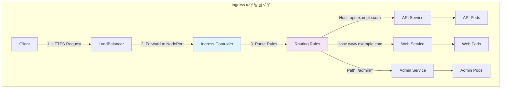

---
tags:
  - Kubernetes
  - Ingress
  - NGINX
  - TLS
  - LoadBalancer
---

# Kubernetes Ingress와 Controller

## 🎯 개요

2018년, 전 세계 개발자들이 GitHub의 서비스 다운을 경험했습니다. 하지만 흥미롭게도 **GitHub Pages는 정상 동작**하고 있었습니다. 이는 GitHub이 서비스별로 다른 인프라와 라우팅 전략을 사용하고 있었기 때문입니다.

현대의 웹 애플리케이션도 마찬가지입니다. 단일 도메인 하에서 수십 개의 마이크로서비스가 동작하며, 각각은 다른 경로(`/api/users`, `/api/orders`, `/web/dashboard`)로 접근됩니다. **Service만으로는 이런 복잡한 HTTP 라우팅을 처리할 수 없습니다.**

바로 이런 상황에서 Kubernetes Ingress가 등장합니다. **단일 진입점을 통해 호스트명과 경로 기반으로 트래픽을 라우팅**하고, **TLS 인증서 관리, 로드밸런싱, 인증/인가**까지 통합 관리하는 L7 게이트웨이 역할을 수행합니다.

## 📖 Ingress vs Service 비교

### Service의 한계점

```python
# Service만 사용할 때의 문제점
class ServiceOnlyArchitecture:
    def __init__(self):
        self.services = [
            {"name": "frontend", "type": "LoadBalancer", "external_ip": "203.0.113.1"},
            {"name": "api", "type": "LoadBalancer", "external_ip": "203.0.113.2"},
            {"name": "admin", "type": "LoadBalancer", "external_ip": "203.0.113.3"},
        ]
        
    def calculate_costs(self):
        """LoadBalancer 비용 계산"""
        cost_per_lb = 20  # USD per month
        total_services = len(self.services)
        
        return {
            "monthly_cost": total_services * cost_per_lb,
            "annual_cost": total_services * cost_per_lb * 12,
            "problems": [
                "Each service needs separate LoadBalancer",
                "Multiple external IPs to manage",
                "No centralized SSL/TLS management",
                "No unified access logging"
            ]
        }
```

### Ingress의 해결책

```python
# Ingress를 사용한 통합 라우팅
class IngressArchitecture:
    def __init__(self):
        self.ingress_controller = "nginx-ingress"
        self.single_loadbalancer = "203.0.113.1"
        self.services = [
            {"name": "frontend", "type": "ClusterIP"},
            {"name": "api", "type": "ClusterIP"}, 
            {"name": "admin", "type": "ClusterIP"}
        ]
    
    def configure_routing(self):
        """단일 진입점을 통한 라우팅 설정"""
        return {
            "host_based_routing": {
                "www.example.com": "frontend-service:80",
                "api.example.com": "api-service:8080",
                "admin.example.com": "admin-service:3000"
            },
            "path_based_routing": {
                "example.com/": "frontend-service:80",
                "example.com/api/*": "api-service:8080",
                "example.com/admin/*": "admin-service:3000"
            },
            "benefits": [
                "Single LoadBalancer (cost reduction)",
                "Centralized TLS termination",
                "Advanced routing rules",
                "Unified monitoring and logging"
            ]
        }
    
    def calculate_cost_savings(self):
        """비용 절감 효과"""
        service_only_cost = 3 * 20  # 3 LoadBalancers
        ingress_cost = 1 * 20       # 1 LoadBalancer
        
        return {
            "monthly_savings": service_only_cost - ingress_cost,
            "annual_savings": (service_only_cost - ingress_cost) * 12,
            "cost_reduction_percentage": ((service_only_cost - ingress_cost) / service_only_cost) * 100
        }
```

## 🌐 Ingress 리소스 구조

### 기본 Ingress 정의



### Ingress 리소스 구현

```python
class IngressResource:
    def __init__(self, name, namespace="default"):
        self.name = name
        self.namespace = namespace
        self.rules = []
        self.tls_config = []
        self.annotations = {}
    
    def add_host_rule(self, host, service_name, service_port):
        """호스트 기반 라우팅 규칙 추가"""
        rule = {
            "host": host,
            "http": {
                "paths": [{
                    "path": "/",
                    "pathType": "Prefix",
                    "backend": {
                        "service": {
                            "name": service_name,
                            "port": {"number": service_port}
                        }
                    }
                }]
            }
        }
        self.rules.append(rule)
        return self
    
    def add_path_rule(self, host, path, path_type, service_name, service_port):
        """경로 기반 라우팅 규칙 추가"""
        # 기존 호스트 규칙 찾기
        host_rule = next((r for r in self.rules if r["host"] == host), None)
        
        if not host_rule:
            host_rule = {"host": host, "http": {"paths": []}}
            self.rules.append(host_rule)
        
        path_rule = {
            "path": path,
            "pathType": path_type,  # Exact, Prefix, ImplementationSpecific
            "backend": {
                "service": {
                    "name": service_name,
                    "port": {"number": service_port}
                }
            }
        }
        
        host_rule["http"]["paths"].append(path_rule)
        return self
    
    def add_tls_config(self, hosts, secret_name):
        """TLS 설정 추가"""
        tls_config = {
            "hosts": hosts,
            "secretName": secret_name
        }
        self.tls_config.append(tls_config)
        return self
    
    def to_yaml(self):
        """YAML 형식으로 변환"""
        return {
            "apiVersion": "networking.k8s.io/v1",
            "kind": "Ingress",
            "metadata": {
                "name": self.name,
                "namespace": self.namespace,
                "annotations": self.annotations
            },
            "spec": {
                "rules": self.rules,
                "tls": self.tls_config if self.tls_config else None
            }
        }
```

### Path Type 구분

```python
class PathTypeHandler:
    def __init__(self):
        self.path_types = {
            "Exact": "정확히 일치하는 경로만",
            "Prefix": "경로로 시작하는 모든 하위 경로", 
            "ImplementationSpecific": "Ingress Controller별 구현"
        }
    
    def demonstrate_path_matching(self, request_path):
        """경로 매칭 예시"""
        rules = [
            {"path": "/api/v1/users", "pathType": "Exact"},
            {"path": "/api/v1", "pathType": "Prefix"},
            {"path": "/static", "pathType": "Prefix"}
        ]
        
        matches = []
        for rule in rules:
            if self.path_matches(request_path, rule["path"], rule["pathType"]):
                matches.append(rule)
        
        return matches
    
    def path_matches(self, request_path, rule_path, path_type):
        """경로 매칭 로직"""
        if path_type == "Exact":
            return request_path == rule_path
        elif path_type == "Prefix":
            return request_path.startswith(rule_path)
        elif path_type == "ImplementationSpecific":
            # NGINX의 경우 정규식 지원
            import re
            return re.match(rule_path, request_path) is not None
        
        return False
    
    def path_priority_example(self):
        """경로 우선순위 예시"""
        return {
            "high_priority": [
                "/api/v1/users/profile",  # 가장 구체적
                "/api/v1/users"
            ],
            "medium_priority": [
                "/api/v1",
                "/api"
            ],
            "low_priority": [
                "/"  # 가장 일반적
            ],
            "matching_order": "Most specific path wins"
        }
```

## 🎮 Ingress Controller 구현

### NGINX Ingress Controller

```python
class NGINXIngressController:
    def __init__(self):
        self.config_template = ""
        self.upstreams = {}
        self.server_blocks = {}
    
    def generate_nginx_config(self, ingress_resources):
        """Ingress 리소스를 NGINX 설정으로 변환"""
        config = """
# Main nginx configuration
user nginx;
worker_processes auto;
error_log /var/log/nginx/error.log warn;

events {
    worker_connections 1024;
    use epoll;
    multi_accept on;
}

http {
    # 기본 설정
    include /etc/nginx/mime.types;
    default_type application/octet-stream;
    
    # 로깅 설정
    log_format main '$remote_addr - $remote_user [$time_local] "$request" '
                    '$status $body_bytes_sent "$http_referer" '
                    '"$http_user_agent" "$http_x_forwarded_for"';
                    
    access_log /var/log/nginx/access.log main;
    
    # 성능 최적화
    sendfile on;
    tcp_nopush on;
    tcp_nodelay on;
    keepalive_timeout 65;
    
    # Gzip 압축
    gzip on;
    gzip_comp_level 5;
    gzip_types text/plain text/css application/json application/javascript;
"""
        
        # 각 Ingress별로 upstream과 server 블록 생성
        for ingress in ingress_resources:
            config += self.generate_upstream_blocks(ingress)
            config += self.generate_server_blocks(ingress)
        
        config += ", }"
        return config
    
    def generate_upstream_blocks(self, ingress):
        """Upstream 블록 생성 (백엔드 서버 풀)"""
        upstreams = ""
        
        for rule in ingress.rules:
            for path in rule.get("http", {}).get("paths", []):
                service_name = path["backend"]["service"]["name"]
                service_port = path["backend"]["service"]["port"]["number"]
                
                # Service의 엔드포인트 조회
                endpoints = self.get_service_endpoints(service_name, ingress.namespace)
                
                upstreams += f"""
    upstream {service_name} {{
        # Load balancing method
        least_conn;
        
        # Backend servers (Pod IPs)
"""
                for endpoint in endpoints:
                    upstreams += f"        server {endpoint['ip']}:{service_port} max_fails=3 fail_timeout=30s;, "
                
                upstreams += "    }, "
        
        return upstreams
    
    def generate_server_blocks(self, ingress):
        """Server 블록 생성 (가상 호스트)"""
        servers = ""
        
        for rule in ingress.rules:
            host = rule.get("host", "_")  # default server
            
            servers += f"""
    server {{
        listen 80;
        listen 443 ssl http2;
        server_name {host};
        
        # SSL 설정
        ssl_certificate /etc/nginx/ssl/{host}.crt;
        ssl_certificate_key /etc/nginx/ssl/{host}.key;
        ssl_protocols TLSv1.2 TLSv1.3;
        ssl_ciphers HIGH:!aNULL:!MD5;
        
        # HTTP to HTTPS redirect
        if ($scheme != "https") {{
            return 301 https://$server_name$request_uri;
        }}
"""
            
            # 경로별 location 블록 생성
            for path in rule.get("http", {}).get("paths", []):
                service_name = path["backend"]["service"]["name"]
                location_path = path["path"]
                
                servers += f"""
        location {location_path} {{
            proxy_pass http://{service_name};
            proxy_set_header Host $host;
            proxy_set_header X-Real-IP $remote_addr;
            proxy_set_header X-Forwarded-For $proxy_add_x_forwarded_for;
            proxy_set_header X-Forwarded-Proto $scheme;
            
            # Timeout 설정
            proxy_connect_timeout 60s;
            proxy_send_timeout 60s;
            proxy_read_timeout 60s;
            
            # 버퍼링 설정
            proxy_buffering on;
            proxy_buffer_size 4k;
            proxy_buffers 8 4k;
        }}
"""
            
            servers += "    }, "
        
        return servers
    
    def handle_configuration_reload(self):
        """설정 변경 시 무중단 리로드"""
        steps = [
            "1. Generate new nginx.conf",
            "2. Test configuration: nginx -t",
            "3. Reload if valid: nginx -s reload",
            "4. Update endpoint tracking"
        ]
        
        return {
            "reload_method": "SIGHUP signal",
            "downtime": "Zero downtime",
            "validation": "Configuration tested before reload",
            "steps": steps
        }
```

### AWS ALB Ingress Controller

```python
class AWSALBIngressController:
    def __init__(self):
        self.elbv2_client = boto3.client('elbv2')
        self.route53_client = boto3.client('route53')
        self.acm_client = boto3.client('acm')
    
    def provision_alb(self, ingress):
        """ALB 프로비저닝"""
        alb_name = f"k8s-{ingress.namespace}-{ingress.name}"
        
        # 1. Application Load Balancer 생성
        alb_response = self.elbv2_client.create_load_balancer(
            Name=alb_name,
            Subnets=self.get_public_subnets(),
            SecurityGroups=[self.get_alb_security_group()],
            Scheme='internet-facing',
            Tags=[
                {'Key': 'kubernetes.io/cluster/my-cluster', 'Value': 'owned'},
                {'Key': 'kubernetes.io/ingress-name', 'Value': ingress.name}
            ],
            Type='application',
            IpAddressType='ipv4'
        )
        
        alb_arn = alb_response['LoadBalancers'][0]['LoadBalancerArn']
        alb_dns = alb_response['LoadBalancers'][0]['DNSName']
        
        # 2. Target Groups 생성
        target_groups = {}
        for rule in ingress.rules:
            for path in rule.get("http", {}).get("paths", []):
                service_name = path["backend"]["service"]["name"]
                service_port = path["backend"]["service"]["port"]["number"]
                
                tg_arn = self.create_target_group(service_name, service_port)
                target_groups[service_name] = tg_arn
        
        # 3. Listeners와 Rules 생성
        self.create_listeners_and_rules(alb_arn, ingress, target_groups)
        
        # 4. Route53 레코드 생성 (선택적)
        self.create_route53_records(ingress, alb_dns)
        
        return {
            "alb_arn": alb_arn,
            "dns_name": alb_dns,
            "target_groups": target_groups
        }
    
    def create_target_group(self, service_name, port):
        """Target Group 생성 및 노드 등록"""
        tg_response = self.elbv2_client.create_target_group(
            Name=f"k8s-{service_name}",
            Protocol='HTTP',
            Port=port,
            VpcId=self.get_vpc_id(),
            TargetType='instance',  # 또는 'ip' (Fargate용)
            HealthCheckPath='/health',
            HealthCheckProtocol='HTTP',
            HealthCheckIntervalSeconds=30,
            HealthyThresholdCount=2,
            UnhealthyThresholdCount=5
        )
        
        tg_arn = tg_response['TargetGroups'][0]['TargetGroupArn']
        
        # 워커 노드들을 타겟으로 등록
        targets = []
        for node in self.get_worker_nodes():
            targets.append({
                'Id': node.instance_id,
                'Port': self.get_service_nodeport(service_name)
            })
        
        if targets:
            self.elbv2_client.register_targets(
                TargetGroupArn=tg_arn,
                Targets=targets
            )
        
        return tg_arn
    
    def create_listeners_and_rules(self, alb_arn, ingress, target_groups):
        """Listeners와 라우팅 규칙 생성"""
        # HTTP Listener (HTTPS로 리다이렉트)
        http_listener = self.elbv2_client.create_listener(
            LoadBalancerArn=alb_arn,
            Protocol='HTTP',
            Port=80,
            DefaultActions=[{
                'Type': 'redirect',
                'RedirectConfig': {
                    'Protocol': 'HTTPS',
                    'Port': '443',
                    'StatusCode': 'HTTP_301'
                }
            }]
        )
        
        # HTTPS Listener
        certificate_arn = self.get_or_create_certificate(ingress)
        https_listener = self.elbv2_client.create_listener(
            LoadBalancerArn=alb_arn,
            Protocol='HTTPS',
            Port=443,
            Certificates=[{'CertificateArn': certificate_arn}],
            DefaultActions=[{
                'Type': 'fixed-response',
                'FixedResponseConfig': {
                    'StatusCode': '404',
                    'ContentType': 'text/plain',
                    'MessageBody': 'Not Found'
                }
            }]
        )
        
        listener_arn = https_listener['Listeners'][0]['ListenerArn']
        
        # 각 호스트/경로별 라우팅 규칙 생성
        priority = 100
        for rule in ingress.rules:
            host = rule.get("host")
            
            for path in rule.get("http", {}).get("paths", []):
                service_name = path["backend"]["service"]["name"]
                path_pattern = path["path"]
                
                conditions = []
                if host:
                    conditions.append({
                        'Field': 'host-header',
                        'Values': [host]
                    })
                
                if path_pattern != "/":
                    conditions.append({
                        'Field': 'path-pattern', 
                        'Values': [path_pattern]
                    })
                
                self.elbv2_client.create_rule(
                    ListenerArn=listener_arn,
                    Priority=priority,
                    Conditions=conditions,
                    Actions=[{
                        'Type': 'forward',
                        'TargetGroupArn': target_groups[service_name]
                    }]
                )
                
                priority += 10
```

### Traefik Ingress Controller

```python
class TraefikIngressController:
    def __init__(self):
        self.dynamic_config = {}
        self.static_config = self.generate_static_config()
    
    def generate_static_config(self):
        """Traefik 정적 설정"""
        return {
            "global": {
                "sendAnonymousUsage": False
            },
            "entryPoints": {
                "web": {"address": ":80"},
                "websecure": {"address": ":443"}
            },
            "providers": {
                "kubernetes": {
                    "endpoints": ["https://kubernetes.default.svc.cluster.local:443"]
                }
            },
            "certificatesResolvers": {
                "letsencrypt": {
                    "acme": {
                        "email": "admin@example.com",
                        "storage": "/data/acme.json",
                        "httpChallenge": {
                            "entryPoint": "web"
                        }
                    }
                }
            },
            "api": {
                "dashboard": True,
                "insecure": True
            }
        }
    
    def convert_ingress_to_traefik_routes(self, ingress):
        """Ingress를 Traefik 라우트로 변환"""
        routes = {}
        services = {}
        
        for rule in ingress.rules:
            host = rule.get("host", "")
            
            for path in rule.get("http", {}).get("paths", []):
                service_name = path["backend"]["service"]["name"]
                service_port = path["backend"]["service"]["port"]["number"]
                path_pattern = path["path"]
                
                # 라우트 이름 생성
                route_name = f"{ingress.name}-{service_name}-{path_pattern}".replace("/", "-")
                
                # 라우트 규칙 생성
                route_rule = []
                if host:
                    route_rule.append(f"Host(`{host}`)")
                
                if path_pattern and path_pattern != "/":
                    if path["pathType"] == "Prefix":
                        route_rule.append(f"PathPrefix(`{path_pattern}`)")
                    elif path["pathType"] == "Exact":
                        route_rule.append(f"Path(`{path_pattern}`)")
                
                routes[route_name] = {
                    "rule": " && ".join(route_rule) if route_rule else "PathPrefix(`/`)",
                    "service": service_name,
                    "middlewares": self.get_middlewares_for_service(ingress, service_name)
                }
                
                # 서비스 정의
                services[service_name] = {
                    "loadBalancer": {
                        "servers": [
                            {"url": f"http://{service_name}.{ingress.namespace}.svc.cluster.local:{service_port}"}
                        ]
                    }
                }
        
        return {
            "http": {
                "routers": routes,
                "services": services,
                "middlewares": self.generate_middlewares(ingress)
            }
        }
    
    def get_middlewares_for_service(self, ingress, service_name):
        """서비스별 미들웨어 설정"""
        middlewares = []
        
        # Annotation 기반 미들웨어 설정
        annotations = ingress.annotations
        
        if annotations.get("traefik.ingress.kubernetes.io/rate-limit"):
            middlewares.append("rate-limit")
        
        if annotations.get("traefik.ingress.kubernetes.io/auth-basic"):
            middlewares.append("basic-auth")
        
        if annotations.get("traefik.ingress.kubernetes.io/redirect-to-https"):
            middlewares.append("https-redirect")
        
        return middlewares
    
    def generate_middlewares(self, ingress):
        """미들웨어 설정 생성"""
        return {
            "rate-limit": {
                "rateLimit": {
                    "burst": 100,
                    "average": 100
                }
            },
            "https-redirect": {
                "redirectScheme": {
                    "scheme": "https",
                    "permanent": True
                }
            },
            "basic-auth": {
                "basicAuth": {
                    "users": [
                        "admin:$2y$10$..."  # bcrypt 해시
                    ]
                }
            },
            "cors": {
                "headers": {
                    "accessControlAllowOriginList": ["*"],
                    "accessControlAllowMethods": ["GET", "POST", "PUT", "DELETE"],
                    "accessControlAllowHeaders": ["Content-Type", "Authorization"]
                }
            }
        }
```

## 🔐 TLS/SSL 인증서 관리

### cert-manager 통합

```python
class CertManagerIntegration:
    def __init__(self):
        self.cert_manager_version = "v1.12.0"
        self.issuers = {}
    
    def setup_letsencrypt_issuer(self, email, environment="staging"):
        """Let's Encrypt Issuer 설정"""
        server_urls = {
            "staging": "https://acme-staging-v02.api.letsencrypt.org/directory",
            "production": "https://acme-v02.api.letsencrypt.org/directory"
        }
        
        return {
            "apiVersion": "cert-manager.io/v1",
            "kind": "ClusterIssuer",
            "metadata": {
                "name": f"letsencrypt-{environment}"
            },
            "spec": {
                "acme": {
                    "server": server_urls[environment],
                    "email": email,
                    "privateKeySecretRef": {
                        "name": f"letsencrypt-{environment}"
                    },
                    "solvers": [{
                        "http01": {
                            "ingress": {
                                "class": "nginx"
                            }
                        }
                    }]
                }
            }
        }
    
    def create_certificate_resource(self, domain_names, issuer_name):
        """Certificate 리소스 생성"""
        return {
            "apiVersion": "cert-manager.io/v1",
            "kind": "Certificate",
            "metadata": {
                "name": f"{domain_names[0].replace('.', '-')}-tls"
            },
            "spec": {
                "secretName": f"{domain_names[0].replace('.', '-')}-tls",
                "issuerRef": {
                    "name": issuer_name,
                    "kind": "ClusterIssuer"
                },
                "dnsNames": domain_names,
                "duration": "2160h",  # 90 days
                "renewBefore": "360h"  # Renew 15 days before expiry
            }
        }
    
    def automatic_certificate_provisioning(self, ingress):
        """Ingress Annotation을 통한 자동 인증서 프로비저닝"""
        annotations = {
            "cert-manager.io/cluster-issuer": "letsencrypt-production",
            "kubernetes.io/tls-acme": "true",
            "nginx.ingress.kubernetes.io/ssl-redirect": "true"
        }
        
        # TLS 호스트 목록 추출
        tls_hosts = []
        for rule in ingress.rules:
            if rule.get("host"):
                tls_hosts.append(rule["host"])
        
        if tls_hosts:
            ingress.annotations.update(annotations)
            ingress.add_tls_config(
                hosts=tls_hosts,
                secret_name=f"{ingress.name}-tls"
            )
        
        return ingress
    
    def certificate_lifecycle_management(self):
        """인증서 생명주기 관리"""
        return {
            "issuance": {
                "trigger": "Ingress creation with cert-manager annotations",
                "process": "ACME HTTP-01 challenge",
                "duration": "2-5 minutes"
            },
            "renewal": {
                "automatic": True,
                "threshold": "30 days before expiry",
                "validation": "Zero-downtime renewal"
            },
            "monitoring": {
                "metrics": [
                    "certmanager_certificate_expiration_timestamp_seconds",
                    "certmanager_certificate_ready_status"
                ],
                "alerts": [
                    "Certificate expires in 7 days",
                    "Certificate issuance failed"
                ]
            }
        }
```

### 인증서 자동 갱신

```python
class CertificateRenewalAutomation:
    def __init__(self):
        self.renewal_threshold = 30  # days
        self.certificates = {}
    
    def monitor_certificate_expiry(self):
        """인증서 만료 모니터링"""
        expiring_soon = []
        
        for cert_name, cert_info in self.certificates.items():
            days_until_expiry = (cert_info['expiry'] - datetime.now()).days
            
            if days_until_expiry <= self.renewal_threshold:
                expiring_soon.append({
                    "certificate": cert_name,
                    "expires_in": days_until_expiry,
                    "domains": cert_info['domains'],
                    "status": "renewal_required"
                })
        
        return expiring_soon
    
    def automated_renewal_process(self, certificate):
        """자동 갱신 프로세스"""
        steps = [
            {
                "step": "Pre-renewal validation",
                "action": "Verify domain ownership",
                "duration": "30 seconds"
            },
            {
                "step": "ACME challenge initiation", 
                "action": "Create temporary validation endpoints",
                "duration": "1-2 minutes"
            },
            {
                "step": "Certificate issuance",
                "action": "Request new certificate from CA",
                "duration": "1-2 minutes"
            },
            {
                "step": "Secret update",
                "action": "Update TLS secret with new certificate",
                "duration": "5 seconds"
            },
            {
                "step": "Ingress Controller reload",
                "action": "Reload configuration with new certificate", 
                "duration": "0 seconds (zero downtime)"
            }
        ]
        
        return {
            "certificate": certificate,
            "renewal_process": steps,
            "total_duration": "3-5 minutes",
            "downtime": "Zero"
        }
```

## 🎯 고급 라우팅 기능

### 가중치 기반 카나리 배포

```python
class CanaryDeploymentWithIngress:
    def __init__(self):
        self.traffic_split = {}
    
    def nginx_canary_deployment(self, stable_service, canary_service, canary_weight=10):
        """NGINX Ingress를 사용한 카나리 배포"""
        # 메인 Ingress (stable 버전)
        main_ingress = {
            "apiVersion": "networking.k8s.io/v1",
            "kind": "Ingress", 
            "metadata": {
                "name": "app-main",
                "annotations": {
                    "kubernetes.io/ingress.class": "nginx"
                }
            },
            "spec": {
                "rules": [{
                    "host": "app.example.com",
                    "http": {
                        "paths": [{
                            "path": "/",
                            "pathType": "Prefix",
                            "backend": {
                                "service": {
                                    "name": stable_service,
                                    "port": {"number": 80}
                                }
                            }
                        }]
                    }
                }]
            }
        }
        
        # 카나리 Ingress (새 버전)
        canary_ingress = {
            "apiVersion": "networking.k8s.io/v1",
            "kind": "Ingress",
            "metadata": {
                "name": "app-canary",
                "annotations": {
                    "kubernetes.io/ingress.class": "nginx",
                    "nginx.ingress.kubernetes.io/canary": "true",
                    "nginx.ingress.kubernetes.io/canary-weight": str(canary_weight),
                    # 선택적 규칙들
                    # "nginx.ingress.kubernetes.io/canary-by-header": "X-Canary",
                    # "nginx.ingress.kubernetes.io/canary-by-cookie": "canary"
                }
            },
            "spec": {
                "rules": [{
                    "host": "app.example.com",
                    "http": {
                        "paths": [{
                            "path": "/",
                            "pathType": "Prefix", 
                            "backend": {
                                "service": {
                                    "name": canary_service,
                                    "port": {"number": 80}
                                }
                            }
                        }]
                    }
                }]
            }
        }
        
        return {
            "main_ingress": main_ingress,
            "canary_ingress": canary_ingress,
            "traffic_distribution": {
                "stable": f"{100 - canary_weight}%",
                "canary": f"{canary_weight}%"
            }
        }
    
    def progressive_rollout(self, current_weight, target_weight, step_size=5):
        """점진적 트래픽 증가"""
        rollout_plan = []
        weight = current_weight
        
        while weight < target_weight:
            weight = min(weight + step_size, target_weight)
            rollout_plan.append({
                "canary_weight": weight,
                "stable_weight": 100 - weight,
                "monitoring_duration": "10 minutes",
                "success_criteria": [
                    "Error rate < 1%",
                    "P95 latency < 500ms",
                    "No critical alerts"
                ]
            })
        
        return rollout_plan
```

### 헤더 기반 라우팅

```python
class HeaderBasedRouting:
    def __init__(self):
        self.routing_rules = {}
    
    def feature_flag_routing(self):
        """기능 플래그 기반 라우팅"""
        return {
            "nginx_config": {
                "annotations": {
                    "nginx.ingress.kubernetes.io/server-snippet": """
                        set $backend "stable-service";
                        if ($http_x_feature_flag = "new-ui") {
                            set $backend "beta-service";
                        }
                        if ($http_x_user_tier = "premium") {
                            set $backend "premium-service";
                        }
                    """
                }
            },
            "use_cases": [
                "A/B testing",
                "Feature rollout to specific user groups",
                "Premium feature access",
                "Mobile vs desktop routing"
            ]
        }
    
    def geographic_routing(self):
        """지리적 위치 기반 라우팅"""
        return {
            "nginx_config": {
                "annotations": {
                    "nginx.ingress.kubernetes.io/configuration-snippet": """
                        set $region "us";
                        if ($geoip_country_code = "KR") {
                            set $region "kr";
                        }
                        if ($geoip_country_code = "JP") {
                            set $region "jp";
                        }
                        proxy_set_header X-User-Region $region;
                    """
                }
            },
            "backend_services": {
                "us": "app-us-service",
                "kr": "app-kr-service", 
                "jp": "app-jp-service"
            }
        }
```

### Rate Limiting과 보안

```python
class IngressSecurity:
    def __init__(self):
        self.security_policies = {}
    
    def rate_limiting_configuration(self):
        """Rate Limiting 설정"""
        return {
            "nginx_rate_limiting": {
                "annotations": {
                    "nginx.ingress.kubernetes.io/rate-limit": "100",  # requests per minute
                    "nginx.ingress.kubernetes.io/rate-limit-burst": "50",
                    "nginx.ingress.kubernetes.io/rate-limit-connection": "10"
                }
            },
            "traefik_rate_limiting": {
                "middleware": {
                    "apiVersion": "traefik.containo.us/v1alpha1",
                    "kind": "Middleware",
                    "metadata": {"name": "rate-limit"},
                    "spec": {
                        "rateLimit": {
                            "burst": 100,
                            "average": 100
                        }
                    }
                }
            }
        }
    
    def authentication_integration(self):
        """인증 통합"""
        return {
            "oauth2_proxy": {
                "annotations": {
                    "nginx.ingress.kubernetes.io/auth-url": "https://oauth2-proxy.example.com/oauth2/auth",
                    "nginx.ingress.kubernetes.io/auth-signin": "https://oauth2-proxy.example.com/oauth2/start?rd=$escaped_request_uri"
                }
            },
            "basic_auth": {
                "annotations": {
                    "nginx.ingress.kubernetes.io/auth-type": "basic",
                    "nginx.ingress.kubernetes.io/auth-secret": "basic-auth-secret",
                    "nginx.ingress.kubernetes.io/auth-realm": "Authentication Required"
                }
            },
            "mutual_tls": {
                "annotations": {
                    "nginx.ingress.kubernetes.io/auth-tls-verify-client": "on",
                    "nginx.ingress.kubernetes.io/auth-tls-secret": "client-ca-secret"
                }
            }
        }
    
    def waf_integration(self):
        """Web Application Firewall 통합"""
        return {
            "modsecurity": {
                "annotations": {
                    "nginx.ingress.kubernetes.io/enable-modsecurity": "true",
                    "nginx.ingress.kubernetes.io/modsecurity-transaction-id": "$request_id",
                    "nginx.ingress.kubernetes.io/modsecurity-snippet": """
                        SecRuleEngine On
                        SecRequestBodyAccess On
                        SecAuditLog /var/log/nginx/modsec_audit.log
                        Include /etc/nginx/owasp-modsecurity-crs/nginx-modsecurity.conf
                    """
                }
            },
            "protection_rules": [
                "SQL injection prevention",
                "XSS attack mitigation", 
                "CSRF protection",
                "DDoS mitigation"
            ]
        }
```

## 📊 성능 최적화 및 모니터링

### Ingress Controller 성능 튜닝

```python
class IngressPerformanceOptimization:
    def __init__(self):
        self.optimization_configs = {}
    
    def nginx_performance_tuning(self):
        """NGINX Ingress Controller 성능 튜닝"""
        return {
            "worker_processes": "auto",  # CPU 코어 수에 따라 자동 조정
            "worker_connections": 1024,
            "optimization_settings": {
                "nginx.ingress.kubernetes.io/proxy-buffering": "on",
                "nginx.ingress.kubernetes.io/proxy-buffer-size": "4k",
                "nginx.ingress.kubernetes.io/proxy-buffers-number": "8",
                "nginx.ingress.kubernetes.io/upstream-keepalive-connections": "100",
                "nginx.ingress.kubernetes.io/upstream-keepalive-timeout": "60s",
                "nginx.ingress.kubernetes.io/proxy-next-upstream-timeout": "0",
                "nginx.ingress.kubernetes.io/proxy-request-buffering": "on"
            },
            "ssl_optimization": {
                "nginx.ingress.kubernetes.io/ssl-ciphers": "ECDHE+AESGCM:ECDHE+CHACHA20:DHE+AESGCM:DHE+CHACHA20:!aNULL:!SHA1:!WEAK",
                "nginx.ingress.kubernetes.io/ssl-protocols": "TLSv1.2 TLSv1.3",
                "nginx.ingress.kubernetes.io/ssl-session-cache": "shared:SSL:10m",
                "nginx.ingress.kubernetes.io/ssl-session-timeout": "10m"
            }
        }
    
    def connection_pooling_optimization(self):
        """연결 풀링 최적화"""
        return {
            "upstream_settings": {
                "keepalive_connections": 100,
                "keepalive_timeout": "60s",
                "keepalive_requests": 10000
            },
            "benefits": [
                "Reduced connection establishment overhead",
                "Lower latency for subsequent requests", 
                "Better resource utilization",
                "Improved throughput"
            ],
            "monitoring_metrics": [
                "nginx_ingress_controller_nginx_process_connections",
                "nginx_ingress_controller_nginx_process_connections_active"
            ]
        }
    
    def caching_strategies(self):
        """캐싱 전략"""
        return {
            "static_content_caching": {
                "nginx.ingress.kubernetes.io/server-snippet": """
                    location ~* \\.(jpg|jpeg|png|gif|ico|css|js)$ {
                        expires 1y;
                        add_header Cache-Control "public, immutable";
                        add_header Vary "Accept-Encoding";
                    }
                """
            },
            "api_response_caching": {
                "nginx.ingress.kubernetes.io/configuration-snippet": """
                    location /api/v1/public {
                        proxy_cache api_cache;
                        proxy_cache_valid 200 5m;
                        proxy_cache_key "$scheme$request_method$host$request_uri";
                        add_header X-Cache-Status $upstream_cache_status;
                    }
                """
            }
        }
```

### 모니터링 및 관찰성

```python
class IngressMonitoring:
    def __init__(self):
        self.metrics_collectors = []
    
    def setup_prometheus_monitoring(self):
        """Prometheus 메트릭 수집"""
        metrics = {
            "nginx_ingress_controller_requests_total": {
                "type": "counter",
                "description": "Total number of requests",
                "labels": ["ingress", "service", "status"]
            },
            "nginx_ingress_controller_request_duration_seconds": {
                "type": "histogram", 
                "description": "Request processing time",
                "labels": ["ingress", "service"]
            },
            "nginx_ingress_controller_request_size_bytes": {
                "type": "histogram",
                "description": "Request size in bytes"
            },
            "nginx_ingress_controller_response_size_bytes": {
                "type": "histogram",
                "description": "Response size in bytes"
            }
        }
        
        return {
            "scrape_config": {
                "job_name": "nginx-ingress",
                "kubernetes_sd_configs": [{
                    "role": "pod",
                    "namespaces": {"names": ["ingress-nginx"]}
                }],
                "relabel_configs": [{
                    "source_labels": ["__meta_kubernetes_pod_annotation_prometheus_io_scrape"],
                    "action": "keep",
                    "regex": "true"
                }]
            },
            "metrics": metrics
        }
    
    def create_alerting_rules(self):
        """알림 규칙 생성"""
        return {
            "rules": [
                {
                    "alert": "IngressHighErrorRate",
                    "expr": "rate(nginx_ingress_controller_requests_total{status=~'5..'}[5m]) > 0.05",
                    "for": "5m",
                    "annotations": {
                        "summary": "Ingress has high 5xx error rate",
                        "description": "Ingress {{$labels.ingress}} has error rate of {{$value}}"
                    }
                },
                {
                    "alert": "IngressHighLatency", 
                    "expr": "histogram_quantile(0.95, rate(nginx_ingress_controller_request_duration_seconds_bucket[5m])) > 1",
                    "for": "10m",
                    "annotations": {
                        "summary": "Ingress has high latency",
                        "description": "95th percentile latency is {{$value}}s"
                    }
                }
            ]
        }
    
    def distributed_tracing_integration(self):
        """분산 추적 통합"""
        return {
            "jaeger_tracing": {
                "annotations": {
                    "nginx.ingress.kubernetes.io/enable-opentracing": "true",
                    "nginx.ingress.kubernetes.io/opentracing-trust-incoming-span": "true"
                },
                "config": {
                    "sampler": {"type": "const", "param": 1.0},
                    "reporter": {
                        "queueSize": 100,
                        "bufferFlushInterval": "1s",
                        "logSpans": True,
                        "localAgentHostPort": "jaeger-agent:6831"
                    }
                }
            },
            "trace_headers": [
                "X-Trace-ID", 
                "X-Span-ID",
                "X-Parent-Span-ID",
                "X-Sampled"
            ]
        }
```

## 🛠️ 실습 및 검증

### Ingress 배포 및 테스트

```bash
#!/bin/bash

echo "=== Ingress Controller 배포 ==="

# 1. NGINX Ingress Controller 설치
kubectl apply -f https://raw.githubusercontent.com/kubernetes/ingress-nginx/controller-v1.8.1/deploy/static/provider/cloud/deploy.yaml

# 2. Ingress Controller 상태 확인
kubectl wait --namespace ingress-nginx \
  --for=condition=ready pod \
  --selector=app.kubernetes.io/component=controller \
  --timeout=90s

# 3. 샘플 애플리케이션 배포
cat <<EOF | kubectl apply -f -
apiVersion: apps/v1
kind: Deployment
metadata:
  name: web-app
spec:
  replicas: 3
  selector:
    matchLabels:
      app: web-app
  template:
    metadata:
      labels:
        app: web-app
    spec:
      containers:
      - name: web
        image: nginx:1.21
        ports:
        - containerPort: 80
---
apiVersion: v1
kind: Service
metadata:
  name: web-app-service
spec:
  selector:
    app: web-app
  ports:
  - port: 80
    targetPort: 80
---
apiVersion: networking.k8s.io/v1
kind: Ingress
metadata:
  name: web-app-ingress
  annotations:
    kubernetes.io/ingress.class: nginx
    nginx.ingress.kubernetes.io/rewrite-target: /
spec:
  rules:
  - host: app.local
    http:
      paths:
      - path: /
        pathType: Prefix
        backend:
          service:
            name: web-app-service
            port:
              number: 80
EOF

# 4. Ingress 상태 확인
kubectl get ingress web-app-ingress
kubectl describe ingress web-app-ingress

# 5. 연결 테스트
INGRESS_IP=$(kubectl get service -n ingress-nginx ingress-nginx-controller -o jsonpath='{.status.loadBalancer.ingress[0].ip}')
echo "Testing connectivity to $INGRESS_IP"
curl -H "Host: app.local" http://$INGRESS_IP/
```

이처럼 Kubernetes Ingress는 **HTTP/HTTPS 트래픽에 대한 고급 라우팅과 로드밸런싱**을 제공하는 핵심 컴포넌트입니다. 단순한 Service 노출을 넘어서, **호스트/경로 기반 라우팅, TLS 인증서 자동 관리, 트래픽 제어, 보안 정책** 등을 통합 관리할 수 있습니다.

다음 문서에서는 **CNI 플러그인들의 구현 방식과 성능 특성**을 비교 분석하여, 각 환경에 최적화된 네트워킹 솔루션을 선택하는 방법을 살펴보겠습니다.
