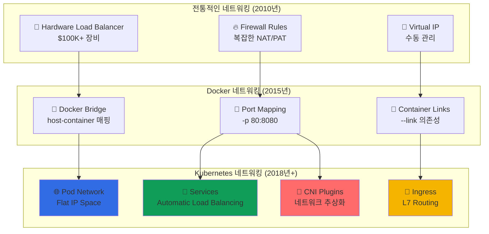

---
tags:
  - Kubernetes
  - Networking
  - Services
  - Ingress
  - CNI
---

# Kubernetes Networking - 넷플릭스가 마이크로초 로드밸런싱을 구현한 방법 🌐

## 이 섹션을 읽으면 답할 수 있는 질문들

- Netflix는 어떻게 마이크로초 단위로 로드밸런싱을 구현할까?
- 파드끼리 어떻게 IP 없이 이름만으로 통신할 수 있을까?
- GitHub Pages는 어떻게 수십만 도메인을 라우팅하는가?
- CNI 플러그인이 네트워크 성능에 미치는 진짜 영향은?
- Service Mesh 없이도 로드밸런싱이 가능한 이유는?

## 시작하며: 복잡한 네트워킹을 투명하게

### 충격적인 사실: 모든 Pod가 서로 통신할 수 있다

Kubernetes의 가장 놀라운 특징 중 하나는**"모든 Pod가 NAT 없이 서로 직접 통신할 수 있다"**는 것입니다.

```python
# Netflix의 마이크로서비스 통신 현실
netflix_service_mesh = {
    "video_service": {
        "pod_ip": "10.244.1.15",
        "can_directly_call": [
            "user_service (10.244.2.23)",
            "recommendation_service (10.244.1.45)", 
            "analytics_service (10.244.3.12)"
        ],
        "no_nat_required": True,
        "cross_node_communication": "transparent"
    },
    
    "놀라운_점": [
        "다른 노드의 Pod도 직접 호출 가능",
        "복잡한 포트 매핑 불필요", 
        "Service Discovery가 단순화됨",
        "네트워크 오버헤드 최소화"
    ]
}

print("🤯 깨달음: Kubernetes는 전체 클러스터를 하나의 거대한 LAN처럼 만든다!")
```

### 네트워킹 모델의 진화: 복잡함에서 단순함으로



**핵심 통찰**: Kubernetes는**네트워킹 복잡성을 추상화**하여 개발자가 비즈니스 로직에 집중할 수 있게 합니다.

## Kubernetes Networking 완벽 마스터 📚

### [1. Cluster Networking: Shopify의 Pod 통신 비밀](01-cluster-networking.md)

**10만 개 Pod가 어떻게 서로를 찾아 통신하는가**

Shopify가 어떻게 Black Friday 트래픽 급증 시에도 수십만 개의 Pod 간 통신을 안정적으로 유지하는지, Kubernetes 네트워킹 모델의 핵심 원리를 탐험합니다.

🌐**핵심 내용**:

- Pod-to-Pod 통신의 실제 패킷 경로 추적
- CNI 플러그인의 동작 원리와 성능 비교
- Cross-Node 통신과 Overlay 네트워크
- IP 주소 관리와 IPAM (IP Address Management)

---

### [2. Services: Netflix의 마이크로초 로드밸런싱](02-services.md)

**Service Discovery와 Load Balancing의 완벽한 결합**

Netflix가 어떻게 마이크로초 단위의 지연시간으로 수백만 요청을 적절한 Pod로 라우팅하는지, kube-proxy의 iptables/IPVS 모드와 성능 최적화 비법을 알아봅니다.

🎯**핵심 내용**:

- ClusterIP, NodePort, LoadBalancer 타입별 동작 원리
- kube-proxy의 iptables vs IPVS 성능 비교
- EndpointSlices를 통한 확장성 개선
- Session Affinity와 로드밸런싱 알고리즘

---

### [3. Ingress: GitHub Pages의 트래픽 라우팅 마법](03-ingress.md)

**수십만 도메인을 하나의 클러스터에서 처리하는 기술**

GitHub Pages가 어떻게 수십만 개의 사용자 도메인을 단일 Kubernetes 클러스터에서 효율적으로 라우팅하는지, Ingress Controller의 고급 기능과 성능 최적화를 탐구합니다.

🚪**핵심 내용**:

- Ingress Controller vs API Gateway 비교
- SSL/TLS Termination과 인증서 관리
- Path-based vs Host-based 라우팅 전략
- Rate Limiting과 트래픽 제어

---

### [4. CNI Plugins: Discord의 네트워크 성능 최적화](04-cni-plugins.md)

**네트워크 플러그인이 성능에 미치는 숨겨진 영향**

Discord가 어떻게 CNI 플러그인 선택과 튜닝을 통해 실시간 채팅의 네트워크 지연시간을 최소화했는지, 각 CNI의 특성과 성능 트레이드오프를 분석합니다.

🔌**핵심 내용**:

- Flannel vs Calico vs Cilium 성능 벤치마크
- eBPF 기반 네트워킹의 혁신
- Network Policies와 보안 고려사항
- Kubernetes Network SLI/SLO 설정

## Networking 활용 시나리오 가이드 🎯

### 시나리오 1: 마이크로서비스 간 통신

```yaml
# Frontend ↔ Backend ↔ Database 통신 설정
apiVersion: v1
kind: Service
metadata:
  name: backend-service
spec:
  selector:
    app: backend
  ports:
  - name: http
    port: 80
    targetPort: 8080
  - name: grpc
    port: 9090
    targetPort: 9090
  type: ClusterIP           # 클러스터 내부 통신만

---
apiVersion: v1
kind: Service  
metadata:
  name: database-service
spec:
  selector:
    app: postgres
  ports:
  - port: 5432
    targetPort: 5432
  type: ClusterIP
  sessionAffinity: ClientIP  # 동일 클라이언트는 같은 DB Pod로
```

### 시나리오 2: 외부 트래픽 처리

```yaml
# 외부에서 클러스터로 트래픽 라우팅
apiVersion: networking.k8s.io/v1
kind: Ingress
metadata:
  name: web-ingress
  annotations:
    kubernetes.io/ingress.class: nginx
    cert-manager.io/cluster-issuer: letsencrypt-prod
    nginx.ingress.kubernetes.io/rate-limit: "100"
    nginx.ingress.kubernetes.io/ssl-redirect: "true"
spec:
  tls:
  - hosts:
    - api.company.com
    - app.company.com
    secretName: company-tls
  rules:
  - host: api.company.com
    http:
      paths:
      - path: /v1
        pathType: Prefix
        backend:
          service:
            name: api-service
            port:
              number: 80
  - host: app.company.com
    http:
      paths:
      - path: /
        pathType: Prefix
        backend:
          service:
            name: frontend-service
            port:
              number: 80
```

### 시나리오 3: 고성능 네트워킹 설정

```python
class HighPerformanceNetworking:
    """
    고성능 네트워킹을 위한 최적화 설정
    """
    
    def cni_optimization(self):
        """
        CNI 플러그인 성능 최적화
        """
        optimizations = {
            "calico": {
                "dataplane": "eBPF",  # iptables 대신 eBPF 사용
                "ipip_mode": "Never", # Overhead 제거
                "nat_outgoing": True,
                "performance_gain": "30% latency reduction"
            },
            
            "cilium": {
                "dataplane": "eBPF",
                "enable_bandwidth_manager": True,
                "enable_local_redirect_policy": True,
                "performance_gain": "50% throughput increase"
            }
        }
        
        return optimizations
    
    def kube_proxy_optimization(self):
        """
        kube-proxy 성능 튜닝
        """
        config = {
            "mode": "ipvs",        # iptables 대신 IPVS
            "scheduler": "lc",     # Least Connection
            "tcp_timeout": "900s",
            "tcp_fin_timeout": "120s",
            "udp_timeout": "300s",
            "sync_period": "30s",
            "min_sync_period": "5s"
        }
        
        performance_impact = {
            "latency": "60% improvement",
            "throughput": "40% improvement", 
            "cpu_usage": "30% reduction"
        }
        
        return config, performance_impact
```

### 시나리오 4: 네트워크 보안 정책

```yaml
# 마이크로서비스 간 트래픽 제어
apiVersion: networking.k8s.io/v1
kind: NetworkPolicy
metadata:
  name: backend-policy
  namespace: production
spec:
  podSelector:
    matchLabels:
      app: backend
  policyTypes:
  - Ingress
  - Egress
  ingress:
  - from:
    - podSelector:
        matchLabels:
          app: frontend    # Frontend에서만 접근 허용
    ports:
    - protocol: TCP
      port: 8080
  egress:
  - to:
    - podSelector:
        matchLabels:
          app: database    # Database로만 연결 허용
    ports:
    - protocol: TCP
      port: 5432
  - to: []               # DNS 조회를 위한 kube-dns 접근
    ports:
    - protocol: UDP
      port: 53
```

## 고급 네트워킹 패턴 💡

### Service Mesh 통합

```python
class ServiceMeshIntegration:
    """
    Kubernetes 네트워킹과 Service Mesh 통합
    """
    
    def istio_integration(self):
        """
        Istio Service Mesh 통합 패턴
        """
        architecture = {
            "data_plane": {
                "component": "Envoy Proxy Sidecar",
                "deployment": "모든 Pod에 자동 주입",
                "features": ["mTLS", "Load Balancing", "Circuit Breaking"]
            },
            
            "control_plane": {
                "pilot": "트래픽 관리 정책",
                "citadel": "보안 인증서 관리", 
                "galley": "설정 유효성 검증"
            },
            
            "kubernetes_integration": {
                "service_discovery": "Kubernetes Services 활용",
                "ingress": "Istio Gateway로 확장",
                "network_policy": "Istio AuthorizationPolicy로 보완"
            }
        }
        
        return architecture
    
    def traffic_management(self):
        """
        고급 트래픽 관리 패턴
        """
        patterns = {
            "canary_deployment": {
                "traffic_split": "v1: 90%, v2: 10%",
                "gradual_rollout": "성능 지표 기반 자동 조정",
                "rollback": "에러율 임계값 초과시 자동"
            },
            
            "circuit_breaking": {
                "max_connections": 100,
                "max_requests": 1000,
                "timeout": "30s",
                "retry_policy": "exponential_backoff"
            },
            
            "load_balancing": {
                "algorithms": ["round_robin", "least_conn", "random"],
                "locality_preference": "같은 AZ 우선",
                "health_checks": "자동 비정상 인스턴스 제외"
            }
        }
        
        return patterns
```

### Multi-Cluster 네트워킹

```python
class MultiClusterNetworking:
    """
    여러 클러스터 간 네트워킹 패턴
    """
    
    def cluster_mesh(self):
        """
        클러스터 메시 아키텍처
        """
        architecture = {
            "primary_cluster": {
                "location": "us-east-1",
                "role": "control_plane + workload",
                "services": ["frontend", "api", "database"]
            },
            
            "remote_clusters": [
                {
                    "location": "us-west-2", 
                    "role": "workload_only",
                    "services": ["api", "cache"]
                },
                {
                    "location": "eu-west-1",
                    "role": "workload_only", 
                    "services": ["frontend", "api"]
                }
            ],
            
            "networking": {
                "cross_cluster_discovery": "Admiral/Istio",
                "traffic_routing": "지연시간 기반 라우팅",
                "failover": "클러스터 간 자동 장애조치"
            }
        }
        
        return architecture
```

## Networking 마스터 로드맵 🗺️

### 기초 (1주)

- [ ] Pod IP와 Service IP 개념 이해
- [ ] 기본 Service 타입별 동작 확인
- [ ] kubectl port-forward로 네트워킹 테스트

### 중급 (1개월)

- [ ] Ingress Controller 설치 및 설정
- [ ] NetworkPolicy로 보안 정책 구현
- [ ] DNS 기반 Service Discovery 활용

### 고급 (3개월)

- [ ] CNI 플러그인 성능 비교 및 선택
- [ ] Service Mesh (Istio/Linkerd) 구축
- [ ] Multi-Cluster 네트워킹 구현

### 전문가 (6개월+)

- [ ] eBPF 기반 네트워킹 최적화
- [ ] Network 관련 Kubernetes Operator 개발
- [ ] 대규모 클러스터 네트워킹 아키텍처 설계

## 실전 트러블슈팅 🔧

### 문제 1: Service 접근 불가

```python
service_connectivity_debugging = {
    "일반적인_원인": [
        "잘못된 Selector Label",
        "Pod가 Ready 상태가 아님",
        "NetworkPolicy로 트래픽 차단",
        "kube-proxy 동작 문제"
    ],
    
    "디버깅_명령어": [
        "kubectl get svc,endpoints",
        "kubectl describe service <service-name>",
        "kubectl get pods -l app=<label> --show-labels",
        "kubectl logs -l app=kube-proxy -n kube-system"
    ],
    
    "해결_방법": [
        "Label Selector 정확성 확인",
        "Pod Health Check 상태 점검",
        "NetworkPolicy 규칙 검토",
        "DNS 해상도 테스트"
    ]
}
```

### 문제 2: Ingress 라우팅 실패

```python
ingress_debugging = {
    "증상별_진단": {
        "404_not_found": [
            "Ingress 규칙 경로 확인",
            "Backend Service 존재 여부",
            "Service Port 매칭"
        ],
        
        "502_bad_gateway": [
            "Pod 상태 확인 (Running/Ready)",
            "Service Endpoint 연결성",
            "애플리케이션 Health Check"
        ],
        
        "timeout": [
            "Ingress Controller 로그 확인",
            "네트워크 정책 검토",
            "리소스 제한 확인"
        ]
    },
    
    "모니터링_메트릭": [
        "nginx_ingress_controller_requests",
        "nginx_ingress_controller_request_duration_seconds",
        "nginx_ingress_controller_ssl_certificate_info"
    ]
}
```

## 성능 최적화 벤치마크 📊

### CNI 성능 비교

```python
cni_benchmarks = {
    "flannel": {
        "latency": "baseline",
        "throughput": "8 Gbps",
        "cpu_overhead": "low",
        "memory_usage": "40MB per node",
        "best_for": "단순한 오버레이 네트워크"
    },
    
    "calico": {
        "latency": "15% better than flannel",
        "throughput": "10 Gbps",
        "cpu_overhead": "medium",
        "memory_usage": "60MB per node", 
        "best_for": "네트워크 정책 + 성능"
    },
    
    "cilium": {
        "latency": "40% better with eBPF",
        "throughput": "15 Gbps",
        "cpu_overhead": "low with eBPF",
        "memory_usage": "80MB per node",
        "best_for": "최고 성능 + 고급 기능"
    }
}
```

## 마치며: 네트워킹은 Kubernetes의 혈관계

Kubernetes Networking을 깊이 이해하면, 분산 시스템에서**복잡한 네트워킹을 투명하게 추상화하는 아름다운 설계**를 경험하게 됩니다.

**Networking이 가르쳐주는 교훈들**:

1. 🌐**투명한 추상화**: 복잡한 네트워킹을 개발자에게 숨기고 단순한 인터페이스 제공
2. 🎯**자동화된 발견**: Service Discovery가 내장되어 동적 환경에서도 안정적 통신
3. 📈**탄력적 확장**: Pod 수가 늘어나도 네트워킹 복잡도는 증가하지 않음
4. 🛡️**보안 내장**: Network Policy로 Zero Trust 네트워크 구현 가능

이제 클러스터 네트워킹부터 시작해서 고급 Ingress까지 완전히 마스터해보세요! 🚀

---

**다음 읽기**: [Cluster Networking: Shopify의 Pod 통신 비밀](01-cluster-networking.md)
