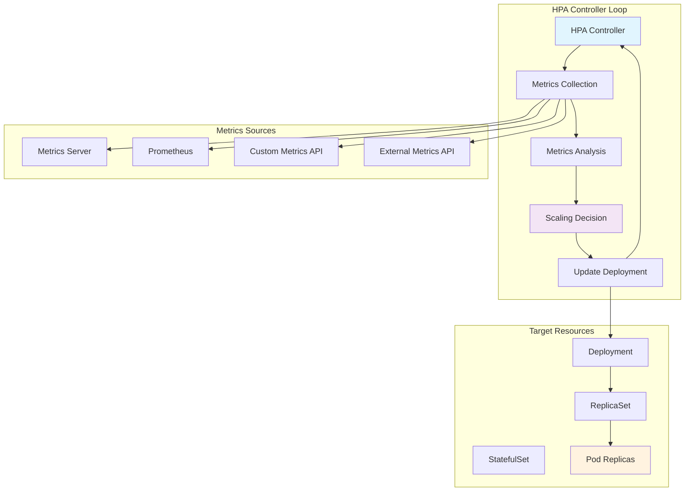

---
tags:
  - Kubernetes
  - HPA
  - Autoscaling
  - Metrics
  - Performance
---

# HPA 메트릭과 동작 원리

## 🎯 개요

2019년 블랙 프라이데이, Target의 온라인 쇼핑몰에 **평소의 50배 트래픽**이 몰렸습니다. 하지만 놀랍게도 서비스는 중단 없이 안정적으로 동작했습니다. 그 비밀은 **Horizontal Pod Autoscaler(HPA)**에 있었습니다.

오전 9시 트래픽이 급증하기 시작하자, HPA는 CPU 사용률 80%를 감지하고 **30초 만에 Pod 수를 10개에서 100개로 자동 확장**했습니다. 오후 6시 트래픽이 줄어들자 다시 **점진적으로 20개까지 축소**했습니다. 이 모든 과정에서 **인간의 개입은 전혀 없었습니다.**

전통적인 환경에서는 트래픽 급증에 대비해 항상 최대 용량의 서버를 운영해야 했지만, HPA는 **실시간 수요에 맞춰 리소스를 자동 조절**함으로써 비용 효율성과 성능을 동시에 달성했습니다.

## 📖 HPA 아키텍처와 동작 원리

### HPA Controller 내부 동작



### HPA 컨트롤 루프 구현

```python
class HPAController:
    def __init__(self):
        self.sync_period = 15  # seconds
        self.tolerance = 0.1   # 10% tolerance
        self.stabilization_window = 300  # 5 minutes
        self.scale_up_cooldown = 60     # 1 minute
        self.scale_down_cooldown = 300  # 5 minutes
        
    def reconcile_loop(self, hpa):
        """HPA 컨트롤 루프 메인 로직"""
        while True:
            try:
                # 1. 현재 메트릭 수집
                current_metrics = self.collect_metrics(hpa)
                
                # 2. 목표 레플리카 수 계산
                desired_replicas = self.calculate_desired_replicas(
                    hpa, current_metrics
                )
                
                # 3. 스케일링 결정 및 실행
                if self.should_scale(hpa, desired_replicas):
                    self.execute_scaling(hpa, desired_replicas)
                
                # 4. 상태 업데이트
                self.update_hpa_status(hpa, current_metrics, desired_replicas)
                
                time.sleep(self.sync_period)
                
            except Exception as e:
                self.handle_error(hpa, e)
                time.sleep(self.sync_period)
    
    def collect_metrics(self, hpa):
        """다양한 소스에서 메트릭 수집"""
        metrics = {}
        
        for metric_spec in hpa.spec.metrics:
            if metric_spec.type == "Resource":
                # CPU, Memory 등 리소스 메트릭
                metrics[metric_spec.resource.name] = self.get_resource_metrics(
                    hpa.spec.scaleTargetRef, 
                    metric_spec.resource.name
                )
            elif metric_spec.type == "Pods":
                # Pod별 커스텀 메트릭
                metrics[metric_spec.pods.metric.name] = self.get_pods_metrics(
                    hpa.spec.scaleTargetRef,
                    metric_spec.pods.metric
                )
            elif metric_spec.type == "Object":
                # 오브젝트 메트릭 (Service, Ingress 등)
                metrics[metric_spec.object.metric.name] = self.get_object_metrics(
                    metric_spec.object.describedObject,
                    metric_spec.object.metric
                )
            elif metric_spec.type == "External":
                # 외부 시스템 메트릭
                metrics[metric_spec.external.metric.name] = self.get_external_metrics(
                    metric_spec.external.metric
                )
        
        return metrics
    
    def calculate_desired_replicas(self, hpa, current_metrics):
        """목표 레플리카 수 계산"""
        current_replicas = self.get_current_replicas(hpa.spec.scaleTargetRef)
        proposals = []
        
        for metric_name, metric_data in current_metrics.items():
            metric_spec = self.get_metric_spec(hpa, metric_name)
            
            if metric_spec.type == "Resource":
                # 리소스 메트릭 기반 계산
                target_utilization = metric_spec.resource.target.averageUtilization
                current_utilization = metric_data['utilization']
                
                desired = math.ceil(
                    current_replicas * (current_utilization / target_utilization)
                )
                
            elif metric_spec.type == "Pods":
                # Pod 메트릭 기반 계산
                target_value = metric_spec.pods.target.averageValue
                current_value = metric_data['averageValue']
                
                desired = math.ceil(
                    current_replicas * (current_value / target_value)
                )
            
            proposals.append({
                'metric': metric_name,
                'current_replicas': current_replicas,
                'desired_replicas': desired,
                'reason': f"based on {metric_name}"
            })
        
        # 가장 큰 스케일링 요구사항 선택
        return max(proposals, key=lambda x: x['desired_replicas'])
    
    def should_scale(self, hpa, desired_replicas_info):
        """스케일링 실행 여부 결정"""
        current_replicas = self.get_current_replicas(hpa.spec.scaleTargetRef)
        desired_replicas = desired_replicas_info['desired_replicas']
        
        # 최소/최대 제약 적용
        min_replicas = hpa.spec.minReplicas or 1
        max_replicas = hpa.spec.maxReplicas
        
        desired_replicas = max(min_replicas, min(max_replicas, desired_replicas))
        
        # 허용 오차 내 변화는 무시
        change_ratio = abs(desired_replicas - current_replicas) / current_replicas
        if change_ratio < self.tolerance:
            return False
        
        # 쿨다운 기간 체크
        last_scale_time = self.get_last_scale_time(hpa)
        now = time.time()
        
        if desired_replicas > current_replicas:
            # Scale up
            if now - last_scale_time < self.scale_up_cooldown:
                return False
        else:
            # Scale down
            if now - last_scale_time < self.scale_down_cooldown:
                return False
        
        return True
    
    def execute_scaling(self, hpa, desired_replicas_info):
        """실제 스케일링 실행"""
        target_ref = hpa.spec.scaleTargetRef
        desired_replicas = desired_replicas_info['desired_replicas']
        
        # Scale subresource 업데이트
        scale = self.get_scale_subresource(target_ref)
        scale.spec.replicas = desired_replicas
        
        self.update_scale_subresource(target_ref, scale)
        
        # 이벤트 기록
        self.record_event(hpa, {
            'type': 'Normal',
            'reason': 'SuccessfulRescale',
            'message': f"New size: {desired_replicas}; reason: {desired_replicas_info['reason']}"
        })
        
        # 마지막 스케일링 시간 기록
        self.update_last_scale_time(hpa, time.time())
```

## 📊 메트릭 타입과 수집

### Resource 메트릭 (CPU/Memory)

```python
class ResourceMetricsCollector:
    def __init__(self):
        self.metrics_server_client = MetricsServerClient()
        
    def collect_cpu_metrics(self, deployment):
        """CPU 메트릭 수집 및 분석"""
        pods = self.get_deployment_pods(deployment)
        cpu_data = []
        
        for pod in pods:
            # Pod 메트릭 조회
            pod_metrics = self.metrics_server_client.get_pod_metrics(
                pod.metadata.name, 
                pod.metadata.namespace
            )
            
            if pod_metrics and pod.status.phase == "Running":
                # CPU 사용량 (millicores)
                cpu_usage = sum(
                    container.usage['cpu'] 
                    for container in pod_metrics.containers
                )
                
                # CPU 요청량 (millicores)
                cpu_requests = sum(
                    container.resources.requests.get('cpu', 0)
                    for container in pod.spec.containers
                )
                
                if cpu_requests > 0:
                    utilization = (cpu_usage / cpu_requests) * 100
                    cpu_data.append({
                        'pod': pod.metadata.name,
                        'usage': cpu_usage,
                        'requests': cpu_requests,
                        'utilization': utilization
                    })
        
        if not cpu_data:
            return None
            
        return {
            'averageUtilization': sum(d['utilization'] for d in cpu_data) / len(cpu_data),
            'currentAverageValue': sum(d['usage'] for d in cpu_data) / len(cpu_data),
            'pods_count': len(cpu_data),
            'individual_metrics': cpu_data
        }
    
    def collect_memory_metrics(self, deployment):
        """Memory 메트릭 수집 및 분석"""
        pods = self.get_deployment_pods(deployment)
        memory_data = []
        
        for pod in pods:
            pod_metrics = self.metrics_server_client.get_pod_metrics(
                pod.metadata.name,
                pod.metadata.namespace  
            )
            
            if pod_metrics and pod.status.phase == "Running":
                # Memory 사용량 (bytes)
                memory_usage = sum(
                    self.parse_memory_value(container.usage['memory'])
                    for container in pod_metrics.containers
                )
                
                # Memory 요청량 (bytes)
                memory_requests = sum(
                    self.parse_memory_value(
                        container.resources.requests.get('memory', '0')
                    )
                    for container in pod.spec.containers
                )
                
                if memory_requests > 0:
                    utilization = (memory_usage / memory_requests) * 100
                    memory_data.append({
                        'pod': pod.metadata.name,
                        'usage': memory_usage,
                        'requests': memory_requests,
                        'utilization': utilization
                    })
        
        if not memory_data:
            return None
            
        return {
            'averageUtilization': sum(d['utilization'] for d in memory_data) / len(memory_data),
            'currentAverageValue': sum(d['usage'] for d in memory_data) / len(memory_data),
            'pods_count': len(memory_data)
        }
    
    def parse_memory_value(self, memory_str):
        """Memory 값 파싱 (Ki, Mi, Gi 등)"""
        units = {
            'Ki': 1024,
            'Mi': 1024**2, 
            'Gi': 1024**3,
            'Ti': 1024**4,
            'k': 1000,
            'm': 1000**2,
            'g': 1000**3,
            't': 1000**4
        }
        
        if memory_str.isdigit():
            return int(memory_str)
        
        for unit, multiplier in units.items():
            if memory_str.endswith(unit):
                value = float(memory_str[:-len(unit)])
                return int(value * multiplier)
        
        return int(memory_str)
```

### Custom 메트릭 (Prometheus 연동)

```python
class CustomMetricsCollector:
    def __init__(self):
        self.prometheus_client = PrometheusClient()
        
    def collect_http_requests_per_second(self, deployment):
        """HTTP RPS 메트릭 수집"""
        # Prometheus 쿼리
        query = f'''
            sum(rate(http_requests_total{{
                deployment="{deployment.metadata.name}",
                namespace="{deployment.metadata.namespace}"
            }}[2m])) by (pod)
        '''
        
        result = self.prometheus_client.query(query)
        
        if not result:
            return None
        
        pod_metrics = []
        total_rps = 0
        
        for metric in result:
            pod_name = metric['metric']['pod']
            rps_value = float(metric['value'][1])
            
            pod_metrics.append({
                'pod': pod_name,
                'requests_per_second': rps_value
            })
            total_rps += rps_value
        
        return {
            'currentAverageValue': total_rps / len(pod_metrics) if pod_metrics else 0,
            'pods_count': len(pod_metrics),
            'total_rps': total_rps,
            'individual_metrics': pod_metrics
        }
    
    def collect_queue_length(self, queue_name):
        """큐 길이 메트릭 수집"""
        query = f'queue_length{{queue="{queue_name}"}}'
        result = self.prometheus_client.query(query)
        
        if result and len(result) > 0:
            return {
                'currentValue': float(result[0]['value'][1]),
                'timestamp': result[0]['value'][0]
            }
        
        return None
    
    def collect_application_lag(self, app_selector):
        """애플리케이션 지연 시간 메트릭"""
        query = f'''
            histogram_quantile(0.95,
                rate(http_request_duration_seconds_bucket{{
                    {app_selector}
                }}[5m])
            )
        '''
        
        result = self.prometheus_client.query(query)
        
        if result and len(result) > 0:
            return {
                'p95_latency_seconds': float(result[0]['value'][1]),
                'timestamp': result[0]['value'][0]
            }
        
        return None
```

### External 메트릭 (AWS CloudWatch)

```python
class ExternalMetricsCollector:
    def __init__(self):
        self.cloudwatch_client = boto3.client('cloudwatch')
        
    def collect_sqs_queue_length(self, queue_url):
        """SQS 큐 길이 메트릭"""
        try:
            response = self.cloudwatch_client.get_metric_statistics(
                Namespace='AWS/SQS',
                MetricName='ApproximateNumberOfMessages',
                Dimensions=[
                    {
                        'Name': 'QueueName',
                        'Value': queue_url.split('/')[-1]
                    }
                ],
                StartTime=datetime.utcnow() - timedelta(minutes=5),
                EndTime=datetime.utcnow(),
                Period=300,  # 5 minutes
                Statistics=['Average']
            )
            
            if response['Datapoints']:
                latest = max(response['Datapoints'], key=lambda x: x['Timestamp'])
                return {
                    'currentValue': int(latest['Average']),
                    'timestamp': latest['Timestamp']
                }
                
        except Exception as e:
            print(f"Error collecting SQS metrics: {e}")
            
        return None
    
    def collect_alb_request_count(self, load_balancer_name):
        """ALB 요청 수 메트릭"""
        try:
            response = self.cloudwatch_client.get_metric_statistics(
                Namespace='AWS/ApplicationELB',
                MetricName='RequestCount',
                Dimensions=[
                    {
                        'Name': 'LoadBalancer',
                        'Value': load_balancer_name
                    }
                ],
                StartTime=datetime.utcnow() - timedelta(minutes=10),
                EndTime=datetime.utcnow(),
                Period=300,
                Statistics=['Sum']
            )
            
            if response['Datapoints']:
                # 분당 요청 수 계산
                total_requests = sum(dp['Sum'] for dp in response['Datapoints'])
                duration_minutes = len(response['Datapoints']) * 5
                requests_per_minute = total_requests / duration_minutes if duration_minutes > 0 else 0
                
                return {
                    'currentValue': requests_per_minute,
                    'totalRequests': total_requests
                }
                
        except Exception as e:
            print(f"Error collecting ALB metrics: {e}")
            
        return None
```

## 🎛️ 고급 HPA 설정

### Behavior 설정 (스케일링 정책)

```python
class HPABehaviorConfig:
    def __init__(self):
        self.scaling_policies = {}
        
    def create_aggressive_scale_up_config(self):
        """공격적 스케일 업 설정"""
        return {
            "apiVersion": "autoscaling/v2",
            "kind": "HorizontalPodAutoscaler", 
            "metadata": {"name": "aggressive-hpa"},
            "spec": {
                "scaleTargetRef": {
                    "apiVersion": "apps/v1",
                    "kind": "Deployment", 
                    "name": "web-app"
                },
                "minReplicas": 2,
                "maxReplicas": 100,
                "metrics": [
                    {
                        "type": "Resource",
                        "resource": {
                            "name": "cpu",
                            "target": {
                                "type": "Utilization",
                                "averageUtilization": 70
                            }
                        }
                    }
                ],
                "behavior": {
                    "scaleUp": {
                        "stabilizationWindowSeconds": 60,  # 1분 안정화
                        "policies": [
                            {
                                "type": "Percent",
                                "value": 100,     # 100% 증가
                                "periodSeconds": 60
                            },
                            {
                                "type": "Pods", 
                                "value": 10,      # 최대 10개 Pod 추가
                                "periodSeconds": 60
                            }
                        ],
                        "selectPolicy": "Max"  # 더 큰 값 선택
                    },
                    "scaleDown": {
                        "stabilizationWindowSeconds": 300,  # 5분 안정화
                        "policies": [
                            {
                                "type": "Percent",
                                "value": 10,      # 10%만 감소
                                "periodSeconds": 60
                            }
                        ]
                    }
                }
            }
        }
    
    def create_conservative_scaling_config(self):
        """보수적 스케일링 설정"""
        return {
            "behavior": {
                "scaleUp": {
                    "stabilizationWindowSeconds": 300,  # 5분 안정화
                    "policies": [
                        {
                            "type": "Percent",
                            "value": 25,      # 25% 증가
                            "periodSeconds": 120
                        },
                        {
                            "type": "Pods",
                            "value": 2,       # 최대 2개 Pod 추가
                            "periodSeconds": 120
                        }
                    ],
                    "selectPolicy": "Min"  # 더 작은 값 선택
                },
                "scaleDown": {
                    "stabilizationWindowSeconds": 600,  # 10분 안정화
                    "policies": [
                        {
                            "type": "Percent", 
                            "value": 5,       # 5%만 감소
                            "periodSeconds": 300
                        }
                    ]
                }
            }
        }
    
    def create_time_based_scaling_config(self):
        """시간 기반 스케일링 정책"""
        return {
            "business_hours_policy": {
                "time_range": "09:00-18:00 KST",
                "behavior": {
                    "scaleUp": {
                        "stabilizationWindowSeconds": 30,
                        "policies": [
                            {
                                "type": "Percent",
                                "value": 50,
                                "periodSeconds": 30
                            }
                        ]
                    }
                }
            },
            "off_hours_policy": {
                "time_range": "18:01-08:59 KST",
                "behavior": {
                    "scaleUp": {
                        "stabilizationWindowSeconds": 120,
                        "policies": [
                            {
                                "type": "Percent",
                                "value": 20,
                                "periodSeconds": 120
                            }
                        ]
                    }
                }
            }
        }
```

### 다중 메트릭 HPA

```python
class MultiMetricHPA:
    def __init__(self):
        self.metric_combinations = []
        
    def create_comprehensive_hpa(self):
        """포괄적 메트릭 기반 HPA"""
        return {
            "apiVersion": "autoscaling/v2",
            "kind": "HorizontalPodAutoscaler",
            "metadata": {"name": "comprehensive-hpa"},
            "spec": {
                "scaleTargetRef": {
                    "apiVersion": "apps/v1",
                    "kind": "Deployment",
                    "name": "api-server"
                },
                "minReplicas": 3,
                "maxReplicas": 50,
                "metrics": [
                    {
                        "type": "Resource",
                        "resource": {
                            "name": "cpu",
                            "target": {
                                "type": "Utilization", 
                                "averageUtilization": 70
                            }
                        }
                    },
                    {
                        "type": "Resource",
                        "resource": {
                            "name": "memory",
                            "target": {
                                "type": "Utilization",
                                "averageUtilization": 80
                            }
                        }
                    },
                    {
                        "type": "Pods",
                        "pods": {
                            "metric": {
                                "name": "http_requests_per_second"
                            },
                            "target": {
                                "type": "AverageValue",
                                "averageValue": "100"
                            }
                        }
                    },
                    {
                        "type": "Object",
                        "object": {
                            "metric": {
                                "name": "ingress_requests_per_second"
                            },
                            "describedObject": {
                                "apiVersion": "networking.k8s.io/v1",
                                "kind": "Ingress",
                                "name": "api-ingress"
                            },
                            "target": {
                                "type": "Value",
                                "value": "1000"
                            }
                        }
                    },
                    {
                        "type": "External",
                        "external": {
                            "metric": {
                                "name": "sqs_queue_length",
                                "selector": {
                                    "matchLabels": {
                                        "queue": "api-processing-queue"
                                    }
                                }
                            },
                            "target": {
                                "type": "Value", 
                                "value": "50"
                            }
                        }
                    }
                ]
            }
        }
    
    def explain_metric_priority(self):
        """메트릭 우선순위 설명"""
        return {
            "selection_algorithm": "Maximum scaling requirement wins",
            "example_scenario": {
                "cpu_suggests": 5, 
                "memory_suggests": 8,
                "rps_suggests": 12,
                "queue_suggests": 7,
                "final_decision": 12,
                "reasoning": "RPS 메트릭이 가장 큰 스케일링을 요구함"
            },
            "considerations": [
                "각 메트릭이 독립적으로 계산됨",
                "가장 큰 값이 선택됨",
                "min/max 제약은 나중에 적용됨",
                "스케일링 정책은 최종 결정에 적용됨"
            ]
        }
```

## 🛠️ HPA 최적화 전략

### 메트릭 서버 최적화

```python
class MetricsServerOptimizer:
    def __init__(self):
        self.optimization_configs = {}
        
    def optimize_metrics_collection(self):
        """메트릭 수집 최적화"""
        return {
            "kubelet_optimization": {
                "summary_api_cache": {
                    "cache_duration": "10s",
                    "purpose": "메트릭 조회 성능 향상"
                },
                "metrics_resolution": {
                    "cpu_cfs_period": "더 정확한 CPU 메트릭",
                    "memory_working_set": "실제 메모리 사용량 기준"
                }
            },
            "metrics_server_tuning": {
                "collection_interval": "15s",  # 기본값 60s에서 단축
                "resolution": "10s",           # 메트릭 해상도
                "retention": "2m",             # 메트릭 보존 기간
                "aggregation_window": "30s"    # 집계 윈도우
            },
            "deployment_config": '''
apiVersion: apps/v1
kind: Deployment
metadata:
  name: metrics-server
  namespace: kube-system
spec:
  template:
    spec:
      containers:
      - name: metrics-server
        image: k8s.gcr.io/metrics-server/metrics-server:v0.6.2
        args:
        - --cert-dir=/tmp
        - --secure-port=4443
        - --kubelet-preferred-address-types=InternalIP,ExternalIP,Hostname
        - --kubelet-use-node-status-port
        - --metric-resolution=15s
        - --kubelet-insecure-tls
        resources:
          requests:
            cpu: 100m
            memory: 200Mi
          limits:
            cpu: 500m
            memory: 500Mi
'''
        }
    
    def setup_custom_metrics_api(self):
        """커스텀 메트릭 API 설정"""
        return {
            "prometheus_adapter": '''
apiVersion: v1
kind: ConfigMap
metadata:
  name: adapter-config
  namespace: monitoring
data:
  config.yaml: |
    rules:
    # HTTP 요청률 메트릭
    - seriesQuery: 'http_requests_total{namespace!="",pod!=""}'
      resources:
        overrides:
          namespace: {resource: "namespace"}
          pod: {resource: "pod"}
      name:
        matches: "^http_requests_total"
        as: "http_requests_per_second"
      metricsQuery: |
        sum(rate(<<.Series>>{<<.LabelMatchers>>}[2m])) by (<<.GroupBy>>)
    
    # 큐 길이 메트릭  
    - seriesQuery: 'queue_length{queue!=""}'
      name:
        matches: "^queue_length"
        as: "queue_depth"
      metricsQuery: |
        max(<<.Series>>{<<.LabelMatchers>>}) by (<<.GroupBy>>)
    
    # 응답 지연시간 메트릭
    - seriesQuery: 'http_request_duration_seconds_bucket{namespace!="",pod!=""}'
      resources:
        overrides:
          namespace: {resource: "namespace"}
          pod: {resource: "pod"}
      name:
        matches: "^http_request_duration_seconds_bucket"
        as: "http_request_latency"
      metricsQuery: |
        histogram_quantile(0.95, 
          sum(rate(<<.Series>>{<<.LabelMatchers>>}[5m])) by (<<.GroupBy>>, le)
        )
''',
            "external_metrics": {
                "aws_cloudwatch": "CloudWatch 메트릭을 External API로 노출",
                "datadog": "Datadog 메트릭 통합",
                "newrelic": "New Relic APM 메트릭"
            }
        }
```

### 스케일링 성능 튜닝

```python
class HPAPerformanceTuning:
    def __init__(self):
        self.tuning_parameters = {}
        
    def optimize_scaling_responsiveness(self):
        """스케일링 응답성 최적화"""
        return {
            "fast_scale_up_scenario": {
                "use_case": "트래픽 급증 대응 (Black Friday, 마케팅 캠페인)",
                "configuration": {
                    "horizontal_pod_autoscaler_sync_period": "10s",  # 기본 15s
                    "horizontal_pod_autoscaler_upscale_delay": "30s", # 기본 3m
                    "horizontal_pod_autoscaler_downscale_delay": "5m", # 기본 5m
                    "horizontal_pod_autoscaler_downscale_stabilization": "5m"
                },
                "behavior_policy": {
                    "scaleUp": {
                        "stabilizationWindowSeconds": 30,
                        "policies": [
                            {
                                "type": "Percent",
                                "value": 100,
                                "periodSeconds": 15
                            },
                            {
                                "type": "Pods",
                                "value": 20,
                                "periodSeconds": 15  
                            }
                        ]
                    }
                }
            },
            "cost_optimized_scenario": {
                "use_case": "비용 최적화 우선 (개발/테스트 환경)",
                "configuration": {
                    "horizontal_pod_autoscaler_sync_period": "30s",
                    "horizontal_pod_autoscaler_downscale_stabilization": "10m"
                },
                "behavior_policy": {
                    "scaleUp": {
                        "stabilizationWindowSeconds": 300,
                        "policies": [
                            {
                                "type": "Percent", 
                                "value": 50,
                                "periodSeconds": 120
                            }
                        ]
                    },
                    "scaleDown": {
                        "stabilizationWindowSeconds": 600,
                        "policies": [
                            {
                                "type": "Pods",
                                "value": 1,
                                "periodSeconds": 300
                            }
                        ]
                    }
                }
            }
        }
    
    def anti_flapping_strategies(self):
        """플래핑 방지 전략"""
        return {
            "stabilization_window": {
                "purpose": "최근 메트릭 값들의 안정성 확인",
                "scale_up": "짧은 윈도우 (30-60s) - 빠른 반응",
                "scale_down": "긴 윈도우 (300-600s) - 신중한 축소"
            },
            "tolerance_threshold": {
                "default": "10%",
                "aggressive": "5%",
                "conservative": "20%",
                "calculation": "(desired - current) / current > tolerance"
            },
            "metric_smoothing": {
                "moving_average": "메트릭 값의 이동평균 사용",
                "outlier_filtering": "극값 제거",
                "weighted_average": "최근 값에 더 큰 가중치"
            }
        }
```

## 🎯 실전 활용 패턴

### 웹 애플리케이션 HPA

```python
class WebApplicationHPA:
    def __init__(self):
        self.patterns = {}
        
    def ecommerce_hpa_pattern(self):
        """전자상거래 HPA 패턴"""
        return {
            "scenario": "온라인 쇼핑몰 - 트래픽 변동이 큰 환경",
            "hpa_config": '''
apiVersion: autoscaling/v2
kind: HorizontalPodAutoscaler
metadata:
  name: ecommerce-frontend-hpa
spec:
  scaleTargetRef:
    apiVersion: apps/v1
    kind: Deployment
    name: ecommerce-frontend
  minReplicas: 5      # 기본 트래픽 처리
  maxReplicas: 200    # 블랙프라이데이 대비
  metrics:
  # CPU 기반 스케일링
  - type: Resource
    resource:
      name: cpu
      target:
        type: Utilization
        averageUtilization: 60
  
  # RPS 기반 스케일링 (더 민감한 반응)
  - type: Pods
    pods:
      metric:
        name: nginx_ingress_controller_requests
      target:
        type: AverageValue
        averageValue: "50"
  
  # 응답 시간 기반
  - type: Pods
    pods:
      metric:
        name: http_request_duration_95percentile
      target:
        type: AverageValue
        averageValue: "500m"  # 500ms
  
  behavior:
    scaleUp:
      stabilizationWindowSeconds: 30
      policies:
      - type: Percent
        value: 50
        periodSeconds: 30
      - type: Pods
        value: 10
        periodSeconds: 30
    scaleDown:
      stabilizationWindowSeconds: 300
      policies:
      - type: Percent
        value: 10
        periodSeconds: 60
''',
            "monitoring_alerts": '''
# HPA 스케일링 이벤트 모니터링
- alert: HPAScalingEvent
  expr: |
    increase(kube_hpa_status_current_replicas[5m]) > 10
  for: 0m
  annotations:
    summary: "HPA scaled up significantly"
    description: "{{ $labels.hpa }} scaled up by {{ $value }} replicas"

# HPA 최대치 도달 알림
- alert: HPAMaxReplicasReached  
  expr: |
    kube_hpa_status_current_replicas == kube_hpa_spec_max_replicas
  for: 5m
  annotations:
    summary: "HPA reached maximum replicas"
    description: "{{ $labels.hpa }} is at maximum capacity"
'''
        }
    
    def api_service_hpa_pattern(self):
        """API 서비스 HPA 패턴"""
        return {
            "scenario": "RESTful API 서버 - 안정적 성능 중심",
            "multiple_hpa_strategy": {
                "read_api_hpa": '''
# 읽기 전용 API (캐시 활용도 높음)
apiVersion: autoscaling/v2
kind: HorizontalPodAutoscaler
metadata:
  name: read-api-hpa
spec:
  scaleTargetRef:
    apiVersion: apps/v1
    kind: Deployment
    name: read-api
  minReplicas: 3
  maxReplicas: 30
  metrics:
  - type: Resource
    resource:
      name: cpu
      target:
        type: Utilization
        averageUtilization: 70    # 높은 CPU 허용
  - type: Pods
    pods:
      metric:
        name: http_requests_per_second
      target:
        type: AverageValue
        averageValue: "200"       # 높은 RPS 처리
''',
                "write_api_hpa": '''
# 쓰기 API (데이터베이스 부하 고려)
apiVersion: autoscaling/v2
kind: HorizontalPodAutoscaler
metadata:
  name: write-api-hpa
spec:
  scaleTargetRef:
    apiVersion: apps/v1
    kind: Deployment
    name: write-api
  minReplicas: 2
  maxReplicas: 20
  metrics:
  - type: Resource
    resource:
      name: cpu
      target:
        type: Utilization
        averageUtilization: 50    # 보수적 CPU 기준
  - type: External
    external:
      metric:
        name: database_connection_pool_usage
      target:
        type: Value
        value: "80"               # DB 연결 풀 고려
'''
            }
        }
```

### 배치 처리 HPA

```python
class BatchProcessingHPA:
    def __init__(self):
        self.queue_based_patterns = {}
        
    def message_queue_hpa_pattern(self):
        """메시지 큐 기반 HPA"""
        return {
            "scenario": "비동기 작업 처리 - 큐 길이 기반 스케일링",
            "hpa_config": '''
apiVersion: autoscaling/v2
kind: HorizontalPodAutoscaler
metadata:
  name: worker-queue-hpa
spec:
  scaleTargetRef:
    apiVersion: apps/v1
    kind: Deployment
    name: background-worker
  minReplicas: 1
  maxReplicas: 100
  metrics:
  # SQS 큐 길이 기반
  - type: External
    external:
      metric:
        name: sqs_queue_length
        selector:
          matchLabels:
            queue_name: "image-processing-queue"
      target:
        type: AverageValue
        averageValue: "5"         # Pod당 5개 메시지 처리
  
  # Redis 큐 길이 기반
  - type: External
    external:
      metric:
        name: redis_list_length
        selector:
          matchLabels:
            queue_key: "tasks:pending"
      target:
        type: AverageValue
        averageValue: "10"
  
  behavior:
    scaleUp:
      stabilizationWindowSeconds: 60
      policies:
      - type: Percent
        value: 200              # 빠른 확장 (3배까지)
        periodSeconds: 60
    scaleDown:
      stabilizationWindowSeconds: 600   # 큐가 비어도 10분 대기
      policies:
      - type: Percent
        value: 25               # 천천히 축소
        periodSeconds: 300
''',
            "custom_metrics_setup": '''
# Prometheus 메트릭 노출
apiVersion: v1
kind: Service
metadata:
  name: queue-metrics-exporter
  annotations:
    prometheus.io/scrape: "true"
    prometheus.io/port: "8080"
spec:
  ports:
  - port: 8080
    targetPort: 8080
  selector:
    app: queue-metrics-exporter
---
# 메트릭 수집 설정
apiVersion: monitoring.coreos.com/v1
kind: ServiceMonitor
metadata:
  name: queue-metrics
spec:
  selector:
    matchLabels:
      app: queue-metrics-exporter
  endpoints:
  - port: http-metrics
    interval: 15s
    path: /metrics
'''
        }
```

## 🔍 트러블슈팅 가이드

### 일반적인 HPA 문제들

```python
class HPATroubleshooting:
    def __init__(self):
        self.common_issues = {}
        
    def scaling_not_working_issues(self):
        """스케일링이 작동하지 않는 문제들"""
        return {
            "no_metrics_available": {
                "symptoms": [
                    "HPA status에 'unknown' 표시",
                    "메트릭을 찾을 수 없다는 오류"
                ],
                "causes": [
                    "Metrics Server가 설치되지 않음",
                    "Custom Metrics API 설정 오류",
                    "Pod에 리소스 requests가 설정되지 않음"
                ],
                "solutions": [
                    "kubectl get apiservice | grep metrics",
                    "kubectl top nodes && kubectl top pods",
                    "Pod spec에 resources.requests 추가"
                ],
                "debug_commands": [
                    "kubectl describe hpa <hpa-name>",
                    "kubectl get --raw '/apis/metrics.k8s.io/v1beta1/pods'",
                    "kubectl logs -n kube-system deployment/metrics-server"
                ]
            },
            "permissions_issues": {
                "symptoms": ["HPA controller 오류", "메트릭 접근 실패"],
                "solutions": '''
# HPA를 위한 RBAC 설정
apiVersion: rbac.authorization.k8s.io/v1
kind: ClusterRole
metadata:
  name: system:hpa-controller
rules:
- apiGroups: [""]
  resources: ["pods"]
  verbs: ["get", "list"]
- apiGroups: ["apps"]
  resources: ["deployments", "replicasets"]
  verbs: ["get", "list", "patch", "update"]
- apiGroups: ["metrics.k8s.io"]
  resources: ["*"]
  verbs: ["get", "list"]
'''
            }
        }
    
    def performance_issues(self):
        """성능 관련 문제들"""
        return {
            "slow_scaling": {
                "symptoms": ["스케일링 반응이 느림", "지연된 Pod 생성"],
                "analysis": '''
# HPA 이벤트 확인
kubectl describe hpa <hpa-name>

# 최근 스케일링 이벤트
kubectl get events --field-selector involvedObject.name=<hpa-name>

# 현재 메트릭 값 확인
kubectl get hpa <hpa-name> -o yaml
''',
                "optimizations": [
                    "메트릭 수집 주기 단축 (sync-period)",
                    "안정화 윈도우 조정",
                    "더 민감한 임계값 설정",
                    "Pod 시작 시간 최적화 (이미지 캐싱)"
                ]
            },
            "flapping_behavior": {
                "symptoms": ["빈번한 스케일 업/다운", "불안정한 레플리카 수"],
                "root_causes": [
                    "메트릭 변동성이 큼",
                    "안정화 윈도우가 너무 짧음", 
                    "임계값이 너무 민감함"
                ],
                "solutions": {
                    "increase_stabilization": "안정화 윈도우 증가 (300s → 600s)",
                    "adjust_tolerance": "허용 오차 증가 (10% → 20%)",
                    "smooth_metrics": "메트릭 평활화 (이동평균 사용)"
                }
            }
        }
    
    def monitoring_and_debugging_tools(self):
        """모니터링 및 디버깅 도구"""
        return {
            "hpa_status_check": '''
#!/bin/bash
echo "=== HPA Status Check ==="

# 모든 HPA 상태 확인
kubectl get hpa -A

# 특정 HPA 상세 정보
HPA_NAME="web-app-hpa"
kubectl describe hpa $HPA_NAME

# HPA 메트릭 확인
kubectl get hpa $HPA_NAME -o jsonpath='{.status.currentMetrics}'

# 최근 스케일링 이벤트
kubectl get events --field-selector involvedObject.name=$HPA_NAME --sort-by='.lastTimestamp'

# 대상 Deployment 상태
TARGET_DEPLOYMENT=$(kubectl get hpa $HPA_NAME -o jsonpath='{.spec.scaleTargetRef.name}')
kubectl get deployment $TARGET_DEPLOYMENT -o wide

# Pod 리소스 사용률
kubectl top pods -l app=$TARGET_DEPLOYMENT
''',
            "metrics_debugging": '''
# 메트릭 API 접근 테스트
kubectl get --raw "/apis/metrics.k8s.io/v1beta1/nodes"
kubectl get --raw "/apis/metrics.k8s.io/v1beta1/pods"

# 커스텀 메트릭 API 테스트  
kubectl get --raw "/apis/custom.metrics.k8s.io/v1beta1"

# 외부 메트릭 API 테스트
kubectl get --raw "/apis/external.metrics.k8s.io/v1beta1"

# Prometheus 어댑터 로그
kubectl logs -n monitoring deployment/prometheus-adapter
''',
            "performance_monitoring": '''
# HPA 성능 메트릭
- name: hpa_scaling_duration
  query: |
    time() - on(hpa) kube_hpa_status_last_scale_time

- name: hpa_scaling_frequency  
  query: |
    rate(kube_hpa_status_last_scale_time[1h])

- name: hpa_metrics_lag
  query: |
    time() - on(hpa) kube_hpa_status_observed_generation
'''
        }
```

## 🛠️ 실습 및 검증

### HPA 테스트 스크립트

```bash
#!/bin/bash

echo "=== HPA Testing Suite ==="

# 1. HPA 기본 설정 테스트
test_basic_hpa() {
    echo "Testing basic HPA setup..."
    
    # 테스트용 애플리케이션 배포
    cat <<EOF | kubectl apply -f -
apiVersion: apps/v1
kind: Deployment
metadata:
  name: hpa-test-app
  labels:
    app: hpa-test
spec:
  replicas: 1
  selector:
    matchLabels:
      app: hpa-test
  template:
    metadata:
      labels:
        app: hpa-test
    spec:
      containers:
      - name: test-app
        image: k8s.gcr.io/hpa-example
        ports:
        - containerPort: 80
        resources:
          requests:
            cpu: 100m
            memory: 64Mi
          limits:
            cpu: 500m
            memory: 128Mi
---
apiVersion: v1
kind: Service
metadata:
  name: hpa-test-service
spec:
  selector:
    app: hpa-test
  ports:
  - port: 80
    targetPort: 80
EOF

    # HPA 생성
    cat <<EOF | kubectl apply -f -
apiVersion: autoscaling/v2
kind: HorizontalPodAutoscaler
metadata:
  name: hpa-test
spec:
  scaleTargetRef:
    apiVersion: apps/v1
    kind: Deployment
    name: hpa-test-app
  minReplicas: 1
  maxReplicas: 10
  metrics:
  - type: Resource
    resource:
      name: cpu
      target:
        type: Utilization
        averageUtilization: 50
EOF

    # 배포 완료 대기
    kubectl wait --for=condition=available deployment/hpa-test-app --timeout=120s
    
    # HPA 상태 확인
    kubectl get hpa hpa-test
    kubectl describe hpa hpa-test
}

# 2. 부하 테스트 및 스케일링 확인
test_load_scaling() {
    echo "Testing HPA scaling under load..."
    
    # 부하 생성 Pod 생성
    kubectl run load-generator --rm -i --tty --image=busybox /bin/sh <<EOF
echo "Generating load on hpa-test-service..."
while true; do
  wget -q -O- http://hpa-test-service.default.svc.cluster.local/
done
EOF &
    
    LOAD_PID=$!
    
    echo "Load generation started. Monitoring HPA scaling..."
    
    # 5분 동안 HPA 상태 모니터링
    for i in {1..30}; do
        echo "=== Minute $((i/2)) ==="
        kubectl get hpa hpa-test
        kubectl get pods -l app=hpa-test
        sleep 10
    done
    
    # 부하 생성 중단
    kill $LOAD_PID 2>/dev/null
    
    echo "Load test completed. Monitoring scale down..."
    
    # 스케일 다운 모니터링
    for i in {1..20}; do
        echo "=== Scale down check $i ==="
        kubectl get hpa hpa-test
        sleep 30
    done
}

# 3. 메트릭 수집 테스트
test_metrics_collection() {
    echo "Testing metrics collection..."
    
    # Metrics Server 상태 확인
    echo "=== Metrics Server Status ==="
    kubectl get pods -n kube-system | grep metrics-server
    
    # 노드 메트릭 확인
    echo "=== Node Metrics ==="
    kubectl top nodes
    
    # Pod 메트릭 확인
    echo "=== Pod Metrics ==="
    kubectl top pods -l app=hpa-test
    
    # 메트릭 API 직접 호출
    echo "=== Direct Metrics API Call ==="
    kubectl get --raw "/apis/metrics.k8s.io/v1beta1/namespaces/default/pods" | jq '.items[] | select(.metadata.labels.app=="hpa-test") | {name: .metadata.name, cpu: .containers[].usage.cpu, memory: .containers[].usage.memory}'
}

# 4. HPA 이벤트 및 로그 분석
analyze_hpa_events() {
    echo "Analyzing HPA events and behavior..."
    
    # HPA 상세 정보
    echo "=== HPA Detailed Status ==="
    kubectl describe hpa hpa-test
    
    # HPA 관련 이벤트
    echo "=== HPA Events ==="
    kubectl get events --field-selector involvedObject.name=hpa-test --sort-by='.lastTimestamp'
    
    # Deployment 이벤트
    echo "=== Deployment Events ==="
    kubectl get events --field-selector involvedObject.name=hpa-test-app --sort-by='.lastTimestamp'
    
    # HPA Controller 로그
    echo "=== HPA Controller Logs ==="
    kubectl logs -n kube-system -l component=controller-manager --tail=50 | grep -i hpa
}

# 5. 커스텀 메트릭 HPA 테스트 (Prometheus 필요)
test_custom_metrics_hpa() {
    echo "Testing custom metrics HPA..."
    
    # Prometheus와 어댑터가 설치되어 있는지 확인
    if ! kubectl get pods -n monitoring | grep prometheus-adapter >/dev/null 2>&1; then
        echo "Prometheus adapter not found. Skipping custom metrics test."
        return
    fi
    
    # 커스텀 메트릭 기반 HPA 생성
    cat <<EOF | kubectl apply -f -
apiVersion: autoscaling/v2
kind: HorizontalPodAutoscaler
metadata:
  name: hpa-custom-test
spec:
  scaleTargetRef:
    apiVersion: apps/v1
    kind: Deployment
    name: hpa-test-app
  minReplicas: 1
  maxReplicas: 5
  metrics:
  - type: Pods
    pods:
      metric:
        name: http_requests_per_second
      target:
        type: AverageValue
        averageValue: "10"
EOF

    # 커스텀 메트릭 API 확인
    echo "=== Custom Metrics API ==="
    kubectl get --raw "/apis/custom.metrics.k8s.io/v1beta1" | jq '.'
    
    # HPA 상태 확인
    kubectl describe hpa hpa-custom-test
}

# 정리 함수
cleanup_hpa_test() {
    echo "Cleaning up HPA test resources..."
    kubectl delete hpa hpa-test hpa-custom-test --ignore-not-found
    kubectl delete deployment hpa-test-app --ignore-not-found
    kubectl delete service hpa-test-service --ignore-not-found
    kubectl delete pod load-generator --ignore-not-found
    
    echo "HPA test cleanup completed"
}

# 메뉴 선택
case "$1" in
    basic)
        test_basic_hpa
        ;;
    load)
        test_load_scaling
        ;;
    metrics)
        test_metrics_collection
        ;;
    events)
        analyze_hpa_events
        ;;
    custom)
        test_custom_metrics_hpa
        ;;
    all)
        test_basic_hpa
        echo "===================="
        test_metrics_collection
        echo "===================="
        test_load_scaling
        echo "===================="
        analyze_hpa_events
        ;;
    cleanup)
        cleanup_hpa_test
        ;;
    *)
        echo "Usage: $0 {basic|load|metrics|events|custom|all|cleanup}"
        echo ""
        echo "Commands:"
        echo "  basic   - Test basic HPA setup"
        echo "  load    - Test HPA scaling under load"
        echo "  metrics - Test metrics collection"
        echo "  events  - Analyze HPA events"
        echo "  custom  - Test custom metrics HPA"
        echo "  all     - Run all tests"
        echo "  cleanup - Clean up test resources"
        exit 1
        ;;
esac
```

이처럼 HPA는 **실시간 워크로드 변화에 따른 자동 스케일링**을 통해 성능과 비용 효율성을 동시에 달성하는 핵심 기능입니다. CPU, 메모리 같은 기본 메트릭부터 비즈니스 특화 메트릭까지 다양한 지표를 기반으로 **지능적인 스케일링 결정**을 내릴 수 있습니다.

다음 문서에서는 **VPA(Vertical Pod Autoscaler)의 추천 엔진**과 리소스 최적화 방법을 살펴보겠습니다.
