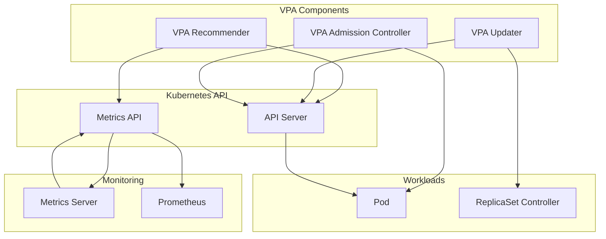

---
tags:
  - Kubernetes
  - Scaling
  - VPA
  - Resources
  - Memory
---

# VPA (Vertical Pod Autoscaler)

## 실제 사례: Spotify의 리소스 최적화 여정

2019년, Spotify는 전 세계 2억 5천만 명의 사용자를 지원하며 수천 개의 마이크로서비스를 운영하고 있었습니다. 하지만 개발팀들은 공통된 문제에 직면했습니다.

```bash
# 개발자들의 일반적인 Pod 설정
apiVersion: v1
kind: Pod
spec:
  containers:
  - name: recommendation-engine
    resources:
      requests:
        memory: "4Gi"    # 안전하게 높게 설정
        cpu: "2000m"
      limits:
        memory: "8Gi"    # 더 안전하게!
        cpu: "4000m"
```

문제는 이런 "안전한" 설정들이 누적되면서 클러스터 리소스가 심각하게 낭비되고 있다는 것이었습니다. 실제로는 512MB만 사용하는 서비스가 4GB를 요청하고, 실제로는 100m CPU만 사용하는데 2000m를 예약하고 있었습니다.

Spotify의 플랫폼 엔지니어링 팀은 이 문제를 해결하기 위해 VPA(Vertical Pod Autoscaler)를 도입했습니다. 결과는 놀라웠습니다:

- **비용 절감**: 클러스터 리소스 사용률 40% 개선
- **성능 향상**: 적절한 리소스 할당으로 OOM 에러 95% 감소
- **개발자 경험**: 리소스 추측 작업에서 해방

이것이 바로 VPA의 힘입니다.

## VPA 아키텍처와 동작 원리

### 핵심 컴포넌트 구조

VPA는 세 개의 주요 컴포넌트로 구성됩니다:



### 1. VPA Recommender: 지능형 분석 엔진

VPA Recommender는 과거 데이터를 분석하여 최적의 리소스 요구사항을 계산합니다:

```python
class VPARecommender:
    def __init__(self):
        self.memory_window_days = 8  # 메모리 분석 기간
        self.cpu_window_days = 8     # CPU 분석 기간
        self.safety_margin = 0.15    # 15% 안전 마진
        
    def calculate_recommendation(self, pod_metrics):
        """리소스 권장사항 계산"""
        recommendations = {}
        
        for container in pod_metrics.containers:
            # 메모리 권장사항 계산
            memory_samples = self.get_memory_samples(container, days=8)
            memory_p95 = self.calculate_percentile(memory_samples, 95)
            memory_recommendation = memory_p95 * (1 + self.safety_margin)
            
            # CPU 권장사항 계산
            cpu_samples = self.get_cpu_samples(container, days=8)
            cpu_p90 = self.calculate_percentile(cpu_samples, 90)
            cpu_recommendation = cpu_p90 * (1 + self.safety_margin)
            
            # 최소값 보장 (너무 낮으면 문제)
            memory_recommendation = max(memory_recommendation, 
                                     self.get_minimum_memory())
            cpu_recommendation = max(cpu_recommendation, 
                                   self.get_minimum_cpu())
            
            recommendations[container.name] = {
                'memory': self.round_to_nice_value(memory_recommendation),
                'cpu': self.round_to_nice_value(cpu_recommendation),
                'confidence': self.calculate_confidence(memory_samples, cpu_samples)
            }
        
        return recommendations
    
    def calculate_percentile(self, samples, percentile):
        """백분위수 계산 (히스토그램 기반)"""
        if not samples:
            return 0
            
        # 가중 히스토그램으로 정확한 백분위수 계산
        histogram = self.create_weighted_histogram(samples)
        return histogram.percentile(percentile)
    
    def round_to_nice_value(self, value):
        """사용자 친화적인 값으로 반올림"""
        # 10, 25, 50, 100, 250, 500, 1000... 등으로 반올림
        if value < 10:
            return round(value, 1)
        elif value < 100:
            return round(value / 10) * 10
        elif value < 1000:
            return round(value / 25) * 25
        else:
            return round(value / 100) * 100
```

### 2. VPA Updater: 지능형 업데이트 관리자

VPA Updater는 Pod를 재시작할 최적의 타이밍을 결정합니다:

```python
class VPAUpdater:
    def __init__(self):
        self.eviction_tolerance = 0.5    # 50% 차이가 나면 업데이트
        self.min_replicas_available = 0.5  # 최소 50% 레플리카 유지
        
    def should_evict_pod(self, pod, recommendation):
        """Pod 재시작 필요성 판단"""
        current_requests = pod.spec.containers[0].resources.requests
        recommended = recommendation.containers[0]
        
        # 메모리 차이 계산
        memory_ratio = self.calculate_difference_ratio(
            current_requests.memory, recommended.memory)
        
        # CPU 차이 계산
        cpu_ratio = self.calculate_difference_ratio(
            current_requests.cpu, recommended.cpu)
        
        # 임계값 초과시 재시작 필요
        return (memory_ratio > self.eviction_tolerance or 
                cpu_ratio > self.eviction_tolerance)
    
    def plan_evictions(self, deployment, recommendations):
        """안전한 재시작 계획 수립"""
        pods = self.get_pods_for_deployment(deployment)
        eviction_candidates = []
        
        for pod in pods:
            if self.should_evict_pod(pod, recommendations):
                eviction_candidates.append({
                    'pod': pod,
                    'priority': self.calculate_eviction_priority(pod),
                    'resource_waste': self.calculate_waste(pod, recommendations)
                })
        
        # 우선순위와 안전성을 고려한 재시작 순서 결정
        return self.create_safe_eviction_plan(eviction_candidates, deployment)
    
    def calculate_eviction_priority(self, pod):
        """재시작 우선순위 계산"""
        priority = 0
        
        # 리소스 낭비가 클수록 높은 우선순위
        priority += self.get_resource_waste_score(pod)
        
        # 오래된 Pod일수록 높은 우선순위
        priority += self.get_age_score(pod)
        
        # 최근 재시작된 Pod는 낮은 우선순위
        priority -= self.get_recent_restart_penalty(pod)
        
        return priority
```

### 3. VPA Admission Controller: 실시간 리소스 주입

Admission Controller는 새로운 Pod 생성 시 실시간으로 리소스를 조정합니다:

```python
class VPAAdmissionController:
    def __init__(self):
        self.webhook_port = 8000
        
    def admit_pod(self, admission_request):
        """Pod 생성/업데이트 시 리소스 조정"""
        pod = admission_request.object
        namespace = pod.metadata.namespace
        
        # 해당 Pod에 대한 VPA 정책 검색
        vpa_config = self.find_matching_vpa(pod, namespace)
        if not vpa_config:
            return self.allow_unchanged(admission_request)
        
        # 최신 권장사항 가져오기
        recommendations = self.get_latest_recommendations(vpa_config)
        if not recommendations:
            return self.allow_unchanged(admission_request)
        
        # Pod 스펙 수정
        modified_pod = self.apply_recommendations(pod, recommendations, vpa_config)
        
        return {
            'allowed': True,
            'patch': self.create_json_patch(pod, modified_pod),
            'patch_type': 'JSONPatch'
        }
    
    def apply_recommendations(self, pod, recommendations, vpa_config):
        """권장사항을 Pod 스펙에 적용"""
        modified_pod = pod.copy()
        
        for i, container in enumerate(modified_pod.spec.containers):
            container_name = container.name
            if container_name in recommendations:
                rec = recommendations[container_name]
                
                # UpdateMode에 따른 처리
                if vpa_config.spec.updatePolicy.updateMode == "Auto":
                    # requests와 limits 모두 업데이트
                    container.resources.requests.memory = rec.memory
                    container.resources.requests.cpu = rec.cpu
                    
                    # limits는 비례적으로 조정
                    if container.resources.limits:
                        self.adjust_limits_proportionally(container, rec)
                
                elif vpa_config.spec.updatePolicy.updateMode == "Initial":
                    # 처음 생성시에만 적용
                    if not self.has_previous_resources(container):
                        container.resources.requests.memory = rec.memory
                        container.resources.requests.cpu = rec.cpu
        
        return modified_pod
    
    def adjust_limits_proportionally(self, container, recommendation):
        """limits를 requests에 비례하여 조정"""
        if not container.resources.limits:
            return
            
        old_requests = container.resources.requests
        new_requests = recommendation
        
        if old_requests.memory and container.resources.limits.memory:
            memory_ratio = new_requests.memory / old_requests.memory
            new_memory_limit = container.resources.limits.memory * memory_ratio
            container.resources.limits.memory = new_memory_limit
        
        if old_requests.cpu and container.resources.limits.cpu:
            cpu_ratio = new_requests.cpu / old_requests.cpu
            new_cpu_limit = container.resources.limits.cpu * cpu_ratio
            container.resources.limits.cpu = new_cpu_limit
```

## VPA 동작 모드와 설정

### UpdateMode 별 동작 차이

VPA는 세 가지 업데이트 모드를 지원합니다:

```yaml
# 1. Off 모드: 권장사항만 제공
apiVersion: autoscaling.k8s.io/v1
kind: VerticalPodAutoscaler
metadata:
  name: recommendation-vpa-off
spec:
  targetRef:
    apiVersion: apps/v1
    kind: Deployment
    name: recommendation-engine
  updatePolicy:
    updateMode: "Off"  # 권장사항만 제공, 자동 적용 안함
  resourcePolicy:
    containerPolicies:
    - containerName: recommendation-engine
      maxAllowed:
        memory: 8Gi
        cpu: 4000m
      minAllowed:
        memory: 100Mi
        cpu: 100m

---
# 2. Initial 모드: 처음 생성시에만 적용
apiVersion: autoscaling.k8s.io/v1
kind: VerticalPodAutoscaler
metadata:
  name: recommendation-vpa-initial
spec:
  targetRef:
    apiVersion: apps/v1
    kind: Deployment
    name: recommendation-engine
  updatePolicy:
    updateMode: "Initial"  # 새 Pod 생성시에만 적용
    
---
# 3. Auto 모드: 자동으로 Pod 재시작하며 적용
apiVersion: autoscaling.k8s.io/v1
kind: VerticalPodAutoscaler
metadata:
  name: recommendation-vpa-auto
spec:
  targetRef:
    apiVersion: apps/v1
    kind: Deployment
    name: recommendation-engine
  updatePolicy:
    updateMode: "Auto"  # 자동으로 Pod 재시작 및 적용
    evictionPolicy:
      changeRequirement: 0.25  # 25% 이상 차이시 재시작
```

### 고급 리소스 정책 설정

```yaml
apiVersion: autoscaling.k8s.io/v1
kind: VerticalPodAutoscaler
metadata:
  name: advanced-vpa-config
spec:
  targetRef:
    apiVersion: apps/v1
    kind: Deployment
    name: web-application
  updatePolicy:
    updateMode: "Auto"
  resourcePolicy:
    containerPolicies:
    # 메인 애플리케이션 컨테이너
    - containerName: web-app
      mode: Auto
      minAllowed:
        memory: 128Mi
        cpu: 100m
      maxAllowed:
        memory: 4Gi
        cpu: 2000m
      controlledResources: ["cpu", "memory"]
      controlledValues: RequestsAndLimits
    
    # 사이드카 컨테이너 (고정 리소스)
    - containerName: istio-proxy
      mode: Off  # VPA 적용 안함
      
    # 로깅 에이전트 (메모리만 조정)
    - containerName: log-agent
      mode: Auto
      controlledResources: ["memory"]  # CPU는 고정
      minAllowed:
        memory: 64Mi
      maxAllowed:
        memory: 512Mi
```

## 멀티 메트릭 VPA 최적화

### 커스텀 메트릭 기반 VPA

```python
class CustomMetricVPA:
    def __init__(self):
        self.metrics_providers = [
            'prometheus-adapter',
            'custom-metrics-api'
        ]
    
    def calculate_advanced_recommendations(self, workload):
        """고급 메트릭을 활용한 권장사항 계산"""
        recommendations = {}
        
        # 기본 리소스 메트릭
        basic_metrics = self.get_basic_metrics(workload)
        
        # 애플리케이션별 커스텀 메트릭
        custom_metrics = self.get_custom_metrics(workload)
        
        for container in workload.spec.containers:
            container_rec = {}
            
            # 메모리 권장사항 (여러 메트릭 조합)
            memory_factors = {
                'heap_usage': custom_metrics.get('jvm_heap_used', 0),
                'off_heap_usage': custom_metrics.get('jvm_non_heap_used', 0),
                'buffer_cache': basic_metrics.get('memory_buffer_cache', 0),
                'working_set': basic_metrics.get('memory_working_set', 0)
            }
            
            container_rec['memory'] = self.calculate_memory_recommendation(
                memory_factors, container)
            
            # CPU 권장사항 (성능 메트릭 포함)
            cpu_factors = {
                'cpu_usage': basic_metrics.get('cpu_usage', 0),
                'request_latency': custom_metrics.get('http_request_duration_p95', 0),
                'queue_depth': custom_metrics.get('request_queue_depth', 0),
                'gc_time': custom_metrics.get('jvm_gc_time_percent', 0)
            }
            
            container_rec['cpu'] = self.calculate_cpu_recommendation(
                cpu_factors, container)
            
            recommendations[container.name] = container_rec
        
        return recommendations
    
    def calculate_memory_recommendation(self, factors, container):
        """메모리 권장사항 정교한 계산"""
        # JVM 애플리케이션의 경우
        if self.is_jvm_application(container):
            heap_size = factors['heap_usage'] * 1.3  # 30% 버퍼
            non_heap_size = factors['off_heap_usage'] * 1.2  # 20% 버퍼
            container_overhead = 200 * 1024 * 1024  # 200MB 컨테이너 오버헤드
            
            total_memory = heap_size + non_heap_size + container_overhead
            
            # 메모리 누수 탐지 및 보정
            if self.detect_memory_leak(container):
                total_memory *= 0.8  # 누수 방지를 위해 줄임
            
            return total_memory
        
        # 일반 애플리케이션
        else:
            working_set = factors['working_set']
            buffer_cache = factors['buffer_cache']
            
            # RSS + 버퍼 + 안전 마진
            return (working_set + buffer_cache) * 1.25
    
    def calculate_cpu_recommendation(self, factors, container):
        """CPU 권장사항 정교한 계산"""
        base_cpu = factors['cpu_usage']
        
        # 레이턴시 기반 조정
        latency_p95 = factors['request_latency']
        if latency_p95 > 1.0:  # 1초 이상이면 CPU 부족
            latency_multiplier = min(latency_p95 / 0.5, 3.0)  # 최대 3배
            base_cpu *= latency_multiplier
        
        # 큐 깊이 기반 조정
        queue_depth = factors['queue_depth']
        if queue_depth > 10:  # 큐가 쌓이면 CPU 부족
            queue_multiplier = min(queue_depth / 5, 2.0)  # 최대 2배
            base_cpu *= queue_multiplier
        
        # GC 시간 기반 조정 (JVM)
        gc_time_percent = factors['gc_time']
        if gc_time_percent > 5:  # GC가 5% 이상이면 문제
            gc_multiplier = 1 + (gc_time_percent / 100)
            base_cpu *= gc_multiplier
        
        return base_cpu * 1.2  # 20% 안전 마진
```

## VPA 성능 최적화 전략

### 1. 권장사항 품질 향상

```python
class VPAQualityOptimizer:
    def __init__(self):
        self.confidence_threshold = 0.8
        self.sample_size_threshold = 1000
        
    def improve_recommendation_quality(self, vpa_config):
        """권장사항 품질 개선"""
        improvements = []
        
        # 1. 충분한 데이터 수집 보장
        if not self.has_sufficient_data(vpa_config):
            improvements.append({
                'type': 'data_collection',
                'action': 'extend_collection_period',
                'details': '최소 7일간 데이터 수집 필요'
            })
        
        # 2. 아웃라이어 제거
        cleaned_metrics = self.remove_outliers(vpa_config.metrics)
        
        # 3. 계절성 패턴 고려
        seasonal_adjustment = self.calculate_seasonal_adjustment(
            vpa_config.workload)
        
        # 4. 트래픽 패턴별 가중치 적용
        weighted_recommendations = self.apply_traffic_weights(
            cleaned_metrics, seasonal_adjustment)
        
        return weighted_recommendations
    
    def remove_outliers(self, metrics):
        """통계적 아웃라이어 제거"""
        cleaned = {}
        
        for metric_name, samples in metrics.items():
            # IQR 방법으로 아웃라이어 감지
            q1 = self.percentile(samples, 25)
            q3 = self.percentile(samples, 75)
            iqr = q3 - q1
            
            lower_bound = q1 - 1.5 * iqr
            upper_bound = q3 + 1.5 * iqr
            
            # 아웃라이어 제거
            cleaned_samples = [s for s in samples 
                             if lower_bound <= s <= upper_bound]
            
            cleaned[metric_name] = cleaned_samples
        
        return cleaned
    
    def calculate_seasonal_adjustment(self, workload):
        """계절성/주기성 패턴 분석"""
        # 시간대별 트래픽 패턴 분석
        hourly_patterns = self.analyze_hourly_patterns(workload)
        daily_patterns = self.analyze_daily_patterns(workload)
        
        current_hour = datetime.now().hour
        current_day = datetime.now().weekday()
        
        hour_multiplier = hourly_patterns.get(current_hour, 1.0)
        day_multiplier = daily_patterns.get(current_day, 1.0)
        
        return hour_multiplier * day_multiplier
```

### 2. 리소스 사용률 극대화

```python
class ResourceUtilizationOptimizer:
    def optimize_cluster_utilization(self, cluster_config):
        """클러스터 리소스 사용률 최적화"""
        optimization_plan = {}
        
        # 1. 노드별 리소스 사용률 분석
        node_utilization = self.analyze_node_utilization()
        
        # 2. Pod 밀도 최적화
        density_improvements = self.optimize_pod_density(node_utilization)
        
        # 3. 리소스 프래그멘테이션 최소화
        defrag_plan = self.plan_resource_defragmentation()
        
        return {
            'density_improvements': density_improvements,
            'defragmentation': defrag_plan,
            'estimated_savings': self.calculate_savings()
        }
    
    def optimize_pod_density(self, node_utilization):
        """Pod 배치 밀도 최적화"""
        recommendations = []
        
        for node in node_utilization:
            if node.memory_utilization < 70 and node.cpu_utilization < 70:
                # 리소스 여유가 있는 노드
                recommendations.append({
                    'node': node.name,
                    'action': 'increase_pod_density',
                    'target_pods': self.find_relocatable_pods(),
                    'expected_utilization': {
                        'memory': node.memory_utilization + 15,
                        'cpu': node.cpu_utilization + 15
                    }
                })
        
        return recommendations
```

## 실전 문제해결 가이드

### 1. VPA 권장사항이 부정확할 때

**문제 진단:**

```bash
# VPA 상태 확인
kubectl describe vpa my-application-vpa

# 권장사항 이력 확인
kubectl get vpa my-application-vpa -o yaml | yq '.status.recommendation'

# 메트릭 데이터 확인
kubectl top pods --containers
```

**해결 방법:**

```python
def diagnose_inaccurate_recommendations(vpa_name, namespace):
    """부정확한 권장사항 원인 진단"""
    issues = []
    
    # 1. 데이터 수집 기간 확인
    vpa = get_vpa(vpa_name, namespace)
    recommendation_age = get_recommendation_age(vpa)
    
    if recommendation_age < 24 * 60 * 60:  # 24시간 미만
        issues.append({
            'issue': 'insufficient_data',
            'solution': 'Wait at least 24-48 hours for data collection',
            'action': 'Set updateMode to "Off" temporarily'
        })
    
    # 2. 메트릭 품질 확인
    metrics_quality = check_metrics_quality(vpa)
    if metrics_quality.confidence < 0.7:
        issues.append({
            'issue': 'poor_metrics_quality',
            'solution': 'Check metrics server and prometheus connectivity',
            'action': 'Verify metrics-server deployment'
        })
    
    # 3. 워크로드 패턴 변화 감지
    pattern_change = detect_workload_pattern_change(vpa)
    if pattern_change.detected:
        issues.append({
            'issue': 'workload_pattern_change',
            'solution': 'Reset VPA recommendations',
            'action': 'Delete and recreate VPA resource'
        })
    
    return issues
```

### 2. Pod 재시작이 너무 빈번할 때

**문제 진단 및 해결:**

```python
def reduce_excessive_evictions(vpa_name, namespace):
    """과도한 Pod 재시작 문제 해결"""
    solutions = []
    
    # 1. 임계값 조정
    solutions.append({
        'solution': 'Increase eviction threshold',
        'implementation': '''
apiVersion: autoscaling.k8s.io/v1
kind: VerticalPodAutoscaler
spec:
  updatePolicy:
    evictionPolicy:
      changeRequirement: 0.5  # 50%로 증가 (기본값: 0.25)
        '''
    })
    
    # 2. 업데이트 모드 변경
    solutions.append({
        'solution': 'Use Initial mode instead of Auto',
        'implementation': '''
spec:
  updatePolicy:
    updateMode: "Initial"  # 새 배포시에만 적용
        '''
    })
    
    # 3. 리소스 범위 제한
    solutions.append({
        'solution': 'Set stricter min/max bounds',
        'implementation': '''
spec:
  resourcePolicy:
    containerPolicies:
    - containerName: app
      minAllowed:
        memory: 512Mi  # 최소값 증가
        cpu: 200m
      maxAllowed:
        memory: 2Gi    # 최대값 제한
        cpu: 1000m
        '''
    })
    
    return solutions
```

### 3. VPA와 HPA 충돌 해결

```python
def resolve_vpa_hpa_conflict(deployment_name, namespace):
    """VPA-HPA 충돌 해결 전략"""
    strategies = []
    
    # 전략 1: 리소스 분리
    strategies.append({
        'name': 'Resource Separation',
        'description': 'VPA는 CPU만, HPA는 메모리 메트릭 사용',
        'vpa_config': '''
spec:
  resourcePolicy:
    containerPolicies:
    - containerName: app
      controlledResources: ["cpu"]  # CPU만 VPA가 관리
        ''',
        'hpa_config': '''
spec:
  metrics:
  - type: Resource
    resource:
      name: memory
      target:
        type: Utilization
        averageUtilization: 70
        '''
    })
    
    # 전략 2: 시간 기반 분리
    strategies.append({
        'name': 'Time-based Separation',
        'description': '야간에는 VPA, 주간에는 HPA 활성화',
        'implementation': 'CronJob으로 VPA/HPA 교대로 활성화'
    })
    
    # 전략 3: 계층적 스케일링
    strategies.append({
        'name': 'Hierarchical Scaling',
        'description': 'HPA로 replicas 조정, VPA로 resources 조정',
        'workflow': '''
1. HPA가 부하에 따라 Pod 수 조정
2. VPA가 각 Pod의 리소스 최적화
3. 서로 다른 메트릭 사용 (CPU vs Custom metrics)
        '''
    })
    
    return strategies
```

## 고급 VPA 운영 패턴

### 1. 점진적 롤아웃 (Gradual Rollout)

```yaml
# 1단계: Off 모드로 권장사항만 모니터링
apiVersion: autoscaling.k8s.io/v1
kind: VerticalPodAutoscaler
metadata:
  name: app-vpa-phase1
spec:
  updatePolicy:
    updateMode: "Off"
  targetRef:
    apiVersion: apps/v1
    kind: Deployment
    name: my-application

---
# 2단계: Canary 배포에만 Initial 모드 적용
apiVersion: apps/v1
kind: Deployment
metadata:
  name: my-application-canary
spec:
  replicas: 1  # 단일 인스턴스로 테스트
  template:
    metadata:
      labels:
        version: canary
        vpa: enabled

---
apiVersion: autoscaling.k8s.io/v1
kind: VerticalPodAutoscaler
metadata:
  name: app-vpa-canary
spec:
  updatePolicy:
    updateMode: "Initial"
  targetRef:
    apiVersion: apps/v1
    kind: Deployment
    name: my-application-canary

---
# 3단계: 전체 배포에 Auto 모드 적용 (검증 후)
apiVersion: autoscaling.k8s.io/v1
kind: VerticalPodAutoscaler
metadata:
  name: app-vpa-production
spec:
  updatePolicy:
    updateMode: "Auto"
    evictionPolicy:
      changeRequirement: 0.3  # 보수적 설정
  targetRef:
    apiVersion: apps/v1
    kind: Deployment
    name: my-application
```

### 2. 다중 환경 VPA 설정

```python
class MultiEnvironmentVPAManager:
    def __init__(self):
        self.environments = ['dev', 'staging', 'production']
        self.configs = {
            'dev': {
                'updateMode': 'Auto',
                'aggressiveness': 0.3,  # 30% 차이시 재시작
                'safety_margin': 0.1    # 10% 안전 마진
            },
            'staging': {
                'updateMode': 'Auto',
                'aggressiveness': 0.4,  # 40% 차이시 재시작
                'safety_margin': 0.15   # 15% 안전 마진
            },
            'production': {
                'updateMode': 'Initial',  # 보수적 접근
                'aggressiveness': 0.5,   # 50% 차이시만 재시작
                'safety_margin': 0.25    # 25% 안전 마진
            }
        }
    
    def generate_vpa_config(self, app_name, environment):
        """환경별 VPA 설정 생성"""
        config = self.configs[environment]
        
        return f"""
apiVersion: autoscaling.k8s.io/v1
kind: VerticalPodAutoscaler
metadata:
  name: {app_name}-vpa
  namespace: {environment}
  labels:
    environment: {environment}
    managed-by: vpa-manager
spec:
  targetRef:
    apiVersion: apps/v1
    kind: Deployment
    name: {app_name}
  updatePolicy:
    updateMode: "{config['updateMode']}"
    evictionPolicy:
      changeRequirement: {config['aggressiveness']}
  resourcePolicy:
    containerPolicies:
    - containerName: {app_name}
      mode: Auto
      controlledResources: ["cpu", "memory"]
      controlledValues: RequestsAndLimits
      minAllowed:
        memory: {self.calculate_min_memory(app_name, environment)}
        cpu: {self.calculate_min_cpu(app_name, environment)}
      maxAllowed:
        memory: {self.calculate_max_memory(app_name, environment)}
        cpu: {self.calculate_max_cpu(app_name, environment)}
        """
```

VPA는 Kubernetes에서 리소스 효율성을 극대화하는 강력한 도구입니다. Spotify의 사례처럼 적절히 활용하면 비용 절감과 성능 향상을 동시에 달성할 수 있습니다.

핵심은 점진적 접근, 충분한 모니터링, 그리고 환경별 맞춤 설정입니다. VPA는 단순한 자동화 도구가 아니라, 애플리케이션의 리소스 패턴을 이해하고 최적화하는 지능형 시스템이라는 점을 기억하세요.
