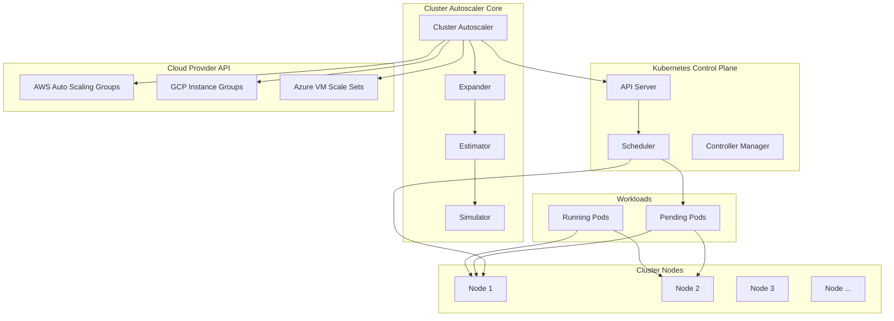

---
tags:
  - Kubernetes
  - Scaling
  - ClusterAutoscaler
  - Nodes
  - Infrastructure
---

# Cluster Autoscaler

## 실제 사례: Airbnb의 동적 인프라 혁명

2018년, Airbnb는 전 세계 400만 개 숙소를 관리하며 매일 200만 건의 예약 요청을 처리하고 있었습니다. 하지만 그들이 직면한 가장 큰 도전은 예측할 수 없는 트래픽 패턴이었습니다.

올림픽이나 월드컵 같은 대형 이벤트가 열리면, 특정 지역의 트래픽이 평소의 1000%까지 급증했습니다. 반대로 코로나19 초기처럼 갑작스러운 여행 제한이 생기면 트래픽이 90% 급감하기도 했습니다.

```bash
# 2018년 올림픽 기간 중 한국 리전의 급격한 부하 증가
$ kubectl top nodes
NAME                     CPU(cores)   CPU%   MEMORY(bytes)   MEMORY%
korea-node-1            7800m        97%    29Gi            95%
korea-node-2            7850m        98%    30Gi            97%
korea-node-3            7900m        98%    28Gi            92%

# 모든 노드가 포화 상태, 새로운 Pod들이 Pending...
$ kubectl get pods | grep Pending
search-service-xyz123     0/1     Pending   0          5m
booking-api-abc456        0/1     Pending   0          3m
recommendation-def789     0/1     Pending   0          8m
```

전통적인 접근방식이라면 이런 상황에 대비해 항상 최대 용량의 서버를 유지해야 했을 것입니다. 하지만 Airbnb는 Cluster Autoscaler를 도입하여 완전히 다른 접근을 했습니다:

-**비용 최적화**: 평소 운영 비용 60% 절감
-**탄력적 대응**: 트래픽 급증 시 15분 내 자동 확장
-**글로벌 효율성**: 시간대별 트래픽 패턴에 따른 자동 리소스 이동

결과적으로 Airbnb는 예측할 수 없는 글로벌 비즈니스의 도전을 기술적으로 극복했습니다.

## Cluster Autoscaler 아키텍처와 동작 원리

### 핵심 컴포넌트 구조

Cluster Autoscaler는 Kubernetes 클러스터의 노드를 동적으로 관리하는 시스템입니다:



### 1. Cluster Autoscaler 메인 컨트롤러

메인 컨트롤러는 클러스터 상태를 지속적으로 모니터링하고 스케일링 결정을 내립니다:

```python
class ClusterAutoscaler:
    def __init__(self):
        self.scan_interval = 10  # 10초마다 스캔
        self.scale_down_delay_after_add = 600  # 10분
        self.scale_down_delay_after_delete = 300  # 5분
        self.scale_down_utilization_threshold = 0.5  # 50%
        
    def run_autoscaling_loop(self):
        """메인 오토스케일링 루프"""
        while True:
            try:
                # 1. 클러스터 상태 수집
                cluster_state = self.gather_cluster_state()
                
                # 2. Pending Pod 확인
                pending_pods = self.get_pending_pods()
                
                # 3. 스케일 업 필요성 확인
                if pending_pods and self.should_scale_up(pending_pods):
                    self.perform_scale_up(pending_pods, cluster_state)
                
                # 4. 스케일 다운 필요성 확인
                elif self.should_scale_down(cluster_state):
                    self.perform_scale_down(cluster_state)
                
                # 5. 다음 스캔까지 대기
                time.sleep(self.scan_interval)
                
            except Exception as e:
                self.log_error(f"Autoscaling loop error: {e}")
                time.sleep(30)  # 에러 시 더 길게 대기
    
    def gather_cluster_state(self):
        """클러스터 상태 수집"""
        nodes = self.kubernetes_client.list_nodes()
        node_states = {}
        
        for node in nodes:
            # 노드별 리소스 사용률 계산
            pods_on_node = self.get_pods_on_node(node.name)
            resource_usage = self.calculate_resource_usage(pods_on_node)
            
            node_states[node.name] = {
                'allocatable': node.status.allocatable,
                'capacity': node.status.capacity,
                'usage': resource_usage,
                'utilization': self.calculate_utilization(resource_usage, 
                                                        node.status.allocatable),
                'ready': self.is_node_ready(node),
                'schedulable': not node.spec.unschedulable,
                'pods': pods_on_node,
                'age': time.time() - node.metadata.creation_timestamp.timestamp()
            }
        
        return {
            'nodes': node_states,
            'total_nodes': len(nodes),
            'ready_nodes': sum(1 for state in node_states.values() if state['ready']),
            'cluster_utilization': self.calculate_cluster_utilization(node_states)
        }
    
    def should_scale_up(self, pending_pods):
        """스케일 업 필요성 판단"""
        # Pending Pod가 10초 이상 대기 중인지 확인
        for pod in pending_pods:
            pending_duration = time.time() - pod.creation_timestamp.timestamp()
            if pending_duration > 10:
                # 리소스 부족으로 인한 Pending인지 확인
                if self.is_pending_due_to_resources(pod):
                    return True
        
        return False
    
    def should_scale_down(self, cluster_state):
        """스케일 다운 필요성 판단"""
        # 기본 조건 확인
        if not self.is_scale_down_enabled():
            return False
        
        if not self.has_passed_cooldown_period():
            return False
        
        # 활용도가 낮은 노드 찾기
        underutilized_nodes = []
        for node_name, state in cluster_state['nodes'].items():
            if (state['ready'] and 
                state['schedulable'] and
                state['utilization']['cpu'] < self.scale_down_utilization_threshold and
                state['utilization']['memory'] < self.scale_down_utilization_threshold):
                
                # 해당 노드의 Pod들을 다른 노드에 재배치 가능한지 확인
                if self.can_reschedule_pods(node_name, cluster_state):
                    underutilized_nodes.append(node_name)
        
        return len(underutilized_nodes) > 0
```

### 2. Estimator: 리소스 요구사항 분석

Estimator는 Pending Pod들이 필요로 하는 리소스를 분석합니다:

```python
class ResourceEstimator:
    def __init__(self):
        self.resource_buffer = 0.1  # 10% 버퍼
        
    def estimate_required_resources(self, pending_pods):
        """필요한 리소스 요구사항 계산"""
        total_requirements = {
            'cpu': 0,
            'memory': 0,
            'gpu': 0,
            'pods': 0
        }
        
        pod_groups = self.group_pods_by_requirements(pending_pods)
        
        for group in pod_groups:
            # 동일한 요구사항을 가진 Pod 그룹 처리
            pod_count = len(group['pods'])
            pod_requirements = group['requirements']
            
            # 노드 배치 시뮬레이션
            nodes_needed = self.simulate_pod_placement(pod_count, pod_requirements)
            
            # 총 리소스 요구사항 누적
            for node_req in nodes_needed:
                for resource, amount in node_req.items():
                    total_requirements[resource] += amount
        
        # 안전 버퍼 추가
        for resource in total_requirements:
            if resource != 'pods':
                total_requirements[resource] *= (1 + self.resource_buffer)
        
        return total_requirements
    
    def simulate_pod_placement(self, pod_count, pod_requirements):
        """Pod 배치 시뮬레이션"""
        nodes_needed = []
        remaining_pods = pod_count
        
        while remaining_pods > 0:
            # 가상 노드 생성
            virtual_node = self.create_virtual_node()
            
            # 이 노드에 배치 가능한 Pod 수 계산
            pods_per_node = self.calculate_pods_per_node(
                pod_requirements, virtual_node['allocatable'])
            
            actual_pods = min(pods_per_node, remaining_pods)
            
            # 노드별 총 리소스 요구사항
            node_requirements = {
                'cpu': pod_requirements['cpu'] * actual_pods,
                'memory': pod_requirements['memory'] * actual_pods,
                'pods': actual_pods
            }
            
            nodes_needed.append(node_requirements)
            remaining_pods -= actual_pods
        
        return nodes_needed
    
    def calculate_pods_per_node(self, pod_requirements, node_allocatable):
        """노드당 배치 가능한 Pod 수 계산"""
        constraints = []
        
        # CPU 제약
        if pod_requirements['cpu'] > 0:
            cpu_constraint = node_allocatable['cpu'] // pod_requirements['cpu']
            constraints.append(cpu_constraint)
        
        # 메모리 제약
        if pod_requirements['memory'] > 0:
            memory_constraint = node_allocatable['memory'] // pod_requirements['memory']
            constraints.append(memory_constraint)
        
        # Pod 수 제약 (기본적으로 노드당 110개)
        pod_constraint = node_allocatable.get('pods', 110)
        constraints.append(pod_constraint)
        
        # 가장 제한적인 제약이 실제 제한 요소
        return min(constraints) if constraints else 0
```

### 3. Expander: 노드 확장 전략

Expander는 여러 노드 그룹 중 어떤 것을 확장할지 결정합니다:

```python
class NodeGroupExpander:
    def __init__(self):
        self.expansion_strategies = [
            'random',
            'most-pods',
            'least-waste',
            'price',
            'priority'
        ]
        self.current_strategy = 'least-waste'
    
    def select_node_groups_for_expansion(self, node_groups, resource_requirements):
        """확장할 노드 그룹 선택"""
        if not node_groups:
            return []
        
        strategy_method = getattr(self, f"expand_by_{self.current_strategy.replace('-', '_')}")
        return strategy_method(node_groups, resource_requirements)
    
    def expand_by_least_waste(self, node_groups, requirements):
        """리소스 낭비를 최소화하는 전략"""
        scored_groups = []
        
        for group in node_groups:
            # 각 노드 그룹에 대해 낭비율 계산
            waste_score = self.calculate_waste_score(group, requirements)
            cost_score = self.calculate_cost_score(group)
            
            # 복합 점수 계산 (낭비율 70%, 비용 30%)
            total_score = waste_score * 0.7 + cost_score * 0.3
            
            scored_groups.append({
                'group': group,
                'score': total_score,
                'waste_score': waste_score,
                'cost_score': cost_score
            })
        
        # 점수 순으로 정렬 (낮을수록 좋음)
        scored_groups.sort(key=lambda x: x['score'])
        
        return [item['group'] for item in scored_groups]
    
    def calculate_waste_score(self, node_group, requirements):
        """리소스 낭비율 계산"""
        node_capacity = node_group['node_template']['allocatable']
        
        # 요구사항 대비 노드 용량의 낭비율
        cpu_waste = max(0, node_capacity['cpu'] - requirements['cpu']) / node_capacity['cpu']
        memory_waste = max(0, node_capacity['memory'] - requirements['memory']) / node_capacity['memory']
        
        # 가중 평균 (메모리 낭비가 더 비용에 민감)
        return cpu_waste * 0.4 + memory_waste * 0.6
    
    def calculate_cost_score(self, node_group):
        """비용 점수 계산"""
        instance_type = node_group['instance_type']
        
        # 실제 클라우드 프로바이더 가격 정보 조회
        hourly_cost = self.cloud_provider.get_instance_price(instance_type)
        
        # 정규화된 비용 점수 (0-1 사이)
        return min(hourly_cost / 10.0, 1.0)  # $10/hour를 최대값으로 정규화
    
    def expand_by_priority(self, node_groups, requirements):
        """우선순위 기반 전략"""
        prioritized_groups = []
        
        for group in node_groups:
            priority = group.get('priority', 0)
            
            # 우선순위별 그룹핑
            if priority not in [item['priority'] for item in prioritized_groups]:
                prioritized_groups.append({
                    'priority': priority,
                    'groups': []
                })
            
            # 해당 우선순위 그룹에 추가
            for item in prioritized_groups:
                if item['priority'] == priority:
                    item['groups'].append(group)
                    break
        
        # 우선순위 높은 순으로 정렬
        prioritized_groups.sort(key=lambda x: x['priority'], reverse=True)
        
        # 최고 우선순위 그룹 내에서 least-waste 적용
        if prioritized_groups:
            top_priority_groups = prioritized_groups[0]['groups']
            return self.expand_by_least_waste(top_priority_groups, requirements)
        
        return []
```

### 4. Simulator: 스케일링 시뮬레이션

Simulator는 실제 스케일링 전에 결과를 예측합니다:

```python
class ScalingSimulator:
    def __init__(self):
        self.simulation_timeout = 30  # 30초 시뮬레이션 제한
        
    def simulate_scale_up(self, pending_pods, node_groups, cluster_state):
        """스케일 업 시뮬레이션"""
        simulation_results = {}
        
        for group in node_groups:
            # 가상 클러스터 생성 (현재 상태 복사)
            virtual_cluster = self.create_virtual_cluster(cluster_state)
            
            # 새 노드 추가 시뮬레이션
            new_nodes_count = self.calculate_nodes_to_add(group, pending_pods)
            
            for _ in range(new_nodes_count):
                virtual_node = self.create_virtual_node(group)
                virtual_cluster.add_node(virtual_node)
            
            # Pod 배치 시뮬레이션
            placement_result = self.simulate_pod_placement(
                pending_pods, virtual_cluster)
            
            simulation_results[group['name']] = {
                'nodes_added': new_nodes_count,
                'pods_scheduled': placement_result['scheduled_pods'],
                'remaining_pending': placement_result['remaining_pods'],
                'resource_utilization': placement_result['utilization'],
                'estimated_cost': self.calculate_cost_increase(
                    group, new_nodes_count),
                'time_to_ready': self.estimate_node_ready_time(group)
            }
        
        return simulation_results
    
    def simulate_scale_down(self, node_to_remove, cluster_state):
        """스케일 다운 시뮬레이션"""
        # 가상 클러스터에서 노드 제거
        virtual_cluster = self.create_virtual_cluster(cluster_state)
        pods_to_reschedule = virtual_cluster.remove_node(node_to_remove)
        
        # Pod 재배치 시뮬레이션
        rescheduling_result = self.simulate_pod_rescheduling(
            pods_to_reschedule, virtual_cluster)
        
        return {
            'removable': rescheduling_result['all_rescheduled'],
            'pods_to_reschedule': len(pods_to_reschedule),
            'failed_reschedules': rescheduling_result['failed_pods'],
            'resource_impact': rescheduling_result['resource_impact'],
            'estimated_savings': self.calculate_cost_savings(node_to_remove)
        }
    
    def simulate_pod_placement(self, pods, virtual_cluster):
        """Pod 배치 시뮬레이션"""
        scheduled_pods = []
        remaining_pods = list(pods)
        
        for pod in list(remaining_pods):
            # 적합한 노드 찾기
            suitable_nodes = self.find_suitable_nodes(pod, virtual_cluster)
            
            if suitable_nodes:
                # 가장 적합한 노드 선택
                best_node = self.select_best_node(pod, suitable_nodes)
                
                # 가상 배치
                if virtual_cluster.schedule_pod(pod, best_node):
                    scheduled_pods.append(pod)
                    remaining_pods.remove(pod)
        
        return {
            'scheduled_pods': scheduled_pods,
            'remaining_pods': remaining_pods,
            'utilization': virtual_cluster.calculate_utilization()
        }
    
    def find_suitable_nodes(self, pod, virtual_cluster):
        """Pod 배치에 적합한 노드 찾기"""
        suitable_nodes = []
        
        for node in virtual_cluster.nodes:
            if self.can_schedule_pod(pod, node):
                # 노드 점수 계산
                score = self.calculate_node_score(pod, node)
                suitable_nodes.append({
                    'node': node,
                    'score': score
                })
        
        # 점수 순으로 정렬
        suitable_nodes.sort(key=lambda x: x['score'], reverse=True)
        
        return [item['node'] for item in suitable_nodes]
    
    def can_schedule_pod(self, pod, node):
        """Pod가 노드에 배치 가능한지 확인"""
        # 리소스 요구사항 확인
        if not self.has_sufficient_resources(pod, node):
            return False
        
        # Node Selector 확인
        if not self.matches_node_selector(pod, node):
            return False
        
        # Affinity/Anti-affinity 확인
        if not self.satisfies_affinity_rules(pod, node):
            return False
        
        # Taints/Tolerations 확인
        if not self.tolerates_taints(pod, node):
            return False
        
        return True
```

## 고급 스케일링 전략

### 1. 다중 노드 그룹 관리

```python
class MultiNodeGroupManager:
    def __init__(self):
        self.node_groups = {}
        self.scaling_policies = {}
    
    def configure_node_groups(self):
        """다양한 워크로드를 위한 노드 그룹 설정"""
        self.node_groups = {
            # 범용 워크로드
            'general-purpose': {
                'instance_types': ['c5.large', 'c5.xlarge', 'c5.2xlarge'],
                'min_size': 2,
                'max_size': 100,
                'desired_capacity': 5,
                'scaling_policy': 'balanced',
                'tags': {
                    'workload-type': 'general',
                    'cost-optimization': 'enabled'
                }
            },
            
            # 메모리 집약적 워크로드
            'memory-optimized': {
                'instance_types': ['r5.large', 'r5.xlarge', 'r5.2xlarge'],
                'min_size': 0,
                'max_size': 50,
                'desired_capacity': 0,
                'scaling_policy': 'memory-first',
                'node_selector': {
                    'workload-type': 'memory-intensive'
                }
            },
            
            # GPU 워크로드
            'gpu-nodes': {
                'instance_types': ['p3.2xlarge', 'p3.8xlarge'],
                'min_size': 0,
                'max_size': 10,
                'desired_capacity': 0,
                'scaling_policy': 'gpu-optimized',
                'taints': [{
                    'key': 'nvidia.com/gpu',
                    'value': 'true',
                    'effect': 'NoSchedule'
                }]
            },
            
            # 스팟 인스턴스 (비용 최적화)
            'spot-instances': {
                'instance_types': ['c5.large', 'm5.large', 'c4.large'],
                'min_size': 0,
                'max_size': 200,
                'desired_capacity': 10,
                'scaling_policy': 'cost-optimized',
                'spot_price': '0.05',  # 최대 스팟 가격
                'mixed_instances_policy': {
                    'on_demand_percentage': 20,
                    'spot_allocation_strategy': 'diversified'
                }
            }
        }
    
    def intelligent_node_selection(self, pending_pods):
        """Pod 특성에 따른 지능형 노드 그룹 선택"""
        node_group_assignments = {}
        
        for pod in pending_pods:
            # Pod의 특성 분석
            pod_profile = self.analyze_pod_profile(pod)
            
            # 적합한 노드 그룹 선택
            best_group = self.select_optimal_node_group(pod_profile)
            
            if best_group not in node_group_assignments:
                node_group_assignments[best_group] = []
            
            node_group_assignments[best_group].append(pod)
        
        return node_group_assignments
    
    def analyze_pod_profile(self, pod):
        """Pod 프로파일 분석"""
        profile = {
            'cpu_intensive': False,
            'memory_intensive': False,
            'gpu_required': False,
            'burstable': False,
            'cost_sensitive': False
        }
        
        # 리소스 요구사항 분석
        requests = pod.spec.containers[0].resources.requests
        
        if requests.get('cpu', 0) > 2000:  # 2 CPU 이상
            profile['cpu_intensive'] = True
        
        if requests.get('memory', 0) > 4 * 1024**3:  # 4GB 이상
            profile['memory_intensive'] = True
        
        if 'nvidia.com/gpu' in requests:
            profile['gpu_required'] = True
        
        # 애노테이션 기반 분석
        annotations = pod.metadata.annotations or {}
        
        if annotations.get('cost-optimization') == 'enabled':
            profile['cost_sensitive'] = True
        
        if annotations.get('workload-pattern') == 'burstable':
            profile['burstable'] = True
        
        return profile
    
    def select_optimal_node_group(self, pod_profile):
        """Pod 프로파일에 최적화된 노드 그룹 선택"""
        # GPU 필수 워크로드
        if pod_profile['gpu_required']:
            return 'gpu-nodes'
        
        # 메모리 집약적 워크로드
        elif pod_profile['memory_intensive']:
            return 'memory-optimized'
        
        # 비용 최적화 가능한 워크로드
        elif pod_profile['cost_sensitive'] and pod_profile['burstable']:
            return 'spot-instances'
        
        # 기본 워크로드
        else:
            return 'general-purpose'
```

### 2. 예측적 스케일링 (Predictive Scaling)

```python
class PredictiveScaler:
    def __init__(self):
        self.prediction_models = {}
        self.historical_data = {}
        
    def train_prediction_models(self, historical_metrics):
        """예측 모델 학습"""
        # 시계열 분석을 위한 특성 추출
        features = self.extract_time_series_features(historical_metrics)
        
        # 여러 예측 모델 학습
        self.prediction_models = {
            'linear_trend': self.train_linear_model(features),
            'seasonal': self.train_seasonal_model(features),
            'lstm': self.train_lstm_model(features),
            'ensemble': None  # 나중에 조합
        }
        
        # 모델 성능 평가 및 가중치 결정
        model_weights = self.evaluate_model_performance()
        
        # 앙상블 모델 생성
        self.prediction_models['ensemble'] = self.create_ensemble_model(
            self.prediction_models, model_weights)
    
    def predict_future_demand(self, prediction_horizon_minutes=30):
        """미래 리소스 수요 예측"""
        current_time = datetime.now()
        prediction_times = [
            current_time + timedelta(minutes=i*5) 
            for i in range(1, prediction_horizon_minutes//5 + 1)
        ]
        
        predictions = {}
        
        for time_point in prediction_times:
            # 시간적 특성 추출
            time_features = {
                'hour': time_point.hour,
                'day_of_week': time_point.weekday(),
                'day_of_month': time_point.day,
                'month': time_point.month,
                'is_weekend': time_point.weekday() >= 5,
                'is_business_hour': 9 <= time_point.hour <= 17
            }
            
            # 각 모델의 예측값
            ensemble_prediction = self.prediction_models['ensemble'].predict([time_features])
            
            predictions[time_point] = {
                'cpu_demand': ensemble_prediction[0],
                'memory_demand': ensemble_prediction[1],
                'pod_count_demand': ensemble_prediction[2],
                'confidence': ensemble_prediction[3]
            }
        
        return predictions
    
    def proactive_scaling(self, predictions):
        """예측 기반 사전 스케일링"""
        scaling_actions = []
        
        for time_point, prediction in predictions.items():
            # 현재 용량 대비 예측 수요
            current_capacity = self.get_current_cluster_capacity()
            
            cpu_ratio = prediction['cpu_demand'] / current_capacity['cpu']
            memory_ratio = prediction['memory_demand'] / current_capacity['memory']
            
            # 임계값 초과 시 사전 확장
            if (cpu_ratio > 0.8 or memory_ratio > 0.8) and prediction['confidence'] > 0.7:
                # 필요한 노드 수 계산
                nodes_needed = self.calculate_nodes_for_demand(prediction)
                
                scaling_actions.append({
                    'action': 'scale_up',
                    'time': time_point,
                    'nodes_needed': nodes_needed,
                    'reason': f"Predicted demand: CPU {cpu_ratio:.1%}, Memory {memory_ratio:.1%}",
                    'confidence': prediction['confidence']
                })
        
        return scaling_actions
    
    def adaptive_cooldown_management(self, cluster_state, recent_scaling_events):
        """적응적 쿨다운 관리"""
        # 최근 스케일링 이벤트 분석
        scaling_frequency = len([e for e in recent_scaling_events 
                               if e['timestamp'] > time.time() - 3600])  # 1시간 내
        
        # 클러스터 안정성 메트릭
        stability_score = self.calculate_cluster_stability(cluster_state)
        
        # 동적 쿨다운 시간 계산
        base_cooldown = 300  # 5분 기본
        
        if scaling_frequency > 5:  # 너무 빈번한 스케일링
            dynamic_cooldown = base_cooldown * 2
        elif stability_score > 0.9:  # 안정적인 클러스터
            dynamic_cooldown = base_cooldown * 0.5
        else:
            dynamic_cooldown = base_cooldown
        
        return {
            'scale_up_cooldown': dynamic_cooldown,
            'scale_down_cooldown': dynamic_cooldown * 1.5,  # 축소는 더 보수적
            'reason': f"Frequency: {scaling_frequency}, Stability: {stability_score:.2f}"
        }
```

## 실전 운영 최적화

### 1. 비용 최적화 전략

```python
class CostOptimizer:
    def __init__(self):
        self.spot_instance_savings = 0.7  # 70% 할인
        self.reserved_instance_savings = 0.4  # 40% 할인
        
    def implement_cost_optimization(self, cluster_config):
        """종합적 비용 최적화 구현"""
        optimizations = []
        
        # 1. 스팟 인스턴스 활용
        spot_optimization = self.optimize_spot_instances(cluster_config)
        optimizations.extend(spot_optimization)
        
        # 2. 인스턴스 타입 최적화
        instance_optimization = self.optimize_instance_types(cluster_config)
        optimizations.extend(instance_optimization)
        
        # 3. 스케줄 기반 스케일링
        schedule_optimization = self.implement_scheduled_scaling(cluster_config)
        optimizations.extend(schedule_optimization)
        
        return optimizations
    
    def optimize_spot_instances(self, cluster_config):
        """스팟 인스턴스 최적화"""
        optimizations = []
        
        # 스팟 인스턴스 적합성 분석
        workloads = self.analyze_workload_spot_suitability()
        
        for workload in workloads:
            if workload['spot_suitable']:
                optimization = {
                    'type': 'spot_instance_migration',
                    'target_workload': workload['name'],
                    'estimated_savings': workload['current_cost'] * self.spot_instance_savings,
                    'implementation': self.generate_spot_node_group_config(workload),
                    'risks': self.assess_spot_instance_risks(workload)
                }
                optimizations.append(optimization)
        
        return optimizations
    
    def generate_spot_node_group_config(self, workload):
        """스팟 인스턴스 노드 그룹 설정 생성"""
        return f"""
apiVersion: v1
kind: ConfigMap
metadata:
  name: {workload['name']}-spot-nodegroup
data:
  nodegroup.yaml: |
    apiVersion: eksctl.io/v1alpha5
    kind: ClusterConfig
    metadata:
      name: {cluster_config['cluster_name']}
    nodeGroups:
    - name: {workload['name']}-spot
      instanceTypes:
        - {workload['recommended_instance_types']}
      spot: true
      maxPrice: {workload['max_spot_price']}
      minSize: {workload['min_instances']}
      maxSize: {workload['max_instances']}
      desiredCapacity: {workload['desired_instances']}
      volumeSize: 50
      ssh:
        allow: false
      iam:
        withAddonPolicies:
          autoScaler: true
          cloudWatch: true
      labels:
        workload-type: {workload['type']}
        cost-optimization: spot
      taints:
        - key: spot-instance
          value: "true"
          effect: NoSchedule
        """
    
    def implement_scheduled_scaling(self, cluster_config):
        """스케줄 기반 스케일링 구현"""
        # 과거 트래픽 패턴 분석
        traffic_patterns = self.analyze_traffic_patterns()
        
        scaling_schedules = []
        
        for pattern in traffic_patterns:
            if pattern['predictable']:
                schedule = {
                    'name': f"{pattern['workload']}-scheduled-scaling",
                    'cron_scale_up': pattern['peak_start_cron'],
                    'cron_scale_down': pattern['peak_end_cron'],
                    'scale_up_size': pattern['peak_capacity'],
                    'scale_down_size': pattern['base_capacity'],
                    'implementation': f"""
apiVersion: batch/v1
kind: CronJob
metadata:
  name: {pattern['workload']}-scaleup
spec:
  schedule: "{pattern['peak_start_cron']}"
  jobTemplate:
    spec:
      template:
        spec:
          containers:
          - name: scaler
            image: kubectl:latest
            command:
            - /bin/sh
            - -c
            - |
              kubectl patch deployment {pattern['workload']} -p '{{"spec":{{"replicas":{pattern['peak_capacity']}}}}}'
              aws autoscaling set-desired-capacity --auto-scaling-group-name {pattern['node_group']} --desired-capacity {pattern['peak_nodes']}
          restartPolicy: OnFailure
                    """
                }
                scaling_schedules.append(schedule)
        
        return scaling_schedules
```

### 2. 안정성 및 신뢰성 향상

```python
class ReliabilityEnhancer:
    def __init__(self):
        self.health_check_interval = 60
        self.failure_threshold = 3
        
    def implement_reliability_features(self, cluster_config):
        """클러스터 안정성 기능 구현"""
        features = []
        
        # 1. 다중 AZ 분산
        multi_az_config = self.configure_multi_az_distribution()
        features.append(multi_az_config)
        
        # 2. 노드 헬스 체크
        health_check_config = self.configure_node_health_checks()
        features.append(health_check_config)
        
        # 3. Graceful 노드 종료
        graceful_termination = self.configure_graceful_node_termination()
        features.append(graceful_termination)
        
        return features
    
    def configure_multi_az_distribution(self):
        """다중 AZ 분산 설정"""
        return {
            'feature': 'multi_az_distribution',
            'config': '''
# Node Groups를 여러 AZ에 분산
nodeGroups:
- name: workers-1a
  availabilityZones: ["us-west-2a"]
  minSize: 1
  maxSize: 50
- name: workers-1b
  availabilityZones: ["us-west-2b"]
  minSize: 1
  maxSize: 50
- name: workers-1c
  availabilityZones: ["us-west-2c"]
  minSize: 1
  maxSize: 50

# Pod Anti-Affinity로 중요 서비스 분산
apiVersion: apps/v1
kind: Deployment
spec:
  template:
    spec:
      affinity:
        podAntiAffinity:
          requiredDuringSchedulingIgnoredDuringExecution:
          - labelSelector:
              matchExpressions:
              - key: app
                operator: In
                values:
                - critical-service
            topologyKey: topology.kubernetes.io/zone
            ''',
            'benefits': ['단일 AZ 장애 시 서비스 연속성', '로드 분산', '레이턴시 최적화']
        }
    
    def configure_node_health_checks(self):
        """노드 헬스 체크 설정"""
        return {
            'feature': 'advanced_health_checks',
            'config': '''
apiVersion: v1
kind: ConfigMap
metadata:
  name: cluster-autoscaler-status
  namespace: kube-system
data:
  nodes.max-total-unready-percentage: "33"
  nodes.max-graceful-termination-sec: "600"
  skip-nodes-with-system-pods: "false"
  
---
apiVersion: apps/v1
kind: DaemonSet
metadata:
  name: node-health-monitor
spec:
  template:
    spec:
      containers:
      - name: health-monitor
        image: node-health-monitor:latest
        env:
        - name: CHECK_INTERVAL
          value: "30"
        - name: FAILURE_THRESHOLD
          value: "3"
        volumeMounts:
        - name: proc
          mountPath: /host/proc
          readOnly: true
        - name: sys
          mountPath: /host/sys
          readOnly: true
      volumes:
      - name: proc
        hostPath:
          path: /proc
      - name: sys
        hostPath:
          path: /sys
            ''',
            'monitoring': ['CPU 과부하', '메모리 누수', '디스크 full', '네트워크 오류']
        }
```

## 문제해결 가이드

### 1. 스케일링 실패 진단

```bash
# Cluster Autoscaler 로그 확인
kubectl logs -n kube-system deployment/cluster-autoscaler

# 노드 상태 확인
kubectl describe nodes

# Pending Pod 분석
kubectl get pods --all-namespaces | grep Pending
kubectl describe pod <pending-pod-name>

# 오토스케일링 그룹 상태 (AWS)
aws autoscaling describe-auto-scaling-groups
aws ec2 describe-instances --filters "Name=tag:aws:autoscaling:groupName,Values=<asg-name>"
```

### 2. 일반적인 문제 해결책

```python
def troubleshoot_common_issues():
    """일반적인 Cluster Autoscaler 문제 해결"""
    troubleshooting_guide = {
        'pods_stuck_pending': {
            'symptoms': ['Pod가 오랫동안 Pending 상태', '새 노드가 생성되지 않음'],
            'causes': [
                'IAM 권한 부족',
                '인스턴스 한도 초과',
                '서브넷에 IP 부족',
                'Security Group 설정 오류'
            ],
            'solutions': [
                '클러스터 오토스케일러 IAM 정책 확인',
                'EC2 인스턴스 한도 증설 요청',
                '서브넷 CIDR 확장 또는 추가',
                'Security Group inbound/outbound 규칙 검토'
            ]
        },
        
        'nodes_not_scaling_down': {
            'symptoms': ['사용률이 낮은 노드가 제거되지 않음'],
            'causes': [
                'System Pod가 노드에 배치됨',
                'PodDisruptionBudget 제약',
                'Local storage를 사용하는 Pod',
                'scale-down-delay 시간 미경과'
            ],
            'solutions': [
                'System Pod에 적절한 toleration 설정',
                'PodDisruptionBudget 재검토',
                'Local storage 대신 PV 사용',
                'scale-down-delay 설정 조정'
            ]
        }
    }
    
    return troubleshooting_guide
```

Cluster Autoscaler는 Kubernetes에서 인프라의 탄력성을 제공하는 핵심 구성요소입니다. Airbnb의 사례처럼 적절한 설정과 모니터링을 통해 비용 효율성과 서비스 안정성을 동시에 달성할 수 있습니다.

성공적인 운영의 열쇠는 워크로드 패턴 이해, 점진적 롤아웃, 그리고 지속적인 최적화입니다.
