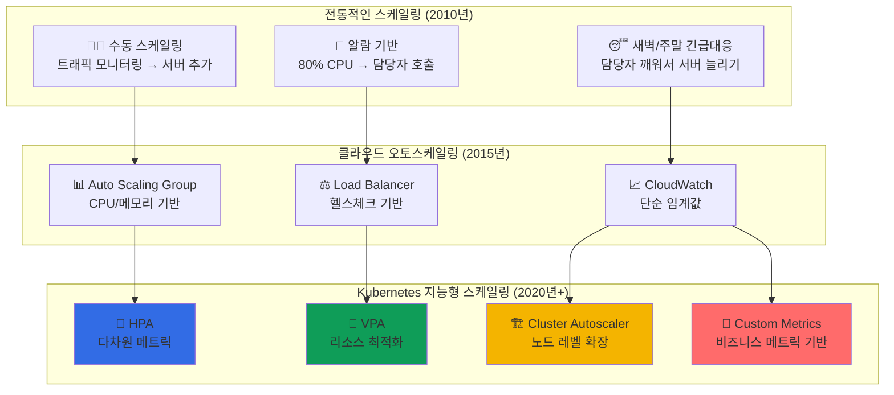

---
tags:
  - Kubernetes
  - Scaling
  - HPA
  - VPA
  - AutoScaling
---

# Kubernetes Scaling - 타겟이 블랙 프라이데이를 버틴 자동 확장의 과학 📈

## 이 섹션을 읽으면 답할 수 있는 질문들

- 타겟이 블랙 프라이데이 트래픽 급증을 어떻게 버텨냈을까?
- HPA와 VPA의 차이점과 언제 어떤 걸 써야 할까?
- 트래픽이 갑자기 10배 늘어나도 서비스가 안정적인 이유는?
- Cluster Autoscaler는 어떻게 노드까지 자동 확장하는가?
- Spotify는 어떻게 리소스를 50% 절약하면서 성능을 향상시켰을까?

## 시작하며: 탄력성의 예술

### 충격적인 현실: 트래픽은 예측불가능하다

현대 서비스들의 트래픽 패턴을 보면**"언제 어떤 규모로 급증할지 예측할 수 없다"**는 사실을 깨닫게 됩니다.

```python
# 타겟 2023년 블랙 프라이데이 실시간 트래픽
target_black_friday = {
    "normal_traffic": {
        "requests_per_second": "50,000",
        "active_users": "500,000",
        "pod_count": "1,000"
    },
    
    "peak_traffic": {
        "requests_per_second": "800,000",  # 16배 증가!
        "active_users": "8,000,000",       # 16배 증가!
        "pod_count": "needed: 16,000",     # 자동으로!
        "duration": "4시간 지속"
    },
    
    "kubernetes_magic": {
        "hpa_reaction_time": "< 30초",
        "pod_startup_time": "< 15초", 
        "cluster_autoscaler": "새 노드 추가 < 3분",
        "service_availability": "99.99%"  # 중단 없음!
    }
}

print("🤯 깨달음: Kubernetes는 블랙 프라이데이를 사람 개입 없이 자동으로 처리했다!")
```

### Scaling의 진화: 수동에서 지능형 자동화로



**핵심 통찰**: Kubernetes Scaling은**반응적(Reactive)**에서**예측적(Predictive)**으로,**단일 메트릭**에서**다차원 지능형 분석**으로 진화했습니다.

## Kubernetes Scaling 완벽 마스터 📚

### [1. HPA: 타겟의 블랙 프라이데이 오토스케일링](01-hpa.md)

**Horizontal Pod Autoscaler로 트래픽 급증 완벽 대응**

타겟이 어떻게 HPA를 통해 블랙 프라이데이 16배 트래픽 급증을 사람 개입 없이 자동으로 처리했는지, 메트릭 수집부터 스케일링 결정까지의 전체 과정을 탐험합니다.

🎯**핵심 내용**:

- CPU/메모리 기반 기본 스케일링
- Custom Metrics (QPS, 응답시간) 활용
- 스케일링 알고리즘과 Stabilization Window
- Multiple Metrics를 통한 지능형 판단

---

### [2. VPA: Spotify의 리소스 최적화 혁신](02-vpa.md)

**Vertical Pod Autoscaler로 50% 비용 절감 실현**

Spotify가 어떻게 VPA를 활용해 각 Pod의 최적 리소스를 자동으로 찾아 50% 비용 절감과 동시에 성능 향상을 달성했는지, VPA의 추천 엔진과 실제 적용 전략을 알아봅니다.

📏**핵심 내용**:

- VPA Recommender의 머신러닝 알고리즘
- UpdateMode: Off, Initial, Recreation, Auto
- Quality of Service 클래스별 최적화
- HPA와의 조합 전략

---

### [3. Cluster Autoscaler: 에어비앤비의 동적 인프라](03-cluster-autoscaler.md)

**노드 레벨 자동 확장으로 인프라 탄력성 극대화**

에어비앤비가 어떻게 Cluster Autoscaler를 통해 예약 급증 시 필요한 만큼만 노드를 추가하고, 한적한 시간에는 비용 절감을 위해 자동으로 축소하는지, 인프라 자동화의 완성형을 탐구합니다.

🏗️**핵심 내용**:

- Node Scaling 결정 알고리즘
- Pod Priority와 Preemption 메커니즘
- Node Group과 Mixed Instance Types
- Scale Down 최적화와 안전 장치

## Scaling 활용 시나리오 가이드 🎯

### 시나리오 1: CPU 기반 웹 애플리케이션 스케일링

```yaml
# 기본적인 CPU 기반 HPA 설정
apiVersion: autoscaling/v2
kind: HorizontalPodAutoscaler
metadata:
  name: web-app-hpa
spec:
  scaleTargetRef:
    apiVersion: apps/v1
    kind: Deployment
    name: web-app
  minReplicas: 3
  maxReplicas: 100
  metrics:
  - type: Resource
    resource:
      name: cpu
      target:
        type: Utilization
        averageUtilization: 70
  - type: Resource
    resource:
      name: memory
      target:
        type: Utilization
        averageUtilization: 80
  behavior:
    scaleUp:
      stabilizationWindowSeconds: 60
      policies:
      - type: Percent
        value: 100      # 한 번에 100% 증가 가능
        periodSeconds: 60
      - type: Pods
        value: 10       # 한 번에 최대 10개 Pod 추가
        periodSeconds: 60
      selectPolicy: Max
    scaleDown:
      stabilizationWindowSeconds: 300
      policies:
      - type: Percent
        value: 10       # 한 번에 10%만 감소
        periodSeconds: 60
      selectPolicy: Min
```

### 시나리오 2: Custom Metrics 기반 고급 스케일링

```yaml
# Prometheus 메트릭 기반 HPA
apiVersion: autoscaling/v2
kind: HorizontalPodAutoscaler
metadata:
  name: api-server-hpa
spec:
  scaleTargetRef:
    apiVersion: apps/v1
    kind: Deployment
    name: api-server
  minReplicas: 5
  maxReplicas: 200
  metrics:
  - type: Pods
    pods:
      metric:
        name: requests_per_second
      target:
        type: AverageValue
        averageValue: "1000"  # Pod당 1000 RPS 처리
  - type: Pods
    pods:
      metric:
        name: response_time_p95
      target:
        type: AverageValue
        averageValue: "200m"  # 95th percentile 200ms 이하
  - type: External
    external:
      metric:
        name: sqs_queue_length
        selector:
          matchLabels:
            queue: processing-queue
      target:
        type: AverageValue
        averageValue: "10"    # 큐에 메시지가 Pod당 10개 이하
```

### 시나리오 3: VPA를 통한 리소스 최적화

```yaml
# VPA로 자동 리소스 최적화
apiVersion: autoscaling.k8s.io/v1
kind: VerticalPodAutoscaler
metadata:
  name: backend-vpa
spec:
  targetRef:
    apiVersion: apps/v1
    kind: Deployment
    name: backend
  updatePolicy:
    updateMode: "Auto"  # 자동으로 Pod 재시작하며 적용
  resourcePolicy:
    containerPolicies:
    - containerName: backend
      minAllowed:
        cpu: 100m
        memory: 128Mi
      maxAllowed:
        cpu: 2
        memory: 4Gi
      controlledResources: ["cpu", "memory"]
      controlledValues: RequestsAndLimits
```

### 시나리오 4: 대규모 클러스터 오토스케일링

```python
class ClusterAutoscalingStrategy:
    """
    엔터프라이즈급 클러스터 오토스케일링 전략
    """
    
    def multi_zone_scaling(self):
        """
        다중 가용 영역 스케일링 전략
        """
        strategy = {
            "node_groups": [
                {
                    "name": "general-purpose",
                    "instance_types": ["m5.large", "m5.xlarge", "m5.2xlarge"],
                    "zones": ["us-east-1a", "us-east-1b", "us-east-1c"],
                    "scaling_policy": "balanced",
                    "spot_instances": "50%"
                },
                {
                    "name": "compute-optimized", 
                    "instance_types": ["c5.2xlarge", "c5.4xlarge"],
                    "zones": ["us-east-1a", "us-east-1b"],
                    "scaling_policy": "priority",
                    "spot_instances": "80%"
                },
                {
                    "name": "memory-optimized",
                    "instance_types": ["r5.xlarge", "r5.2xlarge"],
                    "zones": ["us-east-1a"],
                    "scaling_policy": "on-demand",
                    "spot_instances": "0%"
                }
            ]
        }
        
        return strategy
    
    def scaling_policies(self):
        """
        스케일링 정책과 안전 장치
        """
        policies = {
            "scale_up": {
                "trigger": "Pending Pod > 30초",
                "max_nodes_per_group": 50,
                "scale_up_delay": "10초",
                "max_scale_up_rate": "10 nodes/min"
            },
            
            "scale_down": {
                "trigger": "Node utilization < 50%",
                "grace_period": "10분",
                "max_empty_bulk_delete": 10,
                "skip_nodes_with_local_storage": True,
                "skip_nodes_with_system_pods": True
            },
            
            "cost_optimization": {
                "preferred_instance_types": ["t3", "t3a", "m5a"],
                "spot_instance_ratio": "70%",
                "scheduled_scaling": "업무 시간 예측 스케일링"
            }
        }
        
        return policies
```

## 고급 스케일링 패턴 💡

### Predictive Scaling

```python
class PredictiveScaling:
    """
    예측 기반 스케일링 패턴
    """
    
    def machine_learning_forecast(self):
        """
        ML 기반 트래픽 예측 스케일링
        """
        model = {
            "data_sources": [
                "과거 트래픽 패턴",
                "계절성 데이터",
                "비즈니스 이벤트 달력",
                "외부 지표 (날씨, 경제 등)"
            ],
            
            "prediction_algorithms": [
                "ARIMA (시계열 분석)",
                "LSTM (딥러닝)",
                "Random Forest (앙상블)",
                "Prophet (Facebook 알고리즘)"
            ],
            
            "scaling_actions": {
                "15분_전_예측": "Pod 수 조정",
                "1시간_전_예측": "Node 수 조정",
                "1일_전_예측": "Reserved Instance 구매"
            }
        }
        
        return model
    
    def event_driven_scaling(self):
        """
        이벤트 기반 사전 스케일링
        """
        events = {
            "marketing_campaign": {
                "trigger": "캠페인 시작 30분 전",
                "action": "트래픽 3배 대비 스케일 업",
                "duration": "캠페인 종료 + 1시간"
            },
            
            "flash_sale": {
                "trigger": "세일 시작 10분 전",
                "action": "최대 capacity로 스케일 업",
                "monitoring": "실시간 재고 연동"
            },
            
            "tv_advertisement": {
                "trigger": "방송 시작과 동시",
                "action": "점진적 스케일 업",
                "pattern": "방송 후 5분간 피크"
            }
        }
        
        return events
```

### Cost-Aware Scaling

```python
class CostAwareScaling:
    """
    비용 최적화 스케일링 전략
    """
    
    def spot_instance_strategy(self):
        """
        Spot Instance 활용 전략
        """
        strategy = {
            "diversification": {
                "instance_families": ["m5", "m5a", "m4", "c5", "c5a"],
                "availability_zones": "모든 AZ 활용",
                "spot_fleet": "자동 대체 인스턴스 선택"
            },
            
            "interruption_handling": {
                "grace_period": "120초",
                "pod_disruption_budget": "최소 70% 가용성",
                "graceful_shutdown": "요청 처리 완료 대기"
            },
            
            "cost_optimization": {
                "savings": "On-Demand 대비 70-90% 절약",
                "reliability": "Multi-AZ + 다양한 인스턴스 타입",
                "automation": "자동 재배치 및 복구"
            }
        }
        
        return strategy
    
    def right_sizing_automation(self):
        """
        자동 Right-Sizing 패턴
        """
        automation = {
            "monitoring_period": "2주간 리소스 사용량 분석",
            
            "optimization_rules": [
                "CPU 평균 사용률 < 20% → 다운사이즈",
                "Memory 평균 사용률 < 30% → 다운사이즈", 
                "CPU 피크 사용률 > 80% → 업사이즈",
                "OOMKilled 발생 → Memory 업사이즈"
            ],
            
            "safety_measures": [
                "단계적 적용 (10% → 50% → 100%)",
                "A/B 테스트로 성능 영향 검증",
                "자동 롤백 조건 설정"
            ],
            
            "expected_savings": "월 인프라 비용 30-50% 절감"
        }
        
        return automation
```

## Scaling 마스터 로드맵 🗺️

### 기초 (1주)

- [ ] CPU/메모리 기반 기본 HPA 구성
- [ ] kubectl top으로 리소스 사용량 모니터링
- [ ] 간단한 부하 테스트로 스케일링 동작 확인

### 중급 (1개월)

- [ ] Custom Metrics (Prometheus) 연동 HPA
- [ ] VPA 추천 모드로 리소스 최적화 분석
- [ ] Pod Disruption Budget과 안전한 스케일링

### 고급 (3개월)

- [ ] Cluster Autoscaler 멀티 노드 그룹 설정
- [ ] 복합 메트릭 기반 지능형 스케일링
- [ ] 비용 최적화와 성능의 균형점 찾기

### 전문가 (6개월+)

- [ ] 예측 기반 Proactive Scaling 구현
- [ ] Event-driven Scaling 자동화
- [ ] 대규모 클러스터 비용 최적화 마스터

## 실전 트러블슈팅 🔧

### 문제 1: HPA가 스케일링하지 않음

```python
hpa_troubleshooting = {
    "일반적인_원인": [
        "메트릭 수집 실패 (Metrics Server)",
        "Resource Requests 미설정",
        "타겟 메트릭값 도달하지 않음",
        "Stabilization Window 대기 중"
    ],
    
    "디버깅_명령어": [
        "kubectl describe hpa <hpa-name>",
        "kubectl top pods --selector=app=<app-name>",
        "kubectl get --raw /apis/metrics.k8s.io/v1beta1/pods",
        "kubectl logs -n kube-system -l k8s-app=metrics-server"
    ],
    
    "해결_방법": [
        "Metrics Server 정상 동작 확인",
        "모든 Container에 Resource Requests 설정",
        "메트릭 임계값 조정",
        "HPA 이벤트 로그 분석"
    ]
}
```

### 문제 2: 너무 빠른 스케일링으로 불안정

```python
scaling_stability_optimization = {
    "증상": [
        "Pod가 너무 빨리 생성/삭제됨",
        "리소스 낭비 (과도한 스케일 업)",
        "서비스 불안정 (잦은 Pod 재시작)"
    ],
    
    "최적화_방법": {
        "stabilization_window": {
            "scale_up": "60-120초",
            "scale_down": "300-600초", 
            "purpose": "메트릭 안정화 대기"
        },
        
        "scaling_policies": {
            "gradual_scale_up": "단계적 확장 (50% → 100%)",
            "conservative_scale_down": "보수적 축소 (10%)",
            "max_pods_per_operation": "한번에 최대 Pod 수 제한"
        }
    },
    
    "모니터링": [
        "scaling frequency 추적",
        "resource utilization 패턴",
        "application performance metrics"
    ]
}
```

## 성능 최적화 베스트 프랙티스 📊

### 스케일링 성능 메트릭

```python
scaling_performance_metrics = {
    "response_time": {
        "hpa_decision": "< 15초",
        "pod_startup": "< 30초",
        "service_ready": "< 45초",
        "total_scale_up": "< 1분"
    },
    
    "accuracy": {
        "prediction_accuracy": "> 85%",
        "over_provisioning": "< 20%",
        "under_provisioning": "< 5%",
        "cost_efficiency": "> 70% spot instances"
    },
    
    "stability": {
        "scaling_oscillation": "< 5%",
        "successful_scale_events": "> 95%",
        "service_availability": "> 99.9%"
    }
}
```

### 비용 최적화 전략

```python
cost_optimization_results = {
    "hpa_benefits": {
        "over_provisioning_reduction": "60%",
        "resource_utilization": "75% → 85%",
        "cost_savings": "$50K/month"
    },
    
    "vpa_benefits": {
        "resource_waste_elimination": "40%",
        "performance_improvement": "20%",
        "cost_savings": "$30K/month"
    },
    
    "cluster_autoscaler_benefits": {
        "infrastructure_cost_reduction": "50%",
        "spot_instance_utilization": "80%",
        "cost_savings": "$100K/month"
    }
}
```

## 마치며: Scaling은 탄력성의 과학

Kubernetes Scaling을 완전히 마스터하면,**예측 불가능한 트래픽 변화에도 서비스 품질을 유지하면서 비용을 최적화하는 자동화 시스템**을 구축할 수 있게 됩니다.

**Scaling이 가르쳐주는 교훈들**:

1. 📈**예측적 대응**: 과거 데이터와 패턴을 통해 미래 요구사항 예측
2. 🎯**다차원 최적화**: CPU, 메모리, 네트워크, 비즈니스 메트릭 종합 고려
3. 💰**비용 효율성**: 성능과 비용의 완벽한 균형점 자동 탐색
4. 🛡️**안정성 보장**: 급격한 변화 상황에서도 서비스 연속성 유지

이제 기본 HPA부터 시작해서 예측 기반 스케일링까지 완전히 마스터해보세요! 🚀

---

**다음 읽기**: [HPA: 타겟의 블랙 프라이데이 오토스케일링](01-hpa.md)
