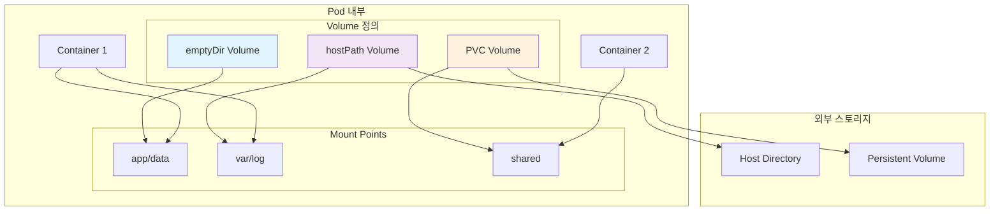

---
tags:
  - Kubernetes
  - Storage
  - Volume
  - PersistentVolume
---

# Kubernetes Volume 타입과 마운트

## 🎯 개요

2019년, Spotify의 엔지니어들이 겪은 가장 큰 악몽 중 하나는**음악 추천 알고리즘의 학습 데이터가 모두 사라진 사건**이었습니다. 수백만 사용자의 청취 패턴을 분석하던 Pod가 재시작되면서,**컨테이너 내부에만 저장되어 있던 중간 결과 데이터가 모두 증발**해버린 것입니다.

전통적인 가상 머신 환경에서는 디스크가 영구적으로 연결되어 있어서 이런 문제가 발생하지 않았지만,**컨테이너는 기본적으로 상태가 없는(stateless) 환경**입니다. Pod가 재시작되면 컨테이너 내부의 모든 데이터는 사라집니다.

바로 이런 문제를 해결하기 위해 Kubernetes Volume이 존재합니다.**데이터의 생명주기를 컨테이너의 생명주기와 분리**하여, Pod가 재시작되어도 중요한 데이터는 보존될 수 있도록 하는 것입니다.

## 📖 Volume의 기본 개념

### 컨테이너 vs Volume 생명주기

```python
class ContainerLifecycle:
    def __init__(self):
        self.container_data = {}  # 컨테이너 내부 데이터
        
    def container_restart(self):
        """컨테이너 재시작 시 데이터 소실"""
        print("Container restarting...")
        self.container_data = {}  # 모든 데이터 초기화!
        print("All container data lost!")
        
    def without_volume_example(self):
        """Volume 없는 상황의 문제점"""
        problems = [
            "Application logs disappear on restart",
            "Database data is lost",
            "Cached files need to be rebuilt",
            "User uploads are gone"
        ]
        return problems

class VolumeLifecycle:
    def __init__(self):
        self.volume_data = {"persistent": True}  # Volume 데이터는 지속됨
        
    def pod_restart_with_volume(self):
        """Volume이 있는 경우의 데이터 보존"""
        return {
            "container_data": "Lost (expected)",
            "volume_data": "Preserved!",
            "benefits": [
                "Database survives pod restarts",
                "Logs are continuously available", 
                "Shared data between containers",
                "Backup and recovery possible"
            ]
        }
```

### Volume vs Mount 개념



## 📁 Volume 타입 상세 분석

### 1. emptyDir - 임시 공유 스토리지

**가장 기본적인 Volume**으로, Pod 생성 시 빈 디렉토리로 시작됩니다.

```python
class EmptyDirVolume:
    def __init__(self):
        self.lifecycle = "Pod lifetime"
        self.sharing = "Between containers in same Pod"
        self.storage_medium = ["disk", "memory"]
        
    def use_cases(self):
        """EmptyDir 사용 사례"""
        return {
            "temporary_processing": {
                "description": "임시 파일 처리",
                "example": "이미지 변환, 로그 처리, 캐시 파일"
            },
            "inter_container_communication": {
                "description": "같은 Pod 내 컨테이너 간 데이터 공유",
                "example": "sidecar 패턴에서 로그 수집"
            },
            "scratch_space": {
                "description": "작업 공간",
                "example": "컴파일러 임시 파일, 압축 해제"
            }
        }
    
    def memory_backed_storage(self):
        """메모리 기반 emptyDir"""
        return {
            "configuration": {
                "medium": "Memory",
                "size_limit": "1Gi"
            },
            "performance": {
                "read_speed": "Very fast (RAM speed)",
                "write_speed": "Very fast (RAM speed)",
                "persistence": "Lost on pod restart"
            },
            "use_case": "High-speed temporary processing",
            "limitations": [
                "Uses node's memory",
                "Counts against container memory limits", 
                "Data lost on node reboot"
            ]
        }
    
    def yaml_example(self):
        """EmptyDir YAML 설정"""
        return {
            "disk_based": '''
volumes:
- name: scratch-volume
  emptyDir: {}
volumeMounts:
- name: scratch-volume
  mountPath: /tmp/scratch
''',
            "memory_based": '''
volumes:
- name: memory-volume
  emptyDir:
    medium: Memory
    sizeLimit: 1Gi
volumeMounts:
- name: memory-volume
  mountPath: /tmp/memory
'''
        }
```

### 2. hostPath - 호스트 디렉토리 마운트

**호스트 노드의 파일시스템을 Pod에 마운트**하는 방식입니다.

```python
class HostPathVolume:
    def __init__(self):
        self.security_risk = "High - direct host access"
        self.portability = "Low - node dependent"
        
    def path_types(self):
        """hostPath 타입별 동작"""
        return {
            "DirectoryOrCreate": {
                "behavior": "디렉토리가 없으면 생성 (권한: 0755)",
                "use_case": "로그 수집 디렉토리"
            },
            "Directory": {
                "behavior": "디렉토리가 존재해야 함",
                "use_case": "기존 설정 디렉토리 마운트"
            },
            "FileOrCreate": {
                "behavior": "파일이 없으면 생성",
                "use_case": "설정 파일"
            },
            "File": {
                "behavior": "파일이 존재해야 함",
                "use_case": "기존 인증서 파일"
            },
            "Socket": {
                "behavior": "Unix 소켓이 존재해야 함",
                "use_case": "Docker 소켓 (/var/run/docker.sock)"
            },
            "CharDevice": {
                "behavior": "문자 디바이스",
                "use_case": "GPU 디바이스 접근"
            },
            "BlockDevice": {
                "behavior": "블록 디바이스",
                "use_case": "Raw 디스크 접근"
            }
        }
    
    def security_considerations(self):
        """보안 고려사항"""
        return {
            "risks": [
                "Pod가 호스트 파일시스템에 직접 접근",
                "호스트 시스템 손상 가능성",
                "민감한 호스트 파일 노출",
                "컨테이너 탈출 벡터"
            ],
            "mitigations": [
                "readOnly 마운트 사용",
                "필요한 최소 경로만 마운트",
                "PodSecurityPolicy로 제한",
                "SELinux/AppArmor 사용"
            ],
            "safe_use_cases": [
                "/var/log (로그 수집)",
                "/etc/timezone (시간대)",
                "/etc/ssl/certs (CA 인증서)"
            ]
        }
    
    def common_patterns(self):
        """일반적인 사용 패턴"""
        return {
            "docker_socket_access": {
                "path": "/var/run/docker.sock",
                "type": "Socket", 
                "use_case": "Docker-in-Docker",
                "security_note": "매우 위험 - 컨테이너가 호스트 Docker에 접근"
            },
            "log_collection": {
                "path": "/var/log",
                "type": "DirectoryOrCreate",
                "use_case": "중앙 로그 수집",
                "mount_mode": "readOnly"
            },
            "timezone_sync": {
                "path": "/etc/localtime",
                "type": "File",
                "use_case": "컨테이너와 호스트 시간 동기화",
                "mount_mode": "readOnly"
            }
        }
```

### 3. configMap과 secret Volume

**Kubernetes 설정과 비밀 정보를 Volume으로 마운트**합니다.

```python
class ConfigMapSecretVolumes:
    def __init__(self):
        self.data_sources = ["ConfigMap", "Secret"]
        self.mount_modes = ["file", "directory"]
        
    def configmap_volume_implementation(self):
        """ConfigMap Volume 구현"""
        return {
            "data_projection": {
                "description": "ConfigMap 데이터를 파일로 투영",
                "mapping": "key → filename, value → file content"
            },
            "file_permissions": {
                "default": "0644",
                "customizable": "defaultMode field"
            },
            "update_behavior": {
                "automatic": "ConfigMap 변경 시 자동 업데이트",
                "delay": "kubelet sync period에 따라 지연",
                "atomic": "모든 파일이 동시에 업데이트"
            }
        }
    
    def secret_volume_security(self):
        """Secret Volume 보안 특성"""
        return {
            "storage_location": {
                "not_written_to_disk": "tmpfs에 메모리 저장",
                "encrypted_at_rest": "etcd에서 암호화",
                "transmission": "TLS로 전송"
            },
            "access_control": {
                "rbac": "ServiceAccount 기반 접근 제어",
                "namespace_isolation": "네임스페이스별 격리",
                "volume_projection": "필요한 키만 선택적 마운트"
            },
            "best_practices": [
                "최소 권한 원칙 적용",
                "불필요한 secret 마운트 방지", 
                "정기적인 rotation",
                "external secret management 고려"
            ]
        }
    
    def subpath_and_projection(self):
        """SubPath와 Projection 기능"""
        return {
            "subpath_usage": {
                "purpose": "Volume의 특정 파일/디렉토리만 마운트",
                "benefit": "기존 디렉토리 구조 보존",
                "example": {
                    "volumeMount": {
                        "name": "config-volume",
                        "mountPath": "/etc/nginx/nginx.conf",
                        "subPath": "nginx.conf"
                    }
                }
            },
            "projected_volume": {
                "purpose": "여러 소스를 하나의 Volume으로 통합",
                "sources": ["configMap", "secret", "downwardAPI", "serviceAccountToken"],
                "example": '''
volumes:
- name: combined-volume
  projected:
    sources:
    - configMap:
        name: app-config
    - secret:
        name: app-secrets
    - downwardAPI:
        items:
        - path: "labels"
          fieldRef:
            fieldPath: metadata.labels
'''
            }
        }
```

### 4. downwardAPI - Pod 메타데이터 접근

**Pod과 Container 정보를 파일로 노출**합니다.

```python
class DownwardAPIVolume:
    def __init__(self):
        self.available_fields = [
            "metadata.name", "metadata.namespace", 
            "metadata.labels", "metadata.annotations",
            "spec.nodeName", "spec.serviceAccountName",
            "status.hostIP", "status.podIP"
        ]
        
    def field_categories(self):
        """사용 가능한 필드 분류"""
        return {
            "pod_metadata": {
                "fields": [
                    "metadata.name", "metadata.namespace",
                    "metadata.uid", "metadata.labels['key']",
                    "metadata.annotations['key']"
                ],
                "use_cases": [
                    "서비스 디스커버리",
                    "로그에 Pod 정보 포함",
                    "설정 파일 템플릿화"
                ]
            },
            "pod_spec": {
                "fields": [
                    "spec.nodeName", "spec.serviceAccountName",
                    "spec.restartPolicy"
                ],
                "use_cases": [
                    "노드별 설정 조정",
                    "인증 정보 확인"
                ]
            },
            "pod_status": {
                "fields": [
                    "status.hostIP", "status.podIP", 
                    "status.phase"
                ],
                "use_cases": [
                    "네트워킹 설정",
                    "헬스체크 엔드포인트"
                ]
            },
            "container_resources": {
                "fields": [
                    "limits.cpu", "limits.memory",
                    "requests.cpu", "requests.memory"
                ],
                "use_cases": [
                    "자동 튜닝",
                    "리소스 모니터링"
                ]
            }
        }
    
    def practical_examples(self):
        """실용적인 사용 예시"""
        return {
            "service_registration": {
                "description": "서비스 레지스트리에 자동 등록",
                "files": {
                    "pod-info": '''
name: ${POD_NAME}
namespace: ${POD_NAMESPACE}  
ip: ${POD_IP}
node: ${NODE_NAME}
''',
                    "volume_config": '''
volumes:
- name: podinfo
  downwardAPI:
    items:
    - path: "pod-name"
      fieldRef:
        fieldPath: metadata.name
    - path: "pod-ip"
      fieldRef:
        fieldPath: status.podIP
'''
                }
            },
            "application_configuration": {
                "description": "애플리케이션별 동적 설정",
                "use_case": "레플리카별 고유 ID 생성",
                "implementation": '''
# Pod 이름을 사용한 고유 ID
volumes:
- name: app-config
  downwardAPI:
    items:
    - path: "instance-id"
      fieldRef:
        fieldPath: metadata.name
    - path: "labels"
      fieldRef:
        fieldPath: metadata.labels
'''
            }
        }
```

## 💾 클라우드 볼륨 통합

### AWS EBS Volume

```python
class AWSEBSVolume:
    def __init__(self):
        self.volume_types = ["gp3", "gp2", "io1", "io2", "st1", "sc1"]
        self.availability_zone_constraint = True
        
    def volume_types_comparison(self):
        """EBS 볼륨 타입 비교"""
        return {
            "gp3": {
                "description": "General Purpose SSD (최신)",
                "baseline_iops": 3000,
                "baseline_throughput": "125 MiB/s",
                "max_iops": 16000,
                "max_throughput": "1000 MiB/s",
                "cost": "가장 비용 효율적",
                "use_case": "대부분의 워크로드"
            },
            "gp2": {
                "description": "General Purpose SSD (레거시)",
                "baseline_iops": "100 IOPS per GB (min 100, max 16000)",
                "burst_performance": "Up to 3000 IOPS",
                "cost": "gp3보다 비쌈",
                "migration_recommendation": "gp3로 마이그레이션 권장"
            },
            "io1/io2": {
                "description": "Provisioned IOPS SSD",
                "max_iops": "io1: 64000, io2: 256000",
                "durability": "99.999%",
                "use_case": "고성능 데이터베이스",
                "cost": "높음"
            }
        }
    
    def csi_driver_implementation(self):
        """AWS EBS CSI 드라이버"""
        return {
            "installation": {
                "method": "EKS Add-on or Helm chart",
                "permissions": "IAM role for service account (IRSA)",
                "node_requirements": "Nitro-based instances recommended"
            },
            "dynamic_provisioning": {
                "storage_class": '''
apiVersion: storage.k8s.io/v1
kind: StorageClass
metadata:
  name: ebs-gp3
provisioner: ebs.csi.aws.com
parameters:
  type: gp3
  iops: "3000"
  throughput: "125"
  encrypted: "true"
  fsType: ext4
volumeBindingMode: WaitForFirstConsumer
allowVolumeExpansion: true
''',
                "features": [
                    "암호화 지원",
                    "볼륨 크기 확장",
                    "스냅샷 생성/복원",
                    "다중 AZ 가용성"
                ]
            }
        }
    
    def performance_optimization(self):
        """성능 최적화 가이드"""
        return {
            "instance_optimization": {
                "ebs_optimized": "EBS 최적화 인스턴스 사용",
                "placement_groups": "클러스터 배치 그룹으로 네트워크 성능 향상",
                "nitro_instances": "Nitro 기반 인스턴스 권장"
            },
            "volume_optimization": {
                "pre_warming": "새 볼륨 사용 전 전체 블록 읽기",
                "filesystem_choice": "ext4 vs xfs 성능 비교",
                "mount_options": "noatime, discard for SSD"
            },
            "monitoring_metrics": [
                "VolumeReadOps/VolumeWriteOps",
                "VolumeQueueLength", 
                "BurstBalance (gp2 only)",
                "VolumeThroughputPercentage"
            ]
        }
```

### Azure Disk Volume

```python
class AzureDiskVolume:
    def __init__(self):
        self.disk_types = ["Premium_LRS", "Standard_LRS", "StandardSSD_LRS", "UltraSSD_LRS"]
        self.availability_zone_support = True
        
    def disk_performance_tiers(self):
        """Azure Disk 성능 계층"""
        return {
            "Premium_LRS": {
                "description": "Premium SSD",
                "performance": "일관된 고성능",
                "durability": "99.999%",
                "use_case": "프로덕션 데이터베이스",
                "sizes": "4GB ~ 32TB"
            },
            "StandardSSD_LRS": {
                "description": "Standard SSD", 
                "performance": "일관된 중간 성능",
                "cost": "Premium보다 저렴",
                "use_case": "개발/테스트 환경"
            },
            "UltraSSD_LRS": {
                "description": "Ultra SSD",
                "performance": "최고 성능 (160,000 IOPS까지)",
                "latency": "Sub-millisecond",
                "use_case": "극고성능 요구사항"
            }
        }
    
    def csi_driver_features(self):
        """Azure Disk CSI 드라이버 기능"""
        return {
            "volume_expansion": {
                "online_expansion": True,
                "filesystem_resize": "자동",
                "limitations": "축소 불가능"
            },
            "snapshots": {
                "incremental_snapshots": True,
                "cross_region_copy": "지원",
                "restore_to_larger_disk": "가능"
            },
            "security": {
                "encryption_at_rest": "기본 제공",
                "customer_managed_keys": "지원",
                "disk_encryption_set": "고급 암호화"
            }
        }
```

### GCP Persistent Disk

```python
class GCPPersistentDisk:
    def __init__(self):
        self.disk_types = ["pd-standard", "pd-balanced", "pd-ssd", "pd-extreme"]
        self.regional_persistent_disk = True
        
    def disk_types_analysis(self):
        """GCP 디스크 타입 분석"""
        return {
            "pd-standard": {
                "description": "Standard persistent disk (HDD)",
                "cost": "가장 저렴",
                "performance": "디스크 크기에 따라 선형 증가",
                "use_case": "대용량 저빈도 액세스"
            },
            "pd-balanced": {
                "description": "Balanced persistent disk (SSD)",
                "cost": "중간",
                "performance": "가격 대비 최적의 성능",
                "recommended": "대부분의 워크로드"
            },
            "pd-ssd": {
                "description": "SSD persistent disk",
                "performance": "높은 IOPS",
                "use_case": "고성능 데이터베이스"
            },
            "pd-extreme": {
                "description": "Extreme persistent disk",
                "performance": "최고 성능 (100,000+ IOPS)",
                "provisioning": "IOPS를 독립적으로 프로비저닝"
            }
        }
    
    def regional_persistent_disk(self):
        """Regional Persistent Disk 특징"""
        return {
            "high_availability": {
                "replication": "동일 리전 내 2개 영역에 복제",
                "automatic_failover": "노드 장애 시 자동 전환",
                "durability": "99.999999999% (11 9's)"
            },
            "performance_impact": {
                "latency": "약간 증가 (복제로 인한)",
                "throughput": "single zone과 유사",
                "cost": "2배 (2개 영역 복제)"
            },
            "use_cases": [
                "고가용성 데이터베이스",
                "중요한 애플리케이션 데이터",
                "크로스 존 장애 대비"
            ]
        }
```

## 🔧 Volume 마운트 옵션과 최적화

### 파일시스템과 마운트 옵션

```python
class VolumeFilesystemOptimization:
    def __init__(self):
        self.supported_filesystems = ["ext4", "xfs", "btrfs", "ntfs"]
        
    def filesystem_comparison(self):
        """파일시스템 비교"""
        return {
            "ext4": {
                "maturity": "매우 안정적",
                "max_file_size": "16TB",
                "max_filesystem_size": "1EB",
                "features": ["journaling", "extents", "barriers"],
                "best_for": "일반적인 용도"
            },
            "xfs": {
                "maturity": "매우 안정적",
                "max_file_size": "8EB", 
                "max_filesystem_size": "8EB",
                "features": ["delayed allocation", "parallel I/O"],
                "best_for": "대용량 파일, 고성능 I/O"
            },
            "btrfs": {
                "maturity": "상대적으로 새로움",
                "features": ["copy-on-write", "snapshots", "compression"],
                "best_for": "스냅샷이 필요한 환경"
            }
        }
    
    def mount_options_optimization(self):
        """마운트 옵션 최적화"""
        return {
            "performance_options": {
                "noatime": {
                    "description": "액세스 시간 기록 비활성화",
                    "benefit": "I/O 성능 향상",
                    "use_case": "읽기 집약적 워크로드"
                },
                "nodiratime": {
                    "description": "디렉토리 액세스 시간 기록 비활성화", 
                    "benefit": "메타데이터 I/O 감소"
                },
                "discard": {
                    "description": "TRIM 명령 활성화",
                    "benefit": "SSD 성능 유지",
                    "requirement": "SSD 볼륨만"
                }
            },
            "reliability_options": {
                "barrier": {
                    "description": "쓰기 배리어 활성화",
                    "benefit": "데이터 무결성 보장",
                    "cost": "약간의 성능 저하"
                },
                "data=journal": {
                    "description": "데이터와 메타데이터 모두 저널링",
                    "benefit": "최고 수준 무결성",
                    "cost": "성능 저하"
                }
            }
        }
    
    def access_modes_explanation(self):
        """액세스 모드 설명"""
        return {
            "ReadWriteOnce": {
                "abbreviation": "RWO",
                "description": "단일 노드에서 읽기-쓰기 마운트",
                "use_case": "데이터베이스 볼륨",
                "limitation": "다른 노드에서 접근 불가"
            },
            "ReadOnlyMany": {
                "abbreviation": "ROX", 
                "description": "여러 노드에서 읽기 전용 마운트",
                "use_case": "설정 파일, 정적 콘텐츠",
                "sharing": "모든 노드에서 동시 접근 가능"
            },
            "ReadWriteMany": {
                "abbreviation": "RWX",
                "description": "여러 노드에서 읽기-쓰기 마운트",
                "use_case": "공유 스토리지",
                "support": "NFS, Ceph 등 분산 파일시스템만"
            },
            "ReadWriteOncePod": {
                "abbreviation": "RWOP",
                "description": "단일 Pod에서만 읽기-쓰기 마운트",
                "kubernetes_version": "1.22+",
                "benefit": "더 엄격한 액세스 제어"
            }
        }
```

## 🎯 실전 활용 패턴

### 1. 사이드카 패턴에서의 Volume 활용

```python
class SidecarVolumePatterns:
    def __init__(self):
        self.patterns = ["logging", "monitoring", "proxy", "security"]
        
    def logging_sidecar_example(self):
        """로깅 사이드카 패턴"""
        return {
            "architecture": {
                "main_container": "애플리케이션",
                "sidecar_container": "로그 수집기 (Fluentd, Filebeat)",
                "shared_volume": "로그 파일 공유"
            },
            "pod_spec": '''
apiVersion: v1
kind: Pod
metadata:
  name: app-with-logging
spec:
  containers:
  - name: app
    image: my-app:latest
    volumeMounts:
    - name: log-volume
      mountPath: /var/log/app
  - name: log-collector
    image: fluentd:latest
    volumeMounts:
    - name: log-volume
      mountPath: /var/log/app
      readOnly: true
  volumes:
  - name: log-volume
    emptyDir: {}
''',
            "benefits": [
                "애플리케이션 코드 변경 없음",
                "로그 처리 로직 분리",
                "다양한 로그 형식 지원"
            ]
        }
    
    def configuration_injection_pattern(self):
        """설정 주입 패턴"""
        return {
            "init_container_approach": '''
apiVersion: v1
kind: Pod
metadata:
  name: app-with-config
spec:
  initContainers:
  - name: config-generator
    image: config-builder:latest
    env:
    - name: ENVIRONMENT
      value: "production"
    volumeMounts:
    - name: config-volume
      mountPath: /generated-config
  containers:
  - name: app
    image: my-app:latest
    volumeMounts:
    - name: config-volume
      mountPath: /etc/app/config
  volumes:
  - name: config-volume
    emptyDir: {}
''',
            "use_cases": [
                "환경별 설정 파일 생성",
                "템플릿 기반 설정",
                "복잡한 설정 조합"
            ]
        }
```

### 2. 데이터 백업과 복원

```python
class VolumeBackupRestore:
    def __init__(self):
        self.backup_methods = ["snapshots", "rsync", "tar", "database_dumps"]
        
    def snapshot_based_backup(self):
        """스냅샷 기반 백업"""
        return {
            "kubernetes_volume_snapshots": {
                "crd": "VolumeSnapshot",
                "driver_support": "CSI 드라이버 필요",
                "example": '''
apiVersion: snapshot.storage.k8s.io/v1
kind: VolumeSnapshot
metadata:
  name: mysql-snapshot
spec:
  volumeSnapshotClassName: csi-snapshotter
  source:
    persistentVolumeClaimName: mysql-pvc
''',
                "benefits": [
                    "애플리케이션 일시정지 없이 백업",
                    "빠른 복원",
                    "클라우드 네이티브 백업"
                ]
            },
            "restore_process": '''
apiVersion: v1
kind: PersistentVolumeClaim
metadata:
  name: mysql-restore-pvc
spec:
  dataSource:
    name: mysql-snapshot
    kind: VolumeSnapshot
    apiGroup: snapshot.storage.k8s.io
  accessModes:
  - ReadWriteOnce
  resources:
    requests:
      storage: 10Gi
'''
        }
    
    def backup_automation(self):
        """백업 자동화"""
        return {
            "cronjob_backup": '''
apiVersion: batch/v1
kind: CronJob
metadata:
  name: volume-backup
spec:
  schedule: "0 2 * * *"  # 매일 오전 2시
  jobTemplate:
    spec:
      template:
        spec:
          containers:
          - name: backup
            image: backup-tool:latest
            env:
            - name: BACKUP_TARGET
              value: "s3://backup-bucket/volumes/"
            volumeMounts:
            - name: data-volume
              mountPath: /data
              readOnly: true
          volumes:
          - name: data-volume
            persistentVolumeClaim:
              claimName: app-data-pvc
          restartPolicy: OnFailure
''',
            "monitoring": [
                "백업 성공/실패 알림",
                "백업 크기 모니터링", 
                "복원 테스트 자동화"
            ]
        }
```

### 3. 성능 모니터링과 최적화

```python
class VolumePerformanceMonitoring:
    def __init__(self):
        self.metrics_sources = ["node-exporter", "csi-driver", "application"]
        
    def key_performance_metrics(self):
        """주요 성능 메트릭"""
        return {
            "iops_metrics": {
                "reads_per_second": "node_disk_reads_completed_total",
                "writes_per_second": "node_disk_writes_completed_total", 
                "read_latency": "node_disk_read_time_seconds_total",
                "write_latency": "node_disk_write_time_seconds_total"
            },
            "throughput_metrics": {
                "read_bytes": "node_disk_read_bytes_total",
                "written_bytes": "node_disk_written_bytes_total",
                "io_queue_depth": "node_disk_io_now"
            },
            "utilization_metrics": {
                "disk_usage": "node_filesystem_avail_bytes",
                "inode_usage": "node_filesystem_files_free",
                "io_utilization": "node_disk_io_time_seconds_total"
            }
        }
    
    def performance_alerting_rules(self):
        """성능 알림 규칙"""
        return {
            "high_latency_alert": '''
- alert: HighDiskLatency
  expr: |
    (
      rate(node_disk_read_time_seconds_total[5m]) / 
      rate(node_disk_reads_completed_total[5m])
    ) > 0.1
  for: 5m
  labels:
    severity: warning
  annotations:
    summary: "High disk read latency on {{ $labels.instance }}"
    description: "Disk {{ $labels.device }} has read latency > 100ms"
''',
            "disk_space_alert": '''
- alert: DiskSpaceUsage
  expr: |
    (
      node_filesystem_size_bytes - node_filesystem_free_bytes
    ) / node_filesystem_size_bytes > 0.8
  for: 2m
  labels:
    severity: warning
  annotations:
    summary: "High disk usage on {{ $labels.instance }}"
    description: "Disk usage is above 80%"
'''
        }
    
    def optimization_strategies(self):
        """최적화 전략"""
        return {
            "io_scheduling": {
                "scheduler_types": ["noop", "deadline", "cfq", "bfq"],
                "ssd_recommendation": "noop or deadline",
                "hdd_recommendation": "cfq or deadline"
            },
            "caching_strategies": {
                "page_cache_tuning": "/proc/sys/vm/dirty_*",
                "application_caching": "애플리케이션 레벨 캐시",
                "ssd_caching": "bcache, dm-cache"
            },
            "workload_separation": {
                "io_classes": "ionice를 사용한 I/O 우선순위",
                "cgroup_io_control": "블록 I/O 제어",
                "numa_awareness": "NUMA 노드별 최적화"
            }
        }
```

## 🛠️ 실습 및 검증

### Volume 테스트 스크립트

```bash
#!/bin/bash

echo "=== Kubernetes Volume Testing ==="

# 1. emptyDir Volume 테스트
test_emptydir_volume() {
    echo "Testing emptyDir volume..."
    
    cat <<EOF | kubectl apply -f -
apiVersion: v1
kind: Pod
metadata:
  name: emptydir-test
spec:
  containers:
  - name: writer
    image: busybox
    command: ['sh', '-c', 'echo "Hello from writer" > /shared/message && sleep 3600']
    volumeMounts:
    - name: shared-storage
      mountPath: /shared
  - name: reader
    image: busybox  
    command: ['sh', '-c', 'sleep 10 && cat /shared/message && sleep 3600']
    volumeMounts:
    - name: shared-storage
      mountPath: /shared
  volumes:
  - name: shared-storage
    emptyDir: {}
EOF

    # Pod 상태 확인
    kubectl wait --for=condition=ready pod/emptydir-test --timeout=60s
    
    # 데이터 공유 확인
    sleep 15
    kubectl logs emptydir-test -c reader
}

# 2. hostPath Volume 테스트
test_hostpath_volume() {
    echo "Testing hostPath volume..."
    
    # 호스트에 테스트 디렉토리 생성
    kubectl debug node/$(kubectl get nodes -o jsonpath='{.items[0].metadata.name}') -it --image=busybox -- mkdir -p /tmp/hostpath-test
    
    cat <<EOF | kubectl apply -f -
apiVersion: v1
kind: Pod
metadata:
  name: hostpath-test
spec:
  containers:
  - name: app
    image: busybox
    command: ['sh', '-c', 'ls -la /host-data && sleep 3600']
    volumeMounts:
    - name: host-storage
      mountPath: /host-data
  volumes:
  - name: host-storage
    hostPath:
      path: /tmp/hostpath-test
      type: DirectoryOrCreate
EOF

    kubectl wait --for=condition=ready pod/hostpath-test --timeout=60s
    kubectl logs hostpath-test
}

# 3. ConfigMap Volume 테스트
test_configmap_volume() {
    echo "Testing ConfigMap volume..."
    
    # ConfigMap 생성
    kubectl create configmap app-config --from-literal=database.host=mysql.example.com --from-literal=database.port=3306
    
    cat <<EOF | kubectl apply -f -
apiVersion: v1
kind: Pod
metadata:
  name: configmap-test
spec:
  containers:
  - name: app
    image: busybox
    command: ['sh', '-c', 'ls -la /config && cat /config/database.host && sleep 3600']
    volumeMounts:
    - name: config-volume
      mountPath: /config
  volumes:
  - name: config-volume
    configMap:
      name: app-config
EOF

    kubectl wait --for=condition=ready pod/configmap-test --timeout=60s
    kubectl logs configmap-test
}

# 4. Volume 성능 테스트
test_volume_performance() {
    echo "Testing volume performance..."
    
    cat <<EOF | kubectl apply -f -
apiVersion: v1
kind: Pod
metadata:
  name: volume-perf-test
spec:
  containers:
  - name: perf-test
    image: busybox
    command: ['sh', '-c', '
      echo "=== Write Performance Test ===" &&
      time dd if=/dev/zero of=/data/testfile bs=1M count=100 &&
      echo "=== Read Performance Test ===" &&
      time dd if=/data/testfile of=/dev/null bs=1M &&
      echo "=== Random I/O Test ===" &&
      for i in $(seq 1 1000); do
        dd if=/dev/urandom of=/data/random_$i bs=4k count=1 2>/dev/null
      done &&
      echo "Created 1000 random files" &&
      sleep 3600
    ']
    volumeMounts:
    - name: test-storage
      mountPath: /data
  volumes:
  - name: test-storage
    emptyDir: {}
EOF

    kubectl wait --for=condition=ready pod/volume-perf-test --timeout=60s
    kubectl logs volume-perf-test
}

# 메뉴 선택
case "$1" in
    emptydir)
        test_emptydir_volume
        ;;
    hostpath)
        test_hostpath_volume
        ;;
    configmap)
        test_configmap_volume
        ;;
    performance)
        test_volume_performance
        ;;
    all)
        test_emptydir_volume
        test_hostpath_volume  
        test_configmap_volume
        test_volume_performance
        ;;
    *)
        echo "Usage: $0 {emptydir|hostpath|configmap|performance|all}"
        exit 1
        ;;
esac
```

## 🔍 트러블슈팅 가이드

### 일반적인 Volume 문제

```python
class VolumeTroubleshooting:
    def __init__(self):
        self.common_issues = {}
        
    def mount_failures(self):
        """마운트 실패 문제"""
        return {
            "permission_denied": {
                "symptoms": ["Permission denied errors", "Pod CrashLoopBackOff"],
                "causes": [
                    "컨테이너가 root가 아닌 사용자로 실행",
                    "Volume 권한이 적절하지 않음",
                    "SELinux/AppArmor 정책 충돌"
                ],
                "solutions": [
                    "SecurityContext에서 runAsUser 설정",
                    "fsGroup으로 그룹 권한 설정", 
                    "initContainer로 권한 변경"
                ]
            },
            "volume_not_found": {
                "symptoms": ["Volume not found", "Pod Pending 상태"],
                "causes": [
                    "PVC가 Bound 상태가 아님",
                    "StorageClass 문제",
                    "가용 영역 불일치"
                ],
                "solutions": [
                    "kubectl describe pvc로 상태 확인",
                    "kubectl get events로 오류 확인",
                    "노드와 볼륨의 가용 영역 확인"
                ]
            }
        }
    
    def performance_issues(self):
        """성능 문제 진단"""
        return {
            "slow_io": {
                "diagnosis_commands": [
                    "kubectl top pods --containers",
                    "kubectl exec pod -- iostat -x 1",
                    "kubectl exec pod -- iotop"
                ],
                "common_causes": [
                    "부적절한 볼륨 타입 선택",
                    "파일시스템 단편화",
                    "동시 I/O 경합"
                ],
                "optimization_tips": [
                    "볼륨 타입 업그레이드 (gp2 → gp3)",
                    "I/O 스케줄러 튜닝",
                    "애플리케이션 I/O 패턴 최적화"
                ]
            }
        }
```

이처럼 Kubernetes Volume은**컨테이너의 임시적 특성을 극복하고 데이터 지속성을 제공하는 핵심 메커니즘**입니다. emptyDir부터 클라우드 네이티브 스토리지까지, 다양한 Volume 타입을 적절히 선택하고 최적화하는 것이 안정적인 애플리케이션 운영의 기반이 됩니다.

다음 문서에서는**PersistentVolume과 PersistentVolumeClaim의 바인딩 메커니즘**을 통해 더욱 체계적인 스토리지 관리 방법을 살펴보겠습니다.
