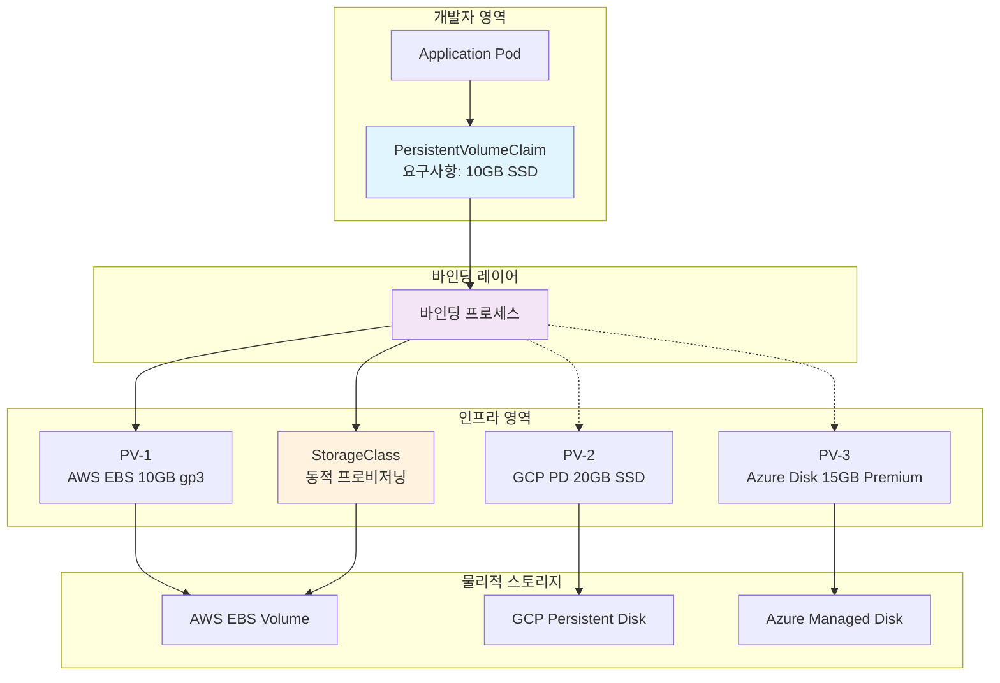

---
tags:
  - Kubernetes
  - PersistentVolume
  - PVC
  - StorageClass
  - Dynamic Provisioning
---

# PersistentVolume과 PVC 바인딩

## 🎯 개요

2020년, Uber가 마이크로서비스 아키텍처로 전환하면서 겪은 가장 큰 운영 이슈 중 하나는**스토리지 관리의 복잡성**이었습니다. 수천 개의 서비스마다 각기 다른 스토리지 요구사항이 있었고, 개발팀은**"10GB SSD 스토리지가 필요해"**라고 요청할 뿐, 실제 어떤 클라우드 디스크를 어떻게 프로비저닝해야 하는지 알 필요가 없었습니다.

바로 이런**스토리지 추상화**를 가능하게 한 것이 Kubernetes의 PersistentVolume(PV)과 PersistentVolumeClaim(PVC) 시스템입니다. 개발자는 "용량과 성능"만 요청하고, 플랫폼팀은 "실제 스토리지 인프라"를 관리하는**관심사의 분리**를 실현한 것입니다.

이는 마치**호텔 예약 시스템**과 같습니다. 투숙객은 "금연실, 킹베드, 시티뷰"만 요청하고, 호텔은 적절한 객실을 배정합니다. PVC는 스토리지 요구사항이고, PV는 실제 스토리지 자원인 셈입니다.

## 📖 PV/PVC 아키텍처 이해

### 개념적 분리와 역할



### 생명주기와 상태 관리

```python
class PVCLifecycleManager:
    def __init__(self):
        self.pvc_phases = ["Pending", "Bound", "Lost"]
        self.pv_phases = ["Available", "Bound", "Released", "Failed"]
        
    def pvc_lifecycle_states(self):
        """PVC 생명주기 상태"""
        return {
            "Pending": {
                "description": "적절한 PV를 찾는 중",
                "duration": "StorageClass 설정에 따라 다름",
                "next_state": "Bound or timeout",
                "troubleshooting": [
                    "kubectl describe pvc <name>",
                    "적절한 PV가 있는지 확인",
                    "StorageClass 설정 검토"
                ]
            },
            "Bound": {
                "description": "PV와 바인딩 완료",
                "characteristics": "Pod에서 사용 가능한 상태",
                "persistence": "PVC 삭제 전까지 유지"
            },
            "Lost": {
                "description": "바인딩된 PV를 찾을 수 없음",
                "causes": [
                    "PV가 수동으로 삭제됨",
                    "백엔드 스토리지 오류",
                    "클러스터 문제"
                ],
                "recovery": "새 PVC 생성 필요"
            }
        }
    
    def pv_lifecycle_states(self):
        """PV 생명주기 상태"""
        return {
            "Available": {
                "description": "사용 가능한 상태",
                "binding": "PVC 바인딩 대기 중",
                "automatic_binding": "매칭되는 PVC 있으면 자동 바인딩"
            },
            "Bound": {
                "description": "PVC에 바인딩된 상태",
                "exclusivity": "해당 PVC만 사용 가능",
                "data_protection": "PVC가 존재하는 한 보호됨"
            },
            "Released": {
                "description": "PVC는 삭제되었으나 데이터 정리 대기",
                "reclaim_policy_impact": {
                    "Retain": "관리자 수동 정리 필요",
                    "Delete": "자동 삭제 진행",
                    "Recycle": "데이터 삭제 후 재사용 (deprecated)"
                }
            },
            "Failed": {
                "description": "자동 회수 실패",
                "causes": ["백엔드 스토리지 오류", "권한 문제"],
                "manual_intervention": "관리자 개입 필요"
            }
        }
    
    def binding_algorithm(self, pvc_spec, available_pvs):
        """PVC-PV 바인딩 알고리즘"""
        matching_pvs = []
        
        for pv in available_pvs:
            # 1. 용량 확인
            if pv.capacity < pvc_spec.requested_storage:
                continue
                
            # 2. 액세스 모드 확인  
            if not self.access_modes_compatible(pvc_spec.access_modes, pv.access_modes):
                continue
                
            # 3. StorageClass 확인
            if pvc_spec.storage_class != pv.storage_class:
                continue
                
            # 4. 노드 어피니티 확인
            if not self.node_affinity_compatible(pvc_spec, pv):
                continue
                
            matching_pvs.append(pv)
        
        # 최적 매칭 선택 (가장 작은 용량 우선)
        if matching_pvs:
            return min(matching_pvs, key=lambda pv: pv.capacity)
            
        return None
    
    def access_modes_compatible(self, pvc_modes, pv_modes):
        """액세스 모드 호환성 확인"""
        return all(mode in pv_modes for mode in pvc_modes)
```

## 🔧 정적 vs 동적 프로비저닝

### 정적 프로비저닝 (Static Provisioning)

```python
class StaticProvisioning:
    def __init__(self):
        self.workflow = "Admin creates PV → User creates PVC → Binding"
        
    def manual_pv_creation_example(self):
        """수동 PV 생성 예시"""
        return {
            "aws_ebs_example": '''
apiVersion: v1
kind: PersistentVolume
metadata:
  name: mysql-pv-1
  labels:
    environment: production
    tier: database
spec:
  capacity:
    storage: 20Gi
  accessModes:
    - ReadWriteOnce
  persistentVolumeReclaimPolicy: Retain
  storageClassName: manual
  awsElasticBlockStore:
    volumeID: vol-1234567890abcdef0
    fsType: ext4
  nodeAffinity:
    required:
      nodeSelectorTerms:
      - matchExpressions:
        - key: topology.kubernetes.io/zone
          operator: In
          values:
          - us-west-2a
''',
            "nfs_example": '''
apiVersion: v1
kind: PersistentVolume
metadata:
  name: shared-storage-pv
spec:
  capacity:
    storage: 100Gi
  accessModes:
    - ReadWriteMany
  persistentVolumeReclaimPolicy: Retain
  nfs:
    path: /exported/path
    server: nfs-server.example.com
  mountOptions:
    - hard
    - nfsvers=4.1
    - proto=tcp
    - timeo=600
'''
        }
    
    def advantages_disadvantages(self):
        """정적 프로비저닝 장단점"""
        return {
            "advantages": [
                "관리자가 스토리지 리소스 완전 제어",
                "성능 특성 사전 검증 가능", 
                "비용 예측 가능",
                "보안 정책 사전 적용"
            ],
            "disadvantages": [
                "사전 용량 계획 필요",
                "리소스 낭비 가능성",
                "확장성 제한",
                "운영 오버헤드 증가"
            ],
            "best_use_cases": [
                "엄격한 보안 요구사항",
                "특수한 스토리지 설정 필요",
                "레거시 시스템 통합",
                "비용 통제가 중요한 환경"
            ]
        }

class StaticProvisioningPatterns:
    def __init__(self):
        self.patterns = {}
    
    def database_storage_pattern(self):
        """데이터베이스 전용 스토리지 패턴"""
        return {
            "high_performance_setup": '''
# PostgreSQL 전용 고성능 PV
apiVersion: v1
kind: PersistentVolume
metadata:
  name: postgres-data-pv
  labels:
    database: postgresql
    performance: high
spec:
  capacity:
    storage: 500Gi
  accessModes:
    - ReadWriteOnce
  persistentVolumeReclaimPolicy: Retain
  storageClassName: postgres-ssd
  awsElasticBlockStore:
    volumeID: vol-postgres-primary
    fsType: ext4
  nodeAffinity:
    required:
      nodeSelectorTerms:
      - matchExpressions:
        - key: node-role.kubernetes.io/database
          operator: In
          values: ["true"]
''',
            "matching_pvc": '''
apiVersion: v1
kind: PersistentVolumeClaim
metadata:
  name: postgres-data-pvc
  labels:
    app: postgresql
spec:
  accessModes:
    - ReadWriteOnce
  storageClassName: postgres-ssd
  resources:
    requests:
      storage: 500Gi
  selector:
    matchLabels:
      database: postgresql
      performance: high
'''
        }
```

### 동적 프로비저닝 (Dynamic Provisioning)

```python
class DynamicProvisioning:
    def __init__(self):
        self.workflow = "User creates PVC → StorageClass provisions PV → Binding"
        
    def storage_class_implementation(self):
        """StorageClass 구현 상세"""
        return {
            "aws_ebs_storageclass": '''
apiVersion: storage.k8s.io/v1
kind: StorageClass
metadata:
  name: fast-ssd
  annotations:
    storageclass.kubernetes.io/is-default-class: "true"
provisioner: ebs.csi.aws.com
parameters:
  type: gp3
  iops: "3000"
  throughput: "125"
  encrypted: "true"
  fsType: ext4
  # 추가 보안 설정
  kmsKeyId: arn:aws:kms:us-west-2:123456789012:key/12345678-1234
volumeBindingMode: WaitForFirstConsumer
allowVolumeExpansion: true
reclaimPolicy: Delete
''',
            "azure_disk_storageclass": '''
apiVersion: storage.k8s.io/v1
kind: StorageClass
metadata:
  name: azure-premium-ssd
provisioner: disk.csi.azure.com
parameters:
  storageaccounttype: Premium_LRS
  kind: Managed
  cachingmode: ReadOnly
  diskEncryptionSetID: /subscriptions/.../diskEncryptionSets/myDES
volumeBindingMode: Immediate
allowVolumeExpansion: true
''',
            "gcp_pd_storageclass": '''
apiVersion: storage.k8s.io/v1  
kind: StorageClass
metadata:
  name: gcp-ssd-regional
provisioner: pd.csi.storage.gke.io
parameters:
  type: pd-ssd
  disk-encryption-key: projects/PROJECT_ID/locations/LOCATION/keyRings/RING_NAME/cryptoKeys/KEY_NAME
  replication-type: regional-pd
volumeBindingMode: WaitForFirstConsumer
allowVolumeExpansion: true
'''
        }
    
    def provisioner_workflow(self):
        """프로비저너 동작 워크플로우"""
        return {
            "provisioning_steps": [
                {
                    "step": "1. PVC 생성 감지",
                    "component": "CSI External Provisioner",
                    "action": "API Server에서 PVC watch"
                },
                {
                    "step": "2. StorageClass 참조",
                    "component": "Provisioner Controller", 
                    "action": "PVC의 storageClassName 확인"
                },
                {
                    "step": "3. 클라우드 API 호출",
                    "component": "CSI Driver",
                    "action": "실제 디스크 생성 요청"
                },
                {
                    "step": "4. PV 생성",
                    "component": "CSI External Provisioner",
                    "action": "클러스터에 PV 오브젝트 생성"
                },
                {
                    "step": "5. 바인딩 완료",
                    "component": "PV Controller",
                    "action": "PVC와 PV 바인딩"
                }
            ],
            "error_handling": {
                "provisioning_failure": "PVC는 Pending 상태 유지",
                "timeout_behavior": "configurable timeout 후 재시도",
                "cleanup_on_failure": "부분 생성된 리소스 정리"
            }
        }
    
    def volume_binding_modes(self):
        """볼륨 바인딩 모드"""
        return {
            "Immediate": {
                "behavior": "PVC 생성 즉시 볼륨 프로비저닝",
                "advantages": ["빠른 바인딩", "사전 리소스 할당"],
                "disadvantages": ["스케줄링 제약 무시", "리소스 낭비 가능"],
                "use_case": "단일 가용영역 클러스터"
            },
            "WaitForFirstConsumer": {
                "behavior": "Pod가 스케줄링된 후 볼륨 프로비저닝",
                "advantages": [
                    "Pod 스케줄링 고려한 볼륨 배치",
                    "토폴로지 제약 만족", 
                    "리소스 효율성"
                ],
                "disadvantages": ["Pod 시작 시간 지연"],
                "use_case": "멀티 가용영역, 지역별 최적화 필요"
            }
        }
```

## 🎯 고급 바인딩 기능

### 볼륨 셀렉터와 라벨링

```python
class VolumeSelectors:
    def __init__(self):
        self.selector_types = ["matchLabels", "matchExpressions"]
        
    def label_based_selection(self):
        """라벨 기반 PV 선택"""
        return {
            "performance_based_selection": {
                "pv_with_labels": '''
apiVersion: v1
kind: PersistentVolume
metadata:
  name: high-perf-storage
  labels:
    performance-tier: high
    storage-type: nvme
    environment: production
spec:
  capacity:
    storage: 100Gi
  accessModes:
    - ReadWriteOnce
  storageClassName: premium-nvme
''',
                "pvc_with_selector": '''
apiVersion: v1
kind: PersistentVolumeClaim
metadata:
  name: database-storage-claim
spec:
  accessModes:
    - ReadWriteOnce
  resources:
    requests:
      storage: 50Gi
  selector:
    matchLabels:
      performance-tier: high
      storage-type: nvme
    matchExpressions:
    - key: environment
      operator: In
      values: ["production", "staging"]
'''
            },
            "workload_isolation": {
                "description": "워크로드별 스토리지 격리",
                "tenant_a_pv": '''
metadata:
  labels:
    tenant: tenant-a
    security-level: confidential
''',
                "tenant_a_pvc": '''
spec:
  selector:
    matchLabels:
      tenant: tenant-a
      security-level: confidential
'''
            }
        }
    
    def expression_based_selection(self):
        """표현식 기반 선택"""
        return {
            "complex_selection": '''
# 복잡한 선택 조건
selector:
  matchExpressions:
  - key: storage-tier
    operator: In
    values: ["premium", "high-performance"]
  - key: encryption-enabled
    operator: Exists
  - key: backup-policy
    operator: NotIn
    values: ["none"]
  - key: iops
    operator: Gt
    values: ["1000"]
''',
            "operators": {
                "In": "값이 지정된 집합에 포함",
                "NotIn": "값이 지정된 집합에 불포함", 
                "Exists": "키가 존재함",
                "DoesNotExist": "키가 존재하지 않음",
                "Gt": "값이 지정된 값보다 큼",
                "Lt": "값이 지정된 값보다 작음"
            }
        }
```

### 토폴로지와 가용영역 고려

```python
class TopologyAwareProvisioning:
    def __init__(self):
        self.topology_keys = [
            "topology.kubernetes.io/zone",
            "topology.kubernetes.io/region",
            "node.kubernetes.io/instance-type"
        ]
        
    def zone_aware_scheduling(self):
        """가용영역 인식 스케줄링"""
        return {
            "problem_scenario": {
                "description": "Pod는 us-west-2a에, PV는 us-west-2b에 생성",
                "impact": "크로스존 트래픽으로 인한 지연시간 증가 및 비용 증가"
            },
            "solution_waitforfirstconsumer": '''
apiVersion: storage.k8s.io/v1
kind: StorageClass
metadata:
  name: zone-aware-ssd
provisioner: ebs.csi.aws.com
parameters:
  type: gp3
volumeBindingMode: WaitForFirstConsumer
allowedTopologies:
- matchLabelExpressions:
  - key: topology.kubernetes.io/zone
    values:
    - us-west-2a
    - us-west-2b
    - us-west-2c
''',
            "pod_with_zone_constraint": '''
apiVersion: v1
kind: Pod
metadata:
  name: app-with-storage
spec:
  nodeSelector:
    topology.kubernetes.io/zone: us-west-2a
  containers:
  - name: app
    image: my-app:latest
    volumeMounts:
    - name: data-volume
      mountPath: /data
  volumes:
  - name: data-volume
    persistentVolumeClaim:
      claimName: app-data-pvc
'''
        }
    
    def multi_zone_strategies(self):
        """멀티존 전략"""
        return {
            "read_replica_pattern": {
                "description": "읽기 전용 복제본을 여러 존에 분산",
                "implementation": '''
# Primary PVC (Read-Write)
apiVersion: v1
kind: PersistentVolumeClaim
metadata:
  name: mysql-primary-pvc
spec:
  accessModes: ["ReadWriteOnce"]
  storageClassName: zone-aware-ssd
  resources:
    requests:
      storage: 100Gi
---
# Read Replica PVCs
apiVersion: v1
kind: PersistentVolumeClaim
metadata:
  name: mysql-replica-zone-b-pvc
spec:
  accessModes: ["ReadWriteOnce"]
  storageClassName: zone-aware-ssd
  resources:
    requests:
      storage: 100Gi
'''
            },
            "shared_storage_pattern": {
                "description": "여러 존에서 접근 가능한 공유 스토리지",
                "technologies": ["EFS", "Azure Files", "GCP Filestore"],
                "example": '''
apiVersion: storage.k8s.io/v1
kind: StorageClass
metadata:
  name: shared-nfs
provisioner: efs.csi.aws.com
parameters:
  provisioningMode: efs-ap
  fileSystemId: fs-12345678
  directoryPerms: "0755"
volumeBindingMode: Immediate
'''
            }
        }
```

## 💾 볼륨 확장과 스냅샷

### 동적 볼륨 확장

```python
class VolumeExpansion:
    def __init__(self):
        self.expansion_types = ["offline", "online"]
        
    def expansion_workflow(self):
        """볼륨 확장 워크플로우"""
        return {
            "prerequisites": [
                "StorageClass에서 allowVolumeExpansion: true",
                "CSI 드라이버가 EXPAND_VOLUME 기능 지원",
                "파일시스템이 온라인 확장 지원"
            ],
            "expansion_process": [
                {
                    "step": "1. PVC 용량 증가 요청",
                    "action": "kubectl patch pvc data-pvc -p '{\"spec\":{\"resources\":{\"requests\":{\"storage\":\"200Gi\"}}}}'",
                    "validation": "요청 용량이 현재보다 크고 최대 한계 내"
                },
                {
                    "step": "2. 볼륨 컨트롤러 처리",
                    "action": "PVC 상태를 FileSystemResizePending으로 변경",
                    "backend_operation": "클라우드 볼륨 크기 확장"
                },
                {
                    "step": "3. 노드 에이전트 파일시스템 확장",
                    "action": "kubelet이 파일시스템 크기 조정",
                    "commands": ["resize2fs /dev/xvdf (ext4)", "xfs_growfs /mount/path (xfs)"]
                },
                {
                    "step": "4. 상태 업데이트",
                    "action": "PVC 상태를 Bound로 복귀",
                    "completion": "새 용량으로 사용 가능"
                }
            ]
        }
    
    def filesystem_expansion_support(self):
        """파일시스템별 확장 지원"""
        return {
            "ext4": {
                "online_expansion": True,
                "command": "resize2fs /dev/device",
                "limitations": "2^32 blocks 제한",
                "best_practices": "확장 전 fsck 권장"
            },
            "xfs": {
                "online_expansion": True,
                "command": "xfs_growfs /mount/point",
                "limitations": "축소 불가능",
                "advantages": "대용량 파일시스템에 최적화"
            },
            "ntfs": {
                "online_expansion": "Windows 환경에서만",
                "command": "diskpart extend",
                "kubernetes_support": "Windows 노드 필요"
            }
        }
    
    def expansion_monitoring(self):
        """확장 과정 모니터링"""
        return {
            "status_check_commands": [
                "kubectl get pvc -o wide",
                "kubectl describe pvc <pvc-name>",
                "kubectl get events --field-selector involvedObject.name=<pvc-name>"
            ],
            "common_issues": {
                "expansion_stuck": {
                    "symptoms": "FileSystemResizePending 상태 유지",
                    "causes": [
                        "Pod가 해당 PVC 사용 중 아님",
                        "노드에서 파일시스템 확장 실패",
                        "CSI 드라이버 오류"
                    ],
                    "solutions": [
                        "Pod 재시작으로 kubelet 작업 트리거",
                        "노드 로그에서 파일시스템 오류 확인",
                        "CSI 드라이버 버전 확인"
                    ]
                }
            }
        }
```

### 볼륨 스냅샷

```python
class VolumeSnapshots:
    def __init__(self):
        self.snapshot_components = ["VolumeSnapshot", "VolumeSnapshotClass", "VolumeSnapshotContent"]
        
    def snapshot_architecture(self):
        """스냅샷 아키텍처"""
        return {
            "components": {
                "VolumeSnapshot": {
                    "description": "사용자 스냅샷 요청",
                    "similar_to": "PVC와 유사한 역할",
                    "namespace_scoped": True
                },
                "VolumeSnapshotContent": {
                    "description": "실제 스냅샷 표현",
                    "similar_to": "PV와 유사한 역할", 
                    "cluster_scoped": True
                },
                "VolumeSnapshotClass": {
                    "description": "스냅샷 생성 정책",
                    "similar_to": "StorageClass와 유사한 역할",
                    "cluster_scoped": True
                }
            }
        }
    
    def snapshot_creation_example(self):
        """스냅샷 생성 예시"""
        return {
            "volume_snapshot_class": '''
apiVersion: snapshot.storage.k8s.io/v1
kind: VolumeSnapshotClass
metadata:
  name: csi-aws-vsc
driver: ebs.csi.aws.com
deletionPolicy: Delete
parameters:
  # AWS EBS 스냅샷 태그
  tagSpecification_1: "Key=Environment,Value=Production"
  tagSpecification_2: "Key=Application,Value=Database"
''',
            "volume_snapshot": '''
apiVersion: snapshot.storage.k8s.io/v1
kind: VolumeSnapshot
metadata:
  name: mysql-backup-snapshot
spec:
  volumeSnapshotClassName: csi-aws-vsc
  source:
    persistentVolumeClaimName: mysql-data-pvc
''',
            "restore_from_snapshot": '''
apiVersion: v1
kind: PersistentVolumeClaim
metadata:
  name: mysql-restored-pvc
spec:
  accessModes:
  - ReadWriteOnce
  storageClassName: gp3-encrypted
  resources:
    requests:
      storage: 100Gi
  dataSource:
    name: mysql-backup-snapshot
    kind: VolumeSnapshot
    apiGroup: snapshot.storage.k8s.io
'''
        }
    
    def automated_backup_strategies(self):
        """자동화된 백업 전략"""
        return {
            "cronjob_snapshots": '''
apiVersion: batch/v1
kind: CronJob
metadata:
  name: database-backup
spec:
  schedule: "0 2 * * *"  # 매일 오전 2시
  jobTemplate:
    spec:
      template:
        spec:
          containers:
          - name: snapshot-creator
            image: bitnami/kubectl:latest
            command:
            - /bin/bash
            - -c
            - |
              DATE=$(date +%Y%m%d-%H%M%S)
              kubectl create -f - <<EOF
              apiVersion: snapshot.storage.k8s.io/v1
              kind: VolumeSnapshot
              metadata:
                name: mysql-backup-$DATE
              spec:
                volumeSnapshotClassName: csi-aws-vsc
                source:
                  persistentVolumeClaimName: mysql-data-pvc
              EOF
              
              # 오래된 스냅샷 정리 (30일 이상)
              kubectl get volumesnapshots -o json | jq -r '
                .items[] | 
                select(.metadata.creationTimestamp | fromdateiso8601 < (now - 30*24*3600)) |
                .metadata.name
              ' | xargs -r kubectl delete volumesnapshot
          restartPolicy: OnFailure
          serviceAccountName: snapshot-operator
''',
            "retention_policy": {
                "daily": "7개 보관",
                "weekly": "4개 보관", 
                "monthly": "12개 보관",
                "yearly": "5개 보관"
            }
        }
```

## 🔄 고급 스토리지 패턴

### StatefulSet과 볼륨 템플릿

```python
class StatefulSetVolumePatterns:
    def __init__(self):
        self.patterns = ["database_cluster", "distributed_storage", "kafka_cluster"]
        
    def database_cluster_example(self):
        """데이터베이스 클러스터 스토리지 패턴"""
        return {
            "mysql_cluster": '''
apiVersion: apps/v1
kind: StatefulSet
metadata:
  name: mysql-cluster
spec:
  serviceName: mysql
  replicas: 3
  selector:
    matchLabels:
      app: mysql
  template:
    metadata:
      labels:
        app: mysql
    spec:
      containers:
      - name: mysql
        image: mysql:8.0
        env:
        - name: MYSQL_ROOT_PASSWORD
          valueFrom:
            secretKeyRef:
              name: mysql-secret
              key: root-password
        volumeMounts:
        - name: mysql-data
          mountPath: /var/lib/mysql
        - name: mysql-config
          mountPath: /etc/mysql/conf.d
      volumes:
      - name: mysql-config
        configMap:
          name: mysql-config
  volumeClaimTemplates:
  - metadata:
      name: mysql-data
      labels:
        app: mysql
    spec:
      accessModes: ["ReadWriteOnce"]
      storageClassName: fast-ssd
      resources:
        requests:
          storage: 100Gi
''',
            "storage_characteristics": {
                "per_pod_storage": "각 Pod마다 독립적인 PVC",
                "persistent_identity": "Pod 재시작 시에도 같은 PVC 재사용",
                "scaling_behavior": "스케일 업 시 새 PVC 자동 생성",
                "scaling_down": "PVC는 보존됨 (수동 삭제 필요)"
            }
        }
    
    def kafka_storage_optimization(self):
        """Kafka 스토리지 최적화"""
        return {
            "multi_disk_setup": '''
apiVersion: apps/v1
kind: StatefulSet
metadata:
  name: kafka
spec:
  serviceName: kafka
  replicas: 3
  template:
    spec:
      containers:
      - name: kafka
        image: confluentinc/cp-kafka:latest
        volumeMounts:
        - name: kafka-logs
          mountPath: /var/lib/kafka/logs
        - name: kafka-metadata
          mountPath: /var/lib/kafka/metadata
      volumes: []
  volumeClaimTemplates:
  # 로그 데이터용 고용량 스토리지
  - metadata:
      name: kafka-logs
    spec:
      accessModes: ["ReadWriteOnce"]
      storageClassName: bulk-storage
      resources:
        requests:
          storage: 1Ti
  # 메타데이터용 고성능 스토리지  
  - metadata:
      name: kafka-metadata
    spec:
      accessModes: ["ReadWriteOnce"]
      storageClassName: high-iops-ssd
      resources:
        requests:
          storage: 50Gi
''',
            "performance_considerations": {
                "log_retention": "디스크 사용량 제어",
                "segment_size": "디스크 I/O 패턴 최적화",
                "compression": "스토리지 효율성 향상",
                "replication_factor": "내구성과 성능 균형"
            }
        }
```

### 멀티 마운트와 공유 스토리지

```python
class SharedStoragePatterns:
    def __init__(self):
        self.shared_storage_types = ["NFS", "CephFS", "Azure Files", "EFS"]
        
    def content_management_system(self):
        """컨텐츠 관리 시스템 패턴"""
        return {
            "architecture": "여러 웹 서버가 공통 컨텐츠 디렉토리 공유",
            "implementation": '''
# 공유 스토리지 PVC
apiVersion: v1
kind: PersistentVolumeClaim
metadata:
  name: cms-shared-content
spec:
  accessModes:
  - ReadWriteMany  # 여러 Pod에서 동시 읽기/쓰기
  resources:
    requests:
      storage: 500Gi
  storageClassName: nfs-storage
---
# 웹 서버 Deployment
apiVersion: apps/v1
kind: Deployment
metadata:
  name: web-servers
spec:
  replicas: 5
  selector:
    matchLabels:
      app: web-server
  template:
    metadata:
      labels:
        app: web-server
    spec:
      containers:
      - name: nginx
        image: nginx:latest
        volumeMounts:
        - name: shared-content
          mountPath: /usr/share/nginx/html
        - name: upload-directory
          mountPath: /var/www/uploads
      volumes:
      - name: shared-content
        persistentVolumeClaim:
          claimName: cms-shared-content
      - name: upload-directory
        persistentVolumeClaim:
          claimName: cms-shared-content
''',
            "considerations": [
                "파일 잠금 메커니즘 고려",
                "캐시 일관성 문제",
                "동시 쓰기 충돌 방지",
                "성능 vs 일관성 트레이드오프"
            ]
        }
    
    def log_aggregation_pattern(self):
        """로그 수집 패턴"""
        return {
            "centralized_logging": '''
# 로그 수집용 공유 볼륨
apiVersion: v1
kind: PersistentVolumeClaim
metadata:
  name: centralized-logs
spec:
  accessModes:
  - ReadWriteMany
  resources:
    requests:
      storage: 100Gi
  storageClassName: nfs-storage
---
# 애플리케이션 Pod (로그 쓰기)
apiVersion: apps/v1
kind: Deployment
metadata:
  name: app-with-logging
spec:
  template:
    spec:
      containers:
      - name: app
        image: my-app:latest
        volumeMounts:
        - name: log-volume
          mountPath: /var/log/app
          subPath: app-logs
      - name: sidecar-logger
        image: fluentd:latest
        volumeMounts:
        - name: log-volume
          mountPath: /var/log/app
          subPath: app-logs
          readOnly: true
      volumes:
      - name: log-volume
        persistentVolumeClaim:
          claimName: centralized-logs
---
# 로그 분석 Pod (로그 읽기)
apiVersion: apps/v1
kind: Deployment
metadata:
  name: log-analyzer
spec:
  template:
    spec:
      containers:
      - name: analyzer
        image: logstash:latest
        volumeMounts:
        - name: log-volume
          mountPath: /logs
          readOnly: true
      volumes:
      - name: log-volume
        persistentVolumeClaim:
          claimName: centralized-logs
'''
        }
```

## 🎯 성능 최적화와 모니터링

### 스토리지 성능 튜닝

```python
class StoragePerformanceTuning:
    def __init__(self):
        self.optimization_areas = ["IOPS", "throughput", "latency", "capacity"]
        
    def iops_optimization(self):
        """IOPS 최적화 전략"""
        return {
            "application_level": {
                "batch_operations": "여러 작은 I/O를 묶어서 처리",
                "async_io": "비동기 I/O 패턴 사용",
                "connection_pooling": "데이터베이스 연결 풀링",
                "caching": "애플리케이션 레벨 캐싱"
            },
            "filesystem_level": {
                "mount_options": {
                    "noatime": "파일 액세스 시간 업데이트 비활성화",
                    "nodiratime": "디렉토리 액세스 시간 업데이트 비활성화",
                    "barrier=0": "쓰기 배리어 비활성화 (위험, 성능 우선시)",
                    "data=writeback": "저널링 모드 최적화"
                },
                "io_scheduler": {
                    "noop": "SSD에 최적, 오버헤드 최소",
                    "deadline": "지연시간 중심 최적화",
                    "cfq": "공정한 큐잉, HDD에 적합"
                }
            },
            "storage_level": {
                "volume_type_selection": {
                    "gp3": "기본 3000 IOPS, 필요시 16000까지 확장",
                    "io1": "최대 64000 IOPS, 일관된 성능",
                    "io2": "최대 256000 IOPS, 높은 내구성"
                },
                "provisioned_iops": "워크로드 요구사항에 맞춘 IOPS 프로비저닝"
            }
        }
    
    def monitoring_and_alerting(self):
        """모니터링 및 알림"""
        return {
            "key_metrics": {
                "pv_metrics": [
                    "kubelet_volume_stats_capacity_bytes",
                    "kubelet_volume_stats_available_bytes", 
                    "kubelet_volume_stats_used_bytes",
                    "kubelet_volume_stats_inodes_total"
                ],
                "csi_metrics": [
                    "csi_operations_seconds",
                    "csi_operations_total", 
                    "csi_volume_condition"
                ],
                "node_metrics": [
                    "node_disk_io_time_seconds_total",
                    "node_disk_reads_completed_total",
                    "node_disk_writes_completed_total"
                ]
            },
            "alerting_rules": '''
# 디스크 사용률 높음
- alert: PVHighUsage
  expr: |
    (
      kubelet_volume_stats_used_bytes / 
      kubelet_volume_stats_capacity_bytes
    ) > 0.8
  for: 5m
  labels:
    severity: warning
  annotations:
    summary: "PV {{ $labels.persistentvolumeclaim }} usage > 80%"

# IOPS 한계 접근
- alert: HighDiskIOPS
  expr: |
    rate(node_disk_reads_completed_total[5m]) + 
    rate(node_disk_writes_completed_total[5m]) > 8000
  for: 2m
  labels:
    severity: warning
  annotations:
    summary: "High disk IOPS on {{ $labels.device }}"
'''
        }
```

## 🛠️ 실습 및 검증

### PV/PVC 테스트 스크립트

```bash
#!/bin/bash

echo "=== PV/PVC Testing Suite ==="

# 1. 정적 프로비저닝 테스트
test_static_provisioning() {
    echo "Testing static provisioning..."
    
    # hostPath PV 생성 (테스트용)
    cat <<EOF | kubectl apply -f -
apiVersion: v1
kind: PersistentVolume
metadata:
  name: static-pv-test
  labels:
    type: test-storage
spec:
  capacity:
    storage: 1Gi
  accessModes:
    - ReadWriteOnce
  persistentVolumeReclaimPolicy: Delete
  storageClassName: manual
  hostPath:
    path: /tmp/static-pv-test
    type: DirectoryOrCreate
EOF

    # PVC 생성
    cat <<EOF | kubectl apply -f -
apiVersion: v1
kind: PersistentVolumeClaim
metadata:
  name: static-pvc-test
spec:
  accessModes:
    - ReadWriteOnce
  resources:
    requests:
      storage: 500Mi
  storageClassName: manual
  selector:
    matchLabels:
      type: test-storage
EOF

    # 바인딩 상태 확인
    kubectl wait --for=condition=Bound pvc/static-pvc-test --timeout=30s
    kubectl get pv,pvc | grep static
}

# 2. 동적 프로비저닝 테스트
test_dynamic_provisioning() {
    echo "Testing dynamic provisioning..."
    
    # 기본 StorageClass 확인
    DEFAULT_SC=$(kubectl get storageclass -o jsonpath='{.items[?(@.metadata.annotations.storageclass\.kubernetes\.io/is-default-class=="true")].metadata.name}')
    
    if [ -z "$DEFAULT_SC" ]; then
        echo "No default StorageClass found. Creating test StorageClass..."
        cat <<EOF | kubectl apply -f -
apiVersion: storage.k8s.io/v1
kind: StorageClass
metadata:
  name: test-dynamic-sc
  annotations:
    storageclass.kubernetes.io/is-default-class: "true"
provisioner: kubernetes.io/no-provisioner
volumeBindingMode: WaitForFirstConsumer
EOF
        DEFAULT_SC="test-dynamic-sc"
    fi
    
    # 동적 PVC 생성
    cat <<EOF | kubectl apply -f -
apiVersion: v1
kind: PersistentVolumeClaim
metadata:
  name: dynamic-pvc-test
spec:
  accessModes:
    - ReadWriteOnce
  resources:
    requests:
      storage: 1Gi
  storageClassName: $DEFAULT_SC
EOF

    echo "PVC created with StorageClass: $DEFAULT_SC"
    kubectl get pvc dynamic-pvc-test
}

# 3. 볼륨 확장 테스트
test_volume_expansion() {
    echo "Testing volume expansion..."
    
    # 확장 가능한 StorageClass 생성
    cat <<EOF | kubectl apply -f -
apiVersion: storage.k8s.io/v1
kind: StorageClass
metadata:
  name: expandable-sc
provisioner: kubernetes.io/no-provisioner
volumeBindingMode: Immediate
allowVolumeExpansion: true
EOF

    # 확장 테스트용 PVC 생성
    cat <<EOF | kubectl apply -f -
apiVersion: v1
kind: PersistentVolumeClaim
metadata:
  name: expandable-pvc-test
spec:
  accessModes:
    - ReadWriteOnce
  resources:
    requests:
      storage: 1Gi
  storageClassName: expandable-sc
EOF

    sleep 5
    
    # PVC 크기 확장 시도
    kubectl patch pvc expandable-pvc-test -p '{"spec":{"resources":{"requests":{"storage":"2Gi"}}}}'
    
    echo "Expansion requested. Check PVC status:"
    kubectl describe pvc expandable-pvc-test
}

# 4. 애플리케이션과 스토리지 통합 테스트
test_app_with_storage() {
    echo "Testing application with persistent storage..."
    
    # 스토리지를 사용하는 Pod 생성
    cat <<EOF | kubectl apply -f -
apiVersion: v1
kind: Pod
metadata:
  name: storage-test-pod
spec:
  containers:
  - name: test-container
    image: busybox
    command: ['sh', '-c']
    args:
    - |
      echo "Writing test data..." > /data/test-file.txt
      date >> /data/test-file.txt
      echo "Data written to persistent storage"
      sleep 60
      echo "Reading data after sleep:"
      cat /data/test-file.txt
      sleep 3600
    volumeMounts:
    - name: test-storage
      mountPath: /data
  volumes:
  - name: test-storage
    persistentVolumeClaim:
      claimName: static-pvc-test
  restartPolicy: Never
EOF

    # Pod 실행 대기
    kubectl wait --for=condition=ready pod/storage-test-pod --timeout=60s
    
    sleep 70
    
    # 데이터 확인
    echo "=== Data verification ==="
    kubectl logs storage-test-pod
    
    # Pod 재시작으로 데이터 지속성 테스트
    kubectl delete pod storage-test-pod
    
    # 동일한 PVC를 사용하는 새 Pod 생성
    cat <<EOF | kubectl apply -f -
apiVersion: v1
kind: Pod
metadata:
  name: storage-verify-pod
spec:
  containers:
  - name: verify-container
    image: busybox
    command: ['sh', '-c']
    args:
    - |
      echo "=== Checking persistent data ==="
      if [ -f /data/test-file.txt ]; then
        echo "SUCCESS: Data persisted across pod restart"
        cat /data/test-file.txt
      else
        echo "FAILED: Data not found"
      fi
      sleep 3600
    volumeMounts:
    - name: test-storage
      mountPath: /data
  volumes:
  - name: test-storage
    persistentVolumeClaim:
      claimName: static-pvc-test
  restartPolicy: Never
EOF

    kubectl wait --for=condition=ready pod/storage-verify-pod --timeout=60s
    kubectl logs storage-verify-pod
}

# 정리 함수
cleanup() {
    echo "Cleaning up test resources..."
    kubectl delete pod storage-test-pod storage-verify-pod --ignore-not-found
    kubectl delete pvc static-pvc-test dynamic-pvc-test expandable-pvc-test --ignore-not-found
    kubectl delete pv static-pv-test --ignore-not-found
    kubectl delete storageclass test-dynamic-sc expandable-sc --ignore-not-found
}

# 메뉴 선택
case "$1" in
    static)
        test_static_provisioning
        ;;
    dynamic)
        test_dynamic_provisioning
        ;;
    expansion)
        test_volume_expansion
        ;;
    app)
        test_app_with_storage
        ;;
    all)
        test_static_provisioning
        sleep 5
        test_dynamic_provisioning
        sleep 5
        test_app_with_storage
        ;;
    cleanup)
        cleanup
        ;;
    *)
        echo "Usage: $0 {static|dynamic|expansion|app|all|cleanup}"
        exit 1
        ;;
esac
```

이처럼 PersistentVolume과 PVC 시스템은**개발자와 인프라 관리자 사이의 관심사 분리**를 실현하는 핵심 메커니즘입니다. 개발자는 애플리케이션의 스토리지 요구사항만 정의하고, 실제 스토리지 인프라는 플랫폼이 자동으로 프로비저닝하고 관리합니다.

다음 문서에서는**CSI 드라이버의 구현 방식**과 클라우드 네이티브 스토리지 생태계를 살펴보겠습니다.
